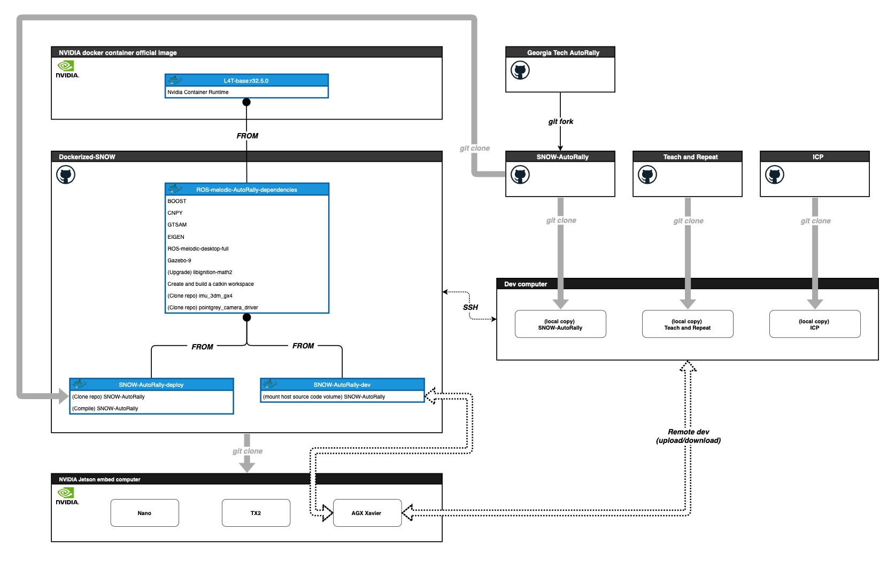

# /// _SNOW-AutoRally nvidia-docker_ ////////////////////////////
- Latest: `snow-autorally-l4t-ros-melodic-full`
- Base image: `nvcr.io/nvidia/l4t-base:r32.5.0` 

<br>

<img src="data:image/svg+xml;base64,PHN2ZyB4bWxucz0iaHR0cDovL3d3dy53My5vcmcvMjAwMC9zdmciIHhtbG5zOnhsaW5rPSJodHRwOi8vd3d3LnczLm9yZy8xOTk5L3hsaW5rIiB2ZXJzaW9uPSIxLjEiIHdpZHRoPSIxOTAxcHgiIGhlaWdodD0iMTE2NXB4IiB2aWV3Qm94PSItMC41IC0wLjUgMTkwMSAxMTY1IiBjb250ZW50PSImbHQ7bXhmaWxlIGhvc3Q9JnF1b3Q7YXBwLmRpYWdyYW1zLm5ldCZxdW90OyBtb2RpZmllZD0mcXVvdDsyMDIxLTA2LTMwVDIwOjU4OjExLjk3OVomcXVvdDsgYWdlbnQ9JnF1b3Q7NS4wIChNYWNpbnRvc2g7IEludGVsIE1hYyBPUyBYIDEwXzE1XzcpIEFwcGxlV2ViS2l0LzYwNS4xLjE1IChLSFRNTCwgbGlrZSBHZWNrbykgVmVyc2lvbi8xNC4xLjEgU2FmYXJpLzYwNS4xLjE1JnF1b3Q7IGV0YWc9JnF1b3Q7OXNSWmNQbFVfQk85STg0N2xRUU0mcXVvdDsgdmVyc2lvbj0mcXVvdDsxNC44LjImcXVvdDsgdHlwZT0mcXVvdDtnaXRodWImcXVvdDsmZ3Q7Jmx0O2RpYWdyYW0gaWQ9JnF1b3Q7YlRaSnQxbzBUNXN4aFRkeVpJeUMmcXVvdDsgbmFtZT0mcXVvdDtQYWdlLTEmcXVvdDsmZ3Q7N1YxWmQ5ckl0djQxWHF2UFE3STBPdVlSSSt6SWphUmdoRzM4MGdzRWtjVjhBVnRJdi83dWIwc0NnY0RHaWNla3VrOGZyTkpRd3g1cjE2NnZqdFRLYUhrK2EwL3ZyRW0zTnp4U3BPN3lTRFdPRkVWV2xHUDZRVW1VbHVpcWtwVDRzNkNibEVucmdrWVE5OUlIczlMN29OdWJwMlZKMFdJeUdTNkM2V2FoTnhtUGU5NWlvNnc5bTAzQ3pjZCtUb2JkallKcDIrOXROQU1GRGE4OTdCVWV1dzY2aTd1MHRKUi8vSHN2OE8reXFoVXB2VE5xWjArbkJmTzdkbmNTNW9yVTZwRmFtVTBtaStTdjBiTFNHMkw0TmdmbWJNL2RWY3RtdmZGaXh3dk5lVy9tZFBvWUZFVWF0anRFR1g3SXZqSU5zd3lhVEx4QmI1YU0zYUlkalBudnljK2ZnUmUwdWFJUnhvWXJ5ZXBjTnQzRmRIaCtjUlBjM2xqVDc4ZUdhUnBmNUZWZlZtMmNMNkpzQU9kaE1CcTJ4M1IxMmg0Ry9waEtoNzJmMU9EVCtiVHRCV08veGxlR3JGT1JOeGtPMjlONTBPRzNKVHkwbUUwR3E2R25lazVuay90eHQ5Zk43bWVEeWhlRDNzSzdTeTkrQnNOaFpUS2N6TGdkcWliaFg1UlRieHRwKytUc091RTdXVXV2YysrZDhUOVVYaHp1bEFJUHZkbWl0OHdWcFdOeDNwdU1lb3RaUkkra2QwOVNUa2lGNFZ0NkdhNFo2K1E0TGJ2TDgxUlcyRTZaMlY5OWVWWFpKZEc1UGZhcFY2dmFaSG16dWxLeHV0S08yaFIxczdMMmNOR2JqZHVMM2lrR2ZwNW5NZm9qMTgxMUVYTkJkcG5qd3oxc1BpbFAvMVcrZmZ0MjNEUm5paCtORmhQcFM2b2xIdHJEKzVTUlVpSEtjZFpkZTRvL0V6NVZUMEdIZ0NTM0JsNy9NWmtIaTJBQ2R1dE1Gb3ZKaUI1Z0lUaHRld09mZVNoSDVKLzhUKzRiNVpSVkY1TXBHSGMrVFhUTHoyQUp6anZsS3N0WnFaU1YwTi9kOXFKOXBKWlQyVG1iUC9oSHl1bHlSUDJ0L1BodUs3ZlJxZGE1WHQ1NzhUVHVqcnlTT2JxVHV0L0x4N1dvcEhaVjc3NGJXL2NkOVdKY2k4M1FNc29Qbm5vN05vUHNIU2xvZjcrVVBHUHlVS09udTVHdVdwSCs0STI4QjZ0ZkRxMUtDZDhNek85M2k4NjVIanZqdTNuN1dwLzlhRnhNdXQ4dlF5YzRlYUMzMU5yWWkydWpVblFiblN3ZGQ2RFgxT1E1cWtlNXZibUkyOWVsK3g4TmMxbnJWd1B6ZkRpZzkvSGRDTzJnOHRENzdsTWRnNUxaUHcxN0ZkUHZLc05COTl5bmEwdTJHcHBrb3kzOXFtN0hwbUs3cmNodW1INzcvR3A2cTl4SjlINWt1LzY5SGZzeTlTKzIrNjNJY3N1NmplK01oc091ZFBIUU02VEFpcHYzbHV1cmFCOTlSN2JpK3RLcGxHUDZ2bXk1VlozS2wxWmNqbXhqUUhWWlBqMVA3YTByOUUzNjNrQzEraTNaN3BzeXFUclpxV2lxWXpScFBDMkZ5cGFXTVpDb0w4UE82Q3pvbkRjWHJkRlp2NjEwbzQ1NmRYOUxkWGRHVjZwcFdETDFYMXZYYWE3cXlIMHpHV3RqR252blovMWJWd3E4N3hkRFQ3bUt1cU5tOENObzlYdm4xVzgvdmw5T3UrZkxZVHFXVXZ2bWNuN3Ixb01mb3k2MTRTcHEzVndPYnl1blFhOXhHbnJxNWNQdE5UMWZXZFBDNlZ2M3RsSDNiOGNYRDUzR3FYTTF1TGk3UGU4T2IrS0xhbTEwRlhweCtOQTlIMHJVRitLMWk4RFdXdTc4aEZva3RTdW5VL1NJL3phcUt2VWFMYkN0MkpkcW9GQWpqQnpEdkFjRlduRjVia1dhYXNmVmhSWFFiMzh3dHdNdHRneHpRYitoYlhqcDlZVlNjOHYzVkI2M0lpbXU5UzNWYW9SaHJVOGpIMGtLL1dwT1E0cHEvV2JvVkZiWDlHdXFUaVVaRWZQY0Ntc3U5U3B1NlRXcW4rclVhbTdyM3VvUDRwcEJ2NGF2WjlmMTJOTEFWVmJmbTlOL1JCVi9hUWRoN0JoMWF2ZEFwdmZwdTFwc1Z6YktOT29EVVhwNGJGWWxLbS9kMi8yNmxpdnZXeFVKRkZidGhpU2g3VFhpU3N2MWRQeFNtWVo3VG1QVjNvVmRZYzZiMDN0MHIwbGNFVkxmeTZHOXZrN2V1YWErR2VCZUw2cWhQUVpKa29Gdit4cCtiZGRhWFhQZkFrMmhmbExmQmpTR3BtNUg0VVo3N1VnakdsRzlzVTlqMkpLY3lwcG1LYTE5OUpIR2tzYlJ5dnFvV2NiWnhLcG91blVkRWkycW9jUHQ5VUtMTkN6UmJHbVBRdEE1dHVMV2d1aXUyUzZOU1VPTExNTmIwSHNodFdGTzl5UFFtcVIwQ1RwWkFlaEtiUnFCZm5SdFZHbThxdmRXUElod1RjOXBDVjJiK0RaSjI5MkVyNDNxTW10cnQrL2ZVMzlpNHNkN3gyMHRyL3BaZTZ1KzYxb3E4WmhLZmFYeDhFbmFyTkM1YVMyWVp2MkxDYldQTk1ZbDBZNzQwekNKRmlFOTQ4bFd4UHluMU9pYlZEZnhVQm5mbHBtbmFReElVdEVubVRURm5MNnh0RjNxSTMzTGNmMzB1bXRhc1VmajY4Vk94WHhZUys3cEhXazJ2MzFkTDVsai9udnBrRGFEVEZGYkl3ZDhpWEVpR1FBUDJVcTRSRDM4WGZUVEhjUU53eUxOcFVsT05ZeUp4alFXYUtjWkUxMUpjM1daUHkzd250RkVPV2xMOVA5dVR1TkpmRmtubVFvVmFxUG1VTjNnQmR1NG5UTzkrdGFDZUlEcXNLUnNiTnRFK3hyeGthV0ExcVFCQTI2UGJzV1hFNHUxcmhsMUtsSkV2RXlhc3JtdyswUUR3OWZjcEkwaGFXdHF0eW56T0h5ZkVEMU1oZm9ZOHJqMWZSWDhaMTF6T3lUSDdaSWVJTDdvRHlJTHZPUjZrSnVRWmFJYVJxUS9XRWVrUEt6WXh0bHhqbCtYcEU5SUZuSjlkcStvejFYcWMxTW5IcGRRcjgzalVLVytERFNTczdUc0VtWFVUN0lPV1gzbklkRkZnNldZYzUrbzNUUVcxQTh6SkpwRU5BWmtMYXhGZHE5aFZDVnFrMnk3dHhqL2lNY2YvRWJ0cGUrUVZSeE9jTjhLVnZLZmpDUDBIT2xSYW85Q1kwdHQ5ZEZXaklkT3ZEL25NZWludXRSbHZTYlZxQ3loTGQ1ckxVbEhiajFQc2xDUjZGNHpJbG5JNmsvYXhYd01mYkVhSXlYWFB4b0RzbWk1TnRJelM4dTFJQmZvTStsc0g3SUQ2MFgwSTUwRXZjOTZycTYxNGxUL2tudzZibE5sdmRzdnF6UzJFZE81RVNvOGZoRzFBL0lYUSs2ZzZ6d3VnN3h4WHdKWWZIOUJkVk5iNk5rR2JFUjlaS3AzZDA1MDJvY2VwM1lzV2EvMjY5QVhpUTZuZHkzVzJ4TGtDSG80dWE3NnEzNzNnbE03OVFTMGRBeElWdzVoeGFGN29uWXlwcEpOT2dMOFJIWkQ2UmpnbDVacUJXSENHMnViQTk2S2JPZ0s4RjdjbEtBdmFHem8yd09XbzVvQlhkVlVXekZvMTRJZG9mSzZqSEtIdkFaK3IwOGUwK3E2U21OazZWUi9CTmtrM1FyYWhvNTdSN0tCK2t6RlNuUWxaRm5tOFNKdmduVHJnbXhab2lkajZpdDVKdlNNQ2wyV3lVZ2o4MEJZRHFzcTIrUzRtc25uMHI1Tys1Zm9COTNxMzA2WW44aDJkZ01wS3pQWkR2VTkxYnFaQkxWWVMrZ1NMMFB5T2lhcFI4Si9XK3p0M1U0NzUySEpERWdQUzZaT2RLQXkwbjBEQ1RvNll2dm5rcTNzMTVjMmJMaFJSbnRJanN2RVYxWU1mb0crZ240Z2ZVcDlneDJ6dEN1eWo5QXBXZC9JYjVDWTVyQjdKQXNPNldQaWFScUhGdkZobmNhMFN2Y2xIWGJCSnJ0dmd6ZmR1dTdGUEk0a0R4NzF2YW1RLzdKK0pnYjlUWVg2dmt6c3lhVkIrcGR0RDlGSnBqYXBzS05zTy90Y0Z0SnpFbjEzUjlubGxxNGFwUGE0U3ZhQmVERHVLalFXMEtjS2ZLQkVubjM0U2VnVDhTTHNQR1FKZllHdXAvN0MvcEJ0NWI2UXZmRGc4OUE5b251WSttS3JaeXoyK0ZCSE1pYTVjVXY5TEtJOSsyQ1dudnlpTHZ3MnRleTZsZkNhNXJqVkJmTUNmNWRrUHk0VFAwUEdCOVFYa3IwSzVMWEorb3BrUUd2R1ZaU1JuU0U5QXQzVHIwdlV0aDFqNElFdlFVZlM3V1R2WWhvUDBoMVpXek9hdDFCdWtKMUF1NkJiV0taTTlpdFkzOEJIaWdmSi9UNWtqM1JsdjBuOEpzRzJnTDkxNGhHSjZtYytTT3duK1luVUx2SnBKT2dmeTdpbGNhekRyNUZvYkhnV1FuWnR3WDZVQWQzR25ydVc4ei9oejRYY1I5YTlQdlVaWTJzbGVnaStnV0ZoM0dqV2NFVjBnSzYwZE9oTTBtM3dLZUNqd1I4bVhRMC9STU16YzRmcnJhYlhkdCtHZmtIZEpDYzJ5VG43WjB6dkFmTnU4bnlkZUtKSjl6eHRSZWU0RHYyakpIcUdkSndCdm9lZlMvWThndi9LOWhnMlMwL3NTbFZ4cUUvUUtXVG5NTVkwRnI1RytrYm5QcERlNExiRUp2UXZkQlhSczc0cVMvejR1c2IyamZTMWcvcVlIaVFUYmhYOHlmU3hTVmQyaVZmaGw2M3REdWs4K09xR1JmWUwvTkpjV2dOL3hTK3N3MGwyVTk5Vnc5aVEzYjIyKzl4bk5lR1BlaktuY012TGhEL0tjWEpOL3ZnR2Y1Qzh4WFZxVDR0b0NmN2dNWUcrSVhvUUhXamM0UGZWb0VmNjhLMURzaStReldabWp5QnY4QjFpdWljbE5wSjRBWG9pcGpZWStIWlpzaFRtRCthNXhPYlY0NFEvU084MldMK1FUK1FuY3RXL3VIYkFINjRKWG9kdFk3dml3SmVCZjB6eWluNFR6WW12UXNnVytSM1E0NkF4N0JYUHRJa3ZRRWRmenMwNW9GL0pyMnFtOGdPK01WWG9FcDZSOXV0RWI0eUpwOWFwWHB2OU5PaTNjanIzcU1yczN6ZDR6R08ySFFVNnRISTJJZVJvd3c4ZklSSDhiMGZFYTMvODd6bGhzSzI0bEZxTVMrbnlWNzBZbVZKUDlvZkJOa0pTNi9qVHZpQm9UWE8vZE5yejNwRmFucW5LVi8xcjJvWmhNQjRrVDl3dEZnZ3hsL0ZsNVd6c2UxL0hEMEUzYUgvMUppTXE4TnFMOW5EaTQ2OHNlanJIYy93TXZUYlVGa2tGVDhkUGs5RFdJUUhVZk9nU1FTZnZMaGgyYSsxb2NvOFJtaS9hM2lDN09yMmJ6SUlZVFJ1bWNVNjZQY3NDbmNyeHhoTU52SmwrYzlhYjB6TS9NcUxMVzBWV2U3bnhZSzA5ejBKZ3hlRHRxRDN6Zy9GcEduL2JGWldWTzIyNXA2eml2TGs3a25SY0xaOFY0N0dyVU4xbVpGamREdjl1Qkliek1WNzFGVGxiMFRkWis3akkycXArOHZXNFZHUnVYWGsyY3g4U1hOM05jV29odW1vbmpLdElsZHhpd09YOWVCR01lb1hJSzQzR29rQ3o4U1RoMFJ5QjA2S3R1UC91R092bWFvQzJMcmxNeHdoRkUzcjM1NURKZWhkMHU3MHhyd2NzU0JiWFREZWRCT01GRDZKK1N2OGpDbFFrMGlZNk5ieEMxL0w2V2pmNDhSbXgxNWo2UXIxR1BUM2k2TEFIcmo2VVRiTFk5QUY4a3ZKRnRpeDJBRjlrano2REx3NWpnbEtCQnd4ZUVDSXg2WDVwMk01MU1lQytkeWxueDdwTmNYSG5UMTdLVWFVRDEzS09sVWZXY2c2bDU4NFZFN2xBendJQnUrMzUzV3E0eVV5UXRTUHh6UlpPVVhpM0dHWDJJaU94UjRORTJpQmRQc210cTZ4dVBMbndza2ZpMC9XYjBkTEg0dkhYc05jaGl6cVpmL1dEeGQxOTUwRGhLejJYY2s5N0g1cFNwSnYyZlBWOG1CaXFSVGtzMEszWDlYc1puNU82dXFOUkdyZUgxWFZwVHBKQXV2VXp0UW1HbWd2N3ZjVWlTcVdqZmIrWWJGSzdLSnpzTDVTeGhBNWFCek9QSytMU3MyQ1l2ZGNiZDdOblVtMVBKZWw5bHVQSi9jenIvU0MxUXNQVm16VVN0WkRlN04rUHBsbS8yak12SzBuYWVQeW9SWDhlZHlTdGVNelNwMXhBdmZON2orcjYxQWNGU1I3bHRsbHYyRjRFRDV0cEJJOHM0UDZBMlZwejZmSHhKcHRxMHBiZVNBYzJlZXM1UzdLSHNlWHhMclk4SGtMWmsyUWUrNGw1VEFxQzdRTG8zUTBPUHY2LyswbDI0OHVjNllzTUJQbDR1bHpmekgybFBZS0NHSGZtVTc2V3ppNGQ2d2lhYy90TzJxTFpkZ3VvejBrakNzV0Z4bEpacmtjN0pLK1dUQnNlMVkzYkdtNUUza2tpbVBDUzkzb256NWhscWZzVTNTcjNKYTNsS0o5ZHNrc0JTbC9UOTM2VlJiTkhKajkvem51dnduMlpPT2E0NzlKcGZCbjFocE51NEgwcGsvcTZiQStIMFpkdWIwcjZwamYyZ3Q3OE1YL2xaV2RPK3lZeDd6T2plblIrdEd0RzlRWXpwMmRiNWUyWjA0N2NHSFdYUDBWZTFpc1pacm5vVUowNlRzTTlxaWhIWlduai84WDg2UEZwdEhRd056d3lQOXBKL1ZjamZqSC9xR0wvYUFsS3Z6U2xzN0RIKzFGYUsxRDYzRzJVTFNIYXIwUHdieWZ2VGZCaThLdHFubGR0UWVxWEpyVXNhZTlOYS8xUlA3TGJtdytJTGw5KzN1TlRndnd2VFA0ZG9aVTNKdjl4VWJlMzQxNW5zb29MQ0hLL0hMbjFkM2ZhdmhYSS9VOXo2cy9hM2Q3L2pyQzIxeUhpY0hEeUN6Wm40TkhNeWd0UC9yVzQ0dVRkSGJ5VG9pcy82N1VYMkNuUkhuZnAvenYzd1JDL1dQN3kyb3RCTUVaN0o3TUI2Q0pXdjE1K2RpZTl1dzlZakc3K1V4bUNYb2lLVFNmL1M5UkJNTHIvVCsyTy92T1htdUNDRitjQzliMjl3MndwN2drdTRNSDBaNzNvUDY4OTZzM2EvM1Zud1FQV3h3Vkh2SFRVNTcwZHhtL0Z1V0dCekcreUdQY2lTMi9GSmIwL2JESHVXeHFpZmUzRk9DMkxSbWRyeHRuMUd5M0dmU3ZHcUQ3dVl0eWZ0L1MyMGdxL3ZmVDJSZm9xcVZKcGc1bFNEZk54RitPVW9nT045S0NOVmJpSEF2bkU0dHZuV1h6VHRwSU45QjNaVERzTjhTOGtMUjdJY3pzYzlCR1pWWEQ4M1dTK1dKc1J5R0FYUHcrVDRmMklKL3FiM0NsbTlvZnd6RXJJUDg4YTNiZmlBbTFCTDAySGswaW9wcytzbW41Uk0zMTcvbDZCQTdtdXVESzhOV2tVQ3VoWEZOQkttaitQQXBLVkhRSG55bVEwRFliQ0RyMFpHN3g3Qm9GU1hHWDZPMlpucnh3RklVYVpSVGZneEs5NmR0bEtHWk12ak9YR1ZYUzBOKzZSTTlUSFI4K0lyK1RlZVRMYXN0ZFVGZ01yUlZsSXVmN0owRWcyVzN3eU5KTEZVSjRNamF4bnBySzhPVEY5eHl6UmZkdjI5bXZVZlJ2M2tyMEU2YWE5eTE2MzFtdDNlN1BTTVZvRGxwdnhoNVN6eGF3SHZDYXVZSjBlOE5BYnJqL3Y1c2I4dnc0NWtJUGszcVBLUVZOelEzTVFPdG9xc1BIMzRhUEowZ0hiYWxZdTRRWkUyblo2L0d0dW45TjJoZU8yOU9PZnVOVkcyeGNIK3l4N2JZN2ZMNDVLQTMwRStNblo0Syt5eExrSnNycmJOTCtKMlR6T29FT2ZNcHNaaTcvY2lzSXpONlpURlRTVFJ5YUMyNk54VWFTMXRUdmN6dVhleVJ1NUo0M1Y4Yk9oUElXeE9ucHN5OEw3MjZyallyamlyN0JWeDc5QXp6ZXlWVThDODE3MEZ2TUpjcEI2b3c3UkJSSHUwZlIra2FVY1BFcnZFLzI1SXZ4R2FMemJncm9WS2kzajM5Y1YyQzF4bFNXNVNPTGQrTHY2SXdLYlZ2ZUo4WGQzODlHdW9NWjJIRjBBOEFvQVhnSEFLd0I0QlFDdkFPQVZBTHdDZ0ZjQThBb0FYZ0hBS3dCNEJRQ3ZBT0FWQUx3Q2dGY0E4TDRKQU8rSi90eFEyQnNpOEI0SVJsbmNpcFV0ZnMybjdmSCtkYmN3YlIzaXBoMGM3bFpZZVN1ZjM5QzltL1pEZ0FEcTNxeVlwSm85YTJ5YksyamhYYkRvTlhodnFHcUVzL2IwcUxoN0o3L3FWUWlaVHhCclhXRHdUNTZ4ZmViNVpGNkJUV2FwVXNXTXVWVnNjd09rOGdVd0tuZVRlUmRJNWN1UTJXNlBKMzg0T1ZlQUNoK0ZuS3NHdlFJOTNSdmxEeWVuK2szL1dPUXNxWVdoZlc1eXdaT2JDSDhsKzJBWkxITEpCM1RWeXQxWnB4N2dJc3M4V0dVc3JOSVhXa2NiNlF0N01oWnlXWDdlc0QyZkIxNWgxUXM4czFveExlN1d6TDIxbVU2NFA5TWhXMGY1T2V3dDArOXdEVC9hQ3l6OThQdUt0R1BWYkxWcXNuZDE3TW5NaUZMS2cwOW1SbVFXK3RVekl3N052ZDRQVUJyczFEczdzMmRmSmdkM000UG9zamVhTUxvRWI0dmJSaWo5NTM0Nm5MUko0WjBSQTR6eDUvOTJwL2s4STB0b2g5QitqSjJUcFpmY09mbnRKR1BXWDAxSnpWRDU5YzAzWG0vclpLbUlHL0VSTk9xQkd1dVhsT0ZlTFplcDhVeHg1eFR5MDJwOGRYR1lHbjlQalpvcHBuZlFxTHQzcngrZmJQb1pzcmFkejVBMHRiQjluVWF1SGVVZVM5WEEzb3BrU2RwMFVFOVMwT0t6UTE4bzZZKy9jS3pydi9XOExKV090K1E4NmVTTFNyMmM0WTU5T0xIZnp0N1pFTjNkQWxKd1kzYnJqbDkxdUo0REt2SHlQczNiQ0dCcCsxUVliU3ZGWjQvOHZSdy9maWd3OTBiais5SGZCQit4VWdjdjRnWEpXZ1pNL1p0ZVVNYjlyN0ZQeDREbis1eTB4ZEpuU1Z2Y3ppOSsrelJHV2RwR2F6alprY2U0TS9INDVPL0xZeXdWdCtpK1ZJVHFuK0dFOUFieitUVDZYNkxTdGlaN1cvdlZQbE04cS9Uc2VOYldWdjFkNmZEU20wWW5wU0p3eld2Ui9obm5rbXlTL3RlYWs5QlJ3dDd4THltOWNaTjFZakdTMm12elRwSUU3UEt5TisyMUYzODRLNnJLUitQRkhhZEovSTI4YUZaKy9PR3NkeXg5Tk5hVFBtWVE2b0Rva3Zib0JIRlhrR2ZMSHp2bGYxZmYzY0xTMk91TVBUM0RQRHBzZ3BsRlhqNUswRndxNHVHLzNyeXZNTC9jbmdnbWUySzlGRHpua1FuaFo0bUtiM245Sys0N2RLS1lTZXFMVEJSVldWYzNOTkZ2VGh1ekw4dWJrNEhOOTE5eUVybmJiMEZ0djR6R1FIT25YTS9FRHRlbjhnMjJacG9mRTQ1QmxuYk44YmFrLzAvYzQ1cHk4NmZhNU1vTzRHL0tjRW5JOE9FRVA5WStoUXp2T1BIeEw1SGh6MzZBc1N3WEtmVWg1aGUvbERaMDBKemtsL0ZRUHVKY1ptVkZEc0FVZTZQRGoyVk4wcjlLNjM4MlhVNTFlNnE4QjMyOThObDFuRHFMbk10YlgzcnRoVGhsZnhSSXpML2VmLzYxT3ZYekplWmZKL0pKT3YvNnpZVTZkWXRKWC9IWVpmbURob3FFS2o5UWxSOGFtRnJGbzE5ZmxjdVBxZklERDlJb2ZyYWthMTlMdVg4MlBydnllZDlNcjJlS1ErajFENm5YWHpLdWRsSTZlWmtFRFBVRlltZUg4dWNyNjNXZXhiN2VHc0N2cG9HdTdFYk9hanlWY3JwL2R2K09pajFMR0h2NlJDVGxqZFQ2ZGxLSXRoMHRPRmlUYjg5bjlRT1Y5L096VTdjbnptbGEzdjdzMU8yV1BmcDQ2WmVmM1VxVGZhV2sxQjNIK0h5UURSUENoRDF0d3BTWE5XSEs3MW13TnpCWm1UNFJVNUZQT1JVNTJHSmxDWHF2YnJGMGRYTXZ3QytIa1dSNUs0d2txOXZOZWZYNXh2NTl0MksrOGY3S090TmRMNktzUzBxV0Z2Q2I4NDN0RllCWFZON1owYjUvTG5yb3F5T0JybEJLYjI4dXByZjlRbjFKZWFEM096VE05THphdnI2VTJrRHU3RGZsV3I4c084WkF0NHc2VURLQkR3UDAwTW50OVhEYy9sNHZtZjJxWkFkYmlKK1ZNdU1PV2taWnN2dEE2NlIrdUlPbEhUZDFLNjVxUU4wRXhvbnQrcnJqMGpOQUVIV2JpaFdVbDdiUm9yN2VEcjJ4UGUwb0dyNS9ielZNdjNjdXo1MnhIYmF1N1NGd3JyelJGZHF0M05JOVQ3M1VPK2ZOa2psaXpLdUZONzZhMzdyVFlYZDBkZDlSTGdlT1lzL2JOK1ZpZVdTdVVUWjlzMUwyZjV4N2Z2Zjd4VjFuYkk4NjZzV0NhbHEwYmk2ajlvMC9TUkRqeW5QK3JTUm9kVFFxaXQwWXJQQkI4WTMwdjEyb25kSUt0ZE90cXdtS1VTZ2xLSUVYbHVVQ0NjdVM3ZDFsUU85YldrYVh5b0NtU0tQWldKVVp3RmV0OWMzY2M1NVBJdzYwTUtJT2xWV0FqTmhDR1pCcFFvdktHTzNOdUREQVpZd0VDYlN2aGdaTTFOQ0tnTTdYbXR0QXRqRk1GV1UySTlXZ0RLZyt6YmdPWE50QWk0Q1FtT0RBV2pxL0N6U2FSaWdENlluYTd5ZmZyeW9wS2haeEFkVUpEaVhPb0RxbEJOWElUNThib0wzQWFWVnQ0TFFTOXdIeGpQb1ZBYUhKN3Q5WlZKYWdjd0laajlHQ1VGWmRNdHBQRURLeW5OTzBVaVJBSUVneThwVm1WOG9Sa0hyQWdUV2diZldicXROQUdhUHBBYjBLYUVLaFU2VjNZNkI5cG1obC9hWkUvWkpzSUduMW0xeEdrc0JjektoQjdvRDZYd1Y2aitLdU9CdGxRSmp5VlpUeFdBQmxDdWhLY1JWakI3UXJrZ2FMeGhQb2tuV01jWnc4VjUzYk1hT0ZVZjhaVVF5b3JFQ05vLzUzVTNwWkdKTWw5WnZvNHhITkdCVXRJaG9BR1Fob2hoR1ZoWXdrNU5aWFpmWFlvejZXbHdrS1dCM29VRDYzczE4SHdoRVFsbFRxaDIvRmczdkxCUUpwZGNrSW5iRnQwQmloN1l5c1Jqd1cwUmpRYzR5U0dLTU1xR3hXZitBREtZN3VSVndHcERuampONEZ5aC9RbEFZeW8xbEc1UmpvbWpXRDBXdnB1UVNiMTQ3cjNIY2FKOGxsdXZsQVVWM3hQc2JaTm9nR1FLUjB5elMyakFaRzM2a3owcVUxQ0dsY3ROaHlhYXdaaWN1S1hNT1RHQ1dWZUNOQm1Mc2xHVElaSFlwNXFGZ1d1Z21xcE9RUUQxalZNRUc0TkpoSGtucUNndFk1OWtiZDRGOUdLUE5VOU90ZmR6RnFYeS9udFpzTG1aNDc3b3hLOTczUlZkU0o1MnVrcG1pbEwxajNKT2lrcE5sY0MxcFc4a1puOTU1eVM5WkFvbnJrTzlKTjAxN0ZaeFF5Umt5dE1Db1lhZG42cXIvL05yYTFXbDRya2QxaGpYUkwwbnRRRGZSYmN4bURqRFRHVGsyMy9zOVlScmZYdHJTSlJXaVNQZ2VpZERWS3NHa0hLZUkwNDZFdE4reU5PMENadG1WZjlBUmpjdCtJQTU4VEdGbm0wbW9NdnQyT2h2Tk9SWTY2MTh1aE05SWZPdVBwMEJ1ZGZET0RrLzJqa296Lzk0dGhTNjNuRVdJallGbXpSWFBOT0VIMG9tc1hsaEZvaUNSM0I3YmVxZXhyUFJEZXFqcjBHOG5jMUZFMkxCaFpLZjJZck53RFdhcUhKMForQndwa0swTjhYS0s5SkpzOFNxUmpWVnNLYzJVSktwbnJWb0hlR1lHWExFWW05VWkrMW1VMjg5a1oyUzRMeU1FS3l4TWp0Y0ltcmNwa3h1NXVVcDFBKyt3ekt2UzZ6bFhacXM2WUVRcGpNMS9ucW14ZFp4MEljUktQMDZyT1ZWbFM1MzVQWUQyTzFBcHZWSnBSV1hTcm1CUGJaYlRKdVdQVXA2dDdEVG1sNlFRSWVJcjMzVCtFZXphazE5UU9sUzFnYnBLbVZ4NlYyaDEwRm5SOUk3cFdTdU45a3Zmb3ZVMXRmb2l1WFFCVE1MRkd3RzZHeGJISUsvc2xuUXU5bXZyNzA1d0hhbWJJLzB1TDlXOVRwMnVkcnFIZGxoanA5UWtBYTgyVlEvd0hOck5HK3BaMHVDMzFTTWRTbld6bG5QSEZ1Qlg0aktrTUw4eHlxNytqelhiMHFiNnZUOUtlUHNGalZNaUxwYloycDdmZkx5ZnI5dnVrR2UrRzdldnVwTHVwdWVQdTkrRWM2UDlzUjR5RW15eHdzUXVNWUdBNi81Nk5LYUNRa3d4V01acjBoZUhJR1FuOS9USDBON2RHdVlyYTE2MWpvZGYvUUhvL1g2K2YxQlJ2MTFlTjVUalZWTEtuTkdNKy8rVHBHTUlpODlmWGM0cjltbjdGblNPUDVsTUZmVEdtT1NHVlhVYXRhejIrSFpXaURtbXd6dlVaamM5USs1ZFJqQm50UHJFeUIzUG1Mbzg0OGVkM2FhdFA3ZWNiKzNwVjM5TXJFeWQ0cUJ6NU9zaGkrdnNzSnRDTGx3N202SDFMZis2YzhmRjRrNm53UEhWRGk2WDlEYktUTDZxd2toRWpYK2QwU0ZhMmxtZFRaMzJ4SWMrcnNwd09BZm82MEs3ek9pUXJXK3NRbTNYVVlFT0haR1U1dlFWVTljU2JXT3V0ckd4Vkp5TmZjL3hpWGVlNkxLbXpZTmwzY0E1eFhkUlJGc09VTHJJZGhTcjlwOW1Wd2VwZTdTYnhKQnpFWGR6YnNHYzhUWmRzeHQyOXNZY1c0akpiWGt4YWZxajhaaDdpMU93L1d1K0d2eUZvL1RhMDNtTWhEcnE3d1NkeHVlRHRwdVZQOHduUTFJMHNZaE5HeVFrT3Z2cXIrdDc2SS9YOXZsNTljbjBmQ1gzLzNqcGdTOS9IUXQvL3ViVCtKWDF2aEErM1Q4Zi9sVU5ubXMrUCt4ZThRc3dxRHB1MXdMb2N5cEVuM3VpcTM5M1VVQnhSMzZXaDBLYWRrZllJMnJSNmFBeEgzUnZEd2RsZXlheDErVnRhdDlnbmFWK2ZQdm5xZ2JRbjNxYXNWN0ZoRlUxOVU0cFhaV3ZOZ2RVNit0NW1OQ01yVzJzT3JDWW5zYysxNXNqS2Nwb0RaOEVwVG1ORGMyUmxPVzJGMVY5dk00S3lLbHZWaWRYbkNPZm41T3BjbFNWMVZndVd2TWczQytLNWk0ZTIwdHkxQ3BqZFc2U2V3ekd2ZEk1UHRRUG9rbzhzUkk1UjMvWmFrdkpEWmRjNGNCMXYwOE1RdEg0VFd1KzJDay9mMjR3K1djVklSbEorQUkvVStDeWpKRHFFczFqNXJDVEQrelU5WDRpZi9nRjZmaytmUHJtZWw0V2VmMi9aMzlielRhSG4vMWhhUDEvUDcxdVBhQ25McVhlV1cxRWNsdnFkODJGb1BUb1RLTVlOTEMyVGRPVDhjUTVWRU9LVVk4NUZUSDlWcXhuR3lZbW55RTlEVGxjVEoyUEdOQ3BFalphQ0hDNk1MbWtvenVHeVlwb2Q4c21uT0ltUjNxYzd5S0dqdWR2Y0FiVmNhMm5pdE5SK0hhZnA2WHphcXVIN21OOWg1VHZOSDlQdC90Q2lhNXp1S25NK1d0VkNMaDVSSHFmdUl1OFBVYVF5Y2lZNTc4dmlVNGFia1lXeWdLaUNFNC81cE5xcTV1QmRXQnJrZGJrNDhkV1hUYzc3TXlVK2tSR25yc2FlanhNUExlU2ZVWDFPaFdZNzhaWEJKOVh5U3JDVnJwYVhreFBJTWRkMTY4c2szdzd6VXhvYkY1bXpmRG9mNXF2SXU2UTZXalJMUXgwNFViUVZtY1RGZkpveWN0VndBcVRiVk9xeEdTZW5XRnVjNDJiemR6bjNrTnJTNGhQWU9lK3dBcHFnYnpReWZUNUZrYWpPSnkzVHVBeVFONmp4R0pERVd0eCs1R0dhdkQ2R1V6VnRQa1h3eXVKM0RlU1p0alRrUDNMZVc0TnB2a1NlWGNvTDBYV3drNnRwaG92TTJ0TTZMTW11K3pUclpJNnMzVENYWW00YmRTcCsveWJKeUYwK1BtZmQwRXRKNjNIK0o3TDVOQnFwS0RzLzA4YTU4MFpMNGhHbGtlTHp6bkcrcDF1V2taSHFKT2NqOGptYk9QOThsYm1Lc3pkam5IZHBKcG1yeUdyRXlMdklDT1ZzMW1WU1JoelA1N2kyZEx5Ym5OOXNNdFdvYnFxamluTk5kYUpXa3JucGtuOUNOajdKRG0ydXlsd0Q1eExqRE4vQjBpWnA0TE50aVh0WUdraXZtSHdmK2RRa1NjdzV0MFFobkRsS1pZTXdzdms4V09KdUhvT21hZzhzMG1rNDA3MktERWp5SVhCT0pESmF3V0VtVm0xRFBqdVV5eERWOEtodnlJRDE5TDMrRTB0TGNuNjIvZnk0Njk3WXhwcFBVa3YzazdVWGVhdDcxenlMdVJJU3ZOZ2t0dVVwNEZ2T1VUYnVMQjc1N0RjK3N4TGRoRjU0Ukczb29DWk9NMVl0bkhEYmIvbDhIem5BVEEyY3M4cTZpMlFDMUVLdWF4MG5sQkkxZkx4TE1rbjMrVFRoNnR6aFU4Qjlra09zWitNMFVaSnA1QVM3TGQwMTZxUWJxaEgwZ09XZUdzaXhKWDJoc041S01tZDh4R3VzdUpxVVJYeVN2YytuNGJvdDVOSHl5ZCtPY1djZzU5VEJhY0FvUThTbGdkeFVXREVmdWdzblRCT1hnZXJJblUzMENubnJjajF1b1Uvd0dPUFVxL2I1VkdUbUNGakM4akk1SmJpK1RFOGJUVTc5VFhTWW5wd0l6RHBUWTMwQjd1SFR6WEh5ZVF1NTF6STRENmNFRTNkVG0xdklwY1ozSSs1dmczUExTZXJLNEZqbU9QUU5PYzk4bWk3c2g4SDV4WkF3UGtXVnhub083cWIySXc4NlltdmF0ekp1bFYwRDc0WVI2U2ZGcWF6MUUyaHU4YW5lQ1M5WXc4bnUzTnBLWWhtYmJPOTJ4OTZZSHlzeWU4WHNjWTNDaVNtbkZ2V3h0Zm1ObUNzazJOZmRUSkpaYXZtMFZzNE54d211em82OGg0NTZldGRTaGxMUG5YQys5ek05L1AyWkNldGVweFkvMWJ6eDNqbmRqamtDcjQ0bm1TbHNEVndEMGdkcmdYUFhzMTl2NmJLMWIycWNyZDYwMkZ0Zy9ZeHpnY2xEU0x3QmtwZ2ttNTM4QTRzbEVSU205NGxEK0p4MW1rK0ZHcjhiVnptYlBEbjNHenNYeWhweEZYdzVyR2poL0hJRjV5ODd6VkJpVzlBSFYxZkRlb3hzOXlwSkxLU2ltc3dYT2N1Q3M4Q1hWbnJHcjhubms3TkZYT0pzWHB4TlQrL3lEZ21ieXppVDNjY1o0Rlp5WGpZc3RncHZ3MG5QWWs2a3hGZnRwcVZ3bi9EOU9GMERNL3dJMnNCcFpGNEFuOWN0MGRnc1lXUFNNN2haSWgxNEJhU0pVbytEdUIrN0h5RGxMWG05ZytPV3JEMnk0a25QSjFueE1uKzN6LzBsZXdSYmhwMFVwUGNURzZIZ0ZPM0VSdUE4WnJZUmNiTHJnVzFFbE5vSTlDbTFFYTNVdnBEWDFnenhMcnlBSmRtNm5MU3RQSVdVRnk3YSsrMUJ6a3ZkbXoyVDdzOWg2Y1FLeWNYODM0cWRXZ2hyZi94aE8ydUtkMkZZS284cGVUMU8wNEpYcVdDSGlnWEo3R08zVGxtM0t1bWNCQjRsTW0vSWs4UHVrcFNlQ3AvaFBnaWxSSXVUVmVGbkljR3N4VW56d1h1RTErVS9Za2Y1ZlBTWStJakc4Tm01a00rWGFPbDVFbDBYRWkwaytwMGt1bjZvUkNQYjdEN2RTNlpiTWZaNUliTFI1TDFWOExmWWsyL0FYeG53YWVuSnZpenNsNEtIRGlrdG85ODA1eXRqWGtSamdTeGU5cWNVK0ZqZ0xlSTM4TytTTTY3N0EvTG00Zk1OWkRzcmkrdjBUZmc5M3RMSi9DemlVL0t6TUg5TWVjMUw2MjdKdkE4dDViWGtlelQrZlROOXQ4bHRxTWVnVVZOajNvTHZGMk0rQ04reGpqVlhuZmQ2dWFiUC9oVGVUMllOSVdtbG1PZmkyRHVHMlVGY3ovc1d1UmxETTNRUmhjWDhyeHB1ajJON3g1cnBBOUdxMzc2NTFCMmNSRy80TCtYNTcvRGkxOWtJa09CVzZpMTdQT09ta1NHTzl2UlVNakZUOTRrQ0dIRTFMZFBKV3lhUGxpVFlTS2laZUxsV01lTUNyUjQxOS9ia2VhdkNwR0crbjJxNXJGUHNyeDIybExPUTNuL29YdXVEZmJxOEdIR3BhK3ZZYWhrYVJWMUZPOXloa1M5ek9CN20rNDVMM0J1YnJFMHN6RVJvRnVPQXcrS3l0QzY3TlJ4b3dyNHZiVDdIZGxIWi9ONjZMS3MzWDhiejJVb1o4MXFTRkhCWkdiTWQ0c3l5VHMrclZyNXNZT2tPSkk3bmpxdm5pTE14NjJBcGpMR3pFeEVTNXV3b216RTE5ZXU5TytsbzdvMFlKR3h0di83c1dQNE92cFBYczBkRVk2b1J6NW9RV1lyTFpDVmdqVm9TNzZvMFlFMHdIMGVabFQ2SG1VMFova1JNV2pYVkxDM3VlNjVNNW5rNWpadUQvYy9zSjhDaW1lVDFjeG52RmwyVk5YbmNaRVRFY3M5UlhaREF1bDVMZG5BU2JTeFltbkRkRnN4ZW15ck4zckRiVmliZVQrc2VMTFAzYmF3cEpMU1ZlRWNudjk5S3RGQTY5dW43U3RvbVBSa1RibWV5QjRXMW84LzlXZE04TGF0U3YySFZESFBqT2FLdjZ2QnNjdjI5WEJtc3U0eCs1OG9reUxzTnZscDlEL3dDTGJyQmEwbVp4T01kYlpSRjVjVFBNNnBwR1hrS0VmZGptZEtGeXF6UU9adnN5OHJha1AzbmFyNGQvcFc3bWpHUjNSN3cvbWVMNTRLWXo1cnF1Z3kySEh1blliL3d5L3VLRVd2UXNGL1k0YjNHMkFlTTNCaFBRd3pEZ2IwekVQY3oyU2F4dlVCMDI2MWp2elM4WE5JU1BzY0hZUGZnaHlDZnNNYStTem1HcitMd1BscEVzd2VJcE1mWVA4eDdyZzJQMjBHMkN4RXN4QnQwekt0aFc0bmp5T2F4WjQxOTF2Q2lKUWY3dXpuZU9pRE5raThETjFyd2FUU1VzWi9EV3ExSi9wR3Y4WDd3cUt4d0pnbkhWQkNwdDN6ZUgyMllTcTZ0OE1zMGVQQ093YkZaeEFkZ05lRDNyZnZOZHBWOFA0TXNCMktoa2dWTHdYR0ZiQXdUL3pNL3ptV3F0NHkrUnZ1OCtJMzlCb2Q2OEhsTEdJY1Bubm83L3VFRFhrTGRmZFRqczVIWTFTMzhtUlZJUmc2NFcxVy9abWQxYmtDeGwvWmpmZndlZHJlNjYwQVlBZFFoZ0RvRVVJY0E2aEJBSFFLb1F3QjFDS0FPQWRRaGdEcmVlK092QU9yNE0ra3FnRG9FVUljQTZ2ano1VndBZGZ4ZDlCWkFIUUtvUXdCMWlNMjhBcWhEMEZvQWRUeWk3d1ZReHlmUzl3S280OTExZ0FEcStIdG9MWUE2QkZDSEFPb1FtM29GVUllZ3RRRHFFRUFkbjFMUEM2Q09kNWQ5QWRUeDk5QmFBSFVJb0E0QjFDR0FPZ1JRaHdEcUVFQWRBcWhEQUhXSWJmMWlXNzhBNmhCQUhVS2kvdzZKRmtBZEFxaERBSFVJb0E0QjFDR0FPZ1JRaHdEcUVFQWR2d2ZVb1g1VFB3QlF4N0VBNmhCQUhRS29Rd0IxQ0tBT0FkUWhnRG9FVUljQTZqZzRCVXRzOUJaQUhZS3VBcWhEQUhVSW9BNGg1d0tvUTlEN2QvUzZBT29RUUIyZmJlTzJBT3A0OTgyOEFxamo3NkcxQU9yNExQcGVBSFVJSFNDQU9nU3RCVkNIQU9vUVFCMENxT05qYnVvVlFCMS9ENjBGVU1lSDEvTUNxRVBJdmdEcUVMUVdRQjBDcUVNQWRRaWdEZ0hVSVlBNkJGQ0hBT29RUUIxaVc3L1kxaStBT2dSUWg1Qm9JZEVDcUVNQWRUenF4UXVnRGdIVUlZQTZCRkNIQU9vUVFCMENxT1A1UUIyeXNnblVjU0o5QktDT2J3S29Rd0IxQ0tBT0FkUWhnRG9FVUljQTZoQkFIUUtvNCtBVUxMSFJXd0IxQ0xvS29BNEIxQ0dBT29TY0M2QU9RZS9mMGVzQ3FFTUFkWHkyamRzQ3FPUGROL01Lb0k2L2g5WUNxT096NkhzQjFDRjBnQURxRUxRV1FCMENxRU1BZFFpZ2pvKzVxVmNBZGZ3OXRCWkFIUjllend1Z0RpSDdBcWhEMEZvQWRRaWdEZ0hVSVlBNkJGQ0hBT29RUUIwQ3FFTUFkWWh0L1dKYnZ3RHFFRUFkUXFLRlJBdWdEZ0hVOGFnWEw0QTZCRkNIQU9vUVFCMENxRU1BZFFpZ2p1Y0RkZWlhOW9aQUhYUTVtMHdXdVh2bnMvYjB6cHAwZTNqaS93RT0mbHQ7L2RpYWdyYW0mZ3Q7Jmx0Oy9teGZpbGUmZ3Q7Ij48ZGVmcz48Y2xpcFBhdGggaWQ9Im14LWNsaXAtMzMzLTE2NC0zNTEtMjYtMCI+PHJlY3QgeD0iMzMzIiB5PSIxNjQiIHdpZHRoPSIzNTEiIGhlaWdodD0iMjYiLz48L2NsaXBQYXRoPjxjbGlwUGF0aCBpZD0ibXgtY2xpcC0zMzMtNDA0LTM1Mi0yNi0wIj48cmVjdCB4PSIzMzMiIHk9IjQwNCIgd2lkdGg9IjM1MiIgaGVpZ2h0PSIyNiIvPjwvY2xpcFBhdGg+PGNsaXBQYXRoIGlkPSJteC1jbGlwLTMzMy00MzAtMzUyLTI2LTAiPjxyZWN0IHg9IjMzMyIgeT0iNDMwIiB3aWR0aD0iMzUyIiBoZWlnaHQ9IjI2Ii8+PC9jbGlwUGF0aD48Y2xpcFBhdGggaWQ9Im14LWNsaXAtMzMzLTQ1Ni0zNTItMjYtMCI+PHJlY3QgeD0iMzMzIiB5PSI0NTYiIHdpZHRoPSIzNTIiIGhlaWdodD0iMjYiLz48L2NsaXBQYXRoPjxjbGlwUGF0aCBpZD0ibXgtY2xpcC0zMzMtNDgyLTM1Mi0yNi0wIj48cmVjdCB4PSIzMzMiIHk9IjQ4MiIgd2lkdGg9IjM1MiIgaGVpZ2h0PSIyNiIvPjwvY2xpcFBhdGg+PGNsaXBQYXRoIGlkPSJteC1jbGlwLTMzMy01MDgtMzUyLTI2LTAiPjxyZWN0IHg9IjMzMyIgeT0iNTA4IiB3aWR0aD0iMzUyIiBoZWlnaHQ9IjI2Ii8+PC9jbGlwUGF0aD48Y2xpcFBhdGggaWQ9Im14LWNsaXAtMzMzLTUzNC0zNTItMjYtMCI+PHJlY3QgeD0iMzMzIiB5PSI1MzQiIHdpZHRoPSIzNTIiIGhlaWdodD0iMjYiLz48L2NsaXBQYXRoPjxjbGlwUGF0aCBpZD0ibXgtY2xpcC0zMzMtNTYwLTM1Mi0yNi0wIj48cmVjdCB4PSIzMzMiIHk9IjU2MCIgd2lkdGg9IjM1MiIgaGVpZ2h0PSIyNiIvPjwvY2xpcFBhdGg+PGNsaXBQYXRoIGlkPSJteC1jbGlwLTMzMy01ODYtMzUyLTI2LTAiPjxyZWN0IHg9IjMzMyIgeT0iNTg2IiB3aWR0aD0iMzUyIiBoZWlnaHQ9IjI2Ii8+PC9jbGlwUGF0aD48Y2xpcFBhdGggaWQ9Im14LWNsaXAtMzMzLTYxMi0zNTItMjYtMCI+PHJlY3QgeD0iMzMzIiB5PSI2MTIiIHdpZHRoPSIzNTIiIGhlaWdodD0iMjYiLz48L2NsaXBQYXRoPjxjbGlwUGF0aCBpZD0ibXgtY2xpcC0zMzMtNjM4LTM1Mi0yNi0wIj48cmVjdCB4PSIzMzMiIHk9IjYzOCIgd2lkdGg9IjM1MiIgaGVpZ2h0PSIyNiIvPjwvY2xpcFBhdGg+PGNsaXBQYXRoIGlkPSJteC1jbGlwLTU0My04MzQtMzUyLTI2LTAiPjxyZWN0IHg9IjU0MyIgeT0iODM0IiB3aWR0aD0iMzUyIiBoZWlnaHQ9IjI2Ii8+PC9jbGlwUGF0aD48Y2xpcFBhdGggaWQ9Im14LWNsaXAtMTIzLTgzNC0zNTItMjYtMCI+PHJlY3QgeD0iMTIzIiB5PSI4MzQiIHdpZHRoPSIzNTIiIGhlaWdodD0iMjYiLz48L2NsaXBQYXRoPjxjbGlwUGF0aCBpZD0ibXgtY2xpcC0xMjMtODYwLTM1Mi0yNi0wIj48cmVjdCB4PSIxMjMiIHk9Ijg2MCIgd2lkdGg9IjM1MiIgaGVpZ2h0PSIyNiIvPjwvY2xpcFBhdGg+PC9kZWZzPjxnPjxwYXRoIGQ9Ik0gNzkgOTYgTCA3OSA3MyBMIDkzOSA3MyBMIDkzOSA5NiIgZmlsbD0iIzQwNDA0MCIgc3Ryb2tlPSIjMDAwMDAwIiBzdHJva2Utd2lkdGg9IjIiIHN0cm9rZS1taXRlcmxpbWl0PSIxMCIgcG9pbnRlci1ldmVudHM9ImFsbCIvPjxwYXRoIGQ9Ik0gNzkgOTYgTCA3OSAyMzMgTCA5MzkgMjMzIEwgOTM5IDk2IiBmaWxsPSJub25lIiBzdHJva2U9IiMwMDAwMDAiIHN0cm9rZS13aWR0aD0iMiIgc3Ryb2tlLW1pdGVybGltaXQ9IjEwIiBwb2ludGVyLWV2ZW50cz0ibm9uZSIvPjxwYXRoIGQ9Ik0gNzkgOTYgTCA5MzkgOTYiIGZpbGw9Im5vbmUiIHN0cm9rZT0iIzAwMDAwMCIgc3Ryb2tlLXdpZHRoPSIyIiBzdHJva2UtbWl0ZXJsaW1pdD0iMTAiIHBvaW50ZXItZXZlbnRzPSJub25lIi8+PGcgZmlsbD0iI0ZGRkZGRiIgZm9udC1mYW1pbHk9IkhlbHZldGljYSIgZm9udC13ZWlnaHQ9ImJvbGQiIHBvaW50ZXItZXZlbnRzPSJub25lIiBmb250LXNpemU9IjE0cHgiPjx0ZXh0IHg9Ijk1LjUiIHk9IjkwIj5OVklESUEgZG9ja2VyIGNvbnRhaW5lciBvZmZpY2lhbCBpbWFnZTwvdGV4dD48L2c+PGltYWdlIHg9Ijg4LjUiIHk9IjEwMi41IiB3aWR0aD0iNTEuNSIgaGVpZ2h0PSIzOCIgeGxpbms6aHJlZj0iZGF0YTppbWFnZS9zdmcreG1sO2Jhc2U2NCxQSE4yWnlCNGJXeHVjenB6ZG1jOUltaDBkSEE2THk5M2QzY3Vkek11YjNKbkx6SXdNREF2YzNabklpQjRiV3h1Y3owaWFIUjBjRG92TDNkM2R5NTNNeTV2Y21jdk1qQXdNQzl6ZG1jaUlIaHRiRzV6T25oc2FXNXJQU0pvZEhSd09pOHZkM2QzTG5jekxtOXlaeTh4T1RrNUwzaHNhVzVySWlCMlpYSnphVzl1UFNJeExqRWlJR2xrUFNKemRtY3lJaUI0UFNJd2NIZ2lJSGs5SWpCd2VDSWdkMmxrZEdnOUlqTTFNUzQwTmpBd01qRTVOekkyTlRZeU5TSWdhR1ZwWjJoMFBTSXlOVGd1TnpnMU1EQXpOall5TVRBNU5DSWdkbWxsZDBKdmVEMGlNelV1TVRnM09UazVOekkxTXpReE9DQXpNUzQxTVRFNU9Ua3hNekF5TkRrd01qTWdNelV4TGpRMk1EQXlNVGszTWpZMU5qSTFJREkxT0M0M09EVXdNRE0yTmpJeE1EazBJaUJsYm1GaWJHVXRZbUZqYTJkeWIzVnVaRDBpYm1WM0lETTFMakU0T0NBek1TNDFNVElnTXpVeExqUTJJREkxT0M0M09EVWlJSGh0YkRwemNHRmpaVDBpY0hKbGMyVnlkbVVpUGlZamVHRTdQSFJwZEd4bElHbGtQU0owYVhSc1pUUWlQbWRsYm1WeVlYUmxaQ0JpZVNCd2MzUnZaV1JwZENCMlpYSnphVzl1T2pNdU5EUWdabkp2YlNCT1ZrSmhaR2RsWHpKRUxtVndjend2ZEdsMGJHVStKaU40WVRzOGNHRjBhQ0JwWkQwaWNHRjBhREUzSWlCa1BTSk5NemcwTGpFNU5Td3lPREl1TVRBNVl6QXNNeTQzTnpFdE1pNDNOamtzTmk0ek1ESXROaTR3TkRjc05pNHpNREoyTFRBdU1ESXpZeTB6TGpNM01Td3dMakF5TXkwMkxqQTRPUzB5TGpVd09DMDJMakE0T1MwMkxqSTNPQ1lqZUdFN0lHTXdMVE11TnpZNUxESXVOekU0TFRZdU1qa3pMRFl1TURnNUxUWXVNamt6UXpNNE1TNDBNamNzTWpjMUxqZ3hOaXd6T0RRdU1UazFMREkzT0M0ek5Dd3pPRFF1TVRrMUxESTRNaTR4TURsNklFMHpPRFl1TmpRNExESTRNaTR4TURsak1DMDFMakUzTlMwMExqQXlMVGd1TVRjNUxUZ3VOUzA0TGpFM09TWWplR0U3SUdNdE5DNDFNVEVzTUMwNExqVXpNU3d6TGpBd05DMDRMalV6TVN3NExqRTNPV013TERVdU1UY3lMRFF1TURJeExEZ3VNVGc0TERndU5UTXhMRGd1TVRnNFF6TTRNaTQyTWprc01qa3dMakk1Tnl3ek9EWXVOalE0TERJNE55NHlPREVzTXpnMkxqWTBPQ3d5T0RJdU1UQTVKaU40WVRzZ0lFMHpOell1TnpNNExESTRNaTQ0TURGb01DNDVNV3d5TGpFd09Td3pMamN3TTJneUxqTXhObXd0TWk0ek16WXRNeTQ0TlRsak1TNHlNRGN0TUM0d09EWXNNaTR5TFRBdU5qWXhMREl1TWkweUxqSTRObU13TFRJdU1ERTVMVEV1TXpreUxUSXVOalk0TFRNdU56VXRNaTQyTmpob0xUTXVOREV4SmlONFlUc2dkamd1T0RFemFERXVPVFl4VmpJNE1pNDRNREVnVFRNM05pNDNNemdzTWpneExqTXdPWFl0TWk0eE1qSm9NUzR6TmpSak1DNDNORElzTUN3eExqYzFNeXd3TGpBMkxERXVOelV6TERBdU9UWTFZekFzTUM0NU9EVXRNQzQxTWpNc01TNHhOVGN0TVM0ek9UZ3NNUzR4TlRkSU16YzJMamN6T0NJdlBpWWplR0U3UEhCaGRHZ2dhV1E5SW5CaGRHZ3hPU0lnWkQwaVRUTXlPUzQwTURZc01qTTNMakF5TjJ3eE1DNDFPVGdzTWpndU9Ua3pTRE14T0M0ME9Fd3pNamt1TkRBMkxESXpOeTR3TWpkNklFMHpNVGd1TURVMkxESXlOUzQzTXpoc0xUSTBMalF5TXl3Mk1TNDRPR2d4Tnk0eU5EWnNNeTQ0TmpNdE1UQXVPVE0wSmlONFlUc2dhREk0TGprd00yd3pMalkxTml3eE1DNDVNelJvTVRndU56SXliQzB5TkM0Mk1EVXROakV1T0RnNFRETXhPQzR3TlRZc01qSTFMamN6T0hvZ1RUSTJPUzR3TWpNc01qZzNMalkwTVdneE55NDBPVGQyTFRZeExqa3lNbXd0TVRjdU5TMHdMakF3TkV3eU5qa3VNREl6TERJNE55NDJOREY2SmlONFlUc2dJRTB4TkRjdU5UVTJMREl5TlM0M01UVnNMVEUwTGpVNU9DdzBPUzR3Tnpoc0xURXpMams0TkMwME9TNHdOelJzTFRFNExqZzNPUzB3TGpBd05Hd3hPUzQ1TnpJc05qRXVPVEkyYURJMUxqSXdOMnd5TUM0eE16TXROakV1T1RJMlNERTBOeTQxTlRaNklFMHlNVGd1TWpneExESXpPUzR4T1Rsb055NDFNaVlqZUdFN0lHTXhNQzQ1TVN3d0xERTNMamsyTml3MExqZzVPQ3d4Tnk0NU5qWXNNVGN1TmpBNVl6QXNNVEl1TnpFMExUY3VNRFUyTERFM0xqWXhNeTB4Tnk0NU5qWXNNVGN1TmpFemFDMDNMalV5VmpJek9TNHhPVGw2SUUweU1EQXVPVE14TERJeU5TNDNNVFYyTmpFdU9USTJhREk0TGpNMk5pWWplR0U3SUdNeE5TNHhNVE1zTUN3eU1DNHdORGd0TWk0MU1USXNNalV1TXpnMExUZ3VNVFE0WXpNdU56WTVMVE11T1RVM0xEWXVNakEzTFRFeUxqWTBNU3cyTGpJd055MHlNaTR4TXpSak1DMDRMamN3TnkweUxqQTJNeTB4Tmk0ME5qZ3ROUzQyTmkweU1TNHpNRFFtSTNoaE95QmpMVFl1TkRneExUZ3VOalE1TFRFMUxqZ3hOeTB4TUM0ek5DMHlPUzQzTlMweE1DNHpORWd5TURBdU9UTXhlaUJOTXpVdU1UZzRMREl5TlM0Mk1qbDJOakl1TURFeWFERTNMalkwTlhZdE5EY3VNRGcyYkRFekxqWTNNaXd3TGpBd05DWWplR0U3SUdNMExqVXlOeXd3TERjdU56VTBMREV1TVRJNExEa3VPVE0wTERNdU5EVTNZekl1TnpZMUxESXVPVFExTERNdU9EazBMRGN1TmprNUxETXVPRGswTERFMkxqTTVOWFl5Tnk0eU0yZ3hOeTR3T1RoMkxUTTBMakkyTW1Nd0xUSTBMalExTXkweE5TNDFPRFl0TWpjdU56VXRNekF1T0RNMkxUSTNMamMxSmlONFlUc2dTRE0xTGpFNE9Ib2dUVEUzTWk0M056RXNNakkxTGpjeE5Xd3dMakF3Tnl3Mk1TNDVNalpvTVRjdU5EZzVkaTAyTVM0NU1qWklNVGN5TGpjM01Yb2lMejRtSTNoaE96eHdZWFJvSUdsa1BTSndZWFJvTWpFaUlHWnBiR3c5SWlNM04wSTVNREFpSUdROUlrMDRNaTR5TVRFc01UQXlMalF4TkdNd0xEQXNNakl1TlRBMExUTXpMakl3TXl3Mk55NDBNemN0TXpZdU5qTTRWalV6TGpjekppTjRZVHNnWXkwME9TNDNOamtzTXk0NU9UY3RPVEl1T0RZM0xEUTJMakUwT1MwNU1pNDROamNzTkRZdU1UUTVjekkwTGpReExEY3dMalUyTlN3NU1pNDROamNzTnpjdU1ESTJkaTB4TWk0NE1EUkRPVGt1TkRFeExERTFOeTQzT0RFc09ESXVNakV4TERFd01pNDBNVFFzT0RJdU1qRXhMREV3TWk0ME1UUjZKaU40WVRzZ0lFMHhORGt1TmpRNExERXpPQzQyTXpkMk1URXVOekkyWXkwek55NDVOamd0Tmk0M05qa3RORGd1TlRBM0xUUTJMakl6TnkwME9DNDFNRGN0TkRZdU1qTTNjekU0TGpJekxUSXdMakU1TlN3ME9DNDFNRGN0TWpNdU5EZDJNVEl1T0RZM0ppTjRZVHNnWXkwd0xqQXlNeXd3TFRBdU1ETTVMVEF1TURBM0xUQXVNRFU0TFRBdU1EQTNZeTB4TlM0NE9URXRNUzQ1TURjdE1qZ3VNekExTERFeUxqa3pPQzB5T0M0ek1EVXNNVEl1T1RNNFV6RXlPQzR5TkRNc01UTXhMalEwTlN3eE5Ea3VOalE0TERFek9DNDJNemNnVFRFME9TNDJORGdzTXpFdU5URXlKaU40WVRzZ1ZqVXpMamN6WXpFdU5EWXhMVEF1TVRFeUxESXVPVEl5TFRBdU1qQTNMRFF1TXpreExUQXVNalUzWXpVMkxqVTRNaTB4TGprd055dzVNeTQwTkRrc05EWXVOREEyTERrekxqUTBPU3cwTmk0ME1EWnpMVFF5TGpNME15dzFNUzQwT0RndE9EWXVORFUzTERVeExqUTRPQ1lqZUdFN0lHTXROQzR3TkRNc01DMDNMamd5T0Mwd0xqTTNOUzB4TVM0ek9ETXRNUzR3TURWMk1UTXVOek01WXpNdU1EUXNNQzR6T0RZc05pNHhPVElzTUM0Mk1UTXNPUzQwT0RFc01DNDJNVE5qTkRFdU1EVXhMREFzTnpBdU56TTRMVEl3TGprMk5TdzVPUzQwT0RRdE5EVXVOemM0SmlONFlUc2dZelF1TnpZMkxETXVPREUzTERJMExqSTNPQ3d4TXk0eE1ETXNNamd1TWpnNUxERTNMakUyT0dNdE1qY3VNek15TERJeUxqZzRNeTA1TVM0d016RXNOREV1TXpJNUxURXlOeTR4TkRRc05ERXVNekk1WXkwekxqUTRNU3d3TFRZdU9ESTBMVEF1TWpFeExURXdMakV4TFRBdU5USTRkakU1TGpNd05pWWplR0U3SUdneE5UWXVNRE15VmpNeExqVXhNa2d4TkRrdU5qUTRlaUJOTVRRNUxqWTBPQ3c0TUM0Mk5UWldOalV1TnpjM1l6RXVORFEyTFRBdU1UQXhMREl1T1RBekxUQXVNVGM1TERRdU16a3hMVEF1TWpJMll6UXdMalk0T0MweExqSTNPQ3cyTnk0ek9ESXNNelF1T1RZMUxEWTNMak00TWl3ek5DNDVOalVtSTNoaE95QnpMVEk0TGpnek1pdzBNQzR3TkRNdE5Ua3VOelEyTERRd0xqQTBNMk10TkM0ME5Ea3NNQzA0TGpRek9DMHdMamN4TlMweE1pNHdNamd0TVM0NU1qSldPVE11TlRJell6RTFMamcwTERFdU9URTBMREU1TGpBeU9DdzRMamt4TVN3eU9DNDFOVEVzTWpRdU56ZzJiREl4TGpFNExURTNMamcxT1NZamVHRTdJR013TERBdE1UVXVORFl4TFRJd0xqSTNOeTAwTVM0MU1qUXRNakF1TWpjM1F6RTFOUzR3TWpFc09EQXVNVGN5TERFMU1pNHpNU3c0TUM0ek56RXNNVFE1TGpZME9DdzRNQzQyTlRZaUx6NG1JM2hoT3p3dmMzWm5QZz09IiBwcmVzZXJ2ZUFzcGVjdFJhdGlvPSJub25lIiBwb2ludGVyLWV2ZW50cz0ibm9uZSIvPjxhIHhsaW5rOmhyZWY9Imh0dHBzOi8vbmdjLm52aWRpYS5jb20vY2F0YWxvZy9jb250YWluZXJzL252aWRpYTpsNHQtYmFzZSI+PHBhdGggZD0iTSAzMjkgMTU5IEwgMzI5IDEzMyBMIDY4Ny42OSAxMzMgTCA2ODcuNjkgMTU5IiBmaWxsPSIjMWJhMWUyIiBzdHJva2U9IiMwMDZlYWYiIHN0cm9rZS13aWR0aD0iMyIgc3Ryb2tlLW1pdGVybGltaXQ9IjEwIi8+PHBhdGggZD0iTSAzMjkgMTU5IEwgMzI5IDE4NSBMIDY4Ny42OSAxODUgTCA2ODcuNjkgMTU5IiBmaWxsPSJub25lIiBzdHJva2U9IiMwMDZlYWYiIHN0cm9rZS13aWR0aD0iMyIgc3Ryb2tlLW1pdGVybGltaXQ9IjEwIi8+PHBhdGggZD0iTSAzMjkgMTU5IEwgNjg3LjY5IDE1OSIgZmlsbD0ibm9uZSIgc3Ryb2tlPSIjMDA2ZWFmIiBzdHJva2Utd2lkdGg9IjMiIHN0cm9rZS1taXRlcmxpbWl0PSIxMCIvPjxnIGZpbGw9IiNmZmZmZmYiIGZvbnQtZmFtaWx5PSJIZWx2ZXRpY2EiIHRleHQtYW5jaG9yPSJtaWRkbGUiIGZvbnQtc2l6ZT0iMTNweCI+PHRleHQgeD0iNTA3Ljg1IiB5PSIxNTEiPkw0VC1iYXNlOnIzMi41LjA8L3RleHQ+PC9nPjwvYT48cmVjdCB4PSIzMjkiIHk9IjE1OSIgd2lkdGg9IjM1OC42OSIgaGVpZ2h0PSIyNiIgZmlsbD0ibm9uZSIgc3Ryb2tlPSJub25lIi8+PGcgZmlsbD0iIzAwMDAwMCIgZm9udC1mYW1pbHk9IkhlbHZldGljYSIgY2xpcC1wYXRoPSJ1cmwoI214LWNsaXAtMzMzLTE2NC0zNTEtMjYtMCkiIGZvbnQtc2l6ZT0iMTJweCI+PHRleHQgeD0iMzM0LjUiIHk9IjE3Ni41Ij5OdmlkaWEgQ29udGFpbmVyIFJ1bnRpbWU8L3RleHQ+PC9nPjxwYXRoIGQ9Ik0gNzkgMzI2IEwgNzkgMzAzIEwgOTM5IDMwMyBMIDkzOSAzMjYiIGZpbGw9IiM0MDQwNDAiIHN0cm9rZT0iIzAwMDAwMCIgc3Ryb2tlLXdpZHRoPSIyIiBzdHJva2UtbWl0ZXJsaW1pdD0iMTAiLz48cGF0aCBkPSJNIDc5IDMyNiBMIDc5IDkyMyBMIDkzOSA5MjMgTCA5MzkgMzI2IiBmaWxsPSJub25lIiBzdHJva2U9IiMwMDAwMDAiIHN0cm9rZS13aWR0aD0iMiIgc3Ryb2tlLW1pdGVybGltaXQ9IjEwIi8+PHBhdGggZD0iTSA3OSAzMjYgTCA5MzkgMzI2IiBmaWxsPSJub25lIiBzdHJva2U9IiMwMDAwMDAiIHN0cm9rZS13aWR0aD0iMiIgc3Ryb2tlLW1pdGVybGltaXQ9IjEwIi8+PGcgZmlsbD0iI0ZGRkZGRiIgZm9udC1mYW1pbHk9IkhlbHZldGljYSIgZm9udC13ZWlnaHQ9ImJvbGQiIGZvbnQtc2l6ZT0iMTRweCI+PHRleHQgeD0iOTUuNSIgeT0iMzIwIj5Eb2NrZXJpemVkLVNOT1c8L3RleHQ+PC9nPjxwYXRoIGQ9Ik0gMTEwLjA1IDM3NSBDIDk3LjY2IDM3NSA4OSAzNjQuOTEgODkgMzU0LjE2IEMgODkgMzQxLjMxIDk5LjM1IDMzMyAxMTAuMjEgMzMzIEMgMTIwLjY3IDMzMyAxMzEgMzQxLjU5IDEzMSAzNTMuOTkgQyAxMzEgMzY1LjExIDEyMi4xNiAzNzUgMTEwLjA1IDM3NSBaIiBmaWxsPSIjMGQyNjM2IiBzdHJva2U9Im5vbmUiLz48cGF0aCBkPSJNIDEwNS41MSAzNzAuNCBDIDEwNS41MSAzNzEuMzEgMTA0LjgyIDM3MS42OCAxMDMuNzkgMzcxLjMzIEMgOTcuNTcgMzY5LjE1IDkxLjYgMzYyLjQzIDkxLjYgMzU0LjAzIEMgOTEuNiAzNDIuNjcgMTAxLjMyIDMzNS41IDEwOS43NCAzMzUuNSBDIDEyMC42NyAzMzUuNSAxMjguNDUgMzQ0LjQ2IDEyOC40NSAzNTMuOTIgQyAxMjguNDUgMzYxLjcyIDEyMy40MyAzNjguOTEgMTE1LjkgMzcxLjQzIEMgMTE1LjA1IDM3MS42NSAxMTQuNTMgMzcxLjIgMTE0LjUzIDM3MC40NSBMIDExNC41MyAzNjQuOTggQyAxMTQuNTMgMzYzLjkzIDExNC4wOSAzNjIuOCAxMTMuMyAzNjIuMDEgQyAxMTYuMzUgMzYxLjY2IDExOC4yMSAzNjAuOSAxMTkuNjMgMzU5LjQ0IEMgMTIxLjAyIDM1OC4wNSAxMjEuNjUgMzU2LjAyIDEyMS43NiAzNTMuNTEgQyAxMjEuODQgMzUxLjUyIDEyMS4zMSAzNDkuNTggMTE5Ljg3IDM0OC4wOSBDIDEyMC4zNyAzNDYuODcgMTIwLjQ1IDM0NS4yNSAxMTkuNjkgMzQzLjI0IEMgMTE4LjE4IDM0My4xMyAxMTYuNDUgMzQ0LjAzIDExNC42OSAzNDUuMTIgQyAxMTEuNTkgMzQ0LjMyIDEwOC40OSAzNDQuMjEgMTA1LjM5IDM0NS4xNyBDIDEwNCAzNDQuMjcgMTAyLjc0IDM0My4yNSAxMDAuMzQgMzQzLjI0IEMgOTkuNzEgMzQ1LjAxIDk5LjYxIDM0Ni42MyAxMDAuMTUgMzQ4LjA2IEMgOTguNDMgMzQ5Ljk3IDk4LjI0IDM1MS44NCA5OC4yNyAzNTMuNyBDIDk4LjQ2IDM1Ny4zIDk5Ljc3IDM1OS4xMiAxMDEuMjQgMzYwLjIgQyAxMDIuNDUgMzYxLjExIDEwNC4xNSAzNjEuNjcgMTA2Ljc1IDM2Mi4wNSBDIDEwNi4wNSAzNjIuNzQgMTA1LjY2IDM2My41NiAxMDUuNTkgMzY0LjUyIEMgMTA0LjA3IDM2NS4yMiAxMDEuODkgMzY1LjU3IDEwMC4zOSAzNjMuNDUgQyA5OS43MyAzNjIuMzkgOTguODIgMzYxLjE5IDk3LjA5IDM2MS4yIEMgOTYuOCAzNjEuMTggOTYuNTMgMzYxLjI5IDk2LjQ4IDM2MS40MiBDIDk2LjQ1IDM2MS41NSA5Ni42IDM2MS44MyA5Ni44IDM2MS45NCBDIDk4LjMxIDM2Mi45MSA5OC41NSAzNjMuNDUgOTkuMTcgMzY0Ljc2IEMgOTkuNzQgMzY2LjMgMTAwLjc0IDM2Ni44OSAxMDEuODEgMzY3LjMxIEMgMTAyLjkxIDM2Ny42OSAxMDQuNjkgMzY3LjU5IDEwNS41MSAzNjcuMzEgWiIgZmlsbD0iI2ZmZmZmZiIgc3Ryb2tlPSJub25lIi8+PHBhdGggZD0iTSA1MDkgNjc3IEwgNTA5IDcyMSBRIDUwOSA3MzEgNTE5IDczMSBMIDcwOSA3MzEgUSA3MTkgNzMxIDcxOSA3NDEgTCA3MTkgODAzIiBmaWxsPSJub25lIiBzdHJva2U9IiMwMDAwMDAiIHN0cm9rZS13aWR0aD0iMiIgc3Ryb2tlLW1pdGVybGltaXQ9IjEwIi8+PGVsbGlwc2UgY3g9IjUwOSIgY3k9IjY2OSIgcng9IjgiIHJ5PSI4IiBmaWxsPSIjMDAwMDAwIiBzdHJva2U9IiMwMDAwMDAiIHN0cm9rZS13aWR0aD0iMiIvPjxnIHRyYW5zZm9ybT0idHJhbnNsYXRlKC0wLjUgLTAuNSkiPjxzd2l0Y2g+PGZvcmVpZ25PYmplY3Qgc3R5bGU9Im92ZXJmbG93OiB2aXNpYmxlOyB0ZXh0LWFsaWduOiBsZWZ0OyIgcG9pbnRlci1ldmVudHM9Im5vbmUiIHdpZHRoPSIxMDAlIiBoZWlnaHQ9IjEwMCUiIHJlcXVpcmVkRmVhdHVyZXM9Imh0dHA6Ly93d3cudzMub3JnL1RSL1NWRzExL2ZlYXR1cmUjRXh0ZW5zaWJpbGl0eSI+PGRpdiB4bWxucz0iaHR0cDovL3d3dy53My5vcmcvMTk5OS94aHRtbCIgc3R5bGU9ImRpc3BsYXk6IGZsZXg7IGFsaWduLWl0ZW1zOiB1bnNhZmUgY2VudGVyOyBqdXN0aWZ5LWNvbnRlbnQ6IHVuc2FmZSBjZW50ZXI7IHdpZHRoOiAxcHg7IGhlaWdodDogMXB4OyBwYWRkaW5nLXRvcDogNzMycHg7IG1hcmdpbi1sZWZ0OiA2MzNweDsiPjxkaXYgc3R5bGU9ImJveC1zaXppbmc6IGJvcmRlci1ib3g7IGZvbnQtc2l6ZTogMDsgdGV4dC1hbGlnbjogY2VudGVyOyAiPjxkaXYgc3R5bGU9ImRpc3BsYXk6IGlubGluZS1ibG9jazsgZm9udC1zaXplOiAxMXB4OyBmb250LWZhbWlseTogSGVsdmV0aWNhOyBjb2xvcjogIzAwMDAwMDsgbGluZS1oZWlnaHQ6IDEuMjsgcG9pbnRlci1ldmVudHM6IG5vbmU7IGJhY2tncm91bmQtY29sb3I6ICNmZmZmZmY7IHdoaXRlLXNwYWNlOiBub3dyYXA7ICI+PGI+PGk+PGZvbnQgc3R5bGU9ImZvbnQtc2l6ZTogMTZweCI+wqAgRlJPTSDCoDxiciAvPjwvZm9udD48L2k+PC9iPjwvZGl2PjwvZGl2PjwvZGl2PjwvZm9yZWlnbk9iamVjdD48dGV4dCB4PSI2MzMiIHk9IjczNSIgZmlsbD0iIzAwMDAwMCIgZm9udC1mYW1pbHk9IkhlbHZldGljYSIgZm9udC1zaXplPSIxMXB4IiB0ZXh0LWFuY2hvcj0ibWlkZGxlIj7CoCBGUk9NIMKgJiN4YTs8L3RleHQ+PC9zd2l0Y2g+PC9nPjxwYXRoIGQ9Ik0gMzI5IDM5OSBMIDMyOSAzNzMgTCA2ODkgMzczIEwgNjg5IDM5OSIgZmlsbD0iIzFiYTFlMiIgc3Ryb2tlPSIjMDA2ZWFmIiBzdHJva2Utd2lkdGg9IjMiIHN0cm9rZS1taXRlcmxpbWl0PSIxMCIvPjxwYXRoIGQ9Ik0gMzI5IDM5OSBMIDMyOSA2NTkgTCA2ODkgNjU5IEwgNjg5IDM5OSIgZmlsbD0ibm9uZSIgc3Ryb2tlPSIjMDA2ZWFmIiBzdHJva2Utd2lkdGg9IjMiIHN0cm9rZS1taXRlcmxpbWl0PSIxMCIvPjxwYXRoIGQ9Ik0gMzI5IDM5OSBMIDY4OSAzOTkiIGZpbGw9Im5vbmUiIHN0cm9rZT0iIzAwNmVhZiIgc3Ryb2tlLXdpZHRoPSIzIiBzdHJva2UtbWl0ZXJsaW1pdD0iMTAiLz48ZyBmaWxsPSIjZmZmZmZmIiBmb250LWZhbWlseT0iSGVsdmV0aWNhIiB0ZXh0LWFuY2hvcj0ibWlkZGxlIiBmb250LXNpemU9IjEzcHgiPjx0ZXh0IHg9IjUwOC41IiB5PSIzOTEiPlJPUy1tZWxvZGljLUF1dG9SYWxseS1kZXBlbmRlbmNpZXM8L3RleHQ+PC9nPjxyZWN0IHg9IjMyOSIgeT0iMzk5IiB3aWR0aD0iMzYwIiBoZWlnaHQ9IjI2IiBmaWxsPSJub25lIiBzdHJva2U9Im5vbmUiLz48ZyBmaWxsPSIjMDAwMDAwIiBmb250LWZhbWlseT0iSGVsdmV0aWNhIiBjbGlwLXBhdGg9InVybCgjbXgtY2xpcC0zMzMtNDA0LTM1Mi0yNi0wKSIgZm9udC1zaXplPSIxMnB4Ij48dGV4dCB4PSIzMzQuNSIgeT0iNDE2LjUiPkJPT1NUwqDCoMKgPC90ZXh0PjwvZz48cmVjdCB4PSIzMjkiIHk9IjQyNSIgd2lkdGg9IjM2MCIgaGVpZ2h0PSIyNiIgZmlsbD0ibm9uZSIgc3Ryb2tlPSJub25lIi8+PGcgZmlsbD0iIzAwMDAwMCIgZm9udC1mYW1pbHk9IkhlbHZldGljYSIgY2xpcC1wYXRoPSJ1cmwoI214LWNsaXAtMzMzLTQzMC0zNTItMjYtMCkiIGZvbnQtc2l6ZT0iMTJweCI+PHRleHQgeD0iMzM0LjUiIHk9IjQ0Mi41Ij5DTlBZPC90ZXh0PjwvZz48cmVjdCB4PSIzMjkiIHk9IjQ1MSIgd2lkdGg9IjM2MCIgaGVpZ2h0PSIyNiIgZmlsbD0ibm9uZSIgc3Ryb2tlPSJub25lIi8+PGcgZmlsbD0iIzAwMDAwMCIgZm9udC1mYW1pbHk9IkhlbHZldGljYSIgY2xpcC1wYXRoPSJ1cmwoI214LWNsaXAtMzMzLTQ1Ni0zNTItMjYtMCkiIGZvbnQtc2l6ZT0iMTJweCI+PHRleHQgeD0iMzM0LjUiIHk9IjQ2OC41Ij5HVFNBTcKgPC90ZXh0PjwvZz48cmVjdCB4PSIzMjkiIHk9IjQ3NyIgd2lkdGg9IjM2MCIgaGVpZ2h0PSIyNiIgZmlsbD0ibm9uZSIgc3Ryb2tlPSJub25lIi8+PGcgZmlsbD0iIzAwMDAwMCIgZm9udC1mYW1pbHk9IkhlbHZldGljYSIgY2xpcC1wYXRoPSJ1cmwoI214LWNsaXAtMzMzLTQ4Mi0zNTItMjYtMCkiIGZvbnQtc2l6ZT0iMTJweCI+PHRleHQgeD0iMzM0LjUiIHk9IjQ5NC41Ij5FSUdFTjwvdGV4dD48L2c+PHJlY3QgeD0iMzI5IiB5PSI1MDMiIHdpZHRoPSIzNjAiIGhlaWdodD0iMjYiIGZpbGw9Im5vbmUiIHN0cm9rZT0ibm9uZSIvPjxnIGZpbGw9IiMwMDAwMDAiIGZvbnQtZmFtaWx5PSJIZWx2ZXRpY2EiIGNsaXAtcGF0aD0idXJsKCNteC1jbGlwLTMzMy01MDgtMzUyLTI2LTApIiBmb250LXNpemU9IjEycHgiPjx0ZXh0IHg9IjMzNC41IiB5PSI1MjAuNSI+Uk9TLW1lbG9kaWMtZGVza3RvcC1mdWxsPC90ZXh0PjwvZz48cmVjdCB4PSIzMjkiIHk9IjUyOSIgd2lkdGg9IjM2MCIgaGVpZ2h0PSIyNiIgZmlsbD0ibm9uZSIgc3Ryb2tlPSJub25lIi8+PGcgZmlsbD0iIzAwMDAwMCIgZm9udC1mYW1pbHk9IkhlbHZldGljYSIgY2xpcC1wYXRoPSJ1cmwoI214LWNsaXAtMzMzLTUzNC0zNTItMjYtMCkiIGZvbnQtc2l6ZT0iMTJweCI+PHRleHQgeD0iMzM0LjUiIHk9IjU0Ni41Ij5HYXplYm8tOTwvdGV4dD48L2c+PHJlY3QgeD0iMzI5IiB5PSI1NTUiIHdpZHRoPSIzNjAiIGhlaWdodD0iMjYiIGZpbGw9Im5vbmUiIHN0cm9rZT0ibm9uZSIvPjxnIGZpbGw9IiMwMDAwMDAiIGZvbnQtZmFtaWx5PSJIZWx2ZXRpY2EiIGNsaXAtcGF0aD0idXJsKCNteC1jbGlwLTMzMy01NjAtMzUyLTI2LTApIiBmb250LXNpemU9IjEycHgiPjx0ZXh0IHg9IjMzNC41IiB5PSI1NzIuNSI+KFVwZ3JhZGUpIGxpYmlnbml0aW9uLW1hdGgyIMKgIMKgPC90ZXh0PjwvZz48cmVjdCB4PSIzMjkiIHk9IjU4MSIgd2lkdGg9IjM2MCIgaGVpZ2h0PSIyNiIgZmlsbD0ibm9uZSIgc3Ryb2tlPSJub25lIi8+PGcgZmlsbD0iIzAwMDAwMCIgZm9udC1mYW1pbHk9IkhlbHZldGljYSIgY2xpcC1wYXRoPSJ1cmwoI214LWNsaXAtMzMzLTU4Ni0zNTItMjYtMCkiIGZvbnQtc2l6ZT0iMTJweCI+PHRleHQgeD0iMzM0LjUiIHk9IjU5OC41Ij5DcmVhdGUgYW5kIGJ1aWxkIGEgY2F0a2luIHdvcmtzcGFjZTwvdGV4dD48L2c+PHJlY3QgeD0iMzI5IiB5PSI2MDciIHdpZHRoPSIzNjAiIGhlaWdodD0iMjYiIGZpbGw9Im5vbmUiIHN0cm9rZT0ibm9uZSIvPjxnIGZpbGw9IiMwMDAwMDAiIGZvbnQtZmFtaWx5PSJIZWx2ZXRpY2EiIGNsaXAtcGF0aD0idXJsKCNteC1jbGlwLTMzMy02MTItMzUyLTI2LTApIiBmb250LXNpemU9IjEycHgiPjx0ZXh0IHg9IjMzNC41IiB5PSI2MjQuNSI+KENsb25lIHJlcG8pwqBpbXVfM2RtX2d4NDwvdGV4dD48L2c+PHJlY3QgeD0iMzI5IiB5PSI2MzMiIHdpZHRoPSIzNjAiIGhlaWdodD0iMjYiIGZpbGw9Im5vbmUiIHN0cm9rZT0ibm9uZSIvPjxnIGZpbGw9IiMwMDAwMDAiIGZvbnQtZmFtaWx5PSJIZWx2ZXRpY2EiIGNsaXAtcGF0aD0idXJsKCNteC1jbGlwLTMzMy02MzgtMzUyLTI2LTApIiBmb250LXNpemU9IjEycHgiPjx0ZXh0IHg9IjMzNC41IiB5PSI2NTAuNSI+KENsb25lIHJlcG8pwqBwb2ludGdyZXlfY2FtZXJhX2RyaXZlcjwvdGV4dD48L2c+PHBhdGggZD0iTSA1MDkgNjc3IEwgNTA5IDcyMSBRIDUwOSA3MzEgNDk5IDczMSBMIDMwOSA3MzEgUSAyOTkgNzMxIDI5OSA3NDEgTCAyOTkgODAzIiBmaWxsPSJub25lIiBzdHJva2U9IiMwMDAwMDAiIHN0cm9rZS13aWR0aD0iMiIgc3Ryb2tlLW1pdGVybGltaXQ9IjEwIi8+PGVsbGlwc2UgY3g9IjUwOSIgY3k9IjY2OSIgcng9IjgiIHJ5PSI4IiBmaWxsPSIjMDAwMDAwIiBzdHJva2U9IiMwMDAwMDAiIHN0cm9rZS13aWR0aD0iMiIvPjxnIHRyYW5zZm9ybT0idHJhbnNsYXRlKC0wLjUgLTAuNSkiPjxzd2l0Y2g+PGZvcmVpZ25PYmplY3Qgc3R5bGU9Im92ZXJmbG93OiB2aXNpYmxlOyB0ZXh0LWFsaWduOiBsZWZ0OyIgcG9pbnRlci1ldmVudHM9Im5vbmUiIHdpZHRoPSIxMDAlIiBoZWlnaHQ9IjEwMCUiIHJlcXVpcmVkRmVhdHVyZXM9Imh0dHA6Ly93d3cudzMub3JnL1RSL1NWRzExL2ZlYXR1cmUjRXh0ZW5zaWJpbGl0eSI+PGRpdiB4bWxucz0iaHR0cDovL3d3dy53My5vcmcvMTk5OS94aHRtbCIgc3R5bGU9ImRpc3BsYXk6IGZsZXg7IGFsaWduLWl0ZW1zOiB1bnNhZmUgY2VudGVyOyBqdXN0aWZ5LWNvbnRlbnQ6IHVuc2FmZSBjZW50ZXI7IHdpZHRoOiAxcHg7IGhlaWdodDogMXB4OyBwYWRkaW5nLXRvcDogNzM0cHg7IG1hcmdpbi1sZWZ0OiA0MTBweDsiPjxkaXYgc3R5bGU9ImJveC1zaXppbmc6IGJvcmRlci1ib3g7IGZvbnQtc2l6ZTogMDsgdGV4dC1hbGlnbjogY2VudGVyOyAiPjxkaXYgc3R5bGU9ImRpc3BsYXk6IGlubGluZS1ibG9jazsgZm9udC1zaXplOiAxMXB4OyBmb250LWZhbWlseTogSGVsdmV0aWNhOyBjb2xvcjogIzAwMDAwMDsgbGluZS1oZWlnaHQ6IDEuMjsgcG9pbnRlci1ldmVudHM6IG5vbmU7IGJhY2tncm91bmQtY29sb3I6ICNmZmZmZmY7IHdoaXRlLXNwYWNlOiBub3dyYXA7ICI+PGI+PGk+PGZvbnQgc3R5bGU9ImZvbnQtc2l6ZTogMTZweCI+wqAgRlJPTSDCoDwvZm9udD48L2k+PC9iPjwvZGl2PjwvZGl2PjwvZGl2PjwvZm9yZWlnbk9iamVjdD48dGV4dCB4PSI0MTAiIHk9IjczNyIgZmlsbD0iIzAwMDAwMCIgZm9udC1mYW1pbHk9IkhlbHZldGljYSIgZm9udC1zaXplPSIxMXB4IiB0ZXh0LWFuY2hvcj0ibWlkZGxlIj7CoCBGUk9NIMKgPC90ZXh0Pjwvc3dpdGNoPjwvZz48cGF0aCBkPSJNIDUzOSA4MjkgTCA1MzkgODAzIEwgODk5IDgwMyBMIDg5OSA4MjkiIGZpbGw9IiMxYmExZTIiIHN0cm9rZT0iIzAwNmVhZiIgc3Ryb2tlLXdpZHRoPSIzIiBzdHJva2UtbWl0ZXJsaW1pdD0iMTAiLz48cGF0aCBkPSJNIDUzOSA4MjkgTCA1MzkgODU1IEwgODk5IDg1NSBMIDg5OSA4MjkiIGZpbGw9Im5vbmUiIHN0cm9rZT0iIzAwNmVhZiIgc3Ryb2tlLXdpZHRoPSIzIiBzdHJva2UtbWl0ZXJsaW1pdD0iMTAiLz48cGF0aCBkPSJNIDUzOSA4MjkgTCA4OTkgODI5IiBmaWxsPSJub25lIiBzdHJva2U9IiMwMDZlYWYiIHN0cm9rZS13aWR0aD0iMyIgc3Ryb2tlLW1pdGVybGltaXQ9IjEwIi8+PGcgZmlsbD0iI2ZmZmZmZiIgZm9udC1mYW1pbHk9IkhlbHZldGljYSIgdGV4dC1hbmNob3I9Im1pZGRsZSIgZm9udC1zaXplPSIxM3B4Ij48dGV4dCB4PSI3MTguNSIgeT0iODIxIj5TTk9XLUF1dG9SYWxseS1kZXY8L3RleHQ+PC9nPjxyZWN0IHg9IjUzOSIgeT0iODI5IiB3aWR0aD0iMzYwIiBoZWlnaHQ9IjI2IiBmaWxsPSJub25lIiBzdHJva2U9Im5vbmUiLz48ZyBmaWxsPSIjMDAwMDAwIiBmb250LWZhbWlseT0iSGVsdmV0aWNhIiBjbGlwLXBhdGg9InVybCgjbXgtY2xpcC01NDMtODM0LTM1Mi0yNi0wKSIgZm9udC1zaXplPSIxMnB4Ij48dGV4dCB4PSI1NDQuNSIgeT0iODQ2LjUiPihtb3VudCBob3N0IHNvdXJjZSBjb2RlIHZvbHVtZSkgU05PVy1BdXRvUmFsbHnCoDwvdGV4dD48L2c+PHBhdGggZD0iTSAxMTkgODI5IEwgMTE5IDgwMyBMIDQ3OSA4MDMgTCA0NzkgODI5IiBmaWxsPSIjMWJhMWUyIiBzdHJva2U9IiMwMDZlYWYiIHN0cm9rZS13aWR0aD0iMyIgc3Ryb2tlLW1pdGVybGltaXQ9IjEwIi8+PHBhdGggZD0iTSAxMTkgODI5IEwgMTE5IDg4MSBMIDQ3OSA4ODEgTCA0NzkgODI5IiBmaWxsPSJub25lIiBzdHJva2U9IiMwMDZlYWYiIHN0cm9rZS13aWR0aD0iMyIgc3Ryb2tlLW1pdGVybGltaXQ9IjEwIi8+PHBhdGggZD0iTSAxMTkgODI5IEwgNDc5IDgyOSIgZmlsbD0ibm9uZSIgc3Ryb2tlPSIjMDA2ZWFmIiBzdHJva2Utd2lkdGg9IjMiIHN0cm9rZS1taXRlcmxpbWl0PSIxMCIvPjxnIGZpbGw9IiNmZmZmZmYiIGZvbnQtZmFtaWx5PSJIZWx2ZXRpY2EiIHRleHQtYW5jaG9yPSJtaWRkbGUiIGZvbnQtc2l6ZT0iMTNweCI+PHRleHQgeD0iMjk4LjUiIHk9IjgyMSI+U05PVy1BdXRvUmFsbHktZGVwbG95PC90ZXh0PjwvZz48cmVjdCB4PSIxMTkiIHk9IjgyOSIgd2lkdGg9IjM2MCIgaGVpZ2h0PSIyNiIgZmlsbD0ibm9uZSIgc3Ryb2tlPSJub25lIi8+PGcgZmlsbD0iIzAwMDAwMCIgZm9udC1mYW1pbHk9IkhlbHZldGljYSIgY2xpcC1wYXRoPSJ1cmwoI214LWNsaXAtMTIzLTgzNC0zNTItMjYtMCkiIGZvbnQtc2l6ZT0iMTJweCI+PHRleHQgeD0iMTI0LjUiIHk9Ijg0Ni41Ij4oQ2xvbmUgcmVwbykgU05PVy1BdXRvUmFsbHnCoDwvdGV4dD48L2c+PHJlY3QgeD0iMTE5IiB5PSI4NTUiIHdpZHRoPSIzNjAiIGhlaWdodD0iMjYiIGZpbGw9Im5vbmUiIHN0cm9rZT0ibm9uZSIvPjxnIGZpbGw9IiMwMDAwMDAiIGZvbnQtZmFtaWx5PSJIZWx2ZXRpY2EiIGNsaXAtcGF0aD0idXJsKCNteC1jbGlwLTEyMy04NjAtMzUyLTI2LTApIiBmb250LXNpemU9IjEycHgiPjx0ZXh0IHg9IjEyNC41IiB5PSI4NzIuNSI+KENvbXBpbGUpIFNOT1ctQXV0b1JhbGx5wqA8L3RleHQ+PC9nPjxwYXRoIGQ9Ik0gNTA4LjQgMjAzIEwgNTA5IDM3MyIgZmlsbD0ibm9uZSIgc3Ryb2tlPSIjMDAwMDAwIiBzdHJva2Utd2lkdGg9IjIiIHN0cm9rZS1taXRlcmxpbWl0PSIxMCIvPjxlbGxpcHNlIGN4PSI1MDguNCIgY3k9IjE5NSIgcng9IjgiIHJ5PSI4IiBmaWxsPSIjMDAwMDAwIiBzdHJva2U9IiMwMDAwMDAiIHN0cm9rZS13aWR0aD0iMiIvPjxnIHRyYW5zZm9ybT0idHJhbnNsYXRlKC0wLjUgLTAuNSkiPjxzd2l0Y2g+PGZvcmVpZ25PYmplY3Qgc3R5bGU9Im92ZXJmbG93OiB2aXNpYmxlOyB0ZXh0LWFsaWduOiBsZWZ0OyIgcG9pbnRlci1ldmVudHM9Im5vbmUiIHdpZHRoPSIxMDAlIiBoZWlnaHQ9IjEwMCUiIHJlcXVpcmVkRmVhdHVyZXM9Imh0dHA6Ly93d3cudzMub3JnL1RSL1NWRzExL2ZlYXR1cmUjRXh0ZW5zaWJpbGl0eSI+PGRpdiB4bWxucz0iaHR0cDovL3d3dy53My5vcmcvMTk5OS94aHRtbCIgc3R5bGU9ImRpc3BsYXk6IGZsZXg7IGFsaWduLWl0ZW1zOiB1bnNhZmUgY2VudGVyOyBqdXN0aWZ5LWNvbnRlbnQ6IHVuc2FmZSBjZW50ZXI7IHdpZHRoOiAxcHg7IGhlaWdodDogMXB4OyBwYWRkaW5nLXRvcDogMjY4cHg7IG1hcmdpbi1sZWZ0OiA1MDlweDsiPjxkaXYgc3R5bGU9ImJveC1zaXppbmc6IGJvcmRlci1ib3g7IGZvbnQtc2l6ZTogMDsgdGV4dC1hbGlnbjogY2VudGVyOyAiPjxkaXYgc3R5bGU9ImRpc3BsYXk6IGlubGluZS1ibG9jazsgZm9udC1zaXplOiAxMXB4OyBmb250LWZhbWlseTogSGVsdmV0aWNhOyBjb2xvcjogIzAwMDAwMDsgbGluZS1oZWlnaHQ6IDEuMjsgcG9pbnRlci1ldmVudHM6IG5vbmU7IGJhY2tncm91bmQtY29sb3I6ICNmZmZmZmY7IHdoaXRlLXNwYWNlOiBub3dyYXA7ICI+PGI+PGk+PGZvbnQgc3R5bGU9ImZvbnQtc2l6ZTogMTZweCI+wqAgRlJPTSDCoDwvZm9udD48L2k+PC9iPjwvZGl2PjwvZGl2PjwvZGl2PjwvZm9yZWlnbk9iamVjdD48dGV4dCB4PSI1MDkiIHk9IjI3MSIgZmlsbD0iIzAwMDAwMCIgZm9udC1mYW1pbHk9IkhlbHZldGljYSIgZm9udC1zaXplPSIxMXB4IiB0ZXh0LWFuY2hvcj0ibWlkZGxlIj7CoCBGUk9NIMKgPC90ZXh0Pjwvc3dpdGNoPjwvZz48YSB4bGluazpocmVmPSJodHRwczovL2dpdGh1Yi5jb20vUmVkTGVhZGVyOTYyL2F1dG9yYWxseS90cmVlL1NOT1ctbWVsb2RpYy1kZXZlbCIgdGFyZ2V0PSJfYmxhbmsiPjxwYXRoIGQ9Ik0gMTA3OSAzMjYgTCAxMDc5IDMwMyBMIDEzMTkgMzAzIEwgMTMxOSAzMjYiIGZpbGw9IiM0MDQwNDAiIHN0cm9rZT0iIzAwMDAwMCIgc3Ryb2tlLXdpZHRoPSIyIiBzdHJva2UtbWl0ZXJsaW1pdD0iMTAiLz48cGF0aCBkPSJNIDEwNzkgMzI2IEwgMTA3OSA0MDMgTCAxMzE5IDQwMyBMIDEzMTkgMzI2IiBmaWxsPSJub25lIiBzdHJva2U9IiMwMDAwMDAiIHN0cm9rZS13aWR0aD0iMiIgc3Ryb2tlLW1pdGVybGltaXQ9IjEwIi8+PHBhdGggZD0iTSAxMDc5IDMyNiBMIDEzMTkgMzI2IiBmaWxsPSJub25lIiBzdHJva2U9IiMwMDAwMDAiIHN0cm9rZS13aWR0aD0iMiIgc3Ryb2tlLW1pdGVybGltaXQ9IjEwIi8+PGcgZmlsbD0iI0ZGRkZGRiIgZm9udC1mYW1pbHk9IkhlbHZldGljYSIgZm9udC13ZWlnaHQ9ImJvbGQiIHRleHQtYW5jaG9yPSJtaWRkbGUiIGZvbnQtc2l6ZT0iMTRweCI+PHRleHQgeD0iMTIwNiIgeT0iMzIwIj5TTk9XLUF1dG9SYWxsecKgPC90ZXh0PjwvZz48L2E+PHBhdGggZD0iTSAxMTEwLjA1IDM3NSBDIDEwOTcuNjYgMzc1IDEwODkgMzY0LjkxIDEwODkgMzU0LjE2IEMgMTA4OSAzNDEuMzEgMTA5OS4zNSAzMzMgMTExMC4yMSAzMzMgQyAxMTIwLjY3IDMzMyAxMTMxIDM0MS41OSAxMTMxIDM1My45OSBDIDExMzEgMzY1LjExIDExMjIuMTYgMzc1IDExMTAuMDUgMzc1IFoiIGZpbGw9IiMwZDI2MzYiIHN0cm9rZT0ibm9uZSIvPjxwYXRoIGQ9Ik0gMTEwNS41MSAzNzAuNCBDIDExMDUuNTEgMzcxLjMxIDExMDQuODIgMzcxLjY4IDExMDMuNzkgMzcxLjMzIEMgMTA5Ny41NyAzNjkuMTUgMTA5MS42IDM2Mi40MyAxMDkxLjYgMzU0LjAzIEMgMTA5MS42IDM0Mi42NyAxMTAxLjMyIDMzNS41IDExMDkuNzQgMzM1LjUgQyAxMTIwLjY3IDMzNS41IDExMjguNDUgMzQ0LjQ2IDExMjguNDUgMzUzLjkyIEMgMTEyOC40NSAzNjEuNzIgMTEyMy40MyAzNjguOTEgMTExNS45IDM3MS40MyBDIDExMTUuMDUgMzcxLjY1IDExMTQuNTMgMzcxLjIgMTExNC41MyAzNzAuNDUgTCAxMTE0LjUzIDM2NC45OCBDIDExMTQuNTMgMzYzLjkzIDExMTQuMDkgMzYyLjggMTExMy4zIDM2Mi4wMSBDIDExMTYuMzUgMzYxLjY2IDExMTguMjEgMzYwLjkgMTExOS42MyAzNTkuNDQgQyAxMTIxLjAyIDM1OC4wNSAxMTIxLjY1IDM1Ni4wMiAxMTIxLjc2IDM1My41MSBDIDExMjEuODQgMzUxLjUyIDExMjEuMzEgMzQ5LjU4IDExMTkuODcgMzQ4LjA5IEMgMTEyMC4zNyAzNDYuODcgMTEyMC40NSAzNDUuMjUgMTExOS42OSAzNDMuMjQgQyAxMTE4LjE4IDM0My4xMyAxMTE2LjQ1IDM0NC4wMyAxMTE0LjY5IDM0NS4xMiBDIDExMTEuNTkgMzQ0LjMyIDExMDguNDkgMzQ0LjIxIDExMDUuMzkgMzQ1LjE3IEMgMTEwNCAzNDQuMjcgMTEwMi43NCAzNDMuMjUgMTEwMC4zNCAzNDMuMjQgQyAxMDk5LjcxIDM0NS4wMSAxMDk5LjYxIDM0Ni42MyAxMTAwLjE1IDM0OC4wNiBDIDEwOTguNDMgMzQ5Ljk3IDEwOTguMjQgMzUxLjg0IDEwOTguMjcgMzUzLjcgQyAxMDk4LjQ2IDM1Ny4zIDEwOTkuNzcgMzU5LjEyIDExMDEuMjQgMzYwLjIgQyAxMTAyLjQ1IDM2MS4xMSAxMTA0LjE1IDM2MS42NyAxMTA2Ljc1IDM2Mi4wNSBDIDExMDYuMDUgMzYyLjc0IDExMDUuNjYgMzYzLjU2IDExMDUuNTkgMzY0LjUyIEMgMTEwNC4wNyAzNjUuMjIgMTEwMS44OSAzNjUuNTcgMTEwMC4zOSAzNjMuNDUgQyAxMDk5LjczIDM2Mi4zOSAxMDk4LjgyIDM2MS4xOSAxMDk3LjA5IDM2MS4yIEMgMTA5Ni44IDM2MS4xOCAxMDk2LjUzIDM2MS4yOSAxMDk2LjQ4IDM2MS40MiBDIDEwOTYuNDUgMzYxLjU1IDEwOTYuNiAzNjEuODMgMTA5Ni44IDM2MS45NCBDIDEwOTguMzEgMzYyLjkxIDEwOTguNTUgMzYzLjQ1IDEwOTkuMTcgMzY0Ljc2IEMgMTA5OS43NCAzNjYuMyAxMTAwLjc0IDM2Ni44OSAxMTAxLjgxIDM2Ny4zMSBDIDExMDIuOTEgMzY3LjY5IDExMDQuNjkgMzY3LjU5IDExMDUuNTEgMzY3LjMxIFoiIGZpbGw9IiNmZmZmZmYiIHN0cm9rZT0ibm9uZSIvPjxwYXRoIGQ9Ik0gMTE5OSAxNzMgTCAxMTk5IDI5NC43NiIgZmlsbD0ibm9uZSIgc3Ryb2tlPSIjMDAwMDAwIiBzdHJva2Utd2lkdGg9IjIiIHN0cm9rZS1taXRlcmxpbWl0PSIxMCIvPjxwYXRoIGQ9Ik0gMTE5OSAzMDAuNzYgTCAxMTk1IDI5Mi43NiBMIDExOTkgMjk0Ljc2IEwgMTIwMyAyOTIuNzYgWiIgZmlsbD0iIzAwMDAwMCIgc3Ryb2tlPSIjMDAwMDAwIiBzdHJva2Utd2lkdGg9IjIiIHN0cm9rZS1taXRlcmxpbWl0PSIxMCIvPjxnIHRyYW5zZm9ybT0idHJhbnNsYXRlKC0wLjUgLTAuNSkiPjxzd2l0Y2g+PGZvcmVpZ25PYmplY3Qgc3R5bGU9Im92ZXJmbG93OiB2aXNpYmxlOyB0ZXh0LWFsaWduOiBsZWZ0OyIgcG9pbnRlci1ldmVudHM9Im5vbmUiIHdpZHRoPSIxMDAlIiBoZWlnaHQ9IjEwMCUiIHJlcXVpcmVkRmVhdHVyZXM9Imh0dHA6Ly93d3cudzMub3JnL1RSL1NWRzExL2ZlYXR1cmUjRXh0ZW5zaWJpbGl0eSI+PGRpdiB4bWxucz0iaHR0cDovL3d3dy53My5vcmcvMTk5OS94aHRtbCIgc3R5bGU9ImRpc3BsYXk6IGZsZXg7IGFsaWduLWl0ZW1zOiB1bnNhZmUgY2VudGVyOyBqdXN0aWZ5LWNvbnRlbnQ6IHVuc2FmZSBjZW50ZXI7IHdpZHRoOiAxcHg7IGhlaWdodDogMXB4OyBwYWRkaW5nLXRvcDogMjM4cHg7IG1hcmdpbi1sZWZ0OiAxMTk5cHg7Ij48ZGl2IHN0eWxlPSJib3gtc2l6aW5nOiBib3JkZXItYm94OyBmb250LXNpemU6IDA7IHRleHQtYWxpZ246IGNlbnRlcjsgIj48ZGl2IHN0eWxlPSJkaXNwbGF5OiBpbmxpbmUtYmxvY2s7IGZvbnQtc2l6ZTogMTFweDsgZm9udC1mYW1pbHk6IEhlbHZldGljYTsgY29sb3I6ICMwMDAwMDA7IGxpbmUtaGVpZ2h0OiAxLjI7IHBvaW50ZXItZXZlbnRzOiBub25lOyBiYWNrZ3JvdW5kLWNvbG9yOiAjZmZmZmZmOyB3aGl0ZS1zcGFjZTogbm93cmFwOyAiPjxiPjxpPjxmb250IHN0eWxlPSJmb250LXNpemU6IDE2cHgiPmdpdCBmb3JrPC9mb250PjwvaT48L2I+PC9kaXY+PC9kaXY+PC9kaXY+PC9mb3JlaWduT2JqZWN0Pjx0ZXh0IHg9IjExOTkiIHk9IjI0MSIgZmlsbD0iIzAwMDAwMCIgZm9udC1mYW1pbHk9IkhlbHZldGljYSIgZm9udC1zaXplPSIxMXB4IiB0ZXh0LWFuY2hvcj0ibWlkZGxlIj5naXQgZm9yazwvdGV4dD48L3N3aXRjaD48L2c+PGEgeGxpbms6aHJlZj0iaHR0cHM6Ly9naXRodWIuY29tL0F1dG9SYWxseS9hdXRvcmFsbHkiPjxwYXRoIGQ9Ik0gMTA3OSA5NiBMIDEwNzkgNzMgTCAxMzE5IDczIEwgMTMxOSA5NiIgZmlsbD0iIzQwNDA0MCIgc3Ryb2tlPSIjMDAwMDAwIiBzdHJva2Utd2lkdGg9IjIiIHN0cm9rZS1taXRlcmxpbWl0PSIxMCIvPjxwYXRoIGQ9Ik0gMTA3OSA5NiBMIDEwNzkgMTczIEwgMTMxOSAxNzMgTCAxMzE5IDk2IiBmaWxsPSJub25lIiBzdHJva2U9IiMwMDAwMDAiIHN0cm9rZS13aWR0aD0iMiIgc3Ryb2tlLW1pdGVybGltaXQ9IjEwIi8+PHBhdGggZD0iTSAxMDc5IDk2IEwgMTMxOSA5NiIgZmlsbD0ibm9uZSIgc3Ryb2tlPSIjMDAwMDAwIiBzdHJva2Utd2lkdGg9IjIiIHN0cm9rZS1taXRlcmxpbWl0PSIxMCIvPjxnIGZpbGw9IiNGRkZGRkYiIGZvbnQtZmFtaWx5PSJIZWx2ZXRpY2EiIGZvbnQtd2VpZ2h0PSJib2xkIiB0ZXh0LWFuY2hvcj0ibWlkZGxlIiBmb250LXNpemU9IjE0cHgiPjx0ZXh0IHg9IjEyMDYiIHk9IjkwIj5HZW9yZ2lhIFRlY2ggQXV0b1JhbGx5PC90ZXh0PjwvZz48L2E+PHBhdGggZD0iTSAxMTEwLjA1IDE0NSBDIDEwOTcuNjYgMTQ1IDEwODkgMTM0LjkxIDEwODkgMTI0LjE2IEMgMTA4OSAxMTEuMzEgMTA5OS4zNSAxMDMgMTExMC4yMSAxMDMgQyAxMTIwLjY3IDEwMyAxMTMxIDExMS41OSAxMTMxIDEyMy45OSBDIDExMzEgMTM1LjExIDExMjIuMTYgMTQ1IDExMTAuMDUgMTQ1IFoiIGZpbGw9IiMwZDI2MzYiIHN0cm9rZT0ibm9uZSIvPjxwYXRoIGQ9Ik0gMTEwNS41MSAxNDAuNCBDIDExMDUuNTEgMTQxLjMxIDExMDQuODIgMTQxLjY4IDExMDMuNzkgMTQxLjMzIEMgMTA5Ny41NyAxMzkuMTUgMTA5MS42IDEzMi40MyAxMDkxLjYgMTI0LjAzIEMgMTA5MS42IDExMi42NyAxMTAxLjMyIDEwNS41IDExMDkuNzQgMTA1LjUgQyAxMTIwLjY3IDEwNS41IDExMjguNDUgMTE0LjQ2IDExMjguNDUgMTIzLjkyIEMgMTEyOC40NSAxMzEuNzIgMTEyMy40MyAxMzguOTEgMTExNS45IDE0MS40MyBDIDExMTUuMDUgMTQxLjY1IDExMTQuNTMgMTQxLjIgMTExNC41MyAxNDAuNDUgTCAxMTE0LjUzIDEzNC45OCBDIDExMTQuNTMgMTMzLjkzIDExMTQuMDkgMTMyLjggMTExMy4zIDEzMi4wMSBDIDExMTYuMzUgMTMxLjY2IDExMTguMjEgMTMwLjkgMTExOS42MyAxMjkuNDQgQyAxMTIxLjAyIDEyOC4wNSAxMTIxLjY1IDEyNi4wMiAxMTIxLjc2IDEyMy41MSBDIDExMjEuODQgMTIxLjUyIDExMjEuMzEgMTE5LjU4IDExMTkuODcgMTE4LjA5IEMgMTEyMC4zNyAxMTYuODcgMTEyMC40NSAxMTUuMjUgMTExOS42OSAxMTMuMjQgQyAxMTE4LjE4IDExMy4xMyAxMTE2LjQ1IDExNC4wMyAxMTE0LjY5IDExNS4xMiBDIDExMTEuNTkgMTE0LjMyIDExMDguNDkgMTE0LjIxIDExMDUuMzkgMTE1LjE3IEMgMTEwNCAxMTQuMjcgMTEwMi43NCAxMTMuMjUgMTEwMC4zNCAxMTMuMjQgQyAxMDk5LjcxIDExNS4wMSAxMDk5LjYxIDExNi42MyAxMTAwLjE1IDExOC4wNiBDIDEwOTguNDMgMTE5Ljk3IDEwOTguMjQgMTIxLjg0IDEwOTguMjcgMTIzLjcgQyAxMDk4LjQ2IDEyNy4zIDEwOTkuNzcgMTI5LjEyIDExMDEuMjQgMTMwLjIgQyAxMTAyLjQ1IDEzMS4xMSAxMTA0LjE1IDEzMS42NyAxMTA2Ljc1IDEzMi4wNSBDIDExMDYuMDUgMTMyLjc0IDExMDUuNjYgMTMzLjU2IDExMDUuNTkgMTM0LjUyIEMgMTEwNC4wNyAxMzUuMjIgMTEwMS44OSAxMzUuNTcgMTEwMC4zOSAxMzMuNDUgQyAxMDk5LjczIDEzMi4zOSAxMDk4LjgyIDEzMS4xOSAxMDk3LjA5IDEzMS4yIEMgMTA5Ni44IDEzMS4xOCAxMDk2LjUzIDEzMS4yOSAxMDk2LjQ4IDEzMS40MiBDIDEwOTYuNDUgMTMxLjU1IDEwOTYuNiAxMzEuODMgMTA5Ni44IDEzMS45NCBDIDEwOTguMzEgMTMyLjkxIDEwOTguNTUgMTMzLjQ1IDEwOTkuMTcgMTM0Ljc2IEMgMTA5OS43NCAxMzYuMyAxMTAwLjc0IDEzNi44OSAxMTAxLjgxIDEzNy4zMSBDIDExMDIuOTEgMTM3LjY5IDExMDQuNjkgMTM3LjU5IDExMDUuNTEgMTM3LjMxIFoiIGZpbGw9IiNmZmZmZmYiIHN0cm9rZT0ibm9uZSIvPjxwYXRoIGQ9Ik0gNzkgMTAzNiBMIDc5IDEwMTMgTCA5MzkgMTAxMyBMIDkzOSAxMDM2IiBmaWxsPSIjMWExYTFhIiBzdHJva2U9IiMwMDAwMDAiIHN0cm9rZS13aWR0aD0iMiIgc3Ryb2tlLW1pdGVybGltaXQ9IjEwIi8+PHBhdGggZD0iTSA3OSAxMDM2IEwgNzkgMTE2MyBMIDkzOSAxMTYzIEwgOTM5IDEwMzYiIGZpbGw9Im5vbmUiIHN0cm9rZT0iIzAwMDAwMCIgc3Ryb2tlLXdpZHRoPSIyIiBzdHJva2UtbWl0ZXJsaW1pdD0iMTAiLz48cGF0aCBkPSJNIDc5IDEwMzYgTCA5MzkgMTAzNiIgZmlsbD0ibm9uZSIgc3Ryb2tlPSIjMDAwMDAwIiBzdHJva2Utd2lkdGg9IjIiIHN0cm9rZS1taXRlcmxpbWl0PSIxMCIvPjxnIGZpbGw9IiNGRkZGRkYiIGZvbnQtZmFtaWx5PSJIZWx2ZXRpY2EiIGZvbnQtd2VpZ2h0PSJib2xkIiBmb250LXNpemU9IjEycHgiPjx0ZXh0IHg9Ijk1LjUiIHk9IjEwMjkiPk5WSURJQSBKZXRzb24gZW1iZWQgY29tcHV0ZXI8L3RleHQ+PC9nPjxpbWFnZSB4PSI4OC41IiB5PSIxMDQyLjUiIHdpZHRoPSI1MS41IiBoZWlnaHQ9IjM4IiB4bGluazpocmVmPSJkYXRhOmltYWdlL3N2Zyt4bWw7YmFzZTY0LFBITjJaeUI0Yld4dWN6cHpkbWM5SW1oMGRIQTZMeTkzZDNjdWR6TXViM0puTHpJd01EQXZjM1puSWlCNGJXeHVjejBpYUhSMGNEb3ZMM2QzZHk1M015NXZjbWN2TWpBd01DOXpkbWNpSUhodGJHNXpPbmhzYVc1clBTSm9kSFJ3T2k4dmQzZDNMbmN6TG05eVp5OHhPVGs1TDNoc2FXNXJJaUIyWlhKemFXOXVQU0l4TGpFaUlHbGtQU0p6ZG1jeUlpQjRQU0l3Y0hnaUlIazlJakJ3ZUNJZ2QybGtkR2c5SWpNMU1TNDBOakF3TWpFNU56STJOVFl5TlNJZ2FHVnBaMmgwUFNJeU5UZ3VOemcxTURBek5qWXlNVEE1TkNJZ2RtbGxkMEp2ZUQwaU16VXVNVGczT1RrNU56STFNelF4T0NBek1TNDFNVEU1T1RreE16QXlORGt3TWpNZ016VXhMalEyTURBeU1UazNNalkxTmpJMUlESTFPQzQzT0RVd01ETTJOakl4TURrMElpQmxibUZpYkdVdFltRmphMmR5YjNWdVpEMGlibVYzSURNMUxqRTRPQ0F6TVM0MU1USWdNelV4TGpRMklESTFPQzQzT0RVaUlIaHRiRHB6Y0dGalpUMGljSEpsYzJWeWRtVWlQaVlqZUdFN1BIUnBkR3hsSUdsa1BTSjBhWFJzWlRRaVBtZGxibVZ5WVhSbFpDQmllU0J3YzNSdlpXUnBkQ0IyWlhKemFXOXVPak11TkRRZ1puSnZiU0JPVmtKaFpHZGxYekpFTG1Wd2N6d3ZkR2wwYkdVK0ppTjRZVHM4Y0dGMGFDQnBaRDBpY0dGMGFERTNJaUJrUFNKTk16ZzBMakU1TlN3eU9ESXVNVEE1WXpBc015NDNOekV0TWk0M05qa3NOaTR6TURJdE5pNHdORGNzTmk0ek1ESjJMVEF1TURJell5MHpMak0zTVN3d0xqQXlNeTAyTGpBNE9TMHlMalV3T0MwMkxqQTRPUzAyTGpJM09DWWplR0U3SUdNd0xUTXVOelk1TERJdU56RTRMVFl1TWprekxEWXVNRGc1TFRZdU1qa3pRek00TVM0ME1qY3NNamMxTGpneE5pd3pPRFF1TVRrMUxESTNPQzR6TkN3ek9EUXVNVGsxTERJNE1pNHhNRGw2SUUwek9EWXVOalE0TERJNE1pNHhNRGxqTUMwMUxqRTNOUzAwTGpBeUxUZ3VNVGM1TFRndU5TMDRMakUzT1NZamVHRTdJR010TkM0MU1URXNNQzA0TGpVek1Td3pMakF3TkMwNExqVXpNU3c0TGpFM09XTXdMRFV1TVRjeUxEUXVNREl4TERndU1UZzRMRGd1TlRNeExEZ3VNVGc0UXpNNE1pNDJNamtzTWprd0xqSTVOeXd6T0RZdU5qUTRMREk0Tnk0eU9ERXNNemcyTGpZME9Dd3lPREl1TVRBNUppTjRZVHNnSUUwek56WXVOek00TERJNE1pNDRNREZvTUM0NU1Xd3lMakV3T1N3ekxqY3dNMmd5TGpNeE5td3RNaTR6TXpZdE15NDROVGxqTVM0eU1EY3RNQzR3T0RZc01pNHlMVEF1TmpZeExESXVNaTB5TGpJNE5tTXdMVEl1TURFNUxURXVNemt5TFRJdU5qWTRMVE11TnpVdE1pNDJOamhvTFRNdU5ERXhKaU40WVRzZ2RqZ3VPREV6YURFdU9UWXhWakk0TWk0NE1ERWdUVE0zTmk0M016Z3NNamd4TGpNd09YWXRNaTR4TWpKb01TNHpOalJqTUM0M05ESXNNQ3d4TGpjMU15d3dMakEyTERFdU56VXpMREF1T1RZMVl6QXNNQzQ1T0RVdE1DNDFNak1zTVM0eE5UY3RNUzR6T1Rnc01TNHhOVGRJTXpjMkxqY3pPQ0l2UGlZamVHRTdQSEJoZEdnZ2FXUTlJbkJoZEdneE9TSWdaRDBpVFRNeU9TNDBNRFlzTWpNM0xqQXlOMnd4TUM0MU9UZ3NNamd1T1RrelNETXhPQzQwT0V3ek1qa3VOREEyTERJek55NHdNamQ2SUUwek1UZ3VNRFUyTERJeU5TNDNNemhzTFRJMExqUXlNeXcyTVM0NE9HZ3hOeTR5TkRac015NDROak10TVRBdU9UTTBKaU40WVRzZ2FESTRMamt3TTJ3ekxqWTFOaXd4TUM0NU16Um9NVGd1TnpJeWJDMHlOQzQyTURVdE5qRXVPRGc0VERNeE9DNHdOVFlzTWpJMUxqY3pPSG9nVFRJMk9TNHdNak1zTWpnM0xqWTBNV2d4Tnk0ME9UZDJMVFl4TGpreU1td3RNVGN1TlMwd0xqQXdORXd5TmprdU1ESXpMREk0Tnk0Mk5ERjZKaU40WVRzZ0lFMHhORGN1TlRVMkxESXlOUzQzTVRWc0xURTBMalU1T0N3ME9TNHdOemhzTFRFekxqazROQzAwT1M0d056UnNMVEU0TGpnM09TMHdMakF3Tkd3eE9TNDVOeklzTmpFdU9USTJhREkxTGpJd04yd3lNQzR4TXpNdE5qRXVPVEkyU0RFME55NDFOVFo2SUUweU1UZ3VNamd4TERJek9TNHhPVGxvTnk0MU1pWWplR0U3SUdNeE1DNDVNU3d3TERFM0xqazJOaXcwTGpnNU9Dd3hOeTQ1TmpZc01UY3VOakE1WXpBc01USXVOekUwTFRjdU1EVTJMREUzTGpZeE15MHhOeTQ1TmpZc01UY3VOakV6YUMwM0xqVXlWakl6T1M0eE9UbDZJRTB5TURBdU9UTXhMREl5TlM0M01UVjJOakV1T1RJMmFESTRMak0yTmlZamVHRTdJR014TlM0eE1UTXNNQ3d5TUM0d05EZ3RNaTQxTVRJc01qVXVNemcwTFRndU1UUTRZek11TnpZNUxUTXVPVFUzTERZdU1qQTNMVEV5TGpZME1TdzJMakl3TnkweU1pNHhNelJqTUMwNExqY3dOeTB5TGpBMk15MHhOaTQwTmpndE5TNDJOaTB5TVM0ek1EUW1JM2hoT3lCakxUWXVORGd4TFRndU5qUTVMVEUxTGpneE55MHhNQzR6TkMweU9TNDNOUzB4TUM0ek5FZ3lNREF1T1RNeGVpQk5NelV1TVRnNExESXlOUzQyTWpsMk5qSXVNREV5YURFM0xqWTBOWFl0TkRjdU1EZzJiREV6TGpZM01pd3dMakF3TkNZamVHRTdJR00wTGpVeU55d3dMRGN1TnpVMExERXVNVEk0TERrdU9UTTBMRE11TkRVM1l6SXVOelkxTERJdU9UUTFMRE11T0RrMExEY3VOams1TERNdU9EazBMREUyTGpNNU5YWXlOeTR5TTJneE55NHdPVGgyTFRNMExqSTJNbU13TFRJMExqUTFNeTB4TlM0MU9EWXRNamN1TnpVdE16QXVPRE0yTFRJM0xqYzFKaU40WVRzZ1NETTFMakU0T0hvZ1RURTNNaTQzTnpFc01qSTFMamN4Tld3d0xqQXdOeXcyTVM0NU1qWm9NVGN1TkRnNWRpMDJNUzQ1TWpaSU1UY3lMamMzTVhvaUx6NG1JM2hoT3p4d1lYUm9JR2xrUFNKd1lYUm9NakVpSUdacGJHdzlJaU0zTjBJNU1EQWlJR1E5SWswNE1pNHlNVEVzTVRBeUxqUXhOR013TERBc01qSXVOVEEwTFRNekxqSXdNeXcyTnk0ME16Y3RNell1TmpNNFZqVXpMamN6SmlONFlUc2dZeTAwT1M0M05qa3NNeTQ1T1RjdE9USXVPRFkzTERRMkxqRTBPUzA1TWk0NE5qY3NORFl1TVRRNWN6STBMalF4TERjd0xqVTJOU3c1TWk0NE5qY3NOemN1TURJMmRpMHhNaTQ0TURSRE9Ua3VOREV4TERFMU55NDNPREVzT0RJdU1qRXhMREV3TWk0ME1UUXNPREl1TWpFeExERXdNaTQwTVRSNkppTjRZVHNnSUUweE5Ea3VOalE0TERFek9DNDJNemQyTVRFdU56STJZeTB6Tnk0NU5qZ3ROaTQzTmprdE5EZ3VOVEEzTFRRMkxqSXpOeTAwT0M0MU1EY3RORFl1TWpNM2N6RTRMakl6TFRJd0xqRTVOU3cwT0M0MU1EY3RNak11TkRkMk1USXVPRFkzSmlONFlUc2dZeTB3TGpBeU15d3dMVEF1TURNNUxUQXVNREEzTFRBdU1EVTRMVEF1TURBM1l5MHhOUzQ0T1RFdE1TNDVNRGN0TWpndU16QTFMREV5TGprek9DMHlPQzR6TURVc01USXVPVE00VXpFeU9DNHlORE1zTVRNeExqUTBOU3d4TkRrdU5qUTRMREV6T0M0Mk16Y2dUVEUwT1M0Mk5EZ3NNekV1TlRFeUppTjRZVHNnVmpVekxqY3pZekV1TkRZeExUQXVNVEV5TERJdU9USXlMVEF1TWpBM0xEUXVNemt4TFRBdU1qVTNZelUyTGpVNE1pMHhMamt3Tnl3NU15NDBORGtzTkRZdU5EQTJMRGt6TGpRME9TdzBOaTQwTURaekxUUXlMak0wTXl3MU1TNDBPRGd0T0RZdU5EVTNMRFV4TGpRNE9DWWplR0U3SUdNdE5DNHdORE1zTUMwM0xqZ3lPQzB3TGpNM05TMHhNUzR6T0RNdE1TNHdNRFYyTVRNdU56TTVZek11TURRc01DNHpPRFlzTmk0eE9USXNNQzQyTVRNc09TNDBPREVzTUM0Mk1UTmpOREV1TURVeExEQXNOekF1TnpNNExUSXdMamsyTlN3NU9TNDBPRFF0TkRVdU56YzRKaU40WVRzZ1l6UXVOelkyTERNdU9ERTNMREkwTGpJM09Dd3hNeTR4TURNc01qZ3VNamc1TERFM0xqRTJPR010TWpjdU16TXlMREl5TGpnNE15MDVNUzR3TXpFc05ERXVNekk1TFRFeU55NHhORFFzTkRFdU16STVZeTB6TGpRNE1Td3dMVFl1T0RJMExUQXVNakV4TFRFd0xqRXhMVEF1TlRJNGRqRTVMak13TmlZamVHRTdJR2d4TlRZdU1ETXlWak14TGpVeE1rZ3hORGt1TmpRNGVpQk5NVFE1TGpZME9DdzRNQzQyTlRaV05qVXVOemMzWXpFdU5EUTJMVEF1TVRBeExESXVPVEF6TFRBdU1UYzVMRFF1TXpreExUQXVNakkyWXpRd0xqWTRPQzB4TGpJM09DdzJOeTR6T0RJc016UXVPVFkxTERZM0xqTTRNaXd6TkM0NU5qVW1JM2hoT3lCekxUSTRMamd6TWl3ME1DNHdORE10TlRrdU56UTJMRFF3TGpBME0yTXROQzQwTkRrc01DMDRMalF6T0Mwd0xqY3hOUzB4TWk0d01qZ3RNUzQ1TWpKV09UTXVOVEl6WXpFMUxqZzBMREV1T1RFMExERTVMakF5T0N3NExqa3hNU3d5T0M0MU5URXNNalF1TnpnMmJESXhMakU0TFRFM0xqZzFPU1lqZUdFN0lHTXdMREF0TVRVdU5EWXhMVEl3TGpJM055MDBNUzQxTWpRdE1qQXVNamMzUXpFMU5TNHdNakVzT0RBdU1UY3lMREUxTWk0ek1TdzRNQzR6TnpFc01UUTVMalkwT0N3NE1DNDJOVFlpTHo0bUkzaGhPend2YzNablBnPT0iIHByZXNlcnZlQXNwZWN0UmF0aW89Im5vbmUiIHBvaW50ZXItZXZlbnRzPSJub25lIi8+PHJlY3QgeD0iNjk5IiB5PSIxMDY5IiB3aWR0aD0iMTUwIiBoZWlnaHQ9IjYwIiByeD0iOSIgcnk9IjkiIGZpbGwtb3BhY2l0eT0iMC44IiBmaWxsPSIjZmZmZmZmIiBzdHJva2U9IiMwMDAwMDAiIHN0cm9rZS1vcGFjaXR5PSIwLjgiLz48ZyB0cmFuc2Zvcm09InRyYW5zbGF0ZSgtMC41IC0wLjUpIj48c3dpdGNoPjxmb3JlaWduT2JqZWN0IHN0eWxlPSJvdmVyZmxvdzogdmlzaWJsZTsgdGV4dC1hbGlnbjogbGVmdDsiIHBvaW50ZXItZXZlbnRzPSJub25lIiB3aWR0aD0iMTAwJSIgaGVpZ2h0PSIxMDAlIiByZXF1aXJlZEZlYXR1cmVzPSJodHRwOi8vd3d3LnczLm9yZy9UUi9TVkcxMS9mZWF0dXJlI0V4dGVuc2liaWxpdHkiPjxkaXYgeG1sbnM9Imh0dHA6Ly93d3cudzMub3JnLzE5OTkveGh0bWwiIHN0eWxlPSJkaXNwbGF5OiBmbGV4OyBhbGlnbi1pdGVtczogdW5zYWZlIGNlbnRlcjsganVzdGlmeS1jb250ZW50OiB1bnNhZmUgY2VudGVyOyB3aWR0aDogMTQ4cHg7IGhlaWdodDogMXB4OyBwYWRkaW5nLXRvcDogMTA5OXB4OyBtYXJnaW4tbGVmdDogNzAwcHg7Ij48ZGl2IHN0eWxlPSJib3gtc2l6aW5nOiBib3JkZXItYm94OyBmb250LXNpemU6IDA7IHRleHQtYWxpZ246IGNlbnRlcjsgIj48ZGl2IHN0eWxlPSJkaXNwbGF5OiBpbmxpbmUtYmxvY2s7IGZvbnQtc2l6ZTogMTJweDsgZm9udC1mYW1pbHk6IEhlbHZldGljYTsgY29sb3I6ICMwMDAwMDA7IGxpbmUtaGVpZ2h0OiAxLjI7IHBvaW50ZXItZXZlbnRzOiBub25lOyB3aGl0ZS1zcGFjZTogbm9ybWFsOyB3b3JkLXdyYXA6IG5vcm1hbDsgIj48c3BhbiBzdHlsZT0iZm9udC13ZWlnaHQ6IGJvbGQiPkFHWCBYYXZpZXLCoDwvc3Bhbj48L2Rpdj48L2Rpdj48L2Rpdj48L2ZvcmVpZ25PYmplY3Q+PHRleHQgeD0iNzc0IiB5PSIxMTAzIiBmaWxsPSIjMDAwMDAwIiBmb250LWZhbWlseT0iSGVsdmV0aWNhIiBmb250LXNpemU9IjEycHgiIHRleHQtYW5jaG9yPSJtaWRkbGUiPkFHWCBYYXZpZXLCoDwvdGV4dD48L3N3aXRjaD48L2c+PHJlY3QgeD0iMjA5IiB5PSIxMDY5IiB3aWR0aD0iMTUwIiBoZWlnaHQ9IjYwIiByeD0iOSIgcnk9IjkiIGZpbGwtb3BhY2l0eT0iMC44IiBmaWxsPSIjZmZmZmZmIiBzdHJva2U9IiMwMDAwMDAiIHN0cm9rZS1vcGFjaXR5PSIwLjgiLz48ZyB0cmFuc2Zvcm09InRyYW5zbGF0ZSgtMC41IC0wLjUpIj48c3dpdGNoPjxmb3JlaWduT2JqZWN0IHN0eWxlPSJvdmVyZmxvdzogdmlzaWJsZTsgdGV4dC1hbGlnbjogbGVmdDsiIHBvaW50ZXItZXZlbnRzPSJub25lIiB3aWR0aD0iMTAwJSIgaGVpZ2h0PSIxMDAlIiByZXF1aXJlZEZlYXR1cmVzPSJodHRwOi8vd3d3LnczLm9yZy9UUi9TVkcxMS9mZWF0dXJlI0V4dGVuc2liaWxpdHkiPjxkaXYgeG1sbnM9Imh0dHA6Ly93d3cudzMub3JnLzE5OTkveGh0bWwiIHN0eWxlPSJkaXNwbGF5OiBmbGV4OyBhbGlnbi1pdGVtczogdW5zYWZlIGNlbnRlcjsganVzdGlmeS1jb250ZW50OiB1bnNhZmUgY2VudGVyOyB3aWR0aDogMTQ4cHg7IGhlaWdodDogMXB4OyBwYWRkaW5nLXRvcDogMTA5OXB4OyBtYXJnaW4tbGVmdDogMjEwcHg7Ij48ZGl2IHN0eWxlPSJib3gtc2l6aW5nOiBib3JkZXItYm94OyBmb250LXNpemU6IDA7IHRleHQtYWxpZ246IGNlbnRlcjsgIj48ZGl2IHN0eWxlPSJkaXNwbGF5OiBpbmxpbmUtYmxvY2s7IGZvbnQtc2l6ZTogMTJweDsgZm9udC1mYW1pbHk6IEhlbHZldGljYTsgY29sb3I6ICMwMDAwMDA7IGxpbmUtaGVpZ2h0OiAxLjI7IHBvaW50ZXItZXZlbnRzOiBub25lOyB3aGl0ZS1zcGFjZTogbm9ybWFsOyB3b3JkLXdyYXA6IG5vcm1hbDsgIj48c3BhbiBzdHlsZT0iZm9udC13ZWlnaHQ6IGJvbGQiPk5hbm88L3NwYW4+PC9kaXY+PC9kaXY+PC9kaXY+PC9mb3JlaWduT2JqZWN0Pjx0ZXh0IHg9IjI4NCIgeT0iMTEwMyIgZmlsbD0iIzAwMDAwMCIgZm9udC1mYW1pbHk9IkhlbHZldGljYSIgZm9udC1zaXplPSIxMnB4IiB0ZXh0LWFuY2hvcj0ibWlkZGxlIj5OYW5vPC90ZXh0Pjwvc3dpdGNoPjwvZz48cmVjdCB4PSI0NTQiIHk9IjEwNjkiIHdpZHRoPSIxNTAiIGhlaWdodD0iNjAiIHJ4PSI5IiByeT0iOSIgZmlsbC1vcGFjaXR5PSIwLjgiIGZpbGw9IiNmZmZmZmYiIHN0cm9rZT0iIzAwMDAwMCIgc3Ryb2tlLW9wYWNpdHk9IjAuOCIvPjxnIHRyYW5zZm9ybT0idHJhbnNsYXRlKC0wLjUgLTAuNSkiPjxzd2l0Y2g+PGZvcmVpZ25PYmplY3Qgc3R5bGU9Im92ZXJmbG93OiB2aXNpYmxlOyB0ZXh0LWFsaWduOiBsZWZ0OyIgcG9pbnRlci1ldmVudHM9Im5vbmUiIHdpZHRoPSIxMDAlIiBoZWlnaHQ9IjEwMCUiIHJlcXVpcmVkRmVhdHVyZXM9Imh0dHA6Ly93d3cudzMub3JnL1RSL1NWRzExL2ZlYXR1cmUjRXh0ZW5zaWJpbGl0eSI+PGRpdiB4bWxucz0iaHR0cDovL3d3dy53My5vcmcvMTk5OS94aHRtbCIgc3R5bGU9ImRpc3BsYXk6IGZsZXg7IGFsaWduLWl0ZW1zOiB1bnNhZmUgY2VudGVyOyBqdXN0aWZ5LWNvbnRlbnQ6IHVuc2FmZSBjZW50ZXI7IHdpZHRoOiAxNDhweDsgaGVpZ2h0OiAxcHg7IHBhZGRpbmctdG9wOiAxMDk5cHg7IG1hcmdpbi1sZWZ0OiA0NTVweDsiPjxkaXYgc3R5bGU9ImJveC1zaXppbmc6IGJvcmRlci1ib3g7IGZvbnQtc2l6ZTogMDsgdGV4dC1hbGlnbjogY2VudGVyOyAiPjxkaXYgc3R5bGU9ImRpc3BsYXk6IGlubGluZS1ibG9jazsgZm9udC1zaXplOiAxMnB4OyBmb250LWZhbWlseTogSGVsdmV0aWNhOyBjb2xvcjogIzAwMDAwMDsgbGluZS1oZWlnaHQ6IDEuMjsgcG9pbnRlci1ldmVudHM6IG5vbmU7IHdoaXRlLXNwYWNlOiBub3JtYWw7IHdvcmQtd3JhcDogbm9ybWFsOyAiPjxzcGFuIHN0eWxlPSJmb250LXdlaWdodDogYm9sZCI+VFgyPC9zcGFuPjwvZGl2PjwvZGl2PjwvZGl2PjwvZm9yZWlnbk9iamVjdD48dGV4dCB4PSI1MjkiIHk9IjExMDMiIGZpbGw9IiMwMDAwMDAiIGZvbnQtZmFtaWx5PSJIZWx2ZXRpY2EiIGZvbnQtc2l6ZT0iMTJweCIgdGV4dC1hbmNob3I9Im1pZGRsZSI+VFgyPC90ZXh0Pjwvc3dpdGNoPjwvZz48cGF0aCBkPSJNIDE0NzMgNzg1LjUgTCAxNDYxLjUgNzg1LjUgTCAxNDc5IDc2NC41IEwgMTQ5Ni41IDc4NS41IEwgMTQ4NSA3ODUuNSBMIDE0ODUgMTA5MyBRIDE0ODUgMTEwNSAxNDczIDExMDUgTCA4NzEuNSAxMTA1IEwgODcxLjUgMTExNi41IEwgODUwLjUgMTA5OSBMIDg3MS41IDEwODEuNSBMIDg3MS41IDEwOTMgTCAxNDczIDEwOTMgWiIgZmlsbD0iI2ZmZmZmZiIgc3Ryb2tlPSIjMDAwMDAwIiBzdHJva2Utd2lkdGg9IjMiIHN0cm9rZS1saW5lam9pbj0icm91bmQiIHN0cm9rZS1taXRlcmxpbWl0PSIxMCIgc3Ryb2tlLWRhc2hhcnJheT0iMyAzIi8+PHBhdGggZD0iTSAxNDczIDc4NS41IEwgMTQ2MS41IDc4NS41IEwgMTQ3OSA3NjQuNSBMIDE0OTYuNSA3ODUuNSBMIDE0ODUgNzg1LjUiIGZpbGw9Im5vbmUiIHN0cm9rZT0iIzAwMDAwMCIgc3Ryb2tlLXdpZHRoPSIzIiBzdHJva2UtbGluZWpvaW49ImZsYXQiIHN0cm9rZS1taXRlcmxpbWl0PSI0IiBzdHJva2UtZGFzaGFycmF5PSIzIDMiLz48cGF0aCBkPSJNIDg3MS41IDExMDUgTCA4NzEuNSAxMTE2LjUgTCA4NTAuNSAxMDk5IEwgODcxLjUgMTA4MS41IEwgODcxLjUgMTA5MyIgZmlsbD0ibm9uZSIgc3Ryb2tlPSIjMDAwMDAwIiBzdHJva2Utd2lkdGg9IjMiIHN0cm9rZS1saW5lam9pbj0iZmxhdCIgc3Ryb2tlLW1pdGVybGltaXQ9IjQiIHN0cm9rZS1kYXNoYXJyYXk9IjMgMyIvPjxnIHRyYW5zZm9ybT0idHJhbnNsYXRlKC0wLjUgLTAuNSkiPjxzd2l0Y2g+PGZvcmVpZ25PYmplY3Qgc3R5bGU9Im92ZXJmbG93OiB2aXNpYmxlOyB0ZXh0LWFsaWduOiBsZWZ0OyIgcG9pbnRlci1ldmVudHM9Im5vbmUiIHdpZHRoPSIxMDAlIiBoZWlnaHQ9IjEwMCUiIHJlcXVpcmVkRmVhdHVyZXM9Imh0dHA6Ly93d3cudzMub3JnL1RSL1NWRzExL2ZlYXR1cmUjRXh0ZW5zaWJpbGl0eSI+PGRpdiB4bWxucz0iaHR0cDovL3d3dy53My5vcmcvMTk5OS94aHRtbCIgc3R5bGU9ImRpc3BsYXk6IGZsZXg7IGFsaWduLWl0ZW1zOiB1bnNhZmUgY2VudGVyOyBqdXN0aWZ5LWNvbnRlbnQ6IHVuc2FmZSBjZW50ZXI7IHdpZHRoOiAxcHg7IGhlaWdodDogMXB4OyBwYWRkaW5nLXRvcDogOTMxcHg7IG1hcmdpbi1sZWZ0OiAxNDgwcHg7Ij48ZGl2IHN0eWxlPSJib3gtc2l6aW5nOiBib3JkZXItYm94OyBmb250LXNpemU6IDA7IHRleHQtYWxpZ246IGNlbnRlcjsgIj48ZGl2IHN0eWxlPSJkaXNwbGF5OiBpbmxpbmUtYmxvY2s7IGZvbnQtc2l6ZTogMTFweDsgZm9udC1mYW1pbHk6IEhlbHZldGljYTsgY29sb3I6ICMwMDAwMDA7IGxpbmUtaGVpZ2h0OiAxLjI7IHBvaW50ZXItZXZlbnRzOiBub25lOyBiYWNrZ3JvdW5kLWNvbG9yOiAjZmZmZmZmOyB3aGl0ZS1zcGFjZTogbm93cmFwOyAiPjxpPjxmb250IHN0eWxlPSJmb250LXNpemU6IDE2cHgiPjxiPlJlbW90ZSBkZXY8YnIgLz4odXBsb2FkL2Rvd25sb2FkKTwvYj48L2ZvbnQ+PC9pPjwvZGl2PjwvZGl2PjwvZGl2PjwvZm9yZWlnbk9iamVjdD48dGV4dCB4PSIxNDgwIiB5PSI5MzQiIGZpbGw9IiMwMDAwMDAiIGZvbnQtZmFtaWx5PSJIZWx2ZXRpY2EiIGZvbnQtc2l6ZT0iMTFweCIgdGV4dC1hbmNob3I9Im1pZGRsZSI+UmVtb3RlIGRldi4uLjwvdGV4dD48L3N3aXRjaD48L2c+PHBhdGggZD0iTSA5MjEuNSA4NDggTCA5MjEuNSA4NTkuNSBMIDkwMC41IDg0MiBMIDkyMS41IDgyNC41IEwgOTIxLjUgODM2IEwgOTkzIDgzNiBRIDEwMDUgODM2IDEwMDUgODQ4IEwgMTAwNSA5NTYgUSAxMDA1IDk2OCA5OTMgOTY4IEwgNjYwIDk2OCBMIDY2MCAxMDkzIEwgNjc2LjUgMTA5MyBMIDY3Ni41IDEwODEuNSBMIDY5Ny41IDEwOTkgTCA2NzYuNSAxMTE2LjUgTCA2NzYuNSAxMTA1IEwgNjYwIDExMDUgUSA2NDggMTEwNSA2NDggMTA5MyBMIDY0OCA5NjggUSA2NDggOTU2IDY2MCA5NTYgTCA5OTMgOTU2IEwgOTkzIDg0OCBaIiBmaWxsPSIjZmZmZmZmIiBzdHJva2U9IiMwMDAwMDAiIHN0cm9rZS13aWR0aD0iMyIgc3Ryb2tlLWxpbmVqb2luPSJyb3VuZCIgc3Ryb2tlLW1pdGVybGltaXQ9IjEwIiBzdHJva2UtZGFzaGFycmF5PSIzIDMiLz48cGF0aCBkPSJNIDkyMS41IDg0OCBMIDkyMS41IDg1OS41IEwgOTAwLjUgODQyIEwgOTIxLjUgODI0LjUgTCA5MjEuNSA4MzYiIGZpbGw9Im5vbmUiIHN0cm9rZT0iIzAwMDAwMCIgc3Ryb2tlLXdpZHRoPSIzIiBzdHJva2UtbGluZWpvaW49ImZsYXQiIHN0cm9rZS1taXRlcmxpbWl0PSI0IiBzdHJva2UtZGFzaGFycmF5PSIzIDMiLz48cGF0aCBkPSJNIDY3Ni41IDEwOTMgTCA2NzYuNSAxMDgxLjUgTCA2OTcuNSAxMDk5IEwgNjc2LjUgMTExNi41IEwgNjc2LjUgMTEwNSIgZmlsbD0ibm9uZSIgc3Ryb2tlPSIjMDAwMDAwIiBzdHJva2Utd2lkdGg9IjMiIHN0cm9rZS1saW5lam9pbj0iZmxhdCIgc3Ryb2tlLW1pdGVybGltaXQ9IjQiIHN0cm9rZS1kYXNoYXJyYXk9IjMgMyIvPjxwYXRoIGQ9Ik0gMTA1MC43NiA2NzMgTCAxMDA5IDY3MyBRIDk5OSA2NzMgOTk5IDY2MyBMIDk5OSA2MjMgUSA5OTkgNjEzIDk4OSA2MTMgTCA5NDcuMjQgNjEzIiBmaWxsPSJub25lIiBzdHJva2U9IiMwMDAwMDAiIHN0cm9rZS13aWR0aD0iMiIgc3Ryb2tlLW1pdGVybGltaXQ9IjEwIiBzdHJva2UtZGFzaGFycmF5PSIyIDIiLz48cGF0aCBkPSJNIDEwNTYuNzYgNjczIEwgMTA0OC43NiA2NzcgTCAxMDUwLjc2IDY3MyBMIDEwNDguNzYgNjY5IFoiIGZpbGw9IiMwMDAwMDAiIHN0cm9rZT0iIzAwMDAwMCIgc3Ryb2tlLXdpZHRoPSIyIiBzdHJva2UtbWl0ZXJsaW1pdD0iMTAiLz48cGF0aCBkPSJNIDk0MS4yNCA2MTMgTCA5NDkuMjQgNjA5IEwgOTQ3LjI0IDYxMyBMIDk0OS4yNCA2MTcgWiIgZmlsbD0iIzAwMDAwMCIgc3Ryb2tlPSIjMDAwMDAwIiBzdHJva2Utd2lkdGg9IjIiIHN0cm9rZS1taXRlcmxpbWl0PSIxMCIvPjxnIHRyYW5zZm9ybT0idHJhbnNsYXRlKC0wLjUgLTAuNSkiPjxzd2l0Y2g+PGZvcmVpZ25PYmplY3Qgc3R5bGU9Im92ZXJmbG93OiB2aXNpYmxlOyB0ZXh0LWFsaWduOiBsZWZ0OyIgcG9pbnRlci1ldmVudHM9Im5vbmUiIHdpZHRoPSIxMDAlIiBoZWlnaHQ9IjEwMCUiIHJlcXVpcmVkRmVhdHVyZXM9Imh0dHA6Ly93d3cudzMub3JnL1RSL1NWRzExL2ZlYXR1cmUjRXh0ZW5zaWJpbGl0eSI+PGRpdiB4bWxucz0iaHR0cDovL3d3dy53My5vcmcvMTk5OS94aHRtbCIgc3R5bGU9ImRpc3BsYXk6IGZsZXg7IGFsaWduLWl0ZW1zOiB1bnNhZmUgY2VudGVyOyBqdXN0aWZ5LWNvbnRlbnQ6IHVuc2FmZSBjZW50ZXI7IHdpZHRoOiAxcHg7IGhlaWdodDogMXB4OyBwYWRkaW5nLXRvcDogNjQ4cHg7IG1hcmdpbi1sZWZ0OiAxMDAwcHg7Ij48ZGl2IHN0eWxlPSJib3gtc2l6aW5nOiBib3JkZXItYm94OyBmb250LXNpemU6IDA7IHRleHQtYWxpZ246IGNlbnRlcjsgIj48ZGl2IHN0eWxlPSJkaXNwbGF5OiBpbmxpbmUtYmxvY2s7IGZvbnQtc2l6ZTogMTFweDsgZm9udC1mYW1pbHk6IEhlbHZldGljYTsgY29sb3I6ICMwMDAwMDA7IGxpbmUtaGVpZ2h0OiAxLjI7IHBvaW50ZXItZXZlbnRzOiBub25lOyBiYWNrZ3JvdW5kLWNvbG9yOiAjZmZmZmZmOyB3aGl0ZS1zcGFjZTogbm93cmFwOyAiPjxiPjxpPjxmb250IHN0eWxlPSJmb250LXNpemU6IDE2cHgiPsKgIFNTSCDCoDwvZm9udD48L2k+PC9iPjwvZGl2PjwvZGl2PjwvZGl2PjwvZm9yZWlnbk9iamVjdD48dGV4dCB4PSIxMDAwIiB5PSI2NTEiIGZpbGw9IiMwMDAwMDAiIGZvbnQtZmFtaWx5PSJIZWx2ZXRpY2EiIGZvbnQtc2l6ZT0iMTFweCIgdGV4dC1hbmNob3I9Im1pZGRsZSI+wqAgU1NIIMKgPC90ZXh0Pjwvc3dpdGNoPjwvZz48cGF0aCBkPSJNIDEwNTkgNjA2IEwgMTA1OSA1ODMgTCAxODk5IDU4MyBMIDE4OTkgNjA2IiBmaWxsPSIjMWExYTFhIiBzdHJva2U9IiMwMDAwMDAiIHN0cm9rZS13aWR0aD0iMiIgc3Ryb2tlLW1pdGVybGltaXQ9IjEwIi8+PHBhdGggZD0iTSAxMDU5IDYwNiBMIDEwNTkgNzYzIEwgMTg5OSA3NjMgTCAxODk5IDYwNiIgZmlsbD0ibm9uZSIgc3Ryb2tlPSIjMDAwMDAwIiBzdHJva2Utd2lkdGg9IjIiIHN0cm9rZS1taXRlcmxpbWl0PSIxMCIvPjxwYXRoIGQ9Ik0gMTA1OSA2MDYgTCAxODk5IDYwNiIgZmlsbD0ibm9uZSIgc3Ryb2tlPSIjMDAwMDAwIiBzdHJva2Utd2lkdGg9IjIiIHN0cm9rZS1taXRlcmxpbWl0PSIxMCIvPjxnIGZpbGw9IiNGRkZGRkYiIGZvbnQtZmFtaWx5PSJIZWx2ZXRpY2EiIGZvbnQtd2VpZ2h0PSJib2xkIiBmb250LXNpemU9IjE0cHgiPjx0ZXh0IHg9IjEwNzUuNSIgeT0iNjAwIj5EZXYgY29tcHV0ZXI8L3RleHQ+PC9nPjxyZWN0IHg9IjEwOTkiIHk9IjY1MyIgd2lkdGg9IjIwMCIgaGVpZ2h0PSI2MCIgcng9IjkiIHJ5PSI5IiBmaWxsLW9wYWNpdHk9IjAuOCIgZmlsbD0iI2ZmZmZmZiIgc3Ryb2tlPSIjMDAwMDAwIiBzdHJva2Utb3BhY2l0eT0iMC44Ii8+PGcgdHJhbnNmb3JtPSJ0cmFuc2xhdGUoLTAuNSAtMC41KSI+PHN3aXRjaD48Zm9yZWlnbk9iamVjdCBzdHlsZT0ib3ZlcmZsb3c6IHZpc2libGU7IHRleHQtYWxpZ246IGxlZnQ7IiBwb2ludGVyLWV2ZW50cz0ibm9uZSIgd2lkdGg9IjEwMCUiIGhlaWdodD0iMTAwJSIgcmVxdWlyZWRGZWF0dXJlcz0iaHR0cDovL3d3dy53My5vcmcvVFIvU1ZHMTEvZmVhdHVyZSNFeHRlbnNpYmlsaXR5Ij48ZGl2IHhtbG5zPSJodHRwOi8vd3d3LnczLm9yZy8xOTk5L3hodG1sIiBzdHlsZT0iZGlzcGxheTogZmxleDsgYWxpZ24taXRlbXM6IHVuc2FmZSBjZW50ZXI7IGp1c3RpZnktY29udGVudDogdW5zYWZlIGNlbnRlcjsgd2lkdGg6IDE5OHB4OyBoZWlnaHQ6IDFweDsgcGFkZGluZy10b3A6IDY4M3B4OyBtYXJnaW4tbGVmdDogMTEwMHB4OyI+PGRpdiBzdHlsZT0iYm94LXNpemluZzogYm9yZGVyLWJveDsgZm9udC1zaXplOiAwOyB0ZXh0LWFsaWduOiBjZW50ZXI7ICI+PGRpdiBzdHlsZT0iZGlzcGxheTogaW5saW5lLWJsb2NrOyBmb250LXNpemU6IDEycHg7IGZvbnQtZmFtaWx5OiBIZWx2ZXRpY2E7IGNvbG9yOiAjMDAwMDAwOyBsaW5lLWhlaWdodDogMS4yOyBwb2ludGVyLWV2ZW50czogbm9uZTsgd2hpdGUtc3BhY2U6IG5vcm1hbDsgd29yZC13cmFwOiBub3JtYWw7ICI+PHNwYW4gc3R5bGU9ImZvbnQtd2VpZ2h0OiBib2xkIj4obG9jYWwgY29weSkgPGJyIC8+U05PVy1BdXRvUmFsbHk8L3NwYW4+PC9kaXY+PC9kaXY+PC9kaXY+PC9mb3JlaWduT2JqZWN0Pjx0ZXh0IHg9IjExOTkiIHk9IjY4NyIgZmlsbD0iIzAwMDAwMCIgZm9udC1mYW1pbHk9IkhlbHZldGljYSIgZm9udC1zaXplPSIxMnB4IiB0ZXh0LWFuY2hvcj0ibWlkZGxlIj4obG9jYWwgY29weSkuLi48L3RleHQ+PC9zd2l0Y2g+PC9nPjxyZWN0IHg9IjEzNzkiIHk9IjY1MyIgd2lkdGg9IjIwMCIgaGVpZ2h0PSI2MCIgcng9IjkiIHJ5PSI5IiBmaWxsLW9wYWNpdHk9IjAuOCIgZmlsbD0iI2ZmZmZmZiIgc3Ryb2tlPSIjMDAwMDAwIiBzdHJva2Utb3BhY2l0eT0iMC44Ii8+PGcgdHJhbnNmb3JtPSJ0cmFuc2xhdGUoLTAuNSAtMC41KSI+PHN3aXRjaD48Zm9yZWlnbk9iamVjdCBzdHlsZT0ib3ZlcmZsb3c6IHZpc2libGU7IHRleHQtYWxpZ246IGxlZnQ7IiBwb2ludGVyLWV2ZW50cz0ibm9uZSIgd2lkdGg9IjEwMCUiIGhlaWdodD0iMTAwJSIgcmVxdWlyZWRGZWF0dXJlcz0iaHR0cDovL3d3dy53My5vcmcvVFIvU1ZHMTEvZmVhdHVyZSNFeHRlbnNpYmlsaXR5Ij48ZGl2IHhtbG5zPSJodHRwOi8vd3d3LnczLm9yZy8xOTk5L3hodG1sIiBzdHlsZT0iZGlzcGxheTogZmxleDsgYWxpZ24taXRlbXM6IHVuc2FmZSBjZW50ZXI7IGp1c3RpZnktY29udGVudDogdW5zYWZlIGNlbnRlcjsgd2lkdGg6IDE5OHB4OyBoZWlnaHQ6IDFweDsgcGFkZGluZy10b3A6IDY4M3B4OyBtYXJnaW4tbGVmdDogMTM4MHB4OyI+PGRpdiBzdHlsZT0iYm94LXNpemluZzogYm9yZGVyLWJveDsgZm9udC1zaXplOiAwOyB0ZXh0LWFsaWduOiBjZW50ZXI7ICI+PGRpdiBzdHlsZT0iZGlzcGxheTogaW5saW5lLWJsb2NrOyBmb250LXNpemU6IDEycHg7IGZvbnQtZmFtaWx5OiBIZWx2ZXRpY2E7IGNvbG9yOiAjMDAwMDAwOyBsaW5lLWhlaWdodDogMS4yOyBwb2ludGVyLWV2ZW50czogbm9uZTsgd2hpdGUtc3BhY2U6IG5vcm1hbDsgd29yZC13cmFwOiBub3JtYWw7ICI+PHNwYW4gc3R5bGU9ImZvbnQtd2VpZ2h0OiBib2xkIj4obG9jYWwgY29weSnCoDxiciAvPjwvc3Bhbj48c3BhbiBzdHlsZT0iZm9udC13ZWlnaHQ6IGJvbGQgOyB0ZXh0LWFsaWduOiBsZWZ0Ij5UZWFjaCBhbmQgUmVwZWF0PC9zcGFuPjwvZGl2PjwvZGl2PjwvZGl2PjwvZm9yZWlnbk9iamVjdD48dGV4dCB4PSIxNDc5IiB5PSI2ODciIGZpbGw9IiMwMDAwMDAiIGZvbnQtZmFtaWx5PSJIZWx2ZXRpY2EiIGZvbnQtc2l6ZT0iMTJweCIgdGV4dC1hbmNob3I9Im1pZGRsZSI+KGxvY2FsIGNvcHkpLi4uPC90ZXh0Pjwvc3dpdGNoPjwvZz48cmVjdCB4PSIxNjU5IiB5PSI2NTMiIHdpZHRoPSIyMDAiIGhlaWdodD0iNjAiIHJ4PSI5IiByeT0iOSIgZmlsbC1vcGFjaXR5PSIwLjgiIGZpbGw9IiNmZmZmZmYiIHN0cm9rZT0iIzAwMDAwMCIgc3Ryb2tlLW9wYWNpdHk9IjAuOCIvPjxnIHRyYW5zZm9ybT0idHJhbnNsYXRlKC0wLjUgLTAuNSkiPjxzd2l0Y2g+PGZvcmVpZ25PYmplY3Qgc3R5bGU9Im92ZXJmbG93OiB2aXNpYmxlOyB0ZXh0LWFsaWduOiBsZWZ0OyIgcG9pbnRlci1ldmVudHM9Im5vbmUiIHdpZHRoPSIxMDAlIiBoZWlnaHQ9IjEwMCUiIHJlcXVpcmVkRmVhdHVyZXM9Imh0dHA6Ly93d3cudzMub3JnL1RSL1NWRzExL2ZlYXR1cmUjRXh0ZW5zaWJpbGl0eSI+PGRpdiB4bWxucz0iaHR0cDovL3d3dy53My5vcmcvMTk5OS94aHRtbCIgc3R5bGU9ImRpc3BsYXk6IGZsZXg7IGFsaWduLWl0ZW1zOiB1bnNhZmUgY2VudGVyOyBqdXN0aWZ5LWNvbnRlbnQ6IHVuc2FmZSBjZW50ZXI7IHdpZHRoOiAxOThweDsgaGVpZ2h0OiAxcHg7IHBhZGRpbmctdG9wOiA2ODNweDsgbWFyZ2luLWxlZnQ6IDE2NjBweDsiPjxkaXYgc3R5bGU9ImJveC1zaXppbmc6IGJvcmRlci1ib3g7IGZvbnQtc2l6ZTogMDsgdGV4dC1hbGlnbjogY2VudGVyOyAiPjxkaXYgc3R5bGU9ImRpc3BsYXk6IGlubGluZS1ibG9jazsgZm9udC1zaXplOiAxMnB4OyBmb250LWZhbWlseTogSGVsdmV0aWNhOyBjb2xvcjogIzAwMDAwMDsgbGluZS1oZWlnaHQ6IDEuMjsgcG9pbnRlci1ldmVudHM6IG5vbmU7IHdoaXRlLXNwYWNlOiBub3JtYWw7IHdvcmQtd3JhcDogbm9ybWFsOyAiPjxzcGFuIHN0eWxlPSJmb250LXdlaWdodDogYm9sZCI+KGxvY2FsIGNvcHkpwqA8YnIgLz48L3NwYW4+PHNwYW4gc3R5bGU9ImZvbnQtd2VpZ2h0OiBib2xkIDsgdGV4dC1hbGlnbjogbGVmdCI+SUNQPC9zcGFuPjwvZGl2PjwvZGl2PjwvZGl2PjwvZm9yZWlnbk9iamVjdD48dGV4dCB4PSIxNzU5IiB5PSI2ODciIGZpbGw9IiMwMDAwMDAiIGZvbnQtZmFtaWx5PSJIZWx2ZXRpY2EiIGZvbnQtc2l6ZT0iMTJweCIgdGV4dC1hbmNob3I9Im1pZGRsZSI+KGxvY2FsIGNvcHkpLi4uPC90ZXh0Pjwvc3dpdGNoPjwvZz48cGF0aCBkPSJNIDUwMi41IDkyNSBMIDUxNS41IDkyNSBMIDUxNS41IDk4OSBMIDUyNy41IDk4OSBMIDUwOSAxMDExIEwgNDkwLjUgOTg5IEwgNTAyLjUgOTg5IFoiIGZpbGw9IiNiM2IzYjMiIHN0cm9rZT0ibm9uZSIvPjxnIHRyYW5zZm9ybT0idHJhbnNsYXRlKC0wLjUgLTAuNSkiPjxzd2l0Y2g+PGZvcmVpZ25PYmplY3Qgc3R5bGU9Im92ZXJmbG93OiB2aXNpYmxlOyB0ZXh0LWFsaWduOiBsZWZ0OyIgcG9pbnRlci1ldmVudHM9Im5vbmUiIHdpZHRoPSIxMDAlIiBoZWlnaHQ9IjEwMCUiIHJlcXVpcmVkRmVhdHVyZXM9Imh0dHA6Ly93d3cudzMub3JnL1RSL1NWRzExL2ZlYXR1cmUjRXh0ZW5zaWJpbGl0eSI+PGRpdiB4bWxucz0iaHR0cDovL3d3dy53My5vcmcvMTk5OS94aHRtbCIgc3R5bGU9ImRpc3BsYXk6IGZsZXg7IGFsaWduLWl0ZW1zOiB1bnNhZmUgY2VudGVyOyBqdXN0aWZ5LWNvbnRlbnQ6IHVuc2FmZSBjZW50ZXI7IHdpZHRoOiAxcHg7IGhlaWdodDogMXB4OyBwYWRkaW5nLXRvcDogOTY0cHg7IG1hcmdpbi1sZWZ0OiA1MTBweDsiPjxkaXYgc3R5bGU9ImJveC1zaXppbmc6IGJvcmRlci1ib3g7IGZvbnQtc2l6ZTogMDsgdGV4dC1hbGlnbjogY2VudGVyOyAiPjxkaXYgc3R5bGU9ImRpc3BsYXk6IGlubGluZS1ibG9jazsgZm9udC1zaXplOiAxMXB4OyBmb250LWZhbWlseTogSGVsdmV0aWNhOyBjb2xvcjogI0IzQjNCMzsgbGluZS1oZWlnaHQ6IDEuMjsgcG9pbnRlci1ldmVudHM6IG5vbmU7IGJhY2tncm91bmQtY29sb3I6ICNmZmZmZmY7IHdoaXRlLXNwYWNlOiBub3dyYXA7ICI+PGk+PGZvbnQgc3R5bGU9ImZvbnQtc2l6ZTogMTZweCI+PGI+wqAgZ2l0IGNsb25lIMKgPC9iPjwvZm9udD48L2k+PC9kaXY+PC9kaXY+PC9kaXY+PC9mb3JlaWduT2JqZWN0Pjx0ZXh0IHg9IjUxMCIgeT0iOTY3IiBmaWxsPSIjQjNCM0IzIiBmb250LWZhbWlseT0iSGVsdmV0aWNhIiBmb250LXNpemU9IjExcHgiIHRleHQtYW5jaG9yPSJtaWRkbGUiPsKgIGdpdCBjbG9uZSDCoDwvdGV4dD48L3N3aXRjaD48L2c+PHBhdGggZD0iTSAxMzU5IDMyNiBMIDEzNTkgMzAzIEwgMTU5OSAzMDMgTCAxNTk5IDMyNiIgZmlsbD0iIzQwNDA0MCIgc3Ryb2tlPSIjMDAwMDAwIiBzdHJva2Utd2lkdGg9IjIiIHN0cm9rZS1taXRlcmxpbWl0PSIxMCIvPjxwYXRoIGQ9Ik0gMTM1OSAzMjYgTCAxMzU5IDQwMyBMIDE1OTkgNDAzIEwgMTU5OSAzMjYiIGZpbGw9Im5vbmUiIHN0cm9rZT0iIzAwMDAwMCIgc3Ryb2tlLXdpZHRoPSIyIiBzdHJva2UtbWl0ZXJsaW1pdD0iMTAiLz48cGF0aCBkPSJNIDEzNTkgMzI2IEwgMTU5OSAzMjYiIGZpbGw9Im5vbmUiIHN0cm9rZT0iIzAwMDAwMCIgc3Ryb2tlLXdpZHRoPSIyIiBzdHJva2UtbWl0ZXJsaW1pdD0iMTAiLz48ZyBmaWxsPSIjRkZGRkZGIiBmb250LWZhbWlseT0iSGVsdmV0aWNhIiBmb250LXdlaWdodD0iYm9sZCIgdGV4dC1hbmNob3I9Im1pZGRsZSIgZm9udC1zaXplPSIxNHB4Ij48dGV4dCB4PSIxNDg2IiB5PSIzMjAiPlRlYWNoIGFuZCBSZXBlYXQ8L3RleHQ+PC9nPjxwYXRoIGQ9Ik0gMTM5MC4wNSAzNzUgQyAxMzc3LjY2IDM3NSAxMzY5IDM2NC45MSAxMzY5IDM1NC4xNiBDIDEzNjkgMzQxLjMxIDEzNzkuMzUgMzMzIDEzOTAuMjEgMzMzIEMgMTQwMC42NyAzMzMgMTQxMSAzNDEuNTkgMTQxMSAzNTMuOTkgQyAxNDExIDM2NS4xMSAxNDAyLjE2IDM3NSAxMzkwLjA1IDM3NSBaIiBmaWxsPSIjMGQyNjM2IiBzdHJva2U9Im5vbmUiLz48cGF0aCBkPSJNIDEzODUuNTEgMzcwLjQgQyAxMzg1LjUxIDM3MS4zMSAxMzg0LjgyIDM3MS42OCAxMzgzLjc5IDM3MS4zMyBDIDEzNzcuNTcgMzY5LjE1IDEzNzEuNiAzNjIuNDMgMTM3MS42IDM1NC4wMyBDIDEzNzEuNiAzNDIuNjcgMTM4MS4zMiAzMzUuNSAxMzg5Ljc0IDMzNS41IEMgMTQwMC42NyAzMzUuNSAxNDA4LjQ1IDM0NC40NiAxNDA4LjQ1IDM1My45MiBDIDE0MDguNDUgMzYxLjcyIDE0MDMuNDMgMzY4LjkxIDEzOTUuOSAzNzEuNDMgQyAxMzk1LjA1IDM3MS42NSAxMzk0LjUzIDM3MS4yIDEzOTQuNTMgMzcwLjQ1IEwgMTM5NC41MyAzNjQuOTggQyAxMzk0LjUzIDM2My45MyAxMzk0LjA5IDM2Mi44IDEzOTMuMyAzNjIuMDEgQyAxMzk2LjM1IDM2MS42NiAxMzk4LjIxIDM2MC45IDEzOTkuNjMgMzU5LjQ0IEMgMTQwMS4wMiAzNTguMDUgMTQwMS42NSAzNTYuMDIgMTQwMS43NiAzNTMuNTEgQyAxNDAxLjg0IDM1MS41MiAxNDAxLjMxIDM0OS41OCAxMzk5Ljg3IDM0OC4wOSBDIDE0MDAuMzcgMzQ2Ljg3IDE0MDAuNDUgMzQ1LjI1IDEzOTkuNjkgMzQzLjI0IEMgMTM5OC4xOCAzNDMuMTMgMTM5Ni40NSAzNDQuMDMgMTM5NC42OSAzNDUuMTIgQyAxMzkxLjU5IDM0NC4zMiAxMzg4LjQ5IDM0NC4yMSAxMzg1LjM5IDM0NS4xNyBDIDEzODQgMzQ0LjI3IDEzODIuNzQgMzQzLjI1IDEzODAuMzQgMzQzLjI0IEMgMTM3OS43MSAzNDUuMDEgMTM3OS42MSAzNDYuNjMgMTM4MC4xNSAzNDguMDYgQyAxMzc4LjQzIDM0OS45NyAxMzc4LjI0IDM1MS44NCAxMzc4LjI3IDM1My43IEMgMTM3OC40NiAzNTcuMyAxMzc5Ljc3IDM1OS4xMiAxMzgxLjI0IDM2MC4yIEMgMTM4Mi40NSAzNjEuMTEgMTM4NC4xNSAzNjEuNjcgMTM4Ni43NSAzNjIuMDUgQyAxMzg2LjA1IDM2Mi43NCAxMzg1LjY2IDM2My41NiAxMzg1LjU5IDM2NC41MiBDIDEzODQuMDcgMzY1LjIyIDEzODEuODkgMzY1LjU3IDEzODAuMzkgMzYzLjQ1IEMgMTM3OS43MyAzNjIuMzkgMTM3OC44MiAzNjEuMTkgMTM3Ny4wOSAzNjEuMiBDIDEzNzYuOCAzNjEuMTggMTM3Ni41MyAzNjEuMjkgMTM3Ni40OCAzNjEuNDIgQyAxMzc2LjQ1IDM2MS41NSAxMzc2LjYgMzYxLjgzIDEzNzYuOCAzNjEuOTQgQyAxMzc4LjMxIDM2Mi45MSAxMzc4LjU1IDM2My40NSAxMzc5LjE3IDM2NC43NiBDIDEzNzkuNzQgMzY2LjMgMTM4MC43NCAzNjYuODkgMTM4MS44MSAzNjcuMzEgQyAxMzgyLjkxIDM2Ny42OSAxMzg0LjY5IDM2Ny41OSAxMzg1LjUxIDM2Ny4zMSBaIiBmaWxsPSIjZmZmZmZmIiBzdHJva2U9Im5vbmUiLz48cGF0aCBkPSJNIDE2MzkgMzI2IEwgMTYzOSAzMDMgTCAxODc5IDMwMyBMIDE4NzkgMzI2IiBmaWxsPSIjNDA0MDQwIiBzdHJva2U9IiMwMDAwMDAiIHN0cm9rZS13aWR0aD0iMiIgc3Ryb2tlLW1pdGVybGltaXQ9IjEwIi8+PHBhdGggZD0iTSAxNjM5IDMyNiBMIDE2MzkgNDAzIEwgMTg3OSA0MDMgTCAxODc5IDMyNiIgZmlsbD0ibm9uZSIgc3Ryb2tlPSIjMDAwMDAwIiBzdHJva2Utd2lkdGg9IjIiIHN0cm9rZS1taXRlcmxpbWl0PSIxMCIvPjxwYXRoIGQ9Ik0gMTYzOSAzMjYgTCAxODc5IDMyNiIgZmlsbD0ibm9uZSIgc3Ryb2tlPSIjMDAwMDAwIiBzdHJva2Utd2lkdGg9IjIiIHN0cm9rZS1taXRlcmxpbWl0PSIxMCIvPjxnIGZpbGw9IiNGRkZGRkYiIGZvbnQtZmFtaWx5PSJIZWx2ZXRpY2EiIGZvbnQtd2VpZ2h0PSJib2xkIiB0ZXh0LWFuY2hvcj0ibWlkZGxlIiBmb250LXNpemU9IjE0cHgiPjx0ZXh0IHg9IjE3NjYiIHk9IjMyMCI+SUNQPC90ZXh0PjwvZz48cGF0aCBkPSJNIDE2NzAuMDUgMzc1IEMgMTY1Ny42NiAzNzUgMTY0OSAzNjQuOTEgMTY0OSAzNTQuMTYgQyAxNjQ5IDM0MS4zMSAxNjU5LjM1IDMzMyAxNjcwLjIxIDMzMyBDIDE2ODAuNjcgMzMzIDE2OTEgMzQxLjU5IDE2OTEgMzUzLjk5IEMgMTY5MSAzNjUuMTEgMTY4Mi4xNiAzNzUgMTY3MC4wNSAzNzUgWiIgZmlsbD0iIzBkMjYzNiIgc3Ryb2tlPSJub25lIi8+PHBhdGggZD0iTSAxNjY1LjUxIDM3MC40IEMgMTY2NS41MSAzNzEuMzEgMTY2NC44MiAzNzEuNjggMTY2My43OSAzNzEuMzMgQyAxNjU3LjU3IDM2OS4xNSAxNjUxLjYgMzYyLjQzIDE2NTEuNiAzNTQuMDMgQyAxNjUxLjYgMzQyLjY3IDE2NjEuMzIgMzM1LjUgMTY2OS43NCAzMzUuNSBDIDE2ODAuNjcgMzM1LjUgMTY4OC40NSAzNDQuNDYgMTY4OC40NSAzNTMuOTIgQyAxNjg4LjQ1IDM2MS43MiAxNjgzLjQzIDM2OC45MSAxNjc1LjkgMzcxLjQzIEMgMTY3NS4wNSAzNzEuNjUgMTY3NC41MyAzNzEuMiAxNjc0LjUzIDM3MC40NSBMIDE2NzQuNTMgMzY0Ljk4IEMgMTY3NC41MyAzNjMuOTMgMTY3NC4wOSAzNjIuOCAxNjczLjMgMzYyLjAxIEMgMTY3Ni4zNSAzNjEuNjYgMTY3OC4yMSAzNjAuOSAxNjc5LjYzIDM1OS40NCBDIDE2ODEuMDIgMzU4LjA1IDE2ODEuNjUgMzU2LjAyIDE2ODEuNzYgMzUzLjUxIEMgMTY4MS44NCAzNTEuNTIgMTY4MS4zMSAzNDkuNTggMTY3OS44NyAzNDguMDkgQyAxNjgwLjM3IDM0Ni44NyAxNjgwLjQ1IDM0NS4yNSAxNjc5LjY5IDM0My4yNCBDIDE2NzguMTggMzQzLjEzIDE2NzYuNDUgMzQ0LjAzIDE2NzQuNjkgMzQ1LjEyIEMgMTY3MS41OSAzNDQuMzIgMTY2OC40OSAzNDQuMjEgMTY2NS4zOSAzNDUuMTcgQyAxNjY0IDM0NC4yNyAxNjYyLjc0IDM0My4yNSAxNjYwLjM0IDM0My4yNCBDIDE2NTkuNzEgMzQ1LjAxIDE2NTkuNjEgMzQ2LjYzIDE2NjAuMTUgMzQ4LjA2IEMgMTY1OC40MyAzNDkuOTcgMTY1OC4yNCAzNTEuODQgMTY1OC4yNyAzNTMuNyBDIDE2NTguNDYgMzU3LjMgMTY1OS43NyAzNTkuMTIgMTY2MS4yNCAzNjAuMiBDIDE2NjIuNDUgMzYxLjExIDE2NjQuMTUgMzYxLjY3IDE2NjYuNzUgMzYyLjA1IEMgMTY2Ni4wNSAzNjIuNzQgMTY2NS42NiAzNjMuNTYgMTY2NS41OSAzNjQuNTIgQyAxNjY0LjA3IDM2NS4yMiAxNjYxLjg5IDM2NS41NyAxNjYwLjM5IDM2My40NSBDIDE2NTkuNzMgMzYyLjM5IDE2NTguODIgMzYxLjE5IDE2NTcuMDkgMzYxLjIgQyAxNjU2LjggMzYxLjE4IDE2NTYuNTMgMzYxLjI5IDE2NTYuNDggMzYxLjQyIEMgMTY1Ni40NSAzNjEuNTUgMTY1Ni42IDM2MS44MyAxNjU2LjggMzYxLjk0IEMgMTY1OC4zMSAzNjIuOTEgMTY1OC41NSAzNjMuNDUgMTY1OS4xNyAzNjQuNzYgQyAxNjU5Ljc0IDM2Ni4zIDE2NjAuNzQgMzY2Ljg5IDE2NjEuODEgMzY3LjMxIEMgMTY2Mi45MSAzNjcuNjkgMTY2NC42OSAzNjcuNTkgMTY2NS41MSAzNjcuMzEgWiIgZmlsbD0iI2ZmZmZmZiIgc3Ryb2tlPSJub25lIi8+PHBhdGggZD0iTSAxNDcyLjUgNDA1IEwgMTQ4NS41IDQwNSBMIDE0ODUuNSA2MjkgTCAxNDk3LjUgNjI5IEwgMTQ3OSA2NTEgTCAxNDYwLjUgNjI5IEwgMTQ3Mi41IDYyOSBaIiBmaWxsPSIjYjNiM2IzIiBzdHJva2U9Im5vbmUiLz48ZyB0cmFuc2Zvcm09InRyYW5zbGF0ZSgtMC41IC0wLjUpIj48c3dpdGNoPjxmb3JlaWduT2JqZWN0IHN0eWxlPSJvdmVyZmxvdzogdmlzaWJsZTsgdGV4dC1hbGlnbjogbGVmdDsiIHBvaW50ZXItZXZlbnRzPSJub25lIiB3aWR0aD0iMTAwJSIgaGVpZ2h0PSIxMDAlIiByZXF1aXJlZEZlYXR1cmVzPSJodHRwOi8vd3d3LnczLm9yZy9UUi9TVkcxMS9mZWF0dXJlI0V4dGVuc2liaWxpdHkiPjxkaXYgeG1sbnM9Imh0dHA6Ly93d3cudzMub3JnLzE5OTkveGh0bWwiIHN0eWxlPSJkaXNwbGF5OiBmbGV4OyBhbGlnbi1pdGVtczogdW5zYWZlIGNlbnRlcjsganVzdGlmeS1jb250ZW50OiB1bnNhZmUgY2VudGVyOyB3aWR0aDogMXB4OyBoZWlnaHQ6IDFweDsgcGFkZGluZy10b3A6IDQ1N3B4OyBtYXJnaW4tbGVmdDogMTQ4MHB4OyI+PGRpdiBzdHlsZT0iYm94LXNpemluZzogYm9yZGVyLWJveDsgZm9udC1zaXplOiAwOyB0ZXh0LWFsaWduOiBjZW50ZXI7ICI+PGRpdiBzdHlsZT0iZGlzcGxheTogaW5saW5lLWJsb2NrOyBmb250LXNpemU6IDExcHg7IGZvbnQtZmFtaWx5OiBIZWx2ZXRpY2E7IGNvbG9yOiAjQjNCM0IzOyBsaW5lLWhlaWdodDogMS4yOyBwb2ludGVyLWV2ZW50czogbm9uZTsgYmFja2dyb3VuZC1jb2xvcjogI2ZmZmZmZjsgd2hpdGUtc3BhY2U6IG5vd3JhcDsgIj48aT48Zm9udCBzdHlsZT0iZm9udC1zaXplOiAxNnB4Ij48Yj7CoCBnaXQgY2xvbmUgwqA8L2I+PC9mb250PjwvaT48L2Rpdj48L2Rpdj48L2Rpdj48L2ZvcmVpZ25PYmplY3Q+PHRleHQgeD0iMTQ4MCIgeT0iNDYwIiBmaWxsPSIjQjNCM0IzIiBmb250LWZhbWlseT0iSGVsdmV0aWNhIiBmb250LXNpemU9IjExcHgiIHRleHQtYW5jaG9yPSJtaWRkbGUiPsKgIGdpdCBjbG9uZSDCoDwvdGV4dD48L3N3aXRjaD48L2c+PHBhdGggZD0iTSAxNzUyLjUgNDA1IEwgMTc2NS41IDQwNSBMIDE3NjUuNSA2MjkgTCAxNzc3LjUgNjI5IEwgMTc1OSA2NTEgTCAxNzQwLjUgNjI5IEwgMTc1Mi41IDYyOSBaIiBmaWxsPSIjYjNiM2IzIiBzdHJva2U9Im5vbmUiLz48ZyB0cmFuc2Zvcm09InRyYW5zbGF0ZSgtMC41IC0wLjUpIj48c3dpdGNoPjxmb3JlaWduT2JqZWN0IHN0eWxlPSJvdmVyZmxvdzogdmlzaWJsZTsgdGV4dC1hbGlnbjogbGVmdDsiIHBvaW50ZXItZXZlbnRzPSJub25lIiB3aWR0aD0iMTAwJSIgaGVpZ2h0PSIxMDAlIiByZXF1aXJlZEZlYXR1cmVzPSJodHRwOi8vd3d3LnczLm9yZy9UUi9TVkcxMS9mZWF0dXJlI0V4dGVuc2liaWxpdHkiPjxkaXYgeG1sbnM9Imh0dHA6Ly93d3cudzMub3JnLzE5OTkveGh0bWwiIHN0eWxlPSJkaXNwbGF5OiBmbGV4OyBhbGlnbi1pdGVtczogdW5zYWZlIGNlbnRlcjsganVzdGlmeS1jb250ZW50OiB1bnNhZmUgY2VudGVyOyB3aWR0aDogMXB4OyBoZWlnaHQ6IDFweDsgcGFkZGluZy10b3A6IDQ1NnB4OyBtYXJnaW4tbGVmdDogMTc2MHB4OyI+PGRpdiBzdHlsZT0iYm94LXNpemluZzogYm9yZGVyLWJveDsgZm9udC1zaXplOiAwOyB0ZXh0LWFsaWduOiBjZW50ZXI7ICI+PGRpdiBzdHlsZT0iZGlzcGxheTogaW5saW5lLWJsb2NrOyBmb250LXNpemU6IDExcHg7IGZvbnQtZmFtaWx5OiBIZWx2ZXRpY2E7IGNvbG9yOiAjQjNCM0IzOyBsaW5lLWhlaWdodDogMS4yOyBwb2ludGVyLWV2ZW50czogbm9uZTsgYmFja2dyb3VuZC1jb2xvcjogI2ZmZmZmZjsgd2hpdGUtc3BhY2U6IG5vd3JhcDsgIj48aT48Zm9udCBzdHlsZT0iZm9udC1zaXplOiAxNnB4Ij48Yj7CoCBnaXQgY2xvbmUgwqA8L2I+PC9mb250PjwvaT48L2Rpdj48L2Rpdj48L2Rpdj48L2ZvcmVpZ25PYmplY3Q+PHRleHQgeD0iMTc2MCIgeT0iNDU5IiBmaWxsPSIjQjNCM0IzIiBmb250LWZhbWlseT0iSGVsdmV0aWNhIiBmb250LXNpemU9IjExcHgiIHRleHQtYW5jaG9yPSJtaWRkbGUiPsKgIGdpdCBjbG9uZSDCoDwvdGV4dD48L3N3aXRjaD48L2c+PHBhdGggZD0iTSAxMDc3IDM0Ni41IEwgMTA3NyAzNTkuNSBMIDEwMTUuNSAzNTkuNSBRIDEwMDIuNSAzNTkuNSAxMDAyLjUgMzQ2LjUgTCAxMDAyLjUgMTQuNSBMIDE0LjUgMTQuNSBMIDE0LjUgODM1LjUgTCA5NSA4MzUuNSBMIDk1IDgyMy41IEwgMTE3IDg0MiBMIDk1IDg2MC41IEwgOTUgODQ4LjUgTCAxNC41IDg0OC41IFEgMS41IDg0OC41IDEuNSA4MzUuNSBMIDEuNSAxNC41IFEgMS41IDEuNSAxNC41IDEuNSBMIDEwMDIuNSAxLjUgUSAxMDE1LjUgMS41IDEwMTUuNSAxNC41IEwgMTAxNS41IDM0Ni41IFoiIGZpbGw9IiNiM2IzYjMiIHN0cm9rZT0ibm9uZSIvPjxwYXRoIGQ9Ik0gOTUgODM1LjUgTCA5NSA4MjMuNSBMIDExNyA4NDIgTCA5NSA4NjAuNSBMIDk1IDg0OC41IiBmaWxsPSJub25lIiBzdHJva2U9Im5vbmUiLz48ZyB0cmFuc2Zvcm09InRyYW5zbGF0ZSgtMC41IC0wLjUpIj48c3dpdGNoPjxmb3JlaWduT2JqZWN0IHN0eWxlPSJvdmVyZmxvdzogdmlzaWJsZTsgdGV4dC1hbGlnbjogbGVmdDsiIHBvaW50ZXItZXZlbnRzPSJub25lIiB3aWR0aD0iMTAwJSIgaGVpZ2h0PSIxMDAlIiByZXF1aXJlZEZlYXR1cmVzPSJodHRwOi8vd3d3LnczLm9yZy9UUi9TVkcxMS9mZWF0dXJlI0V4dGVuc2liaWxpdHkiPjxkaXYgeG1sbnM9Imh0dHA6Ly93d3cudzMub3JnLzE5OTkveGh0bWwiIHN0eWxlPSJkaXNwbGF5OiBmbGV4OyBhbGlnbi1pdGVtczogdW5zYWZlIGNlbnRlcjsganVzdGlmeS1jb250ZW50OiB1bnNhZmUgY2VudGVyOyB3aWR0aDogMXB4OyBoZWlnaHQ6IDFweDsgcGFkZGluZy10b3A6IDI5N3B4OyBtYXJnaW4tbGVmdDogMTAxMHB4OyI+PGRpdiBzdHlsZT0iYm94LXNpemluZzogYm9yZGVyLWJveDsgZm9udC1zaXplOiAwOyB0ZXh0LWFsaWduOiBjZW50ZXI7ICI+PGRpdiBzdHlsZT0iZGlzcGxheTogaW5saW5lLWJsb2NrOyBmb250LXNpemU6IDExcHg7IGZvbnQtZmFtaWx5OiBIZWx2ZXRpY2E7IGNvbG9yOiAjQjNCM0IzOyBsaW5lLWhlaWdodDogMS4yOyBwb2ludGVyLWV2ZW50czogbm9uZTsgYmFja2dyb3VuZC1jb2xvcjogI2ZmZmZmZjsgd2hpdGUtc3BhY2U6IG5vd3JhcDsgIj48aT48Zm9udCBzdHlsZT0iZm9udC1zaXplOiAxNnB4Ij48Yj7CoCBnaXQgY2xvbmUgwqA8L2I+PC9mb250PjwvaT48L2Rpdj48L2Rpdj48L2Rpdj48L2ZvcmVpZ25PYmplY3Q+PHRleHQgeD0iMTAxMCIgeT0iMzAwIiBmaWxsPSIjQjNCM0IzIiBmb250LWZhbWlseT0iSGVsdmV0aWNhIiBmb250LXNpemU9IjExcHgiIHRleHQtYW5jaG9yPSJtaWRkbGUiPsKgIGdpdCBjbG9uZSDCoDwvdGV4dD48L3N3aXRjaD48L2c+PHBhdGggZD0iTSAxMTkyLjUgNDA1IEwgMTIwNS41IDQwNSBMIDEyMDUuNSA2MjkgTCAxMjE3LjUgNjI5IEwgMTE5OSA2NTEgTCAxMTgwLjUgNjI5IEwgMTE5Mi41IDYyOSBaIiBmaWxsPSIjYjNiM2IzIiBzdHJva2U9Im5vbmUiLz48ZyB0cmFuc2Zvcm09InRyYW5zbGF0ZSgtMC41IC0wLjUpIj48c3dpdGNoPjxmb3JlaWduT2JqZWN0IHN0eWxlPSJvdmVyZmxvdzogdmlzaWJsZTsgdGV4dC1hbGlnbjogbGVmdDsiIHBvaW50ZXItZXZlbnRzPSJub25lIiB3aWR0aD0iMTAwJSIgaGVpZ2h0PSIxMDAlIiByZXF1aXJlZEZlYXR1cmVzPSJodHRwOi8vd3d3LnczLm9yZy9UUi9TVkcxMS9mZWF0dXJlI0V4dGVuc2liaWxpdHkiPjxkaXYgeG1sbnM9Imh0dHA6Ly93d3cudzMub3JnLzE5OTkveGh0bWwiIHN0eWxlPSJkaXNwbGF5OiBmbGV4OyBhbGlnbi1pdGVtczogdW5zYWZlIGNlbnRlcjsganVzdGlmeS1jb250ZW50OiB1bnNhZmUgY2VudGVyOyB3aWR0aDogMXB4OyBoZWlnaHQ6IDFweDsgcGFkZGluZy10b3A6IDQ1NnB4OyBtYXJnaW4tbGVmdDogMTIwMHB4OyI+PGRpdiBzdHlsZT0iYm94LXNpemluZzogYm9yZGVyLWJveDsgZm9udC1zaXplOiAwOyB0ZXh0LWFsaWduOiBjZW50ZXI7ICI+PGRpdiBzdHlsZT0iZGlzcGxheTogaW5saW5lLWJsb2NrOyBmb250LXNpemU6IDExcHg7IGZvbnQtZmFtaWx5OiBIZWx2ZXRpY2E7IGNvbG9yOiAjQjNCM0IzOyBsaW5lLWhlaWdodDogMS4yOyBwb2ludGVyLWV2ZW50czogbm9uZTsgYmFja2dyb3VuZC1jb2xvcjogI2ZmZmZmZjsgd2hpdGUtc3BhY2U6IG5vd3JhcDsgIj48aT48Zm9udCBzdHlsZT0iZm9udC1zaXplOiAxNnB4Ij48Yj7CoCBnaXQgY2xvbmUgwqA8L2I+PC9mb250PjwvaT48L2Rpdj48L2Rpdj48L2Rpdj48L2ZvcmVpZ25PYmplY3Q+PHRleHQgeD0iMTIwMCIgeT0iNDU5IiBmaWxsPSIjQjNCM0IzIiBmb250LWZhbWlseT0iSGVsdmV0aWNhIiBmb250LXNpemU9IjExcHgiIHRleHQtYW5jaG9yPSJtaWRkbGUiPsKgIGdpdCBjbG9uZSDCoDwvdGV4dD48L3N3aXRjaD48L2c+PGltYWdlIHg9IjMzMy41IiB5PSIxMzYuNSIgd2lkdGg9IjMzLjE5IiBoZWlnaHQ9IjE5IiB4bGluazpocmVmPSJkYXRhOmltYWdlL3N2Zyt4bWw7YmFzZTY0LFBITjJaeUI0Yld4dWN6MGlhSFIwY0RvdkwzZDNkeTUzTXk1dmNtY3ZNakF3TUM5emRtY2lJSGh0Ykc1ek9uaHNhVzVyUFNKb2RIUndPaTh2ZDNkM0xuY3pMbTl5Wnk4eE9UazVMM2hzYVc1cklpQjRiV3h1Y3pwelpYSnBaajBpYUhSMGNEb3ZMM2QzZHk1elpYSnBaaTVqYjIwdklpQjNhV1IwYUQwaU1qVTFMakExT0RrNU1EUTNPRFV4TlRZeUlpQm9aV2xuYUhROUlqRTBOaUlnZG1sbGQwSnZlRDBpTUNBdE1DNHdNREEwTmpVd01EQXdNVGt4TnpVNU16RTRJREkxTlM0d05UZzVPVEEwTnpnMU1UVTJNaUF4TkRZaUlIWmxjbk5wYjI0OUlqRXVNU0lnZUcxc09uTndZV05sUFNKd2NtVnpaWEoyWlNJZ2MzUjViR1U5SW1acGJHd3RjblZzWlRwbGRtVnViMlJrTzJOc2FYQXRjblZzWlRwbGRtVnViMlJrT3lJK0ppTjRZVHNnSUNBZ1BHY2dkSEpoYm5ObWIzSnRQU0p0WVhSeWFYZ29NU3d3TERBc01Td3dMQzB3TGpBd01EUTJOU2tpUGlZamVHRTdJQ0FnSUNBZ0lDQThjR0YwYUNCcFpEMGljR0YwYURFMElpQmtQU0pOTVRRM0xqUTRPQ3cwTlM0M016Sk1NVGN3TGpNMU5DdzBOUzQzTXpKTU1UY3dMak0xTkN3Mk9TNHhNRGRNTVRneExqa3hOU3cyT1M0eE1EZERNVGczTGpJMU5DdzJPUzR4TURjZ01Ua3lMamMwTml3Mk9DNHhOVFlnTVRrM0xqZ3dNaXcyTmk0ME5ESkRNakF3TGpJNE55dzJOUzQySURJd015NHdOellzTmpRdU5ESTNJREl3TlM0MU1qWXNOakl1T1RVelF6SXdNaTR5T1Rnc05UZ3VOek01SURJd01DNDJOU3cxTXk0ME1UY2dNakF3TGpFMk5TdzBPQzR4TnpKRE1UazVMalV3Tnl3ME1TNHdNemdnTWpBd0xqazBOaXd6TVM0M05USWdNakExTGpjM05Dd3lOaTR4TmpoTU1qQTRMakUzT0N3eU15NHpPRGhNTWpFeExqQTBNaXd5TlM0Mk9VTXlNVGd1TWpVekxETXhMalE0TkNBeU1qUXVNekU0TERNNUxqVTNPU0F5TWpVdU16ZzNMRFE0TGpnd09FTXlNelF1TURjc05EWXVNalUwSURJME5DNHlOalVzTkRZdU9EVTRJREkxTVM0NU1Ua3NOVEV1TWpjMlRESTFOUzR3TlRrc05UTXVNRGczVERJMU15NDBNRFlzTlRZdU16RXpRekkwTmk0NU16TXNOamd1T1RRM0lESXpNeTQwTURFc056SXVPRFlnTWpJd0xqRTNNU3czTWk0eE5qZERNakF3TGpNM05Dd3hNakV1TkRjMklERTFOeTR5TnpNc01UUTBMamd5SURFd05TNHdNVFFzTVRRMExqZ3lRemM0TGpBeE5Td3hORFF1T0RJZ05UTXVNalEwTERFek5DNDNNamNnTXprdU1UTTRMREV4TUM0M056TkRNemd1TXpFeExERXdPUzR5T0RVZ016Y3VOakF6TERFd055NDNNamtnTXpZdU9EVXlMREV3Tmk0eU1ERkRNekl1TURnMExEazFMalkxTnlBek1DNDFMRGcwTGpFd05pQXpNUzQxTnpRc056SXVOVFkwVERNeExqZzVOeXcyT1M0eE1EZE1OVEV1TkRVc05qa3VNVEEzVERVeExqUTFMRFExTGpjek1rdzNOQzR6TVRZc05EVXVOek15VERjMExqTXhOaXd5TWk0NE5qWk1NVEl3TGpBME9Dd3lNaTQ0TmpaTU1USXdMakEwT0N3d1RERTBOeTQwT0Rjc01Fd3hORGN1TkRnM0xEUTFMamN6TWlJZ2MzUjViR1U5SW1acGJHdzZjbWRpS0RVM0xEYzNMRGcwS1R0bWFXeHNMWEoxYkdVNmJtOXVlbVZ5YnpzaUx6NG1JM2hoT3lBZ0lDQWdJQ0FnUEdjZ2FXUTlJblZ6WlRNeUlpQjBjbUZ1YzJadmNtMDlJbTFoZEhKcGVDZ3hMREFzTUN3eExDMDVNUzQwTmpRc05EVXVOek15S1NJK0ppTjRZVHNnSUNBZ0lDQWdJQ0FnSUNBOFp5QnBaRDBpWnpJd0lpQjBjbUZ1YzJadmNtMDlJbTFoZEhKcGVDZ3hMREFzTUN3eExEQXNMVEl5TGpnMk5pa2lQaVlqZUdFN0lDQWdJQ0FnSUNBZ0lDQWdJQ0FnSUR4eVpXTjBJR2xrUFNKd1lYUm9NaklpSUhnOUlqRXlNeTQ0TlRraUlIazlJak11T0RFeElpQjNhV1IwYUQwaU1Ua3VPREU0SWlCb1pXbG5hSFE5SWpFNUxqZ3hOeUlnYzNSNWJHVTlJbVpwYkd3NmNtZGlLREFzTVRjeUxESXhNU2s3Wm1sc2JDMXlkV3hsT201dmJucGxjbTg3SWk4K0ppTjRZVHNnSUNBZ0lDQWdJQ0FnSUNBZ0lDQWdQSEpsWTNRZ2FXUTlJbkJoZEdneU5DSWdlRDBpTVRJekxqZzFPU0lnZVQwaU1qWXVOamMySWlCM2FXUjBhRDBpTVRrdU9ERTRJaUJvWldsbmFIUTlJakU1TGpneE9DSWdjM1I1YkdVOUltWnBiR3c2Y21kaUtETXlMREU1TkN3eU16a3BPMlpwYkd3dGNuVnNaVHB1YjI1NlpYSnZPeUl2UGlZamVHRTdJQ0FnSUNBZ0lDQWdJQ0FnSUNBZ0lEeHdZWFJvSUdsa1BTSndZWFJvTWpZaUlHUTlJazB4TWpZdU1qa3lMREl4TGprM04wd3hNall1TWpreUxEVXVORFl4VFRFeU9TNHlOalFzTWpFdU9UYzNUREV5T1M0eU5qUXNOUzQwTmpGTk1UTXlMakkyTml3eU1TNDVOemRNTVRNeUxqSTJOaXcxTGpRMk1VMHhNelV1TWpZNUxESXhMamszTjB3eE16VXVNalk1TERVdU5EWXhUVEV6T0M0eU56SXNNakV1T1RjM1RERXpPQzR5TnpJc05TNDBOakZOTVRReExqSTBOQ3d5TVM0NU56ZE1NVFF4TGpJME5DdzFMalEyTVNJZ2MzUjViR1U5SW1acGJHd3RjblZzWlRwdWIyNTZaWEp2TzNOMGNtOXJaVHB5WjJJb05UY3NOemNzT0RRcE8zTjBjbTlyWlMxM2FXUjBhRG94TGpVMmNIZzdJaTgrSmlONFlUc2dJQ0FnSUNBZ0lDQWdJQ0FnSUNBZ1BHY2dhV1E5SW5WelpUSTRJaUIwY21GdWMyWnZjbTA5SW0xaGRISnBlQ2d4TERBc01Dd3hMREFzTWpJdU9EWTJLU0krSmlONFlUc2dJQ0FnSUNBZ0lDQWdJQ0FnSUNBZ0lDQWdJRHh3WVhSb0lHUTlJazB4TWpZdU1qa3lMREl4TGprM04wd3hNall1TWpreUxEVXVORFl4VFRFeU9TNHlOalFzTWpFdU9UYzNUREV5T1M0eU5qUXNOUzQwTmpGTk1UTXlMakkyTml3eU1TNDVOemRNTVRNeUxqSTJOaXcxTGpRMk1VMHhNelV1TWpZNUxESXhMamszTjB3eE16VXVNalk1TERVdU5EWXhUVEV6T0M0eU56SXNNakV1T1RjM1RERXpPQzR5TnpJc05TNDBOakZOTVRReExqSTBOQ3d5TVM0NU56ZE1NVFF4TGpJME5DdzFMalEyTVNJZ2MzUjViR1U5SW1acGJHd3RjblZzWlRwdWIyNTZaWEp2TzNOMGNtOXJaVHB5WjJJb05UY3NOemNzT0RRcE8zTjBjbTlyWlMxM2FXUjBhRG94TGpVMmNIZzdJaTgrSmlONFlUc2dJQ0FnSUNBZ0lDQWdJQ0FnSUNBZ1BDOW5QaVlqZUdFN0lDQWdJQ0FnSUNBZ0lDQWdQQzluUGlZamVHRTdJQ0FnSUNBZ0lDQWdJQ0FnUEdjZ2FXUTlJblZ6WlRNd0lpQjBjbUZ1YzJadmNtMDlJbTFoZEhKcGVDZ3hMREFzTUN3dE1Td3lNaTQ0TmpZc01qY3VORE00TnlraVBpWWplR0U3SUNBZ0lDQWdJQ0FnSUNBZ0lDQWdJRHh5WldOMElHbGtQU0p3WVhSb01qSXhJaUJ6WlhKcFpqcHBaRDBpY0dGMGFESXlJaUI0UFNJeE1qTXVPRFU1SWlCNVBTSXpMamd4TVNJZ2QybGtkR2c5SWpFNUxqZ3hPQ0lnYUdWcFoyaDBQU0l4T1M0NE1UY2lJSE4wZVd4bFBTSm1hV3hzT25KbllpZ3dMREUzTWl3eU1URXBPMlpwYkd3dGNuVnNaVHB1YjI1NlpYSnZPeUl2UGlZamVHRTdJQ0FnSUNBZ0lDQWdJQ0FnSUNBZ0lEeHlaV04wSUdsa1BTSndZWFJvTWpReElpQnpaWEpwWmpwcFpEMGljR0YwYURJMElpQjRQU0l4TWpNdU9EVTVJaUI1UFNJeU5pNDJOellpSUhkcFpIUm9QU0l4T1M0NE1UZ2lJR2hsYVdkb2REMGlNVGt1T0RFNElpQnpkSGxzWlQwaVptbHNiRHB5WjJJb016SXNNVGswTERJek9TazdabWxzYkMxeWRXeGxPbTV2Ym5wbGNtODdJaTgrSmlONFlUc2dJQ0FnSUNBZ0lDQWdJQ0FnSUNBZ1BIQmhkR2dnYVdROUluQmhkR2d5TmpFaUlITmxjbWxtT21sa1BTSndZWFJvTWpZaUlHUTlJazB4TWpZdU1qa3lMREl4TGprM04wd3hNall1TWpreUxEVXVORFl4VFRFeU9TNHlOalFzTWpFdU9UYzNUREV5T1M0eU5qUXNOUzQwTmpGTk1UTXlMakkyTml3eU1TNDVOemRNTVRNeUxqSTJOaXcxTGpRMk1VMHhNelV1TWpZNUxESXhMamszTjB3eE16VXVNalk1TERVdU5EWXhUVEV6T0M0eU56SXNNakV1T1RjM1RERXpPQzR5TnpJc05TNDBOakZOTVRReExqSTBOQ3d5TVM0NU56ZE1NVFF4TGpJME5DdzFMalEyTVNJZ2MzUjViR1U5SW1acGJHd3RjblZzWlRwdWIyNTZaWEp2TzNOMGNtOXJaVHB5WjJJb05UY3NOemNzT0RRcE8zTjBjbTlyWlMxM2FXUjBhRG94TGpVMmNIZzdJaTgrSmlONFlUc2dJQ0FnSUNBZ0lDQWdJQ0FnSUNBZ1BHY2dhV1E5SW5WelpUSTRNU0lnYzJWeWFXWTZhV1E5SW5WelpUSTRJaUIwY21GdWMyWnZjbTA5SW0xaGRISnBlQ2d4TERBc01Dd3hMREFzTWpJdU9EWTJLU0krSmlONFlUc2dJQ0FnSUNBZ0lDQWdJQ0FnSUNBZ0lDQWdJRHh3WVhSb0lHUTlJazB4TWpZdU1qa3lMREl4TGprM04wd3hNall1TWpreUxEVXVORFl4VFRFeU9TNHlOalFzTWpFdU9UYzNUREV5T1M0eU5qUXNOUzQwTmpGTk1UTXlMakkyTml3eU1TNDVOemRNTVRNeUxqSTJOaXcxTGpRMk1VMHhNelV1TWpZNUxESXhMamszTjB3eE16VXVNalk1TERVdU5EWXhUVEV6T0M0eU56SXNNakV1T1RjM1RERXpPQzR5TnpJc05TNDBOakZOTVRReExqSTBOQ3d5TVM0NU56ZE1NVFF4TGpJME5DdzFMalEyTVNJZ2MzUjViR1U5SW1acGJHd3RjblZzWlRwdWIyNTZaWEp2TzNOMGNtOXJaVHB5WjJJb05UY3NOemNzT0RRcE8zTjBjbTlyWlMxM2FXUjBhRG94TGpVMmNIZzdJaTgrSmlONFlUc2dJQ0FnSUNBZ0lDQWdJQ0FnSUNBZ1BDOW5QaVlqZUdFN0lDQWdJQ0FnSUNBZ0lDQWdQQzluUGlZamVHRTdJQ0FnSUNBZ0lDQThMMmMrSmlONFlUc2dJQ0FnSUNBZ0lEeG5JR2xrUFNKMWMyVXpOQ0lnZEhKaGJuTm1iM0p0UFNKdFlYUnlhWGdvTVN3d0xEQXNNU3d0TkRVdU56TXlMRFExTGpjek1pa2lQaVlqZUdFN0lDQWdJQ0FnSUNBZ0lDQWdQR2NnYVdROUltY3lNREVpSUhObGNtbG1PbWxrUFNKbk1qQWlJSFJ5WVc1elptOXliVDBpYldGMGNtbDRLREVzTUN3d0xERXNNQ3d0TWpJdU9EWTJLU0krSmlONFlUc2dJQ0FnSUNBZ0lDQWdJQ0FnSUNBZ1BISmxZM1FnYVdROUluQmhkR2d5TWpJaUlITmxjbWxtT21sa1BTSndZWFJvTWpJaUlIZzlJakV5TXk0NE5Ua2lJSGs5SWpNdU9ERXhJaUIzYVdSMGFEMGlNVGt1T0RFNElpQm9aV2xuYUhROUlqRTVMamd4TnlJZ2MzUjViR1U5SW1acGJHdzZjbWRpS0RBc01UY3lMREl4TVNrN1ptbHNiQzF5ZFd4bE9tNXZibnBsY204N0lpOCtKaU40WVRzZ0lDQWdJQ0FnSUNBZ0lDQWdJQ0FnUEhKbFkzUWdhV1E5SW5CaGRHZ3lORElpSUhObGNtbG1PbWxrUFNKd1lYUm9NalFpSUhnOUlqRXlNeTQ0TlRraUlIazlJakkyTGpZM05pSWdkMmxrZEdnOUlqRTVMamd4T0NJZ2FHVnBaMmgwUFNJeE9TNDRNVGdpSUhOMGVXeGxQU0ptYVd4c09uSm5ZaWd6TWl3eE9UUXNNak01S1R0bWFXeHNMWEoxYkdVNmJtOXVlbVZ5YnpzaUx6NG1JM2hoT3lBZ0lDQWdJQ0FnSUNBZ0lDQWdJQ0E4Y0dGMGFDQnBaRDBpY0dGMGFESTJNaUlnYzJWeWFXWTZhV1E5SW5CaGRHZ3lOaUlnWkQwaVRURXlOaTR5T1RJc01qRXVPVGMzVERFeU5pNHlPVElzTlM0ME5qRk5NVEk1TGpJMk5Dd3lNUzQ1TnpkTU1USTVMakkyTkN3MUxqUTJNVTB4TXpJdU1qWTJMREl4TGprM04wd3hNekl1TWpZMkxEVXVORFl4VFRFek5TNHlOamtzTWpFdU9UYzNUREV6TlM0eU5qa3NOUzQwTmpGTk1UTTRMakkzTWl3eU1TNDVOemRNTVRNNExqSTNNaXcxTGpRMk1VMHhOREV1TWpRMExESXhMamszTjB3eE5ERXVNalEwTERVdU5EWXhJaUJ6ZEhsc1pUMGlabWxzYkMxeWRXeGxPbTV2Ym5wbGNtODdjM1J5YjJ0bE9uSm5ZaWcxTnl3M055dzROQ2s3YzNSeWIydGxMWGRwWkhSb09qRXVOVFp3ZURzaUx6NG1JM2hoT3lBZ0lDQWdJQ0FnSUNBZ0lDQWdJQ0E4WnlCcFpEMGlkWE5sTWpneUlpQnpaWEpwWmpwcFpEMGlkWE5sTWpnaUlIUnlZVzV6Wm05eWJUMGliV0YwY21sNEtERXNNQ3d3TERFc01Dd3lNaTQ0TmpZcElqNG1JM2hoT3lBZ0lDQWdJQ0FnSUNBZ0lDQWdJQ0FnSUNBZ1BIQmhkR2dnWkQwaVRURXlOaTR5T1RJc01qRXVPVGMzVERFeU5pNHlPVElzTlM0ME5qRk5NVEk1TGpJMk5Dd3lNUzQ1TnpkTU1USTVMakkyTkN3MUxqUTJNVTB4TXpJdU1qWTJMREl4TGprM04wd3hNekl1TWpZMkxEVXVORFl4VFRFek5TNHlOamtzTWpFdU9UYzNUREV6TlM0eU5qa3NOUzQwTmpGTk1UTTRMakkzTWl3eU1TNDVOemRNTVRNNExqSTNNaXcxTGpRMk1VMHhOREV1TWpRMExESXhMamszTjB3eE5ERXVNalEwTERVdU5EWXhJaUJ6ZEhsc1pUMGlabWxzYkMxeWRXeGxPbTV2Ym5wbGNtODdjM1J5YjJ0bE9uSm5ZaWcxTnl3M055dzROQ2s3YzNSeWIydGxMWGRwWkhSb09qRXVOVFp3ZURzaUx6NG1JM2hoT3lBZ0lDQWdJQ0FnSUNBZ0lDQWdJQ0E4TDJjK0ppTjRZVHNnSUNBZ0lDQWdJQ0FnSUNBOEwyYytKaU40WVRzZ0lDQWdJQ0FnSUNBZ0lDQThaeUJwWkQwaWRYTmxNekF4SWlCelpYSnBaanBwWkQwaWRYTmxNekFpSUhSeVlXNXpabTl5YlQwaWJXRjBjbWw0S0RFc01Dd3dMQzB4TERJeUxqZzJOaXd5Tnk0ME16ZzNLU0krSmlONFlUc2dJQ0FnSUNBZ0lDQWdJQ0FnSUNBZ1BISmxZM1FnYVdROUluQmhkR2d5TWpNaUlITmxjbWxtT21sa1BTSndZWFJvTWpJaUlIZzlJakV5TXk0NE5Ua2lJSGs5SWpNdU9ERXhJaUIzYVdSMGFEMGlNVGt1T0RFNElpQm9aV2xuYUhROUlqRTVMamd4TnlJZ2MzUjViR1U5SW1acGJHdzZjbWRpS0RBc01UY3lMREl4TVNrN1ptbHNiQzF5ZFd4bE9tNXZibnBsY204N0lpOCtKaU40WVRzZ0lDQWdJQ0FnSUNBZ0lDQWdJQ0FnUEhKbFkzUWdhV1E5SW5CaGRHZ3lORE1pSUhObGNtbG1PbWxrUFNKd1lYUm9NalFpSUhnOUlqRXlNeTQ0TlRraUlIazlJakkyTGpZM05pSWdkMmxrZEdnOUlqRTVMamd4T0NJZ2FHVnBaMmgwUFNJeE9TNDRNVGdpSUhOMGVXeGxQU0ptYVd4c09uSm5ZaWd6TWl3eE9UUXNNak01S1R0bWFXeHNMWEoxYkdVNmJtOXVlbVZ5YnpzaUx6NG1JM2hoT3lBZ0lDQWdJQ0FnSUNBZ0lDQWdJQ0E4Y0dGMGFDQnBaRDBpY0dGMGFESTJNeUlnYzJWeWFXWTZhV1E5SW5CaGRHZ3lOaUlnWkQwaVRURXlOaTR5T1RJc01qRXVPVGMzVERFeU5pNHlPVElzTlM0ME5qRk5NVEk1TGpJMk5Dd3lNUzQ1TnpkTU1USTVMakkyTkN3MUxqUTJNVTB4TXpJdU1qWTJMREl4TGprM04wd3hNekl1TWpZMkxEVXVORFl4VFRFek5TNHlOamtzTWpFdU9UYzNUREV6TlM0eU5qa3NOUzQwTmpGTk1UTTRMakkzTWl3eU1TNDVOemRNTVRNNExqSTNNaXcxTGpRMk1VMHhOREV1TWpRMExESXhMamszTjB3eE5ERXVNalEwTERVdU5EWXhJaUJ6ZEhsc1pUMGlabWxzYkMxeWRXeGxPbTV2Ym5wbGNtODdjM1J5YjJ0bE9uSm5ZaWcxTnl3M055dzROQ2s3YzNSeWIydGxMWGRwWkhSb09qRXVOVFp3ZURzaUx6NG1JM2hoT3lBZ0lDQWdJQ0FnSUNBZ0lDQWdJQ0E4WnlCcFpEMGlkWE5sTWpneklpQnpaWEpwWmpwcFpEMGlkWE5sTWpnaUlIUnlZVzV6Wm05eWJUMGliV0YwY21sNEtERXNNQ3d3TERFc01Dd3lNaTQ0TmpZcElqNG1JM2hoT3lBZ0lDQWdJQ0FnSUNBZ0lDQWdJQ0FnSUNBZ1BIQmhkR2dnWkQwaVRURXlOaTR5T1RJc01qRXVPVGMzVERFeU5pNHlPVElzTlM0ME5qRk5NVEk1TGpJMk5Dd3lNUzQ1TnpkTU1USTVMakkyTkN3MUxqUTJNVTB4TXpJdU1qWTJMREl4TGprM04wd3hNekl1TWpZMkxEVXVORFl4VFRFek5TNHlOamtzTWpFdU9UYzNUREV6TlM0eU5qa3NOUzQwTmpGTk1UTTRMakkzTWl3eU1TNDVOemRNTVRNNExqSTNNaXcxTGpRMk1VMHhOREV1TWpRMExESXhMamszTjB3eE5ERXVNalEwTERVdU5EWXhJaUJ6ZEhsc1pUMGlabWxzYkMxeWRXeGxPbTV2Ym5wbGNtODdjM1J5YjJ0bE9uSm5ZaWcxTnl3M055dzROQ2s3YzNSeWIydGxMWGRwWkhSb09qRXVOVFp3ZURzaUx6NG1JM2hoT3lBZ0lDQWdJQ0FnSUNBZ0lDQWdJQ0E4TDJjK0ppTjRZVHNnSUNBZ0lDQWdJQ0FnSUNBOEwyYytKaU40WVRzZ0lDQWdJQ0FnSUR3dlp6NG1JM2hoT3lBZ0lDQWdJQ0FnUEdjZ2FXUTlJblZ6WlRNMklpQjBjbUZ1YzJadmNtMDlJbTFoZEhKcGVDZ3hMREFzTUN3eExEQXNORFV1TnpNeUtTSStKaU40WVRzZ0lDQWdJQ0FnSUNBZ0lDQThaeUJwWkQwaVp6SXdNaUlnYzJWeWFXWTZhV1E5SW1jeU1DSWdkSEpoYm5ObWIzSnRQU0p0WVhSeWFYZ29NU3d3TERBc01Td3dMQzB5TWk0NE5qWXBJajRtSTNoaE95QWdJQ0FnSUNBZ0lDQWdJQ0FnSUNBOGNtVmpkQ0JwWkQwaWNHRjBhREl5TkNJZ2MyVnlhV1k2YVdROUluQmhkR2d5TWlJZ2VEMGlNVEl6TGpnMU9TSWdlVDBpTXk0NE1URWlJSGRwWkhSb1BTSXhPUzQ0TVRnaUlHaGxhV2RvZEQwaU1Ua3VPREUzSWlCemRIbHNaVDBpWm1sc2JEcHlaMklvTUN3eE56SXNNakV4S1R0bWFXeHNMWEoxYkdVNmJtOXVlbVZ5YnpzaUx6NG1JM2hoT3lBZ0lDQWdJQ0FnSUNBZ0lDQWdJQ0E4Y21WamRDQnBaRDBpY0dGMGFESTBOQ0lnYzJWeWFXWTZhV1E5SW5CaGRHZ3lOQ0lnZUQwaU1USXpMamcxT1NJZ2VUMGlNall1TmpjMklpQjNhV1IwYUQwaU1Ua3VPREU0SWlCb1pXbG5hSFE5SWpFNUxqZ3hPQ0lnYzNSNWJHVTlJbVpwYkd3NmNtZGlLRE15TERFNU5Dd3lNemtwTzJacGJHd3RjblZzWlRwdWIyNTZaWEp2T3lJdlBpWWplR0U3SUNBZ0lDQWdJQ0FnSUNBZ0lDQWdJRHh3WVhSb0lHbGtQU0p3WVhSb01qWTBJaUJ6WlhKcFpqcHBaRDBpY0dGMGFESTJJaUJrUFNKTk1USTJMakk1TWl3eU1TNDVOemRNTVRJMkxqSTVNaXcxTGpRMk1VMHhNamt1TWpZMExESXhMamszTjB3eE1qa3VNalkwTERVdU5EWXhUVEV6TWk0eU5qWXNNakV1T1RjM1RERXpNaTR5TmpZc05TNDBOakZOTVRNMUxqSTJPU3d5TVM0NU56ZE1NVE0xTGpJMk9TdzFMalEyTVUweE16Z3VNamN5TERJeExqazNOMHd4TXpndU1qY3lMRFV1TkRZeFRURTBNUzR5TkRRc01qRXVPVGMzVERFME1TNHlORFFzTlM0ME5qRWlJSE4wZVd4bFBTSm1hV3hzTFhKMWJHVTZibTl1ZW1WeWJ6dHpkSEp2YTJVNmNtZGlLRFUzTERjM0xEZzBLVHR6ZEhKdmEyVXRkMmxrZEdnNk1TNDFObkI0T3lJdlBpWWplR0U3SUNBZ0lDQWdJQ0FnSUNBZ0lDQWdJRHhuSUdsa1BTSjFjMlV5T0RRaUlITmxjbWxtT21sa1BTSjFjMlV5T0NJZ2RISmhibk5tYjNKdFBTSnRZWFJ5YVhnb01Td3dMREFzTVN3d0xESXlMamcyTmlraVBpWWplR0U3SUNBZ0lDQWdJQ0FnSUNBZ0lDQWdJQ0FnSUNBOGNHRjBhQ0JrUFNKTk1USTJMakk1TWl3eU1TNDVOemRNTVRJMkxqSTVNaXcxTGpRMk1VMHhNamt1TWpZMExESXhMamszTjB3eE1qa3VNalkwTERVdU5EWXhUVEV6TWk0eU5qWXNNakV1T1RjM1RERXpNaTR5TmpZc05TNDBOakZOTVRNMUxqSTJPU3d5TVM0NU56ZE1NVE0xTGpJMk9TdzFMalEyTVUweE16Z3VNamN5TERJeExqazNOMHd4TXpndU1qY3lMRFV1TkRZeFRURTBNUzR5TkRRc01qRXVPVGMzVERFME1TNHlORFFzTlM0ME5qRWlJSE4wZVd4bFBTSm1hV3hzTFhKMWJHVTZibTl1ZW1WeWJ6dHpkSEp2YTJVNmNtZGlLRFUzTERjM0xEZzBLVHR6ZEhKdmEyVXRkMmxrZEdnNk1TNDFObkI0T3lJdlBpWWplR0U3SUNBZ0lDQWdJQ0FnSUNBZ0lDQWdJRHd2Wno0bUkzaGhPeUFnSUNBZ0lDQWdJQ0FnSUR3dlp6NG1JM2hoT3lBZ0lDQWdJQ0FnSUNBZ0lEeG5JR2xrUFNKMWMyVXpNRElpSUhObGNtbG1PbWxrUFNKMWMyVXpNQ0lnZEhKaGJuTm1iM0p0UFNKdFlYUnlhWGdvTVN3d0xEQXNMVEVzTWpJdU9EWTJMREkzTGpRek9EY3BJajRtSTNoaE95QWdJQ0FnSUNBZ0lDQWdJQ0FnSUNBOGNtVmpkQ0JwWkQwaWNHRjBhREl5TlNJZ2MyVnlhV1k2YVdROUluQmhkR2d5TWlJZ2VEMGlNVEl6TGpnMU9TSWdlVDBpTXk0NE1URWlJSGRwWkhSb1BTSXhPUzQ0TVRnaUlHaGxhV2RvZEQwaU1Ua3VPREUzSWlCemRIbHNaVDBpWm1sc2JEcHlaMklvTUN3eE56SXNNakV4S1R0bWFXeHNMWEoxYkdVNmJtOXVlbVZ5YnpzaUx6NG1JM2hoT3lBZ0lDQWdJQ0FnSUNBZ0lDQWdJQ0E4Y21WamRDQnBaRDBpY0dGMGFESTBOU0lnYzJWeWFXWTZhV1E5SW5CaGRHZ3lOQ0lnZUQwaU1USXpMamcxT1NJZ2VUMGlNall1TmpjMklpQjNhV1IwYUQwaU1Ua3VPREU0SWlCb1pXbG5hSFE5SWpFNUxqZ3hPQ0lnYzNSNWJHVTlJbVpwYkd3NmNtZGlLRE15TERFNU5Dd3lNemtwTzJacGJHd3RjblZzWlRwdWIyNTZaWEp2T3lJdlBpWWplR0U3SUNBZ0lDQWdJQ0FnSUNBZ0lDQWdJRHh3WVhSb0lHbGtQU0p3WVhSb01qWTFJaUJ6WlhKcFpqcHBaRDBpY0dGMGFESTJJaUJrUFNKTk1USTJMakk1TWl3eU1TNDVOemRNTVRJMkxqSTVNaXcxTGpRMk1VMHhNamt1TWpZMExESXhMamszTjB3eE1qa3VNalkwTERVdU5EWXhUVEV6TWk0eU5qWXNNakV1T1RjM1RERXpNaTR5TmpZc05TNDBOakZOTVRNMUxqSTJPU3d5TVM0NU56ZE1NVE0xTGpJMk9TdzFMalEyTVUweE16Z3VNamN5TERJeExqazNOMHd4TXpndU1qY3lMRFV1TkRZeFRURTBNUzR5TkRRc01qRXVPVGMzVERFME1TNHlORFFzTlM0ME5qRWlJSE4wZVd4bFBTSm1hV3hzTFhKMWJHVTZibTl1ZW1WeWJ6dHpkSEp2YTJVNmNtZGlLRFUzTERjM0xEZzBLVHR6ZEhKdmEyVXRkMmxrZEdnNk1TNDFObkI0T3lJdlBpWWplR0U3SUNBZ0lDQWdJQ0FnSUNBZ0lDQWdJRHhuSUdsa1BTSjFjMlV5T0RVaUlITmxjbWxtT21sa1BTSjFjMlV5T0NJZ2RISmhibk5tYjNKdFBTSnRZWFJ5YVhnb01Td3dMREFzTVN3d0xESXlMamcyTmlraVBpWWplR0U3SUNBZ0lDQWdJQ0FnSUNBZ0lDQWdJQ0FnSUNBOGNHRjBhQ0JrUFNKTk1USTJMakk1TWl3eU1TNDVOemRNTVRJMkxqSTVNaXcxTGpRMk1VMHhNamt1TWpZMExESXhMamszTjB3eE1qa3VNalkwTERVdU5EWXhUVEV6TWk0eU5qWXNNakV1T1RjM1RERXpNaTR5TmpZc05TNDBOakZOTVRNMUxqSTJPU3d5TVM0NU56ZE1NVE0xTGpJMk9TdzFMalEyTVUweE16Z3VNamN5TERJeExqazNOMHd4TXpndU1qY3lMRFV1TkRZeFRURTBNUzR5TkRRc01qRXVPVGMzVERFME1TNHlORFFzTlM0ME5qRWlJSE4wZVd4bFBTSm1hV3hzTFhKMWJHVTZibTl1ZW1WeWJ6dHpkSEp2YTJVNmNtZGlLRFUzTERjM0xEZzBLVHR6ZEhKdmEyVXRkMmxrZEdnNk1TNDFObkI0T3lJdlBpWWplR0U3SUNBZ0lDQWdJQ0FnSUNBZ0lDQWdJRHd2Wno0bUkzaGhPeUFnSUNBZ0lDQWdJQ0FnSUR3dlp6NG1JM2hoT3lBZ0lDQWdJQ0FnUEM5blBpWWplR0U3SUNBZ0lDQWdJQ0E4WTJ4cGNGQmhkR2dnYVdROUlsOWpiR2x3TVNJK0ppTjRZVHNnSUNBZ0lDQWdJQ0FnSUNBOGNHRjBhQ0JwWkQwaWNHRjBhRE00SWlCa1BTSk5OellzTWt3M05pdzBPRXcxTkN3ME9FdzFOQ3czTVV3ek5TNDFPREVzTnpGRE16VXVOVEF6TERjeExqWTJOaUF6TlM0ME16a3NOekl1TXpNeklETTFMak0zTlN3M00wTXpOQzR5TWpRc09EVXVOVE14SURNMkxqUXhNU3c1Tnk0d09EZ2dOREV1TkRNNExERXdOaTQ1TmpsTU5ETXVNVEkxTERFeE1FTTBOQzR4TXpZc01URXhMamd4TnlBME5TNHpNVFlzTVRFekxqVXlNeUEwTmk0MU5qTXNNVEUxTGpFNE9FTTBOeTQ0TURjc01URTJMamcxSURRNExqSTBPQ3d4TVRjdU56Y2dORGt1TURNeExERXhPQzQ0TnpWRE5qSXVNeklzTVRNekxqZ3hNU0E0TWk0eE1qa3NNVFF4SURFd05Td3hOREZETVRVMUxqWTBPQ3d4TkRFZ01UazRMall6TXl3eE1UZ3VOVFl5SURJeE55NDJOVFlzTmpndU1UVTJRekl6TVM0eE5UTXNOamt1TlRReElESTBOQzR4TERZMkxqQTRJREkxTUN3MU5DNDFOak5ETWpRd0xqWXdNU3cwT1M0eE16a2dNakk0TGpVeU1pdzFNQzQ0TnpjZ01qSXhMalUyTXl3MU5DNHpOelZNTWpRd0xESk1NVFk0TERRNFRERTBOU3cwT0V3eE5EVXNNa3czTml3eVdpSXZQaVlqZUdFN0lDQWdJQ0FnSUNBOEwyTnNhWEJRWVhSb1BpWWplR0U3SUNBZ0lDQWdJQ0E4WnlCamJHbHdMWEJoZEdnOUluVnliQ2dqWDJOc2FYQXhLU0krSmlONFlUc2dJQ0FnSUNBZ0lDQWdJQ0E4Y0dGMGFDQmtQU0pOTWpJeExqVTNMRFUwTGpNNFF6SXlNeTR4TURNc05ESXVORFkwSURJeE5DNHhPRFlzTXpNdU1UQTFJREl3T0M0Mk5UWXNNamd1TmpZeFF6SXdNaTR5T0RNc016WXVNREk1SURJd01TNHlPVE1zTlRVdU16TTVJREl4TVM0eU9URXNOak11TkRZNVF6SXdOUzQzTVRJc05qZ3VOREkxSURFNU15NDVOVFFzTnpJdU9URTNJREU0TVM0NU1UVXNOekl1T1RFM1RETTBMRGN5TGpreE4wTXpNaTQ0TWprc09EVXVORGcwSURNMExERTBOaUF6TkN3eE5EWk1NalV4TERFME5rd3lOVEF1TURFekxEVTBMalUzTmtNeU5EQXVOakUxTERRNUxqRTFNaUF5TWpndU5USTVMRFV3TGpnNE1pQXlNakV1TlRjc05UUXVNemM1SWlCemRIbHNaVDBpWm1sc2JEcHlaMklvTWpNc01UZ3hMREl6TlNrN1ptbHNiQzF5ZFd4bE9tNXZibnBsY204N0lpOCtKaU40WVRzZ0lDQWdJQ0FnSUR3dlp6NG1JM2hoT3lBZ0lDQWdJQ0FnUEdOc2FYQlFZWFJvSUdsa1BTSmZZMnhwY0RJaVBpWWplR0U3SUNBZ0lDQWdJQ0FnSUNBZ1BIQmhkR2dnYVdROUluQmhkR2cwTUNJZ1pEMGlUVGMyTERKTU56WXNORGhNTlRRc05EaE1OVFFzTnpGTU16VXVOVGd4TERjeFF6TTFMalV3TXl3M01TNDJOallnTXpVdU5ETTVMRGN5TGpNek15QXpOUzR6TnpVc056TkRNelF1TWpJMExEZzFMalV6TVNBek5pNDBNVEVzT1RjdU1EZzRJRFF4TGpRek9Dd3hNRFl1T1RZNVREUXpMakV5TlN3eE1UQkRORFF1TVRNMkxERXhNUzQ0TVRjZ05EVXVNekUyTERFeE15NDFNak1nTkRZdU5UWXpMREV4TlM0eE9EaERORGN1T0RBM0xERXhOaTQ0TlNBME9DNHlORGdzTVRFM0xqYzNJRFE1TGpBek1Td3hNVGd1T0RjMVF6WXlMak15TERFek15NDRNVEVnT0RJdU1USTVMREUwTVNBeE1EVXNNVFF4UXpFMU5TNDJORGdzTVRReElERTVPQzQyTXpNc01URTRMalUyTWlBeU1UY3VOalUyTERZNExqRTFOa015TXpFdU1UVXpMRFk1TGpVME1TQXlORFF1TVN3Mk5pNHdPQ0F5TlRBc05UUXVOVFl6UXpJME1DNDJNREVzTkRrdU1UTTVJREl5T0M0MU1qSXNOVEF1T0RjM0lESXlNUzQxTmpNc05UUXVNemMxVERJME1Dd3lUREUyT0N3ME9Fd3hORFVzTkRoTU1UUTFMREpNTnpZc01sb2lMejRtSTNoaE95QWdJQ0FnSUNBZ1BDOWpiR2x3VUdGMGFENG1JM2hoT3lBZ0lDQWdJQ0FnUEdjZ1kyeHBjQzF3WVhSb1BTSjFjbXdvSTE5amJHbHdNaWtpUGlZamVHRTdJQ0FnSUNBZ0lDQWdJQ0FnUEhCaGRHZ2daRDBpVFRNMExEZzVURE0wTERFME5rd3lOVEVzTVRRMlRESTFNU3c0T1NJZ2MzUjViR1U5SW1acGJHd3RiM0JoWTJsMGVUb3dMakUzTzJacGJHd3RjblZzWlRwdWIyNTZaWEp2T3lJdlBpWWplR0U3SUNBZ0lDQWdJQ0E4TDJjK0ppTjRZVHNnSUNBZ0lDQWdJRHhqYkdsd1VHRjBhQ0JwWkQwaVgyTnNhWEF6SWo0bUkzaGhPeUFnSUNBZ0lDQWdJQ0FnSUR4d1lYUm9JR2xrUFNKd1lYUm9ORElpSUdROUlrMDNOaXd5VERjMkxEUTRURFUwTERRNFREVTBMRGN4VERNMUxqVTRNU3czTVVNek5TNDFNRE1zTnpFdU5qWTJJRE0xTGpRek9TdzNNaTR6TXpNZ016VXVNemMxTERjelF6TTBMakl5TkN3NE5TNDFNekVnTXpZdU5ERXhMRGszTGpBNE9DQTBNUzQwTXpnc01UQTJMamsyT1V3ME15NHhNalVzTVRFd1F6UTBMakV6Tml3eE1URXVPREUzSURRMUxqTXhOaXd4TVRNdU5USXpJRFEyTGpVMk15d3hNVFV1TVRnNFF6UTNMamd3Tnl3eE1UWXVPRFVnTkRndU1qUTRMREV4Tnk0M055QTBPUzR3TXpFc01URTRMamczTlVNMk1pNHpNaXd4TXpNdU9ERXhJRGd5TGpFeU9Td3hOREVnTVRBMUxERTBNVU14TlRVdU5qUTRMREUwTVNBeE9UZ3VOak16TERFeE9DNDFOaklnTWpFM0xqWTFOaXcyT0M0eE5UWkRNak14TGpFMU15dzJPUzQxTkRFZ01qUTBMakVzTmpZdU1EZ2dNalV3TERVMExqVTJNME15TkRBdU5qQXhMRFE1TGpFek9TQXlNamd1TlRJeUxEVXdMamczTnlBeU1qRXVOVFl6TERVMExqTTNOVXd5TkRBc01rd3hOamdzTkRoTU1UUTFMRFE0VERFME5Td3lURGMyTERKYUlpOCtKaU40WVRzZ0lDQWdJQ0FnSUR3dlkyeHBjRkJoZEdnK0ppTjRZVHNnSUNBZ0lDQWdJRHhuSUdOc2FYQXRjR0YwYUQwaWRYSnNLQ05mWTJ4cGNETXBJajRtSTNoaE95QWdJQ0FnSUNBZ0lDQWdJRHh3WVhSb0lHUTlJazB4TVRFdU1qTTNMREUwTUM0NE9VTTVOeTQyT1Rnc01UTTBMalEyTlNBNU1DNHlOallzTVRJMUxqY3pNU0E0Tmk0eE16RXNNVEUyTGpFNU5rdzBOU3d4TVRoTU5qWXNNVFEyVERFeE1TNHlNemNzTVRRd0xqZzVJaUJ6ZEhsc1pUMGlabWxzYkRweVoySW9NakV5TERJek55d3lOREVwTzJacGJHd3RjblZzWlRwdWIyNTZaWEp2T3lJdlBpWWplR0U3SUNBZ0lDQWdJQ0E4TDJjK0ppTjRZVHNnSUNBZ0lDQWdJRHhqYkdsd1VHRjBhQ0JwWkQwaVgyTnNhWEEwSWo0bUkzaGhPeUFnSUNBZ0lDQWdJQ0FnSUR4d1lYUm9JR2xrUFNKd1lYUm9ORFFpSUdROUlrMDNOaXd5VERjMkxEUTRURFUwTERRNFREVTBMRGN4VERNMUxqVTRNU3czTVVNek5TNDFNRE1zTnpFdU5qWTJJRE0xTGpRek9TdzNNaTR6TXpNZ016VXVNemMxTERjelF6TTBMakl5TkN3NE5TNDFNekVnTXpZdU5ERXhMRGszTGpBNE9DQTBNUzQwTXpnc01UQTJMamsyT1V3ME15NHhNalVzTVRFd1F6UTBMakV6Tml3eE1URXVPREUzSURRMUxqTXhOaXd4TVRNdU5USXpJRFEyTGpVMk15d3hNVFV1TVRnNFF6UTNMamd3Tnl3eE1UWXVPRFVnTkRndU1qUTRMREV4Tnk0M055QTBPUzR3TXpFc01URTRMamczTlVNMk1pNHpNaXd4TXpNdU9ERXhJRGd5TGpFeU9Td3hOREVnTVRBMUxERTBNVU14TlRVdU5qUTRMREUwTVNBeE9UZ3VOak16TERFeE9DNDFOaklnTWpFM0xqWTFOaXcyT0M0eE5UWkRNak14TGpFMU15dzJPUzQxTkRFZ01qUTBMakVzTmpZdU1EZ2dNalV3TERVMExqVTJNME15TkRBdU5qQXhMRFE1TGpFek9TQXlNamd1TlRJeUxEVXdMamczTnlBeU1qRXVOVFl6TERVMExqTTNOVXd5TkRBc01rd3hOamdzTkRoTU1UUTFMRFE0VERFME5Td3lURGMyTERKYUlpOCtKaU40WVRzZ0lDQWdJQ0FnSUR3dlkyeHBjRkJoZEdnK0ppTjRZVHNnSUNBZ0lDQWdJRHhuSUdOc2FYQXRjR0YwYUQwaWRYSnNLQ05mWTJ4cGNEUXBJajRtSTNoaE95QWdJQ0FnSUNBZ0lDQWdJRHh3WVhSb0lHUTlJazB5TWpJdU5TdzFNeTQ1TXpoTU1qSXlMalVzTlRNdU9UWTVRekl3TVM0Mk16a3NPREF1T0RVNElERTNNUzQzTVRjc01UQTBMak0wTnlBeE16a3VOVGswTERFeE5pNDJPRGhETVRFd0xqa3pPU3d4TWpjdU5qazFJRGcxTGprMU5Td3hNamN1TnpRNElEWTRMamN4T1N3eE1UZ3VPVEEyUXpZMkxqZzJNeXd4TVRjdU9EVTRJRFkxTGpBME15d3hNVFl1TmprMUlEWXpMakl4T1N3eE1UVXVOVGswUXpVd0xqVTRNaXd4TURZdU56WXlJRFF6TGpRMk5DdzVNaTR4TlRJZ05EUXVNRFl6TERjeUxqa3dOa3d6TkN3M01pNDVNRFpNTXpRc01UUTJUREkxTVN3eE5EWk1NalV4TERVd1RESXlOaXcxTUV3eU1qSXVOU3cxTXk0NU16aGFJaUJ6ZEhsc1pUMGlabWxzYkMxdmNHRmphWFI1T2pBdU1EZzdabWxzYkMxeWRXeGxPbTV2Ym5wbGNtODdJaTgrSmlONFlUc2dJQ0FnSUNBZ0lEd3ZaejRtSTNoaE95QWdJQ0FnSUNBZ1BIQmhkR2dnYVdROUluQmhkR2cwTmlJZ1pEMGlUVFExTGpZeU5Td3hNVGN1TURNeFF6VTVMamM1TERFeE55NDRNRGNnTnpRdU9UQTNMREV4Tnk0NU5EWWdPRGd1TURrMExERXhNeTQ0TVRNaUlITjBlV3hsUFNKbWFXeHNPbTV2Ym1VN1ptbHNiQzF5ZFd4bE9tNXZibnBsY204N2MzUnliMnRsT25KbllpZzFOeXczTnl3NE5DazdjM1J5YjJ0bExYZHBaSFJvT2pNdU5IQjRPM04wY205clpTMXNhVzVsWTJGd09uSnZkVzVrT3lJdlBpWWplR0U3SUNBZ0lDQWdJQ0E4Y0dGMGFDQnBaRDBpY0dGMGFEUTRJaUJrUFNKTk1UQXlMakUzTERFd05pNDVOVGxETVRBeUxqRTNMREV3T1M0NU56Z2dPVGt1TnpJekxERXhNaTQwTWpZZ09UWXVOekEwTERFeE1pNDBNalpET1RNdU5qZzBMREV4TWk0ME1qWWdPVEV1TWpNMkxERXdPUzQ1TnpnZ09URXVNak0yTERFd05pNDVOVGxET1RFdU1qTTJMREV3TXk0NU5DQTVNeTQyT0RRc01UQXhMalE1TWlBNU5pNDNNRFFzTVRBeExqUTVNa001T1M0M01qTXNNVEF4TGpRNU1pQXhNREl1TVRjc01UQXpMamswSURFd01pNHhOeXd4TURZdU9UVTVXaUlnYzNSNWJHVTlJbVpwYkd3NmNtZGlLREl4TWl3eU16Y3NNalF4S1R0bWFXeHNMWEoxYkdVNmJtOXVlbVZ5YnpzaUx6NG1JM2hoT3lBZ0lDQWdJQ0FnUEhCaGRHZ2dhV1E5SW5CaGRHZzFNQ0lnWkQwaVRUazRMakV5TVN3eE1ETXVNekE0UXprM0xqWTBOQ3d4TURNdU5UZzBJRGszTGpNeU1Td3hNRFF1TVNBNU55NHpNakVzTVRBMExqWTVNa001Tnk0ek1qRXNNVEExTGpVM05DQTVPQzR3TXpjc01UQTJMakk0T1NBNU9DNDVNVGtzTVRBMkxqSTRPVU01T1M0MU1qUXNNVEEyTGpJNE9TQXhNREF1TURRNUxERXdOUzQ1TlRNZ01UQXdMak15TVN3eE1EVXVORFUzUXpFd01DNDFNVE1zTVRBMUxqa3hPU0F4TURBdU5qRTVMREV3Tmk0ME1qY2dNVEF3TGpZeE9Td3hNRFl1T1RVNVF6RXdNQzQyTVRrc01UQTVMakV5TVNBNU9DNDROallzTVRFd0xqZzNOQ0E1Tmk0M01EUXNNVEV3TGpnM05FTTVOQzQxTkRJc01URXdMamczTkNBNU1pNDNPRGdzTVRBNUxqRXlNU0E1TWk0M09EZ3NNVEEyTGprMU9VTTVNaTQzT0Rnc01UQTBMamM1TmlBNU5DNDFORElzTVRBekxqQTBNeUE1Tmk0M01EUXNNVEF6TGpBME0wTTVOeTR5TURRc01UQXpMakEwTXlBNU55NDJPREVzTVRBekxqRXpOeUE1T0M0eE1qRXNNVEF6TGpNd09Gb2lJSE4wZVd4bFBTSm1hV3hzT25KbllpZzFOeXczTnl3NE5DazdabWxzYkMxeWRXeGxPbTV2Ym5wbGNtODdJaTgrSmlONFlUc2dJQ0FnSUNBZ0lEeHdZWFJvSUdsa1BTSndZWFJvTlRJaUlHUTlJazB3TERrd0xqRTJNa3d5TlRRdU16STNMRGt3TGpFMk1rTXlORGd1Tnprc09EZ3VOelU0SURJek5pNDRNRFlzT0RZdU9EWWdNak00TGpjNE15dzNPUzQyTURORE1qSTRMamN4TkN3NU1TNHlOVFFnTWpBMExqUXpMRGczTGpjM055QXhPVGd1TXpBeExEZ3lMakF6TVVNeE9URXVORGMzTERreExqa3pJREUxTVM0M05EY3NPRGd1TVRZM0lERTBPQzQ1TnpZc09EQXVORFUyUXpFME1DNDBNaXc1TUM0ME9UY2dNVEV6TGprd09TdzVNQzQwT1RjZ01UQTFMak0xTXl3NE1DNDBOVFpETVRBeUxqVTRMRGc0TGpFMk55QTJNaTQ0TlRFc09URXVPVE1nTlRZdU1ESTJMRGd5TGpBek1VTTBPUzQ0T1Rnc09EY3VOemMzSURJMUxqWXhOaXc1TVM0eU5UUWdNVFV1TlRRMkxEYzVMall3TTBNeE55NDFNaklzT0RZdU9EWWdOUzQxTXprc09EZ3VOelU0SURBc09UQXVNVFl5SWlCemRIbHNaVDBpWm1sc2JEcHlaMklvTlRjc056Y3NPRFFwTzJacGJHd3RjblZzWlRwdWIyNTZaWEp2T3lJdlBpWWplR0U3SUNBZ0lEd3ZaejRtSTNoaE96d3ZjM1puUGc9PSIgcHJlc2VydmVBc3BlY3RSYXRpbz0ibm9uZSIgcG9pbnRlci1ldmVudHM9Im5vbmUiLz48aW1hZ2UgeD0iMzMzLjUiIHk9IjM3NS41IiB3aWR0aD0iMzMuMTkiIGhlaWdodD0iMTkiIHhsaW5rOmhyZWY9ImRhdGE6aW1hZ2Uvc3ZnK3htbDtiYXNlNjQsUEhOMlp5QjRiV3h1Y3owaWFIUjBjRG92TDNkM2R5NTNNeTV2Y21jdk1qQXdNQzl6ZG1jaUlIaHRiRzV6T25oc2FXNXJQU0pvZEhSd09pOHZkM2QzTG5jekxtOXlaeTh4T1RrNUwzaHNhVzVySWlCNGJXeHVjenB6WlhKcFpqMGlhSFIwY0RvdkwzZDNkeTV6WlhKcFppNWpiMjB2SWlCM2FXUjBhRDBpTWpVMUxqQTFPRGs1TURRM09EVXhOVFl5SWlCb1pXbG5hSFE5SWpFME5pSWdkbWxsZDBKdmVEMGlNQ0F0TUM0d01EQTBOalV3TURBd01Ua3hOelU1TXpFNElESTFOUzR3TlRnNU9UQTBOemcxTVRVMk1pQXhORFlpSUhabGNuTnBiMjQ5SWpFdU1TSWdlRzFzT25Od1lXTmxQU0p3Y21WelpYSjJaU0lnYzNSNWJHVTlJbVpwYkd3dGNuVnNaVHBsZG1WdWIyUmtPMk5zYVhBdGNuVnNaVHBsZG1WdWIyUmtPeUkrSmlONFlUc2dJQ0FnUEdjZ2RISmhibk5tYjNKdFBTSnRZWFJ5YVhnb01Td3dMREFzTVN3d0xDMHdMakF3TURRMk5Ta2lQaVlqZUdFN0lDQWdJQ0FnSUNBOGNHRjBhQ0JwWkQwaWNHRjBhREUwSWlCa1BTSk5NVFEzTGpRNE9DdzBOUzQzTXpKTU1UY3dMak0xTkN3ME5TNDNNekpNTVRjd0xqTTFOQ3cyT1M0eE1EZE1NVGd4TGpreE5TdzJPUzR4TURkRE1UZzNMakkxTkN3Mk9TNHhNRGNnTVRreUxqYzBOaXcyT0M0eE5UWWdNVGszTGpnd01pdzJOaTQwTkRKRE1qQXdMakk0Tnl3Mk5TNDJJREl3TXk0d056WXNOalF1TkRJM0lESXdOUzQxTWpZc05qSXVPVFV6UXpJd01pNHlPVGdzTlRndU56TTVJREl3TUM0Mk5TdzFNeTQwTVRjZ01qQXdMakUyTlN3ME9DNHhOekpETVRrNUxqVXdOeXcwTVM0d016Z2dNakF3TGprME5pd3pNUzQzTlRJZ01qQTFMamMzTkN3eU5pNHhOamhNTWpBNExqRTNPQ3d5TXk0ek9EaE1NakV4TGpBME1pd3lOUzQyT1VNeU1UZ3VNalV6TERNeExqUTROQ0F5TWpRdU16RTRMRE01TGpVM09TQXlNalV1TXpnM0xEUTRMamd3T0VNeU16UXVNRGNzTkRZdU1qVTBJREkwTkM0eU5qVXNORFl1T0RVNElESTFNUzQ1TVRrc05URXVNamMyVERJMU5TNHdOVGtzTlRNdU1EZzNUREkxTXk0ME1EWXNOVFl1TXpFelF6STBOaTQ1TXpNc05qZ3VPVFEzSURJek15NDBNREVzTnpJdU9EWWdNakl3TGpFM01TdzNNaTR4TmpkRE1qQXdMak0zTkN3eE1qRXVORGMySURFMU55NHlOek1zTVRRMExqZ3lJREV3TlM0d01UUXNNVFEwTGpneVF6YzRMakF4TlN3eE5EUXVPRElnTlRNdU1qUTBMREV6TkM0M01qY2dNemt1TVRNNExERXhNQzQzTnpORE16Z3VNekV4TERFd09TNHlPRFVnTXpjdU5qQXpMREV3Tnk0M01qa2dNell1T0RVeUxERXdOaTR5TURGRE16SXVNRGcwTERrMUxqWTFOeUF6TUM0MUxEZzBMakV3TmlBek1TNDFOelFzTnpJdU5UWTBURE14TGpnNU55dzJPUzR4TURkTU5URXVORFVzTmprdU1UQTNURFV4TGpRMUxEUTFMamN6TWt3M05DNHpNVFlzTkRVdU56TXlURGMwTGpNeE5pd3lNaTQ0TmpaTU1USXdMakEwT0N3eU1pNDROalpNTVRJd0xqQTBPQ3d3VERFME55NDBPRGNzTUV3eE5EY3VORGczTERRMUxqY3pNaUlnYzNSNWJHVTlJbVpwYkd3NmNtZGlLRFUzTERjM0xEZzBLVHRtYVd4c0xYSjFiR1U2Ym05dWVtVnlienNpTHo0bUkzaGhPeUFnSUNBZ0lDQWdQR2NnYVdROUluVnpaVE15SWlCMGNtRnVjMlp2Y20wOUltMWhkSEpwZUNneExEQXNNQ3d4TEMwNU1TNDBOalFzTkRVdU56TXlLU0krSmlONFlUc2dJQ0FnSUNBZ0lDQWdJQ0E4WnlCcFpEMGlaekl3SWlCMGNtRnVjMlp2Y20wOUltMWhkSEpwZUNneExEQXNNQ3d4TERBc0xUSXlMamcyTmlraVBpWWplR0U3SUNBZ0lDQWdJQ0FnSUNBZ0lDQWdJRHh5WldOMElHbGtQU0p3WVhSb01qSWlJSGc5SWpFeU15NDROVGtpSUhrOUlqTXVPREV4SWlCM2FXUjBhRDBpTVRrdU9ERTRJaUJvWldsbmFIUTlJakU1TGpneE55SWdjM1I1YkdVOUltWnBiR3c2Y21kaUtEQXNNVGN5TERJeE1TazdabWxzYkMxeWRXeGxPbTV2Ym5wbGNtODdJaTgrSmlONFlUc2dJQ0FnSUNBZ0lDQWdJQ0FnSUNBZ1BISmxZM1FnYVdROUluQmhkR2d5TkNJZ2VEMGlNVEl6TGpnMU9TSWdlVDBpTWpZdU5qYzJJaUIzYVdSMGFEMGlNVGt1T0RFNElpQm9aV2xuYUhROUlqRTVMamd4T0NJZ2MzUjViR1U5SW1acGJHdzZjbWRpS0RNeUxERTVOQ3d5TXprcE8yWnBiR3d0Y25Wc1pUcHViMjU2WlhKdk95SXZQaVlqZUdFN0lDQWdJQ0FnSUNBZ0lDQWdJQ0FnSUR4d1lYUm9JR2xrUFNKd1lYUm9NallpSUdROUlrMHhNall1TWpreUxESXhMamszTjB3eE1qWXVNamt5TERVdU5EWXhUVEV5T1M0eU5qUXNNakV1T1RjM1RERXlPUzR5TmpRc05TNDBOakZOTVRNeUxqSTJOaXd5TVM0NU56ZE1NVE15TGpJMk5pdzFMalEyTVUweE16VXVNalk1TERJeExqazNOMHd4TXpVdU1qWTVMRFV1TkRZeFRURXpPQzR5TnpJc01qRXVPVGMzVERFek9DNHlOeklzTlM0ME5qRk5NVFF4TGpJME5Dd3lNUzQ1TnpkTU1UUXhMakkwTkN3MUxqUTJNU0lnYzNSNWJHVTlJbVpwYkd3dGNuVnNaVHB1YjI1NlpYSnZPM04wY205clpUcHlaMklvTlRjc056Y3NPRFFwTzNOMGNtOXJaUzEzYVdSMGFEb3hMalUyY0hnN0lpOCtKaU40WVRzZ0lDQWdJQ0FnSUNBZ0lDQWdJQ0FnUEdjZ2FXUTlJblZ6WlRJNElpQjBjbUZ1YzJadmNtMDlJbTFoZEhKcGVDZ3hMREFzTUN3eExEQXNNakl1T0RZMktTSStKaU40WVRzZ0lDQWdJQ0FnSUNBZ0lDQWdJQ0FnSUNBZ0lEeHdZWFJvSUdROUlrMHhNall1TWpreUxESXhMamszTjB3eE1qWXVNamt5TERVdU5EWXhUVEV5T1M0eU5qUXNNakV1T1RjM1RERXlPUzR5TmpRc05TNDBOakZOTVRNeUxqSTJOaXd5TVM0NU56ZE1NVE15TGpJMk5pdzFMalEyTVUweE16VXVNalk1TERJeExqazNOMHd4TXpVdU1qWTVMRFV1TkRZeFRURXpPQzR5TnpJc01qRXVPVGMzVERFek9DNHlOeklzTlM0ME5qRk5NVFF4TGpJME5Dd3lNUzQ1TnpkTU1UUXhMakkwTkN3MUxqUTJNU0lnYzNSNWJHVTlJbVpwYkd3dGNuVnNaVHB1YjI1NlpYSnZPM04wY205clpUcHlaMklvTlRjc056Y3NPRFFwTzNOMGNtOXJaUzEzYVdSMGFEb3hMalUyY0hnN0lpOCtKaU40WVRzZ0lDQWdJQ0FnSUNBZ0lDQWdJQ0FnUEM5blBpWWplR0U3SUNBZ0lDQWdJQ0FnSUNBZ1BDOW5QaVlqZUdFN0lDQWdJQ0FnSUNBZ0lDQWdQR2NnYVdROUluVnpaVE13SWlCMGNtRnVjMlp2Y20wOUltMWhkSEpwZUNneExEQXNNQ3d0TVN3eU1pNDROallzTWpjdU5ETTROeWtpUGlZamVHRTdJQ0FnSUNBZ0lDQWdJQ0FnSUNBZ0lEeHlaV04wSUdsa1BTSndZWFJvTWpJeElpQnpaWEpwWmpwcFpEMGljR0YwYURJeUlpQjRQU0l4TWpNdU9EVTVJaUI1UFNJekxqZ3hNU0lnZDJsa2RHZzlJakU1TGpneE9DSWdhR1ZwWjJoMFBTSXhPUzQ0TVRjaUlITjBlV3hsUFNKbWFXeHNPbkpuWWlnd0xERTNNaXd5TVRFcE8yWnBiR3d0Y25Wc1pUcHViMjU2WlhKdk95SXZQaVlqZUdFN0lDQWdJQ0FnSUNBZ0lDQWdJQ0FnSUR4eVpXTjBJR2xrUFNKd1lYUm9NalF4SWlCelpYSnBaanBwWkQwaWNHRjBhREkwSWlCNFBTSXhNak11T0RVNUlpQjVQU0l5Tmk0Mk56WWlJSGRwWkhSb1BTSXhPUzQ0TVRnaUlHaGxhV2RvZEQwaU1Ua3VPREU0SWlCemRIbHNaVDBpWm1sc2JEcHlaMklvTXpJc01UazBMREl6T1NrN1ptbHNiQzF5ZFd4bE9tNXZibnBsY204N0lpOCtKaU40WVRzZ0lDQWdJQ0FnSUNBZ0lDQWdJQ0FnUEhCaGRHZ2dhV1E5SW5CaGRHZ3lOakVpSUhObGNtbG1PbWxrUFNKd1lYUm9NallpSUdROUlrMHhNall1TWpreUxESXhMamszTjB3eE1qWXVNamt5TERVdU5EWXhUVEV5T1M0eU5qUXNNakV1T1RjM1RERXlPUzR5TmpRc05TNDBOakZOTVRNeUxqSTJOaXd5TVM0NU56ZE1NVE15TGpJMk5pdzFMalEyTVUweE16VXVNalk1TERJeExqazNOMHd4TXpVdU1qWTVMRFV1TkRZeFRURXpPQzR5TnpJc01qRXVPVGMzVERFek9DNHlOeklzTlM0ME5qRk5NVFF4TGpJME5Dd3lNUzQ1TnpkTU1UUXhMakkwTkN3MUxqUTJNU0lnYzNSNWJHVTlJbVpwYkd3dGNuVnNaVHB1YjI1NlpYSnZPM04wY205clpUcHlaMklvTlRjc056Y3NPRFFwTzNOMGNtOXJaUzEzYVdSMGFEb3hMalUyY0hnN0lpOCtKaU40WVRzZ0lDQWdJQ0FnSUNBZ0lDQWdJQ0FnUEdjZ2FXUTlJblZ6WlRJNE1TSWdjMlZ5YVdZNmFXUTlJblZ6WlRJNElpQjBjbUZ1YzJadmNtMDlJbTFoZEhKcGVDZ3hMREFzTUN3eExEQXNNakl1T0RZMktTSStKaU40WVRzZ0lDQWdJQ0FnSUNBZ0lDQWdJQ0FnSUNBZ0lEeHdZWFJvSUdROUlrMHhNall1TWpreUxESXhMamszTjB3eE1qWXVNamt5TERVdU5EWXhUVEV5T1M0eU5qUXNNakV1T1RjM1RERXlPUzR5TmpRc05TNDBOakZOTVRNeUxqSTJOaXd5TVM0NU56ZE1NVE15TGpJMk5pdzFMalEyTVUweE16VXVNalk1TERJeExqazNOMHd4TXpVdU1qWTVMRFV1TkRZeFRURXpPQzR5TnpJc01qRXVPVGMzVERFek9DNHlOeklzTlM0ME5qRk5NVFF4TGpJME5Dd3lNUzQ1TnpkTU1UUXhMakkwTkN3MUxqUTJNU0lnYzNSNWJHVTlJbVpwYkd3dGNuVnNaVHB1YjI1NlpYSnZPM04wY205clpUcHlaMklvTlRjc056Y3NPRFFwTzNOMGNtOXJaUzEzYVdSMGFEb3hMalUyY0hnN0lpOCtKaU40WVRzZ0lDQWdJQ0FnSUNBZ0lDQWdJQ0FnUEM5blBpWWplR0U3SUNBZ0lDQWdJQ0FnSUNBZ1BDOW5QaVlqZUdFN0lDQWdJQ0FnSUNBOEwyYytKaU40WVRzZ0lDQWdJQ0FnSUR4bklHbGtQU0oxYzJVek5DSWdkSEpoYm5ObWIzSnRQU0p0WVhSeWFYZ29NU3d3TERBc01Td3RORFV1TnpNeUxEUTFMamN6TWlraVBpWWplR0U3SUNBZ0lDQWdJQ0FnSUNBZ1BHY2dhV1E5SW1jeU1ERWlJSE5sY21sbU9tbGtQU0puTWpBaUlIUnlZVzV6Wm05eWJUMGliV0YwY21sNEtERXNNQ3d3TERFc01Dd3RNakl1T0RZMktTSStKaU40WVRzZ0lDQWdJQ0FnSUNBZ0lDQWdJQ0FnUEhKbFkzUWdhV1E5SW5CaGRHZ3lNaklpSUhObGNtbG1PbWxrUFNKd1lYUm9NaklpSUhnOUlqRXlNeTQ0TlRraUlIazlJak11T0RFeElpQjNhV1IwYUQwaU1Ua3VPREU0SWlCb1pXbG5hSFE5SWpFNUxqZ3hOeUlnYzNSNWJHVTlJbVpwYkd3NmNtZGlLREFzTVRjeUxESXhNU2s3Wm1sc2JDMXlkV3hsT201dmJucGxjbTg3SWk4K0ppTjRZVHNnSUNBZ0lDQWdJQ0FnSUNBZ0lDQWdQSEpsWTNRZ2FXUTlJbkJoZEdneU5ESWlJSE5sY21sbU9tbGtQU0p3WVhSb01qUWlJSGc5SWpFeU15NDROVGtpSUhrOUlqSTJMalkzTmlJZ2QybGtkR2c5SWpFNUxqZ3hPQ0lnYUdWcFoyaDBQU0l4T1M0NE1UZ2lJSE4wZVd4bFBTSm1hV3hzT25KbllpZ3pNaXd4T1RRc01qTTVLVHRtYVd4c0xYSjFiR1U2Ym05dWVtVnlienNpTHo0bUkzaGhPeUFnSUNBZ0lDQWdJQ0FnSUNBZ0lDQThjR0YwYUNCcFpEMGljR0YwYURJMk1pSWdjMlZ5YVdZNmFXUTlJbkJoZEdneU5pSWdaRDBpVFRFeU5pNHlPVElzTWpFdU9UYzNUREV5Tmk0eU9USXNOUzQwTmpGTk1USTVMakkyTkN3eU1TNDVOemRNTVRJNUxqSTJOQ3cxTGpRMk1VMHhNekl1TWpZMkxESXhMamszTjB3eE16SXVNalkyTERVdU5EWXhUVEV6TlM0eU5qa3NNakV1T1RjM1RERXpOUzR5Tmprc05TNDBOakZOTVRNNExqSTNNaXd5TVM0NU56ZE1NVE00TGpJM01pdzFMalEyTVUweE5ERXVNalEwTERJeExqazNOMHd4TkRFdU1qUTBMRFV1TkRZeElpQnpkSGxzWlQwaVptbHNiQzF5ZFd4bE9tNXZibnBsY204N2MzUnliMnRsT25KbllpZzFOeXczTnl3NE5DazdjM1J5YjJ0bExYZHBaSFJvT2pFdU5UWndlRHNpTHo0bUkzaGhPeUFnSUNBZ0lDQWdJQ0FnSUNBZ0lDQThaeUJwWkQwaWRYTmxNamd5SWlCelpYSnBaanBwWkQwaWRYTmxNamdpSUhSeVlXNXpabTl5YlQwaWJXRjBjbWw0S0RFc01Dd3dMREVzTUN3eU1pNDROallwSWo0bUkzaGhPeUFnSUNBZ0lDQWdJQ0FnSUNBZ0lDQWdJQ0FnUEhCaGRHZ2daRDBpVFRFeU5pNHlPVElzTWpFdU9UYzNUREV5Tmk0eU9USXNOUzQwTmpGTk1USTVMakkyTkN3eU1TNDVOemRNTVRJNUxqSTJOQ3cxTGpRMk1VMHhNekl1TWpZMkxESXhMamszTjB3eE16SXVNalkyTERVdU5EWXhUVEV6TlM0eU5qa3NNakV1T1RjM1RERXpOUzR5Tmprc05TNDBOakZOTVRNNExqSTNNaXd5TVM0NU56ZE1NVE00TGpJM01pdzFMalEyTVUweE5ERXVNalEwTERJeExqazNOMHd4TkRFdU1qUTBMRFV1TkRZeElpQnpkSGxzWlQwaVptbHNiQzF5ZFd4bE9tNXZibnBsY204N2MzUnliMnRsT25KbllpZzFOeXczTnl3NE5DazdjM1J5YjJ0bExYZHBaSFJvT2pFdU5UWndlRHNpTHo0bUkzaGhPeUFnSUNBZ0lDQWdJQ0FnSUNBZ0lDQThMMmMrSmlONFlUc2dJQ0FnSUNBZ0lDQWdJQ0E4TDJjK0ppTjRZVHNnSUNBZ0lDQWdJQ0FnSUNBOFp5QnBaRDBpZFhObE16QXhJaUJ6WlhKcFpqcHBaRDBpZFhObE16QWlJSFJ5WVc1elptOXliVDBpYldGMGNtbDRLREVzTUN3d0xDMHhMREl5TGpnMk5pd3lOeTQwTXpnM0tTSStKaU40WVRzZ0lDQWdJQ0FnSUNBZ0lDQWdJQ0FnUEhKbFkzUWdhV1E5SW5CaGRHZ3lNak1pSUhObGNtbG1PbWxrUFNKd1lYUm9NaklpSUhnOUlqRXlNeTQ0TlRraUlIazlJak11T0RFeElpQjNhV1IwYUQwaU1Ua3VPREU0SWlCb1pXbG5hSFE5SWpFNUxqZ3hOeUlnYzNSNWJHVTlJbVpwYkd3NmNtZGlLREFzTVRjeUxESXhNU2s3Wm1sc2JDMXlkV3hsT201dmJucGxjbTg3SWk4K0ppTjRZVHNnSUNBZ0lDQWdJQ0FnSUNBZ0lDQWdQSEpsWTNRZ2FXUTlJbkJoZEdneU5ETWlJSE5sY21sbU9tbGtQU0p3WVhSb01qUWlJSGc5SWpFeU15NDROVGtpSUhrOUlqSTJMalkzTmlJZ2QybGtkR2c5SWpFNUxqZ3hPQ0lnYUdWcFoyaDBQU0l4T1M0NE1UZ2lJSE4wZVd4bFBTSm1hV3hzT25KbllpZ3pNaXd4T1RRc01qTTVLVHRtYVd4c0xYSjFiR1U2Ym05dWVtVnlienNpTHo0bUkzaGhPeUFnSUNBZ0lDQWdJQ0FnSUNBZ0lDQThjR0YwYUNCcFpEMGljR0YwYURJMk15SWdjMlZ5YVdZNmFXUTlJbkJoZEdneU5pSWdaRDBpVFRFeU5pNHlPVElzTWpFdU9UYzNUREV5Tmk0eU9USXNOUzQwTmpGTk1USTVMakkyTkN3eU1TNDVOemRNTVRJNUxqSTJOQ3cxTGpRMk1VMHhNekl1TWpZMkxESXhMamszTjB3eE16SXVNalkyTERVdU5EWXhUVEV6TlM0eU5qa3NNakV1T1RjM1RERXpOUzR5Tmprc05TNDBOakZOTVRNNExqSTNNaXd5TVM0NU56ZE1NVE00TGpJM01pdzFMalEyTVUweE5ERXVNalEwTERJeExqazNOMHd4TkRFdU1qUTBMRFV1TkRZeElpQnpkSGxzWlQwaVptbHNiQzF5ZFd4bE9tNXZibnBsY204N2MzUnliMnRsT25KbllpZzFOeXczTnl3NE5DazdjM1J5YjJ0bExYZHBaSFJvT2pFdU5UWndlRHNpTHo0bUkzaGhPeUFnSUNBZ0lDQWdJQ0FnSUNBZ0lDQThaeUJwWkQwaWRYTmxNamd6SWlCelpYSnBaanBwWkQwaWRYTmxNamdpSUhSeVlXNXpabTl5YlQwaWJXRjBjbWw0S0RFc01Dd3dMREVzTUN3eU1pNDROallwSWo0bUkzaGhPeUFnSUNBZ0lDQWdJQ0FnSUNBZ0lDQWdJQ0FnUEhCaGRHZ2daRDBpVFRFeU5pNHlPVElzTWpFdU9UYzNUREV5Tmk0eU9USXNOUzQwTmpGTk1USTVMakkyTkN3eU1TNDVOemRNTVRJNUxqSTJOQ3cxTGpRMk1VMHhNekl1TWpZMkxESXhMamszTjB3eE16SXVNalkyTERVdU5EWXhUVEV6TlM0eU5qa3NNakV1T1RjM1RERXpOUzR5Tmprc05TNDBOakZOTVRNNExqSTNNaXd5TVM0NU56ZE1NVE00TGpJM01pdzFMalEyTVUweE5ERXVNalEwTERJeExqazNOMHd4TkRFdU1qUTBMRFV1TkRZeElpQnpkSGxzWlQwaVptbHNiQzF5ZFd4bE9tNXZibnBsY204N2MzUnliMnRsT25KbllpZzFOeXczTnl3NE5DazdjM1J5YjJ0bExYZHBaSFJvT2pFdU5UWndlRHNpTHo0bUkzaGhPeUFnSUNBZ0lDQWdJQ0FnSUNBZ0lDQThMMmMrSmlONFlUc2dJQ0FnSUNBZ0lDQWdJQ0E4TDJjK0ppTjRZVHNnSUNBZ0lDQWdJRHd2Wno0bUkzaGhPeUFnSUNBZ0lDQWdQR2NnYVdROUluVnpaVE0ySWlCMGNtRnVjMlp2Y20wOUltMWhkSEpwZUNneExEQXNNQ3d4TERBc05EVXVOek15S1NJK0ppTjRZVHNnSUNBZ0lDQWdJQ0FnSUNBOFp5QnBaRDBpWnpJd01pSWdjMlZ5YVdZNmFXUTlJbWN5TUNJZ2RISmhibk5tYjNKdFBTSnRZWFJ5YVhnb01Td3dMREFzTVN3d0xDMHlNaTQ0TmpZcElqNG1JM2hoT3lBZ0lDQWdJQ0FnSUNBZ0lDQWdJQ0E4Y21WamRDQnBaRDBpY0dGMGFESXlOQ0lnYzJWeWFXWTZhV1E5SW5CaGRHZ3lNaUlnZUQwaU1USXpMamcxT1NJZ2VUMGlNeTQ0TVRFaUlIZHBaSFJvUFNJeE9TNDRNVGdpSUdobGFXZG9kRDBpTVRrdU9ERTNJaUJ6ZEhsc1pUMGlabWxzYkRweVoySW9NQ3d4TnpJc01qRXhLVHRtYVd4c0xYSjFiR1U2Ym05dWVtVnlienNpTHo0bUkzaGhPeUFnSUNBZ0lDQWdJQ0FnSUNBZ0lDQThjbVZqZENCcFpEMGljR0YwYURJME5DSWdjMlZ5YVdZNmFXUTlJbkJoZEdneU5DSWdlRDBpTVRJekxqZzFPU0lnZVQwaU1qWXVOamMySWlCM2FXUjBhRDBpTVRrdU9ERTRJaUJvWldsbmFIUTlJakU1TGpneE9DSWdjM1I1YkdVOUltWnBiR3c2Y21kaUtETXlMREU1TkN3eU16a3BPMlpwYkd3dGNuVnNaVHB1YjI1NlpYSnZPeUl2UGlZamVHRTdJQ0FnSUNBZ0lDQWdJQ0FnSUNBZ0lEeHdZWFJvSUdsa1BTSndZWFJvTWpZMElpQnpaWEpwWmpwcFpEMGljR0YwYURJMklpQmtQU0pOTVRJMkxqSTVNaXd5TVM0NU56ZE1NVEkyTGpJNU1pdzFMalEyTVUweE1qa3VNalkwTERJeExqazNOMHd4TWprdU1qWTBMRFV1TkRZeFRURXpNaTR5TmpZc01qRXVPVGMzVERFek1pNHlOallzTlM0ME5qRk5NVE0xTGpJMk9Td3lNUzQ1TnpkTU1UTTFMakkyT1N3MUxqUTJNVTB4TXpndU1qY3lMREl4TGprM04wd3hNemd1TWpjeUxEVXVORFl4VFRFME1TNHlORFFzTWpFdU9UYzNUREUwTVM0eU5EUXNOUzQwTmpFaUlITjBlV3hsUFNKbWFXeHNMWEoxYkdVNmJtOXVlbVZ5Ynp0emRISnZhMlU2Y21kaUtEVTNMRGMzTERnMEtUdHpkSEp2YTJVdGQybGtkR2c2TVM0MU5uQjRPeUl2UGlZamVHRTdJQ0FnSUNBZ0lDQWdJQ0FnSUNBZ0lEeG5JR2xrUFNKMWMyVXlPRFFpSUhObGNtbG1PbWxrUFNKMWMyVXlPQ0lnZEhKaGJuTm1iM0p0UFNKdFlYUnlhWGdvTVN3d0xEQXNNU3d3TERJeUxqZzJOaWtpUGlZamVHRTdJQ0FnSUNBZ0lDQWdJQ0FnSUNBZ0lDQWdJQ0E4Y0dGMGFDQmtQU0pOTVRJMkxqSTVNaXd5TVM0NU56ZE1NVEkyTGpJNU1pdzFMalEyTVUweE1qa3VNalkwTERJeExqazNOMHd4TWprdU1qWTBMRFV1TkRZeFRURXpNaTR5TmpZc01qRXVPVGMzVERFek1pNHlOallzTlM0ME5qRk5NVE0xTGpJMk9Td3lNUzQ1TnpkTU1UTTFMakkyT1N3MUxqUTJNVTB4TXpndU1qY3lMREl4TGprM04wd3hNemd1TWpjeUxEVXVORFl4VFRFME1TNHlORFFzTWpFdU9UYzNUREUwTVM0eU5EUXNOUzQwTmpFaUlITjBlV3hsUFNKbWFXeHNMWEoxYkdVNmJtOXVlbVZ5Ynp0emRISnZhMlU2Y21kaUtEVTNMRGMzTERnMEtUdHpkSEp2YTJVdGQybGtkR2c2TVM0MU5uQjRPeUl2UGlZamVHRTdJQ0FnSUNBZ0lDQWdJQ0FnSUNBZ0lEd3ZaejRtSTNoaE95QWdJQ0FnSUNBZ0lDQWdJRHd2Wno0bUkzaGhPeUFnSUNBZ0lDQWdJQ0FnSUR4bklHbGtQU0oxYzJVek1ESWlJSE5sY21sbU9tbGtQU0oxYzJVek1DSWdkSEpoYm5ObWIzSnRQU0p0WVhSeWFYZ29NU3d3TERBc0xURXNNakl1T0RZMkxESTNMalF6T0RjcElqNG1JM2hoT3lBZ0lDQWdJQ0FnSUNBZ0lDQWdJQ0E4Y21WamRDQnBaRDBpY0dGMGFESXlOU0lnYzJWeWFXWTZhV1E5SW5CaGRHZ3lNaUlnZUQwaU1USXpMamcxT1NJZ2VUMGlNeTQ0TVRFaUlIZHBaSFJvUFNJeE9TNDRNVGdpSUdobGFXZG9kRDBpTVRrdU9ERTNJaUJ6ZEhsc1pUMGlabWxzYkRweVoySW9NQ3d4TnpJc01qRXhLVHRtYVd4c0xYSjFiR1U2Ym05dWVtVnlienNpTHo0bUkzaGhPeUFnSUNBZ0lDQWdJQ0FnSUNBZ0lDQThjbVZqZENCcFpEMGljR0YwYURJME5TSWdjMlZ5YVdZNmFXUTlJbkJoZEdneU5DSWdlRDBpTVRJekxqZzFPU0lnZVQwaU1qWXVOamMySWlCM2FXUjBhRDBpTVRrdU9ERTRJaUJvWldsbmFIUTlJakU1TGpneE9DSWdjM1I1YkdVOUltWnBiR3c2Y21kaUtETXlMREU1TkN3eU16a3BPMlpwYkd3dGNuVnNaVHB1YjI1NlpYSnZPeUl2UGlZamVHRTdJQ0FnSUNBZ0lDQWdJQ0FnSUNBZ0lEeHdZWFJvSUdsa1BTSndZWFJvTWpZMUlpQnpaWEpwWmpwcFpEMGljR0YwYURJMklpQmtQU0pOTVRJMkxqSTVNaXd5TVM0NU56ZE1NVEkyTGpJNU1pdzFMalEyTVUweE1qa3VNalkwTERJeExqazNOMHd4TWprdU1qWTBMRFV1TkRZeFRURXpNaTR5TmpZc01qRXVPVGMzVERFek1pNHlOallzTlM0ME5qRk5NVE0xTGpJMk9Td3lNUzQ1TnpkTU1UTTFMakkyT1N3MUxqUTJNVTB4TXpndU1qY3lMREl4TGprM04wd3hNemd1TWpjeUxEVXVORFl4VFRFME1TNHlORFFzTWpFdU9UYzNUREUwTVM0eU5EUXNOUzQwTmpFaUlITjBlV3hsUFNKbWFXeHNMWEoxYkdVNmJtOXVlbVZ5Ynp0emRISnZhMlU2Y21kaUtEVTNMRGMzTERnMEtUdHpkSEp2YTJVdGQybGtkR2c2TVM0MU5uQjRPeUl2UGlZamVHRTdJQ0FnSUNBZ0lDQWdJQ0FnSUNBZ0lEeG5JR2xrUFNKMWMyVXlPRFVpSUhObGNtbG1PbWxrUFNKMWMyVXlPQ0lnZEhKaGJuTm1iM0p0UFNKdFlYUnlhWGdvTVN3d0xEQXNNU3d3TERJeUxqZzJOaWtpUGlZamVHRTdJQ0FnSUNBZ0lDQWdJQ0FnSUNBZ0lDQWdJQ0E4Y0dGMGFDQmtQU0pOTVRJMkxqSTVNaXd5TVM0NU56ZE1NVEkyTGpJNU1pdzFMalEyTVUweE1qa3VNalkwTERJeExqazNOMHd4TWprdU1qWTBMRFV1TkRZeFRURXpNaTR5TmpZc01qRXVPVGMzVERFek1pNHlOallzTlM0ME5qRk5NVE0xTGpJMk9Td3lNUzQ1TnpkTU1UTTFMakkyT1N3MUxqUTJNVTB4TXpndU1qY3lMREl4TGprM04wd3hNemd1TWpjeUxEVXVORFl4VFRFME1TNHlORFFzTWpFdU9UYzNUREUwTVM0eU5EUXNOUzQwTmpFaUlITjBlV3hsUFNKbWFXeHNMWEoxYkdVNmJtOXVlbVZ5Ynp0emRISnZhMlU2Y21kaUtEVTNMRGMzTERnMEtUdHpkSEp2YTJVdGQybGtkR2c2TVM0MU5uQjRPeUl2UGlZamVHRTdJQ0FnSUNBZ0lDQWdJQ0FnSUNBZ0lEd3ZaejRtSTNoaE95QWdJQ0FnSUNBZ0lDQWdJRHd2Wno0bUkzaGhPeUFnSUNBZ0lDQWdQQzluUGlZamVHRTdJQ0FnSUNBZ0lDQThZMnhwY0ZCaGRHZ2dhV1E5SWw5amJHbHdNU0krSmlONFlUc2dJQ0FnSUNBZ0lDQWdJQ0E4Y0dGMGFDQnBaRDBpY0dGMGFETTRJaUJrUFNKTk56WXNNa3czTml3ME9FdzFOQ3cwT0V3MU5DdzNNVXd6TlM0MU9ERXNOekZETXpVdU5UQXpMRGN4TGpZMk5pQXpOUzQwTXprc056SXVNek16SURNMUxqTTNOU3czTTBNek5DNHlNalFzT0RVdU5UTXhJRE0yTGpReE1TdzVOeTR3T0RnZ05ERXVORE00TERFd05pNDVOamxNTkRNdU1USTFMREV4TUVNME5DNHhNellzTVRFeExqZ3hOeUEwTlM0ek1UWXNNVEV6TGpVeU15QTBOaTQxTmpNc01URTFMakU0T0VNME55NDRNRGNzTVRFMkxqZzFJRFE0TGpJME9Dd3hNVGN1TnpjZ05Ea3VNRE14TERFeE9DNDROelZETmpJdU16SXNNVE16TGpneE1TQTRNaTR4TWprc01UUXhJREV3TlN3eE5ERkRNVFUxTGpZME9Dd3hOREVnTVRrNExqWXpNeXd4TVRndU5UWXlJREl4Tnk0Mk5UWXNOamd1TVRVMlF6SXpNUzR4TlRNc05qa3VOVFF4SURJME5DNHhMRFkyTGpBNElESTFNQ3cxTkM0MU5qTkRNalF3TGpZd01TdzBPUzR4TXprZ01qSTRMalV5TWl3MU1DNDROemNnTWpJeExqVTJNeXcxTkM0ek56Vk1NalF3TERKTU1UWTRMRFE0VERFME5TdzBPRXd4TkRVc01rdzNOaXd5V2lJdlBpWWplR0U3SUNBZ0lDQWdJQ0E4TDJOc2FYQlFZWFJvUGlZamVHRTdJQ0FnSUNBZ0lDQThaeUJqYkdsd0xYQmhkR2c5SW5WeWJDZ2pYMk5zYVhBeEtTSStKaU40WVRzZ0lDQWdJQ0FnSUNBZ0lDQThjR0YwYUNCa1BTSk5Nakl4TGpVM0xEVTBMak00UXpJeU15NHhNRE1zTkRJdU5EWTBJREl4TkM0eE9EWXNNek11TVRBMUlESXdPQzQyTlRZc01qZ3VOall4UXpJd01pNHlPRE1zTXpZdU1ESTVJREl3TVM0eU9UTXNOVFV1TXpNNUlESXhNUzR5T1RFc05qTXVORFk1UXpJd05TNDNNVElzTmpndU5ESTFJREU1TXk0NU5UUXNOekl1T1RFM0lERTRNUzQ1TVRVc056SXVPVEUzVERNMExEY3lMamt4TjBNek1pNDRNamtzT0RVdU5EZzBJRE0wTERFME5pQXpOQ3d4TkRaTU1qVXhMREUwTmt3eU5UQXVNREV6TERVMExqVTNOa015TkRBdU5qRTFMRFE1TGpFMU1pQXlNamd1TlRJNUxEVXdMamc0TWlBeU1qRXVOVGNzTlRRdU16YzVJaUJ6ZEhsc1pUMGlabWxzYkRweVoySW9Nak1zTVRneExESXpOU2s3Wm1sc2JDMXlkV3hsT201dmJucGxjbTg3SWk4K0ppTjRZVHNnSUNBZ0lDQWdJRHd2Wno0bUkzaGhPeUFnSUNBZ0lDQWdQR05zYVhCUVlYUm9JR2xrUFNKZlkyeHBjRElpUGlZamVHRTdJQ0FnSUNBZ0lDQWdJQ0FnUEhCaGRHZ2dhV1E5SW5CaGRHZzBNQ0lnWkQwaVRUYzJMREpNTnpZc05EaE1OVFFzTkRoTU5UUXNOekZNTXpVdU5UZ3hMRGN4UXpNMUxqVXdNeXczTVM0Mk5qWWdNelV1TkRNNUxEY3lMak16TXlBek5TNHpOelVzTnpORE16UXVNakkwTERnMUxqVXpNU0F6Tmk0ME1URXNPVGN1TURnNElEUXhMalF6T0N3eE1EWXVPVFk1VERRekxqRXlOU3d4TVRCRE5EUXVNVE0yTERFeE1TNDRNVGNnTkRVdU16RTJMREV4TXk0MU1qTWdORFl1TlRZekxERXhOUzR4T0RoRE5EY3VPREEzTERFeE5pNDROU0EwT0M0eU5EZ3NNVEUzTGpjM0lEUTVMakF6TVN3eE1UZ3VPRGMxUXpZeUxqTXlMREV6TXk0NE1URWdPREl1TVRJNUxERTBNU0F4TURVc01UUXhRekUxTlM0Mk5EZ3NNVFF4SURFNU9DNDJNek1zTVRFNExqVTJNaUF5TVRjdU5qVTJMRFk0TGpFMU5rTXlNekV1TVRVekxEWTVMalUwTVNBeU5EUXVNU3cyTmk0d09DQXlOVEFzTlRRdU5UWXpRekkwTUM0Mk1ERXNORGt1TVRNNUlESXlPQzQxTWpJc05UQXVPRGMzSURJeU1TNDFOak1zTlRRdU16YzFUREkwTUN3eVRERTJPQ3cwT0V3eE5EVXNORGhNTVRRMUxESk1OellzTWxvaUx6NG1JM2hoT3lBZ0lDQWdJQ0FnUEM5amJHbHdVR0YwYUQ0bUkzaGhPeUFnSUNBZ0lDQWdQR2NnWTJ4cGNDMXdZWFJvUFNKMWNtd29JMTlqYkdsd01pa2lQaVlqZUdFN0lDQWdJQ0FnSUNBZ0lDQWdQSEJoZEdnZ1pEMGlUVE0wTERnNVRETTBMREUwTmt3eU5URXNNVFEyVERJMU1TdzRPU0lnYzNSNWJHVTlJbVpwYkd3dGIzQmhZMmwwZVRvd0xqRTNPMlpwYkd3dGNuVnNaVHB1YjI1NlpYSnZPeUl2UGlZamVHRTdJQ0FnSUNBZ0lDQThMMmMrSmlONFlUc2dJQ0FnSUNBZ0lEeGpiR2x3VUdGMGFDQnBaRDBpWDJOc2FYQXpJajRtSTNoaE95QWdJQ0FnSUNBZ0lDQWdJRHh3WVhSb0lHbGtQU0p3WVhSb05ESWlJR1E5SWswM05pd3lURGMyTERRNFREVTBMRFE0VERVMExEY3hURE0xTGpVNE1TdzNNVU16TlM0MU1ETXNOekV1TmpZMklETTFMalF6T1N3M01pNHpNek1nTXpVdU16YzFMRGN6UXpNMExqSXlOQ3c0TlM0MU16RWdNell1TkRFeExEazNMakE0T0NBME1TNDBNemdzTVRBMkxqazJPVXcwTXk0eE1qVXNNVEV3UXpRMExqRXpOaXd4TVRFdU9ERTNJRFExTGpNeE5pd3hNVE11TlRJeklEUTJMalUyTXl3eE1UVXVNVGc0UXpRM0xqZ3dOeXd4TVRZdU9EVWdORGd1TWpRNExERXhOeTQzTnlBME9TNHdNekVzTVRFNExqZzNOVU0yTWk0ek1pd3hNek11T0RFeElEZ3lMakV5T1N3eE5ERWdNVEExTERFME1VTXhOVFV1TmpRNExERTBNU0F4T1RndU5qTXpMREV4T0M0MU5qSWdNakUzTGpZMU5pdzJPQzR4TlRaRE1qTXhMakUxTXl3Mk9TNDFOREVnTWpRMExqRXNOall1TURnZ01qVXdMRFUwTGpVMk0wTXlOREF1TmpBeExEUTVMakV6T1NBeU1qZ3VOVEl5TERVd0xqZzNOeUF5TWpFdU5UWXpMRFUwTGpNM05Vd3lOREFzTWt3eE5qZ3NORGhNTVRRMUxEUTRUREUwTlN3eVREYzJMREphSWk4K0ppTjRZVHNnSUNBZ0lDQWdJRHd2WTJ4cGNGQmhkR2crSmlONFlUc2dJQ0FnSUNBZ0lEeG5JR05zYVhBdGNHRjBhRDBpZFhKc0tDTmZZMnhwY0RNcElqNG1JM2hoT3lBZ0lDQWdJQ0FnSUNBZ0lEeHdZWFJvSUdROUlrMHhNVEV1TWpNM0xERTBNQzQ0T1VNNU55NDJPVGdzTVRNMExqUTJOU0E1TUM0eU5qWXNNVEkxTGpjek1TQTROaTR4TXpFc01URTJMakU1Tmt3ME5Td3hNVGhNTmpZc01UUTJUREV4TVM0eU16Y3NNVFF3TGpnNUlpQnpkSGxzWlQwaVptbHNiRHB5WjJJb01qRXlMREl6Tnl3eU5ERXBPMlpwYkd3dGNuVnNaVHB1YjI1NlpYSnZPeUl2UGlZamVHRTdJQ0FnSUNBZ0lDQThMMmMrSmlONFlUc2dJQ0FnSUNBZ0lEeGpiR2x3VUdGMGFDQnBaRDBpWDJOc2FYQTBJajRtSTNoaE95QWdJQ0FnSUNBZ0lDQWdJRHh3WVhSb0lHbGtQU0p3WVhSb05EUWlJR1E5SWswM05pd3lURGMyTERRNFREVTBMRFE0VERVMExEY3hURE0xTGpVNE1TdzNNVU16TlM0MU1ETXNOekV1TmpZMklETTFMalF6T1N3M01pNHpNek1nTXpVdU16YzFMRGN6UXpNMExqSXlOQ3c0TlM0MU16RWdNell1TkRFeExEazNMakE0T0NBME1TNDBNemdzTVRBMkxqazJPVXcwTXk0eE1qVXNNVEV3UXpRMExqRXpOaXd4TVRFdU9ERTNJRFExTGpNeE5pd3hNVE11TlRJeklEUTJMalUyTXl3eE1UVXVNVGc0UXpRM0xqZ3dOeXd4TVRZdU9EVWdORGd1TWpRNExERXhOeTQzTnlBME9TNHdNekVzTVRFNExqZzNOVU0yTWk0ek1pd3hNek11T0RFeElEZ3lMakV5T1N3eE5ERWdNVEExTERFME1VTXhOVFV1TmpRNExERTBNU0F4T1RndU5qTXpMREV4T0M0MU5qSWdNakUzTGpZMU5pdzJPQzR4TlRaRE1qTXhMakUxTXl3Mk9TNDFOREVnTWpRMExqRXNOall1TURnZ01qVXdMRFUwTGpVMk0wTXlOREF1TmpBeExEUTVMakV6T1NBeU1qZ3VOVEl5TERVd0xqZzNOeUF5TWpFdU5UWXpMRFUwTGpNM05Vd3lOREFzTWt3eE5qZ3NORGhNTVRRMUxEUTRUREUwTlN3eVREYzJMREphSWk4K0ppTjRZVHNnSUNBZ0lDQWdJRHd2WTJ4cGNGQmhkR2crSmlONFlUc2dJQ0FnSUNBZ0lEeG5JR05zYVhBdGNHRjBhRDBpZFhKc0tDTmZZMnhwY0RRcElqNG1JM2hoT3lBZ0lDQWdJQ0FnSUNBZ0lEeHdZWFJvSUdROUlrMHlNakl1TlN3MU15NDVNemhNTWpJeUxqVXNOVE11T1RZNVF6SXdNUzQyTXprc09EQXVPRFU0SURFM01TNDNNVGNzTVRBMExqTTBOeUF4TXprdU5UazBMREV4Tmk0Mk9EaERNVEV3TGprek9Td3hNamN1TmprMUlEZzFMamsxTlN3eE1qY3VOelE0SURZNExqY3hPU3d4TVRndU9UQTJRelkyTGpnMk15d3hNVGN1T0RVNElEWTFMakEwTXl3eE1UWXVOamsxSURZekxqSXhPU3d4TVRVdU5UazBRelV3TGpVNE1pd3hNRFl1TnpZeUlEUXpMalEyTkN3NU1pNHhOVElnTkRRdU1EWXpMRGN5TGprd05rd3pOQ3czTWk0NU1EWk1NelFzTVRRMlRESTFNU3d4TkRaTU1qVXhMRFV3VERJeU5pdzFNRXd5TWpJdU5TdzFNeTQ1TXpoYUlpQnpkSGxzWlQwaVptbHNiQzF2Y0dGamFYUjVPakF1TURnN1ptbHNiQzF5ZFd4bE9tNXZibnBsY204N0lpOCtKaU40WVRzZ0lDQWdJQ0FnSUR3dlp6NG1JM2hoT3lBZ0lDQWdJQ0FnUEhCaGRHZ2dhV1E5SW5CaGRHZzBOaUlnWkQwaVRUUTFMall5TlN3eE1UY3VNRE14UXpVNUxqYzVMREV4Tnk0NE1EY2dOelF1T1RBM0xERXhOeTQ1TkRZZ09EZ3VNRGswTERFeE15NDRNVE1pSUhOMGVXeGxQU0ptYVd4c09tNXZibVU3Wm1sc2JDMXlkV3hsT201dmJucGxjbTg3YzNSeWIydGxPbkpuWWlnMU55dzNOeXc0TkNrN2MzUnliMnRsTFhkcFpIUm9Pak11TkhCNE8zTjBjbTlyWlMxc2FXNWxZMkZ3T25KdmRXNWtPeUl2UGlZamVHRTdJQ0FnSUNBZ0lDQThjR0YwYUNCcFpEMGljR0YwYURRNElpQmtQU0pOTVRBeUxqRTNMREV3Tmk0NU5UbERNVEF5TGpFM0xERXdPUzQ1TnpnZ09Ua3VOekl6TERFeE1pNDBNallnT1RZdU56QTBMREV4TWk0ME1qWkRPVE11TmpnMExERXhNaTQwTWpZZ09URXVNak0yTERFd09TNDVOemdnT1RFdU1qTTJMREV3Tmk0NU5UbERPVEV1TWpNMkxERXdNeTQ1TkNBNU15NDJPRFFzTVRBeExqUTVNaUE1Tmk0M01EUXNNVEF4TGpRNU1rTTVPUzQzTWpNc01UQXhMalE1TWlBeE1ESXVNVGNzTVRBekxqazBJREV3TWk0eE55d3hNRFl1T1RVNVdpSWdjM1I1YkdVOUltWnBiR3c2Y21kaUtESXhNaXd5TXpjc01qUXhLVHRtYVd4c0xYSjFiR1U2Ym05dWVtVnlienNpTHo0bUkzaGhPeUFnSUNBZ0lDQWdQSEJoZEdnZ2FXUTlJbkJoZEdnMU1DSWdaRDBpVFRrNExqRXlNU3d4TURNdU16QTRRemszTGpZME5Dd3hNRE11TlRnMElEazNMak15TVN3eE1EUXVNU0E1Tnk0ek1qRXNNVEEwTGpZNU1rTTVOeTR6TWpFc01UQTFMalUzTkNBNU9DNHdNemNzTVRBMkxqSTRPU0E1T0M0NU1Ua3NNVEEyTGpJNE9VTTVPUzQxTWpRc01UQTJMakk0T1NBeE1EQXVNRFE1TERFd05TNDVOVE1nTVRBd0xqTXlNU3d4TURVdU5EVTNRekV3TUM0MU1UTXNNVEExTGpreE9TQXhNREF1TmpFNUxERXdOaTQwTWpjZ01UQXdMall4T1N3eE1EWXVPVFU1UXpFd01DNDJNVGtzTVRBNUxqRXlNU0E1T0M0NE5qWXNNVEV3TGpnM05DQTVOaTQzTURRc01URXdMamczTkVNNU5DNDFORElzTVRFd0xqZzNOQ0E1TWk0M09EZ3NNVEE1TGpFeU1TQTVNaTQzT0Rnc01UQTJMamsxT1VNNU1pNDNPRGdzTVRBMExqYzVOaUE1TkM0MU5ESXNNVEF6TGpBME15QTVOaTQzTURRc01UQXpMakEwTTBNNU55NHlNRFFzTVRBekxqQTBNeUE1Tnk0Mk9ERXNNVEF6TGpFek55QTVPQzR4TWpFc01UQXpMak13T0ZvaUlITjBlV3hsUFNKbWFXeHNPbkpuWWlnMU55dzNOeXc0TkNrN1ptbHNiQzF5ZFd4bE9tNXZibnBsY204N0lpOCtKaU40WVRzZ0lDQWdJQ0FnSUR4d1lYUm9JR2xrUFNKd1lYUm9OVElpSUdROUlrMHdMRGt3TGpFMk1rd3lOVFF1TXpJM0xEa3dMakUyTWtNeU5EZ3VOemtzT0RndU56VTRJREl6Tmk0NE1EWXNPRFl1T0RZZ01qTTRMamM0TXl3M09TNDJNRE5ETWpJNExqY3hOQ3c1TVM0eU5UUWdNakEwTGpRekxEZzNMamMzTnlBeE9UZ3VNekF4TERneUxqQXpNVU14T1RFdU5EYzNMRGt4TGpreklERTFNUzQzTkRjc09EZ3VNVFkzSURFME9DNDVOellzT0RBdU5EVTJRekUwTUM0ME1pdzVNQzQwT1RjZ01URXpMamt3T1N3NU1DNDBPVGNnTVRBMUxqTTFNeXc0TUM0ME5UWkRNVEF5TGpVNExEZzRMakUyTnlBMk1pNDROVEVzT1RFdU9UTWdOVFl1TURJMkxEZ3lMakF6TVVNME9TNDRPVGdzT0RjdU56YzNJREkxTGpZeE5pdzVNUzR5TlRRZ01UVXVOVFEyTERjNUxqWXdNME14Tnk0MU1qSXNPRFl1T0RZZ05TNDFNemtzT0RndU56VTRJREFzT1RBdU1UWXlJaUJ6ZEhsc1pUMGlabWxzYkRweVoySW9OVGNzTnpjc09EUXBPMlpwYkd3dGNuVnNaVHB1YjI1NlpYSnZPeUl2UGlZamVHRTdJQ0FnSUR3dlp6NG1JM2hoT3p3dmMzWm5QZz09IiBwcmVzZXJ2ZUFzcGVjdFJhdGlvPSJub25lIiBwb2ludGVyLWV2ZW50cz0ibm9uZSIvPjxpbWFnZSB4PSIxMjMuNSIgeT0iODA1LjUiIHdpZHRoPSIzMy4xOSIgaGVpZ2h0PSIxOSIgeGxpbms6aHJlZj0iZGF0YTppbWFnZS9zdmcreG1sO2Jhc2U2NCxQSE4yWnlCNGJXeHVjejBpYUhSMGNEb3ZMM2QzZHk1M015NXZjbWN2TWpBd01DOXpkbWNpSUhodGJHNXpPbmhzYVc1clBTSm9kSFJ3T2k4dmQzZDNMbmN6TG05eVp5OHhPVGs1TDNoc2FXNXJJaUI0Yld4dWN6cHpaWEpwWmowaWFIUjBjRG92TDNkM2R5NXpaWEpwWmk1amIyMHZJaUIzYVdSMGFEMGlNalUxTGpBMU9EazVNRFEzT0RVeE5UWXlJaUJvWldsbmFIUTlJakUwTmlJZ2RtbGxkMEp2ZUQwaU1DQXRNQzR3TURBME5qVXdNREF3TVRreE56VTVNekU0SURJMU5TNHdOVGc1T1RBME56ZzFNVFUyTWlBeE5EWWlJSFpsY25OcGIyNDlJakV1TVNJZ2VHMXNPbk53WVdObFBTSndjbVZ6WlhKMlpTSWdjM1I1YkdVOUltWnBiR3d0Y25Wc1pUcGxkbVZ1YjJSa08yTnNhWEF0Y25Wc1pUcGxkbVZ1YjJSa095SStKaU40WVRzZ0lDQWdQR2NnZEhKaGJuTm1iM0p0UFNKdFlYUnlhWGdvTVN3d0xEQXNNU3d3TEMwd0xqQXdNRFEyTlNraVBpWWplR0U3SUNBZ0lDQWdJQ0E4Y0dGMGFDQnBaRDBpY0dGMGFERTBJaUJrUFNKTk1UUTNMalE0T0N3ME5TNDNNekpNTVRjd0xqTTFOQ3cwTlM0M016Sk1NVGN3TGpNMU5DdzJPUzR4TURkTU1UZ3hMamt4TlN3Mk9TNHhNRGRETVRnM0xqSTFOQ3cyT1M0eE1EY2dNVGt5TGpjME5pdzJPQzR4TlRZZ01UazNMamd3TWl3Mk5pNDBOREpETWpBd0xqSTROeXcyTlM0MklESXdNeTR3TnpZc05qUXVOREkzSURJd05TNDFNallzTmpJdU9UVXpRekl3TWk0eU9UZ3NOVGd1TnpNNUlESXdNQzQyTlN3MU15NDBNVGNnTWpBd0xqRTJOU3cwT0M0eE56SkRNVGs1TGpVd055dzBNUzR3TXpnZ01qQXdMamswTml3ek1TNDNOVElnTWpBMUxqYzNOQ3d5Tmk0eE5qaE1NakE0TGpFM09Dd3lNeTR6T0RoTU1qRXhMakEwTWl3eU5TNDJPVU15TVRndU1qVXpMRE14TGpRNE5DQXlNalF1TXpFNExETTVMalUzT1NBeU1qVXVNemczTERRNExqZ3dPRU15TXpRdU1EY3NORFl1TWpVMElESTBOQzR5TmpVc05EWXVPRFU0SURJMU1TNDVNVGtzTlRFdU1qYzJUREkxTlM0d05Ua3NOVE11TURnM1RESTFNeTQwTURZc05UWXVNekV6UXpJME5pNDVNek1zTmpndU9UUTNJREl6TXk0ME1ERXNOekl1T0RZZ01qSXdMakUzTVN3M01pNHhOamRETWpBd0xqTTNOQ3d4TWpFdU5EYzJJREUxTnk0eU56TXNNVFEwTGpneUlERXdOUzR3TVRRc01UUTBMamd5UXpjNExqQXhOU3d4TkRRdU9ESWdOVE11TWpRMExERXpOQzQzTWpjZ016a3VNVE00TERFeE1DNDNOek5ETXpndU16RXhMREV3T1M0eU9EVWdNemN1TmpBekxERXdOeTQzTWprZ016WXVPRFV5TERFd05pNHlNREZETXpJdU1EZzBMRGsxTGpZMU55QXpNQzQxTERnMExqRXdOaUF6TVM0MU56UXNOekl1TlRZMFRETXhMamc1Tnl3Mk9TNHhNRGRNTlRFdU5EVXNOamt1TVRBM1REVXhMalExTERRMUxqY3pNa3czTkM0ek1UWXNORFV1TnpNeVREYzBMak14Tml3eU1pNDROalpNTVRJd0xqQTBPQ3d5TWk0NE5qWk1NVEl3TGpBME9Dd3dUREUwTnk0ME9EY3NNRXd4TkRjdU5EZzNMRFExTGpjek1pSWdjM1I1YkdVOUltWnBiR3c2Y21kaUtEVTNMRGMzTERnMEtUdG1hV3hzTFhKMWJHVTZibTl1ZW1WeWJ6c2lMejRtSTNoaE95QWdJQ0FnSUNBZ1BHY2dhV1E5SW5WelpUTXlJaUIwY21GdWMyWnZjbTA5SW0xaGRISnBlQ2d4TERBc01Dd3hMQzA1TVM0ME5qUXNORFV1TnpNeUtTSStKaU40WVRzZ0lDQWdJQ0FnSUNBZ0lDQThaeUJwWkQwaVp6SXdJaUIwY21GdWMyWnZjbTA5SW0xaGRISnBlQ2d4TERBc01Dd3hMREFzTFRJeUxqZzJOaWtpUGlZamVHRTdJQ0FnSUNBZ0lDQWdJQ0FnSUNBZ0lEeHlaV04wSUdsa1BTSndZWFJvTWpJaUlIZzlJakV5TXk0NE5Ua2lJSGs5SWpNdU9ERXhJaUIzYVdSMGFEMGlNVGt1T0RFNElpQm9aV2xuYUhROUlqRTVMamd4TnlJZ2MzUjViR1U5SW1acGJHdzZjbWRpS0RBc01UY3lMREl4TVNrN1ptbHNiQzF5ZFd4bE9tNXZibnBsY204N0lpOCtKaU40WVRzZ0lDQWdJQ0FnSUNBZ0lDQWdJQ0FnUEhKbFkzUWdhV1E5SW5CaGRHZ3lOQ0lnZUQwaU1USXpMamcxT1NJZ2VUMGlNall1TmpjMklpQjNhV1IwYUQwaU1Ua3VPREU0SWlCb1pXbG5hSFE5SWpFNUxqZ3hPQ0lnYzNSNWJHVTlJbVpwYkd3NmNtZGlLRE15TERFNU5Dd3lNemtwTzJacGJHd3RjblZzWlRwdWIyNTZaWEp2T3lJdlBpWWplR0U3SUNBZ0lDQWdJQ0FnSUNBZ0lDQWdJRHh3WVhSb0lHbGtQU0p3WVhSb01qWWlJR1E5SWsweE1qWXVNamt5TERJeExqazNOMHd4TWpZdU1qa3lMRFV1TkRZeFRURXlPUzR5TmpRc01qRXVPVGMzVERFeU9TNHlOalFzTlM0ME5qRk5NVE15TGpJMk5pd3lNUzQ1TnpkTU1UTXlMakkyTml3MUxqUTJNVTB4TXpVdU1qWTVMREl4TGprM04wd3hNelV1TWpZNUxEVXVORFl4VFRFek9DNHlOeklzTWpFdU9UYzNUREV6T0M0eU56SXNOUzQwTmpGTk1UUXhMakkwTkN3eU1TNDVOemRNTVRReExqSTBOQ3cxTGpRMk1TSWdjM1I1YkdVOUltWnBiR3d0Y25Wc1pUcHViMjU2WlhKdk8zTjBjbTlyWlRweVoySW9OVGNzTnpjc09EUXBPM04wY205clpTMTNhV1IwYURveExqVTJjSGc3SWk4K0ppTjRZVHNnSUNBZ0lDQWdJQ0FnSUNBZ0lDQWdQR2NnYVdROUluVnpaVEk0SWlCMGNtRnVjMlp2Y20wOUltMWhkSEpwZUNneExEQXNNQ3d4TERBc01qSXVPRFkyS1NJK0ppTjRZVHNnSUNBZ0lDQWdJQ0FnSUNBZ0lDQWdJQ0FnSUR4d1lYUm9JR1E5SWsweE1qWXVNamt5TERJeExqazNOMHd4TWpZdU1qa3lMRFV1TkRZeFRURXlPUzR5TmpRc01qRXVPVGMzVERFeU9TNHlOalFzTlM0ME5qRk5NVE15TGpJMk5pd3lNUzQ1TnpkTU1UTXlMakkyTml3MUxqUTJNVTB4TXpVdU1qWTVMREl4TGprM04wd3hNelV1TWpZNUxEVXVORFl4VFRFek9DNHlOeklzTWpFdU9UYzNUREV6T0M0eU56SXNOUzQwTmpGTk1UUXhMakkwTkN3eU1TNDVOemRNTVRReExqSTBOQ3cxTGpRMk1TSWdjM1I1YkdVOUltWnBiR3d0Y25Wc1pUcHViMjU2WlhKdk8zTjBjbTlyWlRweVoySW9OVGNzTnpjc09EUXBPM04wY205clpTMTNhV1IwYURveExqVTJjSGc3SWk4K0ppTjRZVHNnSUNBZ0lDQWdJQ0FnSUNBZ0lDQWdQQzluUGlZamVHRTdJQ0FnSUNBZ0lDQWdJQ0FnUEM5blBpWWplR0U3SUNBZ0lDQWdJQ0FnSUNBZ1BHY2dhV1E5SW5WelpUTXdJaUIwY21GdWMyWnZjbTA5SW0xaGRISnBlQ2d4TERBc01Dd3RNU3d5TWk0NE5qWXNNamN1TkRNNE55a2lQaVlqZUdFN0lDQWdJQ0FnSUNBZ0lDQWdJQ0FnSUR4eVpXTjBJR2xrUFNKd1lYUm9Nakl4SWlCelpYSnBaanBwWkQwaWNHRjBhREl5SWlCNFBTSXhNak11T0RVNUlpQjVQU0l6TGpneE1TSWdkMmxrZEdnOUlqRTVMamd4T0NJZ2FHVnBaMmgwUFNJeE9TNDRNVGNpSUhOMGVXeGxQU0ptYVd4c09uSm5ZaWd3TERFM01pd3lNVEVwTzJacGJHd3RjblZzWlRwdWIyNTZaWEp2T3lJdlBpWWplR0U3SUNBZ0lDQWdJQ0FnSUNBZ0lDQWdJRHh5WldOMElHbGtQU0p3WVhSb01qUXhJaUJ6WlhKcFpqcHBaRDBpY0dGMGFESTBJaUI0UFNJeE1qTXVPRFU1SWlCNVBTSXlOaTQyTnpZaUlIZHBaSFJvUFNJeE9TNDRNVGdpSUdobGFXZG9kRDBpTVRrdU9ERTRJaUJ6ZEhsc1pUMGlabWxzYkRweVoySW9NeklzTVRrMExESXpPU2s3Wm1sc2JDMXlkV3hsT201dmJucGxjbTg3SWk4K0ppTjRZVHNnSUNBZ0lDQWdJQ0FnSUNBZ0lDQWdQSEJoZEdnZ2FXUTlJbkJoZEdneU5qRWlJSE5sY21sbU9tbGtQU0p3WVhSb01qWWlJR1E5SWsweE1qWXVNamt5TERJeExqazNOMHd4TWpZdU1qa3lMRFV1TkRZeFRURXlPUzR5TmpRc01qRXVPVGMzVERFeU9TNHlOalFzTlM0ME5qRk5NVE15TGpJMk5pd3lNUzQ1TnpkTU1UTXlMakkyTml3MUxqUTJNVTB4TXpVdU1qWTVMREl4TGprM04wd3hNelV1TWpZNUxEVXVORFl4VFRFek9DNHlOeklzTWpFdU9UYzNUREV6T0M0eU56SXNOUzQwTmpGTk1UUXhMakkwTkN3eU1TNDVOemRNTVRReExqSTBOQ3cxTGpRMk1TSWdjM1I1YkdVOUltWnBiR3d0Y25Wc1pUcHViMjU2WlhKdk8zTjBjbTlyWlRweVoySW9OVGNzTnpjc09EUXBPM04wY205clpTMTNhV1IwYURveExqVTJjSGc3SWk4K0ppTjRZVHNnSUNBZ0lDQWdJQ0FnSUNBZ0lDQWdQR2NnYVdROUluVnpaVEk0TVNJZ2MyVnlhV1k2YVdROUluVnpaVEk0SWlCMGNtRnVjMlp2Y20wOUltMWhkSEpwZUNneExEQXNNQ3d4TERBc01qSXVPRFkyS1NJK0ppTjRZVHNnSUNBZ0lDQWdJQ0FnSUNBZ0lDQWdJQ0FnSUR4d1lYUm9JR1E5SWsweE1qWXVNamt5TERJeExqazNOMHd4TWpZdU1qa3lMRFV1TkRZeFRURXlPUzR5TmpRc01qRXVPVGMzVERFeU9TNHlOalFzTlM0ME5qRk5NVE15TGpJMk5pd3lNUzQ1TnpkTU1UTXlMakkyTml3MUxqUTJNVTB4TXpVdU1qWTVMREl4TGprM04wd3hNelV1TWpZNUxEVXVORFl4VFRFek9DNHlOeklzTWpFdU9UYzNUREV6T0M0eU56SXNOUzQwTmpGTk1UUXhMakkwTkN3eU1TNDVOemRNTVRReExqSTBOQ3cxTGpRMk1TSWdjM1I1YkdVOUltWnBiR3d0Y25Wc1pUcHViMjU2WlhKdk8zTjBjbTlyWlRweVoySW9OVGNzTnpjc09EUXBPM04wY205clpTMTNhV1IwYURveExqVTJjSGc3SWk4K0ppTjRZVHNnSUNBZ0lDQWdJQ0FnSUNBZ0lDQWdQQzluUGlZamVHRTdJQ0FnSUNBZ0lDQWdJQ0FnUEM5blBpWWplR0U3SUNBZ0lDQWdJQ0E4TDJjK0ppTjRZVHNnSUNBZ0lDQWdJRHhuSUdsa1BTSjFjMlV6TkNJZ2RISmhibk5tYjNKdFBTSnRZWFJ5YVhnb01Td3dMREFzTVN3dE5EVXVOek15TERRMUxqY3pNaWtpUGlZamVHRTdJQ0FnSUNBZ0lDQWdJQ0FnUEdjZ2FXUTlJbWN5TURFaUlITmxjbWxtT21sa1BTSm5NakFpSUhSeVlXNXpabTl5YlQwaWJXRjBjbWw0S0RFc01Dd3dMREVzTUN3dE1qSXVPRFkyS1NJK0ppTjRZVHNnSUNBZ0lDQWdJQ0FnSUNBZ0lDQWdQSEpsWTNRZ2FXUTlJbkJoZEdneU1qSWlJSE5sY21sbU9tbGtQU0p3WVhSb01qSWlJSGc5SWpFeU15NDROVGtpSUhrOUlqTXVPREV4SWlCM2FXUjBhRDBpTVRrdU9ERTRJaUJvWldsbmFIUTlJakU1TGpneE55SWdjM1I1YkdVOUltWnBiR3c2Y21kaUtEQXNNVGN5TERJeE1TazdabWxzYkMxeWRXeGxPbTV2Ym5wbGNtODdJaTgrSmlONFlUc2dJQ0FnSUNBZ0lDQWdJQ0FnSUNBZ1BISmxZM1FnYVdROUluQmhkR2d5TkRJaUlITmxjbWxtT21sa1BTSndZWFJvTWpRaUlIZzlJakV5TXk0NE5Ua2lJSGs5SWpJMkxqWTNOaUlnZDJsa2RHZzlJakU1TGpneE9DSWdhR1ZwWjJoMFBTSXhPUzQ0TVRnaUlITjBlV3hsUFNKbWFXeHNPbkpuWWlnek1pd3hPVFFzTWpNNUtUdG1hV3hzTFhKMWJHVTZibTl1ZW1WeWJ6c2lMejRtSTNoaE95QWdJQ0FnSUNBZ0lDQWdJQ0FnSUNBOGNHRjBhQ0JwWkQwaWNHRjBhREkyTWlJZ2MyVnlhV1k2YVdROUluQmhkR2d5TmlJZ1pEMGlUVEV5Tmk0eU9USXNNakV1T1RjM1RERXlOaTR5T1RJc05TNDBOakZOTVRJNUxqSTJOQ3d5TVM0NU56ZE1NVEk1TGpJMk5DdzFMalEyTVUweE16SXVNalkyTERJeExqazNOMHd4TXpJdU1qWTJMRFV1TkRZeFRURXpOUzR5Tmprc01qRXVPVGMzVERFek5TNHlOamtzTlM0ME5qRk5NVE00TGpJM01pd3lNUzQ1TnpkTU1UTTRMakkzTWl3MUxqUTJNVTB4TkRFdU1qUTBMREl4TGprM04wd3hOREV1TWpRMExEVXVORFl4SWlCemRIbHNaVDBpWm1sc2JDMXlkV3hsT201dmJucGxjbTg3YzNSeWIydGxPbkpuWWlnMU55dzNOeXc0TkNrN2MzUnliMnRsTFhkcFpIUm9PakV1TlRad2VEc2lMejRtSTNoaE95QWdJQ0FnSUNBZ0lDQWdJQ0FnSUNBOFp5QnBaRDBpZFhObE1qZ3lJaUJ6WlhKcFpqcHBaRDBpZFhObE1qZ2lJSFJ5WVc1elptOXliVDBpYldGMGNtbDRLREVzTUN3d0xERXNNQ3d5TWk0NE5qWXBJajRtSTNoaE95QWdJQ0FnSUNBZ0lDQWdJQ0FnSUNBZ0lDQWdQSEJoZEdnZ1pEMGlUVEV5Tmk0eU9USXNNakV1T1RjM1RERXlOaTR5T1RJc05TNDBOakZOTVRJNUxqSTJOQ3d5TVM0NU56ZE1NVEk1TGpJMk5DdzFMalEyTVUweE16SXVNalkyTERJeExqazNOMHd4TXpJdU1qWTJMRFV1TkRZeFRURXpOUzR5Tmprc01qRXVPVGMzVERFek5TNHlOamtzTlM0ME5qRk5NVE00TGpJM01pd3lNUzQ1TnpkTU1UTTRMakkzTWl3MUxqUTJNVTB4TkRFdU1qUTBMREl4TGprM04wd3hOREV1TWpRMExEVXVORFl4SWlCemRIbHNaVDBpWm1sc2JDMXlkV3hsT201dmJucGxjbTg3YzNSeWIydGxPbkpuWWlnMU55dzNOeXc0TkNrN2MzUnliMnRsTFhkcFpIUm9PakV1TlRad2VEc2lMejRtSTNoaE95QWdJQ0FnSUNBZ0lDQWdJQ0FnSUNBOEwyYytKaU40WVRzZ0lDQWdJQ0FnSUNBZ0lDQThMMmMrSmlONFlUc2dJQ0FnSUNBZ0lDQWdJQ0E4WnlCcFpEMGlkWE5sTXpBeElpQnpaWEpwWmpwcFpEMGlkWE5sTXpBaUlIUnlZVzV6Wm05eWJUMGliV0YwY21sNEtERXNNQ3d3TEMweExESXlMamcyTml3eU55NDBNemczS1NJK0ppTjRZVHNnSUNBZ0lDQWdJQ0FnSUNBZ0lDQWdQSEpsWTNRZ2FXUTlJbkJoZEdneU1qTWlJSE5sY21sbU9tbGtQU0p3WVhSb01qSWlJSGc5SWpFeU15NDROVGtpSUhrOUlqTXVPREV4SWlCM2FXUjBhRDBpTVRrdU9ERTRJaUJvWldsbmFIUTlJakU1TGpneE55SWdjM1I1YkdVOUltWnBiR3c2Y21kaUtEQXNNVGN5TERJeE1TazdabWxzYkMxeWRXeGxPbTV2Ym5wbGNtODdJaTgrSmlONFlUc2dJQ0FnSUNBZ0lDQWdJQ0FnSUNBZ1BISmxZM1FnYVdROUluQmhkR2d5TkRNaUlITmxjbWxtT21sa1BTSndZWFJvTWpRaUlIZzlJakV5TXk0NE5Ua2lJSGs5SWpJMkxqWTNOaUlnZDJsa2RHZzlJakU1TGpneE9DSWdhR1ZwWjJoMFBTSXhPUzQ0TVRnaUlITjBlV3hsUFNKbWFXeHNPbkpuWWlnek1pd3hPVFFzTWpNNUtUdG1hV3hzTFhKMWJHVTZibTl1ZW1WeWJ6c2lMejRtSTNoaE95QWdJQ0FnSUNBZ0lDQWdJQ0FnSUNBOGNHRjBhQ0JwWkQwaWNHRjBhREkyTXlJZ2MyVnlhV1k2YVdROUluQmhkR2d5TmlJZ1pEMGlUVEV5Tmk0eU9USXNNakV1T1RjM1RERXlOaTR5T1RJc05TNDBOakZOTVRJNUxqSTJOQ3d5TVM0NU56ZE1NVEk1TGpJMk5DdzFMalEyTVUweE16SXVNalkyTERJeExqazNOMHd4TXpJdU1qWTJMRFV1TkRZeFRURXpOUzR5Tmprc01qRXVPVGMzVERFek5TNHlOamtzTlM0ME5qRk5NVE00TGpJM01pd3lNUzQ1TnpkTU1UTTRMakkzTWl3MUxqUTJNVTB4TkRFdU1qUTBMREl4TGprM04wd3hOREV1TWpRMExEVXVORFl4SWlCemRIbHNaVDBpWm1sc2JDMXlkV3hsT201dmJucGxjbTg3YzNSeWIydGxPbkpuWWlnMU55dzNOeXc0TkNrN2MzUnliMnRsTFhkcFpIUm9PakV1TlRad2VEc2lMejRtSTNoaE95QWdJQ0FnSUNBZ0lDQWdJQ0FnSUNBOFp5QnBaRDBpZFhObE1qZ3pJaUJ6WlhKcFpqcHBaRDBpZFhObE1qZ2lJSFJ5WVc1elptOXliVDBpYldGMGNtbDRLREVzTUN3d0xERXNNQ3d5TWk0NE5qWXBJajRtSTNoaE95QWdJQ0FnSUNBZ0lDQWdJQ0FnSUNBZ0lDQWdQSEJoZEdnZ1pEMGlUVEV5Tmk0eU9USXNNakV1T1RjM1RERXlOaTR5T1RJc05TNDBOakZOTVRJNUxqSTJOQ3d5TVM0NU56ZE1NVEk1TGpJMk5DdzFMalEyTVUweE16SXVNalkyTERJeExqazNOMHd4TXpJdU1qWTJMRFV1TkRZeFRURXpOUzR5Tmprc01qRXVPVGMzVERFek5TNHlOamtzTlM0ME5qRk5NVE00TGpJM01pd3lNUzQ1TnpkTU1UTTRMakkzTWl3MUxqUTJNVTB4TkRFdU1qUTBMREl4TGprM04wd3hOREV1TWpRMExEVXVORFl4SWlCemRIbHNaVDBpWm1sc2JDMXlkV3hsT201dmJucGxjbTg3YzNSeWIydGxPbkpuWWlnMU55dzNOeXc0TkNrN2MzUnliMnRsTFhkcFpIUm9PakV1TlRad2VEc2lMejRtSTNoaE95QWdJQ0FnSUNBZ0lDQWdJQ0FnSUNBOEwyYytKaU40WVRzZ0lDQWdJQ0FnSUNBZ0lDQThMMmMrSmlONFlUc2dJQ0FnSUNBZ0lEd3ZaejRtSTNoaE95QWdJQ0FnSUNBZ1BHY2dhV1E5SW5WelpUTTJJaUIwY21GdWMyWnZjbTA5SW0xaGRISnBlQ2d4TERBc01Dd3hMREFzTkRVdU56TXlLU0krSmlONFlUc2dJQ0FnSUNBZ0lDQWdJQ0E4WnlCcFpEMGlaekl3TWlJZ2MyVnlhV1k2YVdROUltY3lNQ0lnZEhKaGJuTm1iM0p0UFNKdFlYUnlhWGdvTVN3d0xEQXNNU3d3TEMweU1pNDROallwSWo0bUkzaGhPeUFnSUNBZ0lDQWdJQ0FnSUNBZ0lDQThjbVZqZENCcFpEMGljR0YwYURJeU5DSWdjMlZ5YVdZNmFXUTlJbkJoZEdneU1pSWdlRDBpTVRJekxqZzFPU0lnZVQwaU15NDRNVEVpSUhkcFpIUm9QU0l4T1M0NE1UZ2lJR2hsYVdkb2REMGlNVGt1T0RFM0lpQnpkSGxzWlQwaVptbHNiRHB5WjJJb01Dd3hOeklzTWpFeEtUdG1hV3hzTFhKMWJHVTZibTl1ZW1WeWJ6c2lMejRtSTNoaE95QWdJQ0FnSUNBZ0lDQWdJQ0FnSUNBOGNtVmpkQ0JwWkQwaWNHRjBhREkwTkNJZ2MyVnlhV1k2YVdROUluQmhkR2d5TkNJZ2VEMGlNVEl6TGpnMU9TSWdlVDBpTWpZdU5qYzJJaUIzYVdSMGFEMGlNVGt1T0RFNElpQm9aV2xuYUhROUlqRTVMamd4T0NJZ2MzUjViR1U5SW1acGJHdzZjbWRpS0RNeUxERTVOQ3d5TXprcE8yWnBiR3d0Y25Wc1pUcHViMjU2WlhKdk95SXZQaVlqZUdFN0lDQWdJQ0FnSUNBZ0lDQWdJQ0FnSUR4d1lYUm9JR2xrUFNKd1lYUm9NalkwSWlCelpYSnBaanBwWkQwaWNHRjBhREkySWlCa1BTSk5NVEkyTGpJNU1pd3lNUzQ1TnpkTU1USTJMakk1TWl3MUxqUTJNVTB4TWprdU1qWTBMREl4TGprM04wd3hNamt1TWpZMExEVXVORFl4VFRFek1pNHlOallzTWpFdU9UYzNUREV6TWk0eU5qWXNOUzQwTmpGTk1UTTFMakkyT1N3eU1TNDVOemRNTVRNMUxqSTJPU3cxTGpRMk1VMHhNemd1TWpjeUxESXhMamszTjB3eE16Z3VNamN5TERVdU5EWXhUVEUwTVM0eU5EUXNNakV1T1RjM1RERTBNUzR5TkRRc05TNDBOakVpSUhOMGVXeGxQU0ptYVd4c0xYSjFiR1U2Ym05dWVtVnlienR6ZEhKdmEyVTZjbWRpS0RVM0xEYzNMRGcwS1R0emRISnZhMlV0ZDJsa2RHZzZNUzQxTm5CNE95SXZQaVlqZUdFN0lDQWdJQ0FnSUNBZ0lDQWdJQ0FnSUR4bklHbGtQU0oxYzJVeU9EUWlJSE5sY21sbU9tbGtQU0oxYzJVeU9DSWdkSEpoYm5ObWIzSnRQU0p0WVhSeWFYZ29NU3d3TERBc01Td3dMREl5TGpnMk5pa2lQaVlqZUdFN0lDQWdJQ0FnSUNBZ0lDQWdJQ0FnSUNBZ0lDQThjR0YwYUNCa1BTSk5NVEkyTGpJNU1pd3lNUzQ1TnpkTU1USTJMakk1TWl3MUxqUTJNVTB4TWprdU1qWTBMREl4TGprM04wd3hNamt1TWpZMExEVXVORFl4VFRFek1pNHlOallzTWpFdU9UYzNUREV6TWk0eU5qWXNOUzQwTmpGTk1UTTFMakkyT1N3eU1TNDVOemRNTVRNMUxqSTJPU3cxTGpRMk1VMHhNemd1TWpjeUxESXhMamszTjB3eE16Z3VNamN5TERVdU5EWXhUVEUwTVM0eU5EUXNNakV1T1RjM1RERTBNUzR5TkRRc05TNDBOakVpSUhOMGVXeGxQU0ptYVd4c0xYSjFiR1U2Ym05dWVtVnlienR6ZEhKdmEyVTZjbWRpS0RVM0xEYzNMRGcwS1R0emRISnZhMlV0ZDJsa2RHZzZNUzQxTm5CNE95SXZQaVlqZUdFN0lDQWdJQ0FnSUNBZ0lDQWdJQ0FnSUR3dlp6NG1JM2hoT3lBZ0lDQWdJQ0FnSUNBZ0lEd3ZaejRtSTNoaE95QWdJQ0FnSUNBZ0lDQWdJRHhuSUdsa1BTSjFjMlV6TURJaUlITmxjbWxtT21sa1BTSjFjMlV6TUNJZ2RISmhibk5tYjNKdFBTSnRZWFJ5YVhnb01Td3dMREFzTFRFc01qSXVPRFkyTERJM0xqUXpPRGNwSWo0bUkzaGhPeUFnSUNBZ0lDQWdJQ0FnSUNBZ0lDQThjbVZqZENCcFpEMGljR0YwYURJeU5TSWdjMlZ5YVdZNmFXUTlJbkJoZEdneU1pSWdlRDBpTVRJekxqZzFPU0lnZVQwaU15NDRNVEVpSUhkcFpIUm9QU0l4T1M0NE1UZ2lJR2hsYVdkb2REMGlNVGt1T0RFM0lpQnpkSGxzWlQwaVptbHNiRHB5WjJJb01Dd3hOeklzTWpFeEtUdG1hV3hzTFhKMWJHVTZibTl1ZW1WeWJ6c2lMejRtSTNoaE95QWdJQ0FnSUNBZ0lDQWdJQ0FnSUNBOGNtVmpkQ0JwWkQwaWNHRjBhREkwTlNJZ2MyVnlhV1k2YVdROUluQmhkR2d5TkNJZ2VEMGlNVEl6TGpnMU9TSWdlVDBpTWpZdU5qYzJJaUIzYVdSMGFEMGlNVGt1T0RFNElpQm9aV2xuYUhROUlqRTVMamd4T0NJZ2MzUjViR1U5SW1acGJHdzZjbWRpS0RNeUxERTVOQ3d5TXprcE8yWnBiR3d0Y25Wc1pUcHViMjU2WlhKdk95SXZQaVlqZUdFN0lDQWdJQ0FnSUNBZ0lDQWdJQ0FnSUR4d1lYUm9JR2xrUFNKd1lYUm9NalkxSWlCelpYSnBaanBwWkQwaWNHRjBhREkySWlCa1BTSk5NVEkyTGpJNU1pd3lNUzQ1TnpkTU1USTJMakk1TWl3MUxqUTJNVTB4TWprdU1qWTBMREl4TGprM04wd3hNamt1TWpZMExEVXVORFl4VFRFek1pNHlOallzTWpFdU9UYzNUREV6TWk0eU5qWXNOUzQwTmpGTk1UTTFMakkyT1N3eU1TNDVOemRNTVRNMUxqSTJPU3cxTGpRMk1VMHhNemd1TWpjeUxESXhMamszTjB3eE16Z3VNamN5TERVdU5EWXhUVEUwTVM0eU5EUXNNakV1T1RjM1RERTBNUzR5TkRRc05TNDBOakVpSUhOMGVXeGxQU0ptYVd4c0xYSjFiR1U2Ym05dWVtVnlienR6ZEhKdmEyVTZjbWRpS0RVM0xEYzNMRGcwS1R0emRISnZhMlV0ZDJsa2RHZzZNUzQxTm5CNE95SXZQaVlqZUdFN0lDQWdJQ0FnSUNBZ0lDQWdJQ0FnSUR4bklHbGtQU0oxYzJVeU9EVWlJSE5sY21sbU9tbGtQU0oxYzJVeU9DSWdkSEpoYm5ObWIzSnRQU0p0WVhSeWFYZ29NU3d3TERBc01Td3dMREl5TGpnMk5pa2lQaVlqZUdFN0lDQWdJQ0FnSUNBZ0lDQWdJQ0FnSUNBZ0lDQThjR0YwYUNCa1BTSk5NVEkyTGpJNU1pd3lNUzQ1TnpkTU1USTJMakk1TWl3MUxqUTJNVTB4TWprdU1qWTBMREl4TGprM04wd3hNamt1TWpZMExEVXVORFl4VFRFek1pNHlOallzTWpFdU9UYzNUREV6TWk0eU5qWXNOUzQwTmpGTk1UTTFMakkyT1N3eU1TNDVOemRNTVRNMUxqSTJPU3cxTGpRMk1VMHhNemd1TWpjeUxESXhMamszTjB3eE16Z3VNamN5TERVdU5EWXhUVEUwTVM0eU5EUXNNakV1T1RjM1RERTBNUzR5TkRRc05TNDBOakVpSUhOMGVXeGxQU0ptYVd4c0xYSjFiR1U2Ym05dWVtVnlienR6ZEhKdmEyVTZjbWRpS0RVM0xEYzNMRGcwS1R0emRISnZhMlV0ZDJsa2RHZzZNUzQxTm5CNE95SXZQaVlqZUdFN0lDQWdJQ0FnSUNBZ0lDQWdJQ0FnSUR3dlp6NG1JM2hoT3lBZ0lDQWdJQ0FnSUNBZ0lEd3ZaejRtSTNoaE95QWdJQ0FnSUNBZ1BDOW5QaVlqZUdFN0lDQWdJQ0FnSUNBOFkyeHBjRkJoZEdnZ2FXUTlJbDlqYkdsd01TSStKaU40WVRzZ0lDQWdJQ0FnSUNBZ0lDQThjR0YwYUNCcFpEMGljR0YwYURNNElpQmtQU0pOTnpZc01rdzNOaXcwT0V3MU5DdzBPRXcxTkN3M01Vd3pOUzQxT0RFc056RkRNelV1TlRBekxEY3hMalkyTmlBek5TNDBNemtzTnpJdU16TXpJRE0xTGpNM05TdzNNME16TkM0eU1qUXNPRFV1TlRNeElETTJMalF4TVN3NU55NHdPRGdnTkRFdU5ETTRMREV3Tmk0NU5qbE1ORE11TVRJMUxERXhNRU0wTkM0eE16WXNNVEV4TGpneE55QTBOUzR6TVRZc01URXpMalV5TXlBME5pNDFOak1zTVRFMUxqRTRPRU0wTnk0NE1EY3NNVEUyTGpnMUlEUTRMakkwT0N3eE1UY3VOemNnTkRrdU1ETXhMREV4T0M0NE56VkROakl1TXpJc01UTXpMamd4TVNBNE1pNHhNamtzTVRReElERXdOU3d4TkRGRE1UVTFMalkwT0N3eE5ERWdNVGs0TGpZek15d3hNVGd1TlRZeUlESXhOeTQyTlRZc05qZ3VNVFUyUXpJek1TNHhOVE1zTmprdU5UUXhJREkwTkM0eExEWTJMakE0SURJMU1DdzFOQzQxTmpORE1qUXdMall3TVN3ME9TNHhNemtnTWpJNExqVXlNaXcxTUM0NE56Y2dNakl4TGpVMk15dzFOQzR6TnpWTU1qUXdMREpNTVRZNExEUTRUREUwTlN3ME9Fd3hORFVzTWt3M05pd3lXaUl2UGlZamVHRTdJQ0FnSUNBZ0lDQThMMk5zYVhCUVlYUm9QaVlqZUdFN0lDQWdJQ0FnSUNBOFp5QmpiR2x3TFhCaGRHZzlJblZ5YkNnalgyTnNhWEF4S1NJK0ppTjRZVHNnSUNBZ0lDQWdJQ0FnSUNBOGNHRjBhQ0JrUFNKTk1qSXhMalUzTERVMExqTTRRekl5TXk0eE1ETXNOREl1TkRZMElESXhOQzR4T0RZc016TXVNVEExSURJd09DNDJOVFlzTWpndU5qWXhRekl3TWk0eU9ETXNNell1TURJNUlESXdNUzR5T1RNc05UVXVNek01SURJeE1TNHlPVEVzTmpNdU5EWTVRekl3TlM0M01USXNOamd1TkRJMUlERTVNeTQ1TlRRc056SXVPVEUzSURFNE1TNDVNVFVzTnpJdU9URTNURE0wTERjeUxqa3hOME16TWk0NE1qa3NPRFV1TkRnMElETTBMREUwTmlBek5Dd3hORFpNTWpVeExERTBOa3d5TlRBdU1ERXpMRFUwTGpVM05rTXlOREF1TmpFMUxEUTVMakUxTWlBeU1qZ3VOVEk1TERVd0xqZzRNaUF5TWpFdU5UY3NOVFF1TXpjNUlpQnpkSGxzWlQwaVptbHNiRHB5WjJJb01qTXNNVGd4TERJek5TazdabWxzYkMxeWRXeGxPbTV2Ym5wbGNtODdJaTgrSmlONFlUc2dJQ0FnSUNBZ0lEd3ZaejRtSTNoaE95QWdJQ0FnSUNBZ1BHTnNhWEJRWVhSb0lHbGtQU0pmWTJ4cGNESWlQaVlqZUdFN0lDQWdJQ0FnSUNBZ0lDQWdQSEJoZEdnZ2FXUTlJbkJoZEdnME1DSWdaRDBpVFRjMkxESk1OellzTkRoTU5UUXNORGhNTlRRc056Rk1NelV1TlRneExEY3hRek0xTGpVd015dzNNUzQyTmpZZ016VXVORE01TERjeUxqTXpNeUF6TlM0ek56VXNOek5ETXpRdU1qSTBMRGcxTGpVek1TQXpOaTQwTVRFc09UY3VNRGc0SURReExqUXpPQ3d4TURZdU9UWTVURFF6TGpFeU5Td3hNVEJETkRRdU1UTTJMREV4TVM0NE1UY2dORFV1TXpFMkxERXhNeTQxTWpNZ05EWXVOVFl6TERFeE5TNHhPRGhETkRjdU9EQTNMREV4Tmk0NE5TQTBPQzR5TkRnc01URTNMamMzSURRNUxqQXpNU3d4TVRndU9EYzFRell5TGpNeUxERXpNeTQ0TVRFZ09ESXVNVEk1TERFME1TQXhNRFVzTVRReFF6RTFOUzQyTkRnc01UUXhJREU1T0M0Mk16TXNNVEU0TGpVMk1pQXlNVGN1TmpVMkxEWTRMakUxTmtNeU16RXVNVFV6TERZNUxqVTBNU0F5TkRRdU1TdzJOaTR3T0NBeU5UQXNOVFF1TlRZelF6STBNQzQyTURFc05Ea3VNVE01SURJeU9DNDFNaklzTlRBdU9EYzNJREl5TVM0MU5qTXNOVFF1TXpjMVRESTBNQ3d5VERFMk9DdzBPRXd4TkRVc05EaE1NVFExTERKTU56WXNNbG9pTHo0bUkzaGhPeUFnSUNBZ0lDQWdQQzlqYkdsd1VHRjBhRDRtSTNoaE95QWdJQ0FnSUNBZ1BHY2dZMnhwY0Mxd1lYUm9QU0oxY213b0kxOWpiR2x3TWlraVBpWWplR0U3SUNBZ0lDQWdJQ0FnSUNBZ1BIQmhkR2dnWkQwaVRUTTBMRGc1VERNMExERTBOa3d5TlRFc01UUTJUREkxTVN3NE9TSWdjM1I1YkdVOUltWnBiR3d0YjNCaFkybDBlVG93TGpFM08yWnBiR3d0Y25Wc1pUcHViMjU2WlhKdk95SXZQaVlqZUdFN0lDQWdJQ0FnSUNBOEwyYytKaU40WVRzZ0lDQWdJQ0FnSUR4amJHbHdVR0YwYUNCcFpEMGlYMk5zYVhBeklqNG1JM2hoT3lBZ0lDQWdJQ0FnSUNBZ0lEeHdZWFJvSUdsa1BTSndZWFJvTkRJaUlHUTlJazAzTml3eVREYzJMRFE0VERVMExEUTRURFUwTERjeFRETTFMalU0TVN3M01VTXpOUzQxTURNc056RXVOalkySURNMUxqUXpPU3czTWk0ek16TWdNelV1TXpjMUxEY3pRek0wTGpJeU5DdzROUzQxTXpFZ016WXVOREV4TERrM0xqQTRPQ0EwTVM0ME16Z3NNVEEyTGprMk9VdzBNeTR4TWpVc01URXdRelEwTGpFek5pd3hNVEV1T0RFM0lEUTFMak14Tml3eE1UTXVOVEl6SURRMkxqVTJNeXd4TVRVdU1UZzRRelEzTGpnd055d3hNVFl1T0RVZ05EZ3VNalE0TERFeE55NDNOeUEwT1M0d016RXNNVEU0TGpnM05VTTJNaTR6TWl3eE16TXVPREV4SURneUxqRXlPU3d4TkRFZ01UQTFMREUwTVVNeE5UVXVOalE0TERFME1TQXhPVGd1TmpNekxERXhPQzQxTmpJZ01qRTNMalkxTml3Mk9DNHhOVFpETWpNeExqRTFNeXcyT1M0MU5ERWdNalEwTGpFc05qWXVNRGdnTWpVd0xEVTBMalUyTTBNeU5EQXVOakF4TERRNUxqRXpPU0F5TWpndU5USXlMRFV3TGpnM055QXlNakV1TlRZekxEVTBMak0zTlV3eU5EQXNNa3d4Tmpnc05EaE1NVFExTERRNFRERTBOU3d5VERjMkxESmFJaTgrSmlONFlUc2dJQ0FnSUNBZ0lEd3ZZMnhwY0ZCaGRHZytKaU40WVRzZ0lDQWdJQ0FnSUR4bklHTnNhWEF0Y0dGMGFEMGlkWEpzS0NOZlkyeHBjRE1wSWo0bUkzaGhPeUFnSUNBZ0lDQWdJQ0FnSUR4d1lYUm9JR1E5SWsweE1URXVNak0zTERFME1DNDRPVU01Tnk0Mk9UZ3NNVE0wTGpRMk5TQTVNQzR5TmpZc01USTFMamN6TVNBNE5pNHhNekVzTVRFMkxqRTVOa3cwTlN3eE1UaE1OallzTVRRMlRERXhNUzR5TXpjc01UUXdMamc1SWlCemRIbHNaVDBpWm1sc2JEcHlaMklvTWpFeUxESXpOeXd5TkRFcE8yWnBiR3d0Y25Wc1pUcHViMjU2WlhKdk95SXZQaVlqZUdFN0lDQWdJQ0FnSUNBOEwyYytKaU40WVRzZ0lDQWdJQ0FnSUR4amJHbHdVR0YwYUNCcFpEMGlYMk5zYVhBMElqNG1JM2hoT3lBZ0lDQWdJQ0FnSUNBZ0lEeHdZWFJvSUdsa1BTSndZWFJvTkRRaUlHUTlJazAzTml3eVREYzJMRFE0VERVMExEUTRURFUwTERjeFRETTFMalU0TVN3M01VTXpOUzQxTURNc056RXVOalkySURNMUxqUXpPU3czTWk0ek16TWdNelV1TXpjMUxEY3pRek0wTGpJeU5DdzROUzQxTXpFZ016WXVOREV4TERrM0xqQTRPQ0EwTVM0ME16Z3NNVEEyTGprMk9VdzBNeTR4TWpVc01URXdRelEwTGpFek5pd3hNVEV1T0RFM0lEUTFMak14Tml3eE1UTXVOVEl6SURRMkxqVTJNeXd4TVRVdU1UZzRRelEzTGpnd055d3hNVFl1T0RVZ05EZ3VNalE0TERFeE55NDNOeUEwT1M0d016RXNNVEU0TGpnM05VTTJNaTR6TWl3eE16TXVPREV4SURneUxqRXlPU3d4TkRFZ01UQTFMREUwTVVNeE5UVXVOalE0TERFME1TQXhPVGd1TmpNekxERXhPQzQxTmpJZ01qRTNMalkxTml3Mk9DNHhOVFpETWpNeExqRTFNeXcyT1M0MU5ERWdNalEwTGpFc05qWXVNRGdnTWpVd0xEVTBMalUyTTBNeU5EQXVOakF4TERRNUxqRXpPU0F5TWpndU5USXlMRFV3TGpnM055QXlNakV1TlRZekxEVTBMak0zTlV3eU5EQXNNa3d4Tmpnc05EaE1NVFExTERRNFRERTBOU3d5VERjMkxESmFJaTgrSmlONFlUc2dJQ0FnSUNBZ0lEd3ZZMnhwY0ZCaGRHZytKaU40WVRzZ0lDQWdJQ0FnSUR4bklHTnNhWEF0Y0dGMGFEMGlkWEpzS0NOZlkyeHBjRFFwSWo0bUkzaGhPeUFnSUNBZ0lDQWdJQ0FnSUR4d1lYUm9JR1E5SWsweU1qSXVOU3cxTXk0NU16aE1Nakl5TGpVc05UTXVPVFk1UXpJd01TNDJNemtzT0RBdU9EVTRJREUzTVM0M01UY3NNVEEwTGpNME55QXhNemt1TlRrMExERXhOaTQyT0RoRE1URXdMamt6T1N3eE1qY3VOamsxSURnMUxqazFOU3d4TWpjdU56UTRJRFk0TGpjeE9Td3hNVGd1T1RBMlF6WTJMamcyTXl3eE1UY3VPRFU0SURZMUxqQTBNeXd4TVRZdU5qazFJRFl6TGpJeE9Td3hNVFV1TlRrMFF6VXdMalU0TWl3eE1EWXVOell5SURRekxqUTJOQ3c1TWk0eE5USWdORFF1TURZekxEY3lMamt3Tmt3ek5DdzNNaTQ1TURaTU16UXNNVFEyVERJMU1Td3hORFpNTWpVeExEVXdUREl5Tml3MU1Fd3lNakl1TlN3MU15NDVNemhhSWlCemRIbHNaVDBpWm1sc2JDMXZjR0ZqYVhSNU9qQXVNRGc3Wm1sc2JDMXlkV3hsT201dmJucGxjbTg3SWk4K0ppTjRZVHNnSUNBZ0lDQWdJRHd2Wno0bUkzaGhPeUFnSUNBZ0lDQWdQSEJoZEdnZ2FXUTlJbkJoZEdnME5pSWdaRDBpVFRRMUxqWXlOU3d4TVRjdU1ETXhRelU1TGpjNUxERXhOeTQ0TURjZ056UXVPVEEzTERFeE55NDVORFlnT0RndU1EazBMREV4TXk0NE1UTWlJSE4wZVd4bFBTSm1hV3hzT201dmJtVTdabWxzYkMxeWRXeGxPbTV2Ym5wbGNtODdjM1J5YjJ0bE9uSm5ZaWcxTnl3M055dzROQ2s3YzNSeWIydGxMWGRwWkhSb09qTXVOSEI0TzNOMGNtOXJaUzFzYVc1bFkyRndPbkp2ZFc1a095SXZQaVlqZUdFN0lDQWdJQ0FnSUNBOGNHRjBhQ0JwWkQwaWNHRjBhRFE0SWlCa1BTSk5NVEF5TGpFM0xERXdOaTQ1TlRsRE1UQXlMakUzTERFd09TNDVOemdnT1RrdU56SXpMREV4TWk0ME1qWWdPVFl1TnpBMExERXhNaTQwTWpaRE9UTXVOamcwTERFeE1pNDBNallnT1RFdU1qTTJMREV3T1M0NU56Z2dPVEV1TWpNMkxERXdOaTQ1TlRsRE9URXVNak0yTERFd015NDVOQ0E1TXk0Mk9EUXNNVEF4TGpRNU1pQTVOaTQzTURRc01UQXhMalE1TWtNNU9TNDNNak1zTVRBeExqUTVNaUF4TURJdU1UY3NNVEF6TGprMElERXdNaTR4Tnl3eE1EWXVPVFU1V2lJZ2MzUjViR1U5SW1acGJHdzZjbWRpS0RJeE1pd3lNemNzTWpReEtUdG1hV3hzTFhKMWJHVTZibTl1ZW1WeWJ6c2lMejRtSTNoaE95QWdJQ0FnSUNBZ1BIQmhkR2dnYVdROUluQmhkR2cxTUNJZ1pEMGlUVGs0TGpFeU1Td3hNRE11TXpBNFF6azNMalkwTkN3eE1ETXVOVGcwSURrM0xqTXlNU3d4TURRdU1TQTVOeTR6TWpFc01UQTBMalk1TWtNNU55NHpNakVzTVRBMUxqVTNOQ0E1T0M0d016Y3NNVEEyTGpJNE9TQTVPQzQ1TVRrc01UQTJMakk0T1VNNU9TNDFNalFzTVRBMkxqSTRPU0F4TURBdU1EUTVMREV3TlM0NU5UTWdNVEF3TGpNeU1Td3hNRFV1TkRVM1F6RXdNQzQxTVRNc01UQTFMamt4T1NBeE1EQXVOakU1TERFd05pNDBNamNnTVRBd0xqWXhPU3d4TURZdU9UVTVRekV3TUM0Mk1Ua3NNVEE1TGpFeU1TQTVPQzQ0TmpZc01URXdMamczTkNBNU5pNDNNRFFzTVRFd0xqZzNORU01TkM0MU5ESXNNVEV3TGpnM05DQTVNaTQzT0Rnc01UQTVMakV5TVNBNU1pNDNPRGdzTVRBMkxqazFPVU01TWk0M09EZ3NNVEEwTGpjNU5pQTVOQzQxTkRJc01UQXpMakEwTXlBNU5pNDNNRFFzTVRBekxqQTBNME01Tnk0eU1EUXNNVEF6TGpBME15QTVOeTQyT0RFc01UQXpMakV6TnlBNU9DNHhNakVzTVRBekxqTXdPRm9pSUhOMGVXeGxQU0ptYVd4c09uSm5ZaWcxTnl3M055dzROQ2s3Wm1sc2JDMXlkV3hsT201dmJucGxjbTg3SWk4K0ppTjRZVHNnSUNBZ0lDQWdJRHh3WVhSb0lHbGtQU0p3WVhSb05USWlJR1E5SWswd0xEa3dMakUyTWt3eU5UUXVNekkzTERrd0xqRTJNa015TkRndU56a3NPRGd1TnpVNElESXpOaTQ0TURZc09EWXVPRFlnTWpNNExqYzRNeXczT1M0Mk1ETkRNakk0TGpjeE5DdzVNUzR5TlRRZ01qQTBMalF6TERnM0xqYzNOeUF4T1RndU16QXhMRGd5TGpBek1VTXhPVEV1TkRjM0xEa3hMamt6SURFMU1TNDNORGNzT0RndU1UWTNJREUwT0M0NU56WXNPREF1TkRVMlF6RTBNQzQwTWl3NU1DNDBPVGNnTVRFekxqa3dPU3c1TUM0ME9UY2dNVEExTGpNMU15dzRNQzQwTlRaRE1UQXlMalU0TERnNExqRTJOeUEyTWk0NE5URXNPVEV1T1RNZ05UWXVNREkyTERneUxqQXpNVU0wT1M0NE9UZ3NPRGN1TnpjM0lESTFMall4Tml3NU1TNHlOVFFnTVRVdU5UUTJMRGM1TGpZd00wTXhOeTQxTWpJc09EWXVPRFlnTlM0MU16a3NPRGd1TnpVNElEQXNPVEF1TVRZeUlpQnpkSGxzWlQwaVptbHNiRHB5WjJJb05UY3NOemNzT0RRcE8yWnBiR3d0Y25Wc1pUcHViMjU2WlhKdk95SXZQaVlqZUdFN0lDQWdJRHd2Wno0bUkzaGhPend2YzNablBnPT0iIHByZXNlcnZlQXNwZWN0UmF0aW89Im5vbmUiIHBvaW50ZXItZXZlbnRzPSJub25lIi8+PGltYWdlIHg9IjU0Mi41IiB5PSI4MDUuNSIgd2lkdGg9IjMzLjE5IiBoZWlnaHQ9IjE5IiB4bGluazpocmVmPSJkYXRhOmltYWdlL3N2Zyt4bWw7YmFzZTY0LFBITjJaeUI0Yld4dWN6MGlhSFIwY0RvdkwzZDNkeTUzTXk1dmNtY3ZNakF3TUM5emRtY2lJSGh0Ykc1ek9uaHNhVzVyUFNKb2RIUndPaTh2ZDNkM0xuY3pMbTl5Wnk4eE9UazVMM2hzYVc1cklpQjRiV3h1Y3pwelpYSnBaajBpYUhSMGNEb3ZMM2QzZHk1elpYSnBaaTVqYjIwdklpQjNhV1IwYUQwaU1qVTFMakExT0RrNU1EUTNPRFV4TlRZeUlpQm9aV2xuYUhROUlqRTBOaUlnZG1sbGQwSnZlRDBpTUNBdE1DNHdNREEwTmpVd01EQXdNVGt4TnpVNU16RTRJREkxTlM0d05UZzVPVEEwTnpnMU1UVTJNaUF4TkRZaUlIWmxjbk5wYjI0OUlqRXVNU0lnZUcxc09uTndZV05sUFNKd2NtVnpaWEoyWlNJZ2MzUjViR1U5SW1acGJHd3RjblZzWlRwbGRtVnViMlJrTzJOc2FYQXRjblZzWlRwbGRtVnViMlJrT3lJK0ppTjRZVHNnSUNBZ1BHY2dkSEpoYm5ObWIzSnRQU0p0WVhSeWFYZ29NU3d3TERBc01Td3dMQzB3TGpBd01EUTJOU2tpUGlZamVHRTdJQ0FnSUNBZ0lDQThjR0YwYUNCcFpEMGljR0YwYURFMElpQmtQU0pOTVRRM0xqUTRPQ3cwTlM0M016Sk1NVGN3TGpNMU5DdzBOUzQzTXpKTU1UY3dMak0xTkN3Mk9TNHhNRGRNTVRneExqa3hOU3cyT1M0eE1EZERNVGczTGpJMU5DdzJPUzR4TURjZ01Ua3lMamMwTml3Mk9DNHhOVFlnTVRrM0xqZ3dNaXcyTmk0ME5ESkRNakF3TGpJNE55dzJOUzQySURJd015NHdOellzTmpRdU5ESTNJREl3TlM0MU1qWXNOakl1T1RVelF6SXdNaTR5T1Rnc05UZ3VOek01SURJd01DNDJOU3cxTXk0ME1UY2dNakF3TGpFMk5TdzBPQzR4TnpKRE1UazVMalV3Tnl3ME1TNHdNemdnTWpBd0xqazBOaXd6TVM0M05USWdNakExTGpjM05Dd3lOaTR4TmpoTU1qQTRMakUzT0N3eU15NHpPRGhNTWpFeExqQTBNaXd5TlM0Mk9VTXlNVGd1TWpVekxETXhMalE0TkNBeU1qUXVNekU0TERNNUxqVTNPU0F5TWpVdU16ZzNMRFE0TGpnd09FTXlNelF1TURjc05EWXVNalUwSURJME5DNHlOalVzTkRZdU9EVTRJREkxTVM0NU1Ua3NOVEV1TWpjMlRESTFOUzR3TlRrc05UTXVNRGczVERJMU15NDBNRFlzTlRZdU16RXpRekkwTmk0NU16TXNOamd1T1RRM0lESXpNeTQwTURFc056SXVPRFlnTWpJd0xqRTNNU3czTWk0eE5qZERNakF3TGpNM05Dd3hNakV1TkRjMklERTFOeTR5TnpNc01UUTBMamd5SURFd05TNHdNVFFzTVRRMExqZ3lRemM0TGpBeE5Td3hORFF1T0RJZ05UTXVNalEwTERFek5DNDNNamNnTXprdU1UTTRMREV4TUM0M056TkRNemd1TXpFeExERXdPUzR5T0RVZ016Y3VOakF6TERFd055NDNNamtnTXpZdU9EVXlMREV3Tmk0eU1ERkRNekl1TURnMExEazFMalkxTnlBek1DNDFMRGcwTGpFd05pQXpNUzQxTnpRc056SXVOVFkwVERNeExqZzVOeXcyT1M0eE1EZE1OVEV1TkRVc05qa3VNVEEzVERVeExqUTFMRFExTGpjek1rdzNOQzR6TVRZc05EVXVOek15VERjMExqTXhOaXd5TWk0NE5qWk1NVEl3TGpBME9Dd3lNaTQ0TmpaTU1USXdMakEwT0N3d1RERTBOeTQwT0Rjc01Fd3hORGN1TkRnM0xEUTFMamN6TWlJZ2MzUjViR1U5SW1acGJHdzZjbWRpS0RVM0xEYzNMRGcwS1R0bWFXeHNMWEoxYkdVNmJtOXVlbVZ5YnpzaUx6NG1JM2hoT3lBZ0lDQWdJQ0FnUEdjZ2FXUTlJblZ6WlRNeUlpQjBjbUZ1YzJadmNtMDlJbTFoZEhKcGVDZ3hMREFzTUN3eExDMDVNUzQwTmpRc05EVXVOek15S1NJK0ppTjRZVHNnSUNBZ0lDQWdJQ0FnSUNBOFp5QnBaRDBpWnpJd0lpQjBjbUZ1YzJadmNtMDlJbTFoZEhKcGVDZ3hMREFzTUN3eExEQXNMVEl5TGpnMk5pa2lQaVlqZUdFN0lDQWdJQ0FnSUNBZ0lDQWdJQ0FnSUR4eVpXTjBJR2xrUFNKd1lYUm9NaklpSUhnOUlqRXlNeTQ0TlRraUlIazlJak11T0RFeElpQjNhV1IwYUQwaU1Ua3VPREU0SWlCb1pXbG5hSFE5SWpFNUxqZ3hOeUlnYzNSNWJHVTlJbVpwYkd3NmNtZGlLREFzTVRjeUxESXhNU2s3Wm1sc2JDMXlkV3hsT201dmJucGxjbTg3SWk4K0ppTjRZVHNnSUNBZ0lDQWdJQ0FnSUNBZ0lDQWdQSEpsWTNRZ2FXUTlJbkJoZEdneU5DSWdlRDBpTVRJekxqZzFPU0lnZVQwaU1qWXVOamMySWlCM2FXUjBhRDBpTVRrdU9ERTRJaUJvWldsbmFIUTlJakU1TGpneE9DSWdjM1I1YkdVOUltWnBiR3c2Y21kaUtETXlMREU1TkN3eU16a3BPMlpwYkd3dGNuVnNaVHB1YjI1NlpYSnZPeUl2UGlZamVHRTdJQ0FnSUNBZ0lDQWdJQ0FnSUNBZ0lEeHdZWFJvSUdsa1BTSndZWFJvTWpZaUlHUTlJazB4TWpZdU1qa3lMREl4TGprM04wd3hNall1TWpreUxEVXVORFl4VFRFeU9TNHlOalFzTWpFdU9UYzNUREV5T1M0eU5qUXNOUzQwTmpGTk1UTXlMakkyTml3eU1TNDVOemRNTVRNeUxqSTJOaXcxTGpRMk1VMHhNelV1TWpZNUxESXhMamszTjB3eE16VXVNalk1TERVdU5EWXhUVEV6T0M0eU56SXNNakV1T1RjM1RERXpPQzR5TnpJc05TNDBOakZOTVRReExqSTBOQ3d5TVM0NU56ZE1NVFF4TGpJME5DdzFMalEyTVNJZ2MzUjViR1U5SW1acGJHd3RjblZzWlRwdWIyNTZaWEp2TzNOMGNtOXJaVHB5WjJJb05UY3NOemNzT0RRcE8zTjBjbTlyWlMxM2FXUjBhRG94TGpVMmNIZzdJaTgrSmlONFlUc2dJQ0FnSUNBZ0lDQWdJQ0FnSUNBZ1BHY2dhV1E5SW5WelpUSTRJaUIwY21GdWMyWnZjbTA5SW0xaGRISnBlQ2d4TERBc01Dd3hMREFzTWpJdU9EWTJLU0krSmlONFlUc2dJQ0FnSUNBZ0lDQWdJQ0FnSUNBZ0lDQWdJRHh3WVhSb0lHUTlJazB4TWpZdU1qa3lMREl4TGprM04wd3hNall1TWpreUxEVXVORFl4VFRFeU9TNHlOalFzTWpFdU9UYzNUREV5T1M0eU5qUXNOUzQwTmpGTk1UTXlMakkyTml3eU1TNDVOemRNTVRNeUxqSTJOaXcxTGpRMk1VMHhNelV1TWpZNUxESXhMamszTjB3eE16VXVNalk1TERVdU5EWXhUVEV6T0M0eU56SXNNakV1T1RjM1RERXpPQzR5TnpJc05TNDBOakZOTVRReExqSTBOQ3d5TVM0NU56ZE1NVFF4TGpJME5DdzFMalEyTVNJZ2MzUjViR1U5SW1acGJHd3RjblZzWlRwdWIyNTZaWEp2TzNOMGNtOXJaVHB5WjJJb05UY3NOemNzT0RRcE8zTjBjbTlyWlMxM2FXUjBhRG94TGpVMmNIZzdJaTgrSmlONFlUc2dJQ0FnSUNBZ0lDQWdJQ0FnSUNBZ1BDOW5QaVlqZUdFN0lDQWdJQ0FnSUNBZ0lDQWdQQzluUGlZamVHRTdJQ0FnSUNBZ0lDQWdJQ0FnUEdjZ2FXUTlJblZ6WlRNd0lpQjBjbUZ1YzJadmNtMDlJbTFoZEhKcGVDZ3hMREFzTUN3dE1Td3lNaTQ0TmpZc01qY3VORE00TnlraVBpWWplR0U3SUNBZ0lDQWdJQ0FnSUNBZ0lDQWdJRHh5WldOMElHbGtQU0p3WVhSb01qSXhJaUJ6WlhKcFpqcHBaRDBpY0dGMGFESXlJaUI0UFNJeE1qTXVPRFU1SWlCNVBTSXpMamd4TVNJZ2QybGtkR2c5SWpFNUxqZ3hPQ0lnYUdWcFoyaDBQU0l4T1M0NE1UY2lJSE4wZVd4bFBTSm1hV3hzT25KbllpZ3dMREUzTWl3eU1URXBPMlpwYkd3dGNuVnNaVHB1YjI1NlpYSnZPeUl2UGlZamVHRTdJQ0FnSUNBZ0lDQWdJQ0FnSUNBZ0lEeHlaV04wSUdsa1BTSndZWFJvTWpReElpQnpaWEpwWmpwcFpEMGljR0YwYURJMElpQjRQU0l4TWpNdU9EVTVJaUI1UFNJeU5pNDJOellpSUhkcFpIUm9QU0l4T1M0NE1UZ2lJR2hsYVdkb2REMGlNVGt1T0RFNElpQnpkSGxzWlQwaVptbHNiRHB5WjJJb016SXNNVGswTERJek9TazdabWxzYkMxeWRXeGxPbTV2Ym5wbGNtODdJaTgrSmlONFlUc2dJQ0FnSUNBZ0lDQWdJQ0FnSUNBZ1BIQmhkR2dnYVdROUluQmhkR2d5TmpFaUlITmxjbWxtT21sa1BTSndZWFJvTWpZaUlHUTlJazB4TWpZdU1qa3lMREl4TGprM04wd3hNall1TWpreUxEVXVORFl4VFRFeU9TNHlOalFzTWpFdU9UYzNUREV5T1M0eU5qUXNOUzQwTmpGTk1UTXlMakkyTml3eU1TNDVOemRNTVRNeUxqSTJOaXcxTGpRMk1VMHhNelV1TWpZNUxESXhMamszTjB3eE16VXVNalk1TERVdU5EWXhUVEV6T0M0eU56SXNNakV1T1RjM1RERXpPQzR5TnpJc05TNDBOakZOTVRReExqSTBOQ3d5TVM0NU56ZE1NVFF4TGpJME5DdzFMalEyTVNJZ2MzUjViR1U5SW1acGJHd3RjblZzWlRwdWIyNTZaWEp2TzNOMGNtOXJaVHB5WjJJb05UY3NOemNzT0RRcE8zTjBjbTlyWlMxM2FXUjBhRG94TGpVMmNIZzdJaTgrSmlONFlUc2dJQ0FnSUNBZ0lDQWdJQ0FnSUNBZ1BHY2dhV1E5SW5WelpUSTRNU0lnYzJWeWFXWTZhV1E5SW5WelpUSTRJaUIwY21GdWMyWnZjbTA5SW0xaGRISnBlQ2d4TERBc01Dd3hMREFzTWpJdU9EWTJLU0krSmlONFlUc2dJQ0FnSUNBZ0lDQWdJQ0FnSUNBZ0lDQWdJRHh3WVhSb0lHUTlJazB4TWpZdU1qa3lMREl4TGprM04wd3hNall1TWpreUxEVXVORFl4VFRFeU9TNHlOalFzTWpFdU9UYzNUREV5T1M0eU5qUXNOUzQwTmpGTk1UTXlMakkyTml3eU1TNDVOemRNTVRNeUxqSTJOaXcxTGpRMk1VMHhNelV1TWpZNUxESXhMamszTjB3eE16VXVNalk1TERVdU5EWXhUVEV6T0M0eU56SXNNakV1T1RjM1RERXpPQzR5TnpJc05TNDBOakZOTVRReExqSTBOQ3d5TVM0NU56ZE1NVFF4TGpJME5DdzFMalEyTVNJZ2MzUjViR1U5SW1acGJHd3RjblZzWlRwdWIyNTZaWEp2TzNOMGNtOXJaVHB5WjJJb05UY3NOemNzT0RRcE8zTjBjbTlyWlMxM2FXUjBhRG94TGpVMmNIZzdJaTgrSmlONFlUc2dJQ0FnSUNBZ0lDQWdJQ0FnSUNBZ1BDOW5QaVlqZUdFN0lDQWdJQ0FnSUNBZ0lDQWdQQzluUGlZamVHRTdJQ0FnSUNBZ0lDQThMMmMrSmlONFlUc2dJQ0FnSUNBZ0lEeG5JR2xrUFNKMWMyVXpOQ0lnZEhKaGJuTm1iM0p0UFNKdFlYUnlhWGdvTVN3d0xEQXNNU3d0TkRVdU56TXlMRFExTGpjek1pa2lQaVlqZUdFN0lDQWdJQ0FnSUNBZ0lDQWdQR2NnYVdROUltY3lNREVpSUhObGNtbG1PbWxrUFNKbk1qQWlJSFJ5WVc1elptOXliVDBpYldGMGNtbDRLREVzTUN3d0xERXNNQ3d0TWpJdU9EWTJLU0krSmlONFlUc2dJQ0FnSUNBZ0lDQWdJQ0FnSUNBZ1BISmxZM1FnYVdROUluQmhkR2d5TWpJaUlITmxjbWxtT21sa1BTSndZWFJvTWpJaUlIZzlJakV5TXk0NE5Ua2lJSGs5SWpNdU9ERXhJaUIzYVdSMGFEMGlNVGt1T0RFNElpQm9aV2xuYUhROUlqRTVMamd4TnlJZ2MzUjViR1U5SW1acGJHdzZjbWRpS0RBc01UY3lMREl4TVNrN1ptbHNiQzF5ZFd4bE9tNXZibnBsY204N0lpOCtKaU40WVRzZ0lDQWdJQ0FnSUNBZ0lDQWdJQ0FnUEhKbFkzUWdhV1E5SW5CaGRHZ3lORElpSUhObGNtbG1PbWxrUFNKd1lYUm9NalFpSUhnOUlqRXlNeTQ0TlRraUlIazlJakkyTGpZM05pSWdkMmxrZEdnOUlqRTVMamd4T0NJZ2FHVnBaMmgwUFNJeE9TNDRNVGdpSUhOMGVXeGxQU0ptYVd4c09uSm5ZaWd6TWl3eE9UUXNNak01S1R0bWFXeHNMWEoxYkdVNmJtOXVlbVZ5YnpzaUx6NG1JM2hoT3lBZ0lDQWdJQ0FnSUNBZ0lDQWdJQ0E4Y0dGMGFDQnBaRDBpY0dGMGFESTJNaUlnYzJWeWFXWTZhV1E5SW5CaGRHZ3lOaUlnWkQwaVRURXlOaTR5T1RJc01qRXVPVGMzVERFeU5pNHlPVElzTlM0ME5qRk5NVEk1TGpJMk5Dd3lNUzQ1TnpkTU1USTVMakkyTkN3MUxqUTJNVTB4TXpJdU1qWTJMREl4TGprM04wd3hNekl1TWpZMkxEVXVORFl4VFRFek5TNHlOamtzTWpFdU9UYzNUREV6TlM0eU5qa3NOUzQwTmpGTk1UTTRMakkzTWl3eU1TNDVOemRNTVRNNExqSTNNaXcxTGpRMk1VMHhOREV1TWpRMExESXhMamszTjB3eE5ERXVNalEwTERVdU5EWXhJaUJ6ZEhsc1pUMGlabWxzYkMxeWRXeGxPbTV2Ym5wbGNtODdjM1J5YjJ0bE9uSm5ZaWcxTnl3M055dzROQ2s3YzNSeWIydGxMWGRwWkhSb09qRXVOVFp3ZURzaUx6NG1JM2hoT3lBZ0lDQWdJQ0FnSUNBZ0lDQWdJQ0E4WnlCcFpEMGlkWE5sTWpneUlpQnpaWEpwWmpwcFpEMGlkWE5sTWpnaUlIUnlZVzV6Wm05eWJUMGliV0YwY21sNEtERXNNQ3d3TERFc01Dd3lNaTQ0TmpZcElqNG1JM2hoT3lBZ0lDQWdJQ0FnSUNBZ0lDQWdJQ0FnSUNBZ1BIQmhkR2dnWkQwaVRURXlOaTR5T1RJc01qRXVPVGMzVERFeU5pNHlPVElzTlM0ME5qRk5NVEk1TGpJMk5Dd3lNUzQ1TnpkTU1USTVMakkyTkN3MUxqUTJNVTB4TXpJdU1qWTJMREl4TGprM04wd3hNekl1TWpZMkxEVXVORFl4VFRFek5TNHlOamtzTWpFdU9UYzNUREV6TlM0eU5qa3NOUzQwTmpGTk1UTTRMakkzTWl3eU1TNDVOemRNTVRNNExqSTNNaXcxTGpRMk1VMHhOREV1TWpRMExESXhMamszTjB3eE5ERXVNalEwTERVdU5EWXhJaUJ6ZEhsc1pUMGlabWxzYkMxeWRXeGxPbTV2Ym5wbGNtODdjM1J5YjJ0bE9uSm5ZaWcxTnl3M055dzROQ2s3YzNSeWIydGxMWGRwWkhSb09qRXVOVFp3ZURzaUx6NG1JM2hoT3lBZ0lDQWdJQ0FnSUNBZ0lDQWdJQ0E4TDJjK0ppTjRZVHNnSUNBZ0lDQWdJQ0FnSUNBOEwyYytKaU40WVRzZ0lDQWdJQ0FnSUNBZ0lDQThaeUJwWkQwaWRYTmxNekF4SWlCelpYSnBaanBwWkQwaWRYTmxNekFpSUhSeVlXNXpabTl5YlQwaWJXRjBjbWw0S0RFc01Dd3dMQzB4TERJeUxqZzJOaXd5Tnk0ME16ZzNLU0krSmlONFlUc2dJQ0FnSUNBZ0lDQWdJQ0FnSUNBZ1BISmxZM1FnYVdROUluQmhkR2d5TWpNaUlITmxjbWxtT21sa1BTSndZWFJvTWpJaUlIZzlJakV5TXk0NE5Ua2lJSGs5SWpNdU9ERXhJaUIzYVdSMGFEMGlNVGt1T0RFNElpQm9aV2xuYUhROUlqRTVMamd4TnlJZ2MzUjViR1U5SW1acGJHdzZjbWRpS0RBc01UY3lMREl4TVNrN1ptbHNiQzF5ZFd4bE9tNXZibnBsY204N0lpOCtKaU40WVRzZ0lDQWdJQ0FnSUNBZ0lDQWdJQ0FnUEhKbFkzUWdhV1E5SW5CaGRHZ3lORE1pSUhObGNtbG1PbWxrUFNKd1lYUm9NalFpSUhnOUlqRXlNeTQ0TlRraUlIazlJakkyTGpZM05pSWdkMmxrZEdnOUlqRTVMamd4T0NJZ2FHVnBaMmgwUFNJeE9TNDRNVGdpSUhOMGVXeGxQU0ptYVd4c09uSm5ZaWd6TWl3eE9UUXNNak01S1R0bWFXeHNMWEoxYkdVNmJtOXVlbVZ5YnpzaUx6NG1JM2hoT3lBZ0lDQWdJQ0FnSUNBZ0lDQWdJQ0E4Y0dGMGFDQnBaRDBpY0dGMGFESTJNeUlnYzJWeWFXWTZhV1E5SW5CaGRHZ3lOaUlnWkQwaVRURXlOaTR5T1RJc01qRXVPVGMzVERFeU5pNHlPVElzTlM0ME5qRk5NVEk1TGpJMk5Dd3lNUzQ1TnpkTU1USTVMakkyTkN3MUxqUTJNVTB4TXpJdU1qWTJMREl4TGprM04wd3hNekl1TWpZMkxEVXVORFl4VFRFek5TNHlOamtzTWpFdU9UYzNUREV6TlM0eU5qa3NOUzQwTmpGTk1UTTRMakkzTWl3eU1TNDVOemRNTVRNNExqSTNNaXcxTGpRMk1VMHhOREV1TWpRMExESXhMamszTjB3eE5ERXVNalEwTERVdU5EWXhJaUJ6ZEhsc1pUMGlabWxzYkMxeWRXeGxPbTV2Ym5wbGNtODdjM1J5YjJ0bE9uSm5ZaWcxTnl3M055dzROQ2s3YzNSeWIydGxMWGRwWkhSb09qRXVOVFp3ZURzaUx6NG1JM2hoT3lBZ0lDQWdJQ0FnSUNBZ0lDQWdJQ0E4WnlCcFpEMGlkWE5sTWpneklpQnpaWEpwWmpwcFpEMGlkWE5sTWpnaUlIUnlZVzV6Wm05eWJUMGliV0YwY21sNEtERXNNQ3d3TERFc01Dd3lNaTQ0TmpZcElqNG1JM2hoT3lBZ0lDQWdJQ0FnSUNBZ0lDQWdJQ0FnSUNBZ1BIQmhkR2dnWkQwaVRURXlOaTR5T1RJc01qRXVPVGMzVERFeU5pNHlPVElzTlM0ME5qRk5NVEk1TGpJMk5Dd3lNUzQ1TnpkTU1USTVMakkyTkN3MUxqUTJNVTB4TXpJdU1qWTJMREl4TGprM04wd3hNekl1TWpZMkxEVXVORFl4VFRFek5TNHlOamtzTWpFdU9UYzNUREV6TlM0eU5qa3NOUzQwTmpGTk1UTTRMakkzTWl3eU1TNDVOemRNTVRNNExqSTNNaXcxTGpRMk1VMHhOREV1TWpRMExESXhMamszTjB3eE5ERXVNalEwTERVdU5EWXhJaUJ6ZEhsc1pUMGlabWxzYkMxeWRXeGxPbTV2Ym5wbGNtODdjM1J5YjJ0bE9uSm5ZaWcxTnl3M055dzROQ2s3YzNSeWIydGxMWGRwWkhSb09qRXVOVFp3ZURzaUx6NG1JM2hoT3lBZ0lDQWdJQ0FnSUNBZ0lDQWdJQ0E4TDJjK0ppTjRZVHNnSUNBZ0lDQWdJQ0FnSUNBOEwyYytKaU40WVRzZ0lDQWdJQ0FnSUR3dlp6NG1JM2hoT3lBZ0lDQWdJQ0FnUEdjZ2FXUTlJblZ6WlRNMklpQjBjbUZ1YzJadmNtMDlJbTFoZEhKcGVDZ3hMREFzTUN3eExEQXNORFV1TnpNeUtTSStKaU40WVRzZ0lDQWdJQ0FnSUNBZ0lDQThaeUJwWkQwaVp6SXdNaUlnYzJWeWFXWTZhV1E5SW1jeU1DSWdkSEpoYm5ObWIzSnRQU0p0WVhSeWFYZ29NU3d3TERBc01Td3dMQzB5TWk0NE5qWXBJajRtSTNoaE95QWdJQ0FnSUNBZ0lDQWdJQ0FnSUNBOGNtVmpkQ0JwWkQwaWNHRjBhREl5TkNJZ2MyVnlhV1k2YVdROUluQmhkR2d5TWlJZ2VEMGlNVEl6TGpnMU9TSWdlVDBpTXk0NE1URWlJSGRwWkhSb1BTSXhPUzQ0TVRnaUlHaGxhV2RvZEQwaU1Ua3VPREUzSWlCemRIbHNaVDBpWm1sc2JEcHlaMklvTUN3eE56SXNNakV4S1R0bWFXeHNMWEoxYkdVNmJtOXVlbVZ5YnpzaUx6NG1JM2hoT3lBZ0lDQWdJQ0FnSUNBZ0lDQWdJQ0E4Y21WamRDQnBaRDBpY0dGMGFESTBOQ0lnYzJWeWFXWTZhV1E5SW5CaGRHZ3lOQ0lnZUQwaU1USXpMamcxT1NJZ2VUMGlNall1TmpjMklpQjNhV1IwYUQwaU1Ua3VPREU0SWlCb1pXbG5hSFE5SWpFNUxqZ3hPQ0lnYzNSNWJHVTlJbVpwYkd3NmNtZGlLRE15TERFNU5Dd3lNemtwTzJacGJHd3RjblZzWlRwdWIyNTZaWEp2T3lJdlBpWWplR0U3SUNBZ0lDQWdJQ0FnSUNBZ0lDQWdJRHh3WVhSb0lHbGtQU0p3WVhSb01qWTBJaUJ6WlhKcFpqcHBaRDBpY0dGMGFESTJJaUJrUFNKTk1USTJMakk1TWl3eU1TNDVOemRNTVRJMkxqSTVNaXcxTGpRMk1VMHhNamt1TWpZMExESXhMamszTjB3eE1qa3VNalkwTERVdU5EWXhUVEV6TWk0eU5qWXNNakV1T1RjM1RERXpNaTR5TmpZc05TNDBOakZOTVRNMUxqSTJPU3d5TVM0NU56ZE1NVE0xTGpJMk9TdzFMalEyTVUweE16Z3VNamN5TERJeExqazNOMHd4TXpndU1qY3lMRFV1TkRZeFRURTBNUzR5TkRRc01qRXVPVGMzVERFME1TNHlORFFzTlM0ME5qRWlJSE4wZVd4bFBTSm1hV3hzTFhKMWJHVTZibTl1ZW1WeWJ6dHpkSEp2YTJVNmNtZGlLRFUzTERjM0xEZzBLVHR6ZEhKdmEyVXRkMmxrZEdnNk1TNDFObkI0T3lJdlBpWWplR0U3SUNBZ0lDQWdJQ0FnSUNBZ0lDQWdJRHhuSUdsa1BTSjFjMlV5T0RRaUlITmxjbWxtT21sa1BTSjFjMlV5T0NJZ2RISmhibk5tYjNKdFBTSnRZWFJ5YVhnb01Td3dMREFzTVN3d0xESXlMamcyTmlraVBpWWplR0U3SUNBZ0lDQWdJQ0FnSUNBZ0lDQWdJQ0FnSUNBOGNHRjBhQ0JrUFNKTk1USTJMakk1TWl3eU1TNDVOemRNTVRJMkxqSTVNaXcxTGpRMk1VMHhNamt1TWpZMExESXhMamszTjB3eE1qa3VNalkwTERVdU5EWXhUVEV6TWk0eU5qWXNNakV1T1RjM1RERXpNaTR5TmpZc05TNDBOakZOTVRNMUxqSTJPU3d5TVM0NU56ZE1NVE0xTGpJMk9TdzFMalEyTVUweE16Z3VNamN5TERJeExqazNOMHd4TXpndU1qY3lMRFV1TkRZeFRURTBNUzR5TkRRc01qRXVPVGMzVERFME1TNHlORFFzTlM0ME5qRWlJSE4wZVd4bFBTSm1hV3hzTFhKMWJHVTZibTl1ZW1WeWJ6dHpkSEp2YTJVNmNtZGlLRFUzTERjM0xEZzBLVHR6ZEhKdmEyVXRkMmxrZEdnNk1TNDFObkI0T3lJdlBpWWplR0U3SUNBZ0lDQWdJQ0FnSUNBZ0lDQWdJRHd2Wno0bUkzaGhPeUFnSUNBZ0lDQWdJQ0FnSUR3dlp6NG1JM2hoT3lBZ0lDQWdJQ0FnSUNBZ0lEeG5JR2xrUFNKMWMyVXpNRElpSUhObGNtbG1PbWxrUFNKMWMyVXpNQ0lnZEhKaGJuTm1iM0p0UFNKdFlYUnlhWGdvTVN3d0xEQXNMVEVzTWpJdU9EWTJMREkzTGpRek9EY3BJajRtSTNoaE95QWdJQ0FnSUNBZ0lDQWdJQ0FnSUNBOGNtVmpkQ0JwWkQwaWNHRjBhREl5TlNJZ2MyVnlhV1k2YVdROUluQmhkR2d5TWlJZ2VEMGlNVEl6TGpnMU9TSWdlVDBpTXk0NE1URWlJSGRwWkhSb1BTSXhPUzQ0TVRnaUlHaGxhV2RvZEQwaU1Ua3VPREUzSWlCemRIbHNaVDBpWm1sc2JEcHlaMklvTUN3eE56SXNNakV4S1R0bWFXeHNMWEoxYkdVNmJtOXVlbVZ5YnpzaUx6NG1JM2hoT3lBZ0lDQWdJQ0FnSUNBZ0lDQWdJQ0E4Y21WamRDQnBaRDBpY0dGMGFESTBOU0lnYzJWeWFXWTZhV1E5SW5CaGRHZ3lOQ0lnZUQwaU1USXpMamcxT1NJZ2VUMGlNall1TmpjMklpQjNhV1IwYUQwaU1Ua3VPREU0SWlCb1pXbG5hSFE5SWpFNUxqZ3hPQ0lnYzNSNWJHVTlJbVpwYkd3NmNtZGlLRE15TERFNU5Dd3lNemtwTzJacGJHd3RjblZzWlRwdWIyNTZaWEp2T3lJdlBpWWplR0U3SUNBZ0lDQWdJQ0FnSUNBZ0lDQWdJRHh3WVhSb0lHbGtQU0p3WVhSb01qWTFJaUJ6WlhKcFpqcHBaRDBpY0dGMGFESTJJaUJrUFNKTk1USTJMakk1TWl3eU1TNDVOemRNTVRJMkxqSTVNaXcxTGpRMk1VMHhNamt1TWpZMExESXhMamszTjB3eE1qa3VNalkwTERVdU5EWXhUVEV6TWk0eU5qWXNNakV1T1RjM1RERXpNaTR5TmpZc05TNDBOakZOTVRNMUxqSTJPU3d5TVM0NU56ZE1NVE0xTGpJMk9TdzFMalEyTVUweE16Z3VNamN5TERJeExqazNOMHd4TXpndU1qY3lMRFV1TkRZeFRURTBNUzR5TkRRc01qRXVPVGMzVERFME1TNHlORFFzTlM0ME5qRWlJSE4wZVd4bFBTSm1hV3hzTFhKMWJHVTZibTl1ZW1WeWJ6dHpkSEp2YTJVNmNtZGlLRFUzTERjM0xEZzBLVHR6ZEhKdmEyVXRkMmxrZEdnNk1TNDFObkI0T3lJdlBpWWplR0U3SUNBZ0lDQWdJQ0FnSUNBZ0lDQWdJRHhuSUdsa1BTSjFjMlV5T0RVaUlITmxjbWxtT21sa1BTSjFjMlV5T0NJZ2RISmhibk5tYjNKdFBTSnRZWFJ5YVhnb01Td3dMREFzTVN3d0xESXlMamcyTmlraVBpWWplR0U3SUNBZ0lDQWdJQ0FnSUNBZ0lDQWdJQ0FnSUNBOGNHRjBhQ0JrUFNKTk1USTJMakk1TWl3eU1TNDVOemRNTVRJMkxqSTVNaXcxTGpRMk1VMHhNamt1TWpZMExESXhMamszTjB3eE1qa3VNalkwTERVdU5EWXhUVEV6TWk0eU5qWXNNakV1T1RjM1RERXpNaTR5TmpZc05TNDBOakZOTVRNMUxqSTJPU3d5TVM0NU56ZE1NVE0xTGpJMk9TdzFMalEyTVUweE16Z3VNamN5TERJeExqazNOMHd4TXpndU1qY3lMRFV1TkRZeFRURTBNUzR5TkRRc01qRXVPVGMzVERFME1TNHlORFFzTlM0ME5qRWlJSE4wZVd4bFBTSm1hV3hzTFhKMWJHVTZibTl1ZW1WeWJ6dHpkSEp2YTJVNmNtZGlLRFUzTERjM0xEZzBLVHR6ZEhKdmEyVXRkMmxrZEdnNk1TNDFObkI0T3lJdlBpWWplR0U3SUNBZ0lDQWdJQ0FnSUNBZ0lDQWdJRHd2Wno0bUkzaGhPeUFnSUNBZ0lDQWdJQ0FnSUR3dlp6NG1JM2hoT3lBZ0lDQWdJQ0FnUEM5blBpWWplR0U3SUNBZ0lDQWdJQ0E4WTJ4cGNGQmhkR2dnYVdROUlsOWpiR2x3TVNJK0ppTjRZVHNnSUNBZ0lDQWdJQ0FnSUNBOGNHRjBhQ0JwWkQwaWNHRjBhRE00SWlCa1BTSk5OellzTWt3M05pdzBPRXcxTkN3ME9FdzFOQ3czTVV3ek5TNDFPREVzTnpGRE16VXVOVEF6TERjeExqWTJOaUF6TlM0ME16a3NOekl1TXpNeklETTFMak0zTlN3M00wTXpOQzR5TWpRc09EVXVOVE14SURNMkxqUXhNU3c1Tnk0d09EZ2dOREV1TkRNNExERXdOaTQ1TmpsTU5ETXVNVEkxTERFeE1FTTBOQzR4TXpZc01URXhMamd4TnlBME5TNHpNVFlzTVRFekxqVXlNeUEwTmk0MU5qTXNNVEUxTGpFNE9FTTBOeTQ0TURjc01URTJMamcxSURRNExqSTBPQ3d4TVRjdU56Y2dORGt1TURNeExERXhPQzQ0TnpWRE5qSXVNeklzTVRNekxqZ3hNU0E0TWk0eE1qa3NNVFF4SURFd05Td3hOREZETVRVMUxqWTBPQ3d4TkRFZ01UazRMall6TXl3eE1UZ3VOVFl5SURJeE55NDJOVFlzTmpndU1UVTJRekl6TVM0eE5UTXNOamt1TlRReElESTBOQzR4TERZMkxqQTRJREkxTUN3MU5DNDFOak5ETWpRd0xqWXdNU3cwT1M0eE16a2dNakk0TGpVeU1pdzFNQzQ0TnpjZ01qSXhMalUyTXl3MU5DNHpOelZNTWpRd0xESk1NVFk0TERRNFRERTBOU3cwT0V3eE5EVXNNa3czTml3eVdpSXZQaVlqZUdFN0lDQWdJQ0FnSUNBOEwyTnNhWEJRWVhSb1BpWWplR0U3SUNBZ0lDQWdJQ0E4WnlCamJHbHdMWEJoZEdnOUluVnliQ2dqWDJOc2FYQXhLU0krSmlONFlUc2dJQ0FnSUNBZ0lDQWdJQ0E4Y0dGMGFDQmtQU0pOTWpJeExqVTNMRFUwTGpNNFF6SXlNeTR4TURNc05ESXVORFkwSURJeE5DNHhPRFlzTXpNdU1UQTFJREl3T0M0Mk5UWXNNamd1TmpZeFF6SXdNaTR5T0RNc016WXVNREk1SURJd01TNHlPVE1zTlRVdU16TTVJREl4TVM0eU9URXNOak11TkRZNVF6SXdOUzQzTVRJc05qZ3VOREkxSURFNU15NDVOVFFzTnpJdU9URTNJREU0TVM0NU1UVXNOekl1T1RFM1RETTBMRGN5TGpreE4wTXpNaTQ0TWprc09EVXVORGcwSURNMExERTBOaUF6TkN3eE5EWk1NalV4TERFME5rd3lOVEF1TURFekxEVTBMalUzTmtNeU5EQXVOakUxTERRNUxqRTFNaUF5TWpndU5USTVMRFV3TGpnNE1pQXlNakV1TlRjc05UUXVNemM1SWlCemRIbHNaVDBpWm1sc2JEcHlaMklvTWpNc01UZ3hMREl6TlNrN1ptbHNiQzF5ZFd4bE9tNXZibnBsY204N0lpOCtKaU40WVRzZ0lDQWdJQ0FnSUR3dlp6NG1JM2hoT3lBZ0lDQWdJQ0FnUEdOc2FYQlFZWFJvSUdsa1BTSmZZMnhwY0RJaVBpWWplR0U3SUNBZ0lDQWdJQ0FnSUNBZ1BIQmhkR2dnYVdROUluQmhkR2cwTUNJZ1pEMGlUVGMyTERKTU56WXNORGhNTlRRc05EaE1OVFFzTnpGTU16VXVOVGd4TERjeFF6TTFMalV3TXl3M01TNDJOallnTXpVdU5ETTVMRGN5TGpNek15QXpOUzR6TnpVc056TkRNelF1TWpJMExEZzFMalV6TVNBek5pNDBNVEVzT1RjdU1EZzRJRFF4TGpRek9Dd3hNRFl1T1RZNVREUXpMakV5TlN3eE1UQkRORFF1TVRNMkxERXhNUzQ0TVRjZ05EVXVNekUyTERFeE15NDFNak1nTkRZdU5UWXpMREV4TlM0eE9EaERORGN1T0RBM0xERXhOaTQ0TlNBME9DNHlORGdzTVRFM0xqYzNJRFE1TGpBek1Td3hNVGd1T0RjMVF6WXlMak15TERFek15NDRNVEVnT0RJdU1USTVMREUwTVNBeE1EVXNNVFF4UXpFMU5TNDJORGdzTVRReElERTVPQzQyTXpNc01URTRMalUyTWlBeU1UY3VOalUyTERZNExqRTFOa015TXpFdU1UVXpMRFk1TGpVME1TQXlORFF1TVN3Mk5pNHdPQ0F5TlRBc05UUXVOVFl6UXpJME1DNDJNREVzTkRrdU1UTTVJREl5T0M0MU1qSXNOVEF1T0RjM0lESXlNUzQxTmpNc05UUXVNemMxVERJME1Dd3lUREUyT0N3ME9Fd3hORFVzTkRoTU1UUTFMREpNTnpZc01sb2lMejRtSTNoaE95QWdJQ0FnSUNBZ1BDOWpiR2x3VUdGMGFENG1JM2hoT3lBZ0lDQWdJQ0FnUEdjZ1kyeHBjQzF3WVhSb1BTSjFjbXdvSTE5amJHbHdNaWtpUGlZamVHRTdJQ0FnSUNBZ0lDQWdJQ0FnUEhCaGRHZ2daRDBpVFRNMExEZzVURE0wTERFME5rd3lOVEVzTVRRMlRESTFNU3c0T1NJZ2MzUjViR1U5SW1acGJHd3RiM0JoWTJsMGVUb3dMakUzTzJacGJHd3RjblZzWlRwdWIyNTZaWEp2T3lJdlBpWWplR0U3SUNBZ0lDQWdJQ0E4TDJjK0ppTjRZVHNnSUNBZ0lDQWdJRHhqYkdsd1VHRjBhQ0JwWkQwaVgyTnNhWEF6SWo0bUkzaGhPeUFnSUNBZ0lDQWdJQ0FnSUR4d1lYUm9JR2xrUFNKd1lYUm9ORElpSUdROUlrMDNOaXd5VERjMkxEUTRURFUwTERRNFREVTBMRGN4VERNMUxqVTRNU3czTVVNek5TNDFNRE1zTnpFdU5qWTJJRE0xTGpRek9TdzNNaTR6TXpNZ016VXVNemMxTERjelF6TTBMakl5TkN3NE5TNDFNekVnTXpZdU5ERXhMRGszTGpBNE9DQTBNUzQwTXpnc01UQTJMamsyT1V3ME15NHhNalVzTVRFd1F6UTBMakV6Tml3eE1URXVPREUzSURRMUxqTXhOaXd4TVRNdU5USXpJRFEyTGpVMk15d3hNVFV1TVRnNFF6UTNMamd3Tnl3eE1UWXVPRFVnTkRndU1qUTRMREV4Tnk0M055QTBPUzR3TXpFc01URTRMamczTlVNMk1pNHpNaXd4TXpNdU9ERXhJRGd5TGpFeU9Td3hOREVnTVRBMUxERTBNVU14TlRVdU5qUTRMREUwTVNBeE9UZ3VOak16TERFeE9DNDFOaklnTWpFM0xqWTFOaXcyT0M0eE5UWkRNak14TGpFMU15dzJPUzQxTkRFZ01qUTBMakVzTmpZdU1EZ2dNalV3TERVMExqVTJNME15TkRBdU5qQXhMRFE1TGpFek9TQXlNamd1TlRJeUxEVXdMamczTnlBeU1qRXVOVFl6TERVMExqTTNOVXd5TkRBc01rd3hOamdzTkRoTU1UUTFMRFE0VERFME5Td3lURGMyTERKYUlpOCtKaU40WVRzZ0lDQWdJQ0FnSUR3dlkyeHBjRkJoZEdnK0ppTjRZVHNnSUNBZ0lDQWdJRHhuSUdOc2FYQXRjR0YwYUQwaWRYSnNLQ05mWTJ4cGNETXBJajRtSTNoaE95QWdJQ0FnSUNBZ0lDQWdJRHh3WVhSb0lHUTlJazB4TVRFdU1qTTNMREUwTUM0NE9VTTVOeTQyT1Rnc01UTTBMalEyTlNBNU1DNHlOallzTVRJMUxqY3pNU0E0Tmk0eE16RXNNVEUyTGpFNU5rdzBOU3d4TVRoTU5qWXNNVFEyVERFeE1TNHlNemNzTVRRd0xqZzVJaUJ6ZEhsc1pUMGlabWxzYkRweVoySW9NakV5TERJek55d3lOREVwTzJacGJHd3RjblZzWlRwdWIyNTZaWEp2T3lJdlBpWWplR0U3SUNBZ0lDQWdJQ0E4TDJjK0ppTjRZVHNnSUNBZ0lDQWdJRHhqYkdsd1VHRjBhQ0JwWkQwaVgyTnNhWEEwSWo0bUkzaGhPeUFnSUNBZ0lDQWdJQ0FnSUR4d1lYUm9JR2xrUFNKd1lYUm9ORFFpSUdROUlrMDNOaXd5VERjMkxEUTRURFUwTERRNFREVTBMRGN4VERNMUxqVTRNU3czTVVNek5TNDFNRE1zTnpFdU5qWTJJRE0xTGpRek9TdzNNaTR6TXpNZ016VXVNemMxTERjelF6TTBMakl5TkN3NE5TNDFNekVnTXpZdU5ERXhMRGszTGpBNE9DQTBNUzQwTXpnc01UQTJMamsyT1V3ME15NHhNalVzTVRFd1F6UTBMakV6Tml3eE1URXVPREUzSURRMUxqTXhOaXd4TVRNdU5USXpJRFEyTGpVMk15d3hNVFV1TVRnNFF6UTNMamd3Tnl3eE1UWXVPRFVnTkRndU1qUTRMREV4Tnk0M055QTBPUzR3TXpFc01URTRMamczTlVNMk1pNHpNaXd4TXpNdU9ERXhJRGd5TGpFeU9Td3hOREVnTVRBMUxERTBNVU14TlRVdU5qUTRMREUwTVNBeE9UZ3VOak16TERFeE9DNDFOaklnTWpFM0xqWTFOaXcyT0M0eE5UWkRNak14TGpFMU15dzJPUzQxTkRFZ01qUTBMakVzTmpZdU1EZ2dNalV3TERVMExqVTJNME15TkRBdU5qQXhMRFE1TGpFek9TQXlNamd1TlRJeUxEVXdMamczTnlBeU1qRXVOVFl6TERVMExqTTNOVXd5TkRBc01rd3hOamdzTkRoTU1UUTFMRFE0VERFME5Td3lURGMyTERKYUlpOCtKaU40WVRzZ0lDQWdJQ0FnSUR3dlkyeHBjRkJoZEdnK0ppTjRZVHNnSUNBZ0lDQWdJRHhuSUdOc2FYQXRjR0YwYUQwaWRYSnNLQ05mWTJ4cGNEUXBJajRtSTNoaE95QWdJQ0FnSUNBZ0lDQWdJRHh3WVhSb0lHUTlJazB5TWpJdU5TdzFNeTQ1TXpoTU1qSXlMalVzTlRNdU9UWTVRekl3TVM0Mk16a3NPREF1T0RVNElERTNNUzQzTVRjc01UQTBMak0wTnlBeE16a3VOVGswTERFeE5pNDJPRGhETVRFd0xqa3pPU3d4TWpjdU5qazFJRGcxTGprMU5Td3hNamN1TnpRNElEWTRMamN4T1N3eE1UZ3VPVEEyUXpZMkxqZzJNeXd4TVRjdU9EVTRJRFkxTGpBME15d3hNVFl1TmprMUlEWXpMakl4T1N3eE1UVXVOVGswUXpVd0xqVTRNaXd4TURZdU56WXlJRFF6TGpRMk5DdzVNaTR4TlRJZ05EUXVNRFl6TERjeUxqa3dOa3d6TkN3M01pNDVNRFpNTXpRc01UUTJUREkxTVN3eE5EWk1NalV4TERVd1RESXlOaXcxTUV3eU1qSXVOU3cxTXk0NU16aGFJaUJ6ZEhsc1pUMGlabWxzYkMxdmNHRmphWFI1T2pBdU1EZzdabWxzYkMxeWRXeGxPbTV2Ym5wbGNtODdJaTgrSmlONFlUc2dJQ0FnSUNBZ0lEd3ZaejRtSTNoaE95QWdJQ0FnSUNBZ1BIQmhkR2dnYVdROUluQmhkR2cwTmlJZ1pEMGlUVFExTGpZeU5Td3hNVGN1TURNeFF6VTVMamM1TERFeE55NDRNRGNnTnpRdU9UQTNMREV4Tnk0NU5EWWdPRGd1TURrMExERXhNeTQ0TVRNaUlITjBlV3hsUFNKbWFXeHNPbTV2Ym1VN1ptbHNiQzF5ZFd4bE9tNXZibnBsY204N2MzUnliMnRsT25KbllpZzFOeXczTnl3NE5DazdjM1J5YjJ0bExYZHBaSFJvT2pNdU5IQjRPM04wY205clpTMXNhVzVsWTJGd09uSnZkVzVrT3lJdlBpWWplR0U3SUNBZ0lDQWdJQ0E4Y0dGMGFDQnBaRDBpY0dGMGFEUTRJaUJrUFNKTk1UQXlMakUzTERFd05pNDVOVGxETVRBeUxqRTNMREV3T1M0NU56Z2dPVGt1TnpJekxERXhNaTQwTWpZZ09UWXVOekEwTERFeE1pNDBNalpET1RNdU5qZzBMREV4TWk0ME1qWWdPVEV1TWpNMkxERXdPUzQ1TnpnZ09URXVNak0yTERFd05pNDVOVGxET1RFdU1qTTJMREV3TXk0NU5DQTVNeTQyT0RRc01UQXhMalE1TWlBNU5pNDNNRFFzTVRBeExqUTVNa001T1M0M01qTXNNVEF4TGpRNU1pQXhNREl1TVRjc01UQXpMamswSURFd01pNHhOeXd4TURZdU9UVTVXaUlnYzNSNWJHVTlJbVpwYkd3NmNtZGlLREl4TWl3eU16Y3NNalF4S1R0bWFXeHNMWEoxYkdVNmJtOXVlbVZ5YnpzaUx6NG1JM2hoT3lBZ0lDQWdJQ0FnUEhCaGRHZ2dhV1E5SW5CaGRHZzFNQ0lnWkQwaVRUazRMakV5TVN3eE1ETXVNekE0UXprM0xqWTBOQ3d4TURNdU5UZzBJRGszTGpNeU1Td3hNRFF1TVNBNU55NHpNakVzTVRBMExqWTVNa001Tnk0ek1qRXNNVEExTGpVM05DQTVPQzR3TXpjc01UQTJMakk0T1NBNU9DNDVNVGtzTVRBMkxqSTRPVU01T1M0MU1qUXNNVEEyTGpJNE9TQXhNREF1TURRNUxERXdOUzQ1TlRNZ01UQXdMak15TVN3eE1EVXVORFUzUXpFd01DNDFNVE1zTVRBMUxqa3hPU0F4TURBdU5qRTVMREV3Tmk0ME1qY2dNVEF3TGpZeE9Td3hNRFl1T1RVNVF6RXdNQzQyTVRrc01UQTVMakV5TVNBNU9DNDROallzTVRFd0xqZzNOQ0E1Tmk0M01EUXNNVEV3TGpnM05FTTVOQzQxTkRJc01URXdMamczTkNBNU1pNDNPRGdzTVRBNUxqRXlNU0E1TWk0M09EZ3NNVEEyTGprMU9VTTVNaTQzT0Rnc01UQTBMamM1TmlBNU5DNDFORElzTVRBekxqQTBNeUE1Tmk0M01EUXNNVEF6TGpBME0wTTVOeTR5TURRc01UQXpMakEwTXlBNU55NDJPREVzTVRBekxqRXpOeUE1T0M0eE1qRXNNVEF6TGpNd09Gb2lJSE4wZVd4bFBTSm1hV3hzT25KbllpZzFOeXczTnl3NE5DazdabWxzYkMxeWRXeGxPbTV2Ym5wbGNtODdJaTgrSmlONFlUc2dJQ0FnSUNBZ0lEeHdZWFJvSUdsa1BTSndZWFJvTlRJaUlHUTlJazB3TERrd0xqRTJNa3d5TlRRdU16STNMRGt3TGpFMk1rTXlORGd1Tnprc09EZ3VOelU0SURJek5pNDRNRFlzT0RZdU9EWWdNak00TGpjNE15dzNPUzQyTURORE1qSTRMamN4TkN3NU1TNHlOVFFnTWpBMExqUXpMRGczTGpjM055QXhPVGd1TXpBeExEZ3lMakF6TVVNeE9URXVORGMzTERreExqa3pJREUxTVM0M05EY3NPRGd1TVRZM0lERTBPQzQ1TnpZc09EQXVORFUyUXpFME1DNDBNaXc1TUM0ME9UY2dNVEV6TGprd09TdzVNQzQwT1RjZ01UQTFMak0xTXl3NE1DNDBOVFpETVRBeUxqVTRMRGc0TGpFMk55QTJNaTQ0TlRFc09URXVPVE1nTlRZdU1ESTJMRGd5TGpBek1VTTBPUzQ0T1Rnc09EY3VOemMzSURJMUxqWXhOaXc1TVM0eU5UUWdNVFV1TlRRMkxEYzVMall3TTBNeE55NDFNaklzT0RZdU9EWWdOUzQxTXprc09EZ3VOelU0SURBc09UQXVNVFl5SWlCemRIbHNaVDBpWm1sc2JEcHlaMklvTlRjc056Y3NPRFFwTzJacGJHd3RjblZzWlRwdWIyNTZaWEp2T3lJdlBpWWplR0U3SUNBZ0lEd3ZaejRtSTNoaE96d3ZjM1puUGc9PSIgcHJlc2VydmVBc3BlY3RSYXRpbz0ibm9uZSIgcG9pbnRlci1ldmVudHM9Im5vbmUiLz48L2c+PHN3aXRjaD48ZyByZXF1aXJlZEZlYXR1cmVzPSJodHRwOi8vd3d3LnczLm9yZy9UUi9TVkcxMS9mZWF0dXJlI0V4dGVuc2liaWxpdHkiLz48YSB0cmFuc2Zvcm09InRyYW5zbGF0ZSgwLC01KSIgeGxpbms6aHJlZj0iaHR0cHM6Ly93d3cuZGlhZ3JhbXMubmV0L2RvYy9mYXEvc3ZnLWV4cG9ydC10ZXh0LXByb2JsZW1zIiB0YXJnZXQ9Il9ibGFuayI+PHRleHQgdGV4dC1hbmNob3I9Im1pZGRsZSIgZm9udC1zaXplPSIxMHB4IiB4PSI1MCUiIHk9IjEwMCUiPlZpZXdlciBkb2VzIG5vdCBzdXBwb3J0IGZ1bGwgU1ZHIDEuMTwvdGV4dD48L2E+PC9zd2l0Y2g+PC9zdmc+" style="cursor:pointer;max-width:100%;"onclick="(function(img){if(img.wnd!=null&&!img.wnd.closed){img.wnd.focus();}else{var r=function(evt){if(evt.data=='ready'&&evt.source==img.wnd){img.wnd.postMessage(decodeURIComponent(img.getAttribute('src')),'*');window.removeEventListener('message',r);}};window.addEventListener('message',r);img.wnd=window.open('https://viewer.diagrams.net/?client=1&edit=_blank');}})(this);"/>


 


<p>

</p>

[Dockerized-SNOW-plan.drawio](https://viewer.diagrams.net/?highlight=0000ff&edit=_blank&layers=1&nav=1&title=Dockerized-SNOW-plan.drawio#Uhttps%3A%2F%2Fdrive.google.com%2Fuc%3Fid%3D1T5JsUv6CdRqGBdZ7K_5i6t3gAgHYuqO2%26export%3Ddownload)

<br>

#### Remote development quick ref 
```shell
ssh snowxavier@10.0.1.103
sudo docker exec -it thirsty_dirac bash
```

## Setup alternative:
- build the docker image from a Jetson device;
- build the docker image from an x86_64 host using qemu (TODO);
- or pull the pre-builded docker image from DockerHub (TODO).

### Build the docker image from a Jetson device
1. Add "default-runtime": "nvidia" to your Jetson `/etc/docker/daemon.json` configuration file
    ```shell
    {
        "runtimes": {
            "nvidia": {
                "path": "nvidia-container-runtime",
                "runtimeArgs": []
            }
        },
        "default-runtime": "nvidia"
    }
    ```
2. Restart the Docker service or reboot your system
3. Clone the repo in the jetson 
   ```shell
   cd /opt
   git clone https://github.com/RedLeader962/SNOW_AutoRally.git
   cd /opt/SNOW_AutoRally 
   ```
4. Build the nvidia-docker image
    ```shell
    sudo docker build -t snow-autorally-l4t-ros-melodic-full:<theLatestVersionTag> -f Dockerfile .
    ```
   Note: 
   - The `.` is the context for the building step (It's the current directory);
   - Set the `<theLatestVersionTag>` following the pattern `rX.Y`
   

### Build the docker image from an x86_64 host using qemu 
(TODO)
### Pull the pre-build container from DockerHub 
(TODO)


## Usage:
### Instantiate a new container
Note on configuration:
- the container run Gazebo GUI on the host computer via X11;
- and map the default joystick usb input from the host (eg. a Jetson Xavier) to the container.    
```shell
export DISPLAY=:0
sudo xhost +si:localuser:root
sudo docker run 
    --device=/dev/input/js0 
    --runtime nvidia --gpus all  
    --network host 
    --name <theContainerCoolName> 
    --interactive 
    --tty 
    --env DISPLAY=$DISPLAY 
    --volume /tmp/.X11-unix/:/tmp/.X11-unix 
    snow-autorally-l4t-ros-melodic-full:<theLatestVersionTag>
```

**Flags explanation:**
- `--name` a meaningful container name

**Flags explanation:**
- `--runtime nvidia` set the container to use the NVIDIA container runtime  
- `--volume` or `-v` set a mounting directory.
  We use this to mount the host X11 display in the container filesystem. Rendered output videos from the container can then be displayed on the host.
- `--device`or `-d` set full access from a container to a host attached device (eg. joystick, camera)  

**Others usefull flags:**
- `--hostname` or `-H` specifies remote host name: eg. if you want to execute the run command on your Xavier
- `--publish` or `-p` publish a container’s port(s) to the host, necessary when you need a port to communicate with a program in your container.

### Stop and start a container
```shell
sudo docker stop <myCoolContainerName>

sudo docker start -i <myCoolContainerName>
```

###  Opening new terminal access in a running container
```shell
sudo docker exec -it <myCoolContainerName> bash

# ex:
sudo docker exec -it amazing_vaughan bash
```

---
# Quick ref
```shell
printenv | grep ROS 
```
 
---
# Test AutoRally Configuration in Gazebo 
## 1. Start AutoRally simulator
```shell
roslaunch autorally_gazebo autoRallyTrackGazeboSim.launch
```

## 2. Configure joystick with ROS
[joy/Tutorials/ConfiguringALinuxJoystick - ROS Wiki](http://wiki.ros.org/joy/Tutorials/ConfiguringALinuxJoystick)
 
1. Check if os recognize the joystick 
    ```shell
    # check listing of input device
    ls /dev/input/
    
    # Install jstest-gtk 
    # check if the joystick is working (could be an other device eg. `js3`) 
    sudo jstest /dev/input/js0
    # move joystick and check data
    ```
2. Fix permission 
   ```shell
   # check permission 
   ls -l /dev/input/js0
   
   # fix
   sudo chmod a+rw /dev/input/js0
   ```

3. Start AutoRally 
4. set `rosparam` joy_node/dev 
    ```shell
    rosparam set joy_node/dev "/dev/input/js0"
    rosparam get joy_node/dev
    ```
5. restart `joy_node` and check topic data
   ```shell
    rosrun joy joy_node
    
    # in a new terminal
    rostopic echo joy
    # move joystick and check data
    ```

## 3. Verify if runstop motion is enabled 
```shell
rostopic echo /chassisState
# check for the runstopMotionEnabled field 
```


---
# Quick hack for AutoRally unrecognized device problem

Pipeline: device ››› Xavier L4T ››› nvidia-container ››› `joystickController` ›››  `StateEstimator` ››› `path_integral_nn`
Requirement for MPPI: source of `runstop` information via device

### Assess recognize device attributes using from udev device manager
```shell
udevadm info -a -p $(udevadm info -q path -n /dev/input/js0)

# AutoRally implementation in setupEnvVariable.sh
# ID_INPUT_JOYSTICK is to restrictive!
udevadm info -n /dev/input/js0 -q property --export | grep ID_INPUT_JOYSTICK
```  

💎 | Quick hack
1. Start the `snow-autorally-l4t-ros-melodic-full` container,
2. if ```[WARNING] No joystick detected.``` is printed in the terminal,
3. overwrite the `AR_JOYSTICK` environment variable generated by  ```autorally/autorally_util/setupEnvVariables.sh```

```shell
sudo docker start -i <myCoolContainerName>
#or
sudo docker exec -it amazing_vaughan bash

# > [WARNING] No joystick detected.

export AR_JOYSTICK=/dev/input/js0 

printenv | grep AR_
```
 
---
# Autonomous Driving in Simulation

1. Launch an AutoRally simulation in gazebo
   ```shell
   roslaunch autorally_gazebo autoRallyTrackGazeboSim.launch
   ```
   or reset the robot position in Gazebo at the same spot as when the simulation starts
   ```shell
   rosservice call /gazebo/reset_simulation
   ```
2. Open a new terminal, subscribe to this topic 
   ```shell
   rostopic echo /chassisState
   ```
   and set `runstopMotionEnabled = true` using the joystick
3. Start waypoint follower:
    ```shell
    roslaunch autorally_control waypointFollower.launch
    ```
4. Start constant speed controller and tell it what speed to drive:
    ```shell
    roslaunch autorally_control constantSpeedController.launch
    rosrun rqt_publisher rqt_publisher
    ```

> Configure a publisher on topic `constantSpeedController/speedCommand` of type `std_msgs/Float64` at rate 10 with value of 3 (you can adjust he value once everything is running). The value is the target velocity in m/s, and **as soon as you do this the platform should move if motion is enabled**.

```shell
rostopic pub -r 10 /constantSpeedController/speedCommand std_msgs/Float64 '{data: 1.5}'
```


> If the robot turns and hits the barrier it's probably because the state estimator has not converged, so its orientation estimate is incorrect. Just select the track barriers and move them up to allow the robot to continue driving, and the estimator should converge and the vehicle will return to within the barriers.


---
# Autonomous Driving in Simulation using MPPI

1. Launch an AutoRally simulation in gazebo
   ```shell
   roslaunch autorally_gazebo autoRallyTrackGazeboSim.launch
   ```
   
   Reset the robot position in Gazebo at the same spot as when the simulation starts (if needed)
   ```shell
   rosservice call /gazebo/reset_world
   ```
2. Open a new terminal, subscribe to those topic 
   ```shell
   rostopic echo /chassisState
   ```
   and set `runstopMotionEnabled = true` using the joystick **BUT DONT MOVE THE ROBOT!**
3. launch the state estimator with those arguments specific to the simulator case  
   ```shell
   # check available parameter
   roslaunch --ros-args autorally_core stateEstimator.launch 
     
   # start the node with the argument for running in simulation 
   roslaunch autorally_core stateEstimator.launch InvertY:=false InvertZ:=false FixedInitialPose:=true sim:=true
   ```
   Note: the AutoRally doc as an obsolete procedure for lauching the [State Estimator](https://github.com/AutoRally/autorally/wiki/State-Estimator). It tell to overwrite the setting on the parameter server using `rosparam set /gps_imu/FixedInitialPose true` but the `stateEstimator.launch` file as a param `sim` with default argument `false` that overwrite this setting. Pass argument `sim:=true` to the launcher instead. 
4. move the vehicle around manually until the state estimator has converged
5. Open a new terminal and start MPPI
   ```shell
   roslaunch autorally_control path_integral_nn.launch
   ```
6. To change configuration as you run
   (see [MPPI · AutoRally/autorally Wiki](https://github.com/AutoRally/autorally/wiki/Model-Predictive-Path-Integral-Controller-(MPPI)#dynamic-reconfigure-variables) for more `dynamic_reconfigure` parameter details)
   > - `max_throttle`: Maximum applied throttle, Def:0.65, min: 0.0, max: 1.0
   > - `desired_speed`: Speed Target for the MPPI controller, Def:6.0, min: 0.0, max:  25.0
   > - `speed_coefficient`: Weight for acheiving target velocity, Def:4.25, min: 0.0, max:  20.0
   > - `track_coefficient`: Weight for staying on the track, Def:200.0, min: 0, max: 500.0
   > - `max_slip_angle`: maximum allowable slip angle before killing trajectory, Def:1.25, min: 0.0, max: 3.14
   > - `slip_penalty`: Penalty for violating slip angle threshold, Def:10.0, min: 0, max: 1000.0
   > - `crash_coefficient`: Penalty for crashing, Def:10000, min: 0, max: 20000
   > - `track_slop`: Value for clipping track cost to zero, Def:0, min: 0,  max: .75
   > - `steering_coeff`: Steering Cost Coefficient, Def:0.0, min: 0, max: 1.0
   > - `throttle_coeff`: Throttle Cost Coefficient, Def:0.0, min: 0, max: 1.0   
   ```shell
   rosrun dynamic_reconfigure dynparam set /mppi_controller desired_speed 7.5
   rosrun dynamic_reconfigure dynparam set /mppi_controller speed_coefficient 25.0  
   rosrun dynamic_reconfigure dynparam set /mppi_controller track_coefficient 200.0  
   rosrun dynamic_reconfigure dynparam set /mppi_controller max_throttle 1.0 
   rosrun dynamic_reconfigure dynparam set /mppi_controller max_slip_angle 3.14  
   rosrun dynamic_reconfigure dynparam set /mppi_controller slip_penalty 100.0  
   ```
7. Open a new terminal, subscribe to this topic and make sure the controller is run **extremely close** to 40 hz
   ```shell
   rostopic hz /mppi_controller/chassisCommand
   ```

---
# Simulator services

These services allow the user to pause and unpause physics in simulation:

Ref. [Gazebo : Tutorial : ROS communication](http://gazebosim.org/tutorials/?tut=ros_comm#Services:Simulationcontrol)
```shell
# Resets the entire simulation including the time
rosservice call /gazebo/reset_simulation

# Resets the model's poses
rosservice call /gazebo/reset_world

# Pause physics updates.
rosservice call /gazebo/pause_physics

# Resume physics updates.
rosservice call /gazebo/unpause_physics
```
