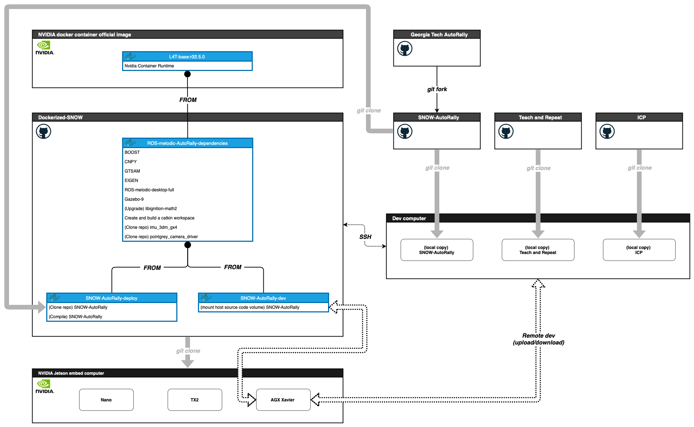

# /// _SNOW-AutoRally nvidia-docker_ ////////////////////////////
- Latest: `snow-autorally-l4t-ros-melodic-full`
- Base image: `nvcr.io/nvidia/l4t-base:r32.5.0` 

<br>



[edit Dockerized-SNOW-plan.drawio](https://app.diagrams.net/?mode=github#HRedLeader962%2FSNOW_AutoRally%2Fmaster%2Fvisual%2FDockerized-SNOW-plan-2.drawio)

[publish Dockerized-SNOW-plan.drawio](https://viewer.diagrams.net/?target=blank&highlight=0000ff&edit=_blank&layers=1&nav=1&title=Dockerized-SNOW-plan-2.drawio#Uhttps%3A%2F%2Fraw.githubusercontent.com%2FRedLeader962%2FSNOW_AutoRally%2Fmaster%2Fvisual%2FDockerized-SNOW-plan-2.drawio)

<br>

<p>
<img src="data:image/svg+xml;base64,PHN2ZyB4bWxucz0iaHR0cDovL3d3dy53My5vcmcvMjAwMC9zdmciIHhtbG5zOnhsaW5rPSJodHRwOi8vd3d3LnczLm9yZy8xOTk5L3hsaW5rIiB2ZXJzaW9uPSIxLjEiIHdpZHRoPSIxOTAxcHgiIGhlaWdodD0iMTE2NXB4IiB2aWV3Qm94PSItMC41IC0wLjUgMTkwMSAxMTY1IiBjb250ZW50PSImbHQ7bXhmaWxlIGhvc3Q9JnF1b3Q7YXBwLmRpYWdyYW1zLm5ldCZxdW90OyBtb2RpZmllZD0mcXVvdDsyMDIxLTA3LTAxVDE0OjIyOjUxLjIzMFomcXVvdDsgYWdlbnQ9JnF1b3Q7NS4wIChNYWNpbnRvc2g7IEludGVsIE1hYyBPUyBYIDEwXzE1XzcpIEFwcGxlV2ViS2l0LzYwNS4xLjE1IChLSFRNTCwgbGlrZSBHZWNrbykgVmVyc2lvbi8xNC4xLjEgU2FmYXJpLzYwNS4xLjE1JnF1b3Q7IGV0YWc9JnF1b3Q7WnFVdU13N3IzelN2Z011Q2hsRWUmcXVvdDsgdmVyc2lvbj0mcXVvdDsxNC44LjImcXVvdDsgdHlwZT0mcXVvdDtnaXRodWImcXVvdDsmZ3Q7Jmx0O2RpYWdyYW0gaWQ9JnF1b3Q7YlRaSnQxbzBUNXN4aFRkeVpJeUMmcXVvdDsgbmFtZT0mcXVvdDtQYWdlLTEmcXVvdDsmZ3Q7N1YxcmQ2TEkxdjQxdmRhY0Q5MkxxNGtmalpnMEdjRTJZaEx6WlJZaWpYakRWMGtRZnYyNzl5NVFFRXhNdW5QcnJwa3p4MUJjNnJLdlZiWDNVMS9rNW54enNiS1hZeU1ZdWJNdmtqRGFmSkcxTDVJa3FvSUFQMWdTcHlXeUlyTVNiK1dQV0ptd0srajVpWnMrbUpYZSt5TjNuWmF4b2pBSVpxRy9MQlk2d1dMaE9tR2h6RjZ0Z3FqNDJNOWdOaW9VTEczUExUUURDM3FPUFhOTGo5MzRvM0NjbHRiemozOTNmVytjVlMxbFhaN2IyZE5wd1hwc2o0SW9WeVMzdnNqTlZSQ0U3Sy81cHVuT2NQaUtBM04rNE82MlpTdDNFVmE4MEYrN3E4NXdnb01pQ1RON0NKU2hoOHhyWGRNYlNKUEFtYm9yTm5haDdTL283K0RuVDkveGJhcG9qbU5EbFdSMWJ2cFd1SnhkWE43NmQ3Zkc4bnROMDNYdHE3anR5N2FONnpET0JuQWQrZk9adllDck0zdm1ld3NvbmJrL29jRm42Nlh0K0F1dlRWZWFxRUtSRTh4bTluTHREK2x0QVI4S1Y4RjBPL1F5bEt5Qys4WElIV1gzczBHbGk2a2JPdVAwNHFjL216V0RXYkNpZHNpS2dQOWlPZlMybDdaUHpLNFozNGxLZXAxNzc1eitnWElhd2pQYm1YclVndXlSUlVCOXk3cDVYcXhWcStHL2NIKzRmYkZ6SDg3OFJkYS8zZGpuKzF2VjdqSzVVdzU0Y0ZlaHU4a1ZwYlM0Y0lPNUc2NWllQ1M5ZTVweVlpcU1KK2xsdEdQczAxcGFOczd6ZEZab3A4TGtiYis4cmV3SytNeGVlRENxMjlwRXNWaGR2VnhkdmFJMlNTNVdaczlDZDdXd1EvY01SMitkWjNINEk5Zk5YUkZ4WVhhWms0TURZaFkwbHY5S0p5Y250YjYra3J4NEhnYkNWeWtkVzN0Mm56SnlLc1E1emg3YlMveVR5WWw4aG5Ud1FYTzBrVkYrQkdzLzlBTms5MkVRaHNIOE1BY0JrWC9TUDdsdk5GSlJDWU1sQ3M1NnlYVGJUMytEbkg5R1ZUYXlVaUVyZ2I5SGRtaC9rUnVwN0o2dkg3d3YwdGxtRHYxdC92aHVTbmZ4bVRLODJkdzd5VElaeloyNlBoOExvKytOV2p1dXl5UFp1UjhseHYxUXZseTBFejB5dE1hREk5OHRkRDk3Ui9EdDcxZUNvd1VQYlhoNkZLdXlFYXNQenR4NU1DYU55R2pXOFp1Ky9uMGNEaS9VcExNWXIrMGJkZldqZHhtTXZsOUZIZi8wQWQ2UzJ3c25hYy9yOFYxOHV1bFlVN1V0cytlZ0h1bnU5akt4YityM1AzcjZwajFwK2ZyRmJBcnY0M2RqYkFlVVI4NTNEK3FZMXZYSldlUTJkVzhremFhakN3K3VEZEhvS1lLSmJabTBWRFBSSmRNYXhHWlA5K3lMNitXZE5CYmcvZGkwdkhzejhVVG9YMkpPQnJGaE5WUVR2ek9melViQzVZT3JDYjZSOU84Tnk1T3hmZkFkMFVpNm0wNnprY0QzUmNOcXFWQytNWkpHYkdwVHFNdnc0SGxvYjFlQ2I4TDNwckl4R1lqbVJCZEIxWXFkcGlKM3RENk1weUZCMmNiUXBnTDBaVGFjbi92RGkzNDRtSjlQYkdrVUQrWHIrenVvZXppL2xuWE5FS0gveXE1T2ZWdEg3cHRzckxWbDRseWNUKzRzd1hlK1g4NGM2VG9lemZ2K0QzOHdjUzlhSnorK1h5MUhGNXRaT3BhQ2ZYdTF2ck82L28vNUNOcHdIUTl1cjJaM3pUUGY3WjFGam56MWNIY0R6emQzdE9oTWpIdFQ2M3AzaTh1SFllK3NjejI5SE45ZGpHYTN5V1dyUGIrT25DUjZHRjNNQk9nTDhOcWxieW9EYTMwS0xSTHM1dGtTZTBSL2F5MFplbzB0TUkzRUU5cElvVjRVZHpUOUhpa3dTQnBySTFaa00ybUZoZysvaytuYTlKWEUwUFFRZmlOVGM5THJTNmx0TmU2aFBCbkVRdEtlR0xMUmk2TDJCRVkrRmlUNFZUbzlJVzVQK2xHbnViMkdYMTN1Tk5tSTZCZEcxTGFnVjhsQWJVUDlVS2ZTdGdiM3htU2F0RFg0MVR3MXUrNG1ob0pjWlV5Y05md0hWUEUycGg4bEhhMEw3WjZLOEQ1OFYwbk1acUZNZ1Q0QXBXYzF2U1ZBK2VEZW5IU1ZYUG5FYUFwSVlkbnNDUUsydlExY2FWaU9pcjlRcHVDOVRtL2IzdEJzRXVldDRUMjQxd2V1aUtEdmpjamNYYk4zYnFCdkduS3ZFN2V4UFJwSWtvYmY5aFQ4TlMxamUwMTk4eFVKK2dsOW04SVk2cW9aUjRYMm1yRUNOSUo2RXcvR2NDQjBtanVhcGJUMnNJOHdsakNPUnRaSHhkRE9BNk9wcU1aTkJMUm9SUjFxcnhNWm9HR0JaaHR6SGlHZEV5TVpoRUIzeGJSZ1RIcEtiR2hPQ085RjBJWTEzSStSMWlDbEc2U1Q0U05kb1UxenBCOWNheTBZcjlhOWtVeGp2SWJuRkViWFBuNGJwRzBjMExYVzJtUnRIVTI4ZStoUEF2eDQzN0VHbSt0SjF0NldaMW1HRER3bVExOWhQRHlRTmlQcTNBNUNvdG5rTW9EMmdjYTRBdG9CZjJvNjBDS0NaeHpSaUluL3BEWjhFK29HSG1yZ3QwWGlhUmdEa0ZUc2t3aWFZZzNmMkpnVzlCRysxYkc4OUhxa0c0a0Q0K3NrbmFiK3NKUGNzekZvTnMrKzZkYjFCZjI5NllBMlE1bUN0c1lkNUVzY0o1QUI1Q0ZUaWpaWUQzMFgrMmxOazU1bWdPWlNoRTRyU29ER01CYllUajBCdW9MbUdoRi9Hc2g3V2gvTFFWdGkvOGRyR0UvZ3l5N0lWQ1JCRzVVTzFJMjhZR3AzYTZMWHhBaUJCNkFPUThqRzFnYmF0NEdQREFscERSclFwL2FvUm5JVkdLUjE5WGpZRkdMZ1pkQ1UvZENjQUEwMFQ3RllHeVBRMXRCdVhhUngrQjRBUFhRSitoalJ1RTA4R2ZuUHVLRjJDQjFyQkhvQStHSXlqUTNrSmN0QnVZbElKbHBSRFBxRGRFVEt3NUtwbmRkeS9Mb0JmUUt5a091emRRMTlia0dmK3lyd3VJRDFtalFPTGVqTFZBRTVTOHV1c0F6NkNkWWhxKzhpQXJvb2FDblcxQ2RvTjR3RjlFT1BnQ1l4akFGWUN5UE03dlcwbGdCdEVrM3JEc2MvcHZGSGZvUDJ3bmZBS3M0Q3ZHLzRXL2xuNDRoNkR2UW90RWVDc1lXMmV0aFdIQThWZUg5Tll6QkpkYWxGZWsxb1F4bWpMYjQzMklDTzNIc2VaS0Vwd0wxK0RMS1ExYy9hUlh5TSttSTdSbEt1ZnpBR1lORnliWVJuTm9abG9GeGduMEZuZXlnN2FMMkFmcUNUVU8rVG51c3FneVRWdnlDZkhhc3ZrOTZkTkdRWTI1am8zSXNrR3I4WTJvSHlsNkRjb2E1enFBemxqZnJpbzhYM1FxZ2IyZ0xQOXRCR2RPZTZQQjUzNHJNSjZuRm94NGIwNnFTTCtvTHBjSGpYSUwwdG9CeWhIbWJYTFcvYmI5Yy9NMU5QUUVuSEFIVGxESzA0NnA3WVptTXFtS0Fqa0ovQWJraEREZmxsSUJ0K3hIaGpaM09RdDJJVGRRWHlYdElYVUYvQTJNQzNweVJIYlExMVZWOGVKRWk3QWRvUktPK0tXTjRCcjRIZW00REh0TDF1d1JnWkt0UWZvMnlDYmtYYVJoMXJETEtCOWVtU3dYUWx5ckpJNHdYZUJPaldFR3daMDVNSjlCVThFM2hHUmwyV3lVZ3Y4MEJJRGxzeTJlU2tsY25ueHJ4Sis4ZjBnMnBNN2dMaUo3Q2RJMS9JeW5TeVF4TkhObTREdjUwb2pDN0pKZ0t2STBnOUV2cmJJRy92YmptOGlPcTZEM3BZMEZXZ0E1U0I3cHNLcUtOanNuOFcyTXBKZDJPaURkY2EyQjZRNHdid2xaRWd2NkMrUXYwQStoVDZobmJNVUs3QlBxSk95Zm9HZm9OQU5FZTdCN0xRQVgwTVBBM2pNQUErN01LWXR1QytvS0pkTU1IdW04aWJWbGQxRWhwSGtBY0grdDZYd0gvWlBaTWcvWFVKK3I1aDl1UktBLzFMdGdmb0pFS2JaTFNqWkRzblZCYkJjd0o4dDZMc2FrOVhUVk43M0FMN0FEeVlqQ1FZQzlTbkV2cEFUSjQ5OUpPd1Q4Q0xhT2RSbHJBdnFPdWh2Mmgvd0xaU1g4QmVPT2p6d0QyZ2U1VDZZdHRuRFBMNHNBNDJKcmx4Uy8wc29EMzVZSWJLZnJFdS9PMHIyZldBOFpyU3NWb2g4UUo5RjJRL2FRQS9vNHhQb1M4Z2UwMlUxejdwSzVBQnBaKzBzQXpzRE9nUjFEMlRyZ0J0cXhnREIva1M2UWk2SGV4ZEF1TUJ1aU5yYTBiekFaWnJZQ2V3WGFoYlNLWjA4aXRJMzZDUGxFelovUW5LSHVqS1NSLzRUVURiZ3Z5dEFvOElVRC94QWJPZjRDZEN1OENuRVZEL0dOb2RqR01YL1JvQnhvWm1JV0RYUXZLak5OUnQ1TGtyT2Y4VC9ibUkra2k2MTRNKzQ5Z2FUQStoYjZBWk9HNHdhN2dHT3FDdU5GVFVtYURiMEtkQUh3MzlZZERWNkljbytNeTZRL1cyMG10ellxSit3YnBCVGt5UWMvTFBpTjVUNGwzMmZCZDRvZy8zSEdWTDU2U0wra2RpZWdaMG5JWjhqMzR1MlBNWS9WZXl4Mml6VkdaWFdsSUgrb1E2QmV3Y2pqR01oYWVBdmxHcEQ2QTNxQzJKanZvWGRSWFFzN3N0WTM1OFZ5SDdCdnE2Zy9VUlBVQW1yQmJ5SjlISEJGMDVBbDVGdjJ4bmQwRG5vYSt1R1dDL2tGLzZHMlBxYmZtRmREaklidXE3S2pnMllIZHZ6QW4xV1diODBXVnpDcXV4WWZ6UlNOZzErT01GL2dCNVM3clFuZ0hRRXZtRHhnVDFEZEFENkFEamhuNWZHL1hJQkgzckNPd0x5bVkvczBjb2IrZzdKSEJQWURZU2VBSDFSQUp0MFBEYkRjR1FpRCtJNTVqTjZ5YU1QMER2OWtpL2dFL2tNYm1hWE41MGtEOHNIWGtkYlJ2WmxRNzZNdWdmZzd4aXY0SG13RmNSeWhiNEhhakhrY1pvcjJpbURYeUJkUFRFM0p3RDlTdjRWZjFVZnBCdmRCbDFDYzFJSjEyZ040NkpJM2VoWHBQOE5OUnZqWFR1MFJMSnYrL1JtQ2RrTzBwMEdPUnNRa1NyRFQ4OFhCTEIvMVdzZUIxZWYzek9NdGpldXBSY1hwZFN4VzlxZVdWS1BqMjhERlpZa3RxdFB4MWFoRzByMXRlaHZYYS95STJWTEgxVHY2VnRtUG1MS1h0aUhJYTR4TjNBTDB2bkM4LzV0bmp3Ujc3OXpRbm1VT0RZb1QwTFBQd3JXMEZjNDNQMERMdzJVMEpXd2RQcnQyeHA2NWdGM1B6U0tTMWVqdjNacUczSHdUMk8wRHEwbldsMmRUWU9WbjZDVFp1bDY2eHdlNVV0dEVxMXdoTTlmRFA5NXNwZHd6TS9NcUtMZTBXR3ZTazgyTGJYMlJKWWVmRjRicTg4ZjNHV3JyOVZyUXFMUTF0MHBmS3E3M1pCcnJqK3JPd3ZNaGVXbi9NcnlmS0JOZUYwdVhodkVYdC8wVmNRVHM2YXlpdUtnS1FXWmFCV2xnRlpQZjFXcTVlbFFKV2VMUVhIck1KV3M2WmNXb1kxR1lkTFFqTzNhM0YxdndqOXVWdGFvb1hSQ0V2am01SmdiemVpZXVXMXVFZWg3RXF1MGdIQm9nRGUvVGtqTmhqN281RzdJQUtISUtFN1Zsd0cvaUtrRVZQUDRIOHczRTBCZEl3S3JXekN0Ymk3VmpWNmZBWHN1SUNHUXhleEhoZjRQSEtSMThzYkdFV1czbTVZSE1rNzJjcjJFY3lUTWd0STc3SE1rajM2REdZNWpqUHFKY2JRYURzTHhHLzB0V2QyYnNyTDlRYzNvaXAybmNwYlV4OW5JK3FwcmFhMzNFS1NhcWZIN1NIVlhxQTJqdHVwRVV1Y1VDTDl5RjZQdDRRSzJQNWJjN3RoaklYamNKN1pxWXc1SEJnazNKWmoyemE1L1p6dGpTYzNmQTdvbEhUZmFMN3hjTlA4VytRT3daSUg2MitlSDQ3dmgwZUtiZjI1bEh2YTYxR2tNdDJVMzBDMnl2YkxaUWt1MGMwZGVXNG1JYUFReHpCS0MzdlcycFhtWkJCSnQzdW1IZUJRVStIRURjTTRsU3Y3UGd5SzFLNnc3K2luTkRCMEFHbnRyeHlxaUVwUjR0TDMzTVVvZXlhMUoxQ1Mza2VHbXR6UGwxblQ3WldUbGJCbTFKNTBJNnA4Z2NOZUFsU2RmbG5lYzdUazQrMUFTbzkxY0w5eTNNZDhqWlJ4b0JiUGZkU3dwS29CcWZnb2c2N2NtUjM2RDhXSWkwZjJtbitnTGQweGRxMVc1R3hGMk51dVpsMUszM3JPN3ZGeG5GeXI0dVRhREMwTENIUE5DNGtHck1EZkwwQmlGNWkrOW4vM1FYYmo2NXFvaU1FYVltMjUyZDA4OEJWbnl4dTdCNUZMaG81UythNDlSMzIwR0s2WGRDMmNYM1dNTHhoRnNuK0gxUUtqd3lvcVZqNWM3WmNjZUJDS1MvMkhzdHdnVmNoL20wMmFIdFhRKzNwMkRsNFlVdzg0Unpqb2hXbVA3c2x2N2VtUjhpTWYwc2piNEtTMElWL3k0VDlWbWxyNGxyNzNVc0hJSGdsKy9seTdyOEx6bVJMSThmeFZwL2QxN3M2Q2tlOThiWUNldmJKbnMvanJ5RjJDZG5JWGp1K3VIM1BKL29TcDVhTlR5SUxlcnJVYTU2ODN1Y3h1dFZtWWtWanlWWmZnSndNSHVLc2U4M1BUWWlZTHdXcmtydmErdUQ5clBtdUlMZW5acHVYbDAxTlJrTXRUamlvM0U1elBWL0pYeExLZmVkYnA5S3d2VGVsTFF5ajgvM05tb1ljbWIzL003UFJJRnRrcWxGK2FoVmF5eEt0eFJEbEdyR24rR0hEeXZ3bjVzL25rKzVGZktaSC93dW8xREs0RTNwQUxUc3JMRDIvTUJlVVZ5cForMFRJNS9kK0UvcUtndkRjRHFJOTZ3aU4zUFFVNmZmMTVqNS9pUFBFV1BGR3h0UFhHUEZFcm13WTdjWWZCZHBHRjg4QXI4NEQ2N3Q3aFNZa0gvdWt2dlpVOWN2LzNCVGQ2aDBBc1dqSCtpcGxDK0dqbU9mQjV4SnV5eXVtN2U1S241WW5FeXJWRHpLV3hGeVA0LytHOVA4TmYzUGQwN0hEcUw3Qzl3V3FLZEhyZXRpZG5sQmRQT0lWM2R6YkxLODMvTkdkSVYxd3JYQWIvWTRyRG45Ly9KNC9tLzNrYmhiUEcyN0NHL041dWFKWmsrZ1JyME9CNkt6Zit6N0huN3NyK2I3VHlIekNFZ3JQSm15eFp2YmRuZWxLZXJwWm8veWE3cnI5amo3VzhmTTUzWGIrZXBPdlVyNzNycW1UWncxazhRWGI5UnJ1dUorWGx0emZjZGYwOU82ZWZkRVAwa0tnY3lmSmJIZlRMRzZWZmhXK0NMTlFMZkpqcXM0KzdkU3FWdlgyTVZ5dnNtVDZVS1A5cVc2V0hBbUwvZ2kzVTRxYm84eFQyOFh1WnlsNTRpaW9mdVpmNU95TG1xam13WWhveGg3RkEvaDhINjNCbmoxQWlSL2p6RU16dTU3UndVZVJWdmxMeFl2ZHhxd2MrejQ3blNYa1B2S1M2bHJNZzV0cnJ6OUZlTDFSZUo4L1BsVG1TQjh1Nzduc1RYYTZqZnB1TzJncjg1OUZSb2xTeDhONE01a3QveHUzWCsvTEd1NGRzU09WOXVjb3AxaXV2ZnNDNHJ1SmJKT1EzTmJzY3BIU2xDMjFUdUlxL0hGcnYyRjkwT0hwZEpmZk9rNnNzQnkxU2ViWGw4R0xKOFhQR2xLMmVYQkhKYVBma2lraTJkUExraXNodVZpbUt4VW5sUjRySGxZZURuOUc0MGIzcDJ0T2ZxKyt6alYyN3JzNm0ySzZHSExIUUlTNDNiQkhpUUlRNVgwSTVmZ2tsNzZuVmZzZVN5dEVySmNkTU8ycVBNaitvSlBGVS9Tak1meWg5K3JBUlA1UkF6WEtyMHVUcEszZlVkdTJSdTZyWHNEV29vVmYwSWVrOFhMbUltMGNWN0dKNEh0elo3dk5XVHVIOE40UnB6WlRkZTlUME1OalRZNUtzUHpkSzVyc21KNHJDWG5xaUxKUTNYTFpUbWdMRTVYN08wR3RtTlN0VlM5ZDdhdXBQVEZsVURpMzh2bi9PNGlGRkEwMkNhVDZHWFZndXlJd2s3SlRPOGVvbTkwNWUxenlwTTJvY1dmZkRhWlFLek56M1Z5aTE4cHJJWDZGUWFxOEEvZkxLQ21XTHZuM3BodXNBdzdqYytSRG9naDdkZkhrZlpyRVlqOUtiT1dnZlVERThqa3hSVUJSVmltQmZZYnlyNkovVWlsNndJSmFacFJvdVczMUU5TlBxUGpGY2RqVkhIckd5d3ZHeU9WNDJ4OHZtZU5rY0w1dmpaWE84Ykk2WHpmR3lPVjQyeDh2bWVOa2NMNXZqWlhPOGJJNlh6Zkd5M3dZdk85dmUvWkNBMlVlaXY1YXozYkxOLy9YU1hoeU9TNGpTMXVFSzdCRFBnaXhGSmpRdWJ1SGVyZjNnNDFMc3dWZ0VWczJCR0lOaWhGQTA5a08zUjRtNnNoYXQ3T1dYY2k1VUZ0TXFWeTIrQjdocUcrTGduejRqMVBQNVpLNUpSVHBYNU5CdjF6WUwySzdQMytvNGtzeFYySzYvaDh5bXZRaitjSEp1Y1RBK0NqbTNEWG9GZWxxMzBoOU9UdmxFL1Zqa3JNdWxvWDF1OE9TVCtab3ZpYTdjK0dFdXVCS3VCcms3dTlCS3ZNZ2lLN2NSbWR2d3pNR1hRbmptZ1lqTVhPemtjQlpnbmtIRjd0bDI1N1dVK2JwN1p4ZWcrWGpJWmJhSDhuUG1idEt2MFBkLzJDRnUrMUFsa2xDeDk3YmRNU2tHZHg3Y0ozc3kvTEtlY3VPVDRaZVpyZjU5Q2FtL3hyVmxUSVNQd0xYRnlOMlp2Vjc3emg1bjdLVkU1eDk2bk9VT2NsTW1LcGx3NUpqK2FWSFpYaHduS3IvT3VTL24xU3poN1IxNHRUcDV1cllmWXFuczd4bXpwcGF5cDJIazdEajNXQnA4ZXJBaVVSQ0tUc0JwR2lsOGZ1d0xkZlh4RjJxcStrdlBpMEs5dGlmVXJKTy9OZWxXekNDNVBwellQeXE2MVFKU01oZFZOdVdsSnUxNXR1YzRLMU5oSnQvQzhMeU5MTmYzajlKUjlpSXlEb2p5eTZPZk5jd1BmMDY4VVAyenhBdnRCd3crTTM3b25VTUY5eE85VHlzQ2hpcGpCVS8vdm9DaGVqbEw3M2ROQmY4QkZXUFBTRUtXTWFiOGxROHEyTXNmK0V3VHgvcXpKNDU3S2J4VkVhekNteTREQ0dVRWpOZWlmZlg2WGVXSkZVWFN2Nnc1akk0Q3BvOStUZW1OTjBtYmxwY3NYSnRDeWhuRTM1VzdkTzN3RDJkRldmcG92RmdCNi84MzhxTGUvUEdIczE1TmVEUFdPK1MzVlFzOGZ2ekZhV1hnZEh4UTErNlB5aXVUOTF5N2o1bFhKZ3BWVHRXZStQNkplU0NwRkh5cVJCRFN1TDhvKzNVdSs2OHYrelhsVThoK3hZbGNmNG5zZi9hVE1FWHBsYmNrU0xoZWhGUHk1R2FEOHVXWGRnUU9LSkFqVmhyUDZOK1M4R2NJSnBWN2dOdTlqTXFOallPNklyOGlXUW0ra1owQjh6UTJhOHBDcjcwa0NZNkFVbUR4TFQ3MUUrQ3M1Uy90QzR1cTdDbTEzN2RSc1lmaktUeTVVVkY4UVgzMDhaYy91N2RqOGtyN0UvSVJtQUNmTzRIdTFaUGh0b2w2ZDdlWHk3dEpxVDVXN3F1VElRd3pQQy9iTjFlQ2pjbHJrNzdZbmpURWpqWlZEYTJMaVdJWUlva0pkTUhkeld4aGYrL1c5VWxMTVAyOXBMZG1nMUp2REswaG1CTk1XSU4rV05PTm1mUlZJMmtwbUhpR1lYNm01YWtkQzU3QkpEcXJMeGwrWTJOcUEranIzY3habU11aHBPRDM3NDJlN3JrWDRycXpNS1BCalRuRFVHOW5mbzN0bHU3Z25pTmZxY09MZmwyZlU5aDM2Q3l1MTNmV2NqYWFYOThQcGF0cFJ6TFg5bTJqWEI3cnUwUXpUMjgydkI4WGpqZjZmamtlTHN6NVVMNE1vYVp3Y0hzVjI3ZGV3SkltR212NmJiS0VEUmdWeWV4TnR5bHkrSTMwdjZyRU5XR2J1R1oxWlJiSUd3a3NVZWJTTUN3TUJqZEVzN29NRTFnMmhqYUNNa3dvZ3RIc2JjczBUREZzVC9UY2M0NEhJNDRCODBBZEtHdGljdEFBeXpBNE16S2dqQklldEVzTnVZeVNvVERndmFkZ1dtQmt4SmlnTWxpYkdOeXA2VEtXbVJTc2lXVVkyTnBQdXBqYTZTc3hKZ214VkVoRHBYY3hJTE1YaVJqc0RPMzMyUGRiVWhvWURsd0FkU0tIQW1kQW5RSUw3UFhTNTZiWVhreFZsRTFNVlFUdXc2Qi82RmVNUWNybVpHeEFHVXRRdytRUUNwakZzdGFHQWw3OWlKSXJPbjBqVFliQkpDb0svbGJNWmlQR1lGWGt3RFlHbkUvNmNxZUhaWlJRZ2dIY0dGQWJkVnJ3Ym9JSmIybkEvcVF2UUw4RUU0UEpKMzBxQTBrZ0xxYkFXV3NLL1c5aEFLdGtiVGtieXpESTJwT3hqTVlDQTYweHdEaHA0ZGhod0RkSWd3SGppUWxXWFJ6amhEM1hXcHNKQmN4RC95bW9IaE1UTVhFQytqOUs2V1hnbUd5ZzMwQWZCMmhHaVFFeDBBQ0RZekdoSjRheWlJSnByZTYyckpzNDBNZkdoZ1hDZHpGQTJxTjJUcm9ZNUl0QnhqTDB3ek9TNmIxaFlSSmVhME5KYW9tcHdSaGgyeW01QUhnc2hqR0E1eWhSS01FeVRFd3dKbE1Qa3lYZ1hreGxtR3lobmNPN21PaUNBY1ZUa1JLNjRrYUNDV1p0alJJNDRUbVdubW9tWGVvN2pKTmdFZDA4VENUYzhqNk9zNmtCRFRBcHkyckEyRkpBUEh5blM4bGV4alNDY1ZFU3c0S3hwbUIwSTdZMFI2QkVRZUFObG1SeEJ6S2tVNEEwOFZDNUxMSllZcFhRQVI0d1doRkw4dEtJUjFnOWZrbnIxSno1eVArWGd2UWRHZnYxcnhYTzdadk51bjE3S2NKenRlRzhmdS9PcitOaHN0NEZLOGRiZlVHNmh5WG9nV2F6RE5TeWdqTS92M2VrTzdBR0F0UWpqa0UzTGQybVI0SDRsRFRZcE1CNDBMTGRiWC8vN2UxcnRieFdBcnRER3VrT3BQZW9HdUMzYlZFWVBtaU1TazIzKzAvYnhIYzNwbEJNeDlGQm4yTlNkU3RtNlpuVE5PbWFVZ0kyQlh0alRiRk0yYk12S2t1ek9qVGltS0tHWWVMNnh1aE5UKzdtcy9Xd0tjYWptODJzTTFjZmhvdmx6Sm1mbnVqKzZlRlJZZVAvL1hJMmtMdjVKTWtZMDduSm9sbDZ3b0xhNGRwQ3k0Z0pRU0IzUjdhKzB6elVla3h5YUttbzMwRG1saDJwWU1IQVNxazFzSElQWUtrZW5oajVpa1NvUVpiMHRNSDJnbXpTS0lHT2xVMGh5cFd4d0h6TGFtRUNXNHk4WkZCeW5nUHl0U3N6aWMvT3dYWVptRHdya1R4UnNpTGFwRzJaU09ucmZhZ1RFOTRtbEJpOXEzTmJ0cTB6b1NTZFJNL1h1UzNiMWRuRkpBbUJ4bWxiNTdhTTFYbllFOWlOSTdUQ21kZFhVQmJmU1hwZ1dwUnd0ZTVvM2VYMlhrOU1hUnBnRW9qa2ZQZU80WjZDOU9yS3NiS0ZhV2VnNmFWSHBiYUN6cHl1YjBUWFpuMXhTUElldlZmVTVzZm8yaERUYXBnMXd2Umx0RGdHZUdVdjBybW9WMU4vZjVuelFQVU0vR0pqa1A3dHEzQ3R3alZxdHcyTzlBNEVZNmU1Y3FBWG1KNnNnTDRGSFc0S0x1aFlxSk9zWEdkeHVSajRIcVVWb3hkbVdLMWYwV1lWZmVvZTZwTndvRS9vTVVyZ3hVSmJSOHU3NzFmQnJ2MGVhTWJ4ekw0WkJhT2k1azVHMzJkckJNQWdPNkl4YmpLUWl5MU1rOFcwNWwrek1hVkVmSkRCRm80bWZHRTI3OHk1L3Y0WStwdGFJMTNIOXMyZ3h2WDZIMGp2NSt2MTA3YmtWSDFWMnl4U1RTVTZVajhoQ0tDbjF4REN6Ri9melNrT2Evb3RkODRkbUUrVjlNVUM1b1JRZGhVUGJ0VGtibDZQaDZEQmhqZm5NRDR6NVY5SzVDWEFCMlpsanViTUtvK1krZk5WMnVwVCsvbmFvVjUxRC9SS1J4QWJtVmEranJLWTNpR0xpUW04bXc3TzBTZUcrdHc1NCtQclRicEU4OVNDRmt2NzYyZmdMeTIwa2pFbGYrZDBTRmEyazJkZEpYMVJrT2R0V1U2SElBQUJKbnpuZFVoV3R0TWhKdW1vYVVHSFpHVTV2WVhBQXN5YjJPbXRyR3hiSnlWLzAvckZyczVkR2F1elpOa3JPQWU0TGg1SzRTeWxpMmpHa1F6L0tXWnp1cjNYdm1XZVJBZlhYYXk3eU5XZXBrczI0eDdkbWpNRDEyWDJ2SmkwL0ZqNXpUekVwVDU1dE42Q3Y4RnAvVGEwUG1BaGpycGI0Sk9rVWZKMjAvS24rUVFCQmJSc3hTYUtHWWlKSjc5VTN4dC9wTDQvMUt0UHJ1OWpydS9mV3dmczZmdUU2L3MvbDlZdjB2ZGE5SEQzOVBxL2RPeE04L25yL2lXdkVHY1Z4ODFhMExvY3k1R256dng2TWlwcUtGcFJyOUpRMktiS2xmWVl0V25yMkRVYytlQWFEc0xic1ZucjVwZTBicmxQd3FFK2ZmTGRBK0hBZXB1MDI4VkdxNmlyUlNuZWx1MDBCKzdXd2ZlS3F4bFoyVTV6NEc0eVcvdmNhWTZzTEtjNUVBNVI2dlFLbWlNcnkya3IzUDExaWlzbzI3SnRuYmo3SENPRVZLN09iUm1yczFXeTVHVytDWUhuTGg5c3FWKzFDNWpkQzFQUG9VWTduWXN6NVFpNjVGY1c0bzdXM2ZkYVdQbXhzcXNkdVk5WDlEQTRyZCtFMXRWVzRlbDd4ZFVubzd5U3djcVA0SkUyd1hteDFTR0VJeWE0TU0xNW1aNHZyWi8rQVhyK1FKOCt1WjRYdVo1L2I5bmYxL045cnVmL1dGby9YODhmMm84WVNKdWxjNTdiVVp6Vko4T0xXV1E4T2hNb3J4c1lTaWJwR1BOSE1WUitoRURmRkl1WS9zcEdQMG9ZNkMvR3AyRk1WeC9CWVJNWUZhREdRTUlZTGh4ZDBGQVV3MlVrTURzazhGOEVJNFgzNFE3RzBNSGNiZDFCYWxuR1JrZkE0RWtYQVNWVkFoeldQQS9uZDdqem5jYVBxZVprWnNBMUFoeUxGSS9XTWpBV0R5aVB3Tk1ZOTRlclNBMk1tYVM0TDRPQXR2dXhnV1UrVUFWQnZ3bXN1YVYwOEYyME5CalhaU0hvc1NmcUZQZW5Dd1JLaXNERGllTWg2S2VCOFdkUVg2Y0pzNTNrV2lPd1p0b0pOdExkOGdZRDRjZTVydFhkc0hnN25KL0MyRmdZT1VzQWxUaGZ4YmhMcUdNQXN6U3NBMEYxQjdFT1hFeUE0aGlyaGlDb1ZsL3FKbnJDZ053TmluRXo2YnNVZXdodEdkQWhCQlIzMkVTYVlOOWdaQ1lFSkFwVUo3QnhHSmNweGcwcU5BWWdzUWExSCtNd2Rkb2ZRMkJaazRBMHJ3MTZWOE00MDRHQzhZOFU5OVlqbW04d3ppN2xoZmpHcitScW1PRmlaTzFaRnkxSjFYMllkUkpIdG0rSlMzRnVHdytiM3VTV1JlUnVIcCt6RnZRU2F6MUM0R0kwbndJakZXY1FzaVlldmFBTkJCcFJHQ21DL0VlSVc2dUJCMmRFSFFZUlNsQ3plQVRBTm5JVjRXY1RoSHpWV2VRcVJqWGl5RnNZRVVyUnJCdFdCaHhQVU1ZREZkOWxFT1k2VVEzcWhqcGFDTzJyQXJWWTVLWUYvZ25ZZUJZZDJ0K1dXUnBDY3lPTTlYUmpnalFRdkROd0Qwa0Q2QldkN21NOGRRT1BnUUFLM0FHRkVIWVh5cVpSYkJJa01uQTNqVUZmTnFjRzZEUTgxcUNGRVpEZ1F5QlVLa2EwSW9mcHVHc2JFWHd1bGVHcWhnTjl3d2hZUnozb1A1RzBNQWg1OC9ucnJnZlhOblo4a2xxNm42Uzl3RnM5dU9kWmpwVVEwSXRsYTF1T2hIeExNY3JhMktDUnozNlRjNFBwSnV5RkE5UkdIZFJIUUcvWlFKRG55Y0NqK3hnRFROUkFxR0hTWFNBVFNDMk1kZTBpU0M5UXd4UFpvUmh3bndDMVcrc09BZUY3SUllNG40MkF1aURUR0JOc0RWUkw2NEp1YU1Xb0J3enJURFBwSUE5RElyM0ZJbWM4WEs4eGtoWXJpK2t3QjQ4QW9hMEJ4dEVTK0gxSEcyc1ljOXBCUUd3c3d4V1hIc2Ftb2hYelVIY2h5RHB3R1ZJZFkyZVpYZ0Z2WGV3bUErd1Rlb3hKNmxWNzdLQU41QWkwaEkwTkE4cnVibExBWFFaOHpYU1l5a0N4U1djcXBDK1Fld2pnSDhIL0J4aDdMU0xuSVZBMmNEY2VkSUt4MVBqZG1QcmJvOWh5a0xvR2NpeHhIUFlOWTU0SlVCcnRoMGJ4eFNoaEJDUU1ZNzFHN29iMll4eDBUTlowWW1UY0tsb2F2aHZGb0ora1RuT25uNURtQmdIYk0xNHdaa0YxYkcyVFdjWSsyYnZxdFRmaXg2WklYakY1WFBNbzBNWFVvajYyTjE5WWMwVUo5bFFyazJTU1dnSXNwdGh3QkRIdVZNUTlET1d6OFVDYUNhNFZVTHozTXozOHc1RUp1MTZuRmovVnZNbkJPVjNGSElGMngxbGtDbGtEUzBQcFEydUJSdzlrdjg3R0ltdmZWeWhhdlcrUXQwRDZHYUd4d1VOZzNnQklESXRtQi8rQURqd2lDc1A3ZUVRT3dvUERmQ3BTNk4ya1JkSGtEUG9lTXhjYWVKQ1JRTWZvNE5FcVZrTkNDUEpPUHhMSUZreVFxMXRSTjhGbzkxWkN4NFpZTFRaZnBDZ0xpZ0xmR0NuTXRVNFEvV1FSTndoUHpZNnk2VktHaEVsbEZNbnVJUXkrd1NEajBXTEw2RzEwVWpoeUl6M0N3K3diRXZVSnY1K2tlMkFhSGxHREVUbVpGMENROVFLTXpRWnRUQXBEVHhMWm9XTWxqQ1QxT1BEUUo3RFlkQ3lFdU12Z3VBTnJqMUh4TFR3cUJxUGlSZnJ1aFBvTDlvaU9ISUxyZnBUYUNBbUI1Sm1OUUVoeXNoRUp5M29nR3hHbk5nTDdsTnFJUVdwZndHdnJSL2d1ZWdFYnNIVTVhZHQ2Q2lrdlhOcUg3VUhPU3owWVBaUG01NUIwNGc3SjVmcmZwcGxhQ09QdytzTisxQlJsWVJneWpTbDRQWjIrZ1Y2bFJNZlkwREVXbUszVFVJMW1PaWV4MkJFeDZNbVpkRFJJSy9VS1lhNDlqUVNteGNHcTBMTW93YVRGUWZPaDk0aGVsL2VJSGFVakFoTGdJeGpEWjhkQ1BsK2loZWRKZEpkTE5KZm9kNUxvN3JFU0hkT2hMQ3lYVERVU3pQUENsWTArNVZhaHYwV2VQQjZtazB6cHdBQ1dsNFg1VXVpaG81UTJzTjh3NTJ2Z3ZBakdnZzY3UVg5S1FoL0xvRU1ocHNpL0c0cTRua3pCbTBlZmJ5cWFXVm5TaFcraTMrTnNPcG1mQlh6YXhZTXRKbDdLYTA1YTkwQ2tQTFNVMTlqM0JuaWdUUHB1bjlyUVRaQkdlRGdJOHgzQmQ0SDVJUHFPWGR4elZTblh5OUk5OHFmd2ZUWnJpRUFySlRRWHg5d3huQjBrM2J4dmtac3g5Q01MVjJGeC90ZUs5c2ZScnRnemZjQ2ovK3piSzdXRGh6Rm8zdS95L0N1OCtGMDBBa3J3SVBXV0hacHh3OGdBUitOeEdTU1pPRlAzVERvT0kvV0VjWjZsRGNDanhhUEdHRFdabDJ1VUl5NncxZlArd1o0OGIxY1lOTXozTXlVWGRZcjV0Yk9CZEI3Qit3K2pHM1Y2U0plWFYxeTZ5bTV0Rlk4aHdxTlIwdFVPYTZibHk5aHhZSjVIUndBbE9ta1RPdG9IWmpFZDVMQ2tJZXpLN2pRNndvTWQzWkY3anV5aVZQemVyaXlyTjE5Rzg5bG1BK2UxSUNuSVpRMmM3UUJuTmxRNjJpNWZOalh3Q0JpWnpSMjN6d0ZuNDZ5RHBCQ1BQaE4wZGl6UmhqUXh6Wmo2NnMzQlREcVllK01hSk5yYVNmZlphL2tWZkNmdVpvKzRHdE9LYWRhRUswdEpBNnpFbEIzQjFXUmxNSHVFOW1LWmtUNkhNNXNHK2hNSkhrL0NOTXVBK3A0ckUybGVEdU9HeDlBeFB3RXRtZzVlUDVWUnR1aTJyRS9qaGtlZzVKL2I0TEZoQm1wMmxzRUp0REhRMGtTN3R2VHBPQ0NZdlVWMEhLQmxwSFZQTjluN0p1NHBNTm9LbE5GSjd3K1lGa3JIUG4xZlN0dWtzakdoZHJJY0ZOS09IdlZuUi9PMHJBWDlScXVHeDlYa25zUGp2VG8wbTl4OUwxZUcxbDNFZnVmS0JKUjNFL2xxK3oza0Y5U2lCVjVqWlFLTmQxd29peHZNejlOYWFSbDRDakgxWTVQU0phRWpHTStEUTFGWkJkbC9ydWFyOEsrczdZd0o3UGFVOHA4Tm1ndmlmRmFYZDJWb3l6RjNHdTBYL2xKZU1hNDFLSmd2M0tGY1k4d0R4dGdZUjhFMUREeW95dEJ3M1U4bm0wVDJBbGUzclM3bVM2T1hDMXJDby9VQnRIdm9oMkE4WVp0OGwwYUN2a3FIOG1oeE5YdUtLK2tKNWc5VHpyWG1VRHZBZHVFS0ZxNDNxRGl2UnRzS0hBYzJqenhyekxOR0wxcm9ZSDQzTzlnUUQrYk1sU0UzR3VqVDRBRTlBdms1cE5YNmVIaW9Rdm5nY1VPaVNCSmFVOEdWZXNOakJ6RHBVcTZ0NkpjcDZNRjM2TEE3V2g5QXE0RiszNjdmWkZmeDRDTkhwYlZRd2RqUXdZY1RmVHVHelAvTWozTUQ2c1ZEaGdqUm9OS0xMK1FiSE92QjV5M2hNWWNSUFJ0NlNaYjNvTUl6a0l3Y1VvOHNmeFByRmRoTDlkY0M2OG5heElFNk9GQUhCK3JnUUIwY3FJTURkWENnRGc3VXdZRTZqZ2pCNG9uZUhLaUQwNVVEZFhDZ0RnN1V3ZVdjQTNWd2V2K0tYdWRBSFJ5bzQ3TWxibk9nam5kUDV1VkFIWDhQclRsUXgyZlI5eHlvZytzQUR0VEJhYzJCT2poUUJ3ZnE0RUFkSHpPcGx3TjEvRDIwNWtBZEgxN1BjNkFPTHZzY3FJUFRtZ04xY0tBT0R0VEJnVG80VUFjSDZ1QkFIUnlvZ3dOMThMUitudGJQZ1RvNFVBZVhhQzdSSEtpREEzVTg2c1Z6b0E0TzFNR0JPamhRQndmcTRFQWRIS2pqMTRFNjVCUDVBd0IxMURoUUJ3ZnE0RUFkSEtpREEzVndvQTRPMU1HQk9qaFF4OUVoV0R6Um13TjFjTHB5b0E0TzFNR0JPcmljYzZBT1R1OWYwZXNjcUlNRGRYeTJ4RzBPMVBIdXlid2NxT1B2b1RVSDZ2Z3MrcDREZFhBZHdJRTZPSzA1VUFjSDZ1QkFIUnlvNDJNbTlYS2dqcitIMWh5bzQ4UHJlUTdVd1dXZkEzVndXbk9nRGc3VXdZRTZPRkFIQityZ1FCMGNxSU1EZFhDZ0RwN1d6OVA2T1ZBSEIrcmdFczBsbWdOMWNLQ09SNzE0RHRUQmdUbzRVQWNINnVCQUhSeW9nd04xUEIrb1E1U0tRQjJud2tjQTZqamhRQjBjcUlNRGRYQ2dEZzdVd1lFNk9GQUhCK3JnUUIxSGgyRHhSRzhPMU1IcHlvRTZPRkFIQityZ2NzNkJPamk5ZjBXdmM2QU9EdFR4MlJLM09WREh1eWZ6Y3FDT3Y0ZldIS2pqcytoN0R0VEJkUUFINnVDMDVrQWRIS2lEQTNWd29JNlBtZFRMZ1RyK0hscHpvSTRQcitjNVVBZVhmUTdVd1duTmdUbzRVQWNINnVCQUhSeW9nd04xY0tBT0R0VEJnVHA0V2o5UDYrZEFIUnlvZzBzMGwyZ08xTUdCT2g3MTRqbFFCd2ZxNEVBZEhLaURBM1Z3b0E0TzFQRjhvQTVWVWQ0VHFFTWVEbjVHNDBiM3BtdFBmNjYrenpaMjdmcXIralJNQjRKdExBLzBWUktjWUxGd25kQWVabzhMQjBicU1INkpxSXJmaWhBbVNxMVdHcG42U1hsWXNzcCsrN0JJcDI4eExvY3BVaDZzOXhvSnNXSWdhck1RRVZNS3cxSDd2L3NBU3gwR3l0S0FteXR2K0k5NEFwd0xiWVBLaGIyLy80Y1hLRmpDejJBUmZsMzdpY3ZlRThYbFp2ZEIrTXRMZjZsYWZMaXk1djJ2MUI3N3lqQlhZTThSSTJZeFhDOVpjendmSzNCbXdjS2w5dTQvd0w0QW96bmMveXFVc2VhVml2MWQyUjRiQWVOZytUaWNBMTAwRWY1Y2g2dGc2bWJvTmd0c0J2VE9uODMyaXV3VTQ4WUJobkpYRmVBM2MzODB3bXJPb3JFZnVyMmw3V0NkMGNyR2ZoQ0VEb0xoRVB6TkFXaWR0S2FEWFA0a056TkIrampzWEJaamQrUzV2ZlF5V0lYandBc1c5cXkxSzgyTkZGSm5jajlmWnMvYkt5Y3JJYjdUYW5DNSswZzdRUFFoOXBZYmhuSDZrSDBmQmtXS3U0dFJZN1VLb3QySU14NjRTVWRKb1dlZy83ZElMbENXNmVVZ3BSNWRhSnZDVlp4ZXJhZHU2SXl6aTdFOW9tclNDOEpmK2psek4ybjFCVGI3SXNsbjlPOGhublEzZnBockVWd05zZzdCMzd2MjRFVzhiZHpvM0VlYWFjS1dzWkFFTDJFcm9HTnd2M0xjUjRDb2xOVEVodmJLY3gvNzRnRWJ0WEpuZHVnL0ZKdFh4WlhwcXo4Q245UlRKaWF5VWl0YU5sRXBmb1AxSUgxdHg5d1ZYeEtFd3BkcXdtbnhTNnlMcFMrUm1HeDc5QXVRWGxuOUgwMTJYc2FFbWJ3NU0zdTk5cDNQSW5JSDNkQzhKRHhteVBPQ1VFbm5UQjN2Q2VWdkZ3MzVWTjd6K29ERmFpOFREdmwwNzFPbnF2cGF3bEU1dVBXUDRFYlhTbTcweVR1NzBhTEF2VWZ1UFI3bFBUN0IzSXBjbmlQVzM1bTVQNmd2K1JmYXcwY2R5S01OcEhDa2hSU0ZBNU9hWDNVV0ZiVzRRS1NjMXI0SnVYK2tGN3FPKzkrdHFYc3k4Y3JXVVJRL3BxUjgwbGxYWVFiMUVuRS9YbWllbmpZSlplazZJRFMxVnhLYVU2a29OTktMWjFqaTNneExmTFVaVnZWWXl0eGI0dDdTYi9DVzZqV3h3TWpTZXkrblo0c2VuOUFBdkowaVAyQnB4Q2NzemRZQTVOVC96aGc4eXdBOHJlM2xvOXlyUjFiaWZyLytGMDVPQzh3dXF5OTBrK3IxNGdSRHJ1ODE1clhWdi9veGhlVDE1aE52UHk5NGVoSndjclN5L1ZYR1BaRmZ4OXMvcWUyNU1XL3Q3ZGMrSmg5emIvK1p5djZRS0J6bDdkZGZSMmhPcFNKeksvSkx4VVN0djdPM1gzVkNDdmYydWJmL1hHOWZQQkUvM05yb05qanFYVGRFOXZaZXhWUDF1RkhaTjVpL2IxaisydjJRbjhGcXlrWCtWNE5wbm9ndjNOTUNtWC81YmtwQWVuOGxvSlEyUlUremFkMVR3eUxYWG10Y3FvSXUvd290d0MzL2IxRURValhMcHd5dUt0L3FkYlcrKytjNHF5ZWVmanM5ZlMyTy83enJmMy9UbFBBbEcwQ1pNbnR5U3ZnNkUwSjFiOCttTHUxRnloOGRRaVR2aHlPQi8xai9kbExmbTErKzhxeFFraittcEh6S1JjQzg3QW9GNmYwcWZCTUUrUWtScHFzZjdzb0hvcUl0ZUtib1BMbldtSW5Pa3dFSHB3ZHlBbjVSZHBUVDRnSmsvVVQ2SnA0cXY3b0FxY3A3MHk1QmZPT0Y5UHJIbENGdWJaNXBXZzU1KzBkWW05b3JMZHFMZFdYZlRKeXFMNU1UVVpEMnY2VmtHV0Z2SlNtbkgxTlNQcjIxZVk3c0hoQ1BwODNIWWZGNDBxSzgxbWFzV051UHhKWk94Tit5cXlYSlJVZFBlbXZIckNyRSs3RkorM3RPd0svY2VSRGlSSHZrUG14dnJySzcvOXd2WjRFOWdtRUE3bC9nbi8vNzNSUHc0a1M0YXFxY0UvY2pqblVmMmV2eFZ1VVVwVnBPYi8rd1EvRFNGdlFNREJTVUxqUFhEYXYyRjE3Nk9taXBWUE9vUWttV29kSnordWZZR2ZvVGE5QnlYUzc2V0ZuVWNHNDJMcDZrZmxoK09sNTdyVlU1NVhCR1o4YUZiSFIyZkNZZnQrYVRDUU1yNlBXK1Y3UEtNemp0azNEVjQyeTB4MisvZ2F2cUowWEh2U2FXdDN0VXVjeFQwdlBYZCtCeUZTRGxkN29VUm5wc0JDTVhuL2gvJmx0Oy9kaWFncmFtJmd0OyZsdDsvbXhmaWxlJmd0OyI+PGRlZnM+PGNsaXBQYXRoIGlkPSJteC1jbGlwLTMzMy0xNjQtMzUxLTI2LTAiPjxyZWN0IHg9IjMzMyIgeT0iMTY0IiB3aWR0aD0iMzUxIiBoZWlnaHQ9IjI2Ii8+PC9jbGlwUGF0aD48Y2xpcFBhdGggaWQ9Im14LWNsaXAtMzMzLTQwNS0zNTItMjYtMCI+PHJlY3QgeD0iMzMzIiB5PSI0MDUiIHdpZHRoPSIzNTIiIGhlaWdodD0iMjYiLz48L2NsaXBQYXRoPjxjbGlwUGF0aCBpZD0ibXgtY2xpcC0zMzMtNDMxLTM1Mi0yNi0wIj48cmVjdCB4PSIzMzMiIHk9IjQzMSIgd2lkdGg9IjM1MiIgaGVpZ2h0PSIyNiIvPjwvY2xpcFBhdGg+PGNsaXBQYXRoIGlkPSJteC1jbGlwLTMzMy00NTctMzUyLTI2LTAiPjxyZWN0IHg9IjMzMyIgeT0iNDU3IiB3aWR0aD0iMzUyIiBoZWlnaHQ9IjI2Ii8+PC9jbGlwUGF0aD48Y2xpcFBhdGggaWQ9Im14LWNsaXAtMzMzLTQ4My0zNTItMjYtMCI+PHJlY3QgeD0iMzMzIiB5PSI0ODMiIHdpZHRoPSIzNTIiIGhlaWdodD0iMjYiLz48L2NsaXBQYXRoPjxjbGlwUGF0aCBpZD0ibXgtY2xpcC0zMzMtNTA5LTM1Mi0yNi0wIj48cmVjdCB4PSIzMzMiIHk9IjUwOSIgd2lkdGg9IjM1MiIgaGVpZ2h0PSIyNiIvPjwvY2xpcFBhdGg+PGNsaXBQYXRoIGlkPSJteC1jbGlwLTMzMy01MzUtMzUyLTI2LTAiPjxyZWN0IHg9IjMzMyIgeT0iNTM1IiB3aWR0aD0iMzUyIiBoZWlnaHQ9IjI2Ii8+PC9jbGlwUGF0aD48Y2xpcFBhdGggaWQ9Im14LWNsaXAtMzMzLTU2MS0zNTItMjYtMCI+PHJlY3QgeD0iMzMzIiB5PSI1NjEiIHdpZHRoPSIzNTIiIGhlaWdodD0iMjYiLz48L2NsaXBQYXRoPjxjbGlwUGF0aCBpZD0ibXgtY2xpcC0zMzMtNTg3LTM1Mi0yNi0wIj48cmVjdCB4PSIzMzMiIHk9IjU4NyIgd2lkdGg9IjM1MiIgaGVpZ2h0PSIyNiIvPjwvY2xpcFBhdGg+PGNsaXBQYXRoIGlkPSJteC1jbGlwLTMzMy02MTMtMzUyLTI2LTAiPjxyZWN0IHg9IjMzMyIgeT0iNjEzIiB3aWR0aD0iMzUyIiBoZWlnaHQ9IjI2Ii8+PC9jbGlwUGF0aD48Y2xpcFBhdGggaWQ9Im14LWNsaXAtMzMzLTYzOS0zNTItMjYtMCI+PHJlY3QgeD0iMzMzIiB5PSI2MzkiIHdpZHRoPSIzNTIiIGhlaWdodD0iMjYiLz48L2NsaXBQYXRoPjxjbGlwUGF0aCBpZD0ibXgtY2xpcC01NDMtODM1LTM1Mi0yNi0wIj48cmVjdCB4PSI1NDMiIHk9IjgzNSIgd2lkdGg9IjM1MiIgaGVpZ2h0PSIyNiIvPjwvY2xpcFBhdGg+PGNsaXBQYXRoIGlkPSJteC1jbGlwLTEyMy04MzUtMzUyLTI2LTAiPjxyZWN0IHg9IjEyMyIgeT0iODM1IiB3aWR0aD0iMzUyIiBoZWlnaHQ9IjI2Ii8+PC9jbGlwUGF0aD48Y2xpcFBhdGggaWQ9Im14LWNsaXAtMTIzLTg2MS0zNTItMjYtMCI+PHJlY3QgeD0iMTIzIiB5PSI4NjEiIHdpZHRoPSIzNTIiIGhlaWdodD0iMjYiLz48L2NsaXBQYXRoPjwvZGVmcz48Zz48cGF0aCBkPSJNIDc5IDk2IEwgNzkgNzMgTCA5MzkgNzMgTCA5MzkgOTYiIGZpbGw9IiM0MDQwNDAiIHN0cm9rZT0iIzQwNDA0MCIgc3Ryb2tlLXdpZHRoPSIzIiBzdHJva2UtbWl0ZXJsaW1pdD0iMTAiIHBvaW50ZXItZXZlbnRzPSJhbGwiLz48cGF0aCBkPSJNIDc5IDk2IEwgNzkgMjMzIEwgOTM5IDIzMyBMIDkzOSA5NiIgZmlsbD0iI2Q2ZDZkNiIgc3Ryb2tlPSIjNDA0MDQwIiBzdHJva2Utd2lkdGg9IjMiIHN0cm9rZS1taXRlcmxpbWl0PSIxMCIgcG9pbnRlci1ldmVudHM9ImFsbCIvPjxwYXRoIGQ9Ik0gNzkgOTYgTCA5MzkgOTYiIGZpbGw9Im5vbmUiIHN0cm9rZT0iIzQwNDA0MCIgc3Ryb2tlLXdpZHRoPSIzIiBzdHJva2UtbWl0ZXJsaW1pdD0iMTAiIHBvaW50ZXItZXZlbnRzPSJhbGwiLz48ZyBmaWxsPSIjRkZGRkZGIiBmb250LWZhbWlseT0iSGVsdmV0aWNhIiBmb250LXdlaWdodD0iYm9sZCIgZm9udC1zaXplPSIxNHB4Ij48dGV4dCB4PSI5NS41IiB5PSI5MCI+TlZJRElBIGRvY2tlciBjb250YWluZXIgb2ZmaWNpYWwgaW1hZ2U8L3RleHQ+PC9nPjxpbWFnZSB4PSI4OC41IiB5PSIxMDIuNSIgd2lkdGg9IjUxLjUiIGhlaWdodD0iMzgiIHhsaW5rOmhyZWY9ImRhdGE6aW1hZ2Uvc3ZnK3htbDtiYXNlNjQsUEhOMlp5QjRiV3h1Y3pwemRtYzlJbWgwZEhBNkx5OTNkM2N1ZHpNdWIzSm5Mekl3TURBdmMzWm5JaUI0Yld4dWN6MGlhSFIwY0RvdkwzZDNkeTUzTXk1dmNtY3ZNakF3TUM5emRtY2lJSGh0Ykc1ek9uaHNhVzVyUFNKb2RIUndPaTh2ZDNkM0xuY3pMbTl5Wnk4eE9UazVMM2hzYVc1cklpQjJaWEp6YVc5dVBTSXhMakVpSUdsa1BTSnpkbWN5SWlCNFBTSXdjSGdpSUhrOUlqQndlQ0lnZDJsa2RHZzlJak0xTVM0ME5qQXdNakU1TnpJMk5UWXlOU0lnYUdWcFoyaDBQU0l5TlRndU56ZzFNREF6TmpZeU1UQTVOQ0lnZG1sbGQwSnZlRDBpTXpVdU1UZzNPVGs1TnpJMU16UXhPQ0F6TVM0MU1URTVPVGt4TXpBeU5Ea3dNak1nTXpVeExqUTJNREF5TVRrM01qWTFOakkxSURJMU9DNDNPRFV3TURNMk5qSXhNRGswSWlCbGJtRmliR1V0WW1GamEyZHliM1Z1WkQwaWJtVjNJRE0xTGpFNE9DQXpNUzQxTVRJZ016VXhMalEySURJMU9DNDNPRFVpSUhodGJEcHpjR0ZqWlQwaWNISmxjMlZ5ZG1VaVBpWWplR0U3UEhScGRHeGxJR2xrUFNKMGFYUnNaVFFpUG1kbGJtVnlZWFJsWkNCaWVTQndjM1J2WldScGRDQjJaWEp6YVc5dU9qTXVORFFnWm5KdmJTQk9Wa0poWkdkbFh6SkVMbVZ3Y3p3dmRHbDBiR1UrSmlONFlUczhjR0YwYUNCcFpEMGljR0YwYURFM0lpQmtQU0pOTXpnMExqRTVOU3d5T0RJdU1UQTVZekFzTXk0M056RXRNaTQzTmprc05pNHpNREl0Tmk0d05EY3NOaTR6TURKMkxUQXVNREl6WXkwekxqTTNNU3d3TGpBeU15MDJMakE0T1MweUxqVXdPQzAyTGpBNE9TMDJMakkzT0NZamVHRTdJR013TFRNdU56WTVMREl1TnpFNExUWXVNamt6TERZdU1EZzVMVFl1TWprelF6TTRNUzQwTWpjc01qYzFMamd4Tml3ek9EUXVNVGsxTERJM09DNHpOQ3d6T0RRdU1UazFMREk0TWk0eE1EbDZJRTB6T0RZdU5qUTRMREk0TWk0eE1EbGpNQzAxTGpFM05TMDBMakF5TFRndU1UYzVMVGd1TlMwNExqRTNPU1lqZUdFN0lHTXROQzQxTVRFc01DMDRMalV6TVN3ekxqQXdOQzA0TGpVek1TdzRMakUzT1dNd0xEVXVNVGN5TERRdU1ESXhMRGd1TVRnNExEZ3VOVE14TERndU1UZzRRek00TWk0Mk1qa3NNamt3TGpJNU55d3pPRFl1TmpRNExESTROeTR5T0RFc016ZzJMalkwT0N3eU9ESXVNVEE1SmlONFlUc2dJRTB6TnpZdU56TTRMREk0TWk0NE1ERm9NQzQ1TVd3eUxqRXdPU3d6TGpjd00yZ3lMak14Tm13dE1pNHpNell0TXk0NE5UbGpNUzR5TURjdE1DNHdPRFlzTWk0eUxUQXVOall4TERJdU1pMHlMakk0Tm1Nd0xUSXVNREU1TFRFdU16a3lMVEl1TmpZNExUTXVOelV0TWk0Mk5qaG9MVE11TkRFeEppTjRZVHNnZGpndU9ERXphREV1T1RZeFZqSTRNaTQ0TURFZ1RUTTNOaTQzTXpnc01qZ3hMak13T1hZdE1pNHhNakpvTVM0ek5qUmpNQzQzTkRJc01Dd3hMamMxTXl3d0xqQTJMREV1TnpVekxEQXVPVFkxWXpBc01DNDVPRFV0TUM0MU1qTXNNUzR4TlRjdE1TNHpPVGdzTVM0eE5UZElNemMyTGpjek9DSXZQaVlqZUdFN1BIQmhkR2dnYVdROUluQmhkR2d4T1NJZ1pEMGlUVE15T1M0ME1EWXNNak0zTGpBeU4yd3hNQzQxT1Rnc01qZ3VPVGt6U0RNeE9DNDBPRXd6TWprdU5EQTJMREl6Tnk0d01qZDZJRTB6TVRndU1EVTJMREl5TlM0M016aHNMVEkwTGpReU15dzJNUzQ0T0dneE55NHlORFpzTXk0NE5qTXRNVEF1T1RNMEppTjRZVHNnYURJNExqa3dNMnd6TGpZMU5pd3hNQzQ1TXpSb01UZ3VOekl5YkMweU5DNDJNRFV0TmpFdU9EZzRURE14T0M0d05UWXNNakkxTGpjek9Ib2dUVEkyT1M0d01qTXNNamczTGpZME1XZ3hOeTQwT1RkMkxUWXhMamt5TW13dE1UY3VOUzB3TGpBd05Fd3lOamt1TURJekxESTROeTQyTkRGNkppTjRZVHNnSUUweE5EY3VOVFUyTERJeU5TNDNNVFZzTFRFMExqVTVPQ3cwT1M0d056aHNMVEV6TGprNE5DMDBPUzR3TnpSc0xURTRMamczT1Mwd0xqQXdOR3d4T1M0NU56SXNOakV1T1RJMmFESTFMakl3TjJ3eU1DNHhNek10TmpFdU9USTJTREUwTnk0MU5UWjZJRTB5TVRndU1qZ3hMREl6T1M0eE9UbG9OeTQxTWlZamVHRTdJR014TUM0NU1Td3dMREUzTGprMk5pdzBMamc1T0N3eE55NDVOallzTVRjdU5qQTVZekFzTVRJdU56RTBMVGN1TURVMkxERTNMall4TXkweE55NDVOallzTVRjdU5qRXphQzAzTGpVeVZqSXpPUzR4T1RsNklFMHlNREF1T1RNeExESXlOUzQzTVRWMk5qRXVPVEkyYURJNExqTTJOaVlqZUdFN0lHTXhOUzR4TVRNc01Dd3lNQzR3TkRndE1pNDFNVElzTWpVdU16ZzBMVGd1TVRRNFl6TXVOelk1TFRNdU9UVTNMRFl1TWpBM0xURXlMalkwTVN3MkxqSXdOeTB5TWk0eE16UmpNQzA0TGpjd055MHlMakEyTXkweE5pNDBOamd0TlM0Mk5pMHlNUzR6TURRbUkzaGhPeUJqTFRZdU5EZ3hMVGd1TmpRNUxURTFMamd4TnkweE1DNHpOQzB5T1M0M05TMHhNQzR6TkVneU1EQXVPVE14ZWlCTk16VXVNVGc0TERJeU5TNDJNamwyTmpJdU1ERXlhREUzTGpZME5YWXRORGN1TURnMmJERXpMalkzTWl3d0xqQXdOQ1lqZUdFN0lHTTBMalV5Tnl3d0xEY3VOelUwTERFdU1USTRMRGt1T1RNMExETXVORFUzWXpJdU56WTFMREl1T1RRMUxETXVPRGswTERjdU5qazVMRE11T0RrMExERTJMak01TlhZeU55NHlNMmd4Tnk0d09UaDJMVE0wTGpJMk1tTXdMVEkwTGpRMU15MHhOUzQxT0RZdE1qY3VOelV0TXpBdU9ETTJMVEkzTGpjMUppTjRZVHNnU0RNMUxqRTRPSG9nVFRFM01pNDNOekVzTWpJMUxqY3hOV3d3TGpBd055dzJNUzQ1TWpab01UY3VORGc1ZGkwMk1TNDVNalpJTVRjeUxqYzNNWG9pTHo0bUkzaGhPenh3WVhSb0lHbGtQU0p3WVhSb01qRWlJR1pwYkd3OUlpTTNOMEk1TURBaUlHUTlJazA0TWk0eU1URXNNVEF5TGpReE5HTXdMREFzTWpJdU5UQTBMVE16TGpJd015dzJOeTQwTXpjdE16WXVOak00VmpVekxqY3pKaU40WVRzZ1l5MDBPUzQzTmprc015NDVPVGN0T1RJdU9EWTNMRFEyTGpFME9TMDVNaTQ0Tmpjc05EWXVNVFE1Y3pJMExqUXhMRGN3TGpVMk5TdzVNaTQ0Tmpjc056Y3VNREkyZGkweE1pNDRNRFJET1RrdU5ERXhMREUxTnk0M09ERXNPREl1TWpFeExERXdNaTQwTVRRc09ESXVNakV4TERFd01pNDBNVFI2SmlONFlUc2dJRTB4TkRrdU5qUTRMREV6T0M0Mk16ZDJNVEV1TnpJMll5MHpOeTQ1TmpndE5pNDNOamt0TkRndU5UQTNMVFEyTGpJek55MDBPQzQxTURjdE5EWXVNak0zY3pFNExqSXpMVEl3TGpFNU5TdzBPQzQxTURjdE1qTXVORGQyTVRJdU9EWTNKaU40WVRzZ1l5MHdMakF5TXl3d0xUQXVNRE01TFRBdU1EQTNMVEF1TURVNExUQXVNREEzWXkweE5TNDRPVEV0TVM0NU1EY3RNamd1TXpBMUxERXlMamt6T0MweU9DNHpNRFVzTVRJdU9UTTRVekV5T0M0eU5ETXNNVE14TGpRME5Td3hORGt1TmpRNExERXpPQzQyTXpjZ1RURTBPUzQyTkRnc016RXVOVEV5SmlONFlUc2dWalV6TGpjell6RXVORFl4TFRBdU1URXlMREl1T1RJeUxUQXVNakEzTERRdU16a3hMVEF1TWpVM1l6VTJMalU0TWkweExqa3dOeXc1TXk0ME5Ea3NORFl1TkRBMkxEa3pMalEwT1N3ME5pNDBNRFp6TFRReUxqTTBNeXcxTVM0ME9EZ3RPRFl1TkRVM0xEVXhMalE0T0NZamVHRTdJR010TkM0d05ETXNNQzAzTGpneU9DMHdMak0zTlMweE1TNHpPRE10TVM0d01EVjJNVE11TnpNNVl6TXVNRFFzTUM0ek9EWXNOaTR4T1RJc01DNDJNVE1zT1M0ME9ERXNNQzQyTVROak5ERXVNRFV4TERBc056QXVOek00TFRJd0xqazJOU3c1T1M0ME9EUXRORFV1TnpjNEppTjRZVHNnWXpRdU56WTJMRE11T0RFM0xESTBMakkzT0N3eE15NHhNRE1zTWpndU1qZzVMREUzTGpFMk9HTXRNamN1TXpNeUxESXlMamc0TXkwNU1TNHdNekVzTkRFdU16STVMVEV5Tnk0eE5EUXNOREV1TXpJNVl5MHpMalE0TVN3d0xUWXVPREkwTFRBdU1qRXhMVEV3TGpFeExUQXVOVEk0ZGpFNUxqTXdOaVlqZUdFN0lHZ3hOVFl1TURNeVZqTXhMalV4TWtneE5Ea3VOalE0ZWlCTk1UUTVMalkwT0N3NE1DNDJOVFpXTmpVdU56YzNZekV1TkRRMkxUQXVNVEF4TERJdU9UQXpMVEF1TVRjNUxEUXVNemt4TFRBdU1qSTJZelF3TGpZNE9DMHhMakkzT0N3Mk55NHpPRElzTXpRdU9UWTFMRFkzTGpNNE1pd3pOQzQ1TmpVbUkzaGhPeUJ6TFRJNExqZ3pNaXcwTUM0d05ETXROVGt1TnpRMkxEUXdMakEwTTJNdE5DNDBORGtzTUMwNExqUXpPQzB3TGpjeE5TMHhNaTR3TWpndE1TNDVNakpXT1RNdU5USXpZekUxTGpnMExERXVPVEUwTERFNUxqQXlPQ3c0TGpreE1Td3lPQzQxTlRFc01qUXVOemcyYkRJeExqRTRMVEUzTGpnMU9TWWplR0U3SUdNd0xEQXRNVFV1TkRZeExUSXdMakkzTnkwME1TNDFNalF0TWpBdU1qYzNRekUxTlM0d01qRXNPREF1TVRjeUxERTFNaTR6TVN3NE1DNHpOekVzTVRRNUxqWTBPQ3c0TUM0Mk5UWWlMejRtSTNoaE96d3ZjM1puUGc9PSIgcHJlc2VydmVBc3BlY3RSYXRpbz0ibm9uZSIvPjxhIHhsaW5rOmhyZWY9Imh0dHBzOi8vbmdjLm52aWRpYS5jb20vY2F0YWxvZy9jb250YWluZXJzL252aWRpYTpsNHQtYmFzZSI+PHBhdGggZD0iTSAzMjkgMTU5IEwgMzI5IDEzMyBMIDY4Ny42OSAxMzMgTCA2ODcuNjkgMTU5IiBmaWxsPSIjMWJhMWUyIiBzdHJva2U9IiMwMDdiYzQiIHN0cm9rZS13aWR0aD0iNCIgc3Ryb2tlLW1pdGVybGltaXQ9IjEwIiBwb2ludGVyLWV2ZW50cz0iYWxsIi8+PHBhdGggZD0iTSAzMjkgMTU5IEwgMzI5IDE4NSBMIDY4Ny42OSAxODUgTCA2ODcuNjkgMTU5IiBmaWxsPSJub25lIiBzdHJva2U9IiMwMDdiYzQiIHN0cm9rZS13aWR0aD0iNCIgc3Ryb2tlLW1pdGVybGltaXQ9IjEwIi8+PHBhdGggZD0iTSAzMjkgMTU5IEwgNjg3LjY5IDE1OSIgZmlsbD0ibm9uZSIgc3Ryb2tlPSIjMDA3YmM0IiBzdHJva2Utd2lkdGg9IjQiIHN0cm9rZS1taXRlcmxpbWl0PSIxMCIvPjxnIGZpbGw9IiNmZmZmZmYiIGZvbnQtZmFtaWx5PSJIZWx2ZXRpY2EiIHRleHQtYW5jaG9yPSJtaWRkbGUiIGZvbnQtc2l6ZT0iMTNweCI+PHRleHQgeD0iNTA3Ljg1IiB5PSIxNTEiPkw0VC1iYXNlOnIzMi41LjA8L3RleHQ+PC9nPjwvYT48cmVjdCB4PSIzMjkiIHk9IjE1OSIgd2lkdGg9IjM1OC42OSIgaGVpZ2h0PSIyNiIgZmlsbD0iI2ZmZmZmZiIgc3Ryb2tlPSJub25lIi8+PGcgZmlsbD0iIzAwMDAwMCIgZm9udC1mYW1pbHk9IkhlbHZldGljYSIgZm9udC13ZWlnaHQ9ImJvbGQiIGNsaXAtcGF0aD0idXJsKCNteC1jbGlwLTMzMy0xNjQtMzUxLTI2LTApIiBmb250LXNpemU9IjEycHgiPjx0ZXh0IHg9IjMzNC41IiB5PSIxNzYuNSI+TnZpZGlhIENvbnRhaW5lciBSdW50aW1lPC90ZXh0PjwvZz48cGF0aCBkPSJNIDc5IDI5NCBMIDc5IDI3MSBMIDkzOSAyNzEgTCA5MzkgMjk0IiBmaWxsPSIjNDA0MDQwIiBzdHJva2U9IiM0MDQwNDAiIHN0cm9rZS13aWR0aD0iMyIgc3Ryb2tlLW1pdGVybGltaXQ9IjEwIi8+PHBhdGggZD0iTSA3OSAyOTQgTCA3OSA5MjMgTCA5MzkgOTIzIEwgOTM5IDI5NCIgZmlsbD0iI2Q2ZDZkNiIgc3Ryb2tlPSIjNDA0MDQwIiBzdHJva2Utd2lkdGg9IjMiIHN0cm9rZS1taXRlcmxpbWl0PSIxMCIvPjxwYXRoIGQ9Ik0gNzkgMjk0IEwgOTM5IDI5NCIgZmlsbD0ibm9uZSIgc3Ryb2tlPSIjNDA0MDQwIiBzdHJva2Utd2lkdGg9IjMiIHN0cm9rZS1taXRlcmxpbWl0PSIxMCIvPjxnIGZpbGw9IiNGRkZGRkYiIGZvbnQtZmFtaWx5PSJIZWx2ZXRpY2EiIGZvbnQtd2VpZ2h0PSJib2xkIiBmb250LXNpemU9IjE0cHgiPjx0ZXh0IHg9Ijk1LjUiIHk9IjI4OCI+RG9ja2VyaXplZC1TTk9XPC90ZXh0PjwvZz48cGF0aCBkPSJNIDExMC4wNSAzNDMgQyA5Ny42NiAzNDMgODkgMzMyLjkxIDg5IDMyMi4xNiBDIDg5IDMwOS4zMSA5OS4zNSAzMDEgMTEwLjIxIDMwMSBDIDEyMC42NyAzMDEgMTMxIDMwOS41OSAxMzEgMzIxLjk5IEMgMTMxIDMzMy4xMSAxMjIuMTYgMzQzIDExMC4wNSAzNDMgWiIgZmlsbD0iIzBkMjYzNiIgc3Ryb2tlPSJub25lIi8+PHBhdGggZD0iTSAxMDUuNTEgMzM4LjQgQyAxMDUuNTEgMzM5LjMxIDEwNC44MiAzMzkuNjggMTAzLjc5IDMzOS4zMyBDIDk3LjU3IDMzNy4xNSA5MS42IDMzMC40MyA5MS42IDMyMi4wMyBDIDkxLjYgMzEwLjY3IDEwMS4zMiAzMDMuNSAxMDkuNzQgMzAzLjUgQyAxMjAuNjcgMzAzLjUgMTI4LjQ1IDMxMi40NiAxMjguNDUgMzIxLjkyIEMgMTI4LjQ1IDMyOS43MiAxMjMuNDMgMzM2LjkxIDExNS45IDMzOS40MyBDIDExNS4wNSAzMzkuNjUgMTE0LjUzIDMzOS4yIDExNC41MyAzMzguNDUgTCAxMTQuNTMgMzMyLjk4IEMgMTE0LjUzIDMzMS45MyAxMTQuMDkgMzMwLjggMTEzLjMgMzMwLjAxIEMgMTE2LjM1IDMyOS42NiAxMTguMjEgMzI4LjkgMTE5LjYzIDMyNy40NCBDIDEyMS4wMiAzMjYuMDUgMTIxLjY1IDMyNC4wMiAxMjEuNzYgMzIxLjUxIEMgMTIxLjg0IDMxOS41MiAxMjEuMzEgMzE3LjU4IDExOS44NyAzMTYuMDkgQyAxMjAuMzcgMzE0Ljg3IDEyMC40NSAzMTMuMjUgMTE5LjY5IDMxMS4yNCBDIDExOC4xOCAzMTEuMTMgMTE2LjQ1IDMxMi4wMyAxMTQuNjkgMzEzLjEyIEMgMTExLjU5IDMxMi4zMiAxMDguNDkgMzEyLjIxIDEwNS4zOSAzMTMuMTcgQyAxMDQgMzEyLjI3IDEwMi43NCAzMTEuMjUgMTAwLjM0IDMxMS4yNCBDIDk5LjcxIDMxMy4wMSA5OS42MSAzMTQuNjMgMTAwLjE1IDMxNi4wNiBDIDk4LjQzIDMxNy45NyA5OC4yNCAzMTkuODQgOTguMjcgMzIxLjcgQyA5OC40NiAzMjUuMyA5OS43NyAzMjcuMTIgMTAxLjI0IDMyOC4yIEMgMTAyLjQ1IDMyOS4xMSAxMDQuMTUgMzI5LjY3IDEwNi43NSAzMzAuMDUgQyAxMDYuMDUgMzMwLjc0IDEwNS42NiAzMzEuNTYgMTA1LjU5IDMzMi41MiBDIDEwNC4wNyAzMzMuMjIgMTAxLjg5IDMzMy41NyAxMDAuMzkgMzMxLjQ1IEMgOTkuNzMgMzMwLjM5IDk4LjgyIDMyOS4xOSA5Ny4wOSAzMjkuMiBDIDk2LjggMzI5LjE4IDk2LjUzIDMyOS4yOSA5Ni40OCAzMjkuNDIgQyA5Ni40NSAzMjkuNTUgOTYuNiAzMjkuODMgOTYuOCAzMjkuOTQgQyA5OC4zMSAzMzAuOTEgOTguNTUgMzMxLjQ1IDk5LjE3IDMzMi43NiBDIDk5Ljc0IDMzNC4zIDEwMC43NCAzMzQuODkgMTAxLjgxIDMzNS4zMSBDIDEwMi45MSAzMzUuNjkgMTA0LjY5IDMzNS41OSAxMDUuNTEgMzM1LjMxIFoiIGZpbGw9IiNmZmZmZmYiIHN0cm9rZT0ibm9uZSIvPjxwYXRoIGQ9Ik0gNTA5IDY3OCBMIDUwOSA3MjIgUSA1MDkgNzMyIDUxOSA3MzIgTCA3MDkgNzMyIFEgNzE5IDczMiA3MTkgNzQyIEwgNzE5IDgwNCIgZmlsbD0ibm9uZSIgc3Ryb2tlPSIjMDA3YmM0IiBzdHJva2Utd2lkdGg9IjQiIHN0cm9rZS1taXRlcmxpbWl0PSIxMCIvPjxlbGxpcHNlIGN4PSI1MDkiIGN5PSI2NzEiIHJ4PSI3IiByeT0iNyIgZmlsbD0iIzAwN2JjNCIgc3Ryb2tlPSIjMDA3YmM0IiBzdHJva2Utd2lkdGg9IjQiLz48ZyB0cmFuc2Zvcm09InRyYW5zbGF0ZSgtMC41IC0wLjUpIj48c3dpdGNoPjxmb3JlaWduT2JqZWN0IHN0eWxlPSJvdmVyZmxvdzogdmlzaWJsZTsgdGV4dC1hbGlnbjogbGVmdDsiIHBvaW50ZXItZXZlbnRzPSJub25lIiB3aWR0aD0iMTAwJSIgaGVpZ2h0PSIxMDAlIiByZXF1aXJlZEZlYXR1cmVzPSJodHRwOi8vd3d3LnczLm9yZy9UUi9TVkcxMS9mZWF0dXJlI0V4dGVuc2liaWxpdHkiPjxkaXYgeG1sbnM9Imh0dHA6Ly93d3cudzMub3JnLzE5OTkveGh0bWwiIHN0eWxlPSJkaXNwbGF5OiBmbGV4OyBhbGlnbi1pdGVtczogdW5zYWZlIGNlbnRlcjsganVzdGlmeS1jb250ZW50OiB1bnNhZmUgY2VudGVyOyB3aWR0aDogMXB4OyBoZWlnaHQ6IDFweDsgcGFkZGluZy10b3A6IDczMnB4OyBtYXJnaW4tbGVmdDogNjMycHg7Ij48ZGl2IHN0eWxlPSJib3gtc2l6aW5nOiBib3JkZXItYm94OyBmb250LXNpemU6IDA7IHRleHQtYWxpZ246IGNlbnRlcjsgIj48ZGl2IHN0eWxlPSJkaXNwbGF5OiBpbmxpbmUtYmxvY2s7IGZvbnQtc2l6ZTogMTFweDsgZm9udC1mYW1pbHk6IEhlbHZldGljYTsgY29sb3I6ICMwMDAwMDA7IGxpbmUtaGVpZ2h0OiAxLjI7IHBvaW50ZXItZXZlbnRzOiBub25lOyBiYWNrZ3JvdW5kLWNvbG9yOiAjRDZENkQ2OyB3aGl0ZS1zcGFjZTogbm93cmFwOyAiPjxiPjxpPjxmb250IHN0eWxlPSJmb250LXNpemU6IDE2cHgiPjxmb250IGNvbG9yPSIjMDA3YmM0Ij7CoCBGUk9NIMKgPC9mb250PjxiciAvPjwvZm9udD48L2k+PC9iPjwvZGl2PjwvZGl2PjwvZGl2PjwvZm9yZWlnbk9iamVjdD48dGV4dCB4PSI2MzIiIHk9IjczNiIgZmlsbD0iIzAwMDAwMCIgZm9udC1mYW1pbHk9IkhlbHZldGljYSIgZm9udC1zaXplPSIxMXB4IiB0ZXh0LWFuY2hvcj0ibWlkZGxlIj7CoCBGUk9NIMKgJiN4YTs8L3RleHQ+PC9zd2l0Y2g+PC9nPjxwYXRoIGQ9Ik0gMzI5IDQwMCBMIDMyOSAzNzQgTCA2ODkgMzc0IEwgNjg5IDQwMCIgZmlsbD0iIzFiYTFlMiIgc3Ryb2tlPSIjMDA2ZWFmIiBzdHJva2Utd2lkdGg9IjQiIHN0cm9rZS1taXRlcmxpbWl0PSIxMCIvPjxwYXRoIGQ9Ik0gMzI5IDQwMCBMIDMyOSA2NjAgTCA2ODkgNjYwIEwgNjg5IDQwMCIgZmlsbD0ibm9uZSIgc3Ryb2tlPSIjMDA2ZWFmIiBzdHJva2Utd2lkdGg9IjQiIHN0cm9rZS1taXRlcmxpbWl0PSIxMCIvPjxwYXRoIGQ9Ik0gMzI5IDQwMCBMIDY4OSA0MDAiIGZpbGw9Im5vbmUiIHN0cm9rZT0iIzAwNmVhZiIgc3Ryb2tlLXdpZHRoPSI0IiBzdHJva2UtbWl0ZXJsaW1pdD0iMTAiLz48ZyBmaWxsPSIjZmZmZmZmIiBmb250LWZhbWlseT0iSGVsdmV0aWNhIiB0ZXh0LWFuY2hvcj0ibWlkZGxlIiBmb250LXNpemU9IjEzcHgiPjx0ZXh0IHg9IjUwOC41IiB5PSIzOTIiPlJPUy1tZWxvZGljLUF1dG9SYWxseS1kZXBlbmRlbmNpZXM8L3RleHQ+PC9nPjxyZWN0IHg9IjMyOSIgeT0iNDAwIiB3aWR0aD0iMzYwIiBoZWlnaHQ9IjI2IiBmaWxsPSIjZmZmZmZmIiBzdHJva2U9Im5vbmUiLz48ZyBmaWxsPSIjMDAwMDAwIiBmb250LWZhbWlseT0iSGVsdmV0aWNhIiBmb250LXdlaWdodD0iYm9sZCIgY2xpcC1wYXRoPSJ1cmwoI214LWNsaXAtMzMzLTQwNS0zNTItMjYtMCkiIGZvbnQtc2l6ZT0iMTJweCI+PHRleHQgeD0iMzM0LjUiIHk9IjQxNy41Ij5CT09TVMKgwqDCoDwvdGV4dD48L2c+PHJlY3QgeD0iMzI5IiB5PSI0MjYiIHdpZHRoPSIzNjAiIGhlaWdodD0iMjYiIGZpbGw9IiNmZmZmZmYiIHN0cm9rZT0ibm9uZSIvPjxnIGZpbGw9IiMwMDAwMDAiIGZvbnQtZmFtaWx5PSJIZWx2ZXRpY2EiIGZvbnQtd2VpZ2h0PSJib2xkIiBjbGlwLXBhdGg9InVybCgjbXgtY2xpcC0zMzMtNDMxLTM1Mi0yNi0wKSIgZm9udC1zaXplPSIxMnB4Ij48dGV4dCB4PSIzMzQuNSIgeT0iNDQzLjUiPkNOUFk8L3RleHQ+PC9nPjxyZWN0IHg9IjMyOSIgeT0iNDUyIiB3aWR0aD0iMzYwIiBoZWlnaHQ9IjI2IiBmaWxsPSIjZmZmZmZmIiBzdHJva2U9Im5vbmUiLz48ZyBmaWxsPSIjMDAwMDAwIiBmb250LWZhbWlseT0iSGVsdmV0aWNhIiBmb250LXdlaWdodD0iYm9sZCIgY2xpcC1wYXRoPSJ1cmwoI214LWNsaXAtMzMzLTQ1Ny0zNTItMjYtMCkiIGZvbnQtc2l6ZT0iMTJweCI+PHRleHQgeD0iMzM0LjUiIHk9IjQ2OS41Ij5HVFNBTcKgPC90ZXh0PjwvZz48cmVjdCB4PSIzMjkiIHk9IjQ3OCIgd2lkdGg9IjM2MCIgaGVpZ2h0PSIyNiIgZmlsbD0iI2ZmZmZmZiIgc3Ryb2tlPSJub25lIi8+PGcgZmlsbD0iIzAwMDAwMCIgZm9udC1mYW1pbHk9IkhlbHZldGljYSIgZm9udC13ZWlnaHQ9ImJvbGQiIGNsaXAtcGF0aD0idXJsKCNteC1jbGlwLTMzMy00ODMtMzUyLTI2LTApIiBmb250LXNpemU9IjEycHgiPjx0ZXh0IHg9IjMzNC41IiB5PSI0OTUuNSI+RUlHRU48L3RleHQ+PC9nPjxyZWN0IHg9IjMyOSIgeT0iNTA0IiB3aWR0aD0iMzYwIiBoZWlnaHQ9IjI2IiBmaWxsPSIjZmZmZmZmIiBzdHJva2U9Im5vbmUiLz48ZyBmaWxsPSIjMDAwMDAwIiBmb250LWZhbWlseT0iSGVsdmV0aWNhIiBmb250LXdlaWdodD0iYm9sZCIgY2xpcC1wYXRoPSJ1cmwoI214LWNsaXAtMzMzLTUwOS0zNTItMjYtMCkiIGZvbnQtc2l6ZT0iMTJweCI+PHRleHQgeD0iMzM0LjUiIHk9IjUyMS41Ij5ST1MtbWVsb2RpYy1kZXNrdG9wLWZ1bGw8L3RleHQ+PC9nPjxyZWN0IHg9IjMyOSIgeT0iNTMwIiB3aWR0aD0iMzYwIiBoZWlnaHQ9IjI2IiBmaWxsPSIjZmZmZmZmIiBzdHJva2U9Im5vbmUiLz48ZyBmaWxsPSIjMDAwMDAwIiBmb250LWZhbWlseT0iSGVsdmV0aWNhIiBmb250LXdlaWdodD0iYm9sZCIgY2xpcC1wYXRoPSJ1cmwoI214LWNsaXAtMzMzLTUzNS0zNTItMjYtMCkiIGZvbnQtc2l6ZT0iMTJweCI+PHRleHQgeD0iMzM0LjUiIHk9IjU0Ny41Ij5HYXplYm8tOTwvdGV4dD48L2c+PHJlY3QgeD0iMzI5IiB5PSI1NTYiIHdpZHRoPSIzNjAiIGhlaWdodD0iMjYiIGZpbGw9IiNmZmZmZmYiIHN0cm9rZT0ibm9uZSIvPjxnIGZpbGw9IiMwMDAwMDAiIGZvbnQtZmFtaWx5PSJIZWx2ZXRpY2EiIGZvbnQtd2VpZ2h0PSJib2xkIiBjbGlwLXBhdGg9InVybCgjbXgtY2xpcC0zMzMtNTYxLTM1Mi0yNi0wKSIgZm9udC1zaXplPSIxMnB4Ij48dGV4dCB4PSIzMzQuNSIgeT0iNTczLjUiPihVcGdyYWRlKSBsaWJpZ25pdGlvbi1tYXRoMiDCoCDCoDwvdGV4dD48L2c+PHJlY3QgeD0iMzI5IiB5PSI1ODIiIHdpZHRoPSIzNjAiIGhlaWdodD0iMjYiIGZpbGw9IiNmZmZmZmYiIHN0cm9rZT0ibm9uZSIvPjxnIGZpbGw9IiMwMDAwMDAiIGZvbnQtZmFtaWx5PSJIZWx2ZXRpY2EiIGZvbnQtd2VpZ2h0PSJib2xkIiBjbGlwLXBhdGg9InVybCgjbXgtY2xpcC0zMzMtNTg3LTM1Mi0yNi0wKSIgZm9udC1zaXplPSIxMnB4Ij48dGV4dCB4PSIzMzQuNSIgeT0iNTk5LjUiPkNyZWF0ZSBhbmQgYnVpbGQgYSBjYXRraW4gd29ya3NwYWNlPC90ZXh0PjwvZz48cmVjdCB4PSIzMjkiIHk9IjYwOCIgd2lkdGg9IjM2MCIgaGVpZ2h0PSIyNiIgZmlsbD0iI2ZmZmZmZiIgc3Ryb2tlPSJub25lIi8+PGcgZmlsbD0iIzAwMDAwMCIgZm9udC1mYW1pbHk9IkhlbHZldGljYSIgZm9udC13ZWlnaHQ9ImJvbGQiIGNsaXAtcGF0aD0idXJsKCNteC1jbGlwLTMzMy02MTMtMzUyLTI2LTApIiBmb250LXNpemU9IjEycHgiPjx0ZXh0IHg9IjMzNC41IiB5PSI2MjUuNSI+KENsb25lIHJlcG8pwqBpbXVfM2RtX2d4NDwvdGV4dD48L2c+PHJlY3QgeD0iMzI5IiB5PSI2MzQiIHdpZHRoPSIzNjAiIGhlaWdodD0iMjYiIGZpbGw9IiNmZmZmZmYiIHN0cm9rZT0ibm9uZSIvPjxnIGZpbGw9IiMwMDAwMDAiIGZvbnQtZmFtaWx5PSJIZWx2ZXRpY2EiIGZvbnQtd2VpZ2h0PSJib2xkIiBjbGlwLXBhdGg9InVybCgjbXgtY2xpcC0zMzMtNjM5LTM1Mi0yNi0wKSIgZm9udC1zaXplPSIxMnB4Ij48dGV4dCB4PSIzMzQuNSIgeT0iNjUxLjUiPihDbG9uZSByZXBvKcKgcG9pbnRncmV5X2NhbWVyYV9kcml2ZXI8L3RleHQ+PC9nPjxwYXRoIGQ9Ik0gNTA5IDY3OCBMIDUwOSA3MjIgUSA1MDkgNzMyIDQ5OSA3MzIgTCAzMDkgNzMyIFEgMjk5IDczMiAyOTkgNzQyIEwgMjk5IDgwNCIgZmlsbD0ibm9uZSIgc3Ryb2tlPSIjMDA3YmM0IiBzdHJva2Utd2lkdGg9IjQiIHN0cm9rZS1taXRlcmxpbWl0PSIxMCIvPjxlbGxpcHNlIGN4PSI1MDkiIGN5PSI2NzEiIHJ4PSI3IiByeT0iNyIgZmlsbD0iIzAwN2JjNCIgc3Ryb2tlPSIjMDA3YmM0IiBzdHJva2Utd2lkdGg9IjQiLz48ZyB0cmFuc2Zvcm09InRyYW5zbGF0ZSgtMC41IC0wLjUpIj48c3dpdGNoPjxmb3JlaWduT2JqZWN0IHN0eWxlPSJvdmVyZmxvdzogdmlzaWJsZTsgdGV4dC1hbGlnbjogbGVmdDsiIHBvaW50ZXItZXZlbnRzPSJub25lIiB3aWR0aD0iMTAwJSIgaGVpZ2h0PSIxMDAlIiByZXF1aXJlZEZlYXR1cmVzPSJodHRwOi8vd3d3LnczLm9yZy9UUi9TVkcxMS9mZWF0dXJlI0V4dGVuc2liaWxpdHkiPjxkaXYgeG1sbnM9Imh0dHA6Ly93d3cudzMub3JnLzE5OTkveGh0bWwiIHN0eWxlPSJkaXNwbGF5OiBmbGV4OyBhbGlnbi1pdGVtczogdW5zYWZlIGNlbnRlcjsganVzdGlmeS1jb250ZW50OiB1bnNhZmUgY2VudGVyOyB3aWR0aDogMXB4OyBoZWlnaHQ6IDFweDsgcGFkZGluZy10b3A6IDczNHB4OyBtYXJnaW4tbGVmdDogNDEwcHg7Ij48ZGl2IHN0eWxlPSJib3gtc2l6aW5nOiBib3JkZXItYm94OyBmb250LXNpemU6IDA7IHRleHQtYWxpZ246IGNlbnRlcjsgIj48ZGl2IHN0eWxlPSJkaXNwbGF5OiBpbmxpbmUtYmxvY2s7IGZvbnQtc2l6ZTogMTFweDsgZm9udC1mYW1pbHk6IEhlbHZldGljYTsgY29sb3I6ICMwMDdCQzQ7IGxpbmUtaGVpZ2h0OiAxLjI7IHBvaW50ZXItZXZlbnRzOiBub25lOyBiYWNrZ3JvdW5kLWNvbG9yOiAjRDZENkQ2OyB3aGl0ZS1zcGFjZTogbm93cmFwOyAiPjxiPjxpPjxmb250IHN0eWxlPSJmb250LXNpemU6IDE2cHgiPsKgIEZST00gwqA8L2ZvbnQ+PC9pPjwvYj48L2Rpdj48L2Rpdj48L2Rpdj48L2ZvcmVpZ25PYmplY3Q+PHRleHQgeD0iNDEwIiB5PSI3MzgiIGZpbGw9IiMwMDdCQzQiIGZvbnQtZmFtaWx5PSJIZWx2ZXRpY2EiIGZvbnQtc2l6ZT0iMTFweCIgdGV4dC1hbmNob3I9Im1pZGRsZSI+wqAgRlJPTSDCoDwvdGV4dD48L3N3aXRjaD48L2c+PHBhdGggZD0iTSA1MzkgODMwIEwgNTM5IDgwNCBMIDg5OSA4MDQgTCA4OTkgODMwIiBmaWxsPSIjMWJhMWUyIiBzdHJva2U9IiMwMDZlYWYiIHN0cm9rZS13aWR0aD0iNCIgc3Ryb2tlLW1pdGVybGltaXQ9IjEwIi8+PHBhdGggZD0iTSA1MzkgODMwIEwgNTM5IDg1NiBMIDg5OSA4NTYgTCA4OTkgODMwIiBmaWxsPSJub25lIiBzdHJva2U9IiMwMDZlYWYiIHN0cm9rZS13aWR0aD0iNCIgc3Ryb2tlLW1pdGVybGltaXQ9IjEwIi8+PHBhdGggZD0iTSA1MzkgODMwIEwgODk5IDgzMCIgZmlsbD0ibm9uZSIgc3Ryb2tlPSIjMDA2ZWFmIiBzdHJva2Utd2lkdGg9IjQiIHN0cm9rZS1taXRlcmxpbWl0PSIxMCIvPjxnIGZpbGw9IiNmZmZmZmYiIGZvbnQtZmFtaWx5PSJIZWx2ZXRpY2EiIHRleHQtYW5jaG9yPSJtaWRkbGUiIGZvbnQtc2l6ZT0iMTNweCI+PHRleHQgeD0iNzE4LjUiIHk9IjgyMiI+U05PVy1BdXRvUmFsbHktZGV2PC90ZXh0PjwvZz48cmVjdCB4PSI1MzkiIHk9IjgzMCIgd2lkdGg9IjM2MCIgaGVpZ2h0PSIyNiIgZmlsbD0iI2ZmZmZmZiIgc3Ryb2tlPSJub25lIi8+PGcgZmlsbD0iIzAwMDAwMCIgZm9udC1mYW1pbHk9IkhlbHZldGljYSIgZm9udC13ZWlnaHQ9ImJvbGQiIGNsaXAtcGF0aD0idXJsKCNteC1jbGlwLTU0My04MzUtMzUyLTI2LTApIiBmb250LXNpemU9IjEycHgiPjx0ZXh0IHg9IjU0NC41IiB5PSI4NDcuNSI+KG1vdW50IGhvc3Qgc291cmNlIGNvZGUgdm9sdW1lKSBTTk9XLUF1dG9SYWxsecKgPC90ZXh0PjwvZz48cGF0aCBkPSJNIDExOSA4MzAgTCAxMTkgODA0IEwgNDc5IDgwNCBMIDQ3OSA4MzAiIGZpbGw9IiMxYmExZTIiIHN0cm9rZT0iIzAwNmVhZiIgc3Ryb2tlLXdpZHRoPSI0IiBzdHJva2UtbWl0ZXJsaW1pdD0iMTAiLz48cGF0aCBkPSJNIDExOSA4MzAgTCAxMTkgODgyIEwgNDc5IDg4MiBMIDQ3OSA4MzAiIGZpbGw9Im5vbmUiIHN0cm9rZT0iIzAwNmVhZiIgc3Ryb2tlLXdpZHRoPSI0IiBzdHJva2UtbWl0ZXJsaW1pdD0iMTAiLz48cGF0aCBkPSJNIDExOSA4MzAgTCA0NzkgODMwIiBmaWxsPSJub25lIiBzdHJva2U9IiMwMDZlYWYiIHN0cm9rZS13aWR0aD0iNCIgc3Ryb2tlLW1pdGVybGltaXQ9IjEwIi8+PGcgZmlsbD0iI2ZmZmZmZiIgZm9udC1mYW1pbHk9IkhlbHZldGljYSIgdGV4dC1hbmNob3I9Im1pZGRsZSIgZm9udC1zaXplPSIxM3B4Ij48dGV4dCB4PSIyOTguNSIgeT0iODIyIj5TTk9XLUF1dG9SYWxseS1kZXBsb3k8L3RleHQ+PC9nPjxyZWN0IHg9IjExOSIgeT0iODMwIiB3aWR0aD0iMzYwIiBoZWlnaHQ9IjI2IiBmaWxsPSIjZmZmZmZmIiBzdHJva2U9Im5vbmUiLz48ZyBmaWxsPSIjMDAwMDAwIiBmb250LWZhbWlseT0iSGVsdmV0aWNhIiBmb250LXdlaWdodD0iYm9sZCIgY2xpcC1wYXRoPSJ1cmwoI214LWNsaXAtMTIzLTgzNS0zNTItMjYtMCkiIGZvbnQtc2l6ZT0iMTJweCI+PHRleHQgeD0iMTI0LjUiIHk9Ijg0Ny41Ij4oQ2xvbmUgcmVwbykgU05PVy1BdXRvUmFsbHnCoDwvdGV4dD48L2c+PHJlY3QgeD0iMTE5IiB5PSI4NTYiIHdpZHRoPSIzNjAiIGhlaWdodD0iMjYiIGZpbGw9IiNmZmZmZmYiIHN0cm9rZT0ibm9uZSIvPjxnIGZpbGw9IiMwMDAwMDAiIGZvbnQtZmFtaWx5PSJIZWx2ZXRpY2EiIGZvbnQtd2VpZ2h0PSJib2xkIiBjbGlwLXBhdGg9InVybCgjbXgtY2xpcC0xMjMtODYxLTM1Mi0yNi0wKSIgZm9udC1zaXplPSIxMnB4Ij48dGV4dCB4PSIxMjQuNSIgeT0iODczLjUiPihDb21waWxlKSBTTk9XLUF1dG9SYWxsecKgPC90ZXh0PjwvZz48cGF0aCBkPSJNIDUwOC4zMyAyMDMgTCA1MDkgMzc0IiBmaWxsPSJub25lIiBzdHJva2U9IiMwMDdiYzQiIHN0cm9rZS13aWR0aD0iNCIgc3Ryb2tlLW1pdGVybGltaXQ9IjEwIi8+PGVsbGlwc2UgY3g9IjUwOC4zMyIgY3k9IjE5NiIgcng9IjciIHJ5PSI3IiBmaWxsPSIjMDA3YmM0IiBzdHJva2U9IiMwMDdiYzQiIHN0cm9rZS13aWR0aD0iNCIvPjxnIHRyYW5zZm9ybT0idHJhbnNsYXRlKC0wLjUgLTAuNSkiPjxzd2l0Y2g+PGZvcmVpZ25PYmplY3Qgc3R5bGU9Im92ZXJmbG93OiB2aXNpYmxlOyB0ZXh0LWFsaWduOiBsZWZ0OyIgcG9pbnRlci1ldmVudHM9Im5vbmUiIHdpZHRoPSIxMDAlIiBoZWlnaHQ9IjEwMCUiIHJlcXVpcmVkRmVhdHVyZXM9Imh0dHA6Ly93d3cudzMub3JnL1RSL1NWRzExL2ZlYXR1cmUjRXh0ZW5zaWJpbGl0eSI+PGRpdiB4bWxucz0iaHR0cDovL3d3dy53My5vcmcvMTk5OS94aHRtbCIgc3R5bGU9ImRpc3BsYXk6IGZsZXg7IGFsaWduLWl0ZW1zOiB1bnNhZmUgY2VudGVyOyBqdXN0aWZ5LWNvbnRlbnQ6IHVuc2FmZSBjZW50ZXI7IHdpZHRoOiAxcHg7IGhlaWdodDogMXB4OyBwYWRkaW5nLXRvcDogMzI5cHg7IG1hcmdpbi1sZWZ0OiA1MTBweDsiPjxkaXYgc3R5bGU9ImJveC1zaXppbmc6IGJvcmRlci1ib3g7IGZvbnQtc2l6ZTogMDsgdGV4dC1hbGlnbjogY2VudGVyOyAiPjxkaXYgc3R5bGU9ImRpc3BsYXk6IGlubGluZS1ibG9jazsgZm9udC1zaXplOiAxNnB4OyBmb250LWZhbWlseTogSGVsdmV0aWNhOyBjb2xvcjogIzAwN0JDNDsgbGluZS1oZWlnaHQ6IDEuMjsgcG9pbnRlci1ldmVudHM6IG5vbmU7IGJhY2tncm91bmQtY29sb3I6ICNENkQ2RDY7IHdoaXRlLXNwYWNlOiBub3dyYXA7ICI+PGIgc3R5bGU9ImZvbnQtc2l6ZTogMTFweCI+PGk+PGZvbnQgc3R5bGU9ImZvbnQtc2l6ZTogMTZweCI+wqAgRlJPTSDCoDwvZm9udD48L2k+PC9iPjwvZGl2PjwvZGl2PjwvZGl2PjwvZm9yZWlnbk9iamVjdD48dGV4dCB4PSI1MTAiIHk9IjMzNCIgZmlsbD0iIzAwN0JDNCIgZm9udC1mYW1pbHk9IkhlbHZldGljYSIgZm9udC1zaXplPSIxNnB4IiB0ZXh0LWFuY2hvcj0ibWlkZGxlIj7CoCBGUk9NIMKgPC90ZXh0Pjwvc3dpdGNoPjwvZz48YSB4bGluazpocmVmPSJodHRwczovL2dpdGh1Yi5jb20vUmVkTGVhZGVyOTYyL2F1dG9yYWxseS90cmVlL1NOT1ctbWVsb2RpYy1kZXZlbCIgdGFyZ2V0PSJfYmxhbmsiPjxwYXRoIGQ9Ik0gMTA3OSAzMjYgTCAxMDc5IDMwMyBMIDEzMTkgMzAzIEwgMTMxOSAzMjYiIGZpbGw9IiM0MDQwNDAiIHN0cm9rZT0iIzQwNDA0MCIgc3Ryb2tlLXdpZHRoPSIzIiBzdHJva2UtbWl0ZXJsaW1pdD0iMTAiLz48cGF0aCBkPSJNIDEwNzkgMzI2IEwgMTA3OSA0MDMgTCAxMzE5IDQwMyBMIDEzMTkgMzI2IiBmaWxsPSIjZDZkNmQ2IiBzdHJva2U9IiM0MDQwNDAiIHN0cm9rZS13aWR0aD0iMyIgc3Ryb2tlLW1pdGVybGltaXQ9IjEwIi8+PHBhdGggZD0iTSAxMDc5IDMyNiBMIDEzMTkgMzI2IiBmaWxsPSJub25lIiBzdHJva2U9IiM0MDQwNDAiIHN0cm9rZS13aWR0aD0iMyIgc3Ryb2tlLW1pdGVybGltaXQ9IjEwIi8+PGcgZmlsbD0iI0ZGRkZGRiIgZm9udC1mYW1pbHk9IkhlbHZldGljYSIgZm9udC13ZWlnaHQ9ImJvbGQiIGZvbnQtc2l6ZT0iMTRweCI+PHRleHQgeD0iMTA5NS41IiB5PSIzMjAiPlNOT1ctQXV0b1JhbGx5wqA8L3RleHQ+PC9nPjwvYT48cGF0aCBkPSJNIDExMTAuMDUgMzc1IEMgMTA5Ny42NiAzNzUgMTA4OSAzNjQuOTEgMTA4OSAzNTQuMTYgQyAxMDg5IDM0MS4zMSAxMDk5LjM1IDMzMyAxMTEwLjIxIDMzMyBDIDExMjAuNjcgMzMzIDExMzEgMzQxLjU5IDExMzEgMzUzLjk5IEMgMTEzMSAzNjUuMTEgMTEyMi4xNiAzNzUgMTExMC4wNSAzNzUgWiIgZmlsbD0iIzBkMjYzNiIgc3Ryb2tlPSJub25lIi8+PHBhdGggZD0iTSAxMTA1LjUxIDM3MC40IEMgMTEwNS41MSAzNzEuMzEgMTEwNC44MiAzNzEuNjggMTEwMy43OSAzNzEuMzMgQyAxMDk3LjU3IDM2OS4xNSAxMDkxLjYgMzYyLjQzIDEwOTEuNiAzNTQuMDMgQyAxMDkxLjYgMzQyLjY3IDExMDEuMzIgMzM1LjUgMTEwOS43NCAzMzUuNSBDIDExMjAuNjcgMzM1LjUgMTEyOC40NSAzNDQuNDYgMTEyOC40NSAzNTMuOTIgQyAxMTI4LjQ1IDM2MS43MiAxMTIzLjQzIDM2OC45MSAxMTE1LjkgMzcxLjQzIEMgMTExNS4wNSAzNzEuNjUgMTExNC41MyAzNzEuMiAxMTE0LjUzIDM3MC40NSBMIDExMTQuNTMgMzY0Ljk4IEMgMTExNC41MyAzNjMuOTMgMTExNC4wOSAzNjIuOCAxMTEzLjMgMzYyLjAxIEMgMTExNi4zNSAzNjEuNjYgMTExOC4yMSAzNjAuOSAxMTE5LjYzIDM1OS40NCBDIDExMjEuMDIgMzU4LjA1IDExMjEuNjUgMzU2LjAyIDExMjEuNzYgMzUzLjUxIEMgMTEyMS44NCAzNTEuNTIgMTEyMS4zMSAzNDkuNTggMTExOS44NyAzNDguMDkgQyAxMTIwLjM3IDM0Ni44NyAxMTIwLjQ1IDM0NS4yNSAxMTE5LjY5IDM0My4yNCBDIDExMTguMTggMzQzLjEzIDExMTYuNDUgMzQ0LjAzIDExMTQuNjkgMzQ1LjEyIEMgMTExMS41OSAzNDQuMzIgMTEwOC40OSAzNDQuMjEgMTEwNS4zOSAzNDUuMTcgQyAxMTA0IDM0NC4yNyAxMTAyLjc0IDM0My4yNSAxMTAwLjM0IDM0My4yNCBDIDEwOTkuNzEgMzQ1LjAxIDEwOTkuNjEgMzQ2LjYzIDExMDAuMTUgMzQ4LjA2IEMgMTA5OC40MyAzNDkuOTcgMTA5OC4yNCAzNTEuODQgMTA5OC4yNyAzNTMuNyBDIDEwOTguNDYgMzU3LjMgMTA5OS43NyAzNTkuMTIgMTEwMS4yNCAzNjAuMiBDIDExMDIuNDUgMzYxLjExIDExMDQuMTUgMzYxLjY3IDExMDYuNzUgMzYyLjA1IEMgMTEwNi4wNSAzNjIuNzQgMTEwNS42NiAzNjMuNTYgMTEwNS41OSAzNjQuNTIgQyAxMTA0LjA3IDM2NS4yMiAxMTAxLjg5IDM2NS41NyAxMTAwLjM5IDM2My40NSBDIDEwOTkuNzMgMzYyLjM5IDEwOTguODIgMzYxLjE5IDEwOTcuMDkgMzYxLjIgQyAxMDk2LjggMzYxLjE4IDEwOTYuNTMgMzYxLjI5IDEwOTYuNDggMzYxLjQyIEMgMTA5Ni40NSAzNjEuNTUgMTA5Ni42IDM2MS44MyAxMDk2LjggMzYxLjk0IEMgMTA5OC4zMSAzNjIuOTEgMTA5OC41NSAzNjMuNDUgMTA5OS4xNyAzNjQuNzYgQyAxMDk5Ljc0IDM2Ni4zIDExMDAuNzQgMzY2Ljg5IDExMDEuODEgMzY3LjMxIEMgMTEwMi45MSAzNjcuNjkgMTEwNC42OSAzNjcuNTkgMTEwNS41MSAzNjcuMzEgWiIgZmlsbD0iI2ZmZmZmZiIgc3Ryb2tlPSJub25lIi8+PGEgeGxpbms6aHJlZj0iaHR0cHM6Ly9naXRodWIuY29tL0F1dG9SYWxseS9hdXRvcmFsbHkiPjxwYXRoIGQ9Ik0gMTA3OSA5NiBMIDEwNzkgNzMgTCAxMzE5IDczIEwgMTMxOSA5NiIgZmlsbD0iIzQwNDA0MCIgc3Ryb2tlPSIjNDA0MDQwIiBzdHJva2Utd2lkdGg9IjMiIHN0cm9rZS1taXRlcmxpbWl0PSIxMCIvPjxwYXRoIGQ9Ik0gMTA3OSA5NiBMIDEwNzkgMTczIEwgMTMxOSAxNzMgTCAxMzE5IDk2IiBmaWxsPSIjZDZkNmQ2IiBzdHJva2U9IiM0MDQwNDAiIHN0cm9rZS13aWR0aD0iMyIgc3Ryb2tlLW1pdGVybGltaXQ9IjEwIi8+PHBhdGggZD0iTSAxMDc5IDk2IEwgMTMxOSA5NiIgZmlsbD0ibm9uZSIgc3Ryb2tlPSIjNDA0MDQwIiBzdHJva2Utd2lkdGg9IjMiIHN0cm9rZS1taXRlcmxpbWl0PSIxMCIvPjxnIGZpbGw9IiNGRkZGRkYiIGZvbnQtZmFtaWx5PSJIZWx2ZXRpY2EiIGZvbnQtd2VpZ2h0PSJib2xkIiBmb250LXNpemU9IjE0cHgiPjx0ZXh0IHg9IjEwOTUuNSIgeT0iOTAiPkdlb3JnaWEgVGVjaCBBdXRvUmFsbHk8L3RleHQ+PC9nPjwvYT48cGF0aCBkPSJNIDExMTAuMDUgMTQ1IEMgMTA5Ny42NiAxNDUgMTA4OSAxMzQuOTEgMTA4OSAxMjQuMTYgQyAxMDg5IDExMS4zMSAxMDk5LjM1IDEwMyAxMTEwLjIxIDEwMyBDIDExMjAuNjcgMTAzIDExMzEgMTExLjU5IDExMzEgMTIzLjk5IEMgMTEzMSAxMzUuMTEgMTEyMi4xNiAxNDUgMTExMC4wNSAxNDUgWiIgZmlsbD0iIzBkMjYzNiIgc3Ryb2tlPSJub25lIi8+PHBhdGggZD0iTSAxMTA1LjUxIDE0MC40IEMgMTEwNS41MSAxNDEuMzEgMTEwNC44MiAxNDEuNjggMTEwMy43OSAxNDEuMzMgQyAxMDk3LjU3IDEzOS4xNSAxMDkxLjYgMTMyLjQzIDEwOTEuNiAxMjQuMDMgQyAxMDkxLjYgMTEyLjY3IDExMDEuMzIgMTA1LjUgMTEwOS43NCAxMDUuNSBDIDExMjAuNjcgMTA1LjUgMTEyOC40NSAxMTQuNDYgMTEyOC40NSAxMjMuOTIgQyAxMTI4LjQ1IDEzMS43MiAxMTIzLjQzIDEzOC45MSAxMTE1LjkgMTQxLjQzIEMgMTExNS4wNSAxNDEuNjUgMTExNC41MyAxNDEuMiAxMTE0LjUzIDE0MC40NSBMIDExMTQuNTMgMTM0Ljk4IEMgMTExNC41MyAxMzMuOTMgMTExNC4wOSAxMzIuOCAxMTEzLjMgMTMyLjAxIEMgMTExNi4zNSAxMzEuNjYgMTExOC4yMSAxMzAuOSAxMTE5LjYzIDEyOS40NCBDIDExMjEuMDIgMTI4LjA1IDExMjEuNjUgMTI2LjAyIDExMjEuNzYgMTIzLjUxIEMgMTEyMS44NCAxMjEuNTIgMTEyMS4zMSAxMTkuNTggMTExOS44NyAxMTguMDkgQyAxMTIwLjM3IDExNi44NyAxMTIwLjQ1IDExNS4yNSAxMTE5LjY5IDExMy4yNCBDIDExMTguMTggMTEzLjEzIDExMTYuNDUgMTE0LjAzIDExMTQuNjkgMTE1LjEyIEMgMTExMS41OSAxMTQuMzIgMTEwOC40OSAxMTQuMjEgMTEwNS4zOSAxMTUuMTcgQyAxMTA0IDExNC4yNyAxMTAyLjc0IDExMy4yNSAxMTAwLjM0IDExMy4yNCBDIDEwOTkuNzEgMTE1LjAxIDEwOTkuNjEgMTE2LjYzIDExMDAuMTUgMTE4LjA2IEMgMTA5OC40MyAxMTkuOTcgMTA5OC4yNCAxMjEuODQgMTA5OC4yNyAxMjMuNyBDIDEwOTguNDYgMTI3LjMgMTA5OS43NyAxMjkuMTIgMTEwMS4yNCAxMzAuMiBDIDExMDIuNDUgMTMxLjExIDExMDQuMTUgMTMxLjY3IDExMDYuNzUgMTMyLjA1IEMgMTEwNi4wNSAxMzIuNzQgMTEwNS42NiAxMzMuNTYgMTEwNS41OSAxMzQuNTIgQyAxMTA0LjA3IDEzNS4yMiAxMTAxLjg5IDEzNS41NyAxMTAwLjM5IDEzMy40NSBDIDEwOTkuNzMgMTMyLjM5IDEwOTguODIgMTMxLjE5IDEwOTcuMDkgMTMxLjIgQyAxMDk2LjggMTMxLjE4IDEwOTYuNTMgMTMxLjI5IDEwOTYuNDggMTMxLjQyIEMgMTA5Ni40NSAxMzEuNTUgMTA5Ni42IDEzMS44MyAxMDk2LjggMTMxLjk0IEMgMTA5OC4zMSAxMzIuOTEgMTA5OC41NSAxMzMuNDUgMTA5OS4xNyAxMzQuNzYgQyAxMDk5Ljc0IDEzNi4zIDExMDAuNzQgMTM2Ljg5IDExMDEuODEgMTM3LjMxIEMgMTEwMi45MSAxMzcuNjkgMTEwNC42OSAxMzcuNTkgMTEwNS41MSAxMzcuMzEgWiIgZmlsbD0iI2ZmZmZmZiIgc3Ryb2tlPSJub25lIi8+PHBhdGggZD0iTSA3NSAxMDM2IEwgNzUgMTAxMyBMIDkzNSAxMDEzIEwgOTM1IDEwMzYiIGZpbGw9IiM0MDQwNDAiIHN0cm9rZT0iIzQwNDA0MCIgc3Ryb2tlLXdpZHRoPSIzIiBzdHJva2UtbWl0ZXJsaW1pdD0iMTAiLz48cGF0aCBkPSJNIDc1IDEwMzYgTCA3NSAxMTYzIEwgOTM1IDExNjMgTCA5MzUgMTAzNiIgZmlsbD0iI2Q2ZDZkNiIgc3Ryb2tlPSIjNDA0MDQwIiBzdHJva2Utd2lkdGg9IjMiIHN0cm9rZS1taXRlcmxpbWl0PSIxMCIvPjxwYXRoIGQ9Ik0gNzUgMTAzNiBMIDkzNSAxMDM2IiBmaWxsPSJub25lIiBzdHJva2U9IiM0MDQwNDAiIHN0cm9rZS13aWR0aD0iMyIgc3Ryb2tlLW1pdGVybGltaXQ9IjEwIi8+PGcgZmlsbD0iI0ZGRkZGRiIgZm9udC1mYW1pbHk9IkhlbHZldGljYSIgZm9udC13ZWlnaHQ9ImJvbGQiIGZvbnQtc2l6ZT0iMTRweCI+PHRleHQgeD0iOTEuNSIgeT0iMTAzMCI+TlZJRElBIEpldHNvbiBlbWJlZCBjb21wdXRlcjwvdGV4dD48L2c+PGltYWdlIHg9Ijg0LjUiIHk9IjEwNDIuNSIgd2lkdGg9IjUxLjUiIGhlaWdodD0iMzgiIHhsaW5rOmhyZWY9ImRhdGE6aW1hZ2Uvc3ZnK3htbDtiYXNlNjQsUEhOMlp5QjRiV3h1Y3pwemRtYzlJbWgwZEhBNkx5OTNkM2N1ZHpNdWIzSm5Mekl3TURBdmMzWm5JaUI0Yld4dWN6MGlhSFIwY0RvdkwzZDNkeTUzTXk1dmNtY3ZNakF3TUM5emRtY2lJSGh0Ykc1ek9uaHNhVzVyUFNKb2RIUndPaTh2ZDNkM0xuY3pMbTl5Wnk4eE9UazVMM2hzYVc1cklpQjJaWEp6YVc5dVBTSXhMakVpSUdsa1BTSnpkbWN5SWlCNFBTSXdjSGdpSUhrOUlqQndlQ0lnZDJsa2RHZzlJak0xTVM0ME5qQXdNakU1TnpJMk5UWXlOU0lnYUdWcFoyaDBQU0l5TlRndU56ZzFNREF6TmpZeU1UQTVOQ0lnZG1sbGQwSnZlRDBpTXpVdU1UZzNPVGs1TnpJMU16UXhPQ0F6TVM0MU1URTVPVGt4TXpBeU5Ea3dNak1nTXpVeExqUTJNREF5TVRrM01qWTFOakkxSURJMU9DNDNPRFV3TURNMk5qSXhNRGswSWlCbGJtRmliR1V0WW1GamEyZHliM1Z1WkQwaWJtVjNJRE0xTGpFNE9DQXpNUzQxTVRJZ016VXhMalEySURJMU9DNDNPRFVpSUhodGJEcHpjR0ZqWlQwaWNISmxjMlZ5ZG1VaVBpWWplR0U3UEhScGRHeGxJR2xrUFNKMGFYUnNaVFFpUG1kbGJtVnlZWFJsWkNCaWVTQndjM1J2WldScGRDQjJaWEp6YVc5dU9qTXVORFFnWm5KdmJTQk9Wa0poWkdkbFh6SkVMbVZ3Y3p3dmRHbDBiR1UrSmlONFlUczhjR0YwYUNCcFpEMGljR0YwYURFM0lpQmtQU0pOTXpnMExqRTVOU3d5T0RJdU1UQTVZekFzTXk0M056RXRNaTQzTmprc05pNHpNREl0Tmk0d05EY3NOaTR6TURKMkxUQXVNREl6WXkwekxqTTNNU3d3TGpBeU15MDJMakE0T1MweUxqVXdPQzAyTGpBNE9TMDJMakkzT0NZamVHRTdJR013TFRNdU56WTVMREl1TnpFNExUWXVNamt6TERZdU1EZzVMVFl1TWprelF6TTRNUzQwTWpjc01qYzFMamd4Tml3ek9EUXVNVGsxTERJM09DNHpOQ3d6T0RRdU1UazFMREk0TWk0eE1EbDZJRTB6T0RZdU5qUTRMREk0TWk0eE1EbGpNQzAxTGpFM05TMDBMakF5TFRndU1UYzVMVGd1TlMwNExqRTNPU1lqZUdFN0lHTXROQzQxTVRFc01DMDRMalV6TVN3ekxqQXdOQzA0TGpVek1TdzRMakUzT1dNd0xEVXVNVGN5TERRdU1ESXhMRGd1TVRnNExEZ3VOVE14TERndU1UZzRRek00TWk0Mk1qa3NNamt3TGpJNU55d3pPRFl1TmpRNExESTROeTR5T0RFc016ZzJMalkwT0N3eU9ESXVNVEE1SmlONFlUc2dJRTB6TnpZdU56TTRMREk0TWk0NE1ERm9NQzQ1TVd3eUxqRXdPU3d6TGpjd00yZ3lMak14Tm13dE1pNHpNell0TXk0NE5UbGpNUzR5TURjdE1DNHdPRFlzTWk0eUxUQXVOall4TERJdU1pMHlMakk0Tm1Nd0xUSXVNREU1TFRFdU16a3lMVEl1TmpZNExUTXVOelV0TWk0Mk5qaG9MVE11TkRFeEppTjRZVHNnZGpndU9ERXphREV1T1RZeFZqSTRNaTQ0TURFZ1RUTTNOaTQzTXpnc01qZ3hMak13T1hZdE1pNHhNakpvTVM0ek5qUmpNQzQzTkRJc01Dd3hMamMxTXl3d0xqQTJMREV1TnpVekxEQXVPVFkxWXpBc01DNDVPRFV0TUM0MU1qTXNNUzR4TlRjdE1TNHpPVGdzTVM0eE5UZElNemMyTGpjek9DSXZQaVlqZUdFN1BIQmhkR2dnYVdROUluQmhkR2d4T1NJZ1pEMGlUVE15T1M0ME1EWXNNak0zTGpBeU4yd3hNQzQxT1Rnc01qZ3VPVGt6U0RNeE9DNDBPRXd6TWprdU5EQTJMREl6Tnk0d01qZDZJRTB6TVRndU1EVTJMREl5TlM0M016aHNMVEkwTGpReU15dzJNUzQ0T0dneE55NHlORFpzTXk0NE5qTXRNVEF1T1RNMEppTjRZVHNnYURJNExqa3dNMnd6TGpZMU5pd3hNQzQ1TXpSb01UZ3VOekl5YkMweU5DNDJNRFV0TmpFdU9EZzRURE14T0M0d05UWXNNakkxTGpjek9Ib2dUVEkyT1M0d01qTXNNamczTGpZME1XZ3hOeTQwT1RkMkxUWXhMamt5TW13dE1UY3VOUzB3TGpBd05Fd3lOamt1TURJekxESTROeTQyTkRGNkppTjRZVHNnSUUweE5EY3VOVFUyTERJeU5TNDNNVFZzTFRFMExqVTVPQ3cwT1M0d056aHNMVEV6TGprNE5DMDBPUzR3TnpSc0xURTRMamczT1Mwd0xqQXdOR3d4T1M0NU56SXNOakV1T1RJMmFESTFMakl3TjJ3eU1DNHhNek10TmpFdU9USTJTREUwTnk0MU5UWjZJRTB5TVRndU1qZ3hMREl6T1M0eE9UbG9OeTQxTWlZamVHRTdJR014TUM0NU1Td3dMREUzTGprMk5pdzBMamc1T0N3eE55NDVOallzTVRjdU5qQTVZekFzTVRJdU56RTBMVGN1TURVMkxERTNMall4TXkweE55NDVOallzTVRjdU5qRXphQzAzTGpVeVZqSXpPUzR4T1RsNklFMHlNREF1T1RNeExESXlOUzQzTVRWMk5qRXVPVEkyYURJNExqTTJOaVlqZUdFN0lHTXhOUzR4TVRNc01Dd3lNQzR3TkRndE1pNDFNVElzTWpVdU16ZzBMVGd1TVRRNFl6TXVOelk1TFRNdU9UVTNMRFl1TWpBM0xURXlMalkwTVN3MkxqSXdOeTB5TWk0eE16UmpNQzA0TGpjd055MHlMakEyTXkweE5pNDBOamd0TlM0Mk5pMHlNUzR6TURRbUkzaGhPeUJqTFRZdU5EZ3hMVGd1TmpRNUxURTFMamd4TnkweE1DNHpOQzB5T1M0M05TMHhNQzR6TkVneU1EQXVPVE14ZWlCTk16VXVNVGc0TERJeU5TNDJNamwyTmpJdU1ERXlhREUzTGpZME5YWXRORGN1TURnMmJERXpMalkzTWl3d0xqQXdOQ1lqZUdFN0lHTTBMalV5Tnl3d0xEY3VOelUwTERFdU1USTRMRGt1T1RNMExETXVORFUzWXpJdU56WTFMREl1T1RRMUxETXVPRGswTERjdU5qazVMRE11T0RrMExERTJMak01TlhZeU55NHlNMmd4Tnk0d09UaDJMVE0wTGpJMk1tTXdMVEkwTGpRMU15MHhOUzQxT0RZdE1qY3VOelV0TXpBdU9ETTJMVEkzTGpjMUppTjRZVHNnU0RNMUxqRTRPSG9nVFRFM01pNDNOekVzTWpJMUxqY3hOV3d3TGpBd055dzJNUzQ1TWpab01UY3VORGc1ZGkwMk1TNDVNalpJTVRjeUxqYzNNWG9pTHo0bUkzaGhPenh3WVhSb0lHbGtQU0p3WVhSb01qRWlJR1pwYkd3OUlpTTNOMEk1TURBaUlHUTlJazA0TWk0eU1URXNNVEF5TGpReE5HTXdMREFzTWpJdU5UQTBMVE16TGpJd015dzJOeTQwTXpjdE16WXVOak00VmpVekxqY3pKaU40WVRzZ1l5MDBPUzQzTmprc015NDVPVGN0T1RJdU9EWTNMRFEyTGpFME9TMDVNaTQ0Tmpjc05EWXVNVFE1Y3pJMExqUXhMRGN3TGpVMk5TdzVNaTQ0Tmpjc056Y3VNREkyZGkweE1pNDRNRFJET1RrdU5ERXhMREUxTnk0M09ERXNPREl1TWpFeExERXdNaTQwTVRRc09ESXVNakV4TERFd01pNDBNVFI2SmlONFlUc2dJRTB4TkRrdU5qUTRMREV6T0M0Mk16ZDJNVEV1TnpJMll5MHpOeTQ1TmpndE5pNDNOamt0TkRndU5UQTNMVFEyTGpJek55MDBPQzQxTURjdE5EWXVNak0zY3pFNExqSXpMVEl3TGpFNU5TdzBPQzQxTURjdE1qTXVORGQyTVRJdU9EWTNKaU40WVRzZ1l5MHdMakF5TXl3d0xUQXVNRE01TFRBdU1EQTNMVEF1TURVNExUQXVNREEzWXkweE5TNDRPVEV0TVM0NU1EY3RNamd1TXpBMUxERXlMamt6T0MweU9DNHpNRFVzTVRJdU9UTTRVekV5T0M0eU5ETXNNVE14TGpRME5Td3hORGt1TmpRNExERXpPQzQyTXpjZ1RURTBPUzQyTkRnc016RXVOVEV5SmlONFlUc2dWalV6TGpjell6RXVORFl4TFRBdU1URXlMREl1T1RJeUxUQXVNakEzTERRdU16a3hMVEF1TWpVM1l6VTJMalU0TWkweExqa3dOeXc1TXk0ME5Ea3NORFl1TkRBMkxEa3pMalEwT1N3ME5pNDBNRFp6TFRReUxqTTBNeXcxTVM0ME9EZ3RPRFl1TkRVM0xEVXhMalE0T0NZamVHRTdJR010TkM0d05ETXNNQzAzTGpneU9DMHdMak0zTlMweE1TNHpPRE10TVM0d01EVjJNVE11TnpNNVl6TXVNRFFzTUM0ek9EWXNOaTR4T1RJc01DNDJNVE1zT1M0ME9ERXNNQzQyTVROak5ERXVNRFV4TERBc056QXVOek00TFRJd0xqazJOU3c1T1M0ME9EUXRORFV1TnpjNEppTjRZVHNnWXpRdU56WTJMRE11T0RFM0xESTBMakkzT0N3eE15NHhNRE1zTWpndU1qZzVMREUzTGpFMk9HTXRNamN1TXpNeUxESXlMamc0TXkwNU1TNHdNekVzTkRFdU16STVMVEV5Tnk0eE5EUXNOREV1TXpJNVl5MHpMalE0TVN3d0xUWXVPREkwTFRBdU1qRXhMVEV3TGpFeExUQXVOVEk0ZGpFNUxqTXdOaVlqZUdFN0lHZ3hOVFl1TURNeVZqTXhMalV4TWtneE5Ea3VOalE0ZWlCTk1UUTVMalkwT0N3NE1DNDJOVFpXTmpVdU56YzNZekV1TkRRMkxUQXVNVEF4TERJdU9UQXpMVEF1TVRjNUxEUXVNemt4TFRBdU1qSTJZelF3TGpZNE9DMHhMakkzT0N3Mk55NHpPRElzTXpRdU9UWTFMRFkzTGpNNE1pd3pOQzQ1TmpVbUkzaGhPeUJ6TFRJNExqZ3pNaXcwTUM0d05ETXROVGt1TnpRMkxEUXdMakEwTTJNdE5DNDBORGtzTUMwNExqUXpPQzB3TGpjeE5TMHhNaTR3TWpndE1TNDVNakpXT1RNdU5USXpZekUxTGpnMExERXVPVEUwTERFNUxqQXlPQ3c0TGpreE1Td3lPQzQxTlRFc01qUXVOemcyYkRJeExqRTRMVEUzTGpnMU9TWWplR0U3SUdNd0xEQXRNVFV1TkRZeExUSXdMakkzTnkwME1TNDFNalF0TWpBdU1qYzNRekUxTlM0d01qRXNPREF1TVRjeUxERTFNaTR6TVN3NE1DNHpOekVzTVRRNUxqWTBPQ3c0TUM0Mk5UWWlMejRtSTNoaE96d3ZjM1puUGc9PSIgcHJlc2VydmVBc3BlY3RSYXRpbz0ibm9uZSIgcG9pbnRlci1ldmVudHM9Im5vbmUiLz48cmVjdCB4PSI2OTUiIHk9IjEwNjkiIHdpZHRoPSIxNTAiIGhlaWdodD0iNjAiIHJ4PSI5IiByeT0iOSIgZmlsbC1vcGFjaXR5PSIwLjgiIGZpbGw9IiNmZmZmZmYiIHN0cm9rZT0iIzAwMDAwMCIgc3Ryb2tlLW9wYWNpdHk9IjAuOCIvPjxnIHRyYW5zZm9ybT0idHJhbnNsYXRlKC0wLjUgLTAuNSkiPjxzd2l0Y2g+PGZvcmVpZ25PYmplY3Qgc3R5bGU9Im92ZXJmbG93OiB2aXNpYmxlOyB0ZXh0LWFsaWduOiBsZWZ0OyIgcG9pbnRlci1ldmVudHM9Im5vbmUiIHdpZHRoPSIxMDAlIiBoZWlnaHQ9IjEwMCUiIHJlcXVpcmVkRmVhdHVyZXM9Imh0dHA6Ly93d3cudzMub3JnL1RSL1NWRzExL2ZlYXR1cmUjRXh0ZW5zaWJpbGl0eSI+PGRpdiB4bWxucz0iaHR0cDovL3d3dy53My5vcmcvMTk5OS94aHRtbCIgc3R5bGU9ImRpc3BsYXk6IGZsZXg7IGFsaWduLWl0ZW1zOiB1bnNhZmUgY2VudGVyOyBqdXN0aWZ5LWNvbnRlbnQ6IHVuc2FmZSBjZW50ZXI7IHdpZHRoOiAxNDhweDsgaGVpZ2h0OiAxcHg7IHBhZGRpbmctdG9wOiAxMDk5cHg7IG1hcmdpbi1sZWZ0OiA2OTZweDsiPjxkaXYgc3R5bGU9ImJveC1zaXppbmc6IGJvcmRlci1ib3g7IGZvbnQtc2l6ZTogMDsgdGV4dC1hbGlnbjogY2VudGVyOyAiPjxkaXYgc3R5bGU9ImRpc3BsYXk6IGlubGluZS1ibG9jazsgZm9udC1zaXplOiAxMnB4OyBmb250LWZhbWlseTogSGVsdmV0aWNhOyBjb2xvcjogIzAwMDAwMDsgbGluZS1oZWlnaHQ6IDEuMjsgcG9pbnRlci1ldmVudHM6IG5vbmU7IHdoaXRlLXNwYWNlOiBub3JtYWw7IHdvcmQtd3JhcDogbm9ybWFsOyAiPjxzcGFuIHN0eWxlPSJmb250LXdlaWdodDogYm9sZCI+QUdYIFhhdmllcsKgPC9zcGFuPjwvZGl2PjwvZGl2PjwvZGl2PjwvZm9yZWlnbk9iamVjdD48dGV4dCB4PSI3NzAiIHk9IjExMDMiIGZpbGw9IiMwMDAwMDAiIGZvbnQtZmFtaWx5PSJIZWx2ZXRpY2EiIGZvbnQtc2l6ZT0iMTJweCIgdGV4dC1hbmNob3I9Im1pZGRsZSI+QUdYIFhhdmllcsKgPC90ZXh0Pjwvc3dpdGNoPjwvZz48cmVjdCB4PSIyMDUiIHk9IjEwNjkiIHdpZHRoPSIxNTAiIGhlaWdodD0iNjAiIHJ4PSI5IiByeT0iOSIgZmlsbC1vcGFjaXR5PSIwLjgiIGZpbGw9IiNmZmZmZmYiIHN0cm9rZT0iIzAwMDAwMCIgc3Ryb2tlLW9wYWNpdHk9IjAuOCIvPjxnIHRyYW5zZm9ybT0idHJhbnNsYXRlKC0wLjUgLTAuNSkiPjxzd2l0Y2g+PGZvcmVpZ25PYmplY3Qgc3R5bGU9Im92ZXJmbG93OiB2aXNpYmxlOyB0ZXh0LWFsaWduOiBsZWZ0OyIgcG9pbnRlci1ldmVudHM9Im5vbmUiIHdpZHRoPSIxMDAlIiBoZWlnaHQ9IjEwMCUiIHJlcXVpcmVkRmVhdHVyZXM9Imh0dHA6Ly93d3cudzMub3JnL1RSL1NWRzExL2ZlYXR1cmUjRXh0ZW5zaWJpbGl0eSI+PGRpdiB4bWxucz0iaHR0cDovL3d3dy53My5vcmcvMTk5OS94aHRtbCIgc3R5bGU9ImRpc3BsYXk6IGZsZXg7IGFsaWduLWl0ZW1zOiB1bnNhZmUgY2VudGVyOyBqdXN0aWZ5LWNvbnRlbnQ6IHVuc2FmZSBjZW50ZXI7IHdpZHRoOiAxNDhweDsgaGVpZ2h0OiAxcHg7IHBhZGRpbmctdG9wOiAxMDk5cHg7IG1hcmdpbi1sZWZ0OiAyMDZweDsiPjxkaXYgc3R5bGU9ImJveC1zaXppbmc6IGJvcmRlci1ib3g7IGZvbnQtc2l6ZTogMDsgdGV4dC1hbGlnbjogY2VudGVyOyAiPjxkaXYgc3R5bGU9ImRpc3BsYXk6IGlubGluZS1ibG9jazsgZm9udC1zaXplOiAxMnB4OyBmb250LWZhbWlseTogSGVsdmV0aWNhOyBjb2xvcjogIzAwMDAwMDsgbGluZS1oZWlnaHQ6IDEuMjsgcG9pbnRlci1ldmVudHM6IG5vbmU7IHdoaXRlLXNwYWNlOiBub3JtYWw7IHdvcmQtd3JhcDogbm9ybWFsOyAiPjxzcGFuIHN0eWxlPSJmb250LXdlaWdodDogYm9sZCI+TmFubzwvc3Bhbj48L2Rpdj48L2Rpdj48L2Rpdj48L2ZvcmVpZ25PYmplY3Q+PHRleHQgeD0iMjgwIiB5PSIxMTAzIiBmaWxsPSIjMDAwMDAwIiBmb250LWZhbWlseT0iSGVsdmV0aWNhIiBmb250LXNpemU9IjEycHgiIHRleHQtYW5jaG9yPSJtaWRkbGUiPk5hbm88L3RleHQ+PC9zd2l0Y2g+PC9nPjxyZWN0IHg9IjQ1MCIgeT0iMTA2OSIgd2lkdGg9IjE1MCIgaGVpZ2h0PSI2MCIgcng9IjkiIHJ5PSI5IiBmaWxsLW9wYWNpdHk9IjAuOCIgZmlsbD0iI2ZmZmZmZiIgc3Ryb2tlPSIjMDAwMDAwIiBzdHJva2Utb3BhY2l0eT0iMC44Ii8+PGcgdHJhbnNmb3JtPSJ0cmFuc2xhdGUoLTAuNSAtMC41KSI+PHN3aXRjaD48Zm9yZWlnbk9iamVjdCBzdHlsZT0ib3ZlcmZsb3c6IHZpc2libGU7IHRleHQtYWxpZ246IGxlZnQ7IiBwb2ludGVyLWV2ZW50cz0ibm9uZSIgd2lkdGg9IjEwMCUiIGhlaWdodD0iMTAwJSIgcmVxdWlyZWRGZWF0dXJlcz0iaHR0cDovL3d3dy53My5vcmcvVFIvU1ZHMTEvZmVhdHVyZSNFeHRlbnNpYmlsaXR5Ij48ZGl2IHhtbG5zPSJodHRwOi8vd3d3LnczLm9yZy8xOTk5L3hodG1sIiBzdHlsZT0iZGlzcGxheTogZmxleDsgYWxpZ24taXRlbXM6IHVuc2FmZSBjZW50ZXI7IGp1c3RpZnktY29udGVudDogdW5zYWZlIGNlbnRlcjsgd2lkdGg6IDE0OHB4OyBoZWlnaHQ6IDFweDsgcGFkZGluZy10b3A6IDEwOTlweDsgbWFyZ2luLWxlZnQ6IDQ1MXB4OyI+PGRpdiBzdHlsZT0iYm94LXNpemluZzogYm9yZGVyLWJveDsgZm9udC1zaXplOiAwOyB0ZXh0LWFsaWduOiBjZW50ZXI7ICI+PGRpdiBzdHlsZT0iZGlzcGxheTogaW5saW5lLWJsb2NrOyBmb250LXNpemU6IDEycHg7IGZvbnQtZmFtaWx5OiBIZWx2ZXRpY2E7IGNvbG9yOiAjMDAwMDAwOyBsaW5lLWhlaWdodDogMS4yOyBwb2ludGVyLWV2ZW50czogbm9uZTsgd2hpdGUtc3BhY2U6IG5vcm1hbDsgd29yZC13cmFwOiBub3JtYWw7ICI+PHNwYW4gc3R5bGU9ImZvbnQtd2VpZ2h0OiBib2xkIj5UWDI8L3NwYW4+PC9kaXY+PC9kaXY+PC9kaXY+PC9mb3JlaWduT2JqZWN0Pjx0ZXh0IHg9IjUyNSIgeT0iMTEwMyIgZmlsbD0iIzAwMDAwMCIgZm9udC1mYW1pbHk9IkhlbHZldGljYSIgZm9udC1zaXplPSIxMnB4IiB0ZXh0LWFuY2hvcj0ibWlkZGxlIj5UWDI8L3RleHQ+PC9zd2l0Y2g+PC9nPjxwYXRoIGQ9Ik0gMTQ3MyA3ODUuNSBMIDE0NjEuNSA3ODUuNSBMIDE0NzkgNzY0LjUgTCAxNDk2LjUgNzg1LjUgTCAxNDg1IDc4NS41IEwgMTQ4NSAxMDkzIFEgMTQ4NSAxMTA1IDE0NzMgMTEwNSBMIDg2Ny41IDExMDUgTCA4NjcuNSAxMTE2LjUgTCA4NDYuNSAxMDk5IEwgODY3LjUgMTA4MS41IEwgODY3LjUgMTA5MyBMIDE0NzMgMTA5MyBaIiBmaWxsPSIjZmZmZmZmIiBzdHJva2U9IiMwMDAwMDAiIHN0cm9rZS13aWR0aD0iMyIgc3Ryb2tlLWxpbmVqb2luPSJyb3VuZCIgc3Ryb2tlLW1pdGVybGltaXQ9IjEwIiBzdHJva2UtZGFzaGFycmF5PSIzIDMiLz48cGF0aCBkPSJNIDE0NzMgNzg1LjUgTCAxNDYxLjUgNzg1LjUgTCAxNDc5IDc2NC41IEwgMTQ5Ni41IDc4NS41IEwgMTQ4NSA3ODUuNSIgZmlsbD0ibm9uZSIgc3Ryb2tlPSIjMDAwMDAwIiBzdHJva2Utd2lkdGg9IjMiIHN0cm9rZS1saW5lam9pbj0iZmxhdCIgc3Ryb2tlLW1pdGVybGltaXQ9IjQiIHN0cm9rZS1kYXNoYXJyYXk9IjMgMyIvPjxwYXRoIGQ9Ik0gODY3LjUgMTEwNSBMIDg2Ny41IDExMTYuNSBMIDg0Ni41IDEwOTkgTCA4NjcuNSAxMDgxLjUgTCA4NjcuNSAxMDkzIiBmaWxsPSJub25lIiBzdHJva2U9IiMwMDAwMDAiIHN0cm9rZS13aWR0aD0iMyIgc3Ryb2tlLWxpbmVqb2luPSJmbGF0IiBzdHJva2UtbWl0ZXJsaW1pdD0iNCIgc3Ryb2tlLWRhc2hhcnJheT0iMyAzIi8+PHBhdGggZD0iTSA5MjEuNTYgODQ4Ljc3IEwgOTIxLjY3IDg2MC4yNyBMIDkwMC41IDg0Mi45OSBMIDkyMS4zMiA4MjUuMjggTCA5MjEuNDQgODM2Ljc4IEwgOTkyLjg4IDgzNi4wNiBRIDEwMDUgODM1Ljk0IDEwMDUgODQ4LjA2IEwgMTAwNSA5NTYgUSAxMDA1IDk2OCA5OTMgOTY4IEwgNjYwIDk2OCBMIDY2MCAxMDkzIEwgNjcyLjUgMTA5MyBMIDY3Mi41IDEwODEuNSBMIDY5My41IDEwOTkgTCA2NzIuNSAxMTE2LjUgTCA2NzIuNSAxMTA1IEwgNjYwIDExMDUgUSA2NDggMTEwNSA2NDggMTA5MyBMIDY0OCA5NjggUSA2NDggOTU2IDY2MCA5NTYgTCA5OTMgOTU2IEwgOTkzIDg0OC4wNiBaIiBmaWxsPSIjZmZmZmZmIiBzdHJva2U9IiMwMDAwMDAiIHN0cm9rZS13aWR0aD0iMyIgc3Ryb2tlLWxpbmVqb2luPSJyb3VuZCIgc3Ryb2tlLW1pdGVybGltaXQ9IjEwIiBzdHJva2UtZGFzaGFycmF5PSIzIDMiLz48cGF0aCBkPSJNIDkyMS41NiA4NDguNzcgTCA5MjEuNjcgODYwLjI3IEwgOTAwLjUgODQyLjk5IEwgOTIxLjMyIDgyNS4yOCBMIDkyMS40NCA4MzYuNzgiIGZpbGw9Im5vbmUiIHN0cm9rZT0iIzAwMDAwMCIgc3Ryb2tlLXdpZHRoPSIzIiBzdHJva2UtbGluZWpvaW49ImZsYXQiIHN0cm9rZS1taXRlcmxpbWl0PSI0IiBzdHJva2UtZGFzaGFycmF5PSIzIDMiLz48cGF0aCBkPSJNIDY3Mi41IDEwOTMgTCA2NzIuNSAxMDgxLjUgTCA2OTMuNSAxMDk5IEwgNjcyLjUgMTExNi41IEwgNjcyLjUgMTEwNSIgZmlsbD0ibm9uZSIgc3Ryb2tlPSIjMDAwMDAwIiBzdHJva2Utd2lkdGg9IjMiIHN0cm9rZS1saW5lam9pbj0iZmxhdCIgc3Ryb2tlLW1pdGVybGltaXQ9IjQiIHN0cm9rZS1kYXNoYXJyYXk9IjMgMyIvPjxwYXRoIGQ9Ik0gMTAzNi41IDY2NyBMIDEwMzYuNSA2NTUuNSBMIDEwNTcuNSA2NzMgTCAxMDM2LjUgNjkwLjUgTCAxMDM2LjUgNjc5IEwgMTAwNSA2NzkgUSA5OTMgNjc5IDk5MyA2NjcgTCA5OTMgNjAzIEwgOTYxLjUgNjAzIEwgOTYxLjUgNjE0LjUgTCA5NDAuNSA1OTcgTCA5NjEuNSA1NzkuNSBMIDk2MS41IDU5MSBMIDk5MyA1OTEgUSAxMDA1IDU5MSAxMDA1IDYwMyBMIDEwMDUgNjY3IFoiIGZpbGw9IiNmZmZmZmYiIHN0cm9rZT0iIzAwMDAwMCIgc3Ryb2tlLXdpZHRoPSIzIiBzdHJva2UtbGluZWpvaW49InJvdW5kIiBzdHJva2UtbWl0ZXJsaW1pdD0iMTAiIHN0cm9rZS1kYXNoYXJyYXk9IjMgMyIvPjxwYXRoIGQ9Ik0gMTAzNi41IDY2NyBMIDEwMzYuNSA2NTUuNSBMIDEwNTcuNSA2NzMgTCAxMDM2LjUgNjkwLjUgTCAxMDM2LjUgNjc5IiBmaWxsPSJub25lIiBzdHJva2U9IiMwMDAwMDAiIHN0cm9rZS13aWR0aD0iMyIgc3Ryb2tlLWxpbmVqb2luPSJmbGF0IiBzdHJva2UtbWl0ZXJsaW1pdD0iNCIgc3Ryb2tlLWRhc2hhcnJheT0iMyAzIi8+PHBhdGggZD0iTSA5NjEuNSA2MDMgTCA5NjEuNSA2MTQuNSBMIDk0MC41IDU5NyBMIDk2MS41IDU3OS41IEwgOTYxLjUgNTkxIiBmaWxsPSJub25lIiBzdHJva2U9IiMwMDAwMDAiIHN0cm9rZS13aWR0aD0iMyIgc3Ryb2tlLWxpbmVqb2luPSJmbGF0IiBzdHJva2UtbWl0ZXJsaW1pdD0iNCIgc3Ryb2tlLWRhc2hhcnJheT0iMyAzIi8+PHBhdGggZD0iTSAxMDU5IDYwNiBMIDEwNTkgNTgzIEwgMTg5OSA1ODMgTCAxODk5IDYwNiIgZmlsbD0iIzQwNDA0MCIgc3Ryb2tlPSIjNDA0MDQwIiBzdHJva2Utd2lkdGg9IjMiIHN0cm9rZS1taXRlcmxpbWl0PSIxMCIvPjxwYXRoIGQ9Ik0gMTA1OSA2MDYgTCAxMDU5IDc2MyBMIDE4OTkgNzYzIEwgMTg5OSA2MDYiIGZpbGw9IiNkNmQ2ZDYiIHN0cm9rZT0iIzQwNDA0MCIgc3Ryb2tlLXdpZHRoPSIzIiBzdHJva2UtbWl0ZXJsaW1pdD0iMTAiLz48cGF0aCBkPSJNIDEwNTkgNjA2IEwgMTg5OSA2MDYiIGZpbGw9Im5vbmUiIHN0cm9rZT0iIzQwNDA0MCIgc3Ryb2tlLXdpZHRoPSIzIiBzdHJva2UtbWl0ZXJsaW1pdD0iMTAiLz48ZyBmaWxsPSIjRkZGRkZGIiBmb250LWZhbWlseT0iSGVsdmV0aWNhIiBmb250LXdlaWdodD0iYm9sZCIgZm9udC1zaXplPSIxNHB4Ij48dGV4dCB4PSIxMDc1LjUiIHk9IjYwMCI+RGV2IGNvbXB1dGVyPC90ZXh0PjwvZz48cmVjdCB4PSIxMDk5IiB5PSI2NTMiIHdpZHRoPSIyMDAiIGhlaWdodD0iNjAiIHJ4PSI5IiByeT0iOSIgZmlsbC1vcGFjaXR5PSIwLjgiIGZpbGw9IiNmZmZmZmYiIHN0cm9rZT0iIzAwMDAwMCIgc3Ryb2tlLW9wYWNpdHk9IjAuOCIvPjxnIHRyYW5zZm9ybT0idHJhbnNsYXRlKC0wLjUgLTAuNSkiPjxzd2l0Y2g+PGZvcmVpZ25PYmplY3Qgc3R5bGU9Im92ZXJmbG93OiB2aXNpYmxlOyB0ZXh0LWFsaWduOiBsZWZ0OyIgcG9pbnRlci1ldmVudHM9Im5vbmUiIHdpZHRoPSIxMDAlIiBoZWlnaHQ9IjEwMCUiIHJlcXVpcmVkRmVhdHVyZXM9Imh0dHA6Ly93d3cudzMub3JnL1RSL1NWRzExL2ZlYXR1cmUjRXh0ZW5zaWJpbGl0eSI+PGRpdiB4bWxucz0iaHR0cDovL3d3dy53My5vcmcvMTk5OS94aHRtbCIgc3R5bGU9ImRpc3BsYXk6IGZsZXg7IGFsaWduLWl0ZW1zOiB1bnNhZmUgY2VudGVyOyBqdXN0aWZ5LWNvbnRlbnQ6IHVuc2FmZSBjZW50ZXI7IHdpZHRoOiAxOThweDsgaGVpZ2h0OiAxcHg7IHBhZGRpbmctdG9wOiA2ODNweDsgbWFyZ2luLWxlZnQ6IDExMDBweDsiPjxkaXYgc3R5bGU9ImJveC1zaXppbmc6IGJvcmRlci1ib3g7IGZvbnQtc2l6ZTogMDsgdGV4dC1hbGlnbjogY2VudGVyOyAiPjxkaXYgc3R5bGU9ImRpc3BsYXk6IGlubGluZS1ibG9jazsgZm9udC1zaXplOiAxMnB4OyBmb250LWZhbWlseTogSGVsdmV0aWNhOyBjb2xvcjogIzAwMDAwMDsgbGluZS1oZWlnaHQ6IDEuMjsgcG9pbnRlci1ldmVudHM6IG5vbmU7IHdoaXRlLXNwYWNlOiBub3JtYWw7IHdvcmQtd3JhcDogbm9ybWFsOyAiPjxzcGFuIHN0eWxlPSJmb250LXdlaWdodDogYm9sZCI+KGxvY2FsIGNvcHkpIDxiciAvPlNOT1ctQXV0b1JhbGx5PC9zcGFuPjwvZGl2PjwvZGl2PjwvZGl2PjwvZm9yZWlnbk9iamVjdD48dGV4dCB4PSIxMTk5IiB5PSI2ODciIGZpbGw9IiMwMDAwMDAiIGZvbnQtZmFtaWx5PSJIZWx2ZXRpY2EiIGZvbnQtc2l6ZT0iMTJweCIgdGV4dC1hbmNob3I9Im1pZGRsZSI+KGxvY2FsIGNvcHkpLi4uPC90ZXh0Pjwvc3dpdGNoPjwvZz48cmVjdCB4PSIxMzc5IiB5PSI2NTMiIHdpZHRoPSIyMDAiIGhlaWdodD0iNjAiIHJ4PSI5IiByeT0iOSIgZmlsbC1vcGFjaXR5PSIwLjgiIGZpbGw9IiNmZmZmZmYiIHN0cm9rZT0iIzAwMDAwMCIgc3Ryb2tlLW9wYWNpdHk9IjAuOCIvPjxnIHRyYW5zZm9ybT0idHJhbnNsYXRlKC0wLjUgLTAuNSkiPjxzd2l0Y2g+PGZvcmVpZ25PYmplY3Qgc3R5bGU9Im92ZXJmbG93OiB2aXNpYmxlOyB0ZXh0LWFsaWduOiBsZWZ0OyIgcG9pbnRlci1ldmVudHM9Im5vbmUiIHdpZHRoPSIxMDAlIiBoZWlnaHQ9IjEwMCUiIHJlcXVpcmVkRmVhdHVyZXM9Imh0dHA6Ly93d3cudzMub3JnL1RSL1NWRzExL2ZlYXR1cmUjRXh0ZW5zaWJpbGl0eSI+PGRpdiB4bWxucz0iaHR0cDovL3d3dy53My5vcmcvMTk5OS94aHRtbCIgc3R5bGU9ImRpc3BsYXk6IGZsZXg7IGFsaWduLWl0ZW1zOiB1bnNhZmUgY2VudGVyOyBqdXN0aWZ5LWNvbnRlbnQ6IHVuc2FmZSBjZW50ZXI7IHdpZHRoOiAxOThweDsgaGVpZ2h0OiAxcHg7IHBhZGRpbmctdG9wOiA2ODNweDsgbWFyZ2luLWxlZnQ6IDEzODBweDsiPjxkaXYgc3R5bGU9ImJveC1zaXppbmc6IGJvcmRlci1ib3g7IGZvbnQtc2l6ZTogMDsgdGV4dC1hbGlnbjogY2VudGVyOyAiPjxkaXYgc3R5bGU9ImRpc3BsYXk6IGlubGluZS1ibG9jazsgZm9udC1zaXplOiAxMnB4OyBmb250LWZhbWlseTogSGVsdmV0aWNhOyBjb2xvcjogIzAwMDAwMDsgbGluZS1oZWlnaHQ6IDEuMjsgcG9pbnRlci1ldmVudHM6IG5vbmU7IHdoaXRlLXNwYWNlOiBub3JtYWw7IHdvcmQtd3JhcDogbm9ybWFsOyAiPjxzcGFuIHN0eWxlPSJmb250LXdlaWdodDogYm9sZCI+KGxvY2FsIGNvcHkpwqA8YnIgLz48L3NwYW4+PHNwYW4gc3R5bGU9ImZvbnQtd2VpZ2h0OiBib2xkIDsgdGV4dC1hbGlnbjogbGVmdCI+VGVhY2ggYW5kIFJlcGVhdDwvc3Bhbj48L2Rpdj48L2Rpdj48L2Rpdj48L2ZvcmVpZ25PYmplY3Q+PHRleHQgeD0iMTQ3OSIgeT0iNjg3IiBmaWxsPSIjMDAwMDAwIiBmb250LWZhbWlseT0iSGVsdmV0aWNhIiBmb250LXNpemU9IjEycHgiIHRleHQtYW5jaG9yPSJtaWRkbGUiPihsb2NhbCBjb3B5KS4uLjwvdGV4dD48L3N3aXRjaD48L2c+PHJlY3QgeD0iMTY1OSIgeT0iNjUzIiB3aWR0aD0iMjAwIiBoZWlnaHQ9IjYwIiByeD0iOSIgcnk9IjkiIGZpbGwtb3BhY2l0eT0iMC44IiBmaWxsPSIjZmZmZmZmIiBzdHJva2U9IiMwMDAwMDAiIHN0cm9rZS1vcGFjaXR5PSIwLjgiLz48ZyB0cmFuc2Zvcm09InRyYW5zbGF0ZSgtMC41IC0wLjUpIj48c3dpdGNoPjxmb3JlaWduT2JqZWN0IHN0eWxlPSJvdmVyZmxvdzogdmlzaWJsZTsgdGV4dC1hbGlnbjogbGVmdDsiIHBvaW50ZXItZXZlbnRzPSJub25lIiB3aWR0aD0iMTAwJSIgaGVpZ2h0PSIxMDAlIiByZXF1aXJlZEZlYXR1cmVzPSJodHRwOi8vd3d3LnczLm9yZy9UUi9TVkcxMS9mZWF0dXJlI0V4dGVuc2liaWxpdHkiPjxkaXYgeG1sbnM9Imh0dHA6Ly93d3cudzMub3JnLzE5OTkveGh0bWwiIHN0eWxlPSJkaXNwbGF5OiBmbGV4OyBhbGlnbi1pdGVtczogdW5zYWZlIGNlbnRlcjsganVzdGlmeS1jb250ZW50OiB1bnNhZmUgY2VudGVyOyB3aWR0aDogMTk4cHg7IGhlaWdodDogMXB4OyBwYWRkaW5nLXRvcDogNjgzcHg7IG1hcmdpbi1sZWZ0OiAxNjYwcHg7Ij48ZGl2IHN0eWxlPSJib3gtc2l6aW5nOiBib3JkZXItYm94OyBmb250LXNpemU6IDA7IHRleHQtYWxpZ246IGNlbnRlcjsgIj48ZGl2IHN0eWxlPSJkaXNwbGF5OiBpbmxpbmUtYmxvY2s7IGZvbnQtc2l6ZTogMTJweDsgZm9udC1mYW1pbHk6IEhlbHZldGljYTsgY29sb3I6ICMwMDAwMDA7IGxpbmUtaGVpZ2h0OiAxLjI7IHBvaW50ZXItZXZlbnRzOiBub25lOyB3aGl0ZS1zcGFjZTogbm9ybWFsOyB3b3JkLXdyYXA6IG5vcm1hbDsgIj48c3BhbiBzdHlsZT0iZm9udC13ZWlnaHQ6IGJvbGQiPihsb2NhbCBjb3B5KcKgPGJyIC8+PC9zcGFuPjxzcGFuIHN0eWxlPSJmb250LXdlaWdodDogYm9sZCA7IHRleHQtYWxpZ246IGxlZnQiPklDUDwvc3Bhbj48L2Rpdj48L2Rpdj48L2Rpdj48L2ZvcmVpZ25PYmplY3Q+PHRleHQgeD0iMTc1OSIgeT0iNjg3IiBmaWxsPSIjMDAwMDAwIiBmb250LWZhbWlseT0iSGVsdmV0aWNhIiBmb250LXNpemU9IjEycHgiIHRleHQtYW5jaG9yPSJtaWRkbGUiPihsb2NhbCBjb3B5KS4uLjwvdGV4dD48L3N3aXRjaD48L2c+PHBhdGggZD0iTSAxMzU5IDMyNiBMIDEzNTkgMzAzIEwgMTU5OSAzMDMgTCAxNTk5IDMyNiIgZmlsbD0iIzQwNDA0MCIgc3Ryb2tlPSIjNDA0MDQwIiBzdHJva2Utd2lkdGg9IjMiIHN0cm9rZS1taXRlcmxpbWl0PSIxMCIvPjxwYXRoIGQ9Ik0gMTM1OSAzMjYgTCAxMzU5IDQwMyBMIDE1OTkgNDAzIEwgMTU5OSAzMjYiIGZpbGw9IiNkNmQ2ZDYiIHN0cm9rZT0iIzQwNDA0MCIgc3Ryb2tlLXdpZHRoPSIzIiBzdHJva2UtbWl0ZXJsaW1pdD0iMTAiLz48cGF0aCBkPSJNIDEzNTkgMzI2IEwgMTU5OSAzMjYiIGZpbGw9Im5vbmUiIHN0cm9rZT0iIzQwNDA0MCIgc3Ryb2tlLXdpZHRoPSIzIiBzdHJva2UtbWl0ZXJsaW1pdD0iMTAiLz48ZyBmaWxsPSIjRkZGRkZGIiBmb250LWZhbWlseT0iSGVsdmV0aWNhIiBmb250LXdlaWdodD0iYm9sZCIgZm9udC1zaXplPSIxNHB4Ij48dGV4dCB4PSIxMzc1LjUiIHk9IjMyMCI+VGVhY2ggYW5kIFJlcGVhdDwvdGV4dD48L2c+PHBhdGggZD0iTSAxMzkwLjA1IDM3NSBDIDEzNzcuNjYgMzc1IDEzNjkgMzY0LjkxIDEzNjkgMzU0LjE2IEMgMTM2OSAzNDEuMzEgMTM3OS4zNSAzMzMgMTM5MC4yMSAzMzMgQyAxNDAwLjY3IDMzMyAxNDExIDM0MS41OSAxNDExIDM1My45OSBDIDE0MTEgMzY1LjExIDE0MDIuMTYgMzc1IDEzOTAuMDUgMzc1IFoiIGZpbGw9IiMwZDI2MzYiIHN0cm9rZT0ibm9uZSIvPjxwYXRoIGQ9Ik0gMTM4NS41MSAzNzAuNCBDIDEzODUuNTEgMzcxLjMxIDEzODQuODIgMzcxLjY4IDEzODMuNzkgMzcxLjMzIEMgMTM3Ny41NyAzNjkuMTUgMTM3MS42IDM2Mi40MyAxMzcxLjYgMzU0LjAzIEMgMTM3MS42IDM0Mi42NyAxMzgxLjMyIDMzNS41IDEzODkuNzQgMzM1LjUgQyAxNDAwLjY3IDMzNS41IDE0MDguNDUgMzQ0LjQ2IDE0MDguNDUgMzUzLjkyIEMgMTQwOC40NSAzNjEuNzIgMTQwMy40MyAzNjguOTEgMTM5NS45IDM3MS40MyBDIDEzOTUuMDUgMzcxLjY1IDEzOTQuNTMgMzcxLjIgMTM5NC41MyAzNzAuNDUgTCAxMzk0LjUzIDM2NC45OCBDIDEzOTQuNTMgMzYzLjkzIDEzOTQuMDkgMzYyLjggMTM5My4zIDM2Mi4wMSBDIDEzOTYuMzUgMzYxLjY2IDEzOTguMjEgMzYwLjkgMTM5OS42MyAzNTkuNDQgQyAxNDAxLjAyIDM1OC4wNSAxNDAxLjY1IDM1Ni4wMiAxNDAxLjc2IDM1My41MSBDIDE0MDEuODQgMzUxLjUyIDE0MDEuMzEgMzQ5LjU4IDEzOTkuODcgMzQ4LjA5IEMgMTQwMC4zNyAzNDYuODcgMTQwMC40NSAzNDUuMjUgMTM5OS42OSAzNDMuMjQgQyAxMzk4LjE4IDM0My4xMyAxMzk2LjQ1IDM0NC4wMyAxMzk0LjY5IDM0NS4xMiBDIDEzOTEuNTkgMzQ0LjMyIDEzODguNDkgMzQ0LjIxIDEzODUuMzkgMzQ1LjE3IEMgMTM4NCAzNDQuMjcgMTM4Mi43NCAzNDMuMjUgMTM4MC4zNCAzNDMuMjQgQyAxMzc5LjcxIDM0NS4wMSAxMzc5LjYxIDM0Ni42MyAxMzgwLjE1IDM0OC4wNiBDIDEzNzguNDMgMzQ5Ljk3IDEzNzguMjQgMzUxLjg0IDEzNzguMjcgMzUzLjcgQyAxMzc4LjQ2IDM1Ny4zIDEzNzkuNzcgMzU5LjEyIDEzODEuMjQgMzYwLjIgQyAxMzgyLjQ1IDM2MS4xMSAxMzg0LjE1IDM2MS42NyAxMzg2Ljc1IDM2Mi4wNSBDIDEzODYuMDUgMzYyLjc0IDEzODUuNjYgMzYzLjU2IDEzODUuNTkgMzY0LjUyIEMgMTM4NC4wNyAzNjUuMjIgMTM4MS44OSAzNjUuNTcgMTM4MC4zOSAzNjMuNDUgQyAxMzc5LjczIDM2Mi4zOSAxMzc4LjgyIDM2MS4xOSAxMzc3LjA5IDM2MS4yIEMgMTM3Ni44IDM2MS4xOCAxMzc2LjUzIDM2MS4yOSAxMzc2LjQ4IDM2MS40MiBDIDEzNzYuNDUgMzYxLjU1IDEzNzYuNiAzNjEuODMgMTM3Ni44IDM2MS45NCBDIDEzNzguMzEgMzYyLjkxIDEzNzguNTUgMzYzLjQ1IDEzNzkuMTcgMzY0Ljc2IEMgMTM3OS43NCAzNjYuMyAxMzgwLjc0IDM2Ni44OSAxMzgxLjgxIDM2Ny4zMSBDIDEzODIuOTEgMzY3LjY5IDEzODQuNjkgMzY3LjU5IDEzODUuNTEgMzY3LjMxIFoiIGZpbGw9IiNmZmZmZmYiIHN0cm9rZT0ibm9uZSIvPjxwYXRoIGQ9Ik0gMTYzOSAzMjYgTCAxNjM5IDMwMyBMIDE4NzkgMzAzIEwgMTg3OSAzMjYiIGZpbGw9IiM0MDQwNDAiIHN0cm9rZT0iIzQwNDA0MCIgc3Ryb2tlLXdpZHRoPSIzIiBzdHJva2UtbWl0ZXJsaW1pdD0iMTAiLz48cGF0aCBkPSJNIDE2MzkgMzI2IEwgMTYzOSA0MDMgTCAxODc5IDQwMyBMIDE4NzkgMzI2IiBmaWxsPSIjZDZkNmQ2IiBzdHJva2U9IiM0MDQwNDAiIHN0cm9rZS13aWR0aD0iMyIgc3Ryb2tlLW1pdGVybGltaXQ9IjEwIi8+PHBhdGggZD0iTSAxNjM5IDMyNiBMIDE4NzkgMzI2IiBmaWxsPSJub25lIiBzdHJva2U9IiM0MDQwNDAiIHN0cm9rZS13aWR0aD0iMyIgc3Ryb2tlLW1pdGVybGltaXQ9IjEwIi8+PGcgZmlsbD0iI0ZGRkZGRiIgZm9udC1mYW1pbHk9IkhlbHZldGljYSIgZm9udC13ZWlnaHQ9ImJvbGQiIGZvbnQtc2l6ZT0iMTRweCI+PHRleHQgeD0iMTY1NS41IiB5PSIzMjAiPklDUDwvdGV4dD48L2c+PHBhdGggZD0iTSAxNjcwLjA1IDM3NSBDIDE2NTcuNjYgMzc1IDE2NDkgMzY0LjkxIDE2NDkgMzU0LjE2IEMgMTY0OSAzNDEuMzEgMTY1OS4zNSAzMzMgMTY3MC4yMSAzMzMgQyAxNjgwLjY3IDMzMyAxNjkxIDM0MS41OSAxNjkxIDM1My45OSBDIDE2OTEgMzY1LjExIDE2ODIuMTYgMzc1IDE2NzAuMDUgMzc1IFoiIGZpbGw9IiMwZDI2MzYiIHN0cm9rZT0ibm9uZSIvPjxwYXRoIGQ9Ik0gMTY2NS41MSAzNzAuNCBDIDE2NjUuNTEgMzcxLjMxIDE2NjQuODIgMzcxLjY4IDE2NjMuNzkgMzcxLjMzIEMgMTY1Ny41NyAzNjkuMTUgMTY1MS42IDM2Mi40MyAxNjUxLjYgMzU0LjAzIEMgMTY1MS42IDM0Mi42NyAxNjYxLjMyIDMzNS41IDE2NjkuNzQgMzM1LjUgQyAxNjgwLjY3IDMzNS41IDE2ODguNDUgMzQ0LjQ2IDE2ODguNDUgMzUzLjkyIEMgMTY4OC40NSAzNjEuNzIgMTY4My40MyAzNjguOTEgMTY3NS45IDM3MS40MyBDIDE2NzUuMDUgMzcxLjY1IDE2NzQuNTMgMzcxLjIgMTY3NC41MyAzNzAuNDUgTCAxNjc0LjUzIDM2NC45OCBDIDE2NzQuNTMgMzYzLjkzIDE2NzQuMDkgMzYyLjggMTY3My4zIDM2Mi4wMSBDIDE2NzYuMzUgMzYxLjY2IDE2NzguMjEgMzYwLjkgMTY3OS42MyAzNTkuNDQgQyAxNjgxLjAyIDM1OC4wNSAxNjgxLjY1IDM1Ni4wMiAxNjgxLjc2IDM1My41MSBDIDE2ODEuODQgMzUxLjUyIDE2ODEuMzEgMzQ5LjU4IDE2NzkuODcgMzQ4LjA5IEMgMTY4MC4zNyAzNDYuODcgMTY4MC40NSAzNDUuMjUgMTY3OS42OSAzNDMuMjQgQyAxNjc4LjE4IDM0My4xMyAxNjc2LjQ1IDM0NC4wMyAxNjc0LjY5IDM0NS4xMiBDIDE2NzEuNTkgMzQ0LjMyIDE2NjguNDkgMzQ0LjIxIDE2NjUuMzkgMzQ1LjE3IEMgMTY2NCAzNDQuMjcgMTY2Mi43NCAzNDMuMjUgMTY2MC4zNCAzNDMuMjQgQyAxNjU5LjcxIDM0NS4wMSAxNjU5LjYxIDM0Ni42MyAxNjYwLjE1IDM0OC4wNiBDIDE2NTguNDMgMzQ5Ljk3IDE2NTguMjQgMzUxLjg0IDE2NTguMjcgMzUzLjcgQyAxNjU4LjQ2IDM1Ny4zIDE2NTkuNzcgMzU5LjEyIDE2NjEuMjQgMzYwLjIgQyAxNjYyLjQ1IDM2MS4xMSAxNjY0LjE1IDM2MS42NyAxNjY2Ljc1IDM2Mi4wNSBDIDE2NjYuMDUgMzYyLjc0IDE2NjUuNjYgMzYzLjU2IDE2NjUuNTkgMzY0LjUyIEMgMTY2NC4wNyAzNjUuMjIgMTY2MS44OSAzNjUuNTcgMTY2MC4zOSAzNjMuNDUgQyAxNjU5LjczIDM2Mi4zOSAxNjU4LjgyIDM2MS4xOSAxNjU3LjA5IDM2MS4yIEMgMTY1Ni44IDM2MS4xOCAxNjU2LjUzIDM2MS4yOSAxNjU2LjQ4IDM2MS40MiBDIDE2NTYuNDUgMzYxLjU1IDE2NTYuNiAzNjEuODMgMTY1Ni44IDM2MS45NCBDIDE2NTguMzEgMzYyLjkxIDE2NTguNTUgMzYzLjQ1IDE2NTkuMTcgMzY0Ljc2IEMgMTY1OS43NCAzNjYuMyAxNjYwLjc0IDM2Ni44OSAxNjYxLjgxIDM2Ny4zMSBDIDE2NjIuOTEgMzY3LjY5IDE2NjQuNjkgMzY3LjU5IDE2NjUuNTEgMzY3LjMxIFoiIGZpbGw9IiNmZmZmZmYiIHN0cm9rZT0ibm9uZSIvPjxwYXRoIGQ9Ik0gMTAxNSAyNjcgTCAxMDAyIDI2NyBMIDEwMDIgMjEyLjAxIEwgMTAwMS41MiAxNC41IEwgMTQuNSAxNC41IEwgMTQuNSA4MzYuNSBMIDk1IDgzNi41IEwgOTUgODI0LjUgTCAxMTcgODQzIEwgOTUgODYxLjUgTCA5NSA4NDkuNSBMIDE0LjUgODQ5LjUgUSAxLjUgODQ5LjUgMS41IDgzNi41IEwgMS41IDE0LjUgUSAxLjUgMS41IDE0LjUgMS41IEwgMTAwMS41MiAxLjUgUSAxMDE0LjQ4IDEuNSAxMDE0LjUyIDE0LjQ3IEwgMTAxNSAyMTEuOTggUSAxMDE1IDIxMS45OSAxMDE1IDIxMi4wMSBaIiBmaWxsPSIjYjNiM2IzIiBzdHJva2U9Im5vbmUiLz48cGF0aCBkPSJNIDk1IDgzNi41IEwgOTUgODI0LjUgTCAxMTcgODQzIEwgOTUgODYxLjUgTCA5NSA4NDkuNSIgZmlsbD0ibm9uZSIgc3Ryb2tlPSJub25lIi8+PGltYWdlIHg9IjMzMy41IiB5PSIxMzYuNSIgd2lkdGg9IjMzLjE5IiBoZWlnaHQ9IjE5IiB4bGluazpocmVmPSJkYXRhOmltYWdlL3N2Zyt4bWw7YmFzZTY0LFBITjJaeUI0Yld4dWN6MGlhSFIwY0RvdkwzZDNkeTUzTXk1dmNtY3ZNakF3TUM5emRtY2lJSGh0Ykc1ek9uaHNhVzVyUFNKb2RIUndPaTh2ZDNkM0xuY3pMbTl5Wnk4eE9UazVMM2hzYVc1cklpQjRiV3h1Y3pwelpYSnBaajBpYUhSMGNEb3ZMM2QzZHk1elpYSnBaaTVqYjIwdklpQjNhV1IwYUQwaU1qVTFMakExT0RrNU1EUTNPRFV4TlRZeUlpQm9aV2xuYUhROUlqRTBOaUlnZG1sbGQwSnZlRDBpTUNBdE1DNHdNREEwTmpVd01EQXdNVGt4TnpVNU16RTRJREkxTlM0d05UZzVPVEEwTnpnMU1UVTJNaUF4TkRZaUlIWmxjbk5wYjI0OUlqRXVNU0lnZUcxc09uTndZV05sUFNKd2NtVnpaWEoyWlNJZ2MzUjViR1U5SW1acGJHd3RjblZzWlRwbGRtVnViMlJrTzJOc2FYQXRjblZzWlRwbGRtVnViMlJrT3lJK0ppTjRZVHNnSUNBZ1BHY2dkSEpoYm5ObWIzSnRQU0p0WVhSeWFYZ29NU3d3TERBc01Td3dMQzB3TGpBd01EUTJOU2tpUGlZamVHRTdJQ0FnSUNBZ0lDQThjR0YwYUNCcFpEMGljR0YwYURFMElpQmtQU0pOTVRRM0xqUTRPQ3cwTlM0M016Sk1NVGN3TGpNMU5DdzBOUzQzTXpKTU1UY3dMak0xTkN3Mk9TNHhNRGRNTVRneExqa3hOU3cyT1M0eE1EZERNVGczTGpJMU5DdzJPUzR4TURjZ01Ua3lMamMwTml3Mk9DNHhOVFlnTVRrM0xqZ3dNaXcyTmk0ME5ESkRNakF3TGpJNE55dzJOUzQySURJd015NHdOellzTmpRdU5ESTNJREl3TlM0MU1qWXNOakl1T1RVelF6SXdNaTR5T1Rnc05UZ3VOek01SURJd01DNDJOU3cxTXk0ME1UY2dNakF3TGpFMk5TdzBPQzR4TnpKRE1UazVMalV3Tnl3ME1TNHdNemdnTWpBd0xqazBOaXd6TVM0M05USWdNakExTGpjM05Dd3lOaTR4TmpoTU1qQTRMakUzT0N3eU15NHpPRGhNTWpFeExqQTBNaXd5TlM0Mk9VTXlNVGd1TWpVekxETXhMalE0TkNBeU1qUXVNekU0TERNNUxqVTNPU0F5TWpVdU16ZzNMRFE0TGpnd09FTXlNelF1TURjc05EWXVNalUwSURJME5DNHlOalVzTkRZdU9EVTRJREkxTVM0NU1Ua3NOVEV1TWpjMlRESTFOUzR3TlRrc05UTXVNRGczVERJMU15NDBNRFlzTlRZdU16RXpRekkwTmk0NU16TXNOamd1T1RRM0lESXpNeTQwTURFc056SXVPRFlnTWpJd0xqRTNNU3czTWk0eE5qZERNakF3TGpNM05Dd3hNakV1TkRjMklERTFOeTR5TnpNc01UUTBMamd5SURFd05TNHdNVFFzTVRRMExqZ3lRemM0TGpBeE5Td3hORFF1T0RJZ05UTXVNalEwTERFek5DNDNNamNnTXprdU1UTTRMREV4TUM0M056TkRNemd1TXpFeExERXdPUzR5T0RVZ016Y3VOakF6TERFd055NDNNamtnTXpZdU9EVXlMREV3Tmk0eU1ERkRNekl1TURnMExEazFMalkxTnlBek1DNDFMRGcwTGpFd05pQXpNUzQxTnpRc056SXVOVFkwVERNeExqZzVOeXcyT1M0eE1EZE1OVEV1TkRVc05qa3VNVEEzVERVeExqUTFMRFExTGpjek1rdzNOQzR6TVRZc05EVXVOek15VERjMExqTXhOaXd5TWk0NE5qWk1NVEl3TGpBME9Dd3lNaTQ0TmpaTU1USXdMakEwT0N3d1RERTBOeTQwT0Rjc01Fd3hORGN1TkRnM0xEUTFMamN6TWlJZ2MzUjViR1U5SW1acGJHdzZjbWRpS0RVM0xEYzNMRGcwS1R0bWFXeHNMWEoxYkdVNmJtOXVlbVZ5YnpzaUx6NG1JM2hoT3lBZ0lDQWdJQ0FnUEdjZ2FXUTlJblZ6WlRNeUlpQjBjbUZ1YzJadmNtMDlJbTFoZEhKcGVDZ3hMREFzTUN3eExDMDVNUzQwTmpRc05EVXVOek15S1NJK0ppTjRZVHNnSUNBZ0lDQWdJQ0FnSUNBOFp5QnBaRDBpWnpJd0lpQjBjbUZ1YzJadmNtMDlJbTFoZEhKcGVDZ3hMREFzTUN3eExEQXNMVEl5TGpnMk5pa2lQaVlqZUdFN0lDQWdJQ0FnSUNBZ0lDQWdJQ0FnSUR4eVpXTjBJR2xrUFNKd1lYUm9NaklpSUhnOUlqRXlNeTQ0TlRraUlIazlJak11T0RFeElpQjNhV1IwYUQwaU1Ua3VPREU0SWlCb1pXbG5hSFE5SWpFNUxqZ3hOeUlnYzNSNWJHVTlJbVpwYkd3NmNtZGlLREFzTVRjeUxESXhNU2s3Wm1sc2JDMXlkV3hsT201dmJucGxjbTg3SWk4K0ppTjRZVHNnSUNBZ0lDQWdJQ0FnSUNBZ0lDQWdQSEpsWTNRZ2FXUTlJbkJoZEdneU5DSWdlRDBpTVRJekxqZzFPU0lnZVQwaU1qWXVOamMySWlCM2FXUjBhRDBpTVRrdU9ERTRJaUJvWldsbmFIUTlJakU1TGpneE9DSWdjM1I1YkdVOUltWnBiR3c2Y21kaUtETXlMREU1TkN3eU16a3BPMlpwYkd3dGNuVnNaVHB1YjI1NlpYSnZPeUl2UGlZamVHRTdJQ0FnSUNBZ0lDQWdJQ0FnSUNBZ0lEeHdZWFJvSUdsa1BTSndZWFJvTWpZaUlHUTlJazB4TWpZdU1qa3lMREl4TGprM04wd3hNall1TWpreUxEVXVORFl4VFRFeU9TNHlOalFzTWpFdU9UYzNUREV5T1M0eU5qUXNOUzQwTmpGTk1UTXlMakkyTml3eU1TNDVOemRNTVRNeUxqSTJOaXcxTGpRMk1VMHhNelV1TWpZNUxESXhMamszTjB3eE16VXVNalk1TERVdU5EWXhUVEV6T0M0eU56SXNNakV1T1RjM1RERXpPQzR5TnpJc05TNDBOakZOTVRReExqSTBOQ3d5TVM0NU56ZE1NVFF4TGpJME5DdzFMalEyTVNJZ2MzUjViR1U5SW1acGJHd3RjblZzWlRwdWIyNTZaWEp2TzNOMGNtOXJaVHB5WjJJb05UY3NOemNzT0RRcE8zTjBjbTlyWlMxM2FXUjBhRG94TGpVMmNIZzdJaTgrSmlONFlUc2dJQ0FnSUNBZ0lDQWdJQ0FnSUNBZ1BHY2dhV1E5SW5WelpUSTRJaUIwY21GdWMyWnZjbTA5SW0xaGRISnBlQ2d4TERBc01Dd3hMREFzTWpJdU9EWTJLU0krSmlONFlUc2dJQ0FnSUNBZ0lDQWdJQ0FnSUNBZ0lDQWdJRHh3WVhSb0lHUTlJazB4TWpZdU1qa3lMREl4TGprM04wd3hNall1TWpreUxEVXVORFl4VFRFeU9TNHlOalFzTWpFdU9UYzNUREV5T1M0eU5qUXNOUzQwTmpGTk1UTXlMakkyTml3eU1TNDVOemRNTVRNeUxqSTJOaXcxTGpRMk1VMHhNelV1TWpZNUxESXhMamszTjB3eE16VXVNalk1TERVdU5EWXhUVEV6T0M0eU56SXNNakV1T1RjM1RERXpPQzR5TnpJc05TNDBOakZOTVRReExqSTBOQ3d5TVM0NU56ZE1NVFF4TGpJME5DdzFMalEyTVNJZ2MzUjViR1U5SW1acGJHd3RjblZzWlRwdWIyNTZaWEp2TzNOMGNtOXJaVHB5WjJJb05UY3NOemNzT0RRcE8zTjBjbTlyWlMxM2FXUjBhRG94TGpVMmNIZzdJaTgrSmlONFlUc2dJQ0FnSUNBZ0lDQWdJQ0FnSUNBZ1BDOW5QaVlqZUdFN0lDQWdJQ0FnSUNBZ0lDQWdQQzluUGlZamVHRTdJQ0FnSUNBZ0lDQWdJQ0FnUEdjZ2FXUTlJblZ6WlRNd0lpQjBjbUZ1YzJadmNtMDlJbTFoZEhKcGVDZ3hMREFzTUN3dE1Td3lNaTQ0TmpZc01qY3VORE00TnlraVBpWWplR0U3SUNBZ0lDQWdJQ0FnSUNBZ0lDQWdJRHh5WldOMElHbGtQU0p3WVhSb01qSXhJaUJ6WlhKcFpqcHBaRDBpY0dGMGFESXlJaUI0UFNJeE1qTXVPRFU1SWlCNVBTSXpMamd4TVNJZ2QybGtkR2c5SWpFNUxqZ3hPQ0lnYUdWcFoyaDBQU0l4T1M0NE1UY2lJSE4wZVd4bFBTSm1hV3hzT25KbllpZ3dMREUzTWl3eU1URXBPMlpwYkd3dGNuVnNaVHB1YjI1NlpYSnZPeUl2UGlZamVHRTdJQ0FnSUNBZ0lDQWdJQ0FnSUNBZ0lEeHlaV04wSUdsa1BTSndZWFJvTWpReElpQnpaWEpwWmpwcFpEMGljR0YwYURJMElpQjRQU0l4TWpNdU9EVTVJaUI1UFNJeU5pNDJOellpSUhkcFpIUm9QU0l4T1M0NE1UZ2lJR2hsYVdkb2REMGlNVGt1T0RFNElpQnpkSGxzWlQwaVptbHNiRHB5WjJJb016SXNNVGswTERJek9TazdabWxzYkMxeWRXeGxPbTV2Ym5wbGNtODdJaTgrSmlONFlUc2dJQ0FnSUNBZ0lDQWdJQ0FnSUNBZ1BIQmhkR2dnYVdROUluQmhkR2d5TmpFaUlITmxjbWxtT21sa1BTSndZWFJvTWpZaUlHUTlJazB4TWpZdU1qa3lMREl4TGprM04wd3hNall1TWpreUxEVXVORFl4VFRFeU9TNHlOalFzTWpFdU9UYzNUREV5T1M0eU5qUXNOUzQwTmpGTk1UTXlMakkyTml3eU1TNDVOemRNTVRNeUxqSTJOaXcxTGpRMk1VMHhNelV1TWpZNUxESXhMamszTjB3eE16VXVNalk1TERVdU5EWXhUVEV6T0M0eU56SXNNakV1T1RjM1RERXpPQzR5TnpJc05TNDBOakZOTVRReExqSTBOQ3d5TVM0NU56ZE1NVFF4TGpJME5DdzFMalEyTVNJZ2MzUjViR1U5SW1acGJHd3RjblZzWlRwdWIyNTZaWEp2TzNOMGNtOXJaVHB5WjJJb05UY3NOemNzT0RRcE8zTjBjbTlyWlMxM2FXUjBhRG94TGpVMmNIZzdJaTgrSmlONFlUc2dJQ0FnSUNBZ0lDQWdJQ0FnSUNBZ1BHY2dhV1E5SW5WelpUSTRNU0lnYzJWeWFXWTZhV1E5SW5WelpUSTRJaUIwY21GdWMyWnZjbTA5SW0xaGRISnBlQ2d4TERBc01Dd3hMREFzTWpJdU9EWTJLU0krSmlONFlUc2dJQ0FnSUNBZ0lDQWdJQ0FnSUNBZ0lDQWdJRHh3WVhSb0lHUTlJazB4TWpZdU1qa3lMREl4TGprM04wd3hNall1TWpreUxEVXVORFl4VFRFeU9TNHlOalFzTWpFdU9UYzNUREV5T1M0eU5qUXNOUzQwTmpGTk1UTXlMakkyTml3eU1TNDVOemRNTVRNeUxqSTJOaXcxTGpRMk1VMHhNelV1TWpZNUxESXhMamszTjB3eE16VXVNalk1TERVdU5EWXhUVEV6T0M0eU56SXNNakV1T1RjM1RERXpPQzR5TnpJc05TNDBOakZOTVRReExqSTBOQ3d5TVM0NU56ZE1NVFF4TGpJME5DdzFMalEyTVNJZ2MzUjViR1U5SW1acGJHd3RjblZzWlRwdWIyNTZaWEp2TzNOMGNtOXJaVHB5WjJJb05UY3NOemNzT0RRcE8zTjBjbTlyWlMxM2FXUjBhRG94TGpVMmNIZzdJaTgrSmlONFlUc2dJQ0FnSUNBZ0lDQWdJQ0FnSUNBZ1BDOW5QaVlqZUdFN0lDQWdJQ0FnSUNBZ0lDQWdQQzluUGlZamVHRTdJQ0FnSUNBZ0lDQThMMmMrSmlONFlUc2dJQ0FnSUNBZ0lEeG5JR2xrUFNKMWMyVXpOQ0lnZEhKaGJuTm1iM0p0UFNKdFlYUnlhWGdvTVN3d0xEQXNNU3d0TkRVdU56TXlMRFExTGpjek1pa2lQaVlqZUdFN0lDQWdJQ0FnSUNBZ0lDQWdQR2NnYVdROUltY3lNREVpSUhObGNtbG1PbWxrUFNKbk1qQWlJSFJ5WVc1elptOXliVDBpYldGMGNtbDRLREVzTUN3d0xERXNNQ3d0TWpJdU9EWTJLU0krSmlONFlUc2dJQ0FnSUNBZ0lDQWdJQ0FnSUNBZ1BISmxZM1FnYVdROUluQmhkR2d5TWpJaUlITmxjbWxtT21sa1BTSndZWFJvTWpJaUlIZzlJakV5TXk0NE5Ua2lJSGs5SWpNdU9ERXhJaUIzYVdSMGFEMGlNVGt1T0RFNElpQm9aV2xuYUhROUlqRTVMamd4TnlJZ2MzUjViR1U5SW1acGJHdzZjbWRpS0RBc01UY3lMREl4TVNrN1ptbHNiQzF5ZFd4bE9tNXZibnBsY204N0lpOCtKaU40WVRzZ0lDQWdJQ0FnSUNBZ0lDQWdJQ0FnUEhKbFkzUWdhV1E5SW5CaGRHZ3lORElpSUhObGNtbG1PbWxrUFNKd1lYUm9NalFpSUhnOUlqRXlNeTQ0TlRraUlIazlJakkyTGpZM05pSWdkMmxrZEdnOUlqRTVMamd4T0NJZ2FHVnBaMmgwUFNJeE9TNDRNVGdpSUhOMGVXeGxQU0ptYVd4c09uSm5ZaWd6TWl3eE9UUXNNak01S1R0bWFXeHNMWEoxYkdVNmJtOXVlbVZ5YnpzaUx6NG1JM2hoT3lBZ0lDQWdJQ0FnSUNBZ0lDQWdJQ0E4Y0dGMGFDQnBaRDBpY0dGMGFESTJNaUlnYzJWeWFXWTZhV1E5SW5CaGRHZ3lOaUlnWkQwaVRURXlOaTR5T1RJc01qRXVPVGMzVERFeU5pNHlPVElzTlM0ME5qRk5NVEk1TGpJMk5Dd3lNUzQ1TnpkTU1USTVMakkyTkN3MUxqUTJNVTB4TXpJdU1qWTJMREl4TGprM04wd3hNekl1TWpZMkxEVXVORFl4VFRFek5TNHlOamtzTWpFdU9UYzNUREV6TlM0eU5qa3NOUzQwTmpGTk1UTTRMakkzTWl3eU1TNDVOemRNTVRNNExqSTNNaXcxTGpRMk1VMHhOREV1TWpRMExESXhMamszTjB3eE5ERXVNalEwTERVdU5EWXhJaUJ6ZEhsc1pUMGlabWxzYkMxeWRXeGxPbTV2Ym5wbGNtODdjM1J5YjJ0bE9uSm5ZaWcxTnl3M055dzROQ2s3YzNSeWIydGxMWGRwWkhSb09qRXVOVFp3ZURzaUx6NG1JM2hoT3lBZ0lDQWdJQ0FnSUNBZ0lDQWdJQ0E4WnlCcFpEMGlkWE5sTWpneUlpQnpaWEpwWmpwcFpEMGlkWE5sTWpnaUlIUnlZVzV6Wm05eWJUMGliV0YwY21sNEtERXNNQ3d3TERFc01Dd3lNaTQ0TmpZcElqNG1JM2hoT3lBZ0lDQWdJQ0FnSUNBZ0lDQWdJQ0FnSUNBZ1BIQmhkR2dnWkQwaVRURXlOaTR5T1RJc01qRXVPVGMzVERFeU5pNHlPVElzTlM0ME5qRk5NVEk1TGpJMk5Dd3lNUzQ1TnpkTU1USTVMakkyTkN3MUxqUTJNVTB4TXpJdU1qWTJMREl4TGprM04wd3hNekl1TWpZMkxEVXVORFl4VFRFek5TNHlOamtzTWpFdU9UYzNUREV6TlM0eU5qa3NOUzQwTmpGTk1UTTRMakkzTWl3eU1TNDVOemRNTVRNNExqSTNNaXcxTGpRMk1VMHhOREV1TWpRMExESXhMamszTjB3eE5ERXVNalEwTERVdU5EWXhJaUJ6ZEhsc1pUMGlabWxzYkMxeWRXeGxPbTV2Ym5wbGNtODdjM1J5YjJ0bE9uSm5ZaWcxTnl3M055dzROQ2s3YzNSeWIydGxMWGRwWkhSb09qRXVOVFp3ZURzaUx6NG1JM2hoT3lBZ0lDQWdJQ0FnSUNBZ0lDQWdJQ0E4TDJjK0ppTjRZVHNnSUNBZ0lDQWdJQ0FnSUNBOEwyYytKaU40WVRzZ0lDQWdJQ0FnSUNBZ0lDQThaeUJwWkQwaWRYTmxNekF4SWlCelpYSnBaanBwWkQwaWRYTmxNekFpSUhSeVlXNXpabTl5YlQwaWJXRjBjbWw0S0RFc01Dd3dMQzB4TERJeUxqZzJOaXd5Tnk0ME16ZzNLU0krSmlONFlUc2dJQ0FnSUNBZ0lDQWdJQ0FnSUNBZ1BISmxZM1FnYVdROUluQmhkR2d5TWpNaUlITmxjbWxtT21sa1BTSndZWFJvTWpJaUlIZzlJakV5TXk0NE5Ua2lJSGs5SWpNdU9ERXhJaUIzYVdSMGFEMGlNVGt1T0RFNElpQm9aV2xuYUhROUlqRTVMamd4TnlJZ2MzUjViR1U5SW1acGJHdzZjbWRpS0RBc01UY3lMREl4TVNrN1ptbHNiQzF5ZFd4bE9tNXZibnBsY204N0lpOCtKaU40WVRzZ0lDQWdJQ0FnSUNBZ0lDQWdJQ0FnUEhKbFkzUWdhV1E5SW5CaGRHZ3lORE1pSUhObGNtbG1PbWxrUFNKd1lYUm9NalFpSUhnOUlqRXlNeTQ0TlRraUlIazlJakkyTGpZM05pSWdkMmxrZEdnOUlqRTVMamd4T0NJZ2FHVnBaMmgwUFNJeE9TNDRNVGdpSUhOMGVXeGxQU0ptYVd4c09uSm5ZaWd6TWl3eE9UUXNNak01S1R0bWFXeHNMWEoxYkdVNmJtOXVlbVZ5YnpzaUx6NG1JM2hoT3lBZ0lDQWdJQ0FnSUNBZ0lDQWdJQ0E4Y0dGMGFDQnBaRDBpY0dGMGFESTJNeUlnYzJWeWFXWTZhV1E5SW5CaGRHZ3lOaUlnWkQwaVRURXlOaTR5T1RJc01qRXVPVGMzVERFeU5pNHlPVElzTlM0ME5qRk5NVEk1TGpJMk5Dd3lNUzQ1TnpkTU1USTVMakkyTkN3MUxqUTJNVTB4TXpJdU1qWTJMREl4TGprM04wd3hNekl1TWpZMkxEVXVORFl4VFRFek5TNHlOamtzTWpFdU9UYzNUREV6TlM0eU5qa3NOUzQwTmpGTk1UTTRMakkzTWl3eU1TNDVOemRNTVRNNExqSTNNaXcxTGpRMk1VMHhOREV1TWpRMExESXhMamszTjB3eE5ERXVNalEwTERVdU5EWXhJaUJ6ZEhsc1pUMGlabWxzYkMxeWRXeGxPbTV2Ym5wbGNtODdjM1J5YjJ0bE9uSm5ZaWcxTnl3M055dzROQ2s3YzNSeWIydGxMWGRwWkhSb09qRXVOVFp3ZURzaUx6NG1JM2hoT3lBZ0lDQWdJQ0FnSUNBZ0lDQWdJQ0E4WnlCcFpEMGlkWE5sTWpneklpQnpaWEpwWmpwcFpEMGlkWE5sTWpnaUlIUnlZVzV6Wm05eWJUMGliV0YwY21sNEtERXNNQ3d3TERFc01Dd3lNaTQ0TmpZcElqNG1JM2hoT3lBZ0lDQWdJQ0FnSUNBZ0lDQWdJQ0FnSUNBZ1BIQmhkR2dnWkQwaVRURXlOaTR5T1RJc01qRXVPVGMzVERFeU5pNHlPVElzTlM0ME5qRk5NVEk1TGpJMk5Dd3lNUzQ1TnpkTU1USTVMakkyTkN3MUxqUTJNVTB4TXpJdU1qWTJMREl4TGprM04wd3hNekl1TWpZMkxEVXVORFl4VFRFek5TNHlOamtzTWpFdU9UYzNUREV6TlM0eU5qa3NOUzQwTmpGTk1UTTRMakkzTWl3eU1TNDVOemRNTVRNNExqSTNNaXcxTGpRMk1VMHhOREV1TWpRMExESXhMamszTjB3eE5ERXVNalEwTERVdU5EWXhJaUJ6ZEhsc1pUMGlabWxzYkMxeWRXeGxPbTV2Ym5wbGNtODdjM1J5YjJ0bE9uSm5ZaWcxTnl3M055dzROQ2s3YzNSeWIydGxMWGRwWkhSb09qRXVOVFp3ZURzaUx6NG1JM2hoT3lBZ0lDQWdJQ0FnSUNBZ0lDQWdJQ0E4TDJjK0ppTjRZVHNnSUNBZ0lDQWdJQ0FnSUNBOEwyYytKaU40WVRzZ0lDQWdJQ0FnSUR3dlp6NG1JM2hoT3lBZ0lDQWdJQ0FnUEdjZ2FXUTlJblZ6WlRNMklpQjBjbUZ1YzJadmNtMDlJbTFoZEhKcGVDZ3hMREFzTUN3eExEQXNORFV1TnpNeUtTSStKaU40WVRzZ0lDQWdJQ0FnSUNBZ0lDQThaeUJwWkQwaVp6SXdNaUlnYzJWeWFXWTZhV1E5SW1jeU1DSWdkSEpoYm5ObWIzSnRQU0p0WVhSeWFYZ29NU3d3TERBc01Td3dMQzB5TWk0NE5qWXBJajRtSTNoaE95QWdJQ0FnSUNBZ0lDQWdJQ0FnSUNBOGNtVmpkQ0JwWkQwaWNHRjBhREl5TkNJZ2MyVnlhV1k2YVdROUluQmhkR2d5TWlJZ2VEMGlNVEl6TGpnMU9TSWdlVDBpTXk0NE1URWlJSGRwWkhSb1BTSXhPUzQ0TVRnaUlHaGxhV2RvZEQwaU1Ua3VPREUzSWlCemRIbHNaVDBpWm1sc2JEcHlaMklvTUN3eE56SXNNakV4S1R0bWFXeHNMWEoxYkdVNmJtOXVlbVZ5YnpzaUx6NG1JM2hoT3lBZ0lDQWdJQ0FnSUNBZ0lDQWdJQ0E4Y21WamRDQnBaRDBpY0dGMGFESTBOQ0lnYzJWeWFXWTZhV1E5SW5CaGRHZ3lOQ0lnZUQwaU1USXpMamcxT1NJZ2VUMGlNall1TmpjMklpQjNhV1IwYUQwaU1Ua3VPREU0SWlCb1pXbG5hSFE5SWpFNUxqZ3hPQ0lnYzNSNWJHVTlJbVpwYkd3NmNtZGlLRE15TERFNU5Dd3lNemtwTzJacGJHd3RjblZzWlRwdWIyNTZaWEp2T3lJdlBpWWplR0U3SUNBZ0lDQWdJQ0FnSUNBZ0lDQWdJRHh3WVhSb0lHbGtQU0p3WVhSb01qWTBJaUJ6WlhKcFpqcHBaRDBpY0dGMGFESTJJaUJrUFNKTk1USTJMakk1TWl3eU1TNDVOemRNTVRJMkxqSTVNaXcxTGpRMk1VMHhNamt1TWpZMExESXhMamszTjB3eE1qa3VNalkwTERVdU5EWXhUVEV6TWk0eU5qWXNNakV1T1RjM1RERXpNaTR5TmpZc05TNDBOakZOTVRNMUxqSTJPU3d5TVM0NU56ZE1NVE0xTGpJMk9TdzFMalEyTVUweE16Z3VNamN5TERJeExqazNOMHd4TXpndU1qY3lMRFV1TkRZeFRURTBNUzR5TkRRc01qRXVPVGMzVERFME1TNHlORFFzTlM0ME5qRWlJSE4wZVd4bFBTSm1hV3hzTFhKMWJHVTZibTl1ZW1WeWJ6dHpkSEp2YTJVNmNtZGlLRFUzTERjM0xEZzBLVHR6ZEhKdmEyVXRkMmxrZEdnNk1TNDFObkI0T3lJdlBpWWplR0U3SUNBZ0lDQWdJQ0FnSUNBZ0lDQWdJRHhuSUdsa1BTSjFjMlV5T0RRaUlITmxjbWxtT21sa1BTSjFjMlV5T0NJZ2RISmhibk5tYjNKdFBTSnRZWFJ5YVhnb01Td3dMREFzTVN3d0xESXlMamcyTmlraVBpWWplR0U3SUNBZ0lDQWdJQ0FnSUNBZ0lDQWdJQ0FnSUNBOGNHRjBhQ0JrUFNKTk1USTJMakk1TWl3eU1TNDVOemRNTVRJMkxqSTVNaXcxTGpRMk1VMHhNamt1TWpZMExESXhMamszTjB3eE1qa3VNalkwTERVdU5EWXhUVEV6TWk0eU5qWXNNakV1T1RjM1RERXpNaTR5TmpZc05TNDBOakZOTVRNMUxqSTJPU3d5TVM0NU56ZE1NVE0xTGpJMk9TdzFMalEyTVUweE16Z3VNamN5TERJeExqazNOMHd4TXpndU1qY3lMRFV1TkRZeFRURTBNUzR5TkRRc01qRXVPVGMzVERFME1TNHlORFFzTlM0ME5qRWlJSE4wZVd4bFBTSm1hV3hzTFhKMWJHVTZibTl1ZW1WeWJ6dHpkSEp2YTJVNmNtZGlLRFUzTERjM0xEZzBLVHR6ZEhKdmEyVXRkMmxrZEdnNk1TNDFObkI0T3lJdlBpWWplR0U3SUNBZ0lDQWdJQ0FnSUNBZ0lDQWdJRHd2Wno0bUkzaGhPeUFnSUNBZ0lDQWdJQ0FnSUR3dlp6NG1JM2hoT3lBZ0lDQWdJQ0FnSUNBZ0lEeG5JR2xrUFNKMWMyVXpNRElpSUhObGNtbG1PbWxrUFNKMWMyVXpNQ0lnZEhKaGJuTm1iM0p0UFNKdFlYUnlhWGdvTVN3d0xEQXNMVEVzTWpJdU9EWTJMREkzTGpRek9EY3BJajRtSTNoaE95QWdJQ0FnSUNBZ0lDQWdJQ0FnSUNBOGNtVmpkQ0JwWkQwaWNHRjBhREl5TlNJZ2MyVnlhV1k2YVdROUluQmhkR2d5TWlJZ2VEMGlNVEl6TGpnMU9TSWdlVDBpTXk0NE1URWlJSGRwWkhSb1BTSXhPUzQ0TVRnaUlHaGxhV2RvZEQwaU1Ua3VPREUzSWlCemRIbHNaVDBpWm1sc2JEcHlaMklvTUN3eE56SXNNakV4S1R0bWFXeHNMWEoxYkdVNmJtOXVlbVZ5YnpzaUx6NG1JM2hoT3lBZ0lDQWdJQ0FnSUNBZ0lDQWdJQ0E4Y21WamRDQnBaRDBpY0dGMGFESTBOU0lnYzJWeWFXWTZhV1E5SW5CaGRHZ3lOQ0lnZUQwaU1USXpMamcxT1NJZ2VUMGlNall1TmpjMklpQjNhV1IwYUQwaU1Ua3VPREU0SWlCb1pXbG5hSFE5SWpFNUxqZ3hPQ0lnYzNSNWJHVTlJbVpwYkd3NmNtZGlLRE15TERFNU5Dd3lNemtwTzJacGJHd3RjblZzWlRwdWIyNTZaWEp2T3lJdlBpWWplR0U3SUNBZ0lDQWdJQ0FnSUNBZ0lDQWdJRHh3WVhSb0lHbGtQU0p3WVhSb01qWTFJaUJ6WlhKcFpqcHBaRDBpY0dGMGFESTJJaUJrUFNKTk1USTJMakk1TWl3eU1TNDVOemRNTVRJMkxqSTVNaXcxTGpRMk1VMHhNamt1TWpZMExESXhMamszTjB3eE1qa3VNalkwTERVdU5EWXhUVEV6TWk0eU5qWXNNakV1T1RjM1RERXpNaTR5TmpZc05TNDBOakZOTVRNMUxqSTJPU3d5TVM0NU56ZE1NVE0xTGpJMk9TdzFMalEyTVUweE16Z3VNamN5TERJeExqazNOMHd4TXpndU1qY3lMRFV1TkRZeFRURTBNUzR5TkRRc01qRXVPVGMzVERFME1TNHlORFFzTlM0ME5qRWlJSE4wZVd4bFBTSm1hV3hzTFhKMWJHVTZibTl1ZW1WeWJ6dHpkSEp2YTJVNmNtZGlLRFUzTERjM0xEZzBLVHR6ZEhKdmEyVXRkMmxrZEdnNk1TNDFObkI0T3lJdlBpWWplR0U3SUNBZ0lDQWdJQ0FnSUNBZ0lDQWdJRHhuSUdsa1BTSjFjMlV5T0RVaUlITmxjbWxtT21sa1BTSjFjMlV5T0NJZ2RISmhibk5tYjNKdFBTSnRZWFJ5YVhnb01Td3dMREFzTVN3d0xESXlMamcyTmlraVBpWWplR0U3SUNBZ0lDQWdJQ0FnSUNBZ0lDQWdJQ0FnSUNBOGNHRjBhQ0JrUFNKTk1USTJMakk1TWl3eU1TNDVOemRNTVRJMkxqSTVNaXcxTGpRMk1VMHhNamt1TWpZMExESXhMamszTjB3eE1qa3VNalkwTERVdU5EWXhUVEV6TWk0eU5qWXNNakV1T1RjM1RERXpNaTR5TmpZc05TNDBOakZOTVRNMUxqSTJPU3d5TVM0NU56ZE1NVE0xTGpJMk9TdzFMalEyTVUweE16Z3VNamN5TERJeExqazNOMHd4TXpndU1qY3lMRFV1TkRZeFRURTBNUzR5TkRRc01qRXVPVGMzVERFME1TNHlORFFzTlM0ME5qRWlJSE4wZVd4bFBTSm1hV3hzTFhKMWJHVTZibTl1ZW1WeWJ6dHpkSEp2YTJVNmNtZGlLRFUzTERjM0xEZzBLVHR6ZEhKdmEyVXRkMmxrZEdnNk1TNDFObkI0T3lJdlBpWWplR0U3SUNBZ0lDQWdJQ0FnSUNBZ0lDQWdJRHd2Wno0bUkzaGhPeUFnSUNBZ0lDQWdJQ0FnSUR3dlp6NG1JM2hoT3lBZ0lDQWdJQ0FnUEM5blBpWWplR0U3SUNBZ0lDQWdJQ0E4WTJ4cGNGQmhkR2dnYVdROUlsOWpiR2x3TVNJK0ppTjRZVHNnSUNBZ0lDQWdJQ0FnSUNBOGNHRjBhQ0JwWkQwaWNHRjBhRE00SWlCa1BTSk5OellzTWt3M05pdzBPRXcxTkN3ME9FdzFOQ3czTVV3ek5TNDFPREVzTnpGRE16VXVOVEF6TERjeExqWTJOaUF6TlM0ME16a3NOekl1TXpNeklETTFMak0zTlN3M00wTXpOQzR5TWpRc09EVXVOVE14SURNMkxqUXhNU3c1Tnk0d09EZ2dOREV1TkRNNExERXdOaTQ1TmpsTU5ETXVNVEkxTERFeE1FTTBOQzR4TXpZc01URXhMamd4TnlBME5TNHpNVFlzTVRFekxqVXlNeUEwTmk0MU5qTXNNVEUxTGpFNE9FTTBOeTQ0TURjc01URTJMamcxSURRNExqSTBPQ3d4TVRjdU56Y2dORGt1TURNeExERXhPQzQ0TnpWRE5qSXVNeklzTVRNekxqZ3hNU0E0TWk0eE1qa3NNVFF4SURFd05Td3hOREZETVRVMUxqWTBPQ3d4TkRFZ01UazRMall6TXl3eE1UZ3VOVFl5SURJeE55NDJOVFlzTmpndU1UVTJRekl6TVM0eE5UTXNOamt1TlRReElESTBOQzR4TERZMkxqQTRJREkxTUN3MU5DNDFOak5ETWpRd0xqWXdNU3cwT1M0eE16a2dNakk0TGpVeU1pdzFNQzQ0TnpjZ01qSXhMalUyTXl3MU5DNHpOelZNTWpRd0xESk1NVFk0TERRNFRERTBOU3cwT0V3eE5EVXNNa3czTml3eVdpSXZQaVlqZUdFN0lDQWdJQ0FnSUNBOEwyTnNhWEJRWVhSb1BpWWplR0U3SUNBZ0lDQWdJQ0E4WnlCamJHbHdMWEJoZEdnOUluVnliQ2dqWDJOc2FYQXhLU0krSmlONFlUc2dJQ0FnSUNBZ0lDQWdJQ0E4Y0dGMGFDQmtQU0pOTWpJeExqVTNMRFUwTGpNNFF6SXlNeTR4TURNc05ESXVORFkwSURJeE5DNHhPRFlzTXpNdU1UQTFJREl3T0M0Mk5UWXNNamd1TmpZeFF6SXdNaTR5T0RNc016WXVNREk1SURJd01TNHlPVE1zTlRVdU16TTVJREl4TVM0eU9URXNOak11TkRZNVF6SXdOUzQzTVRJc05qZ3VOREkxSURFNU15NDVOVFFzTnpJdU9URTNJREU0TVM0NU1UVXNOekl1T1RFM1RETTBMRGN5TGpreE4wTXpNaTQ0TWprc09EVXVORGcwSURNMExERTBOaUF6TkN3eE5EWk1NalV4TERFME5rd3lOVEF1TURFekxEVTBMalUzTmtNeU5EQXVOakUxTERRNUxqRTFNaUF5TWpndU5USTVMRFV3TGpnNE1pQXlNakV1TlRjc05UUXVNemM1SWlCemRIbHNaVDBpWm1sc2JEcHlaMklvTWpNc01UZ3hMREl6TlNrN1ptbHNiQzF5ZFd4bE9tNXZibnBsY204N0lpOCtKaU40WVRzZ0lDQWdJQ0FnSUR3dlp6NG1JM2hoT3lBZ0lDQWdJQ0FnUEdOc2FYQlFZWFJvSUdsa1BTSmZZMnhwY0RJaVBpWWplR0U3SUNBZ0lDQWdJQ0FnSUNBZ1BIQmhkR2dnYVdROUluQmhkR2cwTUNJZ1pEMGlUVGMyTERKTU56WXNORGhNTlRRc05EaE1OVFFzTnpGTU16VXVOVGd4TERjeFF6TTFMalV3TXl3M01TNDJOallnTXpVdU5ETTVMRGN5TGpNek15QXpOUzR6TnpVc056TkRNelF1TWpJMExEZzFMalV6TVNBek5pNDBNVEVzT1RjdU1EZzRJRFF4TGpRek9Dd3hNRFl1T1RZNVREUXpMakV5TlN3eE1UQkRORFF1TVRNMkxERXhNUzQ0TVRjZ05EVXVNekUyTERFeE15NDFNak1nTkRZdU5UWXpMREV4TlM0eE9EaERORGN1T0RBM0xERXhOaTQ0TlNBME9DNHlORGdzTVRFM0xqYzNJRFE1TGpBek1Td3hNVGd1T0RjMVF6WXlMak15TERFek15NDRNVEVnT0RJdU1USTVMREUwTVNBeE1EVXNNVFF4UXpFMU5TNDJORGdzTVRReElERTVPQzQyTXpNc01URTRMalUyTWlBeU1UY3VOalUyTERZNExqRTFOa015TXpFdU1UVXpMRFk1TGpVME1TQXlORFF1TVN3Mk5pNHdPQ0F5TlRBc05UUXVOVFl6UXpJME1DNDJNREVzTkRrdU1UTTVJREl5T0M0MU1qSXNOVEF1T0RjM0lESXlNUzQxTmpNc05UUXVNemMxVERJME1Dd3lUREUyT0N3ME9Fd3hORFVzTkRoTU1UUTFMREpNTnpZc01sb2lMejRtSTNoaE95QWdJQ0FnSUNBZ1BDOWpiR2x3VUdGMGFENG1JM2hoT3lBZ0lDQWdJQ0FnUEdjZ1kyeHBjQzF3WVhSb1BTSjFjbXdvSTE5amJHbHdNaWtpUGlZamVHRTdJQ0FnSUNBZ0lDQWdJQ0FnUEhCaGRHZ2daRDBpVFRNMExEZzVURE0wTERFME5rd3lOVEVzTVRRMlRESTFNU3c0T1NJZ2MzUjViR1U5SW1acGJHd3RiM0JoWTJsMGVUb3dMakUzTzJacGJHd3RjblZzWlRwdWIyNTZaWEp2T3lJdlBpWWplR0U3SUNBZ0lDQWdJQ0E4TDJjK0ppTjRZVHNnSUNBZ0lDQWdJRHhqYkdsd1VHRjBhQ0JwWkQwaVgyTnNhWEF6SWo0bUkzaGhPeUFnSUNBZ0lDQWdJQ0FnSUR4d1lYUm9JR2xrUFNKd1lYUm9ORElpSUdROUlrMDNOaXd5VERjMkxEUTRURFUwTERRNFREVTBMRGN4VERNMUxqVTRNU3czTVVNek5TNDFNRE1zTnpFdU5qWTJJRE0xTGpRek9TdzNNaTR6TXpNZ016VXVNemMxTERjelF6TTBMakl5TkN3NE5TNDFNekVnTXpZdU5ERXhMRGszTGpBNE9DQTBNUzQwTXpnc01UQTJMamsyT1V3ME15NHhNalVzTVRFd1F6UTBMakV6Tml3eE1URXVPREUzSURRMUxqTXhOaXd4TVRNdU5USXpJRFEyTGpVMk15d3hNVFV1TVRnNFF6UTNMamd3Tnl3eE1UWXVPRFVnTkRndU1qUTRMREV4Tnk0M055QTBPUzR3TXpFc01URTRMamczTlVNMk1pNHpNaXd4TXpNdU9ERXhJRGd5TGpFeU9Td3hOREVnTVRBMUxERTBNVU14TlRVdU5qUTRMREUwTVNBeE9UZ3VOak16TERFeE9DNDFOaklnTWpFM0xqWTFOaXcyT0M0eE5UWkRNak14TGpFMU15dzJPUzQxTkRFZ01qUTBMakVzTmpZdU1EZ2dNalV3TERVMExqVTJNME15TkRBdU5qQXhMRFE1TGpFek9TQXlNamd1TlRJeUxEVXdMamczTnlBeU1qRXVOVFl6TERVMExqTTNOVXd5TkRBc01rd3hOamdzTkRoTU1UUTFMRFE0VERFME5Td3lURGMyTERKYUlpOCtKaU40WVRzZ0lDQWdJQ0FnSUR3dlkyeHBjRkJoZEdnK0ppTjRZVHNnSUNBZ0lDQWdJRHhuSUdOc2FYQXRjR0YwYUQwaWRYSnNLQ05mWTJ4cGNETXBJajRtSTNoaE95QWdJQ0FnSUNBZ0lDQWdJRHh3WVhSb0lHUTlJazB4TVRFdU1qTTNMREUwTUM0NE9VTTVOeTQyT1Rnc01UTTBMalEyTlNBNU1DNHlOallzTVRJMUxqY3pNU0E0Tmk0eE16RXNNVEUyTGpFNU5rdzBOU3d4TVRoTU5qWXNNVFEyVERFeE1TNHlNemNzTVRRd0xqZzVJaUJ6ZEhsc1pUMGlabWxzYkRweVoySW9NakV5TERJek55d3lOREVwTzJacGJHd3RjblZzWlRwdWIyNTZaWEp2T3lJdlBpWWplR0U3SUNBZ0lDQWdJQ0E4TDJjK0ppTjRZVHNnSUNBZ0lDQWdJRHhqYkdsd1VHRjBhQ0JwWkQwaVgyTnNhWEEwSWo0bUkzaGhPeUFnSUNBZ0lDQWdJQ0FnSUR4d1lYUm9JR2xrUFNKd1lYUm9ORFFpSUdROUlrMDNOaXd5VERjMkxEUTRURFUwTERRNFREVTBMRGN4VERNMUxqVTRNU3czTVVNek5TNDFNRE1zTnpFdU5qWTJJRE0xTGpRek9TdzNNaTR6TXpNZ016VXVNemMxTERjelF6TTBMakl5TkN3NE5TNDFNekVnTXpZdU5ERXhMRGszTGpBNE9DQTBNUzQwTXpnc01UQTJMamsyT1V3ME15NHhNalVzTVRFd1F6UTBMakV6Tml3eE1URXVPREUzSURRMUxqTXhOaXd4TVRNdU5USXpJRFEyTGpVMk15d3hNVFV1TVRnNFF6UTNMamd3Tnl3eE1UWXVPRFVnTkRndU1qUTRMREV4Tnk0M055QTBPUzR3TXpFc01URTRMamczTlVNMk1pNHpNaXd4TXpNdU9ERXhJRGd5TGpFeU9Td3hOREVnTVRBMUxERTBNVU14TlRVdU5qUTRMREUwTVNBeE9UZ3VOak16TERFeE9DNDFOaklnTWpFM0xqWTFOaXcyT0M0eE5UWkRNak14TGpFMU15dzJPUzQxTkRFZ01qUTBMakVzTmpZdU1EZ2dNalV3TERVMExqVTJNME15TkRBdU5qQXhMRFE1TGpFek9TQXlNamd1TlRJeUxEVXdMamczTnlBeU1qRXVOVFl6TERVMExqTTNOVXd5TkRBc01rd3hOamdzTkRoTU1UUTFMRFE0VERFME5Td3lURGMyTERKYUlpOCtKaU40WVRzZ0lDQWdJQ0FnSUR3dlkyeHBjRkJoZEdnK0ppTjRZVHNnSUNBZ0lDQWdJRHhuSUdOc2FYQXRjR0YwYUQwaWRYSnNLQ05mWTJ4cGNEUXBJajRtSTNoaE95QWdJQ0FnSUNBZ0lDQWdJRHh3WVhSb0lHUTlJazB5TWpJdU5TdzFNeTQ1TXpoTU1qSXlMalVzTlRNdU9UWTVRekl3TVM0Mk16a3NPREF1T0RVNElERTNNUzQzTVRjc01UQTBMak0wTnlBeE16a3VOVGswTERFeE5pNDJPRGhETVRFd0xqa3pPU3d4TWpjdU5qazFJRGcxTGprMU5Td3hNamN1TnpRNElEWTRMamN4T1N3eE1UZ3VPVEEyUXpZMkxqZzJNeXd4TVRjdU9EVTRJRFkxTGpBME15d3hNVFl1TmprMUlEWXpMakl4T1N3eE1UVXVOVGswUXpVd0xqVTRNaXd4TURZdU56WXlJRFF6TGpRMk5DdzVNaTR4TlRJZ05EUXVNRFl6TERjeUxqa3dOa3d6TkN3M01pNDVNRFpNTXpRc01UUTJUREkxTVN3eE5EWk1NalV4TERVd1RESXlOaXcxTUV3eU1qSXVOU3cxTXk0NU16aGFJaUJ6ZEhsc1pUMGlabWxzYkMxdmNHRmphWFI1T2pBdU1EZzdabWxzYkMxeWRXeGxPbTV2Ym5wbGNtODdJaTgrSmlONFlUc2dJQ0FnSUNBZ0lEd3ZaejRtSTNoaE95QWdJQ0FnSUNBZ1BIQmhkR2dnYVdROUluQmhkR2cwTmlJZ1pEMGlUVFExTGpZeU5Td3hNVGN1TURNeFF6VTVMamM1TERFeE55NDRNRGNnTnpRdU9UQTNMREV4Tnk0NU5EWWdPRGd1TURrMExERXhNeTQ0TVRNaUlITjBlV3hsUFNKbWFXeHNPbTV2Ym1VN1ptbHNiQzF5ZFd4bE9tNXZibnBsY204N2MzUnliMnRsT25KbllpZzFOeXczTnl3NE5DazdjM1J5YjJ0bExYZHBaSFJvT2pNdU5IQjRPM04wY205clpTMXNhVzVsWTJGd09uSnZkVzVrT3lJdlBpWWplR0U3SUNBZ0lDQWdJQ0E4Y0dGMGFDQnBaRDBpY0dGMGFEUTRJaUJrUFNKTk1UQXlMakUzTERFd05pNDVOVGxETVRBeUxqRTNMREV3T1M0NU56Z2dPVGt1TnpJekxERXhNaTQwTWpZZ09UWXVOekEwTERFeE1pNDBNalpET1RNdU5qZzBMREV4TWk0ME1qWWdPVEV1TWpNMkxERXdPUzQ1TnpnZ09URXVNak0yTERFd05pNDVOVGxET1RFdU1qTTJMREV3TXk0NU5DQTVNeTQyT0RRc01UQXhMalE1TWlBNU5pNDNNRFFzTVRBeExqUTVNa001T1M0M01qTXNNVEF4TGpRNU1pQXhNREl1TVRjc01UQXpMamswSURFd01pNHhOeXd4TURZdU9UVTVXaUlnYzNSNWJHVTlJbVpwYkd3NmNtZGlLREl4TWl3eU16Y3NNalF4S1R0bWFXeHNMWEoxYkdVNmJtOXVlbVZ5YnpzaUx6NG1JM2hoT3lBZ0lDQWdJQ0FnUEhCaGRHZ2dhV1E5SW5CaGRHZzFNQ0lnWkQwaVRUazRMakV5TVN3eE1ETXVNekE0UXprM0xqWTBOQ3d4TURNdU5UZzBJRGszTGpNeU1Td3hNRFF1TVNBNU55NHpNakVzTVRBMExqWTVNa001Tnk0ek1qRXNNVEExTGpVM05DQTVPQzR3TXpjc01UQTJMakk0T1NBNU9DNDVNVGtzTVRBMkxqSTRPVU01T1M0MU1qUXNNVEEyTGpJNE9TQXhNREF1TURRNUxERXdOUzQ1TlRNZ01UQXdMak15TVN3eE1EVXVORFUzUXpFd01DNDFNVE1zTVRBMUxqa3hPU0F4TURBdU5qRTVMREV3Tmk0ME1qY2dNVEF3TGpZeE9Td3hNRFl1T1RVNVF6RXdNQzQyTVRrc01UQTVMakV5TVNBNU9DNDROallzTVRFd0xqZzNOQ0E1Tmk0M01EUXNNVEV3TGpnM05FTTVOQzQxTkRJc01URXdMamczTkNBNU1pNDNPRGdzTVRBNUxqRXlNU0E1TWk0M09EZ3NNVEEyTGprMU9VTTVNaTQzT0Rnc01UQTBMamM1TmlBNU5DNDFORElzTVRBekxqQTBNeUE1Tmk0M01EUXNNVEF6TGpBME0wTTVOeTR5TURRc01UQXpMakEwTXlBNU55NDJPREVzTVRBekxqRXpOeUE1T0M0eE1qRXNNVEF6TGpNd09Gb2lJSE4wZVd4bFBTSm1hV3hzT25KbllpZzFOeXczTnl3NE5DazdabWxzYkMxeWRXeGxPbTV2Ym5wbGNtODdJaTgrSmlONFlUc2dJQ0FnSUNBZ0lEeHdZWFJvSUdsa1BTSndZWFJvTlRJaUlHUTlJazB3TERrd0xqRTJNa3d5TlRRdU16STNMRGt3TGpFMk1rTXlORGd1Tnprc09EZ3VOelU0SURJek5pNDRNRFlzT0RZdU9EWWdNak00TGpjNE15dzNPUzQyTURORE1qSTRMamN4TkN3NU1TNHlOVFFnTWpBMExqUXpMRGczTGpjM055QXhPVGd1TXpBeExEZ3lMakF6TVVNeE9URXVORGMzTERreExqa3pJREUxTVM0M05EY3NPRGd1TVRZM0lERTBPQzQ1TnpZc09EQXVORFUyUXpFME1DNDBNaXc1TUM0ME9UY2dNVEV6TGprd09TdzVNQzQwT1RjZ01UQTFMak0xTXl3NE1DNDBOVFpETVRBeUxqVTRMRGc0TGpFMk55QTJNaTQ0TlRFc09URXVPVE1nTlRZdU1ESTJMRGd5TGpBek1VTTBPUzQ0T1Rnc09EY3VOemMzSURJMUxqWXhOaXc1TVM0eU5UUWdNVFV1TlRRMkxEYzVMall3TTBNeE55NDFNaklzT0RZdU9EWWdOUzQxTXprc09EZ3VOelU0SURBc09UQXVNVFl5SWlCemRIbHNaVDBpWm1sc2JEcHlaMklvTlRjc056Y3NPRFFwTzJacGJHd3RjblZzWlRwdWIyNTZaWEp2T3lJdlBpWWplR0U3SUNBZ0lEd3ZaejRtSTNoaE96d3ZjM1puUGc9PSIgcHJlc2VydmVBc3BlY3RSYXRpbz0ibm9uZSIgcG9pbnRlci1ldmVudHM9Im5vbmUiLz48aW1hZ2UgeD0iMzMzLjUiIHk9IjM3NS41IiB3aWR0aD0iMzMuMTkiIGhlaWdodD0iMTkiIHhsaW5rOmhyZWY9ImRhdGE6aW1hZ2Uvc3ZnK3htbDtiYXNlNjQsUEhOMlp5QjRiV3h1Y3owaWFIUjBjRG92TDNkM2R5NTNNeTV2Y21jdk1qQXdNQzl6ZG1jaUlIaHRiRzV6T25oc2FXNXJQU0pvZEhSd09pOHZkM2QzTG5jekxtOXlaeTh4T1RrNUwzaHNhVzVySWlCNGJXeHVjenB6WlhKcFpqMGlhSFIwY0RvdkwzZDNkeTV6WlhKcFppNWpiMjB2SWlCM2FXUjBhRDBpTWpVMUxqQTFPRGs1TURRM09EVXhOVFl5SWlCb1pXbG5hSFE5SWpFME5pSWdkbWxsZDBKdmVEMGlNQ0F0TUM0d01EQTBOalV3TURBd01Ua3hOelU1TXpFNElESTFOUzR3TlRnNU9UQTBOemcxTVRVMk1pQXhORFlpSUhabGNuTnBiMjQ5SWpFdU1TSWdlRzFzT25Od1lXTmxQU0p3Y21WelpYSjJaU0lnYzNSNWJHVTlJbVpwYkd3dGNuVnNaVHBsZG1WdWIyUmtPMk5zYVhBdGNuVnNaVHBsZG1WdWIyUmtPeUkrSmlONFlUc2dJQ0FnUEdjZ2RISmhibk5tYjNKdFBTSnRZWFJ5YVhnb01Td3dMREFzTVN3d0xDMHdMakF3TURRMk5Ta2lQaVlqZUdFN0lDQWdJQ0FnSUNBOGNHRjBhQ0JwWkQwaWNHRjBhREUwSWlCa1BTSk5NVFEzTGpRNE9DdzBOUzQzTXpKTU1UY3dMak0xTkN3ME5TNDNNekpNTVRjd0xqTTFOQ3cyT1M0eE1EZE1NVGd4TGpreE5TdzJPUzR4TURkRE1UZzNMakkxTkN3Mk9TNHhNRGNnTVRreUxqYzBOaXcyT0M0eE5UWWdNVGszTGpnd01pdzJOaTQwTkRKRE1qQXdMakk0Tnl3Mk5TNDJJREl3TXk0d056WXNOalF1TkRJM0lESXdOUzQxTWpZc05qSXVPVFV6UXpJd01pNHlPVGdzTlRndU56TTVJREl3TUM0Mk5TdzFNeTQwTVRjZ01qQXdMakUyTlN3ME9DNHhOekpETVRrNUxqVXdOeXcwTVM0d016Z2dNakF3TGprME5pd3pNUzQzTlRJZ01qQTFMamMzTkN3eU5pNHhOamhNTWpBNExqRTNPQ3d5TXk0ek9EaE1NakV4TGpBME1pd3lOUzQyT1VNeU1UZ3VNalV6TERNeExqUTROQ0F5TWpRdU16RTRMRE01TGpVM09TQXlNalV1TXpnM0xEUTRMamd3T0VNeU16UXVNRGNzTkRZdU1qVTBJREkwTkM0eU5qVXNORFl1T0RVNElESTFNUzQ1TVRrc05URXVNamMyVERJMU5TNHdOVGtzTlRNdU1EZzNUREkxTXk0ME1EWXNOVFl1TXpFelF6STBOaTQ1TXpNc05qZ3VPVFEzSURJek15NDBNREVzTnpJdU9EWWdNakl3TGpFM01TdzNNaTR4TmpkRE1qQXdMak0zTkN3eE1qRXVORGMySURFMU55NHlOek1zTVRRMExqZ3lJREV3TlM0d01UUXNNVFEwTGpneVF6YzRMakF4TlN3eE5EUXVPRElnTlRNdU1qUTBMREV6TkM0M01qY2dNemt1TVRNNExERXhNQzQzTnpORE16Z3VNekV4TERFd09TNHlPRFVnTXpjdU5qQXpMREV3Tnk0M01qa2dNell1T0RVeUxERXdOaTR5TURGRE16SXVNRGcwTERrMUxqWTFOeUF6TUM0MUxEZzBMakV3TmlBek1TNDFOelFzTnpJdU5UWTBURE14TGpnNU55dzJPUzR4TURkTU5URXVORFVzTmprdU1UQTNURFV4TGpRMUxEUTFMamN6TWt3M05DNHpNVFlzTkRVdU56TXlURGMwTGpNeE5pd3lNaTQ0TmpaTU1USXdMakEwT0N3eU1pNDROalpNTVRJd0xqQTBPQ3d3VERFME55NDBPRGNzTUV3eE5EY3VORGczTERRMUxqY3pNaUlnYzNSNWJHVTlJbVpwYkd3NmNtZGlLRFUzTERjM0xEZzBLVHRtYVd4c0xYSjFiR1U2Ym05dWVtVnlienNpTHo0bUkzaGhPeUFnSUNBZ0lDQWdQR2NnYVdROUluVnpaVE15SWlCMGNtRnVjMlp2Y20wOUltMWhkSEpwZUNneExEQXNNQ3d4TEMwNU1TNDBOalFzTkRVdU56TXlLU0krSmlONFlUc2dJQ0FnSUNBZ0lDQWdJQ0E4WnlCcFpEMGlaekl3SWlCMGNtRnVjMlp2Y20wOUltMWhkSEpwZUNneExEQXNNQ3d4TERBc0xUSXlMamcyTmlraVBpWWplR0U3SUNBZ0lDQWdJQ0FnSUNBZ0lDQWdJRHh5WldOMElHbGtQU0p3WVhSb01qSWlJSGc5SWpFeU15NDROVGtpSUhrOUlqTXVPREV4SWlCM2FXUjBhRDBpTVRrdU9ERTRJaUJvWldsbmFIUTlJakU1TGpneE55SWdjM1I1YkdVOUltWnBiR3c2Y21kaUtEQXNNVGN5TERJeE1TazdabWxzYkMxeWRXeGxPbTV2Ym5wbGNtODdJaTgrSmlONFlUc2dJQ0FnSUNBZ0lDQWdJQ0FnSUNBZ1BISmxZM1FnYVdROUluQmhkR2d5TkNJZ2VEMGlNVEl6TGpnMU9TSWdlVDBpTWpZdU5qYzJJaUIzYVdSMGFEMGlNVGt1T0RFNElpQm9aV2xuYUhROUlqRTVMamd4T0NJZ2MzUjViR1U5SW1acGJHdzZjbWRpS0RNeUxERTVOQ3d5TXprcE8yWnBiR3d0Y25Wc1pUcHViMjU2WlhKdk95SXZQaVlqZUdFN0lDQWdJQ0FnSUNBZ0lDQWdJQ0FnSUR4d1lYUm9JR2xrUFNKd1lYUm9NallpSUdROUlrMHhNall1TWpreUxESXhMamszTjB3eE1qWXVNamt5TERVdU5EWXhUVEV5T1M0eU5qUXNNakV1T1RjM1RERXlPUzR5TmpRc05TNDBOakZOTVRNeUxqSTJOaXd5TVM0NU56ZE1NVE15TGpJMk5pdzFMalEyTVUweE16VXVNalk1TERJeExqazNOMHd4TXpVdU1qWTVMRFV1TkRZeFRURXpPQzR5TnpJc01qRXVPVGMzVERFek9DNHlOeklzTlM0ME5qRk5NVFF4TGpJME5Dd3lNUzQ1TnpkTU1UUXhMakkwTkN3MUxqUTJNU0lnYzNSNWJHVTlJbVpwYkd3dGNuVnNaVHB1YjI1NlpYSnZPM04wY205clpUcHlaMklvTlRjc056Y3NPRFFwTzNOMGNtOXJaUzEzYVdSMGFEb3hMalUyY0hnN0lpOCtKaU40WVRzZ0lDQWdJQ0FnSUNBZ0lDQWdJQ0FnUEdjZ2FXUTlJblZ6WlRJNElpQjBjbUZ1YzJadmNtMDlJbTFoZEhKcGVDZ3hMREFzTUN3eExEQXNNakl1T0RZMktTSStKaU40WVRzZ0lDQWdJQ0FnSUNBZ0lDQWdJQ0FnSUNBZ0lEeHdZWFJvSUdROUlrMHhNall1TWpreUxESXhMamszTjB3eE1qWXVNamt5TERVdU5EWXhUVEV5T1M0eU5qUXNNakV1T1RjM1RERXlPUzR5TmpRc05TNDBOakZOTVRNeUxqSTJOaXd5TVM0NU56ZE1NVE15TGpJMk5pdzFMalEyTVUweE16VXVNalk1TERJeExqazNOMHd4TXpVdU1qWTVMRFV1TkRZeFRURXpPQzR5TnpJc01qRXVPVGMzVERFek9DNHlOeklzTlM0ME5qRk5NVFF4TGpJME5Dd3lNUzQ1TnpkTU1UUXhMakkwTkN3MUxqUTJNU0lnYzNSNWJHVTlJbVpwYkd3dGNuVnNaVHB1YjI1NlpYSnZPM04wY205clpUcHlaMklvTlRjc056Y3NPRFFwTzNOMGNtOXJaUzEzYVdSMGFEb3hMalUyY0hnN0lpOCtKaU40WVRzZ0lDQWdJQ0FnSUNBZ0lDQWdJQ0FnUEM5blBpWWplR0U3SUNBZ0lDQWdJQ0FnSUNBZ1BDOW5QaVlqZUdFN0lDQWdJQ0FnSUNBZ0lDQWdQR2NnYVdROUluVnpaVE13SWlCMGNtRnVjMlp2Y20wOUltMWhkSEpwZUNneExEQXNNQ3d0TVN3eU1pNDROallzTWpjdU5ETTROeWtpUGlZamVHRTdJQ0FnSUNBZ0lDQWdJQ0FnSUNBZ0lEeHlaV04wSUdsa1BTSndZWFJvTWpJeElpQnpaWEpwWmpwcFpEMGljR0YwYURJeUlpQjRQU0l4TWpNdU9EVTVJaUI1UFNJekxqZ3hNU0lnZDJsa2RHZzlJakU1TGpneE9DSWdhR1ZwWjJoMFBTSXhPUzQ0TVRjaUlITjBlV3hsUFNKbWFXeHNPbkpuWWlnd0xERTNNaXd5TVRFcE8yWnBiR3d0Y25Wc1pUcHViMjU2WlhKdk95SXZQaVlqZUdFN0lDQWdJQ0FnSUNBZ0lDQWdJQ0FnSUR4eVpXTjBJR2xrUFNKd1lYUm9NalF4SWlCelpYSnBaanBwWkQwaWNHRjBhREkwSWlCNFBTSXhNak11T0RVNUlpQjVQU0l5Tmk0Mk56WWlJSGRwWkhSb1BTSXhPUzQ0TVRnaUlHaGxhV2RvZEQwaU1Ua3VPREU0SWlCemRIbHNaVDBpWm1sc2JEcHlaMklvTXpJc01UazBMREl6T1NrN1ptbHNiQzF5ZFd4bE9tNXZibnBsY204N0lpOCtKaU40WVRzZ0lDQWdJQ0FnSUNBZ0lDQWdJQ0FnUEhCaGRHZ2dhV1E5SW5CaGRHZ3lOakVpSUhObGNtbG1PbWxrUFNKd1lYUm9NallpSUdROUlrMHhNall1TWpreUxESXhMamszTjB3eE1qWXVNamt5TERVdU5EWXhUVEV5T1M0eU5qUXNNakV1T1RjM1RERXlPUzR5TmpRc05TNDBOakZOTVRNeUxqSTJOaXd5TVM0NU56ZE1NVE15TGpJMk5pdzFMalEyTVUweE16VXVNalk1TERJeExqazNOMHd4TXpVdU1qWTVMRFV1TkRZeFRURXpPQzR5TnpJc01qRXVPVGMzVERFek9DNHlOeklzTlM0ME5qRk5NVFF4TGpJME5Dd3lNUzQ1TnpkTU1UUXhMakkwTkN3MUxqUTJNU0lnYzNSNWJHVTlJbVpwYkd3dGNuVnNaVHB1YjI1NlpYSnZPM04wY205clpUcHlaMklvTlRjc056Y3NPRFFwTzNOMGNtOXJaUzEzYVdSMGFEb3hMalUyY0hnN0lpOCtKaU40WVRzZ0lDQWdJQ0FnSUNBZ0lDQWdJQ0FnUEdjZ2FXUTlJblZ6WlRJNE1TSWdjMlZ5YVdZNmFXUTlJblZ6WlRJNElpQjBjbUZ1YzJadmNtMDlJbTFoZEhKcGVDZ3hMREFzTUN3eExEQXNNakl1T0RZMktTSStKaU40WVRzZ0lDQWdJQ0FnSUNBZ0lDQWdJQ0FnSUNBZ0lEeHdZWFJvSUdROUlrMHhNall1TWpreUxESXhMamszTjB3eE1qWXVNamt5TERVdU5EWXhUVEV5T1M0eU5qUXNNakV1T1RjM1RERXlPUzR5TmpRc05TNDBOakZOTVRNeUxqSTJOaXd5TVM0NU56ZE1NVE15TGpJMk5pdzFMalEyTVUweE16VXVNalk1TERJeExqazNOMHd4TXpVdU1qWTVMRFV1TkRZeFRURXpPQzR5TnpJc01qRXVPVGMzVERFek9DNHlOeklzTlM0ME5qRk5NVFF4TGpJME5Dd3lNUzQ1TnpkTU1UUXhMakkwTkN3MUxqUTJNU0lnYzNSNWJHVTlJbVpwYkd3dGNuVnNaVHB1YjI1NlpYSnZPM04wY205clpUcHlaMklvTlRjc056Y3NPRFFwTzNOMGNtOXJaUzEzYVdSMGFEb3hMalUyY0hnN0lpOCtKaU40WVRzZ0lDQWdJQ0FnSUNBZ0lDQWdJQ0FnUEM5blBpWWplR0U3SUNBZ0lDQWdJQ0FnSUNBZ1BDOW5QaVlqZUdFN0lDQWdJQ0FnSUNBOEwyYytKaU40WVRzZ0lDQWdJQ0FnSUR4bklHbGtQU0oxYzJVek5DSWdkSEpoYm5ObWIzSnRQU0p0WVhSeWFYZ29NU3d3TERBc01Td3RORFV1TnpNeUxEUTFMamN6TWlraVBpWWplR0U3SUNBZ0lDQWdJQ0FnSUNBZ1BHY2dhV1E5SW1jeU1ERWlJSE5sY21sbU9tbGtQU0puTWpBaUlIUnlZVzV6Wm05eWJUMGliV0YwY21sNEtERXNNQ3d3TERFc01Dd3RNakl1T0RZMktTSStKaU40WVRzZ0lDQWdJQ0FnSUNBZ0lDQWdJQ0FnUEhKbFkzUWdhV1E5SW5CaGRHZ3lNaklpSUhObGNtbG1PbWxrUFNKd1lYUm9NaklpSUhnOUlqRXlNeTQ0TlRraUlIazlJak11T0RFeElpQjNhV1IwYUQwaU1Ua3VPREU0SWlCb1pXbG5hSFE5SWpFNUxqZ3hOeUlnYzNSNWJHVTlJbVpwYkd3NmNtZGlLREFzTVRjeUxESXhNU2s3Wm1sc2JDMXlkV3hsT201dmJucGxjbTg3SWk4K0ppTjRZVHNnSUNBZ0lDQWdJQ0FnSUNBZ0lDQWdQSEpsWTNRZ2FXUTlJbkJoZEdneU5ESWlJSE5sY21sbU9tbGtQU0p3WVhSb01qUWlJSGc5SWpFeU15NDROVGtpSUhrOUlqSTJMalkzTmlJZ2QybGtkR2c5SWpFNUxqZ3hPQ0lnYUdWcFoyaDBQU0l4T1M0NE1UZ2lJSE4wZVd4bFBTSm1hV3hzT25KbllpZ3pNaXd4T1RRc01qTTVLVHRtYVd4c0xYSjFiR1U2Ym05dWVtVnlienNpTHo0bUkzaGhPeUFnSUNBZ0lDQWdJQ0FnSUNBZ0lDQThjR0YwYUNCcFpEMGljR0YwYURJMk1pSWdjMlZ5YVdZNmFXUTlJbkJoZEdneU5pSWdaRDBpVFRFeU5pNHlPVElzTWpFdU9UYzNUREV5Tmk0eU9USXNOUzQwTmpGTk1USTVMakkyTkN3eU1TNDVOemRNTVRJNUxqSTJOQ3cxTGpRMk1VMHhNekl1TWpZMkxESXhMamszTjB3eE16SXVNalkyTERVdU5EWXhUVEV6TlM0eU5qa3NNakV1T1RjM1RERXpOUzR5Tmprc05TNDBOakZOTVRNNExqSTNNaXd5TVM0NU56ZE1NVE00TGpJM01pdzFMalEyTVUweE5ERXVNalEwTERJeExqazNOMHd4TkRFdU1qUTBMRFV1TkRZeElpQnpkSGxzWlQwaVptbHNiQzF5ZFd4bE9tNXZibnBsY204N2MzUnliMnRsT25KbllpZzFOeXczTnl3NE5DazdjM1J5YjJ0bExYZHBaSFJvT2pFdU5UWndlRHNpTHo0bUkzaGhPeUFnSUNBZ0lDQWdJQ0FnSUNBZ0lDQThaeUJwWkQwaWRYTmxNamd5SWlCelpYSnBaanBwWkQwaWRYTmxNamdpSUhSeVlXNXpabTl5YlQwaWJXRjBjbWw0S0RFc01Dd3dMREVzTUN3eU1pNDROallwSWo0bUkzaGhPeUFnSUNBZ0lDQWdJQ0FnSUNBZ0lDQWdJQ0FnUEhCaGRHZ2daRDBpVFRFeU5pNHlPVElzTWpFdU9UYzNUREV5Tmk0eU9USXNOUzQwTmpGTk1USTVMakkyTkN3eU1TNDVOemRNTVRJNUxqSTJOQ3cxTGpRMk1VMHhNekl1TWpZMkxESXhMamszTjB3eE16SXVNalkyTERVdU5EWXhUVEV6TlM0eU5qa3NNakV1T1RjM1RERXpOUzR5Tmprc05TNDBOakZOTVRNNExqSTNNaXd5TVM0NU56ZE1NVE00TGpJM01pdzFMalEyTVUweE5ERXVNalEwTERJeExqazNOMHd4TkRFdU1qUTBMRFV1TkRZeElpQnpkSGxzWlQwaVptbHNiQzF5ZFd4bE9tNXZibnBsY204N2MzUnliMnRsT25KbllpZzFOeXczTnl3NE5DazdjM1J5YjJ0bExYZHBaSFJvT2pFdU5UWndlRHNpTHo0bUkzaGhPeUFnSUNBZ0lDQWdJQ0FnSUNBZ0lDQThMMmMrSmlONFlUc2dJQ0FnSUNBZ0lDQWdJQ0E4TDJjK0ppTjRZVHNnSUNBZ0lDQWdJQ0FnSUNBOFp5QnBaRDBpZFhObE16QXhJaUJ6WlhKcFpqcHBaRDBpZFhObE16QWlJSFJ5WVc1elptOXliVDBpYldGMGNtbDRLREVzTUN3d0xDMHhMREl5TGpnMk5pd3lOeTQwTXpnM0tTSStKaU40WVRzZ0lDQWdJQ0FnSUNBZ0lDQWdJQ0FnUEhKbFkzUWdhV1E5SW5CaGRHZ3lNak1pSUhObGNtbG1PbWxrUFNKd1lYUm9NaklpSUhnOUlqRXlNeTQ0TlRraUlIazlJak11T0RFeElpQjNhV1IwYUQwaU1Ua3VPREU0SWlCb1pXbG5hSFE5SWpFNUxqZ3hOeUlnYzNSNWJHVTlJbVpwYkd3NmNtZGlLREFzTVRjeUxESXhNU2s3Wm1sc2JDMXlkV3hsT201dmJucGxjbTg3SWk4K0ppTjRZVHNnSUNBZ0lDQWdJQ0FnSUNBZ0lDQWdQSEpsWTNRZ2FXUTlJbkJoZEdneU5ETWlJSE5sY21sbU9tbGtQU0p3WVhSb01qUWlJSGc5SWpFeU15NDROVGtpSUhrOUlqSTJMalkzTmlJZ2QybGtkR2c5SWpFNUxqZ3hPQ0lnYUdWcFoyaDBQU0l4T1M0NE1UZ2lJSE4wZVd4bFBTSm1hV3hzT25KbllpZ3pNaXd4T1RRc01qTTVLVHRtYVd4c0xYSjFiR1U2Ym05dWVtVnlienNpTHo0bUkzaGhPeUFnSUNBZ0lDQWdJQ0FnSUNBZ0lDQThjR0YwYUNCcFpEMGljR0YwYURJMk15SWdjMlZ5YVdZNmFXUTlJbkJoZEdneU5pSWdaRDBpVFRFeU5pNHlPVElzTWpFdU9UYzNUREV5Tmk0eU9USXNOUzQwTmpGTk1USTVMakkyTkN3eU1TNDVOemRNTVRJNUxqSTJOQ3cxTGpRMk1VMHhNekl1TWpZMkxESXhMamszTjB3eE16SXVNalkyTERVdU5EWXhUVEV6TlM0eU5qa3NNakV1T1RjM1RERXpOUzR5Tmprc05TNDBOakZOTVRNNExqSTNNaXd5TVM0NU56ZE1NVE00TGpJM01pdzFMalEyTVUweE5ERXVNalEwTERJeExqazNOMHd4TkRFdU1qUTBMRFV1TkRZeElpQnpkSGxzWlQwaVptbHNiQzF5ZFd4bE9tNXZibnBsY204N2MzUnliMnRsT25KbllpZzFOeXczTnl3NE5DazdjM1J5YjJ0bExYZHBaSFJvT2pFdU5UWndlRHNpTHo0bUkzaGhPeUFnSUNBZ0lDQWdJQ0FnSUNBZ0lDQThaeUJwWkQwaWRYTmxNamd6SWlCelpYSnBaanBwWkQwaWRYTmxNamdpSUhSeVlXNXpabTl5YlQwaWJXRjBjbWw0S0RFc01Dd3dMREVzTUN3eU1pNDROallwSWo0bUkzaGhPeUFnSUNBZ0lDQWdJQ0FnSUNBZ0lDQWdJQ0FnUEhCaGRHZ2daRDBpVFRFeU5pNHlPVElzTWpFdU9UYzNUREV5Tmk0eU9USXNOUzQwTmpGTk1USTVMakkyTkN3eU1TNDVOemRNTVRJNUxqSTJOQ3cxTGpRMk1VMHhNekl1TWpZMkxESXhMamszTjB3eE16SXVNalkyTERVdU5EWXhUVEV6TlM0eU5qa3NNakV1T1RjM1RERXpOUzR5Tmprc05TNDBOakZOTVRNNExqSTNNaXd5TVM0NU56ZE1NVE00TGpJM01pdzFMalEyTVUweE5ERXVNalEwTERJeExqazNOMHd4TkRFdU1qUTBMRFV1TkRZeElpQnpkSGxzWlQwaVptbHNiQzF5ZFd4bE9tNXZibnBsY204N2MzUnliMnRsT25KbllpZzFOeXczTnl3NE5DazdjM1J5YjJ0bExYZHBaSFJvT2pFdU5UWndlRHNpTHo0bUkzaGhPeUFnSUNBZ0lDQWdJQ0FnSUNBZ0lDQThMMmMrSmlONFlUc2dJQ0FnSUNBZ0lDQWdJQ0E4TDJjK0ppTjRZVHNnSUNBZ0lDQWdJRHd2Wno0bUkzaGhPeUFnSUNBZ0lDQWdQR2NnYVdROUluVnpaVE0ySWlCMGNtRnVjMlp2Y20wOUltMWhkSEpwZUNneExEQXNNQ3d4TERBc05EVXVOek15S1NJK0ppTjRZVHNnSUNBZ0lDQWdJQ0FnSUNBOFp5QnBaRDBpWnpJd01pSWdjMlZ5YVdZNmFXUTlJbWN5TUNJZ2RISmhibk5tYjNKdFBTSnRZWFJ5YVhnb01Td3dMREFzTVN3d0xDMHlNaTQ0TmpZcElqNG1JM2hoT3lBZ0lDQWdJQ0FnSUNBZ0lDQWdJQ0E4Y21WamRDQnBaRDBpY0dGMGFESXlOQ0lnYzJWeWFXWTZhV1E5SW5CaGRHZ3lNaUlnZUQwaU1USXpMamcxT1NJZ2VUMGlNeTQ0TVRFaUlIZHBaSFJvUFNJeE9TNDRNVGdpSUdobGFXZG9kRDBpTVRrdU9ERTNJaUJ6ZEhsc1pUMGlabWxzYkRweVoySW9NQ3d4TnpJc01qRXhLVHRtYVd4c0xYSjFiR1U2Ym05dWVtVnlienNpTHo0bUkzaGhPeUFnSUNBZ0lDQWdJQ0FnSUNBZ0lDQThjbVZqZENCcFpEMGljR0YwYURJME5DSWdjMlZ5YVdZNmFXUTlJbkJoZEdneU5DSWdlRDBpTVRJekxqZzFPU0lnZVQwaU1qWXVOamMySWlCM2FXUjBhRDBpTVRrdU9ERTRJaUJvWldsbmFIUTlJakU1TGpneE9DSWdjM1I1YkdVOUltWnBiR3c2Y21kaUtETXlMREU1TkN3eU16a3BPMlpwYkd3dGNuVnNaVHB1YjI1NlpYSnZPeUl2UGlZamVHRTdJQ0FnSUNBZ0lDQWdJQ0FnSUNBZ0lEeHdZWFJvSUdsa1BTSndZWFJvTWpZMElpQnpaWEpwWmpwcFpEMGljR0YwYURJMklpQmtQU0pOTVRJMkxqSTVNaXd5TVM0NU56ZE1NVEkyTGpJNU1pdzFMalEyTVUweE1qa3VNalkwTERJeExqazNOMHd4TWprdU1qWTBMRFV1TkRZeFRURXpNaTR5TmpZc01qRXVPVGMzVERFek1pNHlOallzTlM0ME5qRk5NVE0xTGpJMk9Td3lNUzQ1TnpkTU1UTTFMakkyT1N3MUxqUTJNVTB4TXpndU1qY3lMREl4TGprM04wd3hNemd1TWpjeUxEVXVORFl4VFRFME1TNHlORFFzTWpFdU9UYzNUREUwTVM0eU5EUXNOUzQwTmpFaUlITjBlV3hsUFNKbWFXeHNMWEoxYkdVNmJtOXVlbVZ5Ynp0emRISnZhMlU2Y21kaUtEVTNMRGMzTERnMEtUdHpkSEp2YTJVdGQybGtkR2c2TVM0MU5uQjRPeUl2UGlZamVHRTdJQ0FnSUNBZ0lDQWdJQ0FnSUNBZ0lEeG5JR2xrUFNKMWMyVXlPRFFpSUhObGNtbG1PbWxrUFNKMWMyVXlPQ0lnZEhKaGJuTm1iM0p0UFNKdFlYUnlhWGdvTVN3d0xEQXNNU3d3TERJeUxqZzJOaWtpUGlZamVHRTdJQ0FnSUNBZ0lDQWdJQ0FnSUNBZ0lDQWdJQ0E4Y0dGMGFDQmtQU0pOTVRJMkxqSTVNaXd5TVM0NU56ZE1NVEkyTGpJNU1pdzFMalEyTVUweE1qa3VNalkwTERJeExqazNOMHd4TWprdU1qWTBMRFV1TkRZeFRURXpNaTR5TmpZc01qRXVPVGMzVERFek1pNHlOallzTlM0ME5qRk5NVE0xTGpJMk9Td3lNUzQ1TnpkTU1UTTFMakkyT1N3MUxqUTJNVTB4TXpndU1qY3lMREl4TGprM04wd3hNemd1TWpjeUxEVXVORFl4VFRFME1TNHlORFFzTWpFdU9UYzNUREUwTVM0eU5EUXNOUzQwTmpFaUlITjBlV3hsUFNKbWFXeHNMWEoxYkdVNmJtOXVlbVZ5Ynp0emRISnZhMlU2Y21kaUtEVTNMRGMzTERnMEtUdHpkSEp2YTJVdGQybGtkR2c2TVM0MU5uQjRPeUl2UGlZamVHRTdJQ0FnSUNBZ0lDQWdJQ0FnSUNBZ0lEd3ZaejRtSTNoaE95QWdJQ0FnSUNBZ0lDQWdJRHd2Wno0bUkzaGhPeUFnSUNBZ0lDQWdJQ0FnSUR4bklHbGtQU0oxYzJVek1ESWlJSE5sY21sbU9tbGtQU0oxYzJVek1DSWdkSEpoYm5ObWIzSnRQU0p0WVhSeWFYZ29NU3d3TERBc0xURXNNakl1T0RZMkxESTNMalF6T0RjcElqNG1JM2hoT3lBZ0lDQWdJQ0FnSUNBZ0lDQWdJQ0E4Y21WamRDQnBaRDBpY0dGMGFESXlOU0lnYzJWeWFXWTZhV1E5SW5CaGRHZ3lNaUlnZUQwaU1USXpMamcxT1NJZ2VUMGlNeTQ0TVRFaUlIZHBaSFJvUFNJeE9TNDRNVGdpSUdobGFXZG9kRDBpTVRrdU9ERTNJaUJ6ZEhsc1pUMGlabWxzYkRweVoySW9NQ3d4TnpJc01qRXhLVHRtYVd4c0xYSjFiR1U2Ym05dWVtVnlienNpTHo0bUkzaGhPeUFnSUNBZ0lDQWdJQ0FnSUNBZ0lDQThjbVZqZENCcFpEMGljR0YwYURJME5TSWdjMlZ5YVdZNmFXUTlJbkJoZEdneU5DSWdlRDBpTVRJekxqZzFPU0lnZVQwaU1qWXVOamMySWlCM2FXUjBhRDBpTVRrdU9ERTRJaUJvWldsbmFIUTlJakU1TGpneE9DSWdjM1I1YkdVOUltWnBiR3c2Y21kaUtETXlMREU1TkN3eU16a3BPMlpwYkd3dGNuVnNaVHB1YjI1NlpYSnZPeUl2UGlZamVHRTdJQ0FnSUNBZ0lDQWdJQ0FnSUNBZ0lEeHdZWFJvSUdsa1BTSndZWFJvTWpZMUlpQnpaWEpwWmpwcFpEMGljR0YwYURJMklpQmtQU0pOTVRJMkxqSTVNaXd5TVM0NU56ZE1NVEkyTGpJNU1pdzFMalEyTVUweE1qa3VNalkwTERJeExqazNOMHd4TWprdU1qWTBMRFV1TkRZeFRURXpNaTR5TmpZc01qRXVPVGMzVERFek1pNHlOallzTlM0ME5qRk5NVE0xTGpJMk9Td3lNUzQ1TnpkTU1UTTFMakkyT1N3MUxqUTJNVTB4TXpndU1qY3lMREl4TGprM04wd3hNemd1TWpjeUxEVXVORFl4VFRFME1TNHlORFFzTWpFdU9UYzNUREUwTVM0eU5EUXNOUzQwTmpFaUlITjBlV3hsUFNKbWFXeHNMWEoxYkdVNmJtOXVlbVZ5Ynp0emRISnZhMlU2Y21kaUtEVTNMRGMzTERnMEtUdHpkSEp2YTJVdGQybGtkR2c2TVM0MU5uQjRPeUl2UGlZamVHRTdJQ0FnSUNBZ0lDQWdJQ0FnSUNBZ0lEeG5JR2xrUFNKMWMyVXlPRFVpSUhObGNtbG1PbWxrUFNKMWMyVXlPQ0lnZEhKaGJuTm1iM0p0UFNKdFlYUnlhWGdvTVN3d0xEQXNNU3d3TERJeUxqZzJOaWtpUGlZamVHRTdJQ0FnSUNBZ0lDQWdJQ0FnSUNBZ0lDQWdJQ0E4Y0dGMGFDQmtQU0pOTVRJMkxqSTVNaXd5TVM0NU56ZE1NVEkyTGpJNU1pdzFMalEyTVUweE1qa3VNalkwTERJeExqazNOMHd4TWprdU1qWTBMRFV1TkRZeFRURXpNaTR5TmpZc01qRXVPVGMzVERFek1pNHlOallzTlM0ME5qRk5NVE0xTGpJMk9Td3lNUzQ1TnpkTU1UTTFMakkyT1N3MUxqUTJNVTB4TXpndU1qY3lMREl4TGprM04wd3hNemd1TWpjeUxEVXVORFl4VFRFME1TNHlORFFzTWpFdU9UYzNUREUwTVM0eU5EUXNOUzQwTmpFaUlITjBlV3hsUFNKbWFXeHNMWEoxYkdVNmJtOXVlbVZ5Ynp0emRISnZhMlU2Y21kaUtEVTNMRGMzTERnMEtUdHpkSEp2YTJVdGQybGtkR2c2TVM0MU5uQjRPeUl2UGlZamVHRTdJQ0FnSUNBZ0lDQWdJQ0FnSUNBZ0lEd3ZaejRtSTNoaE95QWdJQ0FnSUNBZ0lDQWdJRHd2Wno0bUkzaGhPeUFnSUNBZ0lDQWdQQzluUGlZamVHRTdJQ0FnSUNBZ0lDQThZMnhwY0ZCaGRHZ2dhV1E5SWw5amJHbHdNU0krSmlONFlUc2dJQ0FnSUNBZ0lDQWdJQ0E4Y0dGMGFDQnBaRDBpY0dGMGFETTRJaUJrUFNKTk56WXNNa3czTml3ME9FdzFOQ3cwT0V3MU5DdzNNVXd6TlM0MU9ERXNOekZETXpVdU5UQXpMRGN4TGpZMk5pQXpOUzQwTXprc056SXVNek16SURNMUxqTTNOU3czTTBNek5DNHlNalFzT0RVdU5UTXhJRE0yTGpReE1TdzVOeTR3T0RnZ05ERXVORE00TERFd05pNDVOamxNTkRNdU1USTFMREV4TUVNME5DNHhNellzTVRFeExqZ3hOeUEwTlM0ek1UWXNNVEV6TGpVeU15QTBOaTQxTmpNc01URTFMakU0T0VNME55NDRNRGNzTVRFMkxqZzFJRFE0TGpJME9Dd3hNVGN1TnpjZ05Ea3VNRE14TERFeE9DNDROelZETmpJdU16SXNNVE16TGpneE1TQTRNaTR4TWprc01UUXhJREV3TlN3eE5ERkRNVFUxTGpZME9Dd3hOREVnTVRrNExqWXpNeXd4TVRndU5UWXlJREl4Tnk0Mk5UWXNOamd1TVRVMlF6SXpNUzR4TlRNc05qa3VOVFF4SURJME5DNHhMRFkyTGpBNElESTFNQ3cxTkM0MU5qTkRNalF3TGpZd01TdzBPUzR4TXprZ01qSTRMalV5TWl3MU1DNDROemNnTWpJeExqVTJNeXcxTkM0ek56Vk1NalF3TERKTU1UWTRMRFE0VERFME5TdzBPRXd4TkRVc01rdzNOaXd5V2lJdlBpWWplR0U3SUNBZ0lDQWdJQ0E4TDJOc2FYQlFZWFJvUGlZamVHRTdJQ0FnSUNBZ0lDQThaeUJqYkdsd0xYQmhkR2c5SW5WeWJDZ2pYMk5zYVhBeEtTSStKaU40WVRzZ0lDQWdJQ0FnSUNBZ0lDQThjR0YwYUNCa1BTSk5Nakl4TGpVM0xEVTBMak00UXpJeU15NHhNRE1zTkRJdU5EWTBJREl4TkM0eE9EWXNNek11TVRBMUlESXdPQzQyTlRZc01qZ3VOall4UXpJd01pNHlPRE1zTXpZdU1ESTVJREl3TVM0eU9UTXNOVFV1TXpNNUlESXhNUzR5T1RFc05qTXVORFk1UXpJd05TNDNNVElzTmpndU5ESTFJREU1TXk0NU5UUXNOekl1T1RFM0lERTRNUzQ1TVRVc056SXVPVEUzVERNMExEY3lMamt4TjBNek1pNDRNamtzT0RVdU5EZzBJRE0wTERFME5pQXpOQ3d4TkRaTU1qVXhMREUwTmt3eU5UQXVNREV6TERVMExqVTNOa015TkRBdU5qRTFMRFE1TGpFMU1pQXlNamd1TlRJNUxEVXdMamc0TWlBeU1qRXVOVGNzTlRRdU16YzVJaUJ6ZEhsc1pUMGlabWxzYkRweVoySW9Nak1zTVRneExESXpOU2s3Wm1sc2JDMXlkV3hsT201dmJucGxjbTg3SWk4K0ppTjRZVHNnSUNBZ0lDQWdJRHd2Wno0bUkzaGhPeUFnSUNBZ0lDQWdQR05zYVhCUVlYUm9JR2xrUFNKZlkyeHBjRElpUGlZamVHRTdJQ0FnSUNBZ0lDQWdJQ0FnUEhCaGRHZ2dhV1E5SW5CaGRHZzBNQ0lnWkQwaVRUYzJMREpNTnpZc05EaE1OVFFzTkRoTU5UUXNOekZNTXpVdU5UZ3hMRGN4UXpNMUxqVXdNeXczTVM0Mk5qWWdNelV1TkRNNUxEY3lMak16TXlBek5TNHpOelVzTnpORE16UXVNakkwTERnMUxqVXpNU0F6Tmk0ME1URXNPVGN1TURnNElEUXhMalF6T0N3eE1EWXVPVFk1VERRekxqRXlOU3d4TVRCRE5EUXVNVE0yTERFeE1TNDRNVGNnTkRVdU16RTJMREV4TXk0MU1qTWdORFl1TlRZekxERXhOUzR4T0RoRE5EY3VPREEzTERFeE5pNDROU0EwT0M0eU5EZ3NNVEUzTGpjM0lEUTVMakF6TVN3eE1UZ3VPRGMxUXpZeUxqTXlMREV6TXk0NE1URWdPREl1TVRJNUxERTBNU0F4TURVc01UUXhRekUxTlM0Mk5EZ3NNVFF4SURFNU9DNDJNek1zTVRFNExqVTJNaUF5TVRjdU5qVTJMRFk0TGpFMU5rTXlNekV1TVRVekxEWTVMalUwTVNBeU5EUXVNU3cyTmk0d09DQXlOVEFzTlRRdU5UWXpRekkwTUM0Mk1ERXNORGt1TVRNNUlESXlPQzQxTWpJc05UQXVPRGMzSURJeU1TNDFOak1zTlRRdU16YzFUREkwTUN3eVRERTJPQ3cwT0V3eE5EVXNORGhNTVRRMUxESk1OellzTWxvaUx6NG1JM2hoT3lBZ0lDQWdJQ0FnUEM5amJHbHdVR0YwYUQ0bUkzaGhPeUFnSUNBZ0lDQWdQR2NnWTJ4cGNDMXdZWFJvUFNKMWNtd29JMTlqYkdsd01pa2lQaVlqZUdFN0lDQWdJQ0FnSUNBZ0lDQWdQSEJoZEdnZ1pEMGlUVE0wTERnNVRETTBMREUwTmt3eU5URXNNVFEyVERJMU1TdzRPU0lnYzNSNWJHVTlJbVpwYkd3dGIzQmhZMmwwZVRvd0xqRTNPMlpwYkd3dGNuVnNaVHB1YjI1NlpYSnZPeUl2UGlZamVHRTdJQ0FnSUNBZ0lDQThMMmMrSmlONFlUc2dJQ0FnSUNBZ0lEeGpiR2x3VUdGMGFDQnBaRDBpWDJOc2FYQXpJajRtSTNoaE95QWdJQ0FnSUNBZ0lDQWdJRHh3WVhSb0lHbGtQU0p3WVhSb05ESWlJR1E5SWswM05pd3lURGMyTERRNFREVTBMRFE0VERVMExEY3hURE0xTGpVNE1TdzNNVU16TlM0MU1ETXNOekV1TmpZMklETTFMalF6T1N3M01pNHpNek1nTXpVdU16YzFMRGN6UXpNMExqSXlOQ3c0TlM0MU16RWdNell1TkRFeExEazNMakE0T0NBME1TNDBNemdzTVRBMkxqazJPVXcwTXk0eE1qVXNNVEV3UXpRMExqRXpOaXd4TVRFdU9ERTNJRFExTGpNeE5pd3hNVE11TlRJeklEUTJMalUyTXl3eE1UVXVNVGc0UXpRM0xqZ3dOeXd4TVRZdU9EVWdORGd1TWpRNExERXhOeTQzTnlBME9TNHdNekVzTVRFNExqZzNOVU0yTWk0ek1pd3hNek11T0RFeElEZ3lMakV5T1N3eE5ERWdNVEExTERFME1VTXhOVFV1TmpRNExERTBNU0F4T1RndU5qTXpMREV4T0M0MU5qSWdNakUzTGpZMU5pdzJPQzR4TlRaRE1qTXhMakUxTXl3Mk9TNDFOREVnTWpRMExqRXNOall1TURnZ01qVXdMRFUwTGpVMk0wTXlOREF1TmpBeExEUTVMakV6T1NBeU1qZ3VOVEl5TERVd0xqZzNOeUF5TWpFdU5UWXpMRFUwTGpNM05Vd3lOREFzTWt3eE5qZ3NORGhNTVRRMUxEUTRUREUwTlN3eVREYzJMREphSWk4K0ppTjRZVHNnSUNBZ0lDQWdJRHd2WTJ4cGNGQmhkR2crSmlONFlUc2dJQ0FnSUNBZ0lEeG5JR05zYVhBdGNHRjBhRDBpZFhKc0tDTmZZMnhwY0RNcElqNG1JM2hoT3lBZ0lDQWdJQ0FnSUNBZ0lEeHdZWFJvSUdROUlrMHhNVEV1TWpNM0xERTBNQzQ0T1VNNU55NDJPVGdzTVRNMExqUTJOU0E1TUM0eU5qWXNNVEkxTGpjek1TQTROaTR4TXpFc01URTJMakU1Tmt3ME5Td3hNVGhNTmpZc01UUTJUREV4TVM0eU16Y3NNVFF3TGpnNUlpQnpkSGxzWlQwaVptbHNiRHB5WjJJb01qRXlMREl6Tnl3eU5ERXBPMlpwYkd3dGNuVnNaVHB1YjI1NlpYSnZPeUl2UGlZamVHRTdJQ0FnSUNBZ0lDQThMMmMrSmlONFlUc2dJQ0FnSUNBZ0lEeGpiR2x3VUdGMGFDQnBaRDBpWDJOc2FYQTBJajRtSTNoaE95QWdJQ0FnSUNBZ0lDQWdJRHh3WVhSb0lHbGtQU0p3WVhSb05EUWlJR1E5SWswM05pd3lURGMyTERRNFREVTBMRFE0VERVMExEY3hURE0xTGpVNE1TdzNNVU16TlM0MU1ETXNOekV1TmpZMklETTFMalF6T1N3M01pNHpNek1nTXpVdU16YzFMRGN6UXpNMExqSXlOQ3c0TlM0MU16RWdNell1TkRFeExEazNMakE0T0NBME1TNDBNemdzTVRBMkxqazJPVXcwTXk0eE1qVXNNVEV3UXpRMExqRXpOaXd4TVRFdU9ERTNJRFExTGpNeE5pd3hNVE11TlRJeklEUTJMalUyTXl3eE1UVXVNVGc0UXpRM0xqZ3dOeXd4TVRZdU9EVWdORGd1TWpRNExERXhOeTQzTnlBME9TNHdNekVzTVRFNExqZzNOVU0yTWk0ek1pd3hNek11T0RFeElEZ3lMakV5T1N3eE5ERWdNVEExTERFME1VTXhOVFV1TmpRNExERTBNU0F4T1RndU5qTXpMREV4T0M0MU5qSWdNakUzTGpZMU5pdzJPQzR4TlRaRE1qTXhMakUxTXl3Mk9TNDFOREVnTWpRMExqRXNOall1TURnZ01qVXdMRFUwTGpVMk0wTXlOREF1TmpBeExEUTVMakV6T1NBeU1qZ3VOVEl5TERVd0xqZzNOeUF5TWpFdU5UWXpMRFUwTGpNM05Vd3lOREFzTWt3eE5qZ3NORGhNTVRRMUxEUTRUREUwTlN3eVREYzJMREphSWk4K0ppTjRZVHNnSUNBZ0lDQWdJRHd2WTJ4cGNGQmhkR2crSmlONFlUc2dJQ0FnSUNBZ0lEeG5JR05zYVhBdGNHRjBhRDBpZFhKc0tDTmZZMnhwY0RRcElqNG1JM2hoT3lBZ0lDQWdJQ0FnSUNBZ0lEeHdZWFJvSUdROUlrMHlNakl1TlN3MU15NDVNemhNTWpJeUxqVXNOVE11T1RZNVF6SXdNUzQyTXprc09EQXVPRFU0SURFM01TNDNNVGNzTVRBMExqTTBOeUF4TXprdU5UazBMREV4Tmk0Mk9EaERNVEV3TGprek9Td3hNamN1TmprMUlEZzFMamsxTlN3eE1qY3VOelE0SURZNExqY3hPU3d4TVRndU9UQTJRelkyTGpnMk15d3hNVGN1T0RVNElEWTFMakEwTXl3eE1UWXVOamsxSURZekxqSXhPU3d4TVRVdU5UazBRelV3TGpVNE1pd3hNRFl1TnpZeUlEUXpMalEyTkN3NU1pNHhOVElnTkRRdU1EWXpMRGN5TGprd05rd3pOQ3czTWk0NU1EWk1NelFzTVRRMlRESTFNU3d4TkRaTU1qVXhMRFV3VERJeU5pdzFNRXd5TWpJdU5TdzFNeTQ1TXpoYUlpQnpkSGxzWlQwaVptbHNiQzF2Y0dGamFYUjVPakF1TURnN1ptbHNiQzF5ZFd4bE9tNXZibnBsY204N0lpOCtKaU40WVRzZ0lDQWdJQ0FnSUR3dlp6NG1JM2hoT3lBZ0lDQWdJQ0FnUEhCaGRHZ2dhV1E5SW5CaGRHZzBOaUlnWkQwaVRUUTFMall5TlN3eE1UY3VNRE14UXpVNUxqYzVMREV4Tnk0NE1EY2dOelF1T1RBM0xERXhOeTQ1TkRZZ09EZ3VNRGswTERFeE15NDRNVE1pSUhOMGVXeGxQU0ptYVd4c09tNXZibVU3Wm1sc2JDMXlkV3hsT201dmJucGxjbTg3YzNSeWIydGxPbkpuWWlnMU55dzNOeXc0TkNrN2MzUnliMnRsTFhkcFpIUm9Pak11TkhCNE8zTjBjbTlyWlMxc2FXNWxZMkZ3T25KdmRXNWtPeUl2UGlZamVHRTdJQ0FnSUNBZ0lDQThjR0YwYUNCcFpEMGljR0YwYURRNElpQmtQU0pOTVRBeUxqRTNMREV3Tmk0NU5UbERNVEF5TGpFM0xERXdPUzQ1TnpnZ09Ua3VOekl6TERFeE1pNDBNallnT1RZdU56QTBMREV4TWk0ME1qWkRPVE11TmpnMExERXhNaTQwTWpZZ09URXVNak0yTERFd09TNDVOemdnT1RFdU1qTTJMREV3Tmk0NU5UbERPVEV1TWpNMkxERXdNeTQ1TkNBNU15NDJPRFFzTVRBeExqUTVNaUE1Tmk0M01EUXNNVEF4TGpRNU1rTTVPUzQzTWpNc01UQXhMalE1TWlBeE1ESXVNVGNzTVRBekxqazBJREV3TWk0eE55d3hNRFl1T1RVNVdpSWdjM1I1YkdVOUltWnBiR3c2Y21kaUtESXhNaXd5TXpjc01qUXhLVHRtYVd4c0xYSjFiR1U2Ym05dWVtVnlienNpTHo0bUkzaGhPeUFnSUNBZ0lDQWdQSEJoZEdnZ2FXUTlJbkJoZEdnMU1DSWdaRDBpVFRrNExqRXlNU3d4TURNdU16QTRRemszTGpZME5Dd3hNRE11TlRnMElEazNMak15TVN3eE1EUXVNU0E1Tnk0ek1qRXNNVEEwTGpZNU1rTTVOeTR6TWpFc01UQTFMalUzTkNBNU9DNHdNemNzTVRBMkxqSTRPU0E1T0M0NU1Ua3NNVEEyTGpJNE9VTTVPUzQxTWpRc01UQTJMakk0T1NBeE1EQXVNRFE1TERFd05TNDVOVE1nTVRBd0xqTXlNU3d4TURVdU5EVTNRekV3TUM0MU1UTXNNVEExTGpreE9TQXhNREF1TmpFNUxERXdOaTQwTWpjZ01UQXdMall4T1N3eE1EWXVPVFU1UXpFd01DNDJNVGtzTVRBNUxqRXlNU0E1T0M0NE5qWXNNVEV3TGpnM05DQTVOaTQzTURRc01URXdMamczTkVNNU5DNDFORElzTVRFd0xqZzNOQ0E1TWk0M09EZ3NNVEE1TGpFeU1TQTVNaTQzT0Rnc01UQTJMamsxT1VNNU1pNDNPRGdzTVRBMExqYzVOaUE1TkM0MU5ESXNNVEF6TGpBME15QTVOaTQzTURRc01UQXpMakEwTTBNNU55NHlNRFFzTVRBekxqQTBNeUE1Tnk0Mk9ERXNNVEF6TGpFek55QTVPQzR4TWpFc01UQXpMak13T0ZvaUlITjBlV3hsUFNKbWFXeHNPbkpuWWlnMU55dzNOeXc0TkNrN1ptbHNiQzF5ZFd4bE9tNXZibnBsY204N0lpOCtKaU40WVRzZ0lDQWdJQ0FnSUR4d1lYUm9JR2xrUFNKd1lYUm9OVElpSUdROUlrMHdMRGt3TGpFMk1rd3lOVFF1TXpJM0xEa3dMakUyTWtNeU5EZ3VOemtzT0RndU56VTRJREl6Tmk0NE1EWXNPRFl1T0RZZ01qTTRMamM0TXl3M09TNDJNRE5ETWpJNExqY3hOQ3c1TVM0eU5UUWdNakEwTGpRekxEZzNMamMzTnlBeE9UZ3VNekF4TERneUxqQXpNVU14T1RFdU5EYzNMRGt4TGpreklERTFNUzQzTkRjc09EZ3VNVFkzSURFME9DNDVOellzT0RBdU5EVTJRekUwTUM0ME1pdzVNQzQwT1RjZ01URXpMamt3T1N3NU1DNDBPVGNnTVRBMUxqTTFNeXc0TUM0ME5UWkRNVEF5TGpVNExEZzRMakUyTnlBMk1pNDROVEVzT1RFdU9UTWdOVFl1TURJMkxEZ3lMakF6TVVNME9TNDRPVGdzT0RjdU56YzNJREkxTGpZeE5pdzVNUzR5TlRRZ01UVXVOVFEyTERjNUxqWXdNME14Tnk0MU1qSXNPRFl1T0RZZ05TNDFNemtzT0RndU56VTRJREFzT1RBdU1UWXlJaUJ6ZEhsc1pUMGlabWxzYkRweVoySW9OVGNzTnpjc09EUXBPMlpwYkd3dGNuVnNaVHB1YjI1NlpYSnZPeUl2UGlZamVHRTdJQ0FnSUR3dlp6NG1JM2hoT3p3dmMzWm5QZz09IiBwcmVzZXJ2ZUFzcGVjdFJhdGlvPSJub25lIiBwb2ludGVyLWV2ZW50cz0ibm9uZSIvPjxpbWFnZSB4PSIxMjMuNSIgeT0iODA1LjUiIHdpZHRoPSIzMy4xOSIgaGVpZ2h0PSIxOSIgeGxpbms6aHJlZj0iZGF0YTppbWFnZS9zdmcreG1sO2Jhc2U2NCxQSE4yWnlCNGJXeHVjejBpYUhSMGNEb3ZMM2QzZHk1M015NXZjbWN2TWpBd01DOXpkbWNpSUhodGJHNXpPbmhzYVc1clBTSm9kSFJ3T2k4dmQzZDNMbmN6TG05eVp5OHhPVGs1TDNoc2FXNXJJaUI0Yld4dWN6cHpaWEpwWmowaWFIUjBjRG92TDNkM2R5NXpaWEpwWmk1amIyMHZJaUIzYVdSMGFEMGlNalUxTGpBMU9EazVNRFEzT0RVeE5UWXlJaUJvWldsbmFIUTlJakUwTmlJZ2RtbGxkMEp2ZUQwaU1DQXRNQzR3TURBME5qVXdNREF3TVRreE56VTVNekU0SURJMU5TNHdOVGc1T1RBME56ZzFNVFUyTWlBeE5EWWlJSFpsY25OcGIyNDlJakV1TVNJZ2VHMXNPbk53WVdObFBTSndjbVZ6WlhKMlpTSWdjM1I1YkdVOUltWnBiR3d0Y25Wc1pUcGxkbVZ1YjJSa08yTnNhWEF0Y25Wc1pUcGxkbVZ1YjJSa095SStKaU40WVRzZ0lDQWdQR2NnZEhKaGJuTm1iM0p0UFNKdFlYUnlhWGdvTVN3d0xEQXNNU3d3TEMwd0xqQXdNRFEyTlNraVBpWWplR0U3SUNBZ0lDQWdJQ0E4Y0dGMGFDQnBaRDBpY0dGMGFERTBJaUJrUFNKTk1UUTNMalE0T0N3ME5TNDNNekpNTVRjd0xqTTFOQ3cwTlM0M016Sk1NVGN3TGpNMU5DdzJPUzR4TURkTU1UZ3hMamt4TlN3Mk9TNHhNRGRETVRnM0xqSTFOQ3cyT1M0eE1EY2dNVGt5TGpjME5pdzJPQzR4TlRZZ01UazNMamd3TWl3Mk5pNDBOREpETWpBd0xqSTROeXcyTlM0MklESXdNeTR3TnpZc05qUXVOREkzSURJd05TNDFNallzTmpJdU9UVXpRekl3TWk0eU9UZ3NOVGd1TnpNNUlESXdNQzQyTlN3MU15NDBNVGNnTWpBd0xqRTJOU3cwT0M0eE56SkRNVGs1TGpVd055dzBNUzR3TXpnZ01qQXdMamswTml3ek1TNDNOVElnTWpBMUxqYzNOQ3d5Tmk0eE5qaE1NakE0TGpFM09Dd3lNeTR6T0RoTU1qRXhMakEwTWl3eU5TNDJPVU15TVRndU1qVXpMRE14TGpRNE5DQXlNalF1TXpFNExETTVMalUzT1NBeU1qVXVNemczTERRNExqZ3dPRU15TXpRdU1EY3NORFl1TWpVMElESTBOQzR5TmpVc05EWXVPRFU0SURJMU1TNDVNVGtzTlRFdU1qYzJUREkxTlM0d05Ua3NOVE11TURnM1RESTFNeTQwTURZc05UWXVNekV6UXpJME5pNDVNek1zTmpndU9UUTNJREl6TXk0ME1ERXNOekl1T0RZZ01qSXdMakUzTVN3M01pNHhOamRETWpBd0xqTTNOQ3d4TWpFdU5EYzJJREUxTnk0eU56TXNNVFEwTGpneUlERXdOUzR3TVRRc01UUTBMamd5UXpjNExqQXhOU3d4TkRRdU9ESWdOVE11TWpRMExERXpOQzQzTWpjZ016a3VNVE00TERFeE1DNDNOek5ETXpndU16RXhMREV3T1M0eU9EVWdNemN1TmpBekxERXdOeTQzTWprZ016WXVPRFV5TERFd05pNHlNREZETXpJdU1EZzBMRGsxTGpZMU55QXpNQzQxTERnMExqRXdOaUF6TVM0MU56UXNOekl1TlRZMFRETXhMamc1Tnl3Mk9TNHhNRGRNTlRFdU5EVXNOamt1TVRBM1REVXhMalExTERRMUxqY3pNa3czTkM0ek1UWXNORFV1TnpNeVREYzBMak14Tml3eU1pNDROalpNTVRJd0xqQTBPQ3d5TWk0NE5qWk1NVEl3TGpBME9Dd3dUREUwTnk0ME9EY3NNRXd4TkRjdU5EZzNMRFExTGpjek1pSWdjM1I1YkdVOUltWnBiR3c2Y21kaUtEVTNMRGMzTERnMEtUdG1hV3hzTFhKMWJHVTZibTl1ZW1WeWJ6c2lMejRtSTNoaE95QWdJQ0FnSUNBZ1BHY2dhV1E5SW5WelpUTXlJaUIwY21GdWMyWnZjbTA5SW0xaGRISnBlQ2d4TERBc01Dd3hMQzA1TVM0ME5qUXNORFV1TnpNeUtTSStKaU40WVRzZ0lDQWdJQ0FnSUNBZ0lDQThaeUJwWkQwaVp6SXdJaUIwY21GdWMyWnZjbTA5SW0xaGRISnBlQ2d4TERBc01Dd3hMREFzTFRJeUxqZzJOaWtpUGlZamVHRTdJQ0FnSUNBZ0lDQWdJQ0FnSUNBZ0lEeHlaV04wSUdsa1BTSndZWFJvTWpJaUlIZzlJakV5TXk0NE5Ua2lJSGs5SWpNdU9ERXhJaUIzYVdSMGFEMGlNVGt1T0RFNElpQm9aV2xuYUhROUlqRTVMamd4TnlJZ2MzUjViR1U5SW1acGJHdzZjbWRpS0RBc01UY3lMREl4TVNrN1ptbHNiQzF5ZFd4bE9tNXZibnBsY204N0lpOCtKaU40WVRzZ0lDQWdJQ0FnSUNBZ0lDQWdJQ0FnUEhKbFkzUWdhV1E5SW5CaGRHZ3lOQ0lnZUQwaU1USXpMamcxT1NJZ2VUMGlNall1TmpjMklpQjNhV1IwYUQwaU1Ua3VPREU0SWlCb1pXbG5hSFE5SWpFNUxqZ3hPQ0lnYzNSNWJHVTlJbVpwYkd3NmNtZGlLRE15TERFNU5Dd3lNemtwTzJacGJHd3RjblZzWlRwdWIyNTZaWEp2T3lJdlBpWWplR0U3SUNBZ0lDQWdJQ0FnSUNBZ0lDQWdJRHh3WVhSb0lHbGtQU0p3WVhSb01qWWlJR1E5SWsweE1qWXVNamt5TERJeExqazNOMHd4TWpZdU1qa3lMRFV1TkRZeFRURXlPUzR5TmpRc01qRXVPVGMzVERFeU9TNHlOalFzTlM0ME5qRk5NVE15TGpJMk5pd3lNUzQ1TnpkTU1UTXlMakkyTml3MUxqUTJNVTB4TXpVdU1qWTVMREl4TGprM04wd3hNelV1TWpZNUxEVXVORFl4VFRFek9DNHlOeklzTWpFdU9UYzNUREV6T0M0eU56SXNOUzQwTmpGTk1UUXhMakkwTkN3eU1TNDVOemRNTVRReExqSTBOQ3cxTGpRMk1TSWdjM1I1YkdVOUltWnBiR3d0Y25Wc1pUcHViMjU2WlhKdk8zTjBjbTlyWlRweVoySW9OVGNzTnpjc09EUXBPM04wY205clpTMTNhV1IwYURveExqVTJjSGc3SWk4K0ppTjRZVHNnSUNBZ0lDQWdJQ0FnSUNBZ0lDQWdQR2NnYVdROUluVnpaVEk0SWlCMGNtRnVjMlp2Y20wOUltMWhkSEpwZUNneExEQXNNQ3d4TERBc01qSXVPRFkyS1NJK0ppTjRZVHNnSUNBZ0lDQWdJQ0FnSUNBZ0lDQWdJQ0FnSUR4d1lYUm9JR1E5SWsweE1qWXVNamt5TERJeExqazNOMHd4TWpZdU1qa3lMRFV1TkRZeFRURXlPUzR5TmpRc01qRXVPVGMzVERFeU9TNHlOalFzTlM0ME5qRk5NVE15TGpJMk5pd3lNUzQ1TnpkTU1UTXlMakkyTml3MUxqUTJNVTB4TXpVdU1qWTVMREl4TGprM04wd3hNelV1TWpZNUxEVXVORFl4VFRFek9DNHlOeklzTWpFdU9UYzNUREV6T0M0eU56SXNOUzQwTmpGTk1UUXhMakkwTkN3eU1TNDVOemRNTVRReExqSTBOQ3cxTGpRMk1TSWdjM1I1YkdVOUltWnBiR3d0Y25Wc1pUcHViMjU2WlhKdk8zTjBjbTlyWlRweVoySW9OVGNzTnpjc09EUXBPM04wY205clpTMTNhV1IwYURveExqVTJjSGc3SWk4K0ppTjRZVHNnSUNBZ0lDQWdJQ0FnSUNBZ0lDQWdQQzluUGlZamVHRTdJQ0FnSUNBZ0lDQWdJQ0FnUEM5blBpWWplR0U3SUNBZ0lDQWdJQ0FnSUNBZ1BHY2dhV1E5SW5WelpUTXdJaUIwY21GdWMyWnZjbTA5SW0xaGRISnBlQ2d4TERBc01Dd3RNU3d5TWk0NE5qWXNNamN1TkRNNE55a2lQaVlqZUdFN0lDQWdJQ0FnSUNBZ0lDQWdJQ0FnSUR4eVpXTjBJR2xrUFNKd1lYUm9Nakl4SWlCelpYSnBaanBwWkQwaWNHRjBhREl5SWlCNFBTSXhNak11T0RVNUlpQjVQU0l6TGpneE1TSWdkMmxrZEdnOUlqRTVMamd4T0NJZ2FHVnBaMmgwUFNJeE9TNDRNVGNpSUhOMGVXeGxQU0ptYVd4c09uSm5ZaWd3TERFM01pd3lNVEVwTzJacGJHd3RjblZzWlRwdWIyNTZaWEp2T3lJdlBpWWplR0U3SUNBZ0lDQWdJQ0FnSUNBZ0lDQWdJRHh5WldOMElHbGtQU0p3WVhSb01qUXhJaUJ6WlhKcFpqcHBaRDBpY0dGMGFESTBJaUI0UFNJeE1qTXVPRFU1SWlCNVBTSXlOaTQyTnpZaUlIZHBaSFJvUFNJeE9TNDRNVGdpSUdobGFXZG9kRDBpTVRrdU9ERTRJaUJ6ZEhsc1pUMGlabWxzYkRweVoySW9NeklzTVRrMExESXpPU2s3Wm1sc2JDMXlkV3hsT201dmJucGxjbTg3SWk4K0ppTjRZVHNnSUNBZ0lDQWdJQ0FnSUNBZ0lDQWdQSEJoZEdnZ2FXUTlJbkJoZEdneU5qRWlJSE5sY21sbU9tbGtQU0p3WVhSb01qWWlJR1E5SWsweE1qWXVNamt5TERJeExqazNOMHd4TWpZdU1qa3lMRFV1TkRZeFRURXlPUzR5TmpRc01qRXVPVGMzVERFeU9TNHlOalFzTlM0ME5qRk5NVE15TGpJMk5pd3lNUzQ1TnpkTU1UTXlMakkyTml3MUxqUTJNVTB4TXpVdU1qWTVMREl4TGprM04wd3hNelV1TWpZNUxEVXVORFl4VFRFek9DNHlOeklzTWpFdU9UYzNUREV6T0M0eU56SXNOUzQwTmpGTk1UUXhMakkwTkN3eU1TNDVOemRNTVRReExqSTBOQ3cxTGpRMk1TSWdjM1I1YkdVOUltWnBiR3d0Y25Wc1pUcHViMjU2WlhKdk8zTjBjbTlyWlRweVoySW9OVGNzTnpjc09EUXBPM04wY205clpTMTNhV1IwYURveExqVTJjSGc3SWk4K0ppTjRZVHNnSUNBZ0lDQWdJQ0FnSUNBZ0lDQWdQR2NnYVdROUluVnpaVEk0TVNJZ2MyVnlhV1k2YVdROUluVnpaVEk0SWlCMGNtRnVjMlp2Y20wOUltMWhkSEpwZUNneExEQXNNQ3d4TERBc01qSXVPRFkyS1NJK0ppTjRZVHNnSUNBZ0lDQWdJQ0FnSUNBZ0lDQWdJQ0FnSUR4d1lYUm9JR1E5SWsweE1qWXVNamt5TERJeExqazNOMHd4TWpZdU1qa3lMRFV1TkRZeFRURXlPUzR5TmpRc01qRXVPVGMzVERFeU9TNHlOalFzTlM0ME5qRk5NVE15TGpJMk5pd3lNUzQ1TnpkTU1UTXlMakkyTml3MUxqUTJNVTB4TXpVdU1qWTVMREl4TGprM04wd3hNelV1TWpZNUxEVXVORFl4VFRFek9DNHlOeklzTWpFdU9UYzNUREV6T0M0eU56SXNOUzQwTmpGTk1UUXhMakkwTkN3eU1TNDVOemRNTVRReExqSTBOQ3cxTGpRMk1TSWdjM1I1YkdVOUltWnBiR3d0Y25Wc1pUcHViMjU2WlhKdk8zTjBjbTlyWlRweVoySW9OVGNzTnpjc09EUXBPM04wY205clpTMTNhV1IwYURveExqVTJjSGc3SWk4K0ppTjRZVHNnSUNBZ0lDQWdJQ0FnSUNBZ0lDQWdQQzluUGlZamVHRTdJQ0FnSUNBZ0lDQWdJQ0FnUEM5blBpWWplR0U3SUNBZ0lDQWdJQ0E4TDJjK0ppTjRZVHNnSUNBZ0lDQWdJRHhuSUdsa1BTSjFjMlV6TkNJZ2RISmhibk5tYjNKdFBTSnRZWFJ5YVhnb01Td3dMREFzTVN3dE5EVXVOek15TERRMUxqY3pNaWtpUGlZamVHRTdJQ0FnSUNBZ0lDQWdJQ0FnUEdjZ2FXUTlJbWN5TURFaUlITmxjbWxtT21sa1BTSm5NakFpSUhSeVlXNXpabTl5YlQwaWJXRjBjbWw0S0RFc01Dd3dMREVzTUN3dE1qSXVPRFkyS1NJK0ppTjRZVHNnSUNBZ0lDQWdJQ0FnSUNBZ0lDQWdQSEpsWTNRZ2FXUTlJbkJoZEdneU1qSWlJSE5sY21sbU9tbGtQU0p3WVhSb01qSWlJSGc5SWpFeU15NDROVGtpSUhrOUlqTXVPREV4SWlCM2FXUjBhRDBpTVRrdU9ERTRJaUJvWldsbmFIUTlJakU1TGpneE55SWdjM1I1YkdVOUltWnBiR3c2Y21kaUtEQXNNVGN5TERJeE1TazdabWxzYkMxeWRXeGxPbTV2Ym5wbGNtODdJaTgrSmlONFlUc2dJQ0FnSUNBZ0lDQWdJQ0FnSUNBZ1BISmxZM1FnYVdROUluQmhkR2d5TkRJaUlITmxjbWxtT21sa1BTSndZWFJvTWpRaUlIZzlJakV5TXk0NE5Ua2lJSGs5SWpJMkxqWTNOaUlnZDJsa2RHZzlJakU1TGpneE9DSWdhR1ZwWjJoMFBTSXhPUzQ0TVRnaUlITjBlV3hsUFNKbWFXeHNPbkpuWWlnek1pd3hPVFFzTWpNNUtUdG1hV3hzTFhKMWJHVTZibTl1ZW1WeWJ6c2lMejRtSTNoaE95QWdJQ0FnSUNBZ0lDQWdJQ0FnSUNBOGNHRjBhQ0JwWkQwaWNHRjBhREkyTWlJZ2MyVnlhV1k2YVdROUluQmhkR2d5TmlJZ1pEMGlUVEV5Tmk0eU9USXNNakV1T1RjM1RERXlOaTR5T1RJc05TNDBOakZOTVRJNUxqSTJOQ3d5TVM0NU56ZE1NVEk1TGpJMk5DdzFMalEyTVUweE16SXVNalkyTERJeExqazNOMHd4TXpJdU1qWTJMRFV1TkRZeFRURXpOUzR5Tmprc01qRXVPVGMzVERFek5TNHlOamtzTlM0ME5qRk5NVE00TGpJM01pd3lNUzQ1TnpkTU1UTTRMakkzTWl3MUxqUTJNVTB4TkRFdU1qUTBMREl4TGprM04wd3hOREV1TWpRMExEVXVORFl4SWlCemRIbHNaVDBpWm1sc2JDMXlkV3hsT201dmJucGxjbTg3YzNSeWIydGxPbkpuWWlnMU55dzNOeXc0TkNrN2MzUnliMnRsTFhkcFpIUm9PakV1TlRad2VEc2lMejRtSTNoaE95QWdJQ0FnSUNBZ0lDQWdJQ0FnSUNBOFp5QnBaRDBpZFhObE1qZ3lJaUJ6WlhKcFpqcHBaRDBpZFhObE1qZ2lJSFJ5WVc1elptOXliVDBpYldGMGNtbDRLREVzTUN3d0xERXNNQ3d5TWk0NE5qWXBJajRtSTNoaE95QWdJQ0FnSUNBZ0lDQWdJQ0FnSUNBZ0lDQWdQSEJoZEdnZ1pEMGlUVEV5Tmk0eU9USXNNakV1T1RjM1RERXlOaTR5T1RJc05TNDBOakZOTVRJNUxqSTJOQ3d5TVM0NU56ZE1NVEk1TGpJMk5DdzFMalEyTVUweE16SXVNalkyTERJeExqazNOMHd4TXpJdU1qWTJMRFV1TkRZeFRURXpOUzR5Tmprc01qRXVPVGMzVERFek5TNHlOamtzTlM0ME5qRk5NVE00TGpJM01pd3lNUzQ1TnpkTU1UTTRMakkzTWl3MUxqUTJNVTB4TkRFdU1qUTBMREl4TGprM04wd3hOREV1TWpRMExEVXVORFl4SWlCemRIbHNaVDBpWm1sc2JDMXlkV3hsT201dmJucGxjbTg3YzNSeWIydGxPbkpuWWlnMU55dzNOeXc0TkNrN2MzUnliMnRsTFhkcFpIUm9PakV1TlRad2VEc2lMejRtSTNoaE95QWdJQ0FnSUNBZ0lDQWdJQ0FnSUNBOEwyYytKaU40WVRzZ0lDQWdJQ0FnSUNBZ0lDQThMMmMrSmlONFlUc2dJQ0FnSUNBZ0lDQWdJQ0E4WnlCcFpEMGlkWE5sTXpBeElpQnpaWEpwWmpwcFpEMGlkWE5sTXpBaUlIUnlZVzV6Wm05eWJUMGliV0YwY21sNEtERXNNQ3d3TEMweExESXlMamcyTml3eU55NDBNemczS1NJK0ppTjRZVHNnSUNBZ0lDQWdJQ0FnSUNBZ0lDQWdQSEpsWTNRZ2FXUTlJbkJoZEdneU1qTWlJSE5sY21sbU9tbGtQU0p3WVhSb01qSWlJSGc5SWpFeU15NDROVGtpSUhrOUlqTXVPREV4SWlCM2FXUjBhRDBpTVRrdU9ERTRJaUJvWldsbmFIUTlJakU1TGpneE55SWdjM1I1YkdVOUltWnBiR3c2Y21kaUtEQXNNVGN5TERJeE1TazdabWxzYkMxeWRXeGxPbTV2Ym5wbGNtODdJaTgrSmlONFlUc2dJQ0FnSUNBZ0lDQWdJQ0FnSUNBZ1BISmxZM1FnYVdROUluQmhkR2d5TkRNaUlITmxjbWxtT21sa1BTSndZWFJvTWpRaUlIZzlJakV5TXk0NE5Ua2lJSGs5SWpJMkxqWTNOaUlnZDJsa2RHZzlJakU1TGpneE9DSWdhR1ZwWjJoMFBTSXhPUzQ0TVRnaUlITjBlV3hsUFNKbWFXeHNPbkpuWWlnek1pd3hPVFFzTWpNNUtUdG1hV3hzTFhKMWJHVTZibTl1ZW1WeWJ6c2lMejRtSTNoaE95QWdJQ0FnSUNBZ0lDQWdJQ0FnSUNBOGNHRjBhQ0JwWkQwaWNHRjBhREkyTXlJZ2MyVnlhV1k2YVdROUluQmhkR2d5TmlJZ1pEMGlUVEV5Tmk0eU9USXNNakV1T1RjM1RERXlOaTR5T1RJc05TNDBOakZOTVRJNUxqSTJOQ3d5TVM0NU56ZE1NVEk1TGpJMk5DdzFMalEyTVUweE16SXVNalkyTERJeExqazNOMHd4TXpJdU1qWTJMRFV1TkRZeFRURXpOUzR5Tmprc01qRXVPVGMzVERFek5TNHlOamtzTlM0ME5qRk5NVE00TGpJM01pd3lNUzQ1TnpkTU1UTTRMakkzTWl3MUxqUTJNVTB4TkRFdU1qUTBMREl4TGprM04wd3hOREV1TWpRMExEVXVORFl4SWlCemRIbHNaVDBpWm1sc2JDMXlkV3hsT201dmJucGxjbTg3YzNSeWIydGxPbkpuWWlnMU55dzNOeXc0TkNrN2MzUnliMnRsTFhkcFpIUm9PakV1TlRad2VEc2lMejRtSTNoaE95QWdJQ0FnSUNBZ0lDQWdJQ0FnSUNBOFp5QnBaRDBpZFhObE1qZ3pJaUJ6WlhKcFpqcHBaRDBpZFhObE1qZ2lJSFJ5WVc1elptOXliVDBpYldGMGNtbDRLREVzTUN3d0xERXNNQ3d5TWk0NE5qWXBJajRtSTNoaE95QWdJQ0FnSUNBZ0lDQWdJQ0FnSUNBZ0lDQWdQSEJoZEdnZ1pEMGlUVEV5Tmk0eU9USXNNakV1T1RjM1RERXlOaTR5T1RJc05TNDBOakZOTVRJNUxqSTJOQ3d5TVM0NU56ZE1NVEk1TGpJMk5DdzFMalEyTVUweE16SXVNalkyTERJeExqazNOMHd4TXpJdU1qWTJMRFV1TkRZeFRURXpOUzR5Tmprc01qRXVPVGMzVERFek5TNHlOamtzTlM0ME5qRk5NVE00TGpJM01pd3lNUzQ1TnpkTU1UTTRMakkzTWl3MUxqUTJNVTB4TkRFdU1qUTBMREl4TGprM04wd3hOREV1TWpRMExEVXVORFl4SWlCemRIbHNaVDBpWm1sc2JDMXlkV3hsT201dmJucGxjbTg3YzNSeWIydGxPbkpuWWlnMU55dzNOeXc0TkNrN2MzUnliMnRsTFhkcFpIUm9PakV1TlRad2VEc2lMejRtSTNoaE95QWdJQ0FnSUNBZ0lDQWdJQ0FnSUNBOEwyYytKaU40WVRzZ0lDQWdJQ0FnSUNBZ0lDQThMMmMrSmlONFlUc2dJQ0FnSUNBZ0lEd3ZaejRtSTNoaE95QWdJQ0FnSUNBZ1BHY2dhV1E5SW5WelpUTTJJaUIwY21GdWMyWnZjbTA5SW0xaGRISnBlQ2d4TERBc01Dd3hMREFzTkRVdU56TXlLU0krSmlONFlUc2dJQ0FnSUNBZ0lDQWdJQ0E4WnlCcFpEMGlaekl3TWlJZ2MyVnlhV1k2YVdROUltY3lNQ0lnZEhKaGJuTm1iM0p0UFNKdFlYUnlhWGdvTVN3d0xEQXNNU3d3TEMweU1pNDROallwSWo0bUkzaGhPeUFnSUNBZ0lDQWdJQ0FnSUNBZ0lDQThjbVZqZENCcFpEMGljR0YwYURJeU5DSWdjMlZ5YVdZNmFXUTlJbkJoZEdneU1pSWdlRDBpTVRJekxqZzFPU0lnZVQwaU15NDRNVEVpSUhkcFpIUm9QU0l4T1M0NE1UZ2lJR2hsYVdkb2REMGlNVGt1T0RFM0lpQnpkSGxzWlQwaVptbHNiRHB5WjJJb01Dd3hOeklzTWpFeEtUdG1hV3hzTFhKMWJHVTZibTl1ZW1WeWJ6c2lMejRtSTNoaE95QWdJQ0FnSUNBZ0lDQWdJQ0FnSUNBOGNtVmpkQ0JwWkQwaWNHRjBhREkwTkNJZ2MyVnlhV1k2YVdROUluQmhkR2d5TkNJZ2VEMGlNVEl6TGpnMU9TSWdlVDBpTWpZdU5qYzJJaUIzYVdSMGFEMGlNVGt1T0RFNElpQm9aV2xuYUhROUlqRTVMamd4T0NJZ2MzUjViR1U5SW1acGJHdzZjbWRpS0RNeUxERTVOQ3d5TXprcE8yWnBiR3d0Y25Wc1pUcHViMjU2WlhKdk95SXZQaVlqZUdFN0lDQWdJQ0FnSUNBZ0lDQWdJQ0FnSUR4d1lYUm9JR2xrUFNKd1lYUm9NalkwSWlCelpYSnBaanBwWkQwaWNHRjBhREkySWlCa1BTSk5NVEkyTGpJNU1pd3lNUzQ1TnpkTU1USTJMakk1TWl3MUxqUTJNVTB4TWprdU1qWTBMREl4TGprM04wd3hNamt1TWpZMExEVXVORFl4VFRFek1pNHlOallzTWpFdU9UYzNUREV6TWk0eU5qWXNOUzQwTmpGTk1UTTFMakkyT1N3eU1TNDVOemRNTVRNMUxqSTJPU3cxTGpRMk1VMHhNemd1TWpjeUxESXhMamszTjB3eE16Z3VNamN5TERVdU5EWXhUVEUwTVM0eU5EUXNNakV1T1RjM1RERTBNUzR5TkRRc05TNDBOakVpSUhOMGVXeGxQU0ptYVd4c0xYSjFiR1U2Ym05dWVtVnlienR6ZEhKdmEyVTZjbWRpS0RVM0xEYzNMRGcwS1R0emRISnZhMlV0ZDJsa2RHZzZNUzQxTm5CNE95SXZQaVlqZUdFN0lDQWdJQ0FnSUNBZ0lDQWdJQ0FnSUR4bklHbGtQU0oxYzJVeU9EUWlJSE5sY21sbU9tbGtQU0oxYzJVeU9DSWdkSEpoYm5ObWIzSnRQU0p0WVhSeWFYZ29NU3d3TERBc01Td3dMREl5TGpnMk5pa2lQaVlqZUdFN0lDQWdJQ0FnSUNBZ0lDQWdJQ0FnSUNBZ0lDQThjR0YwYUNCa1BTSk5NVEkyTGpJNU1pd3lNUzQ1TnpkTU1USTJMakk1TWl3MUxqUTJNVTB4TWprdU1qWTBMREl4TGprM04wd3hNamt1TWpZMExEVXVORFl4VFRFek1pNHlOallzTWpFdU9UYzNUREV6TWk0eU5qWXNOUzQwTmpGTk1UTTFMakkyT1N3eU1TNDVOemRNTVRNMUxqSTJPU3cxTGpRMk1VMHhNemd1TWpjeUxESXhMamszTjB3eE16Z3VNamN5TERVdU5EWXhUVEUwTVM0eU5EUXNNakV1T1RjM1RERTBNUzR5TkRRc05TNDBOakVpSUhOMGVXeGxQU0ptYVd4c0xYSjFiR1U2Ym05dWVtVnlienR6ZEhKdmEyVTZjbWRpS0RVM0xEYzNMRGcwS1R0emRISnZhMlV0ZDJsa2RHZzZNUzQxTm5CNE95SXZQaVlqZUdFN0lDQWdJQ0FnSUNBZ0lDQWdJQ0FnSUR3dlp6NG1JM2hoT3lBZ0lDQWdJQ0FnSUNBZ0lEd3ZaejRtSTNoaE95QWdJQ0FnSUNBZ0lDQWdJRHhuSUdsa1BTSjFjMlV6TURJaUlITmxjbWxtT21sa1BTSjFjMlV6TUNJZ2RISmhibk5tYjNKdFBTSnRZWFJ5YVhnb01Td3dMREFzTFRFc01qSXVPRFkyTERJM0xqUXpPRGNwSWo0bUkzaGhPeUFnSUNBZ0lDQWdJQ0FnSUNBZ0lDQThjbVZqZENCcFpEMGljR0YwYURJeU5TSWdjMlZ5YVdZNmFXUTlJbkJoZEdneU1pSWdlRDBpTVRJekxqZzFPU0lnZVQwaU15NDRNVEVpSUhkcFpIUm9QU0l4T1M0NE1UZ2lJR2hsYVdkb2REMGlNVGt1T0RFM0lpQnpkSGxzWlQwaVptbHNiRHB5WjJJb01Dd3hOeklzTWpFeEtUdG1hV3hzTFhKMWJHVTZibTl1ZW1WeWJ6c2lMejRtSTNoaE95QWdJQ0FnSUNBZ0lDQWdJQ0FnSUNBOGNtVmpkQ0JwWkQwaWNHRjBhREkwTlNJZ2MyVnlhV1k2YVdROUluQmhkR2d5TkNJZ2VEMGlNVEl6TGpnMU9TSWdlVDBpTWpZdU5qYzJJaUIzYVdSMGFEMGlNVGt1T0RFNElpQm9aV2xuYUhROUlqRTVMamd4T0NJZ2MzUjViR1U5SW1acGJHdzZjbWRpS0RNeUxERTVOQ3d5TXprcE8yWnBiR3d0Y25Wc1pUcHViMjU2WlhKdk95SXZQaVlqZUdFN0lDQWdJQ0FnSUNBZ0lDQWdJQ0FnSUR4d1lYUm9JR2xrUFNKd1lYUm9NalkxSWlCelpYSnBaanBwWkQwaWNHRjBhREkySWlCa1BTSk5NVEkyTGpJNU1pd3lNUzQ1TnpkTU1USTJMakk1TWl3MUxqUTJNVTB4TWprdU1qWTBMREl4TGprM04wd3hNamt1TWpZMExEVXVORFl4VFRFek1pNHlOallzTWpFdU9UYzNUREV6TWk0eU5qWXNOUzQwTmpGTk1UTTFMakkyT1N3eU1TNDVOemRNTVRNMUxqSTJPU3cxTGpRMk1VMHhNemd1TWpjeUxESXhMamszTjB3eE16Z3VNamN5TERVdU5EWXhUVEUwTVM0eU5EUXNNakV1T1RjM1RERTBNUzR5TkRRc05TNDBOakVpSUhOMGVXeGxQU0ptYVd4c0xYSjFiR1U2Ym05dWVtVnlienR6ZEhKdmEyVTZjbWRpS0RVM0xEYzNMRGcwS1R0emRISnZhMlV0ZDJsa2RHZzZNUzQxTm5CNE95SXZQaVlqZUdFN0lDQWdJQ0FnSUNBZ0lDQWdJQ0FnSUR4bklHbGtQU0oxYzJVeU9EVWlJSE5sY21sbU9tbGtQU0oxYzJVeU9DSWdkSEpoYm5ObWIzSnRQU0p0WVhSeWFYZ29NU3d3TERBc01Td3dMREl5TGpnMk5pa2lQaVlqZUdFN0lDQWdJQ0FnSUNBZ0lDQWdJQ0FnSUNBZ0lDQThjR0YwYUNCa1BTSk5NVEkyTGpJNU1pd3lNUzQ1TnpkTU1USTJMakk1TWl3MUxqUTJNVTB4TWprdU1qWTBMREl4TGprM04wd3hNamt1TWpZMExEVXVORFl4VFRFek1pNHlOallzTWpFdU9UYzNUREV6TWk0eU5qWXNOUzQwTmpGTk1UTTFMakkyT1N3eU1TNDVOemRNTVRNMUxqSTJPU3cxTGpRMk1VMHhNemd1TWpjeUxESXhMamszTjB3eE16Z3VNamN5TERVdU5EWXhUVEUwTVM0eU5EUXNNakV1T1RjM1RERTBNUzR5TkRRc05TNDBOakVpSUhOMGVXeGxQU0ptYVd4c0xYSjFiR1U2Ym05dWVtVnlienR6ZEhKdmEyVTZjbWRpS0RVM0xEYzNMRGcwS1R0emRISnZhMlV0ZDJsa2RHZzZNUzQxTm5CNE95SXZQaVlqZUdFN0lDQWdJQ0FnSUNBZ0lDQWdJQ0FnSUR3dlp6NG1JM2hoT3lBZ0lDQWdJQ0FnSUNBZ0lEd3ZaejRtSTNoaE95QWdJQ0FnSUNBZ1BDOW5QaVlqZUdFN0lDQWdJQ0FnSUNBOFkyeHBjRkJoZEdnZ2FXUTlJbDlqYkdsd01TSStKaU40WVRzZ0lDQWdJQ0FnSUNBZ0lDQThjR0YwYUNCcFpEMGljR0YwYURNNElpQmtQU0pOTnpZc01rdzNOaXcwT0V3MU5DdzBPRXcxTkN3M01Vd3pOUzQxT0RFc056RkRNelV1TlRBekxEY3hMalkyTmlBek5TNDBNemtzTnpJdU16TXpJRE0xTGpNM05TdzNNME16TkM0eU1qUXNPRFV1TlRNeElETTJMalF4TVN3NU55NHdPRGdnTkRFdU5ETTRMREV3Tmk0NU5qbE1ORE11TVRJMUxERXhNRU0wTkM0eE16WXNNVEV4TGpneE55QTBOUzR6TVRZc01URXpMalV5TXlBME5pNDFOak1zTVRFMUxqRTRPRU0wTnk0NE1EY3NNVEUyTGpnMUlEUTRMakkwT0N3eE1UY3VOemNnTkRrdU1ETXhMREV4T0M0NE56VkROakl1TXpJc01UTXpMamd4TVNBNE1pNHhNamtzTVRReElERXdOU3d4TkRGRE1UVTFMalkwT0N3eE5ERWdNVGs0TGpZek15d3hNVGd1TlRZeUlESXhOeTQyTlRZc05qZ3VNVFUyUXpJek1TNHhOVE1zTmprdU5UUXhJREkwTkM0eExEWTJMakE0SURJMU1DdzFOQzQxTmpORE1qUXdMall3TVN3ME9TNHhNemtnTWpJNExqVXlNaXcxTUM0NE56Y2dNakl4TGpVMk15dzFOQzR6TnpWTU1qUXdMREpNTVRZNExEUTRUREUwTlN3ME9Fd3hORFVzTWt3M05pd3lXaUl2UGlZamVHRTdJQ0FnSUNBZ0lDQThMMk5zYVhCUVlYUm9QaVlqZUdFN0lDQWdJQ0FnSUNBOFp5QmpiR2x3TFhCaGRHZzlJblZ5YkNnalgyTnNhWEF4S1NJK0ppTjRZVHNnSUNBZ0lDQWdJQ0FnSUNBOGNHRjBhQ0JrUFNKTk1qSXhMalUzTERVMExqTTRRekl5TXk0eE1ETXNOREl1TkRZMElESXhOQzR4T0RZc016TXVNVEExSURJd09DNDJOVFlzTWpndU5qWXhRekl3TWk0eU9ETXNNell1TURJNUlESXdNUzR5T1RNc05UVXVNek01SURJeE1TNHlPVEVzTmpNdU5EWTVRekl3TlM0M01USXNOamd1TkRJMUlERTVNeTQ1TlRRc056SXVPVEUzSURFNE1TNDVNVFVzTnpJdU9URTNURE0wTERjeUxqa3hOME16TWk0NE1qa3NPRFV1TkRnMElETTBMREUwTmlBek5Dd3hORFpNTWpVeExERTBOa3d5TlRBdU1ERXpMRFUwTGpVM05rTXlOREF1TmpFMUxEUTVMakUxTWlBeU1qZ3VOVEk1TERVd0xqZzRNaUF5TWpFdU5UY3NOVFF1TXpjNUlpQnpkSGxzWlQwaVptbHNiRHB5WjJJb01qTXNNVGd4TERJek5TazdabWxzYkMxeWRXeGxPbTV2Ym5wbGNtODdJaTgrSmlONFlUc2dJQ0FnSUNBZ0lEd3ZaejRtSTNoaE95QWdJQ0FnSUNBZ1BHTnNhWEJRWVhSb0lHbGtQU0pmWTJ4cGNESWlQaVlqZUdFN0lDQWdJQ0FnSUNBZ0lDQWdQSEJoZEdnZ2FXUTlJbkJoZEdnME1DSWdaRDBpVFRjMkxESk1OellzTkRoTU5UUXNORGhNTlRRc056Rk1NelV1TlRneExEY3hRek0xTGpVd015dzNNUzQyTmpZZ016VXVORE01TERjeUxqTXpNeUF6TlM0ek56VXNOek5ETXpRdU1qSTBMRGcxTGpVek1TQXpOaTQwTVRFc09UY3VNRGc0SURReExqUXpPQ3d4TURZdU9UWTVURFF6TGpFeU5Td3hNVEJETkRRdU1UTTJMREV4TVM0NE1UY2dORFV1TXpFMkxERXhNeTQxTWpNZ05EWXVOVFl6TERFeE5TNHhPRGhETkRjdU9EQTNMREV4Tmk0NE5TQTBPQzR5TkRnc01URTNMamMzSURRNUxqQXpNU3d4TVRndU9EYzFRell5TGpNeUxERXpNeTQ0TVRFZ09ESXVNVEk1TERFME1TQXhNRFVzTVRReFF6RTFOUzQyTkRnc01UUXhJREU1T0M0Mk16TXNNVEU0TGpVMk1pQXlNVGN1TmpVMkxEWTRMakUxTmtNeU16RXVNVFV6TERZNUxqVTBNU0F5TkRRdU1TdzJOaTR3T0NBeU5UQXNOVFF1TlRZelF6STBNQzQyTURFc05Ea3VNVE01SURJeU9DNDFNaklzTlRBdU9EYzNJREl5TVM0MU5qTXNOVFF1TXpjMVRESTBNQ3d5VERFMk9DdzBPRXd4TkRVc05EaE1NVFExTERKTU56WXNNbG9pTHo0bUkzaGhPeUFnSUNBZ0lDQWdQQzlqYkdsd1VHRjBhRDRtSTNoaE95QWdJQ0FnSUNBZ1BHY2dZMnhwY0Mxd1lYUm9QU0oxY213b0kxOWpiR2x3TWlraVBpWWplR0U3SUNBZ0lDQWdJQ0FnSUNBZ1BIQmhkR2dnWkQwaVRUTTBMRGc1VERNMExERTBOa3d5TlRFc01UUTJUREkxTVN3NE9TSWdjM1I1YkdVOUltWnBiR3d0YjNCaFkybDBlVG93TGpFM08yWnBiR3d0Y25Wc1pUcHViMjU2WlhKdk95SXZQaVlqZUdFN0lDQWdJQ0FnSUNBOEwyYytKaU40WVRzZ0lDQWdJQ0FnSUR4amJHbHdVR0YwYUNCcFpEMGlYMk5zYVhBeklqNG1JM2hoT3lBZ0lDQWdJQ0FnSUNBZ0lEeHdZWFJvSUdsa1BTSndZWFJvTkRJaUlHUTlJazAzTml3eVREYzJMRFE0VERVMExEUTRURFUwTERjeFRETTFMalU0TVN3M01VTXpOUzQxTURNc056RXVOalkySURNMUxqUXpPU3czTWk0ek16TWdNelV1TXpjMUxEY3pRek0wTGpJeU5DdzROUzQxTXpFZ016WXVOREV4TERrM0xqQTRPQ0EwTVM0ME16Z3NNVEEyTGprMk9VdzBNeTR4TWpVc01URXdRelEwTGpFek5pd3hNVEV1T0RFM0lEUTFMak14Tml3eE1UTXVOVEl6SURRMkxqVTJNeXd4TVRVdU1UZzRRelEzTGpnd055d3hNVFl1T0RVZ05EZ3VNalE0TERFeE55NDNOeUEwT1M0d016RXNNVEU0TGpnM05VTTJNaTR6TWl3eE16TXVPREV4SURneUxqRXlPU3d4TkRFZ01UQTFMREUwTVVNeE5UVXVOalE0TERFME1TQXhPVGd1TmpNekxERXhPQzQxTmpJZ01qRTNMalkxTml3Mk9DNHhOVFpETWpNeExqRTFNeXcyT1M0MU5ERWdNalEwTGpFc05qWXVNRGdnTWpVd0xEVTBMalUyTTBNeU5EQXVOakF4TERRNUxqRXpPU0F5TWpndU5USXlMRFV3TGpnM055QXlNakV1TlRZekxEVTBMak0zTlV3eU5EQXNNa3d4Tmpnc05EaE1NVFExTERRNFRERTBOU3d5VERjMkxESmFJaTgrSmlONFlUc2dJQ0FnSUNBZ0lEd3ZZMnhwY0ZCaGRHZytKaU40WVRzZ0lDQWdJQ0FnSUR4bklHTnNhWEF0Y0dGMGFEMGlkWEpzS0NOZlkyeHBjRE1wSWo0bUkzaGhPeUFnSUNBZ0lDQWdJQ0FnSUR4d1lYUm9JR1E5SWsweE1URXVNak0zTERFME1DNDRPVU01Tnk0Mk9UZ3NNVE0wTGpRMk5TQTVNQzR5TmpZc01USTFMamN6TVNBNE5pNHhNekVzTVRFMkxqRTVOa3cwTlN3eE1UaE1OallzTVRRMlRERXhNUzR5TXpjc01UUXdMamc1SWlCemRIbHNaVDBpWm1sc2JEcHlaMklvTWpFeUxESXpOeXd5TkRFcE8yWnBiR3d0Y25Wc1pUcHViMjU2WlhKdk95SXZQaVlqZUdFN0lDQWdJQ0FnSUNBOEwyYytKaU40WVRzZ0lDQWdJQ0FnSUR4amJHbHdVR0YwYUNCcFpEMGlYMk5zYVhBMElqNG1JM2hoT3lBZ0lDQWdJQ0FnSUNBZ0lEeHdZWFJvSUdsa1BTSndZWFJvTkRRaUlHUTlJazAzTml3eVREYzJMRFE0VERVMExEUTRURFUwTERjeFRETTFMalU0TVN3M01VTXpOUzQxTURNc056RXVOalkySURNMUxqUXpPU3czTWk0ek16TWdNelV1TXpjMUxEY3pRek0wTGpJeU5DdzROUzQxTXpFZ016WXVOREV4TERrM0xqQTRPQ0EwTVM0ME16Z3NNVEEyTGprMk9VdzBNeTR4TWpVc01URXdRelEwTGpFek5pd3hNVEV1T0RFM0lEUTFMak14Tml3eE1UTXVOVEl6SURRMkxqVTJNeXd4TVRVdU1UZzRRelEzTGpnd055d3hNVFl1T0RVZ05EZ3VNalE0TERFeE55NDNOeUEwT1M0d016RXNNVEU0TGpnM05VTTJNaTR6TWl3eE16TXVPREV4SURneUxqRXlPU3d4TkRFZ01UQTFMREUwTVVNeE5UVXVOalE0TERFME1TQXhPVGd1TmpNekxERXhPQzQxTmpJZ01qRTNMalkxTml3Mk9DNHhOVFpETWpNeExqRTFNeXcyT1M0MU5ERWdNalEwTGpFc05qWXVNRGdnTWpVd0xEVTBMalUyTTBNeU5EQXVOakF4TERRNUxqRXpPU0F5TWpndU5USXlMRFV3TGpnM055QXlNakV1TlRZekxEVTBMak0zTlV3eU5EQXNNa3d4Tmpnc05EaE1NVFExTERRNFRERTBOU3d5VERjMkxESmFJaTgrSmlONFlUc2dJQ0FnSUNBZ0lEd3ZZMnhwY0ZCaGRHZytKaU40WVRzZ0lDQWdJQ0FnSUR4bklHTnNhWEF0Y0dGMGFEMGlkWEpzS0NOZlkyeHBjRFFwSWo0bUkzaGhPeUFnSUNBZ0lDQWdJQ0FnSUR4d1lYUm9JR1E5SWsweU1qSXVOU3cxTXk0NU16aE1Nakl5TGpVc05UTXVPVFk1UXpJd01TNDJNemtzT0RBdU9EVTRJREUzTVM0M01UY3NNVEEwTGpNME55QXhNemt1TlRrMExERXhOaTQyT0RoRE1URXdMamt6T1N3eE1qY3VOamsxSURnMUxqazFOU3d4TWpjdU56UTRJRFk0TGpjeE9Td3hNVGd1T1RBMlF6WTJMamcyTXl3eE1UY3VPRFU0SURZMUxqQTBNeXd4TVRZdU5qazFJRFl6TGpJeE9Td3hNVFV1TlRrMFF6VXdMalU0TWl3eE1EWXVOell5SURRekxqUTJOQ3c1TWk0eE5USWdORFF1TURZekxEY3lMamt3Tmt3ek5DdzNNaTQ1TURaTU16UXNNVFEyVERJMU1Td3hORFpNTWpVeExEVXdUREl5Tml3MU1Fd3lNakl1TlN3MU15NDVNemhhSWlCemRIbHNaVDBpWm1sc2JDMXZjR0ZqYVhSNU9qQXVNRGc3Wm1sc2JDMXlkV3hsT201dmJucGxjbTg3SWk4K0ppTjRZVHNnSUNBZ0lDQWdJRHd2Wno0bUkzaGhPeUFnSUNBZ0lDQWdQSEJoZEdnZ2FXUTlJbkJoZEdnME5pSWdaRDBpVFRRMUxqWXlOU3d4TVRjdU1ETXhRelU1TGpjNUxERXhOeTQ0TURjZ056UXVPVEEzTERFeE55NDVORFlnT0RndU1EazBMREV4TXk0NE1UTWlJSE4wZVd4bFBTSm1hV3hzT201dmJtVTdabWxzYkMxeWRXeGxPbTV2Ym5wbGNtODdjM1J5YjJ0bE9uSm5ZaWcxTnl3M055dzROQ2s3YzNSeWIydGxMWGRwWkhSb09qTXVOSEI0TzNOMGNtOXJaUzFzYVc1bFkyRndPbkp2ZFc1a095SXZQaVlqZUdFN0lDQWdJQ0FnSUNBOGNHRjBhQ0JwWkQwaWNHRjBhRFE0SWlCa1BTSk5NVEF5TGpFM0xERXdOaTQ1TlRsRE1UQXlMakUzTERFd09TNDVOemdnT1RrdU56SXpMREV4TWk0ME1qWWdPVFl1TnpBMExERXhNaTQwTWpaRE9UTXVOamcwTERFeE1pNDBNallnT1RFdU1qTTJMREV3T1M0NU56Z2dPVEV1TWpNMkxERXdOaTQ1TlRsRE9URXVNak0yTERFd015NDVOQ0E1TXk0Mk9EUXNNVEF4TGpRNU1pQTVOaTQzTURRc01UQXhMalE1TWtNNU9TNDNNak1zTVRBeExqUTVNaUF4TURJdU1UY3NNVEF6TGprMElERXdNaTR4Tnl3eE1EWXVPVFU1V2lJZ2MzUjViR1U5SW1acGJHdzZjbWRpS0RJeE1pd3lNemNzTWpReEtUdG1hV3hzTFhKMWJHVTZibTl1ZW1WeWJ6c2lMejRtSTNoaE95QWdJQ0FnSUNBZ1BIQmhkR2dnYVdROUluQmhkR2cxTUNJZ1pEMGlUVGs0TGpFeU1Td3hNRE11TXpBNFF6azNMalkwTkN3eE1ETXVOVGcwSURrM0xqTXlNU3d4TURRdU1TQTVOeTR6TWpFc01UQTBMalk1TWtNNU55NHpNakVzTVRBMUxqVTNOQ0E1T0M0d016Y3NNVEEyTGpJNE9TQTVPQzQ1TVRrc01UQTJMakk0T1VNNU9TNDFNalFzTVRBMkxqSTRPU0F4TURBdU1EUTVMREV3TlM0NU5UTWdNVEF3TGpNeU1Td3hNRFV1TkRVM1F6RXdNQzQxTVRNc01UQTFMamt4T1NBeE1EQXVOakU1TERFd05pNDBNamNnTVRBd0xqWXhPU3d4TURZdU9UVTVRekV3TUM0Mk1Ua3NNVEE1TGpFeU1TQTVPQzQ0TmpZc01URXdMamczTkNBNU5pNDNNRFFzTVRFd0xqZzNORU01TkM0MU5ESXNNVEV3TGpnM05DQTVNaTQzT0Rnc01UQTVMakV5TVNBNU1pNDNPRGdzTVRBMkxqazFPVU01TWk0M09EZ3NNVEEwTGpjNU5pQTVOQzQxTkRJc01UQXpMakEwTXlBNU5pNDNNRFFzTVRBekxqQTBNME01Tnk0eU1EUXNNVEF6TGpBME15QTVOeTQyT0RFc01UQXpMakV6TnlBNU9DNHhNakVzTVRBekxqTXdPRm9pSUhOMGVXeGxQU0ptYVd4c09uSm5ZaWcxTnl3M055dzROQ2s3Wm1sc2JDMXlkV3hsT201dmJucGxjbTg3SWk4K0ppTjRZVHNnSUNBZ0lDQWdJRHh3WVhSb0lHbGtQU0p3WVhSb05USWlJR1E5SWswd0xEa3dMakUyTWt3eU5UUXVNekkzTERrd0xqRTJNa015TkRndU56a3NPRGd1TnpVNElESXpOaTQ0TURZc09EWXVPRFlnTWpNNExqYzRNeXczT1M0Mk1ETkRNakk0TGpjeE5DdzVNUzR5TlRRZ01qQTBMalF6TERnM0xqYzNOeUF4T1RndU16QXhMRGd5TGpBek1VTXhPVEV1TkRjM0xEa3hMamt6SURFMU1TNDNORGNzT0RndU1UWTNJREUwT0M0NU56WXNPREF1TkRVMlF6RTBNQzQwTWl3NU1DNDBPVGNnTVRFekxqa3dPU3c1TUM0ME9UY2dNVEExTGpNMU15dzRNQzQwTlRaRE1UQXlMalU0TERnNExqRTJOeUEyTWk0NE5URXNPVEV1T1RNZ05UWXVNREkyTERneUxqQXpNVU0wT1M0NE9UZ3NPRGN1TnpjM0lESTFMall4Tml3NU1TNHlOVFFnTVRVdU5UUTJMRGM1TGpZd00wTXhOeTQxTWpJc09EWXVPRFlnTlM0MU16a3NPRGd1TnpVNElEQXNPVEF1TVRZeUlpQnpkSGxzWlQwaVptbHNiRHB5WjJJb05UY3NOemNzT0RRcE8yWnBiR3d0Y25Wc1pUcHViMjU2WlhKdk95SXZQaVlqZUdFN0lDQWdJRHd2Wno0bUkzaGhPend2YzNablBnPT0iIHByZXNlcnZlQXNwZWN0UmF0aW89Im5vbmUiIHBvaW50ZXItZXZlbnRzPSJub25lIi8+PGltYWdlIHg9IjU0Mi41IiB5PSI4MDUuNSIgd2lkdGg9IjMzLjE5IiBoZWlnaHQ9IjE5IiB4bGluazpocmVmPSJkYXRhOmltYWdlL3N2Zyt4bWw7YmFzZTY0LFBITjJaeUI0Yld4dWN6MGlhSFIwY0RvdkwzZDNkeTUzTXk1dmNtY3ZNakF3TUM5emRtY2lJSGh0Ykc1ek9uaHNhVzVyUFNKb2RIUndPaTh2ZDNkM0xuY3pMbTl5Wnk4eE9UazVMM2hzYVc1cklpQjRiV3h1Y3pwelpYSnBaajBpYUhSMGNEb3ZMM2QzZHk1elpYSnBaaTVqYjIwdklpQjNhV1IwYUQwaU1qVTFMakExT0RrNU1EUTNPRFV4TlRZeUlpQm9aV2xuYUhROUlqRTBOaUlnZG1sbGQwSnZlRDBpTUNBdE1DNHdNREEwTmpVd01EQXdNVGt4TnpVNU16RTRJREkxTlM0d05UZzVPVEEwTnpnMU1UVTJNaUF4TkRZaUlIWmxjbk5wYjI0OUlqRXVNU0lnZUcxc09uTndZV05sUFNKd2NtVnpaWEoyWlNJZ2MzUjViR1U5SW1acGJHd3RjblZzWlRwbGRtVnViMlJrTzJOc2FYQXRjblZzWlRwbGRtVnViMlJrT3lJK0ppTjRZVHNnSUNBZ1BHY2dkSEpoYm5ObWIzSnRQU0p0WVhSeWFYZ29NU3d3TERBc01Td3dMQzB3TGpBd01EUTJOU2tpUGlZamVHRTdJQ0FnSUNBZ0lDQThjR0YwYUNCcFpEMGljR0YwYURFMElpQmtQU0pOTVRRM0xqUTRPQ3cwTlM0M016Sk1NVGN3TGpNMU5DdzBOUzQzTXpKTU1UY3dMak0xTkN3Mk9TNHhNRGRNTVRneExqa3hOU3cyT1M0eE1EZERNVGczTGpJMU5DdzJPUzR4TURjZ01Ua3lMamMwTml3Mk9DNHhOVFlnTVRrM0xqZ3dNaXcyTmk0ME5ESkRNakF3TGpJNE55dzJOUzQySURJd015NHdOellzTmpRdU5ESTNJREl3TlM0MU1qWXNOakl1T1RVelF6SXdNaTR5T1Rnc05UZ3VOek01SURJd01DNDJOU3cxTXk0ME1UY2dNakF3TGpFMk5TdzBPQzR4TnpKRE1UazVMalV3Tnl3ME1TNHdNemdnTWpBd0xqazBOaXd6TVM0M05USWdNakExTGpjM05Dd3lOaTR4TmpoTU1qQTRMakUzT0N3eU15NHpPRGhNTWpFeExqQTBNaXd5TlM0Mk9VTXlNVGd1TWpVekxETXhMalE0TkNBeU1qUXVNekU0TERNNUxqVTNPU0F5TWpVdU16ZzNMRFE0TGpnd09FTXlNelF1TURjc05EWXVNalUwSURJME5DNHlOalVzTkRZdU9EVTRJREkxTVM0NU1Ua3NOVEV1TWpjMlRESTFOUzR3TlRrc05UTXVNRGczVERJMU15NDBNRFlzTlRZdU16RXpRekkwTmk0NU16TXNOamd1T1RRM0lESXpNeTQwTURFc056SXVPRFlnTWpJd0xqRTNNU3czTWk0eE5qZERNakF3TGpNM05Dd3hNakV1TkRjMklERTFOeTR5TnpNc01UUTBMamd5SURFd05TNHdNVFFzTVRRMExqZ3lRemM0TGpBeE5Td3hORFF1T0RJZ05UTXVNalEwTERFek5DNDNNamNnTXprdU1UTTRMREV4TUM0M056TkRNemd1TXpFeExERXdPUzR5T0RVZ016Y3VOakF6TERFd055NDNNamtnTXpZdU9EVXlMREV3Tmk0eU1ERkRNekl1TURnMExEazFMalkxTnlBek1DNDFMRGcwTGpFd05pQXpNUzQxTnpRc056SXVOVFkwVERNeExqZzVOeXcyT1M0eE1EZE1OVEV1TkRVc05qa3VNVEEzVERVeExqUTFMRFExTGpjek1rdzNOQzR6TVRZc05EVXVOek15VERjMExqTXhOaXd5TWk0NE5qWk1NVEl3TGpBME9Dd3lNaTQ0TmpaTU1USXdMakEwT0N3d1RERTBOeTQwT0Rjc01Fd3hORGN1TkRnM0xEUTFMamN6TWlJZ2MzUjViR1U5SW1acGJHdzZjbWRpS0RVM0xEYzNMRGcwS1R0bWFXeHNMWEoxYkdVNmJtOXVlbVZ5YnpzaUx6NG1JM2hoT3lBZ0lDQWdJQ0FnUEdjZ2FXUTlJblZ6WlRNeUlpQjBjbUZ1YzJadmNtMDlJbTFoZEhKcGVDZ3hMREFzTUN3eExDMDVNUzQwTmpRc05EVXVOek15S1NJK0ppTjRZVHNnSUNBZ0lDQWdJQ0FnSUNBOFp5QnBaRDBpWnpJd0lpQjBjbUZ1YzJadmNtMDlJbTFoZEhKcGVDZ3hMREFzTUN3eExEQXNMVEl5TGpnMk5pa2lQaVlqZUdFN0lDQWdJQ0FnSUNBZ0lDQWdJQ0FnSUR4eVpXTjBJR2xrUFNKd1lYUm9NaklpSUhnOUlqRXlNeTQ0TlRraUlIazlJak11T0RFeElpQjNhV1IwYUQwaU1Ua3VPREU0SWlCb1pXbG5hSFE5SWpFNUxqZ3hOeUlnYzNSNWJHVTlJbVpwYkd3NmNtZGlLREFzTVRjeUxESXhNU2s3Wm1sc2JDMXlkV3hsT201dmJucGxjbTg3SWk4K0ppTjRZVHNnSUNBZ0lDQWdJQ0FnSUNBZ0lDQWdQSEpsWTNRZ2FXUTlJbkJoZEdneU5DSWdlRDBpTVRJekxqZzFPU0lnZVQwaU1qWXVOamMySWlCM2FXUjBhRDBpTVRrdU9ERTRJaUJvWldsbmFIUTlJakU1TGpneE9DSWdjM1I1YkdVOUltWnBiR3c2Y21kaUtETXlMREU1TkN3eU16a3BPMlpwYkd3dGNuVnNaVHB1YjI1NlpYSnZPeUl2UGlZamVHRTdJQ0FnSUNBZ0lDQWdJQ0FnSUNBZ0lEeHdZWFJvSUdsa1BTSndZWFJvTWpZaUlHUTlJazB4TWpZdU1qa3lMREl4TGprM04wd3hNall1TWpreUxEVXVORFl4VFRFeU9TNHlOalFzTWpFdU9UYzNUREV5T1M0eU5qUXNOUzQwTmpGTk1UTXlMakkyTml3eU1TNDVOemRNTVRNeUxqSTJOaXcxTGpRMk1VMHhNelV1TWpZNUxESXhMamszTjB3eE16VXVNalk1TERVdU5EWXhUVEV6T0M0eU56SXNNakV1T1RjM1RERXpPQzR5TnpJc05TNDBOakZOTVRReExqSTBOQ3d5TVM0NU56ZE1NVFF4TGpJME5DdzFMalEyTVNJZ2MzUjViR1U5SW1acGJHd3RjblZzWlRwdWIyNTZaWEp2TzNOMGNtOXJaVHB5WjJJb05UY3NOemNzT0RRcE8zTjBjbTlyWlMxM2FXUjBhRG94TGpVMmNIZzdJaTgrSmlONFlUc2dJQ0FnSUNBZ0lDQWdJQ0FnSUNBZ1BHY2dhV1E5SW5WelpUSTRJaUIwY21GdWMyWnZjbTA5SW0xaGRISnBlQ2d4TERBc01Dd3hMREFzTWpJdU9EWTJLU0krSmlONFlUc2dJQ0FnSUNBZ0lDQWdJQ0FnSUNBZ0lDQWdJRHh3WVhSb0lHUTlJazB4TWpZdU1qa3lMREl4TGprM04wd3hNall1TWpreUxEVXVORFl4VFRFeU9TNHlOalFzTWpFdU9UYzNUREV5T1M0eU5qUXNOUzQwTmpGTk1UTXlMakkyTml3eU1TNDVOemRNTVRNeUxqSTJOaXcxTGpRMk1VMHhNelV1TWpZNUxESXhMamszTjB3eE16VXVNalk1TERVdU5EWXhUVEV6T0M0eU56SXNNakV1T1RjM1RERXpPQzR5TnpJc05TNDBOakZOTVRReExqSTBOQ3d5TVM0NU56ZE1NVFF4TGpJME5DdzFMalEyTVNJZ2MzUjViR1U5SW1acGJHd3RjblZzWlRwdWIyNTZaWEp2TzNOMGNtOXJaVHB5WjJJb05UY3NOemNzT0RRcE8zTjBjbTlyWlMxM2FXUjBhRG94TGpVMmNIZzdJaTgrSmlONFlUc2dJQ0FnSUNBZ0lDQWdJQ0FnSUNBZ1BDOW5QaVlqZUdFN0lDQWdJQ0FnSUNBZ0lDQWdQQzluUGlZamVHRTdJQ0FnSUNBZ0lDQWdJQ0FnUEdjZ2FXUTlJblZ6WlRNd0lpQjBjbUZ1YzJadmNtMDlJbTFoZEhKcGVDZ3hMREFzTUN3dE1Td3lNaTQ0TmpZc01qY3VORE00TnlraVBpWWplR0U3SUNBZ0lDQWdJQ0FnSUNBZ0lDQWdJRHh5WldOMElHbGtQU0p3WVhSb01qSXhJaUJ6WlhKcFpqcHBaRDBpY0dGMGFESXlJaUI0UFNJeE1qTXVPRFU1SWlCNVBTSXpMamd4TVNJZ2QybGtkR2c5SWpFNUxqZ3hPQ0lnYUdWcFoyaDBQU0l4T1M0NE1UY2lJSE4wZVd4bFBTSm1hV3hzT25KbllpZ3dMREUzTWl3eU1URXBPMlpwYkd3dGNuVnNaVHB1YjI1NlpYSnZPeUl2UGlZamVHRTdJQ0FnSUNBZ0lDQWdJQ0FnSUNBZ0lEeHlaV04wSUdsa1BTSndZWFJvTWpReElpQnpaWEpwWmpwcFpEMGljR0YwYURJMElpQjRQU0l4TWpNdU9EVTVJaUI1UFNJeU5pNDJOellpSUhkcFpIUm9QU0l4T1M0NE1UZ2lJR2hsYVdkb2REMGlNVGt1T0RFNElpQnpkSGxzWlQwaVptbHNiRHB5WjJJb016SXNNVGswTERJek9TazdabWxzYkMxeWRXeGxPbTV2Ym5wbGNtODdJaTgrSmlONFlUc2dJQ0FnSUNBZ0lDQWdJQ0FnSUNBZ1BIQmhkR2dnYVdROUluQmhkR2d5TmpFaUlITmxjbWxtT21sa1BTSndZWFJvTWpZaUlHUTlJazB4TWpZdU1qa3lMREl4TGprM04wd3hNall1TWpreUxEVXVORFl4VFRFeU9TNHlOalFzTWpFdU9UYzNUREV5T1M0eU5qUXNOUzQwTmpGTk1UTXlMakkyTml3eU1TNDVOemRNTVRNeUxqSTJOaXcxTGpRMk1VMHhNelV1TWpZNUxESXhMamszTjB3eE16VXVNalk1TERVdU5EWXhUVEV6T0M0eU56SXNNakV1T1RjM1RERXpPQzR5TnpJc05TNDBOakZOTVRReExqSTBOQ3d5TVM0NU56ZE1NVFF4TGpJME5DdzFMalEyTVNJZ2MzUjViR1U5SW1acGJHd3RjblZzWlRwdWIyNTZaWEp2TzNOMGNtOXJaVHB5WjJJb05UY3NOemNzT0RRcE8zTjBjbTlyWlMxM2FXUjBhRG94TGpVMmNIZzdJaTgrSmlONFlUc2dJQ0FnSUNBZ0lDQWdJQ0FnSUNBZ1BHY2dhV1E5SW5WelpUSTRNU0lnYzJWeWFXWTZhV1E5SW5WelpUSTRJaUIwY21GdWMyWnZjbTA5SW0xaGRISnBlQ2d4TERBc01Dd3hMREFzTWpJdU9EWTJLU0krSmlONFlUc2dJQ0FnSUNBZ0lDQWdJQ0FnSUNBZ0lDQWdJRHh3WVhSb0lHUTlJazB4TWpZdU1qa3lMREl4TGprM04wd3hNall1TWpreUxEVXVORFl4VFRFeU9TNHlOalFzTWpFdU9UYzNUREV5T1M0eU5qUXNOUzQwTmpGTk1UTXlMakkyTml3eU1TNDVOemRNTVRNeUxqSTJOaXcxTGpRMk1VMHhNelV1TWpZNUxESXhMamszTjB3eE16VXVNalk1TERVdU5EWXhUVEV6T0M0eU56SXNNakV1T1RjM1RERXpPQzR5TnpJc05TNDBOakZOTVRReExqSTBOQ3d5TVM0NU56ZE1NVFF4TGpJME5DdzFMalEyTVNJZ2MzUjViR1U5SW1acGJHd3RjblZzWlRwdWIyNTZaWEp2TzNOMGNtOXJaVHB5WjJJb05UY3NOemNzT0RRcE8zTjBjbTlyWlMxM2FXUjBhRG94TGpVMmNIZzdJaTgrSmlONFlUc2dJQ0FnSUNBZ0lDQWdJQ0FnSUNBZ1BDOW5QaVlqZUdFN0lDQWdJQ0FnSUNBZ0lDQWdQQzluUGlZamVHRTdJQ0FnSUNBZ0lDQThMMmMrSmlONFlUc2dJQ0FnSUNBZ0lEeG5JR2xrUFNKMWMyVXpOQ0lnZEhKaGJuTm1iM0p0UFNKdFlYUnlhWGdvTVN3d0xEQXNNU3d0TkRVdU56TXlMRFExTGpjek1pa2lQaVlqZUdFN0lDQWdJQ0FnSUNBZ0lDQWdQR2NnYVdROUltY3lNREVpSUhObGNtbG1PbWxrUFNKbk1qQWlJSFJ5WVc1elptOXliVDBpYldGMGNtbDRLREVzTUN3d0xERXNNQ3d0TWpJdU9EWTJLU0krSmlONFlUc2dJQ0FnSUNBZ0lDQWdJQ0FnSUNBZ1BISmxZM1FnYVdROUluQmhkR2d5TWpJaUlITmxjbWxtT21sa1BTSndZWFJvTWpJaUlIZzlJakV5TXk0NE5Ua2lJSGs5SWpNdU9ERXhJaUIzYVdSMGFEMGlNVGt1T0RFNElpQm9aV2xuYUhROUlqRTVMamd4TnlJZ2MzUjViR1U5SW1acGJHdzZjbWRpS0RBc01UY3lMREl4TVNrN1ptbHNiQzF5ZFd4bE9tNXZibnBsY204N0lpOCtKaU40WVRzZ0lDQWdJQ0FnSUNBZ0lDQWdJQ0FnUEhKbFkzUWdhV1E5SW5CaGRHZ3lORElpSUhObGNtbG1PbWxrUFNKd1lYUm9NalFpSUhnOUlqRXlNeTQ0TlRraUlIazlJakkyTGpZM05pSWdkMmxrZEdnOUlqRTVMamd4T0NJZ2FHVnBaMmgwUFNJeE9TNDRNVGdpSUhOMGVXeGxQU0ptYVd4c09uSm5ZaWd6TWl3eE9UUXNNak01S1R0bWFXeHNMWEoxYkdVNmJtOXVlbVZ5YnpzaUx6NG1JM2hoT3lBZ0lDQWdJQ0FnSUNBZ0lDQWdJQ0E4Y0dGMGFDQnBaRDBpY0dGMGFESTJNaUlnYzJWeWFXWTZhV1E5SW5CaGRHZ3lOaUlnWkQwaVRURXlOaTR5T1RJc01qRXVPVGMzVERFeU5pNHlPVElzTlM0ME5qRk5NVEk1TGpJMk5Dd3lNUzQ1TnpkTU1USTVMakkyTkN3MUxqUTJNVTB4TXpJdU1qWTJMREl4TGprM04wd3hNekl1TWpZMkxEVXVORFl4VFRFek5TNHlOamtzTWpFdU9UYzNUREV6TlM0eU5qa3NOUzQwTmpGTk1UTTRMakkzTWl3eU1TNDVOemRNTVRNNExqSTNNaXcxTGpRMk1VMHhOREV1TWpRMExESXhMamszTjB3eE5ERXVNalEwTERVdU5EWXhJaUJ6ZEhsc1pUMGlabWxzYkMxeWRXeGxPbTV2Ym5wbGNtODdjM1J5YjJ0bE9uSm5ZaWcxTnl3M055dzROQ2s3YzNSeWIydGxMWGRwWkhSb09qRXVOVFp3ZURzaUx6NG1JM2hoT3lBZ0lDQWdJQ0FnSUNBZ0lDQWdJQ0E4WnlCcFpEMGlkWE5sTWpneUlpQnpaWEpwWmpwcFpEMGlkWE5sTWpnaUlIUnlZVzV6Wm05eWJUMGliV0YwY21sNEtERXNNQ3d3TERFc01Dd3lNaTQ0TmpZcElqNG1JM2hoT3lBZ0lDQWdJQ0FnSUNBZ0lDQWdJQ0FnSUNBZ1BIQmhkR2dnWkQwaVRURXlOaTR5T1RJc01qRXVPVGMzVERFeU5pNHlPVElzTlM0ME5qRk5NVEk1TGpJMk5Dd3lNUzQ1TnpkTU1USTVMakkyTkN3MUxqUTJNVTB4TXpJdU1qWTJMREl4TGprM04wd3hNekl1TWpZMkxEVXVORFl4VFRFek5TNHlOamtzTWpFdU9UYzNUREV6TlM0eU5qa3NOUzQwTmpGTk1UTTRMakkzTWl3eU1TNDVOemRNTVRNNExqSTNNaXcxTGpRMk1VMHhOREV1TWpRMExESXhMamszTjB3eE5ERXVNalEwTERVdU5EWXhJaUJ6ZEhsc1pUMGlabWxzYkMxeWRXeGxPbTV2Ym5wbGNtODdjM1J5YjJ0bE9uSm5ZaWcxTnl3M055dzROQ2s3YzNSeWIydGxMWGRwWkhSb09qRXVOVFp3ZURzaUx6NG1JM2hoT3lBZ0lDQWdJQ0FnSUNBZ0lDQWdJQ0E4TDJjK0ppTjRZVHNnSUNBZ0lDQWdJQ0FnSUNBOEwyYytKaU40WVRzZ0lDQWdJQ0FnSUNBZ0lDQThaeUJwWkQwaWRYTmxNekF4SWlCelpYSnBaanBwWkQwaWRYTmxNekFpSUhSeVlXNXpabTl5YlQwaWJXRjBjbWw0S0RFc01Dd3dMQzB4TERJeUxqZzJOaXd5Tnk0ME16ZzNLU0krSmlONFlUc2dJQ0FnSUNBZ0lDQWdJQ0FnSUNBZ1BISmxZM1FnYVdROUluQmhkR2d5TWpNaUlITmxjbWxtT21sa1BTSndZWFJvTWpJaUlIZzlJakV5TXk0NE5Ua2lJSGs5SWpNdU9ERXhJaUIzYVdSMGFEMGlNVGt1T0RFNElpQm9aV2xuYUhROUlqRTVMamd4TnlJZ2MzUjViR1U5SW1acGJHdzZjbWRpS0RBc01UY3lMREl4TVNrN1ptbHNiQzF5ZFd4bE9tNXZibnBsY204N0lpOCtKaU40WVRzZ0lDQWdJQ0FnSUNBZ0lDQWdJQ0FnUEhKbFkzUWdhV1E5SW5CaGRHZ3lORE1pSUhObGNtbG1PbWxrUFNKd1lYUm9NalFpSUhnOUlqRXlNeTQ0TlRraUlIazlJakkyTGpZM05pSWdkMmxrZEdnOUlqRTVMamd4T0NJZ2FHVnBaMmgwUFNJeE9TNDRNVGdpSUhOMGVXeGxQU0ptYVd4c09uSm5ZaWd6TWl3eE9UUXNNak01S1R0bWFXeHNMWEoxYkdVNmJtOXVlbVZ5YnpzaUx6NG1JM2hoT3lBZ0lDQWdJQ0FnSUNBZ0lDQWdJQ0E4Y0dGMGFDQnBaRDBpY0dGMGFESTJNeUlnYzJWeWFXWTZhV1E5SW5CaGRHZ3lOaUlnWkQwaVRURXlOaTR5T1RJc01qRXVPVGMzVERFeU5pNHlPVElzTlM0ME5qRk5NVEk1TGpJMk5Dd3lNUzQ1TnpkTU1USTVMakkyTkN3MUxqUTJNVTB4TXpJdU1qWTJMREl4TGprM04wd3hNekl1TWpZMkxEVXVORFl4VFRFek5TNHlOamtzTWpFdU9UYzNUREV6TlM0eU5qa3NOUzQwTmpGTk1UTTRMakkzTWl3eU1TNDVOemRNTVRNNExqSTNNaXcxTGpRMk1VMHhOREV1TWpRMExESXhMamszTjB3eE5ERXVNalEwTERVdU5EWXhJaUJ6ZEhsc1pUMGlabWxzYkMxeWRXeGxPbTV2Ym5wbGNtODdjM1J5YjJ0bE9uSm5ZaWcxTnl3M055dzROQ2s3YzNSeWIydGxMWGRwWkhSb09qRXVOVFp3ZURzaUx6NG1JM2hoT3lBZ0lDQWdJQ0FnSUNBZ0lDQWdJQ0E4WnlCcFpEMGlkWE5sTWpneklpQnpaWEpwWmpwcFpEMGlkWE5sTWpnaUlIUnlZVzV6Wm05eWJUMGliV0YwY21sNEtERXNNQ3d3TERFc01Dd3lNaTQ0TmpZcElqNG1JM2hoT3lBZ0lDQWdJQ0FnSUNBZ0lDQWdJQ0FnSUNBZ1BIQmhkR2dnWkQwaVRURXlOaTR5T1RJc01qRXVPVGMzVERFeU5pNHlPVElzTlM0ME5qRk5NVEk1TGpJMk5Dd3lNUzQ1TnpkTU1USTVMakkyTkN3MUxqUTJNVTB4TXpJdU1qWTJMREl4TGprM04wd3hNekl1TWpZMkxEVXVORFl4VFRFek5TNHlOamtzTWpFdU9UYzNUREV6TlM0eU5qa3NOUzQwTmpGTk1UTTRMakkzTWl3eU1TNDVOemRNTVRNNExqSTNNaXcxTGpRMk1VMHhOREV1TWpRMExESXhMamszTjB3eE5ERXVNalEwTERVdU5EWXhJaUJ6ZEhsc1pUMGlabWxzYkMxeWRXeGxPbTV2Ym5wbGNtODdjM1J5YjJ0bE9uSm5ZaWcxTnl3M055dzROQ2s3YzNSeWIydGxMWGRwWkhSb09qRXVOVFp3ZURzaUx6NG1JM2hoT3lBZ0lDQWdJQ0FnSUNBZ0lDQWdJQ0E4TDJjK0ppTjRZVHNnSUNBZ0lDQWdJQ0FnSUNBOEwyYytKaU40WVRzZ0lDQWdJQ0FnSUR3dlp6NG1JM2hoT3lBZ0lDQWdJQ0FnUEdjZ2FXUTlJblZ6WlRNMklpQjBjbUZ1YzJadmNtMDlJbTFoZEhKcGVDZ3hMREFzTUN3eExEQXNORFV1TnpNeUtTSStKaU40WVRzZ0lDQWdJQ0FnSUNBZ0lDQThaeUJwWkQwaVp6SXdNaUlnYzJWeWFXWTZhV1E5SW1jeU1DSWdkSEpoYm5ObWIzSnRQU0p0WVhSeWFYZ29NU3d3TERBc01Td3dMQzB5TWk0NE5qWXBJajRtSTNoaE95QWdJQ0FnSUNBZ0lDQWdJQ0FnSUNBOGNtVmpkQ0JwWkQwaWNHRjBhREl5TkNJZ2MyVnlhV1k2YVdROUluQmhkR2d5TWlJZ2VEMGlNVEl6TGpnMU9TSWdlVDBpTXk0NE1URWlJSGRwWkhSb1BTSXhPUzQ0TVRnaUlHaGxhV2RvZEQwaU1Ua3VPREUzSWlCemRIbHNaVDBpWm1sc2JEcHlaMklvTUN3eE56SXNNakV4S1R0bWFXeHNMWEoxYkdVNmJtOXVlbVZ5YnpzaUx6NG1JM2hoT3lBZ0lDQWdJQ0FnSUNBZ0lDQWdJQ0E4Y21WamRDQnBaRDBpY0dGMGFESTBOQ0lnYzJWeWFXWTZhV1E5SW5CaGRHZ3lOQ0lnZUQwaU1USXpMamcxT1NJZ2VUMGlNall1TmpjMklpQjNhV1IwYUQwaU1Ua3VPREU0SWlCb1pXbG5hSFE5SWpFNUxqZ3hPQ0lnYzNSNWJHVTlJbVpwYkd3NmNtZGlLRE15TERFNU5Dd3lNemtwTzJacGJHd3RjblZzWlRwdWIyNTZaWEp2T3lJdlBpWWplR0U3SUNBZ0lDQWdJQ0FnSUNBZ0lDQWdJRHh3WVhSb0lHbGtQU0p3WVhSb01qWTBJaUJ6WlhKcFpqcHBaRDBpY0dGMGFESTJJaUJrUFNKTk1USTJMakk1TWl3eU1TNDVOemRNTVRJMkxqSTVNaXcxTGpRMk1VMHhNamt1TWpZMExESXhMamszTjB3eE1qa3VNalkwTERVdU5EWXhUVEV6TWk0eU5qWXNNakV1T1RjM1RERXpNaTR5TmpZc05TNDBOakZOTVRNMUxqSTJPU3d5TVM0NU56ZE1NVE0xTGpJMk9TdzFMalEyTVUweE16Z3VNamN5TERJeExqazNOMHd4TXpndU1qY3lMRFV1TkRZeFRURTBNUzR5TkRRc01qRXVPVGMzVERFME1TNHlORFFzTlM0ME5qRWlJSE4wZVd4bFBTSm1hV3hzTFhKMWJHVTZibTl1ZW1WeWJ6dHpkSEp2YTJVNmNtZGlLRFUzTERjM0xEZzBLVHR6ZEhKdmEyVXRkMmxrZEdnNk1TNDFObkI0T3lJdlBpWWplR0U3SUNBZ0lDQWdJQ0FnSUNBZ0lDQWdJRHhuSUdsa1BTSjFjMlV5T0RRaUlITmxjbWxtT21sa1BTSjFjMlV5T0NJZ2RISmhibk5tYjNKdFBTSnRZWFJ5YVhnb01Td3dMREFzTVN3d0xESXlMamcyTmlraVBpWWplR0U3SUNBZ0lDQWdJQ0FnSUNBZ0lDQWdJQ0FnSUNBOGNHRjBhQ0JrUFNKTk1USTJMakk1TWl3eU1TNDVOemRNTVRJMkxqSTVNaXcxTGpRMk1VMHhNamt1TWpZMExESXhMamszTjB3eE1qa3VNalkwTERVdU5EWXhUVEV6TWk0eU5qWXNNakV1T1RjM1RERXpNaTR5TmpZc05TNDBOakZOTVRNMUxqSTJPU3d5TVM0NU56ZE1NVE0xTGpJMk9TdzFMalEyTVUweE16Z3VNamN5TERJeExqazNOMHd4TXpndU1qY3lMRFV1TkRZeFRURTBNUzR5TkRRc01qRXVPVGMzVERFME1TNHlORFFzTlM0ME5qRWlJSE4wZVd4bFBTSm1hV3hzTFhKMWJHVTZibTl1ZW1WeWJ6dHpkSEp2YTJVNmNtZGlLRFUzTERjM0xEZzBLVHR6ZEhKdmEyVXRkMmxrZEdnNk1TNDFObkI0T3lJdlBpWWplR0U3SUNBZ0lDQWdJQ0FnSUNBZ0lDQWdJRHd2Wno0bUkzaGhPeUFnSUNBZ0lDQWdJQ0FnSUR3dlp6NG1JM2hoT3lBZ0lDQWdJQ0FnSUNBZ0lEeG5JR2xrUFNKMWMyVXpNRElpSUhObGNtbG1PbWxrUFNKMWMyVXpNQ0lnZEhKaGJuTm1iM0p0UFNKdFlYUnlhWGdvTVN3d0xEQXNMVEVzTWpJdU9EWTJMREkzTGpRek9EY3BJajRtSTNoaE95QWdJQ0FnSUNBZ0lDQWdJQ0FnSUNBOGNtVmpkQ0JwWkQwaWNHRjBhREl5TlNJZ2MyVnlhV1k2YVdROUluQmhkR2d5TWlJZ2VEMGlNVEl6TGpnMU9TSWdlVDBpTXk0NE1URWlJSGRwWkhSb1BTSXhPUzQ0TVRnaUlHaGxhV2RvZEQwaU1Ua3VPREUzSWlCemRIbHNaVDBpWm1sc2JEcHlaMklvTUN3eE56SXNNakV4S1R0bWFXeHNMWEoxYkdVNmJtOXVlbVZ5YnpzaUx6NG1JM2hoT3lBZ0lDQWdJQ0FnSUNBZ0lDQWdJQ0E4Y21WamRDQnBaRDBpY0dGMGFESTBOU0lnYzJWeWFXWTZhV1E5SW5CaGRHZ3lOQ0lnZUQwaU1USXpMamcxT1NJZ2VUMGlNall1TmpjMklpQjNhV1IwYUQwaU1Ua3VPREU0SWlCb1pXbG5hSFE5SWpFNUxqZ3hPQ0lnYzNSNWJHVTlJbVpwYkd3NmNtZGlLRE15TERFNU5Dd3lNemtwTzJacGJHd3RjblZzWlRwdWIyNTZaWEp2T3lJdlBpWWplR0U3SUNBZ0lDQWdJQ0FnSUNBZ0lDQWdJRHh3WVhSb0lHbGtQU0p3WVhSb01qWTFJaUJ6WlhKcFpqcHBaRDBpY0dGMGFESTJJaUJrUFNKTk1USTJMakk1TWl3eU1TNDVOemRNTVRJMkxqSTVNaXcxTGpRMk1VMHhNamt1TWpZMExESXhMamszTjB3eE1qa3VNalkwTERVdU5EWXhUVEV6TWk0eU5qWXNNakV1T1RjM1RERXpNaTR5TmpZc05TNDBOakZOTVRNMUxqSTJPU3d5TVM0NU56ZE1NVE0xTGpJMk9TdzFMalEyTVUweE16Z3VNamN5TERJeExqazNOMHd4TXpndU1qY3lMRFV1TkRZeFRURTBNUzR5TkRRc01qRXVPVGMzVERFME1TNHlORFFzTlM0ME5qRWlJSE4wZVd4bFBTSm1hV3hzTFhKMWJHVTZibTl1ZW1WeWJ6dHpkSEp2YTJVNmNtZGlLRFUzTERjM0xEZzBLVHR6ZEhKdmEyVXRkMmxrZEdnNk1TNDFObkI0T3lJdlBpWWplR0U3SUNBZ0lDQWdJQ0FnSUNBZ0lDQWdJRHhuSUdsa1BTSjFjMlV5T0RVaUlITmxjbWxtT21sa1BTSjFjMlV5T0NJZ2RISmhibk5tYjNKdFBTSnRZWFJ5YVhnb01Td3dMREFzTVN3d0xESXlMamcyTmlraVBpWWplR0U3SUNBZ0lDQWdJQ0FnSUNBZ0lDQWdJQ0FnSUNBOGNHRjBhQ0JrUFNKTk1USTJMakk1TWl3eU1TNDVOemRNTVRJMkxqSTVNaXcxTGpRMk1VMHhNamt1TWpZMExESXhMamszTjB3eE1qa3VNalkwTERVdU5EWXhUVEV6TWk0eU5qWXNNakV1T1RjM1RERXpNaTR5TmpZc05TNDBOakZOTVRNMUxqSTJPU3d5TVM0NU56ZE1NVE0xTGpJMk9TdzFMalEyTVUweE16Z3VNamN5TERJeExqazNOMHd4TXpndU1qY3lMRFV1TkRZeFRURTBNUzR5TkRRc01qRXVPVGMzVERFME1TNHlORFFzTlM0ME5qRWlJSE4wZVd4bFBTSm1hV3hzTFhKMWJHVTZibTl1ZW1WeWJ6dHpkSEp2YTJVNmNtZGlLRFUzTERjM0xEZzBLVHR6ZEhKdmEyVXRkMmxrZEdnNk1TNDFObkI0T3lJdlBpWWplR0U3SUNBZ0lDQWdJQ0FnSUNBZ0lDQWdJRHd2Wno0bUkzaGhPeUFnSUNBZ0lDQWdJQ0FnSUR3dlp6NG1JM2hoT3lBZ0lDQWdJQ0FnUEM5blBpWWplR0U3SUNBZ0lDQWdJQ0E4WTJ4cGNGQmhkR2dnYVdROUlsOWpiR2x3TVNJK0ppTjRZVHNnSUNBZ0lDQWdJQ0FnSUNBOGNHRjBhQ0JwWkQwaWNHRjBhRE00SWlCa1BTSk5OellzTWt3M05pdzBPRXcxTkN3ME9FdzFOQ3czTVV3ek5TNDFPREVzTnpGRE16VXVOVEF6TERjeExqWTJOaUF6TlM0ME16a3NOekl1TXpNeklETTFMak0zTlN3M00wTXpOQzR5TWpRc09EVXVOVE14SURNMkxqUXhNU3c1Tnk0d09EZ2dOREV1TkRNNExERXdOaTQ1TmpsTU5ETXVNVEkxTERFeE1FTTBOQzR4TXpZc01URXhMamd4TnlBME5TNHpNVFlzTVRFekxqVXlNeUEwTmk0MU5qTXNNVEUxTGpFNE9FTTBOeTQ0TURjc01URTJMamcxSURRNExqSTBPQ3d4TVRjdU56Y2dORGt1TURNeExERXhPQzQ0TnpWRE5qSXVNeklzTVRNekxqZ3hNU0E0TWk0eE1qa3NNVFF4SURFd05Td3hOREZETVRVMUxqWTBPQ3d4TkRFZ01UazRMall6TXl3eE1UZ3VOVFl5SURJeE55NDJOVFlzTmpndU1UVTJRekl6TVM0eE5UTXNOamt1TlRReElESTBOQzR4TERZMkxqQTRJREkxTUN3MU5DNDFOak5ETWpRd0xqWXdNU3cwT1M0eE16a2dNakk0TGpVeU1pdzFNQzQ0TnpjZ01qSXhMalUyTXl3MU5DNHpOelZNTWpRd0xESk1NVFk0TERRNFRERTBOU3cwT0V3eE5EVXNNa3czTml3eVdpSXZQaVlqZUdFN0lDQWdJQ0FnSUNBOEwyTnNhWEJRWVhSb1BpWWplR0U3SUNBZ0lDQWdJQ0E4WnlCamJHbHdMWEJoZEdnOUluVnliQ2dqWDJOc2FYQXhLU0krSmlONFlUc2dJQ0FnSUNBZ0lDQWdJQ0E4Y0dGMGFDQmtQU0pOTWpJeExqVTNMRFUwTGpNNFF6SXlNeTR4TURNc05ESXVORFkwSURJeE5DNHhPRFlzTXpNdU1UQTFJREl3T0M0Mk5UWXNNamd1TmpZeFF6SXdNaTR5T0RNc016WXVNREk1SURJd01TNHlPVE1zTlRVdU16TTVJREl4TVM0eU9URXNOak11TkRZNVF6SXdOUzQzTVRJc05qZ3VOREkxSURFNU15NDVOVFFzTnpJdU9URTNJREU0TVM0NU1UVXNOekl1T1RFM1RETTBMRGN5TGpreE4wTXpNaTQ0TWprc09EVXVORGcwSURNMExERTBOaUF6TkN3eE5EWk1NalV4TERFME5rd3lOVEF1TURFekxEVTBMalUzTmtNeU5EQXVOakUxTERRNUxqRTFNaUF5TWpndU5USTVMRFV3TGpnNE1pQXlNakV1TlRjc05UUXVNemM1SWlCemRIbHNaVDBpWm1sc2JEcHlaMklvTWpNc01UZ3hMREl6TlNrN1ptbHNiQzF5ZFd4bE9tNXZibnBsY204N0lpOCtKaU40WVRzZ0lDQWdJQ0FnSUR3dlp6NG1JM2hoT3lBZ0lDQWdJQ0FnUEdOc2FYQlFZWFJvSUdsa1BTSmZZMnhwY0RJaVBpWWplR0U3SUNBZ0lDQWdJQ0FnSUNBZ1BIQmhkR2dnYVdROUluQmhkR2cwTUNJZ1pEMGlUVGMyTERKTU56WXNORGhNTlRRc05EaE1OVFFzTnpGTU16VXVOVGd4TERjeFF6TTFMalV3TXl3M01TNDJOallnTXpVdU5ETTVMRGN5TGpNek15QXpOUzR6TnpVc056TkRNelF1TWpJMExEZzFMalV6TVNBek5pNDBNVEVzT1RjdU1EZzRJRFF4TGpRek9Dd3hNRFl1T1RZNVREUXpMakV5TlN3eE1UQkRORFF1TVRNMkxERXhNUzQ0TVRjZ05EVXVNekUyTERFeE15NDFNak1nTkRZdU5UWXpMREV4TlM0eE9EaERORGN1T0RBM0xERXhOaTQ0TlNBME9DNHlORGdzTVRFM0xqYzNJRFE1TGpBek1Td3hNVGd1T0RjMVF6WXlMak15TERFek15NDRNVEVnT0RJdU1USTVMREUwTVNBeE1EVXNNVFF4UXpFMU5TNDJORGdzTVRReElERTVPQzQyTXpNc01URTRMalUyTWlBeU1UY3VOalUyTERZNExqRTFOa015TXpFdU1UVXpMRFk1TGpVME1TQXlORFF1TVN3Mk5pNHdPQ0F5TlRBc05UUXVOVFl6UXpJME1DNDJNREVzTkRrdU1UTTVJREl5T0M0MU1qSXNOVEF1T0RjM0lESXlNUzQxTmpNc05UUXVNemMxVERJME1Dd3lUREUyT0N3ME9Fd3hORFVzTkRoTU1UUTFMREpNTnpZc01sb2lMejRtSTNoaE95QWdJQ0FnSUNBZ1BDOWpiR2x3VUdGMGFENG1JM2hoT3lBZ0lDQWdJQ0FnUEdjZ1kyeHBjQzF3WVhSb1BTSjFjbXdvSTE5amJHbHdNaWtpUGlZamVHRTdJQ0FnSUNBZ0lDQWdJQ0FnUEhCaGRHZ2daRDBpVFRNMExEZzVURE0wTERFME5rd3lOVEVzTVRRMlRESTFNU3c0T1NJZ2MzUjViR1U5SW1acGJHd3RiM0JoWTJsMGVUb3dMakUzTzJacGJHd3RjblZzWlRwdWIyNTZaWEp2T3lJdlBpWWplR0U3SUNBZ0lDQWdJQ0E4TDJjK0ppTjRZVHNnSUNBZ0lDQWdJRHhqYkdsd1VHRjBhQ0JwWkQwaVgyTnNhWEF6SWo0bUkzaGhPeUFnSUNBZ0lDQWdJQ0FnSUR4d1lYUm9JR2xrUFNKd1lYUm9ORElpSUdROUlrMDNOaXd5VERjMkxEUTRURFUwTERRNFREVTBMRGN4VERNMUxqVTRNU3czTVVNek5TNDFNRE1zTnpFdU5qWTJJRE0xTGpRek9TdzNNaTR6TXpNZ016VXVNemMxTERjelF6TTBMakl5TkN3NE5TNDFNekVnTXpZdU5ERXhMRGszTGpBNE9DQTBNUzQwTXpnc01UQTJMamsyT1V3ME15NHhNalVzTVRFd1F6UTBMakV6Tml3eE1URXVPREUzSURRMUxqTXhOaXd4TVRNdU5USXpJRFEyTGpVMk15d3hNVFV1TVRnNFF6UTNMamd3Tnl3eE1UWXVPRFVnTkRndU1qUTRMREV4Tnk0M055QTBPUzR3TXpFc01URTRMamczTlVNMk1pNHpNaXd4TXpNdU9ERXhJRGd5TGpFeU9Td3hOREVnTVRBMUxERTBNVU14TlRVdU5qUTRMREUwTVNBeE9UZ3VOak16TERFeE9DNDFOaklnTWpFM0xqWTFOaXcyT0M0eE5UWkRNak14TGpFMU15dzJPUzQxTkRFZ01qUTBMakVzTmpZdU1EZ2dNalV3TERVMExqVTJNME15TkRBdU5qQXhMRFE1TGpFek9TQXlNamd1TlRJeUxEVXdMamczTnlBeU1qRXVOVFl6TERVMExqTTNOVXd5TkRBc01rd3hOamdzTkRoTU1UUTFMRFE0VERFME5Td3lURGMyTERKYUlpOCtKaU40WVRzZ0lDQWdJQ0FnSUR3dlkyeHBjRkJoZEdnK0ppTjRZVHNnSUNBZ0lDQWdJRHhuSUdOc2FYQXRjR0YwYUQwaWRYSnNLQ05mWTJ4cGNETXBJajRtSTNoaE95QWdJQ0FnSUNBZ0lDQWdJRHh3WVhSb0lHUTlJazB4TVRFdU1qTTNMREUwTUM0NE9VTTVOeTQyT1Rnc01UTTBMalEyTlNBNU1DNHlOallzTVRJMUxqY3pNU0E0Tmk0eE16RXNNVEUyTGpFNU5rdzBOU3d4TVRoTU5qWXNNVFEyVERFeE1TNHlNemNzTVRRd0xqZzVJaUJ6ZEhsc1pUMGlabWxzYkRweVoySW9NakV5TERJek55d3lOREVwTzJacGJHd3RjblZzWlRwdWIyNTZaWEp2T3lJdlBpWWplR0U3SUNBZ0lDQWdJQ0E4TDJjK0ppTjRZVHNnSUNBZ0lDQWdJRHhqYkdsd1VHRjBhQ0JwWkQwaVgyTnNhWEEwSWo0bUkzaGhPeUFnSUNBZ0lDQWdJQ0FnSUR4d1lYUm9JR2xrUFNKd1lYUm9ORFFpSUdROUlrMDNOaXd5VERjMkxEUTRURFUwTERRNFREVTBMRGN4VERNMUxqVTRNU3czTVVNek5TNDFNRE1zTnpFdU5qWTJJRE0xTGpRek9TdzNNaTR6TXpNZ016VXVNemMxTERjelF6TTBMakl5TkN3NE5TNDFNekVnTXpZdU5ERXhMRGszTGpBNE9DQTBNUzQwTXpnc01UQTJMamsyT1V3ME15NHhNalVzTVRFd1F6UTBMakV6Tml3eE1URXVPREUzSURRMUxqTXhOaXd4TVRNdU5USXpJRFEyTGpVMk15d3hNVFV1TVRnNFF6UTNMamd3Tnl3eE1UWXVPRFVnTkRndU1qUTRMREV4Tnk0M055QTBPUzR3TXpFc01URTRMamczTlVNMk1pNHpNaXd4TXpNdU9ERXhJRGd5TGpFeU9Td3hOREVnTVRBMUxERTBNVU14TlRVdU5qUTRMREUwTVNBeE9UZ3VOak16TERFeE9DNDFOaklnTWpFM0xqWTFOaXcyT0M0eE5UWkRNak14TGpFMU15dzJPUzQxTkRFZ01qUTBMakVzTmpZdU1EZ2dNalV3TERVMExqVTJNME15TkRBdU5qQXhMRFE1TGpFek9TQXlNamd1TlRJeUxEVXdMamczTnlBeU1qRXVOVFl6TERVMExqTTNOVXd5TkRBc01rd3hOamdzTkRoTU1UUTFMRFE0VERFME5Td3lURGMyTERKYUlpOCtKaU40WVRzZ0lDQWdJQ0FnSUR3dlkyeHBjRkJoZEdnK0ppTjRZVHNnSUNBZ0lDQWdJRHhuSUdOc2FYQXRjR0YwYUQwaWRYSnNLQ05mWTJ4cGNEUXBJajRtSTNoaE95QWdJQ0FnSUNBZ0lDQWdJRHh3WVhSb0lHUTlJazB5TWpJdU5TdzFNeTQ1TXpoTU1qSXlMalVzTlRNdU9UWTVRekl3TVM0Mk16a3NPREF1T0RVNElERTNNUzQzTVRjc01UQTBMak0wTnlBeE16a3VOVGswTERFeE5pNDJPRGhETVRFd0xqa3pPU3d4TWpjdU5qazFJRGcxTGprMU5Td3hNamN1TnpRNElEWTRMamN4T1N3eE1UZ3VPVEEyUXpZMkxqZzJNeXd4TVRjdU9EVTRJRFkxTGpBME15d3hNVFl1TmprMUlEWXpMakl4T1N3eE1UVXVOVGswUXpVd0xqVTRNaXd4TURZdU56WXlJRFF6TGpRMk5DdzVNaTR4TlRJZ05EUXVNRFl6TERjeUxqa3dOa3d6TkN3M01pNDVNRFpNTXpRc01UUTJUREkxTVN3eE5EWk1NalV4TERVd1RESXlOaXcxTUV3eU1qSXVOU3cxTXk0NU16aGFJaUJ6ZEhsc1pUMGlabWxzYkMxdmNHRmphWFI1T2pBdU1EZzdabWxzYkMxeWRXeGxPbTV2Ym5wbGNtODdJaTgrSmlONFlUc2dJQ0FnSUNBZ0lEd3ZaejRtSTNoaE95QWdJQ0FnSUNBZ1BIQmhkR2dnYVdROUluQmhkR2cwTmlJZ1pEMGlUVFExTGpZeU5Td3hNVGN1TURNeFF6VTVMamM1TERFeE55NDRNRGNnTnpRdU9UQTNMREV4Tnk0NU5EWWdPRGd1TURrMExERXhNeTQ0TVRNaUlITjBlV3hsUFNKbWFXeHNPbTV2Ym1VN1ptbHNiQzF5ZFd4bE9tNXZibnBsY204N2MzUnliMnRsT25KbllpZzFOeXczTnl3NE5DazdjM1J5YjJ0bExYZHBaSFJvT2pNdU5IQjRPM04wY205clpTMXNhVzVsWTJGd09uSnZkVzVrT3lJdlBpWWplR0U3SUNBZ0lDQWdJQ0E4Y0dGMGFDQnBaRDBpY0dGMGFEUTRJaUJrUFNKTk1UQXlMakUzTERFd05pNDVOVGxETVRBeUxqRTNMREV3T1M0NU56Z2dPVGt1TnpJekxERXhNaTQwTWpZZ09UWXVOekEwTERFeE1pNDBNalpET1RNdU5qZzBMREV4TWk0ME1qWWdPVEV1TWpNMkxERXdPUzQ1TnpnZ09URXVNak0yTERFd05pNDVOVGxET1RFdU1qTTJMREV3TXk0NU5DQTVNeTQyT0RRc01UQXhMalE1TWlBNU5pNDNNRFFzTVRBeExqUTVNa001T1M0M01qTXNNVEF4TGpRNU1pQXhNREl1TVRjc01UQXpMamswSURFd01pNHhOeXd4TURZdU9UVTVXaUlnYzNSNWJHVTlJbVpwYkd3NmNtZGlLREl4TWl3eU16Y3NNalF4S1R0bWFXeHNMWEoxYkdVNmJtOXVlbVZ5YnpzaUx6NG1JM2hoT3lBZ0lDQWdJQ0FnUEhCaGRHZ2dhV1E5SW5CaGRHZzFNQ0lnWkQwaVRUazRMakV5TVN3eE1ETXVNekE0UXprM0xqWTBOQ3d4TURNdU5UZzBJRGszTGpNeU1Td3hNRFF1TVNBNU55NHpNakVzTVRBMExqWTVNa001Tnk0ek1qRXNNVEExTGpVM05DQTVPQzR3TXpjc01UQTJMakk0T1NBNU9DNDVNVGtzTVRBMkxqSTRPVU01T1M0MU1qUXNNVEEyTGpJNE9TQXhNREF1TURRNUxERXdOUzQ1TlRNZ01UQXdMak15TVN3eE1EVXVORFUzUXpFd01DNDFNVE1zTVRBMUxqa3hPU0F4TURBdU5qRTVMREV3Tmk0ME1qY2dNVEF3TGpZeE9Td3hNRFl1T1RVNVF6RXdNQzQyTVRrc01UQTVMakV5TVNBNU9DNDROallzTVRFd0xqZzNOQ0E1Tmk0M01EUXNNVEV3TGpnM05FTTVOQzQxTkRJc01URXdMamczTkNBNU1pNDNPRGdzTVRBNUxqRXlNU0E1TWk0M09EZ3NNVEEyTGprMU9VTTVNaTQzT0Rnc01UQTBMamM1TmlBNU5DNDFORElzTVRBekxqQTBNeUE1Tmk0M01EUXNNVEF6TGpBME0wTTVOeTR5TURRc01UQXpMakEwTXlBNU55NDJPREVzTVRBekxqRXpOeUE1T0M0eE1qRXNNVEF6TGpNd09Gb2lJSE4wZVd4bFBTSm1hV3hzT25KbllpZzFOeXczTnl3NE5DazdabWxzYkMxeWRXeGxPbTV2Ym5wbGNtODdJaTgrSmlONFlUc2dJQ0FnSUNBZ0lEeHdZWFJvSUdsa1BTSndZWFJvTlRJaUlHUTlJazB3TERrd0xqRTJNa3d5TlRRdU16STNMRGt3TGpFMk1rTXlORGd1Tnprc09EZ3VOelU0SURJek5pNDRNRFlzT0RZdU9EWWdNak00TGpjNE15dzNPUzQyTURORE1qSTRMamN4TkN3NU1TNHlOVFFnTWpBMExqUXpMRGczTGpjM055QXhPVGd1TXpBeExEZ3lMakF6TVVNeE9URXVORGMzTERreExqa3pJREUxTVM0M05EY3NPRGd1TVRZM0lERTBPQzQ1TnpZc09EQXVORFUyUXpFME1DNDBNaXc1TUM0ME9UY2dNVEV6TGprd09TdzVNQzQwT1RjZ01UQTFMak0xTXl3NE1DNDBOVFpETVRBeUxqVTRMRGc0TGpFMk55QTJNaTQ0TlRFc09URXVPVE1nTlRZdU1ESTJMRGd5TGpBek1VTTBPUzQ0T1Rnc09EY3VOemMzSURJMUxqWXhOaXc1TVM0eU5UUWdNVFV1TlRRMkxEYzVMall3TTBNeE55NDFNaklzT0RZdU9EWWdOUzQxTXprc09EZ3VOelU0SURBc09UQXVNVFl5SWlCemRIbHNaVDBpWm1sc2JEcHlaMklvTlRjc056Y3NPRFFwTzJacGJHd3RjblZzWlRwdWIyNTZaWEp2T3lJdlBpWWplR0U3SUNBZ0lEd3ZaejRtSTNoaE96d3ZjM1puUGc9PSIgcHJlc2VydmVBc3BlY3RSYXRpbz0ibm9uZSIgcG9pbnRlci1ldmVudHM9Im5vbmUiLz48cmVjdCB4PSIxMTUwLjUiIHk9IjQ2OSIgd2lkdGg9Ijk3IiBoZWlnaHQ9IjIwIiBmaWxsPSJub25lIiBzdHJva2U9Im5vbmUiLz48ZyB0cmFuc2Zvcm09InRyYW5zbGF0ZSgtMC41IC0wLjUpIj48c3dpdGNoPjxmb3JlaWduT2JqZWN0IHN0eWxlPSJvdmVyZmxvdzogdmlzaWJsZTsgdGV4dC1hbGlnbjogbGVmdDsiIHBvaW50ZXItZXZlbnRzPSJub25lIiB3aWR0aD0iMTAwJSIgaGVpZ2h0PSIxMDAlIiByZXF1aXJlZEZlYXR1cmVzPSJodHRwOi8vd3d3LnczLm9yZy9UUi9TVkcxMS9mZWF0dXJlI0V4dGVuc2liaWxpdHkiPjxkaXYgeG1sbnM9Imh0dHA6Ly93d3cudzMub3JnLzE5OTkveGh0bWwiIHN0eWxlPSJkaXNwbGF5OiBmbGV4OyBhbGlnbi1pdGVtczogdW5zYWZlIGNlbnRlcjsganVzdGlmeS1jb250ZW50OiB1bnNhZmUgY2VudGVyOyB3aWR0aDogOTVweDsgaGVpZ2h0OiAxcHg7IHBhZGRpbmctdG9wOiA0NzlweDsgbWFyZ2luLWxlZnQ6IDExNTFweDsiPjxkaXYgc3R5bGU9ImJveC1zaXppbmc6IGJvcmRlci1ib3g7IGZvbnQtc2l6ZTogMDsgdGV4dC1hbGlnbjogY2VudGVyOyAiPjxkaXYgc3R5bGU9ImRpc3BsYXk6IGlubGluZS1ibG9jazsgZm9udC1zaXplOiAxMnB4OyBmb250LWZhbWlseTogSGVsdmV0aWNhOyBjb2xvcjogIzAwMDAwMDsgbGluZS1oZWlnaHQ6IDEuMjsgcG9pbnRlci1ldmVudHM6IG5vbmU7IHdoaXRlLXNwYWNlOiBub3JtYWw7IHdvcmQtd3JhcDogbm9ybWFsOyAiPjxpIHN0eWxlPSJjb2xvcjogcmdiKDE3OSAsIDE3OSAsIDE3OSkgOyBmb250LXNpemU6IDExcHgiPjxmb250IHN0eWxlPSJmb250LXNpemU6IDE2cHgiPjxiPsKgIGdpdCBjbG9uZSDCoDwvYj48L2ZvbnQ+PC9pPjwvZGl2PjwvZGl2PjwvZGl2PjwvZm9yZWlnbk9iamVjdD48dGV4dCB4PSIxMTk5IiB5PSI0ODMiIGZpbGw9IiMwMDAwMDAiIGZvbnQtZmFtaWx5PSJIZWx2ZXRpY2EiIGZvbnQtc2l6ZT0iMTJweCIgdGV4dC1hbmNob3I9Im1pZGRsZSI+wqAgZ2l0IGNsb25lIMKgPC90ZXh0Pjwvc3dpdGNoPjwvZz48cGF0aCBkPSJNIDExOTIuNSA0MDUgTCAxMjA1LjUgNDA1IEwgMTIwNS41IDQ2NyBMIDExOTIuNSA0NjcgWiIgZmlsbD0iI2IzYjNiMyIgc3Ryb2tlPSJub25lIi8+PHBhdGggZD0iTSAxMTkyLjUgNDkxIEwgMTIwNS41IDQ5MSBMIDEyMDUuNSA2MjkgTCAxMjE3LjUgNjI5IEwgMTE5OSA2NTEgTCAxMTgwLjUgNjI5IEwgMTE5Mi41IDYyOSBaIiBmaWxsPSIjYjNiM2IzIiBzdHJva2U9Im5vbmUiLz48cmVjdCB4PSIxNDMwLjUiIHk9IjQ3MiIgd2lkdGg9Ijk3IiBoZWlnaHQ9IjIwIiBmaWxsPSJub25lIiBzdHJva2U9Im5vbmUiLz48ZyB0cmFuc2Zvcm09InRyYW5zbGF0ZSgtMC41IC0wLjUpIj48c3dpdGNoPjxmb3JlaWduT2JqZWN0IHN0eWxlPSJvdmVyZmxvdzogdmlzaWJsZTsgdGV4dC1hbGlnbjogbGVmdDsiIHBvaW50ZXItZXZlbnRzPSJub25lIiB3aWR0aD0iMTAwJSIgaGVpZ2h0PSIxMDAlIiByZXF1aXJlZEZlYXR1cmVzPSJodHRwOi8vd3d3LnczLm9yZy9UUi9TVkcxMS9mZWF0dXJlI0V4dGVuc2liaWxpdHkiPjxkaXYgeG1sbnM9Imh0dHA6Ly93d3cudzMub3JnLzE5OTkveGh0bWwiIHN0eWxlPSJkaXNwbGF5OiBmbGV4OyBhbGlnbi1pdGVtczogdW5zYWZlIGNlbnRlcjsganVzdGlmeS1jb250ZW50OiB1bnNhZmUgY2VudGVyOyB3aWR0aDogOTVweDsgaGVpZ2h0OiAxcHg7IHBhZGRpbmctdG9wOiA0ODJweDsgbWFyZ2luLWxlZnQ6IDE0MzFweDsiPjxkaXYgc3R5bGU9ImJveC1zaXppbmc6IGJvcmRlci1ib3g7IGZvbnQtc2l6ZTogMDsgdGV4dC1hbGlnbjogY2VudGVyOyAiPjxkaXYgc3R5bGU9ImRpc3BsYXk6IGlubGluZS1ibG9jazsgZm9udC1zaXplOiAxMnB4OyBmb250LWZhbWlseTogSGVsdmV0aWNhOyBjb2xvcjogIzAwMDAwMDsgbGluZS1oZWlnaHQ6IDEuMjsgcG9pbnRlci1ldmVudHM6IG5vbmU7IHdoaXRlLXNwYWNlOiBub3JtYWw7IHdvcmQtd3JhcDogbm9ybWFsOyAiPjxpIHN0eWxlPSJjb2xvcjogcmdiKDE3OSAsIDE3OSAsIDE3OSkgOyBmb250LXNpemU6IDExcHgiPjxmb250IHN0eWxlPSJmb250LXNpemU6IDE2cHgiPjxiPsKgIGdpdCBjbG9uZSDCoDwvYj48L2ZvbnQ+PC9pPjwvZGl2PjwvZGl2PjwvZGl2PjwvZm9yZWlnbk9iamVjdD48dGV4dCB4PSIxNDc5IiB5PSI0ODYiIGZpbGw9IiMwMDAwMDAiIGZvbnQtZmFtaWx5PSJIZWx2ZXRpY2EiIGZvbnQtc2l6ZT0iMTJweCIgdGV4dC1hbmNob3I9Im1pZGRsZSI+wqAgZ2l0IGNsb25lIMKgPC90ZXh0Pjwvc3dpdGNoPjwvZz48cGF0aCBkPSJNIDE0NzIuNSA0OTQgTCAxNDg1LjUgNDk0IEwgMTQ4NS41IDYyOSBMIDE0OTcuNSA2MjkgTCAxNDc5IDY1MSBMIDE0NjAuNSA2MjkgTCAxNDcyLjUgNjI5IFoiIGZpbGw9IiNiM2IzYjMiIHN0cm9rZT0ibm9uZSIvPjxwYXRoIGQ9Ik0gMTQ3Mi41IDQwNSBMIDE0ODUuNSA0MDUgTCAxNDg1LjUgNDcwIEwgMTQ3Mi41IDQ3MCBaIiBmaWxsPSIjYjNiM2IzIiBzdHJva2U9Im5vbmUiLz48cmVjdCB4PSI5NjAiIHk9IjI2OSIgd2lkdGg9Ijk3IiBoZWlnaHQ9IjIwIiBmaWxsPSJub25lIiBzdHJva2U9Im5vbmUiLz48ZyB0cmFuc2Zvcm09InRyYW5zbGF0ZSgtMC41IC0wLjUpIj48c3dpdGNoPjxmb3JlaWduT2JqZWN0IHN0eWxlPSJvdmVyZmxvdzogdmlzaWJsZTsgdGV4dC1hbGlnbjogbGVmdDsiIHBvaW50ZXItZXZlbnRzPSJub25lIiB3aWR0aD0iMTAwJSIgaGVpZ2h0PSIxMDAlIiByZXF1aXJlZEZlYXR1cmVzPSJodHRwOi8vd3d3LnczLm9yZy9UUi9TVkcxMS9mZWF0dXJlI0V4dGVuc2liaWxpdHkiPjxkaXYgeG1sbnM9Imh0dHA6Ly93d3cudzMub3JnLzE5OTkveGh0bWwiIHN0eWxlPSJkaXNwbGF5OiBmbGV4OyBhbGlnbi1pdGVtczogdW5zYWZlIGNlbnRlcjsganVzdGlmeS1jb250ZW50OiB1bnNhZmUgY2VudGVyOyB3aWR0aDogOTVweDsgaGVpZ2h0OiAxcHg7IHBhZGRpbmctdG9wOiAyNzlweDsgbWFyZ2luLWxlZnQ6IDk2MXB4OyI+PGRpdiBzdHlsZT0iYm94LXNpemluZzogYm9yZGVyLWJveDsgZm9udC1zaXplOiAwOyB0ZXh0LWFsaWduOiBjZW50ZXI7ICI+PGRpdiBzdHlsZT0iZGlzcGxheTogaW5saW5lLWJsb2NrOyBmb250LXNpemU6IDEycHg7IGZvbnQtZmFtaWx5OiBIZWx2ZXRpY2E7IGNvbG9yOiAjMDAwMDAwOyBsaW5lLWhlaWdodDogMS4yOyBwb2ludGVyLWV2ZW50czogbm9uZTsgd2hpdGUtc3BhY2U6IG5vcm1hbDsgd29yZC13cmFwOiBub3JtYWw7ICI+PGkgc3R5bGU9ImNvbG9yOiByZ2IoMTc5ICwgMTc5ICwgMTc5KSA7IGZvbnQtc2l6ZTogMTFweCI+PGZvbnQgc3R5bGU9ImZvbnQtc2l6ZTogMTZweCI+PGI+wqAgZ2l0IGNsb25lIMKgPC9iPjwvZm9udD48L2k+PC9kaXY+PC9kaXY+PC9kaXY+PC9mb3JlaWduT2JqZWN0Pjx0ZXh0IHg9IjEwMDkiIHk9IjI4MyIgZmlsbD0iIzAwMDAwMCIgZm9udC1mYW1pbHk9IkhlbHZldGljYSIgZm9udC1zaXplPSIxMnB4IiB0ZXh0LWFuY2hvcj0ibWlkZGxlIj7CoCBnaXQgY2xvbmUgwqA8L3RleHQ+PC9zd2l0Y2g+PC9nPjxwYXRoIGQ9Ik0gMTA3NyAzNDYuNSBMIDEwNzcgMzU5LjUgTCAxMDE1IDM1OS41IFEgMTAwMiAzNTkuNSAxMDAyIDM0Ni41IEwgMTAwMiAyOTEgTCAxMDE1IDI5MSBMIDEwMTUgMzQ2LjUgWiIgZmlsbD0iI2IzYjNiMyIgc3Ryb2tlPSJub25lIi8+PHBhdGggZD0iTSAxNzUyLjUgNDk0IEwgMTc2NS41IDQ5NCBMIDE3NjUuNSA2MjkgTCAxNzc3LjUgNjI5IEwgMTc1OSA2NTEgTCAxNzQwLjUgNjI5IEwgMTc1Mi41IDYyOSBaIiBmaWxsPSIjYjNiM2IzIiBzdHJva2U9Im5vbmUiLz48cGF0aCBkPSJNIDE3NTIuNSA0MDUgTCAxNzY1LjUgNDA1IEwgMTc2NS41IDQ3MCBMIDE3NTIuNSA0NzAgWiIgZmlsbD0iI2IzYjNiMyIgc3Ryb2tlPSJub25lIi8+PHJlY3QgeD0iMTcxMC41IiB5PSI0NzIiIHdpZHRoPSI5NyIgaGVpZ2h0PSIyMCIgZmlsbD0ibm9uZSIgc3Ryb2tlPSJub25lIi8+PGcgdHJhbnNmb3JtPSJ0cmFuc2xhdGUoLTAuNSAtMC41KSI+PHN3aXRjaD48Zm9yZWlnbk9iamVjdCBzdHlsZT0ib3ZlcmZsb3c6IHZpc2libGU7IHRleHQtYWxpZ246IGxlZnQ7IiBwb2ludGVyLWV2ZW50cz0ibm9uZSIgd2lkdGg9IjEwMCUiIGhlaWdodD0iMTAwJSIgcmVxdWlyZWRGZWF0dXJlcz0iaHR0cDovL3d3dy53My5vcmcvVFIvU1ZHMTEvZmVhdHVyZSNFeHRlbnNpYmlsaXR5Ij48ZGl2IHhtbG5zPSJodHRwOi8vd3d3LnczLm9yZy8xOTk5L3hodG1sIiBzdHlsZT0iZGlzcGxheTogZmxleDsgYWxpZ24taXRlbXM6IHVuc2FmZSBjZW50ZXI7IGp1c3RpZnktY29udGVudDogdW5zYWZlIGNlbnRlcjsgd2lkdGg6IDk1cHg7IGhlaWdodDogMXB4OyBwYWRkaW5nLXRvcDogNDgycHg7IG1hcmdpbi1sZWZ0OiAxNzExcHg7Ij48ZGl2IHN0eWxlPSJib3gtc2l6aW5nOiBib3JkZXItYm94OyBmb250LXNpemU6IDA7IHRleHQtYWxpZ246IGNlbnRlcjsgIj48ZGl2IHN0eWxlPSJkaXNwbGF5OiBpbmxpbmUtYmxvY2s7IGZvbnQtc2l6ZTogMTJweDsgZm9udC1mYW1pbHk6IEhlbHZldGljYTsgY29sb3I6ICMwMDAwMDA7IGxpbmUtaGVpZ2h0OiAxLjI7IHBvaW50ZXItZXZlbnRzOiBub25lOyB3aGl0ZS1zcGFjZTogbm9ybWFsOyB3b3JkLXdyYXA6IG5vcm1hbDsgIj48aSBzdHlsZT0iY29sb3I6IHJnYigxNzkgLCAxNzkgLCAxNzkpIDsgZm9udC1zaXplOiAxMXB4Ij48Zm9udCBzdHlsZT0iZm9udC1zaXplOiAxNnB4Ij48Yj7CoCBnaXQgY2xvbmUgwqA8L2I+PC9mb250PjwvaT48L2Rpdj48L2Rpdj48L2Rpdj48L2ZvcmVpZ25PYmplY3Q+PHRleHQgeD0iMTc1OSIgeT0iNDg2IiBmaWxsPSIjMDAwMDAwIiBmb250LWZhbWlseT0iSGVsdmV0aWNhIiBmb250LXNpemU9IjEycHgiIHRleHQtYW5jaG9yPSJtaWRkbGUiPsKgIGdpdCBjbG9uZSDCoDwvdGV4dD48L3N3aXRjaD48L2c+PHJlY3QgeD0iMTE1MC41IiB5PSIyMjIiIHdpZHRoPSI5NyIgaGVpZ2h0PSIyMCIgZmlsbD0ibm9uZSIgc3Ryb2tlPSJub25lIi8+PGcgdHJhbnNmb3JtPSJ0cmFuc2xhdGUoLTAuNSAtMC41KSI+PHN3aXRjaD48Zm9yZWlnbk9iamVjdCBzdHlsZT0ib3ZlcmZsb3c6IHZpc2libGU7IHRleHQtYWxpZ246IGxlZnQ7IiBwb2ludGVyLWV2ZW50cz0ibm9uZSIgd2lkdGg9IjEwMCUiIGhlaWdodD0iMTAwJSIgcmVxdWlyZWRGZWF0dXJlcz0iaHR0cDovL3d3dy53My5vcmcvVFIvU1ZHMTEvZmVhdHVyZSNFeHRlbnNpYmlsaXR5Ij48ZGl2IHhtbG5zPSJodHRwOi8vd3d3LnczLm9yZy8xOTk5L3hodG1sIiBzdHlsZT0iZGlzcGxheTogZmxleDsgYWxpZ24taXRlbXM6IHVuc2FmZSBjZW50ZXI7IGp1c3RpZnktY29udGVudDogdW5zYWZlIGNlbnRlcjsgd2lkdGg6IDk1cHg7IGhlaWdodDogMXB4OyBwYWRkaW5nLXRvcDogMjMycHg7IG1hcmdpbi1sZWZ0OiAxMTUxcHg7Ij48ZGl2IHN0eWxlPSJib3gtc2l6aW5nOiBib3JkZXItYm94OyBmb250LXNpemU6IDA7IHRleHQtYWxpZ246IGNlbnRlcjsgIj48ZGl2IHN0eWxlPSJkaXNwbGF5OiBpbmxpbmUtYmxvY2s7IGZvbnQtc2l6ZTogMTJweDsgZm9udC1mYW1pbHk6IEhlbHZldGljYTsgY29sb3I6ICMwMDAwMDA7IGxpbmUtaGVpZ2h0OiAxLjI7IHBvaW50ZXItZXZlbnRzOiBub25lOyB3aGl0ZS1zcGFjZTogbm9ybWFsOyB3b3JkLXdyYXA6IG5vcm1hbDsgIj48aSBzdHlsZT0iY29sb3I6IHJnYigxNzkgLCAxNzkgLCAxNzkpIDsgZm9udC1zaXplOiAxMXB4Ij48Zm9udCBzdHlsZT0iZm9udC1zaXplOiAxNnB4Ij48Yj7CoCBnaXQgZm9yayDCoDwvYj48L2ZvbnQ+PC9pPjwvZGl2PjwvZGl2PjwvZGl2PjwvZm9yZWlnbk9iamVjdD48dGV4dCB4PSIxMTk5IiB5PSIyMzYiIGZpbGw9IiMwMDAwMDAiIGZvbnQtZmFtaWx5PSJIZWx2ZXRpY2EiIGZvbnQtc2l6ZT0iMTJweCIgdGV4dC1hbmNob3I9Im1pZGRsZSI+wqAgZ2l0IGZvcmsgwqA8L3RleHQ+PC9zd2l0Y2g+PC9nPjxyZWN0IHg9IjQ2MC41IiB5PSI5NDkiIHdpZHRoPSI5NyIgaGVpZ2h0PSIxOC44OCIgZmlsbD0ibm9uZSIgc3Ryb2tlPSJub25lIi8+PGcgdHJhbnNmb3JtPSJ0cmFuc2xhdGUoLTAuNSAtMC41KSI+PHN3aXRjaD48Zm9yZWlnbk9iamVjdCBzdHlsZT0ib3ZlcmZsb3c6IHZpc2libGU7IHRleHQtYWxpZ246IGxlZnQ7IiBwb2ludGVyLWV2ZW50cz0ibm9uZSIgd2lkdGg9IjEwMCUiIGhlaWdodD0iMTAwJSIgcmVxdWlyZWRGZWF0dXJlcz0iaHR0cDovL3d3dy53My5vcmcvVFIvU1ZHMTEvZmVhdHVyZSNFeHRlbnNpYmlsaXR5Ij48ZGl2IHhtbG5zPSJodHRwOi8vd3d3LnczLm9yZy8xOTk5L3hodG1sIiBzdHlsZT0iZGlzcGxheTogZmxleDsgYWxpZ24taXRlbXM6IHVuc2FmZSBjZW50ZXI7IGp1c3RpZnktY29udGVudDogdW5zYWZlIGNlbnRlcjsgd2lkdGg6IDk1cHg7IGhlaWdodDogMXB4OyBwYWRkaW5nLXRvcDogOTU4cHg7IG1hcmdpbi1sZWZ0OiA0NjFweDsiPjxkaXYgc3R5bGU9ImJveC1zaXppbmc6IGJvcmRlci1ib3g7IGZvbnQtc2l6ZTogMDsgdGV4dC1hbGlnbjogY2VudGVyOyAiPjxkaXYgc3R5bGU9ImRpc3BsYXk6IGlubGluZS1ibG9jazsgZm9udC1zaXplOiAxMnB4OyBmb250LWZhbWlseTogSGVsdmV0aWNhOyBjb2xvcjogIzAwMDAwMDsgbGluZS1oZWlnaHQ6IDEuMjsgcG9pbnRlci1ldmVudHM6IG5vbmU7IHdoaXRlLXNwYWNlOiBub3JtYWw7IHdvcmQtd3JhcDogbm9ybWFsOyAiPjxpIHN0eWxlPSJjb2xvcjogcmdiKDE3OSAsIDE3OSAsIDE3OSkgOyBmb250LXNpemU6IDExcHgiPjxmb250IHN0eWxlPSJmb250LXNpemU6IDE2cHgiPjxiPsKgIGdpdCBjbG9uZSDCoDwvYj48L2ZvbnQ+PC9pPjwvZGl2PjwvZGl2PjwvZGl2PjwvZm9yZWlnbk9iamVjdD48dGV4dCB4PSI1MDkiIHk9Ijk2MiIgZmlsbD0iIzAwMDAwMCIgZm9udC1mYW1pbHk9IkhlbHZldGljYSIgZm9udC1zaXplPSIxMnB4IiB0ZXh0LWFuY2hvcj0ibWlkZGxlIj7CoCBnaXQgY2xvbmUgwqA8L3RleHQ+PC9zd2l0Y2g+PC9nPjxwYXRoIGQ9Ik0gNTAyLjUgOTI1IEwgNTE1LjUgOTI1IEwgNTE1LjUgOTQ3IEwgNTAyLjUgOTQ3IFoiIGZpbGw9IiNiM2IzYjMiIHN0cm9rZT0ibm9uZSIvPjxwYXRoIGQ9Ik0gNTAyLjUgOTY5Ljg4IEwgNTE1LjUgOTY5Ljg4IEwgNTE1LjUgOTkwLjM3IEwgNTE1LjQ3IDk4OC40NiBMIDUyNy40NyA5ODguMyBMIDUwOS4yNyAxMDEwLjU1IEwgNDkwLjQ4IDk4OC44IEwgNTAyLjQ4IDk4OC42NCBMIDUwMi41IDk5MC41NSBRIDUwMi41IDk5MC40NiA1MDIuNSA5OTAuMzcgWiIgZmlsbD0iI2IzYjNiMyIgc3Ryb2tlPSJub25lIi8+PHBhdGggZD0iTSA1MTUuNDcgOTg4LjQ2IEwgNTI3LjQ3IDk4OC4zIEwgNTA5LjI3IDEwMTAuNTUgTCA0OTAuNDggOTg4LjggTCA1MDIuNDggOTg4LjY0IiBmaWxsPSJub25lIiBzdHJva2U9Im5vbmUiLz48cGF0aCBkPSJNIDExOTIuNSAxNzUgTCAxMjA1LjUgMTc1IEwgMTIwNS41IDIyMCBMIDExOTIuNSAyMjAgWiIgZmlsbD0iI2IzYjNiMyIgc3Ryb2tlPSJub25lIi8+PHBhdGggZD0iTSAxMTkyLjUgMjQ0IEwgMTIwNS41IDI0NCBMIDEyMDUuNSAyNzkgTCAxMjE3LjUgMjc5IEwgMTE5OSAzMDEgTCAxMTgwLjUgMjc5IEwgMTE5Mi41IDI3OSBaIiBmaWxsPSIjYjNiM2IzIiBzdHJva2U9Im5vbmUiLz48cmVjdCB4PSIxMzkyIiB5PSI5MTUiIHdpZHRoPSIxNzQiIGhlaWdodD0iNjAiIGZpbGw9IiNmZmZmZmYiIHN0cm9rZT0iI2ZmZmZmZiIgc3Ryb2tlLXdpZHRoPSIzIiBzdHJva2UtZGFzaGFycmF5PSIzIDMiLz48ZyB0cmFuc2Zvcm09InRyYW5zbGF0ZSgtMC41IC0wLjUpIj48c3dpdGNoPjxmb3JlaWduT2JqZWN0IHN0eWxlPSJvdmVyZmxvdzogdmlzaWJsZTsgdGV4dC1hbGlnbjogbGVmdDsiIHBvaW50ZXItZXZlbnRzPSJub25lIiB3aWR0aD0iMTAwJSIgaGVpZ2h0PSIxMDAlIiByZXF1aXJlZEZlYXR1cmVzPSJodHRwOi8vd3d3LnczLm9yZy9UUi9TVkcxMS9mZWF0dXJlI0V4dGVuc2liaWxpdHkiPjxkaXYgeG1sbnM9Imh0dHA6Ly93d3cudzMub3JnLzE5OTkveGh0bWwiIHN0eWxlPSJkaXNwbGF5OiBmbGV4OyBhbGlnbi1pdGVtczogdW5zYWZlIGNlbnRlcjsganVzdGlmeS1jb250ZW50OiB1bnNhZmUgY2VudGVyOyB3aWR0aDogMTcycHg7IGhlaWdodDogMXB4OyBwYWRkaW5nLXRvcDogOTQ1cHg7IG1hcmdpbi1sZWZ0OiAxMzkzcHg7Ij48ZGl2IHN0eWxlPSJib3gtc2l6aW5nOiBib3JkZXItYm94OyBmb250LXNpemU6IDA7IHRleHQtYWxpZ246IGNlbnRlcjsgIj48ZGl2IHN0eWxlPSJkaXNwbGF5OiBpbmxpbmUtYmxvY2s7IGZvbnQtc2l6ZTogMTJweDsgZm9udC1mYW1pbHk6IEhlbHZldGljYTsgY29sb3I6ICMwMDAwMDA7IGxpbmUtaGVpZ2h0OiAxLjI7IHBvaW50ZXItZXZlbnRzOiBub25lOyBiYWNrZ3JvdW5kLWNvbG9yOiAjZmZmZmZmOyB3aGl0ZS1zcGFjZTogbm9ybWFsOyB3b3JkLXdyYXA6IG5vcm1hbDsgIj48aSBzdHlsZT0iZm9udC1zaXplOiAxMXB4Ij48Zm9udCBzdHlsZT0iZm9udC1zaXplOiAxNnB4Ij48Yj5SZW1vdGUgZGV2PGJyIC8+KHVwbG9hZC9kb3dubG9hZCk8L2I+PC9mb250PjwvaT48L2Rpdj48L2Rpdj48L2Rpdj48L2ZvcmVpZ25PYmplY3Q+PHRleHQgeD0iMTQ3OSIgeT0iOTQ5IiBmaWxsPSIjMDAwMDAwIiBmb250LWZhbWlseT0iSGVsdmV0aWNhIiBmb250LXNpemU9IjEycHgiIHRleHQtYW5jaG9yPSJtaWRkbGUiPlJlbW90ZSBkZXYuLi48L3RleHQ+PC9zd2l0Y2g+PC9nPjxyZWN0IHg9Ijk3MyIgeT0iNjIyIiB3aWR0aD0iNTMiIGhlaWdodD0iMjgiIGZpbGw9IiNmZmZmZmYiIHN0cm9rZT0iI2ZmZmZmZiIgc3Ryb2tlLXdpZHRoPSIzIiBzdHJva2UtZGFzaGFycmF5PSIzIDMiLz48ZyB0cmFuc2Zvcm09InRyYW5zbGF0ZSgtMC41IC0wLjUpIj48c3dpdGNoPjxmb3JlaWduT2JqZWN0IHN0eWxlPSJvdmVyZmxvdzogdmlzaWJsZTsgdGV4dC1hbGlnbjogbGVmdDsiIHBvaW50ZXItZXZlbnRzPSJub25lIiB3aWR0aD0iMTAwJSIgaGVpZ2h0PSIxMDAlIiByZXF1aXJlZEZlYXR1cmVzPSJodHRwOi8vd3d3LnczLm9yZy9UUi9TVkcxMS9mZWF0dXJlI0V4dGVuc2liaWxpdHkiPjxkaXYgeG1sbnM9Imh0dHA6Ly93d3cudzMub3JnLzE5OTkveGh0bWwiIHN0eWxlPSJkaXNwbGF5OiBmbGV4OyBhbGlnbi1pdGVtczogdW5zYWZlIGNlbnRlcjsganVzdGlmeS1jb250ZW50OiB1bnNhZmUgY2VudGVyOyB3aWR0aDogNTFweDsgaGVpZ2h0OiAxcHg7IHBhZGRpbmctdG9wOiA2MzZweDsgbWFyZ2luLWxlZnQ6IDk3NHB4OyI+PGRpdiBzdHlsZT0iYm94LXNpemluZzogYm9yZGVyLWJveDsgZm9udC1zaXplOiAwOyB0ZXh0LWFsaWduOiBjZW50ZXI7ICI+PGRpdiBzdHlsZT0iZGlzcGxheTogaW5saW5lLWJsb2NrOyBmb250LXNpemU6IDEycHg7IGZvbnQtZmFtaWx5OiBIZWx2ZXRpY2E7IGNvbG9yOiAjMDAwMDAwOyBsaW5lLWhlaWdodDogMS4yOyBwb2ludGVyLWV2ZW50czogbm9uZTsgYmFja2dyb3VuZC1jb2xvcjogI2ZmZmZmZjsgd2hpdGUtc3BhY2U6IG5vcm1hbDsgd29yZC13cmFwOiBub3JtYWw7ICI+PGZvbnQgc2l6ZT0iMyI+PGI+PGk+U1NIPC9pPjwvYj48L2ZvbnQ+PC9kaXY+PC9kaXY+PC9kaXY+PC9mb3JlaWduT2JqZWN0Pjx0ZXh0IHg9IjEwMDAiIHk9IjY0MCIgZmlsbD0iIzAwMDAwMCIgZm9udC1mYW1pbHk9IkhlbHZldGljYSIgZm9udC1zaXplPSIxMnB4IiB0ZXh0LWFuY2hvcj0ibWlkZGxlIj5TU0g8L3RleHQ+PC9zd2l0Y2g+PC9nPjwvZz48c3dpdGNoPjxnIHJlcXVpcmVkRmVhdHVyZXM9Imh0dHA6Ly93d3cudzMub3JnL1RSL1NWRzExL2ZlYXR1cmUjRXh0ZW5zaWJpbGl0eSIvPjxhIHRyYW5zZm9ybT0idHJhbnNsYXRlKDAsLTUpIiB4bGluazpocmVmPSJodHRwczovL3d3dy5kaWFncmFtcy5uZXQvZG9jL2ZhcS9zdmctZXhwb3J0LXRleHQtcHJvYmxlbXMiIHRhcmdldD0iX2JsYW5rIj48dGV4dCB0ZXh0LWFuY2hvcj0ibWlkZGxlIiBmb250LXNpemU9IjEwcHgiIHg9IjUwJSIgeT0iMTAwJSI+Vmlld2VyIGRvZXMgbm90IHN1cHBvcnQgZnVsbCBTVkcgMS4xPC90ZXh0PjwvYT48L3N3aXRjaD48L3N2Zz4=" style="cursor:pointer;max-width:100%;"onclick="(function(img){if(img.wnd!=null&&!img.wnd.closed){img.wnd.focus();}else{var r=function(evt){if(evt.data=='ready'&&evt.source==img.wnd){img.wnd.postMessage(decodeURIComponent(img.getAttribute('src')),'*');window.removeEventListener('message',r);}};window.addEventListener('message',r);img.wnd=window.open('https://viewer.diagrams.net/?client=1&edit=_blank');}})(this);"/>

</p>


#### Remote development quick ref 
```shell
ssh snowxavier@10.0.1.103
sudo docker exec -it thirsty_dirac bash
```

## Setup alternative:
- build the docker image from a Jetson device;
- build the docker image from an x86_64 host using qemu (TODO);
- or pull the pre-builded docker image from DockerHub (TODO).

### Build the docker image from a Jetson device
1. Add "default-runtime": "nvidia" to your Jetson `/etc/docker/daemon.json` configuration file
    ```shell
    {
        "runtimes": {
            "nvidia": {
                "path": "nvidia-container-runtime",
                "runtimeArgs": []
            }
        },
        "default-runtime": "nvidia"
    }
    ```
2. Restart the Docker service or reboot your system
3. Clone the repo in the jetson 
   ```shell
   cd /opt
   git clone https://github.com/RedLeader962/SNOW_AutoRally.git
   cd /opt/SNOW_AutoRally 
   ```
4. Build the nvidia-docker image
    ```shell
    sudo docker build -t snow-autorally-l4t-ros-melodic-full:<theLatestVersionTag> -f Dockerfile .
    ```
   Note: 
   - The `.` is the context for the building step (It's the current directory);
   - Set the `<theLatestVersionTag>` following the pattern `rX.Y`
   

### Build the docker image from an x86_64 host using qemu 
(TODO)
### Pull the pre-build container from DockerHub 
(TODO)


## Usage:
### Instantiate a new container
Note on configuration:
- the container run Gazebo GUI on the host computer via X11;
- and map the default joystick usb input from the host (eg. a Jetson Xavier) to the container.    
```shell
export DISPLAY=:0
sudo xhost +si:localuser:root
sudo docker run 
    --device=/dev/input/js0 
    --runtime nvidia --gpus all  
    --network host 
    --name <theContainerCoolName> 
    --interactive 
    --tty 
    --env DISPLAY=$DISPLAY 
    --volume /tmp/.X11-unix/:/tmp/.X11-unix 
    snow-autorally-l4t-ros-melodic-full:<theLatestVersionTag>
```

**Flags explanation:**
- `--name` a meaningful container name

**Flags explanation:**
- `--runtime nvidia` set the container to use the NVIDIA container runtime  
- `--volume` or `-v` set a mounting directory.
  We use this to mount the host X11 display in the container filesystem. Rendered output videos from the container can then be displayed on the host.
- `--device`or `-d` set full access from a container to a host attached device (eg. joystick, camera)  

**Others usefull flags:**
- `--hostname` or `-H` specifies remote host name: eg. if you want to execute the run command on your Xavier
- `--publish` or `-p` publish a container’s port(s) to the host, necessary when you need a port to communicate with a program in your container.

### Stop and start a container
```shell
sudo docker stop <myCoolContainerName>

sudo docker start -i <myCoolContainerName>
```

###  Opening new terminal access in a running container
```shell
sudo docker exec -it <myCoolContainerName> bash

# ex:
sudo docker exec -it amazing_vaughan bash
```

---
# Quick ref
```shell
printenv | grep ROS 
```
 
---
# Test AutoRally Configuration in Gazebo 
## 1. Start AutoRally simulator
```shell
roslaunch autorally_gazebo autoRallyTrackGazeboSim.launch
```

## 2. Configure joystick with ROS
[joy/Tutorials/ConfiguringALinuxJoystick - ROS Wiki](http://wiki.ros.org/joy/Tutorials/ConfiguringALinuxJoystick)
 
1. Check if os recognize the joystick 
    ```shell
    # check listing of input device
    ls /dev/input/
    
    # Install jstest-gtk 
    # check if the joystick is working (could be an other device eg. `js3`) 
    sudo jstest /dev/input/js0
    # move joystick and check data
    ```
2. Fix permission 
   ```shell
   # check permission 
   ls -l /dev/input/js0
   
   # fix
   sudo chmod a+rw /dev/input/js0
   ```

3. Start AutoRally 
4. set `rosparam` joy_node/dev 
    ```shell
    rosparam set joy_node/dev "/dev/input/js0"
    rosparam get joy_node/dev
    ```
5. restart `joy_node` and check topic data
   ```shell
    rosrun joy joy_node
    
    # in a new terminal
    rostopic echo joy
    # move joystick and check data
    ```

## 3. Verify if runstop motion is enabled 
```shell
rostopic echo /chassisState
# check for the runstopMotionEnabled field 
```


---
# Quick hack for AutoRally unrecognized device problem

Pipeline: device ››› Xavier L4T ››› nvidia-container ››› `joystickController` ›››  `StateEstimator` ››› `path_integral_nn`
Requirement for MPPI: source of `runstop` information via device

### Assess recognize device attributes using from udev device manager
```shell
udevadm info -a -p $(udevadm info -q path -n /dev/input/js0)

# AutoRally implementation in setupEnvVariable.sh
# ID_INPUT_JOYSTICK is to restrictive!
udevadm info -n /dev/input/js0 -q property --export | grep ID_INPUT_JOYSTICK
```  

💎 | Quick hack
1. Start the `snow-autorally-l4t-ros-melodic-full` container,
2. if ```[WARNING] No joystick detected.``` is printed in the terminal,
3. overwrite the `AR_JOYSTICK` environment variable generated by  ```autorally/autorally_util/setupEnvVariables.sh```

```shell
sudo docker start -i <myCoolContainerName>
#or
sudo docker exec -it amazing_vaughan bash

# > [WARNING] No joystick detected.

export AR_JOYSTICK=/dev/input/js0 

printenv | grep AR_
```
 
---
# Autonomous Driving in Simulation

1. Launch an AutoRally simulation in gazebo
   ```shell
   roslaunch autorally_gazebo autoRallyTrackGazeboSim.launch
   ```
   or reset the robot position in Gazebo at the same spot as when the simulation starts
   ```shell
   rosservice call /gazebo/reset_simulation
   ```
2. Open a new terminal, subscribe to this topic 
   ```shell
   rostopic echo /chassisState
   ```
   and set `runstopMotionEnabled = true` using the joystick
3. Start waypoint follower:
    ```shell
    roslaunch autorally_control waypointFollower.launch
    ```
4. Start constant speed controller and tell it what speed to drive:
    ```shell
    roslaunch autorally_control constantSpeedController.launch
    rosrun rqt_publisher rqt_publisher
    ```

> Configure a publisher on topic `constantSpeedController/speedCommand` of type `std_msgs/Float64` at rate 10 with value of 3 (you can adjust he value once everything is running). The value is the target velocity in m/s, and **as soon as you do this the platform should move if motion is enabled**.

```shell
rostopic pub -r 10 /constantSpeedController/speedCommand std_msgs/Float64 '{data: 1.5}'
```


> If the robot turns and hits the barrier it's probably because the state estimator has not converged, so its orientation estimate is incorrect. Just select the track barriers and move them up to allow the robot to continue driving, and the estimator should converge and the vehicle will return to within the barriers.


---
# Autonomous Driving in Simulation using MPPI

1. Launch an AutoRally simulation in gazebo
   ```shell
   roslaunch autorally_gazebo autoRallyTrackGazeboSim.launch
   ```
   
   Reset the robot position in Gazebo at the same spot as when the simulation starts (if needed)
   ```shell
   rosservice call /gazebo/reset_world
   ```
2. Open a new terminal, subscribe to those topic 
   ```shell
   rostopic echo /chassisState
   ```
   and set `runstopMotionEnabled = true` using the joystick **BUT DONT MOVE THE ROBOT!**
3. launch the state estimator with those arguments specific to the simulator case  
   ```shell
   # check available parameter
   roslaunch --ros-args autorally_core stateEstimator.launch 
     
   # start the node with the argument for running in simulation 
   roslaunch autorally_core stateEstimator.launch InvertY:=false InvertZ:=false FixedInitialPose:=true sim:=true
   ```
   Note: the AutoRally doc as an obsolete procedure for lauching the [State Estimator](https://github.com/AutoRally/autorally/wiki/State-Estimator). It tell to overwrite the setting on the parameter server using `rosparam set /gps_imu/FixedInitialPose true` but the `stateEstimator.launch` file as a param `sim` with default argument `false` that overwrite this setting. Pass argument `sim:=true` to the launcher instead. 
4. move the vehicle around manually until the state estimator has converged
5. Open a new terminal and start MPPI
   ```shell
   roslaunch autorally_control path_integral_nn.launch
   ```
6. To change configuration as you run
   (see [MPPI · AutoRally/autorally Wiki](https://github.com/AutoRally/autorally/wiki/Model-Predictive-Path-Integral-Controller-(MPPI)#dynamic-reconfigure-variables) for more `dynamic_reconfigure` parameter details)
   > - `max_throttle`: Maximum applied throttle, Def:0.65, min: 0.0, max: 1.0
   > - `desired_speed`: Speed Target for the MPPI controller, Def:6.0, min: 0.0, max:  25.0
   > - `speed_coefficient`: Weight for acheiving target velocity, Def:4.25, min: 0.0, max:  20.0
   > - `track_coefficient`: Weight for staying on the track, Def:200.0, min: 0, max: 500.0
   > - `max_slip_angle`: maximum allowable slip angle before killing trajectory, Def:1.25, min: 0.0, max: 3.14
   > - `slip_penalty`: Penalty for violating slip angle threshold, Def:10.0, min: 0, max: 1000.0
   > - `crash_coefficient`: Penalty for crashing, Def:10000, min: 0, max: 20000
   > - `track_slop`: Value for clipping track cost to zero, Def:0, min: 0,  max: .75
   > - `steering_coeff`: Steering Cost Coefficient, Def:0.0, min: 0, max: 1.0
   > - `throttle_coeff`: Throttle Cost Coefficient, Def:0.0, min: 0, max: 1.0   
   ```shell
   rosrun dynamic_reconfigure dynparam set /mppi_controller desired_speed 7.5
   rosrun dynamic_reconfigure dynparam set /mppi_controller speed_coefficient 25.0  
   rosrun dynamic_reconfigure dynparam set /mppi_controller track_coefficient 200.0  
   rosrun dynamic_reconfigure dynparam set /mppi_controller max_throttle 1.0 
   rosrun dynamic_reconfigure dynparam set /mppi_controller max_slip_angle 3.14  
   rosrun dynamic_reconfigure dynparam set /mppi_controller slip_penalty 100.0  
   ```
7. Open a new terminal, subscribe to this topic and make sure the controller is run **extremely close** to 40 hz
   ```shell
   rostopic hz /mppi_controller/chassisCommand
   ```

---
# Simulator services

These services allow the user to pause and unpause physics in simulation:

Ref. [Gazebo : Tutorial : ROS communication](http://gazebosim.org/tutorials/?tut=ros_comm#Services:Simulationcontrol)
```shell
# Resets the entire simulation including the time
rosservice call /gazebo/reset_simulation

# Resets the model's poses
rosservice call /gazebo/reset_world

# Pause physics updates.
rosservice call /gazebo/pause_physics

# Resume physics updates.
rosservice call /gazebo/unpause_physics
```
