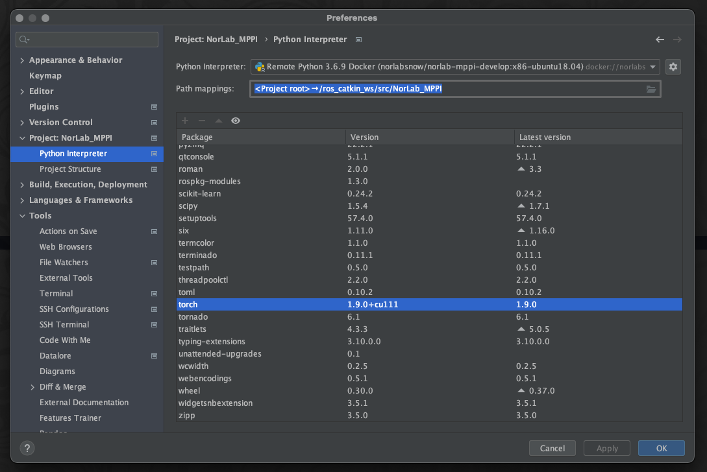

[(return to main menu)](https://github.com/RedLeader962/Dockerized-SNOW)

# Setup PyCharm for local development using a Docker Python interpreter

Note that the procedure to setup PyCharm for full remote development (notably on a Jetson) is different and involve configuring a **remote ssh Python interpreter** (more to follow later in september 2021).

#### Terminology:
- *Docker "**image**"*: a containerized build. Think of it like an object in OO programming
- *Docker "**container**"*: it's an instance of a *Docker image* that we can run
- The _"**host**"_: the computer on which a container is run. Could be *local* or a remote compute box like the Jetson. 
- *"**Dockerhub**"*: it's a repository of docker image from which we pull pre-builded *image*

#### Requirement:
- [ ] *PyCharm Professional* is installed
- [ ] *Docker* is installed on the *host* ( [Follow setp 1. Install Docker](https://github.com/RedLeader962/Dockerized-SNOW/blob/master/how_to_readme/README_x86_architecture.md) )
- [ ] *nvidia-docker2* is installed ( [Follow setp 2. Install NVIDIA CONTAINER TOOLKIT](https://github.com/RedLeader962/Dockerized-SNOW/blob/master/how_to_readme/README_x86_architecture.md) )
- [ ] The *PyCharm* [*Docker support plugin* is enabled]((https://www.jetbrains.com/help/pycharm/docker.html)). (Check menu *Preferences | Build, Execution, Deployment | Docker* )

#### For aditional info, go to:
- [Docker | PyCharm](https://www.jetbrains.com/help/pycharm/docker.html)
- [Configure an interpreter using Docker | PyCharm](https://www.jetbrains.com/help/pycharm/using-docker-as-a-remote-interpreter.html)
- [Docker Docs](https://docs.docker.com/)

# The setup procedure: 
#### Note:  
- We assume that the user already have a *PyCharm project* setup with the source code cloned from `https://github.com/norlab-ulaval/NorLab_MPPI` 
- We assume that this project is located in the *host* computer at `/Users/redleader/PycharmProjects/NorLab_MPPI`
- For the sake of the example, **assume that the host computer has only Python2.7 and does not have PyTorch or ROS installed at all.** 

## Step 1. Check the full name (with tag) of the image you want to use
Let's use `norlabsnow/norlab-mppi-develop:x86-ubuntu18.04`. If this image do not exist on the *host*, just execute in a terminal:
```bash 
sudo docker pull norlabsnow/norlab-mppi-develop:x86-ubuntu18.04
```   

## Step  2. Add a new Python interpreter to your Pycharm project
Go to *Preferences | Project: NorLab_MPPI | Python Interpreter*, click on the **cog** icon  on the left side and select *Add ...*


## Step 3. Configure the *Docker Python* interpreter
In the *Add Python Interpreter* popup window, 
1. **select *Docker* in the left menu** 
2. then in the *Image name* field, select the name of our image from step 1, in our case: `norlabsnow/norlab-mppi-develop:x86-ubuntu18.04`
3. and write in the *Python interpreter path* field: `python3` 

   

## Step 4. Configure the *path mapping* from the the project source code location on the host to where it reside in the container
In the *Preferences | Project: NorLab_MPPI | Python Interpreter* window.
1. Click on the **folder** icon on the left side of the *Path mapping* field  
   
2. In the *Edit Project Path Mapping* popup window, 
   - In the *Local Path*  column (left side), add the *host*  absolute path to the project source code. In our case: `/Users/redleader/PycharmProjects/NorLab_MPPI`
   - In the *Remote Path* colum ()right side,  add `/ros_catkin_ws/src/NorLab_MPPI`

   

## Step 5. Congratulations, your remote Docker python interpreter is ready to use. 
As you can see, our project default interpreter is now a *python3.6* interpreter from our `norlabsnow/norlab-mppi-develop:x86-ubuntu18.04` image and it as *PyTorch 1.9* installed. Dont forget to **click apply**.

**You now have access to the full power of PyCharm tools: code insight, quick doc, refactoring tools, find usage ...**

<br>



<br>

[comment]: <> (***⚠️ | WAIT!!! One last thing***)
<div align="center">
<span style="font-weight: bolder;font-size: x-large;" ><b>⚠️ WAIT!!! One last thing</b></span>
</div>

<br>

## Step 6. Finaly, set *Run/debug Configuration* volume path explicitly (for each run/debug config)
★ | This is a required hack for Dockerized-SNOW to execute run/debug configuration.
1. Open the *Run/Debug Configurations* window at *PyCharm menu | Run | Edit Configurations ...*;
2. Create a new Python run configuration for the `try_pytorch.py` module;
3. Make sure that the *Python Interpreter* field point to our `Remote Python 3.6.9 Docker ...` interpreter created earlier at step 3. Until this point, everything was standard procedure,  now commes the trick;
4. In the *Docker container setting*, click on the **folder** icon on the left side;
5. In the *Edit Docker Container Settings*, click on the **+** icon under *Volume binding*; 
6. In the pop up window, add the same value has in step *4.2.a* and *4.2.b* to *Host path* and to *Container path*;

   


7. You now have access to the **run configuration** tools and more importantly the **debug tools**.

   


[comment]: <> (**You're now ready to conquer the world ... one debug breakpoint at the time**)
<div align="center">
<span style="font-weight: bolder;font-size: x-large;"><b>You're now ready to conquer the world ... one debug breakpoint at the time</b></span>
</div>
<br>
